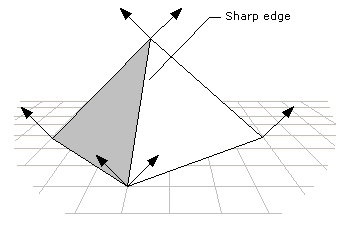

# Face and Vertex Normal Vectors (Direct3D 9)

Each face in a mesh has a perpendicular unit normal vector, as shown in the following illustration. The vector's direction is determined by the order in which the vertices are defined and by whether the coordinate system is right- or left-handed. The face normal points away from the front side of the face. In Direct3D, only the front of a face is visible. A front face is one in which vertices are defined in clockwise order.

Any face that is not a front face is a back face. Direct3D does not always render back faces; therefore, back faces are said to be culled. You can change the culling mode to render back faces if you want. See [Culling State (Direct3D 9)](culling-state.md) for more information.

Direct3D uses the vertex unit normals for Gouraud shading, lighting, and texturing effects. The following illustration shows example normals.

When applying Gouraud shading to a polygon, Direct3D uses the vertex normals to calculate the angle between the light source and the surface. It calculates the color and intensity values for the vertices and interpolates them for every point across all the primitive's surfaces. Direct3D calculates the light intensity value by using the angle. The greater the angle, the less light is shining on the surface.

If you are creating an object that is flat, set the vertex normals to point perpendicular to the surface, as shown in the following illustration.

It is more likely, however, that your object is made up of triangle strips and the triangles are not coplanar. One simple way to achieve smooth shading across all the triangles in the strip is to first calculate the surface normal vector for each polygonal face with which the vertex is associated. The vertex normal can be set to make an equal angle with each surface normal. However, this method might not be efficient enough for complex primitives.

This method is illustrated by the following diagram, which shows two surfaces, S1 and S2 seen edge-on from above. The normal vectors for S1 and S2 are shown in blue. The vertex normal vector is shown in red. The angle that the vertex normal vector makes with the surface normal of S1 is the same as the angle between the vertex normal and the surface normal of S2. When these two surfaces are lit and shaded with Gouraud shading, the result is a smoothly shaded, smoothly rounded edge between them.

If the vertex normal leans toward one of the faces with which it is associated, it causes the light intensity to increase or decrease for points on that surface, depending on the angle it makes with the light source. The following diagram shows an example. Again, these surfaces are seen edge-on. The vertex normal leans toward S1, causing it to have a smaller angle with the light source than if the vertex normal had equal angles with the surface normals.

You can use Gouraud shading to display some objects in a 3D scene with sharp edges. To do so, duplicate the vertex normal vectors at any intersection of faces where a sharp edge is required, as shown in the following illustration.

If you use the DrawPrimitive methods to render your scene, define the object with sharp edges as a triangle list, rather than a triangle strip. When you define an object as a triangle strip, Direct3D treats it as a single polygon composed of multiple triangular faces. Gouraud shading is applied both across each face of the polygon and between adjacent faces. The result is an object that is smoothly shaded from face to face. Because a triangle list is a polygon composed of a series of disjoint triangular faces, Direct3D applies Gouraud shading across each face of the polygon. However, it is not applied from face to face. If two or more triangles of a triangle list are adjacent, they appear to have a sharp edge between them.

Another alternative is to change to flat shading when rendering objects with sharp edges. This is computationally the most efficient method, but it may result in objects in the scene that are not rendered as realistically as the objects that are Gouraud-shaded.

## Related topics

<dl> <dt>

[Coordinate Systems and Geometry](coordinate-systems-and-geometry.md)
</dt> </dl>

 

 

