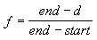

# Fog Formulas (Direct3D 9)

C++ applications can control how fog affects the color of objects in a scene by changing how Microsoft Direct3D computes fog effects over distance. The [**D3DFOGMODE**](./d3dfogmode.md) enumerated type contains members that identify the three fog formulas. All formulas calculate a fog factor as a function of distance, given parameters that your application sets.

## Linear Fog

This is set with the following D3DFOG\_LINEAR equation.

where

-   start is the distance at which fog effects begin.
-   end is the distance at which fog effects no longer increase.
-   d represents depth, or the distance from the viewpoint. For range based fog, the value for d is the distance between the camera position and a vertex. For non-range based fog, the value for d is the absolute value of the Z-coordinate in camera space.

## Exponential Fog

Linear and exponential formulas are supported for both pixel fog and vertex fog.

This is set with the following D3DFOG\_EXP equation.

where

-   e is the base of natural logarithms (approximately 2.71828).
-   density is an arbitrary fog density that can range from 0.0 to 1.0.
-   d represents depth, or the distance from the viewpoint, as stated earlier.

This is set with the following D3DFOG\_EXP2 equation.

where

-   e is the base of natural logarithms as stated above.
-   density is an arbitrary fog density that can range from 0.0 to 1.0 as stated above.
-   d represents depth, or the distance from the viewpoint, as stated above.

> [!Note]  
> The system stores the fog factor in the alpha component of the specular color for a vertex. If your application performs its own transformation and lighting, you can insert fog factor values manually, to be applied by the system during rendering.

 

The following graph shows these formulas, using common values as in the formula parameters.

D3DFOG\_LINEAR is 1.0 at start and 0.0 at end. It is not measured relative to the near or far planes.

When Direct3D calculates fog effects, it uses the fog factor from one of the preceding equations in the following blending equation.

This formula effectively scales the color of the current polygon C by the fog factor f, and adds the product to the fog color C, scaled by the bitwise inverse of the fog factor. The resulting color value is a blend of the fog color and the original color, as a factor of distance. The formula applies to all devices supported in Microsoft DirectX 7.0 and later. For the legacy ramp device, the fog factor scales the diffuse and specular color components, clamped to the range of 0.0 and 1.0, inclusive. The fog factor typically starts at 1.0 for the near plane and decreases to 0.0 at the far plane.

## Related topics

<dl> <dt>

[Fog Types](fog-types.md)
</dt> </dl>

 

 
