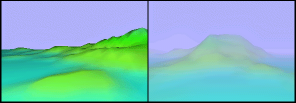

# Fog (Direct3D 9)

Adding fog to a 3D scene can enhance realism, provide ambiance or set a mood, and obscure artifacts sometimes caused when distant geometry comes into view. Direct3D supports two fog models, pixel fog and vertex fog, each with its own features and programming interface.

Essentially, fog is implemented by blending the color of objects in a scene with a chosen fog color based on the depth of an object in a scene or its distance from the viewpoint. As objects grow more distant, their original color blends more and more with the chosen fog color, creating the illusion that the object is being increasingly obscured by tiny particles floating in the scene. The following illustration shows a scene rendered without fog, and a similar scene rendered with fog enabled.

In this illustration, the scene on the left has a clear horizon, beyond which no scenery is visible, even though it would be visible in the real world. The scene on the right obscures the horizon by using a fog color identical to the background color, making polygons appear to fade into the distance. By combining discrete fog effects with creative scene design you can add mood and soften the color of objects in a scene.

Direct3D provides two ways to add fog to a scene: pixel fog and vertex fog, named for how the fog effects are applied. For details, see [Pixel Fog (Direct3D 9)](pixel-fog.md) and [Vertex Fog (Direct3D 9)](vertex-fog.md). In short, pixel fog - also called table fog - is implemented in the device driver and vertex fog is implemented in the Direct3D lighting engine. An application can implement fog with a vertex shader, and pixel fog simultaneously if desired.

> [!Note]  
> Regardless of whether you use pixel or vertex fog, your application must provide a compliant projection matrix to ensure that fog effects are properly applied. This restriction applies even to applications that do not use the Direct3D transformation and lighting engine. For additional details about how you can provide an appropriate matrix, see [Projection Transform (Direct3D 9)](projection-transform.md).

 

The following topics introduce fog and present information about using various fog features in Direct3D applications.

-   [Fog Formulas (Direct3D 9)](fog-formulas.md)
-   [Fog Parameters (Direct3D 9)](fog-parameters.md)
-   [Fog Blending (Direct3D 9)](fog-blending.md)
-   [Fog Color (Direct3D 9)](fog-color.md)
-   [Vertex Fog (Direct3D 9)](vertex-fog.md)
-   [Pixel Fog (Direct3D 9)](pixel-fog.md)

Fog blending is controlled by render states; it is not part of the programmable pixel pipeline.

## Related topics

<dl> <dt>

[Direct3D Rendering](direct3d-rendering.md)
</dt> </dl>

 

 

