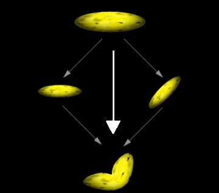
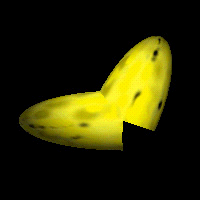
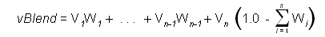
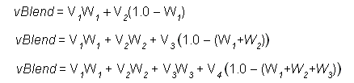

# Geometry Blending (Direct3D 9)

Direct3D enables an application to increase the realism of its scenes by rendering segmented polygonal objects - especially characters - that have smoothly blended joints. These effects are often referred to as skinning. The system achieves this effect by applying additional world transformation matrices to a single set of vertices to create multiple results, and then performing a linear blend between the resultant vertices to create a single set of geometry for rendering. The following illustration of a banana shows this process.



The preceding illustration shows how you might imagine the geometry-blending process. In a single rendering call, the system takes the vertices for the banana, transforms them twice - once without modification, and once with a simple rotation - and blends the results to create a bent banana. The system blends the vertex position, as well as the vertex normal when lighting is enabled. Applications are not limited to two blending paths; Direct3D can blend geometry between as many as four world matrices, including the standard world matrix, [**D3DTS\_WORLD**](d3dts-world.md).

> [!Note]
>
> When lighting is enabled, vertex normals are transformed by a corresponding inverse world-view matrix, weighted in the same way as the vertex position computations. The system normalizes the resulting normal vector if the D3DRS\_NORMALIZENORMALS render state is set to **TRUE**.

 

Without geometry blending, dynamic articulated models are often rendered in segments. For instance, consider a 3D model of the human arm. In the simplest view, an arm has two parts: the upper arm which connects to the body, and the lower arm, which connects to the hand. The two are connected at the elbow, and the lower arm rotates at that point. An application that renders an arm might retain vertex data for the upper and lower arm, each with a separate world transformation matrix. The following code example illustrates this.


```
typedef struct _Arm
{
    VERTEX upper_arm_verts[200];
    D3DMATRIX matWorld_Upper;

    VERTEX lower_arm_verts[200];
    D3DMATRIX matWorld_Lower;
} ARM, *LPARM;

ARM MyArm; // This needs to be initialized.
```


To render the arm, two rendering calls are made, as shown in the following code.


```
// Render the upper arm.
d3dDevice->SetTransform( D3DTS_WORLD, &MyArm.matWorld_Upper );
d3dDevice->DrawPrimitive( D3DPT_TRIANGLELIST, 0, numFaces );

// Render the lower arm, updating its world matrix to articulate
// the arm by pi/4 radians (45 degrees) at the elbow.
MyArm.matWorld_Lower = RotateMyArm(MyArm.matWorld, pi/4);
d3dDevice->SetTransform( D3DTS_WORLD, &MyArm.matWorld_Lower );
d3dDevice->DrawPrimitive( D3DPT_TRIANGLELIST, 0, numFaces );
```


The following illustration is a banana, modified to use this technique.



The differences between the blended geometry and the nonblended geometry are obvious. This example is somewhat extreme. In a real-world application, the joints of segmented models are designed so that seams are not as obvious. However, seams are visible at times, which presents constant challenges for model designers.

Geometry blending in Direct3D presents an alternative to the classic segmented-modeling scenario. However, the improved visual quality of segmented objects comes at the cost of the blending computations during rendering. To minimize the impact of these additional operations, the Direct3D geometry pipeline is optimized to blend geometry with the least possible overhead. Applications that intelligently use the geometry blending services offered by Direct3D can improve the realism of their characters while avoiding serious performance repercussions.

## Blending Transform and Render States

The [**IDirect3DDevice9::SetTransform**](/windows/desktop/api) method recognizes the [**D3DTS\_WORLD**](d3dts-world.md) and [**D3DTS\_WORLDn**](d3dts-worldn.md) macros, which correspond to values that can be defined by the [**D3DTS\_WORLDMATRIX**](d3dts-worldmatrix.md) macro. These macros are used to identify the matrices between which geometry will be blended.

The [**D3DRENDERSTATETYPE**](./d3drenderstatetype.md) enumerated type includes the D3DRS\_VERTEXBLEND render state to enable and control geometry blending. Valid values for this render state are defined by the [**D3DVERTEXBLENDFLAGS**](./d3dvertexblendflags.md) enumerated type. If geometry blending is enabled, the vertex format must include the appropriate number of blending weights.

## Blending Weights

A blending weight, sometimes called a beta weight, controls the extent to which a given world matrix affects a vertex. Blending weights are floating-point values that range from 0.0 to 1.0, encoded in the vertex format, where a value of 0.0 means the vertex is not blended with that matrix, and 1.0 means that the vertex is affected in full by the matrix.

Geometry blending weights are encoded in the vertex format, appearing immediately after the position for each vertex, as described in [Fixed Function FVF Codes (Direct3D 9)](fixed-function-fvf-codes.md). You communicate the number of blending weights in the vertex format by including one of the [FVF constants](d3dfvf.md) in the vertex description that you provide to the rendering methods.

The system performs a linear blend between the weighted results of the blend matrices. The following equation is the complete blending formula.



In the preceding equation, vBlend is the output vertex, the v-elements are the vertices produced by the applied world matrix ([**D3DTS\_WORLDn**](d3dts-worldn.md)). The W elements are the corresponding weight values within the vertex format. A vertex blended between n matrices can have - 1 blending weight values, one for each blending matrix, except the last. The system automatically generates the weight for the last world matrix so that the sum of all weights is 1.0, expressed in sigma notation here. This formula can be simplified for each of the cases supported by Direct3D, which is shown in the following equations.



These are the simplified forms of the complete blending formula for the two, three, and four blend matrix cases.

> [!Note]  
> Although Direct3D includes FVF descriptors to define vertices that contain up to five blending weights, only three can be used in this release of DirectX.

 

Additional information is contained in the following topics.

-   [Using Geometry Blending (Direct3D 9)](using-geometry-blending.md)
-   [Indexed Vertex Blending (Direct3D 9)](indexed-vertex-blending.md)
-   [Vertex Tweening (Direct3D 9)](vertex-tweening.md)

## Related topics

<dl> <dt>

[Vertex Pipeline](vertex-pipeline.md)
</dt> </dl>

 

 
