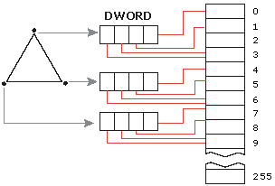
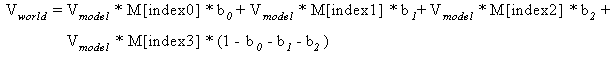

# Indexed Vertex Blending (Direct3D 9)

Indexed vertex blending extends the vertex blending support in Direct3D to allow matrices to be used for blending. These matrices are referred to by using a matrix index. These indices are supplied on a per-vertex basis and refer to a palette of up to 256 matrices. Each index is 8 bits and each vertex can have up to four indices, which allows four matrices to be blended per vertex. The indices are packed into a DWORD. Because indices are specified on a per-vertex basis, up to 12 matrices can affect a single triangle, and any matrix in the palette can affect the vertices of one draw call. This approach has the following advantages.

-   It enables more matrices to affect a single triangle.
-   It enables more blended triangles to be passed in the same draw call.
-   It makes vertex blending independent of triangle indices. This enables progressive meshes to work in conjunction with vertex blending.

One disadvantage of this approach is that it does not work with curved-surface primitives when tessellation occurs before vertex processing.

The following diagram demonstrates how four matrices can affect a vertex. Each vertex has up to four indices, so four matrices can be blended per vertex. The diagram uses the matrices indexed at 0, 2, 5, and 6.

The following diagram demonstrates how up to 12 matrices can affect a triangle. Using indices specified on a per-vertex basis, up to 12 matrices can affect the triangle.

The following equation determines the general case for how matrices effect a vertex.

V model is the input model space vertex position. Index0..Index3 are the per-vertex matrix indices packed into a DWORD. M\[\] is the array of world matrices that get indexed into. b₀..b₂ are the blend weights. Vworld is the output world space vertex position.

For more information about indexed vertex blending, see [Using Indexed Vertex Blending (Direct3D 9)](using-indexed-vertex-blending.md).

## Related topics

<dl> <dt>

[Geometry Blending](geometry-blending.md)
</dt> </dl>

 

 

