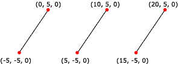

# Line Lists

A line list is a list of isolated, straight line segments. Line lists are useful for such tasks as adding sleet or heavy rain to a 3D scene. Applications create a line list by filling an array of vertices. Note that the number of vertices in a line list must be an even number greater than or equal to two.

The following illustration shows a rendered line list.



You can apply materials and textures to a line list. The colors in the material or texture appear only along the lines drawn, not at any point in between the lines.

The following code shows how to create vertices for this line list.


```
struct CUSTOMVERTEX
{
    float x,y,z;
};

CUSTOMVERTEX Vertices[] = 
{
    {-5.0, -5.0, 0.0},
    { 0.0,  5.0, 0.0},
    { 5.0, -5.0, 0.0},
    {10.0,  5.0, 0.0},
    {15.0, -5.0, 0.0},
    {20.0,  5.0, 0.0}
};
```


The code example below shows how to render a line list in Direct3D 9 using [**IDirect3DDevice9::DrawPrimitive**](/windows/win32/api/d3d9helper/nf-d3d9helper-idirect3ddevice9-drawprimitive).


```
//
// It is assumed that d3dDevice is a valid
// pointer to a IDirect3DDevice9 interface.
//
d3dDevice->DrawPrimitive( D3DPT_LINELIST, 0, 3 );
```


## Related topics

<dl> <dt>

[Primitives](primitives.md)
</dt> </dl>

 

 
