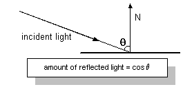
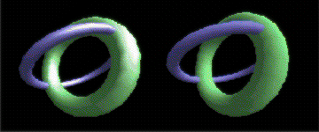

# Materials (Direct3D 9)

Materials describe how polygons reflect light or appear to emit light in a 3D scene. Material properties detail a material's diffuse reflection, ambient reflection, light emission, and specular highlight characteristics. Direct3D uses the [**D3DMATERIAL9**](d3dmaterial9.md) structure to carry all material property information. With the exception of the specular property, each property is described as an RGBA color that represents how much of the red, green, and blue parts of a given type of light it reflects, and an alpha blending factor.

## Diffuse and Ambient Reflection

The Diffuse and Ambient members of the [**D3DMATERIAL9**](d3dmaterial9.md) structure describe how a material reflects the ambient and diffuse light in a scene. Because most scenes contain much more diffuse light than ambient light, diffuse reflection plays the largest part in determining color. Additionally, because diffuse light is directional, the angle of incidence for diffuse light affects the overall intensity of the reflection. Diffuse reflection is greatest when the light strikes a vertex parallel to the vertex normal. As the angle increases, the effect of diffuse reflection diminishes. The amount of light reflected is the cosine of the angle between the incoming light and the vertex normal, as shown in the following illustration.



Ambient reflection, like ambient light, is nondirectional. Ambient reflection has a lesser impact on the apparent color of a rendered object, but it does affect the overall color and is most noticeable when little or no diffuse light reflects off the material. A material's ambient reflection is affected by the ambient light set for a scene by calling the [**IDirect3DDevice9::SetRenderState**](/windows/win32/api/d3d9helper/nf-d3d9helper-idirect3ddevice9-setrenderstate) method with the D3DRS\_AMBIENT flag.

Diffuse and ambient reflection work together to determine the perceived color of an object, and are usually identical values. For example, to render a blue crystalline object, you create a material that reflects only the blue component of diffuse and ambient light. When placed in a room with a white light, the crystal appears to be blue. However, in a room that has only red light, the same crystal would appear to be black, because its material doesn't reflect red light.

## Emission

Materials can be used to make a rendered object appear to be self-luminous. The Emissive member of the [**D3DMATERIAL9**](d3dmaterial9.md) structure is used to describe the color and transparency of the emitted light. Emission affects an object's color and can, for example, make a dark material brighter and take on part of the emitted color.

You can use a material's emissive property to add the illusion that an object is emitting light, without incurring the computational overhead of adding a light to the scene. In the case of the blue crystal, the emissive property is useful if you want to make the crystal appear to light up, but not cast light on other objects in the scene. Remember, materials with emissive properties don't emit light that can be reflected by other objects in a scene. To achieve this reflected light, you need to place an additional light within the scene.

## Specular Reflection

Specular reflection creates highlights on objects, making them appear shiny. The [**D3DMATERIAL9**](d3dmaterial9.md) structure contains two members that describe the specular highlight color as well as the material's overall shininess. You establish the color of the specular highlights by setting the Specular member to the desired RGBA color - the most common colors are white or light gray. The values you set in the Power member control how sharp the specular effects are.

Specular highlights can create dramatic effects. Drawing again on the blue crystal analogy: a larger Power value creates sharper specular highlights, making the crystal appear to be quite shiny. Smaller values increase the area of the effect, creating a dull reflection that make the crystal look frosty. To make an object truly matte, set the Power member to zero and the color in Specular to black. Experiment with different levels of reflection to produce a realistic appearance for your needs. The following illustration shows two identical models. The one on the left uses a specular reflection power of 10; the model on the right has no specular reflection.



## Setting Material Properties

Direct3D rendering devices can render with one set of material properties at a time.

In a C++ application, you set the material properties that the system uses by preparing a [**D3DMATERIAL9**](d3dmaterial9.md) structure, and then calling the [**IDirect3DDevice9::SetMaterial**](/windows/win32/api/d3d9helper/nf-d3d9helper-idirect3ddevice9-setmaterial) method.

To prepare the [**D3DMATERIAL9**](d3dmaterial9.md) structure for use, set the property information in the structure to create the desired effect during rendering. The following code example sets up the **D3DMATERIAL9** structure for a purple material with sharp white specular highlights.


```
D3DMATERIAL9 mat;

// Set the RGBA for diffuse reflection.
mat.Diffuse.r = 0.5f;
mat.Diffuse.g = 0.0f;
mat.Diffuse.b = 0.5f;
mat.Diffuse.a = 1.0f;

// Set the RGBA for ambient reflection.
mat.Ambient.r = 0.5f;
mat.Ambient.g = 0.0f;
mat.Ambient.b = 0.5f;
mat.Ambient.a = 1.0f;

// Set the color and sharpness of specular highlights.
mat.Specular.r = 1.0f;
mat.Specular.g = 1.0f;
mat.Specular.b = 1.0f;
mat.Specular.a = 1.0f;
mat.Power = 50.0f;

// Set the RGBA for emissive color.
mat.Emissive.r = 0.0f;
mat.Emissive.g = 0.0f;
mat.Emissive.b = 0.0f;
mat.Emissive.a = 0.0f;
```


After preparing the [**D3DMATERIAL9**](d3dmaterial9.md) structure, you apply the properties by calling the [**IDirect3DDevice9::SetMaterial**](/windows/win32/api/d3d9helper/nf-d3d9helper-idirect3ddevice9-setmaterial) method of the rendering device. This method accepts the address of a prepared **D3DMATERIAL9** structure as its only parameter. You can call **IDirect3DDevice9::SetMaterial** with new information as needed to update the material properties for the device. The following code example shows how this might look in code.


```
// This code example uses the material properties defined for 
// the mat variable earlier in this topic. The pd3dDev is assumed
// to be a valid pointer to an IDirect3DDevice9 interface.
HRESULT hr;
hr = pd3dDev->SetMaterial(&mat);
if(FAILED(hr))
{
    // Code to handle the error goes here.
}
```


When you create a Direct3D device, the current material is automatically set to the default shown in the following table.


| Member   | Value                |
|----------|----------------------|
| Diffuse  | (R:0, G:0, B:0, A:0) |
| Specular | (R:0, G:0, B:0, A:0) |
| Ambient  | (R:0, G:0, B:0, A:0) |
| Emissive | (R:0, G:0, B:0, A:0) |
| Power    | (0.0)                |


 

## Retrieving Material Properties

You retrieve the material properties that the rendering device is currently using by calling the [**IDirect3DDevice9::GetMaterial**](/windows/desktop/api) method for the device. Unlike the [**IDirect3DDevice9::SetMaterial**](/windows/win32/api/d3d9helper/nf-d3d9helper-idirect3ddevice9-setmaterial) method, **IDirect3DDevice9::GetMaterial** doesn't require preparation. The **IDirect3DDevice9::GetMaterial** method accepts the address of a [**D3DMATERIAL9**](d3dmaterial9.md) structure, and fills the provided structure with information describing the current material properties before returning.


```
// For this example, the pd3dDev variable is assumed to 
// be a valid pointer to an IDirect3DDevice9 interface.
HRESULT hr;
D3DMATERIAL9 mat;

hr = pd3dDev->GetMaterial(&mat);
if(FAILED(hr))
{
    // Code to handle the error goes here.
}
```


> [!Note]  
> If your application does not specify material properties for rendering, the system uses a default material. The default material reflects all diffuse light - white, for example - with no ambient or specular reflection, and no emissive color.

 

## Related topics

<dl> <dt>

[Lights and Materials](lights-and-materials.md)
</dt> </dl>

 

 
