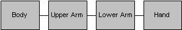
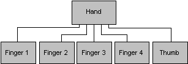

# Matrix Stacks (Direct3D 9)

The D3DX utility library provides the [**ID3DXMATRIXStack**](id3dxmatrixstack.md) interface. It supplies a mechanism to enable matrices to be pushed onto and popped off of a matrix stack. Implementing a matrix stack is an efficient way to track matrices while traversing a transform hierarchy.

The D3DX utility library uses a matrix stack to store transformations as matrices. The various methods of the [**ID3DXMATRIXStack**](id3dxmatrixstack.md) interface deal with the current matrix, or the matrix located on top of the stack. You can clear the current matrix with the [**ID3DXMATRIXStack::LoadIdentity**](id3dxmatrixstack--loadidentity.md) method. To explicitly specify a certain matrix to load as the current transformation matrix, use the [**ID3DXMATRIXStack::LoadMatrix**](id3dxmatrixstack--loadmatrix.md) method. Then you can call either the [**ID3DXMATRIXStack::MultMatrix**](id3dxmatrixstack--multmatrix.md) method or the [**ID3DXMATRIXStack::MultMatrixLocal**](id3dxmatrixstack--multmatrixlocal.md) method to multiply the current matrix by the specified matrix.

The [**ID3DXMATRIXStack::Pop**](id3dxmatrixstack--pop.md) method enables you to return to the previous transformation matrix and the [**ID3DXMATRIXStack::Push**](id3dxmatrixstack--push.md) method adds a transformation matrix to the stack.

The individual matrices on the matrix stack are represented as 4x4 homogeneous matrices, defined by the D3DX utility library [**D3DXMATRIX**](d3dxmatrix.md) structure.

The D3DX utility library provides a matrix stack through a component object model (COM) object.

## Implementing a Scene Hierarchy

A matrix stack simplifies the construction of hierarchical models, in which complicated objects are constructed from a series of simpler objects.

A scene, or transform, hierarchy is usually represented by a tree data structure. Each node in the tree data structure contains a matrix. A particular matrix represents the change in coordinate systems from the node's parent to the node. For example, if you are modeling a human arm, you might implement the hierarchy that is shown in the following diagram.



In this hierarchy, the Body matrix places the body in the world. The UpperArm matrix contains the rotation of the shoulder, the LowerArm matrix contains the rotation of the elbow, and the Hand matrix contains the rotation of the wrist. To determine where the hand is relative to the world, you multiply all the matrices from Body down through Hand together.

The previous hierarchy is overly simplistic, because each node has only one child. If you begin to model the hand in more detail, you will probably add fingers and a thumb. Each digit can be added to the hierarchy as children of Hand, as shown in the following diagram.



If you traverse the complete graph of the arm in depth-first order - traversing as far down one path as possible before moving on to the next path - to draw the scene, you perform a sequence of segmented rendering. For example, to render the hand and fingers, you implement the following pattern.

1.  Push the Hand matrix onto the matrix stack.
2.  Draw the hand.
3.  Push the Thumb matrix onto the matrix stack.
4.  Draw the thumb.
5.  Pop the Thumb matrix off the stack.
6.  Push the Finger 1 matrix onto the matrix stack.
7.  Draw the first finger.
8.  Pop the Finger 1 matrix off the stack.
9.  Push the Finger 2 matrix onto the matrix stack. You continue in this manner until all the fingers and thumb are rendered.

After you have completed rendering the fingers, you would pop the Hand matrix off the stack.

You can follow this basic process in code with the following examples. When you encounter a node during the depth-first search of the tree data structure, push the matrix onto the top of the matrix stack.


```
MatrixStack->Push();

MatrixStack->MultMatrix(pNode->matrix);
```


When you are finished with a node, pop the matrix off the top of the matrix stack.


```
MatrixStack->Pop();
```


In this way, the matrix on the top of the stack always represents the world-transform of the current node. Therefore, before drawing each node, you should set the Direct3D matrix.


```
pD3DDevice->SetTransform(D3DTS_WORLDMATRIX(0), *MatrixStack->GetTop());
```


For more information about the specific methods that you can perform on a D3DX matrix stack, see the [**ID3DXMATRIXStack**](id3dxmatrixstack.md) reference topic.

## Related topics

<dl> <dt>

[Vertex Pipeline](vertex-pipeline.md)
</dt> </dl>

 

 


