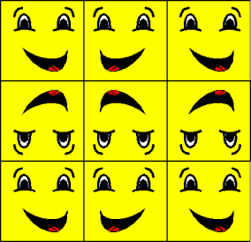

# Mirror Texture Address Mode (Direct3D 9)

The mirror texture address mode, identified by the D3DTADDRESS\_MIRROR member of the [**D3DTEXTUREADDRESS**](./d3dtextureaddress.md) enumerated type, causes Direct3D to mirror the texture at every integer boundary. Suppose, for example, your application creates a square primitive and specifies texture coordinates of (0.0,0.0), (0.0,3.0), (3.0,3.0), and (3.0,0.0). Setting the texture addressing mode to D3DTADDRESS\_MIRROR results in the texture being applied three times in both the u- and v-directions. Every other row and column that it is applied to is a mirror image of the preceding row or column, as shown in the following illustration.

The effects of this texture address mode are similar to, but distinct from, those of the wrap mode. For more information, see [Wrap Texture Address Mode (Direct3D 9)](wrap-texture-address-mode.md).

## Related topics

<dl> <dt>

[Texture Addressing Modes](texture-addressing-modes.md)
</dt> </dl>

 

 
