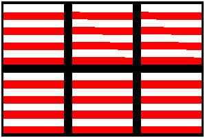
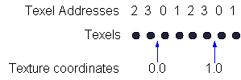

# Nearest-Point Sampling (Direct3D 9)

Applications are not required to use texture filtering. Direct3D can be set so that it computes the texel address, which often does not evaluate to integers, and copies the color of the texel with the closest integer address. This process is called nearest-point sampling. This can be a fast and efficient way to process textures if the size of the texture is similar to the size of the primitive's image on the screen. If not, the texture must be magnified or minified. The result can be a chunky, aliased, or blurred image.

Your C++ application can select nearest-point sampling by calling the [**IDirect3DDevice9::SetSamplerState**](/windows/win32/api/d3d9helper/nf-d3d9helper-idirect3ddevice9-setsamplerstate) method. Set the value of the first parameter to the integer index number (0-7) of the texture for which you are selecting a texture filtering method. Pass D3DSAMP\_MAGFILTER, D3DSAMP\_MINFILTER, or D3DSAMP\_MIPFILTER for the second parameter to set the magnification, minification, or mipmapping filter. Pass D3DTEXF\_POINT in the third parameter.

You should use nearest-point sampling carefully, because it can sometimes cause graphic artifacts when the texture is sampled at the boundary between two texels. This boundary is the position along the texture (u or v) at which the sampled texel transitions from one texel to the next. When point sampling is used, the system chooses one sample texel or the other, and the result can change abruptly from one texel to the next texel as the boundary is crossed. This effect can appear as undesired graphic artifacts in the displayed texture. When linear filtering is used, the resulting texel is computed from both adjacent texels and smoothly blends between them as the texture index moves through the boundary.

This effect can be seen when mapping a very small texture onto a very large polygon: an operation often called magnification. For example, when using a texture that looks like a checkerboard, nearest-point sampling results in a larger checkerboard that shows distinct edges. By contrast, linear texture filtering results in an image where the checkerboard colors vary smoothly across the polygon.

In most cases, applications receive the best results by avoiding nearest-point sample wherever possible. The majority of hardware today is optimized for linear filtering, so your application should not suffer degraded performance. If the effect you desire absolutely requires the use of the nearest-point sampling - such as when using textures to display readable text characters - then your application should be extremely careful to avoid sampling at the texel boundaries, which might result in undesired effects. The following illustration shows what these artifacts can look like.

Notice that the two squares in the upper right of the group appear different than their neighbors, with diagonal offsets running through them. To avoid graphic artifacts like these, you must be familiar with Direct3D texture sampling rules for nearest-point filtering. Direct3D maps a floating-point texture coordinate ranging from \[0.0, 1.0\] (0.0 to 1.0, inclusive) to an integer texel space value ranging from \[ - 0.5, n - 0.5\], where n is the number of texels in a given dimension on the texture. The resulting texture index is rounded to the nearest integer. This mapping can introduce sampling inaccuracies at texel boundaries.

For a simple example, imagine an application that renders polygons with the D3DTADDRESS\_WRAP texture addressing mode. Using the mapping employed by Direct3D, the u texture index maps as show in the following diagram for a texture with a width of 4 texels.

Notice that the texture coordinates, 0.0 and 1.0 for this illustration, are exactly at the boundary between texels. Using the method by which Direct3D maps values, the texture coordinates range from \[ - 0.5, 4 - 0.5\], where 4 is the width of the texture. For this case, the sampled texel is the 0 texel for a texture index of 1.0. However, if the texture coordinate was only slightly less than 1.0, the sampled texel would be the n texel instead of the 0 texel.

The implication of this is that magnifying a small texture using texture coordinates of exactly 0.0 and 1.0 with nearest-point filtering on a screen-space aligned triangle results in pixels for which the texture map is sampled at the boundary between texels. Any inaccuracies in the computation of texture coordinates, however small, results in artifacts along the areas in the rendered image which correspond to the texel edges of the texture map.

Performing this mapping of floating point texture coordinates to integer texels with perfect accuracy is difficult, computationally time-consuming, and generally not necessary. Most hardware implementations use an iterative approach for computing texture coordinates at each pixel location within a triangle. Iterative approaches tend to hide these inaccuracies because the errors are accumulated evenly during iteration.

The Direct3D reference rasterizer uses a direct-evaluation approach for computing texture indexes at each pixel location. Direct evaluation differs from the iterative approach in that any inaccuracy in the operation exhibits a more random error distribution. The result of this is that the sampling errors that occur at the boundaries can be more noticeable because the reference rasterizer does not perform this operation with perfect accuracy.

The best approach is to use nearest-point filtering only when necessary. When you must use it, it is recommended that you offset texture coordinates slightly from the boundary positions to avoid artifacts.

## Related topics

<dl> <dt>

[Texture Filtering](texture-filtering.md)
</dt> </dl>

 

 
