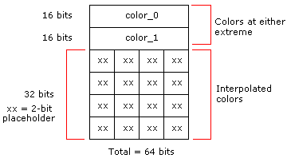
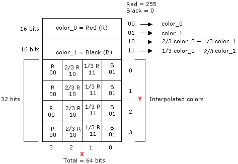
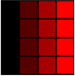
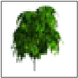
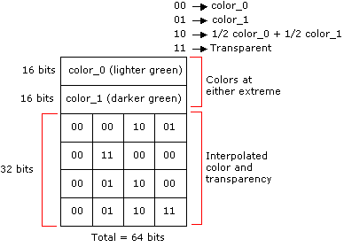

# Opaque and 1-Bit Alpha Textures (Direct3D 9)

Texture format DXT1 is for textures that are opaque or have a single transparent color.

For each opaque or 1-bit alpha block, two 16-bit values (RGB 5:6:5 format) and a 4x4 bitmap with 2 bits per pixel are stored. This totals 64 bits for 16 texels, or four bits per texel. In the block bitmap, there are 2 bits per texel to select between the four colors, two of which are stored in the encoded data. The other two colors are derived from these stored colors by linear interpolation. This layout is shown in the following diagram.



The 1-bit alpha format is distinguished from the opaque format by comparing the two 16-bit color values stored in the block. They are treated as unsigned integers. If the first color is greater than the second, it implies that only opaque texels are defined. This means four colors are used to represent the texels. In four-color encoding, there are two derived colors and all four colors are equally distributed in RGB color space. This format is analogous to RGB 5:6:5 format. Otherwise, for 1-bit alpha transparency, three colors are used and the fourth is reserved to represent transparent texels.

In three-color encoding, there is one derived color and the fourth 2-bit code is reserved to indicate a transparent texel (alpha information). This format is analogous to RGBA 5:5:5:1, where the final bit is used for encoding the alpha mask.

The following code example illustrates the algorithm for deciding whether three- or four-color encoding is selected:


```
if (color_0 > color_1) 
{
    // Four-color block: derive the other two colors.    
    // 00 = color_0, 01 = color_1, 10 = color_2, 11 = color_3
    // These 2-bit codes correspond to the 2-bit fields 
    // stored in the 64-bit block.
    color_2 = (2 * color_0 + color_1 + 1) / 3;
    color_3 = (color_0 + 2 * color_1 + 1) / 3;
}    
else
{ 
    // Three-color block: derive the other color.
    // 00 = color_0,  01 = color_1,  10 = color_2,  
    // 11 = transparent.
    // These 2-bit codes correspond to the 2-bit fields 
    // stored in the 64-bit block. 
    color_2 = (color_0 + color_1) / 2;    
    color_3 = transparent;    

}
```


It is recommended that you set the RGBA components of the transparency pixel to zero before blending.

The following tables show the memory layout for the 8-byte block. It is assumed that the first index corresponds to the y-coordinate and the second corresponds to the x-coordinate. For example, Texel\[1\]\[2\] refers to the texture map pixel at (x,y) = (2,1).

This table contains the memory layout for the 8-byte (64-bit) block.


| Word address | 16-bit word    |
|--------------|----------------|
| 0            | Color\_0       |
| 1            | Color\_1       |
| 2            | Bitmap Word\_0 |
| 3            | Bitmap Word\_1 |


 

Color\_0 and Color\_1, the colors at the two extremes, are laid out as follows:


| Bits        | Color                 |
|-------------|-----------------------|
| 4:0 (LSB\*) | Blue color component  |
| 10:5        | Green color component |
| 15:11       | Red color component   |


 

\*least-significant bit

Bitmap Word\_0 is laid out as follows:


| Bits          | Texel           |
|---------------|-----------------|
| 1:0 (LSB)     | Texel\[0\]\[0\] |
| 3:2           | Texel\[0\]\[1\] |
| 5:4           | Texel\[0\]\[2\] |
| 7:6           | Texel\[0\]\[3\] |
| 9:8           | Texel\[1\]\[0\] |
| 11:10         | Texel\[1\]\[1\] |
| 13:12         | Texel\[1\]\[2\] |
| 15:14 (MSB\*) | Texel\[1\]\[3\] |


 

\*most significant bit (MSB)

Bitmap Word\_1 is laid out as follows:


| Bits        | Texel           |
|-------------|-----------------|
| 1:0 (LSB)   | Texel\[2\]\[0\] |
| 3:2         | Texel\[2\]\[1\] |
| 5:4         | Texel\[2\]\[2\] |
| 7:6         | Texel\[2\]\[3\] |
| 9:8         | Texel\[3\]\[0\] |
| 11:10       | Texel\[3\]\[1\] |
| 13:12       | Texel\[3\]\[2\] |
| 15:14 (MSB) | Texel\[3\]\[3\] |


 

## Example of Opaque Color Encoding

As an example of opaque encoding, assume that the colors red and black are at the extremes. Red is color\_0, and black is color\_1. There are four interpolated colors that form the uniformly distributed gradient between them. To determine the values for the 4x4 bitmap, the following calculations are used:


```
00 ? color_0
01 ? color_1
10 ? 2/3 color_0 + 1/3 color_1
11 ? 1/3 color_0 + 2/3 color_1
```


The bitmap then looks like the following diagram.



This looks like the following illustrated series of colors.

> [!Note]  
> In an image, pixel (0,0) appears on the top left.

 



## Example of 1-Bit Alpha Encoding

This format is selected when the unsigned 16-bit integer, color\_0, is less than the unsigned 16-bit integer, color\_1. An example of where this format can be used is leaves on a tree, shown against a blue sky. Some texels can be marked as transparent while three shades of green are still available for the leaves. Two colors fix the extremes, and the third is an interpolated color.

The following illustration is an example of such a picture.



Note that where the image is shown as white, the texel would be encoded as transparent. Also note that the RGBA components of the transparent texels should be set to zero before blending.

The bitmap encoding for the colors and the transparency is determined using the following calculations.


```
00 ? color_0
01 ? color_1
10 ? 1/2 color_0 + 1/2 color_1
11   ?   Transparent
```


The bitmap then looks like the following diagram.



## Related topics

<dl> <dt>

[Compressed Texture Resources](compressed-texture-resources.md)
</dt> </dl>

 

 


