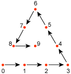
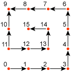

# Patch

Defines a Bézier control patch. The array defines the control points for the patch.

``` syntax
template Patch
{
    < A3EB5D44-FC22-429D-9AFB-3221CB9719A6 >
    DWORD nControlIndices;
    array DWORD controlIndices[nControlIndices];
} 
```

Where:

-   nControlIndices - Number of control point indices.
-   array DWORD controlIndices\[nControlIndices\] - Array of control point indices.

The type of patch is defined by the number of control points, as shown in the following table.


| Number of control points | Type                              |
|--------------------------|-----------------------------------|
| 10                       | Cubic Bézier triangular patch     |
| 15                       | Quartic Bézier triangular patch   |
| 16                       | Cubic Bézier quad rectangle patch |


 

The order of the control points are given in a spiral pattern, as shown in the following diagrams for triangular and rectangular patches.

Triangular patches use the following pattern.



Rectangular patches use the following pattern.



## See also

<dl> <dt>

[Templates](dx9-graphics-reference-x-file-format-templates.md)
</dt> </dl>

 

 


