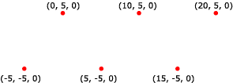

# Point Lists

A point list is a collection of vertices that are rendered as isolated points. Your application can use them in 3D scenes for star fields, or dotted lines on the surface of a polygon.

The following illustration depicts a rendered point list.



Your application can apply materials and textures to a point list. The colors in the material or texture appear only at the points drawn, and not anywhere between the points.

The following code shows how to create vertices for this point list.


```
struct CUSTOMVERTEX
{
    float x,y,z;
};

CUSTOMVERTEX Vertices[] = 
{
    {-5.0, -5.0, 0.0},
    { 0.0,  5.0, 0.0},
    { 5.0, -5.0, 0.0},
    {10.0,  5.0, 0.0},
    {15.0, -5.0, 0.0},
    {20.0,  5.0, 0.0}
};
```


The code example below shows how to render this point list in Direct3D 9 using [**IDirect3DDevice9::DrawPrimitive**](/windows/win32/api/d3d9helper/nf-d3d9helper-idirect3ddevice9-drawprimitive).


```
//
// It is assumed that d3dDevice is a valid
// pointer to a IDirect3DDevice9 interface.
//
d3dDevice->DrawPrimitive( D3DPT_POINTLIST, 0, 6 );
```


## Related topics

<dl> <dt>

[Primitives](primitives.md)
</dt> </dl>

 

 
