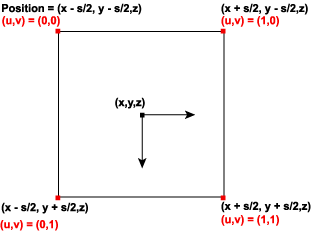

# Point Sprites (Direct3D 9)

Support for point sprites in Direct3D 9 enables the high-performance rendering of points (particle systems). Point sprites are generalizations of generic points that enable arbitrary shapes to be rendered as defined by textures.

-   [Point Primitive Rendering Controls](#point-primitive-rendering-controls)
-   [Point Size Computations](#point-size-computations)
-   [Point Rendering](#point-rendering)

## Point Primitive Rendering Controls

Direct3D 9 supports additional parameters to control the rendering of point sprites (point primitives). These parameters enable points to be of variable size and have a full texture map applied. The size of each point is determined by an application-specified size combined with a distance-based function computed by Direct3D. The application can specify point size either as per-vertex or by setting D3DRS\_POINTSIZE, which applies to points without a per-vertex size. The point size is expressed in camera space units, with the exception of when the application is passing post-transformed flexible vertex format (FVF) vertices. In this case, the distance-based function is not applied and the point size is expressed in units of pixels on the render target.

The texture coordinates computed and used when rendering points depends on the setting of D3DRS\_POINTSPRITEENABLE. When this value is set to **TRUE**, the texture coordinates are set so that each point displays the full texture. In general, this is only useful when points are significantly larger than one pixel. When D3DRS\_POINTSPRITEENABLE is set to **FALSE**, each point's vertex texture coordinate is used for the entire point.

## Point Size Computations

Point size is determined by D3DRS\_POINTSCALEENABLE. If this value is set to **FALSE**, the application-specified point size is used as the screen-space (post-transformed) size. Vertices that are passed to Direct3D in screen space do not have point sizes computed; the specified point size is interpreted as screen-space size.

If D3DRS\_POINTSCALEENABLE is **TRUE**, Direct3D computes the screen-space point size according to the following formula. The application-specified point size is expressed in camera space units.

S ₛ = Vₕ \* S i \* sqrt(1/(A + B \* D ₑ + C \*( D ₑ² )))

In this formula, the input point size, S i, is either per-vertex or the value of the D3DRS\_POINTSIZE render state. The point scale factors, D3DRS\_POINTSCALE\_A, D3DRS\_POINTSCALE\_B, and D3DRS\_POINTSCALE\_C, are represented by the points A, B, and C. The height of the viewport, V ₕ, is the [**D3DVIEWPORT9**](d3dviewport9.md) structure's Height member representing the viewport. D ₑ, the distance from the eye to the position (the eye at the origin), is computed by taking the eye space position of the point (Xₑ, Yₑ, Zₑ) and performing the following operation.

D ₑ = sqrt (Xₑ² + Y ₑ² + Z ₑ²)

The maximum point size, Pₘₐₓ, is determined by taking the smaller of either the [**D3DCAPS9**](/windows/desktop/api/D3D9Caps/ns-d3d9caps-d3dcaps9) structure's MaxPointSize member or the D3DRS\_POINTSIZE\_MAX render state. The minimum point size, Pmin, is determined by querying the value of D3DRS\_POINTSIZE\_MIN. Thus the final screen-space point size, S, is determined in the following manner.

-   If Sₛ > Pₘₐₓ, then S = P ₘₐₓ
-   if S < Pmin, then S = P min
-   Otherwise, S = S ₛ

## Point Rendering

A screen-space point, P = ( X, Y, Z, W), of screen-space size S is rasterized as a quadrilateral of the following four vertices.

(( X + S/2, Y + S/2, Z, W), ( X + S/2, Y - S/2, Z, W), ( X - S/2, Y- S/2, Z, W), ( X - S/2, Y + S/2, Z, W))

The vertex color attributes are duplicated at each vertex; thus each point is always rendered with constant colors.

The assignment of texture indices is controlled by the D3DRS\_POINTSPRITEENABLE render state setting. If D3DRS\_POINTSPRITEENABLE is set to **FALSE**, then the vertex texture coordinates are duplicated at each vertex. If D3DRS\_POINTSPRITEENABLE is set to **TRUE**, then the texture coordinates at the four vertices are set to the following values.

(0.F, 0.F), (0.F, 1.F), (1.F, 0.F), (1.F, 1.F)

This is shown in the following diagram.

When clipping is enabled, points are clipped in the following manner. If the vertex exceeds the range of depth values - MinZ and MaxZ of the [**D3DVIEWPORT9**](d3dviewport9.md) structure - into which a scene is to be rendered, the point exists outside of the view frustum and is not rendered. If the point, taking into account the point size, is completely outside the viewport in X and Y, then the point is not rendered; the remaining points are rendered. It is possible for the point position to be outside the viewport in X or Y and still be partially visible.

Points may or may not be correctly clipped to user-defined clip planes. If D3DPMISCCAPS\_CLIPPLANESCALEDPOINTS is not set in the [**D3DCAPS9**](/windows/desktop/api/D3D9Caps/ns-d3d9caps-d3dcaps9) structure's PrimitiveMiscCaps member, points are clipped to user-defined clip planes based only on the vertex position, ignoring the point size. In this case, scaled points are fully rendered when the vertex position is inside the clip planes, and discarded when the vertex position is outside a clip plane. Applications can prevent potential artifacts by adding a border geometry to clip planes that is as large as the maximum point size.

If the D3DPMISCCAPS\_CLIPPLANESCALEDPOINTS bit is set, then the scaled points are correctly clipped to user-defined clip planes.

Hardware vertex processing may or may not support point size. For example, if a device is created with D3DCREATE\_HARDWARE\_VERTEXPROCESSING on a hardware abstraction layer (HAL) device (D3DDEVTYPE\_HAL) that has the [**D3DCAPS9**](/windows/desktop/api/D3D9Caps/ns-d3d9caps-d3dcaps9) structure's MaxPointSize member set to 1.0 or 0.0, then all points are a single pixel. To render pixel point sprites less than 1.0, you must use either FVF TL (transformed and lit) vertices or software vertex processing (D3DCREATE\_SOFTWARE\_VERTEXPROCESSING), in which case the Direct3D run time emulates the point sprite rendering.

A hardware device that does vertex processing and supports point sprites - MaxPointSize set to greater than 1.0f - is required to perform the size computation for nontransformed sprites and is required to properly set the per-vertex or D3DRS\_POINTSIZED3DRS\_POINTSIZE for TL vertices.

For information about rendering rules for points, lines, and triangles, see [Rasterization Rules (Direct3D 9)](rasterization-rules.md).

## Related topics

<dl> <dt>

[Vertex Pipeline](vertex-pipeline.md)
</dt> </dl>

 

 

