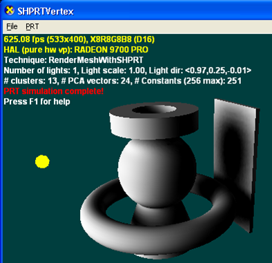
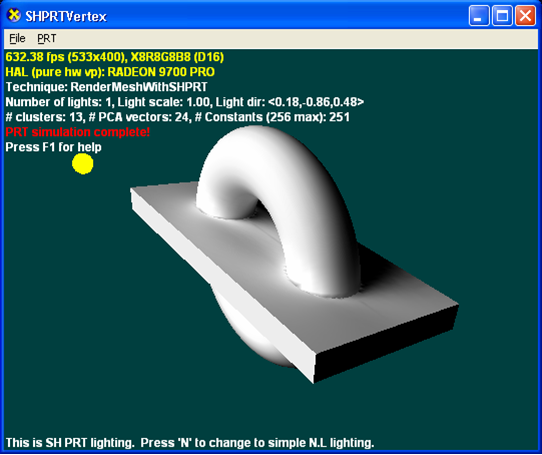
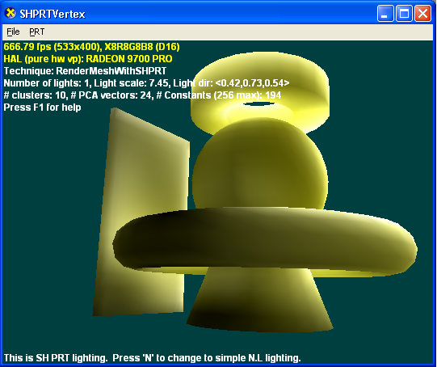
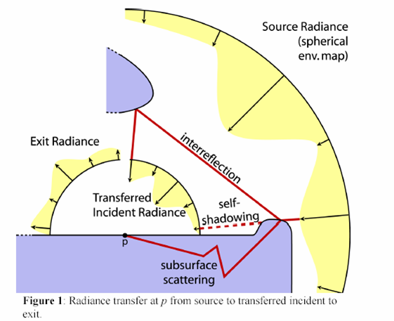
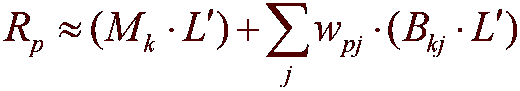

# Precomputed Radiance Transfer (Direct3D 9)

## Using Precomputed Radiance Transfer

There are several forms of complexity present in interesting scenes, including how the lighting environment is modeled (that is, area lighting models versus point/directional ones) and what kind of global effects are modeled (for example, shadows, interreflections, subsurface scattering.) Traditional interactive rendering techniques model a limited amount of this complexity. PRT enables these effects with some significant restrictions:

-   Objects are assumed to be rigid (that is, no deformations).
-   It is an object-centric approach (unless objects are moved together, these global effects are not maintained between them).
-   Only low-frequency lighting is modeled (resulting in soft shadows.) For high-frequency lights (sharp shadows), traditional techniques would have to be employed.

PRT requires either of the following, but not both:

-   highly-tessellated models and vs\_1\_1
-   ps\_2\_0

### Standard Diffuse Lighting versus PRT

The following illustration is rendered using the traditional (n · l) lighting model. Sharp shadows could be enabled using another pass and some form of shadowing technique (shadow depth maps or shadow volumes). Adding multiple lights would require either multiple passes (if shadows are to be used) or more complex shaders with traditional techniques.


The next illustration is rendered with PRT using the best approximation of a single directional light that it can resolve. This results in soft shadows that would be difficult to produce with traditional techniques. Because PRT always models complete lighting environments adding multiple lights or using an environment map, you would only change the values (but not the number) of constants used by the shader.



### PRT with Interreflections

Direct lighting reaches the surface directly from the light. Interreflections are light reaching the surface after bouncing off some other surface some number of times. PRT can model this behavior without changing the performance at run time by simply running the simulator with different parameters.

The following illustration is created using direct PRT only (0 bounces with no interreflections).


The following illustration is created using PRT with interreflections (2 bounces with interreflections).



### PRT with Subsurface Scattering

Subsurface scattering is a technique that models how light passes through certain materials. As an example, press a lit flashlight against the palm of your hand. The light from the flashlight passes through your hand, bounces around (changing color in the process), and exits from the other side of your hand. This can also be modeled with simple changes to the simulator and no changes to the runtime.

The following illustration demonstrates PRT with subsurface scattering.



## How PRT Works

The following terms are useful for understanding how PRT works, as illustrated in the following diagram.

Source Radiance: The source radiance represents the lighting environment as a whole. In PRT an arbitrary environment is approximated using the spherical harmonic basis - this lighting is assumed to be distant relative to the object (the same assumption that is made with environment maps.)

Exit Radiance: Exit radiance is the light leaving from a point on the surface from any possible source (reflected radiance, subsurface scattering, emission).

Transfer Vectors: Transfer vectors map Source Radiance into exit radiance and are precomputed offline using a complex light transport simulation.



PRT factors the rendering process into two stages, as shown in the following diagram:

1.  An expensive light transport simulation precomputes transfer coefficients that can be used at run time.
2.  A relatively lightweight run-time stage first approximates the lighting environment using the spherical harmonic basis, then uses these lighting coefficients and the precomputed transfer coefficients (from stage 1) with a simple shader, resulting in exit radiance (the light leaving the object).


### How to Use the PRT API

1.  Compute the transfer vectors with one of the Compute... methods of [**ID3DXPRTEngine**](id3dxprtengine.md).

    Directly dealing with these transfer vectors requires a significant amount of memory and shader computation. Compression significantly reduces the amount of memory and shader computation required.

    The final lighting values are calculated in a vertex shader that implements the following compressed rendering equation.

    

    Where:

    

    | Parameter      | Description                                                                                                     |
    |----------------|-----------------------------------------------------------------------------------------------------------------|
    | Rₚ             | A single channel of exit radiance at vertex p and is evaluated at every vertex on the mesh.                     |
    | Mₖ             | The mean for cluster k. This is an Order² vector of coefficients.                                               |
    | k              | The cluster ID for vertex p.                                                                                    |
    | L<sup>'</sup>  | The approximation of the source radiance into the SH basis functions. This is an Order² vector of coefficients. |
    | j              | An integer that sums over the number of PCA vectors.                                                            |
    | w<sub>pj</sub> | The jth PCA weight for point p. This is a single coefficient.                                                   |
    | B<sub>kj</sub> | The jth PCA basis vector for cluster k. This is an Order² vector of coefficients.                               |

    

     

    The Extract... methods of [**ID3DXPRTCompBuffer**](id3dxprtcompbuffer.md) provide access to compressed data from the simulation.

2.  Compute the source radiance.

    There are several helper functions in the API to handle a variety of common lighting scenarios.

    

    | Function                                                         | Purpose                                                                                                     |
    |------------------------------------------------------------------|-------------------------------------------------------------------------------------------------------------|
    | [**D3DXSHEvalDirectionalLight**](d3dxshevaldirectionallight.md) | Approximates a conventional directional light.                                                              |
    | [**D3DXSHEvalSphericalLight**](d3dxshevalsphericallight.md)     | Approximates local spherical light sources. (Note that PRT only works with distance lighting environments.) |
    | [**D3DXSHEvalConeLight**](d3dxshevalconelight.md)               | Approximates a distant area light source. An example would be the sun (very small cone angle).              |
    | [**D3DXSHEvalHemisphereLight**](d3dxshevalhemispherelight.md)   | Evaluates a light that is a linear interpolation between two colors (one on each pole of a sphere).         |

    

     

3.  Compute the exit radiance.

    Equation 1 now has to be evaluated at every point using either a vertex or pixel shader. Before the shader can be evaluated, constants have to be precomputed and loaded into the constant table (see the [PRT Demo Sample](https://msdn.microsoft.com/library/Ee418763(v=VS.85).aspx) for details). The shader itself is a straightforward implementation of this equation.

    ```
    struct VS_OUTPUT
    {
        float4 Position   : POSITION;   // vertex position 
        float2 TextureUV  : TEXCOORD0;  // vertex texture coordinates 
        float4 Diffuse    : COLOR0;     // vertex diffuse color
    };

    VS_OUTPUT Output;   
    Output.Position = mul(vPos, mWorldViewProjection);

    float4 vExitR = float4(0,0,0,0);
    float4 vExitG = float4(0,0,0,0);
    float4 vExitB = float4(0,0,0,0);
        
    for (int i=0; i < (NUM_PCA_VECTORS/4); i++) 
    {
       vExitR += vPCAWeights[i] * 
           vClusteredPCA[iClusterOffset+i+1+(NUM_PCA_VECTORS/4)*0];
       vExitG += vPCAWeights[i] * 
           vClusteredPCA[iClusterOffset+i+1+(NUM_PCA_VECTORS/4)*1];
       vExitB += vPCAWeights[i] * 
           vClusteredPCA[iClusterOffset+i+1+(NUM_PCA_VECTORS/4)*2];
    }
       
    float4 vExitRadiance = vClusteredPCA[iClusterOffset];
    vExitRadiance.r += dot(vExitR,1);
    vExitRadiance.g += dot(vExitG,1);
    vExitRadiance.b += dot(vExitB,1);

    Output.Diffuse = vExitRadiance;
    ```

    

## References

For more information about PRT and spherical harmonics, see the following papers:


```
Precomputed Radiance Transfer for Real-Time Rendering in Dynamic, 
Low-Frequency Lighting Environments 
P.-P. Sloan, J. Kautz, J. Snyder
SIGGRAPH 2002 

Clustered Principal Components for Precomputed Radiance Transfer 
P.-P. Sloan, J. Hall, J. Hart, J. Snyder 
SIGGRAPH 2003 

Efficient Evaluation of Irradiance Environment Maps 
P.-P. Sloan 
ShaderX 2,  W. Engel 

Spherical Harmonic Lighting: The Gritty Details 
R. Green 
GDC 2003 

An Efficient Representation for Irradiance Environment Maps 
R. Ramamoorthi, P. Hanrahan 

A Practical Model for Subsurface Light Transport 
H. W. Jensen, S. R. Marschner, M. Levoy, and P. Hanrahan 
SIGGRAPH 2001 

Bi-Scale Radiance Transfer 
P.-P. Sloan, X. Liu, H.-Y. Shum, J. Snyder
SIGGRAPH 2003 

Fast, Arbitrary BRDF Shading for Low-Frequency Lighting Using Spherical 
Harmonics 
J. Kautz, P.-P. Sloan, J. Snyder
12th Eurographics Workshop on Rendering 

Precomputing Interactive Dynamic Deformable Scenes 
D. James, K. Fatahalian 
SIGGRAPH 2003 

All-Frequency Shadows Using Non-linear Wavelet Lighting Approximation 
R. Ng, R. Ramamoorth, P. Hanrahan 
SIGGRAPH 2003 

Matrix Radiance Transfer 
J. Lehtinen, J. Kautz
SIGGRAPH 2003 

Math World 
E. W. Weisstein, Wolfram Research, Inc. 

Quantum Theory of Angular Momentum 
D. A. Varshalovich, A.N. Moskalev, V.K. Khersonskii 
```


## Related topics

<dl> <dt>

[Advanced Topics](advanced-topics.md)
</dt> <dt>

[PRT Equations (Direct3D 9)](prt-equations.md)
</dt> <dt>

[Representing PRT With Textures (Direct3D 9)](representing-prt-with-textures.md)
</dt> <dt>

[**ID3DXPRTBuffer**](id3dxprtbuffer.md)
</dt> <dt>

[**ID3DXPRTCompBuffer**](id3dxprtcompbuffer.md)
</dt> <dt>

[**ID3DXPRTEngine**](id3dxprtengine.md)
</dt> <dt>

[**ID3DXTextureGutterHelper**](id3dxtexturegutterhelper.md)
</dt> <dt>

[Precomputed Radiance Transfer Functions](dx9-graphics-reference-d3dx-functions-prt.md)
</dt> <dt>

[Math Functions](dx9-graphics-reference-d3dx-functions-math.md)
</dt> </dl>

 

 


