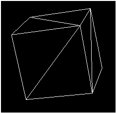
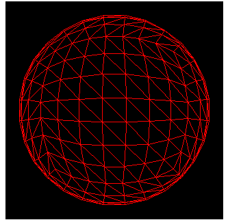

# Primitives (Direct3D 9 Graphics)

A 3D primitive is a collection of vertices that form a single 3D entity. The simplest primitive is a collection of points in a 3D coordinate system, which is called a point list.

Often, 3D primitives are polygons. A polygon is a closed 3D figure delineated by at least three vertices. The simplest polygon is a triangle. Microsoft Direct3D uses triangles to compose most of its polygons because all three vertices in a triangle are guaranteed to be coplanar. Rendering nonplanar vertices is inefficient. You can combine triangles to form large, complex polygons and meshes.

The following illustration shows a cube. Two triangles form each face of the cube. The entire set of triangles forms one cubic primitive. You can apply textures and materials to the surfaces of primitives to make them appear to be a single solid form. For details, see [Materials (Direct3D 9)](materials.md) and [Direct3D Textures (Direct3D 9)](direct3d-textures.md).

You can also use triangles to create primitives whose surfaces appear to be smooth curves. The following illustration shows how a sphere can be simulated with triangles. After a material is applied, the sphere looks curved when it is rendered. This is especially true if you use Gouraud shading. For details, see [Gouraud Shading](shading-modes.md).

Direct3D devices can create and manipulate the following types of primitives.

-   [Point Lists](point-lists.md)
-   [Line Lists](line-lists.md)
-   [Line Strips](line-strips.md)
-   [Triangle Lists](triangle-lists.md)
-   [Triangle Strips](triangle-strips.md)
-   [Triangle Fans (Direct3D 9)](triangle-fans.md)

You can render primitive types from a C++ application with any of the rendering methods of the [**IDirect3DDevice9**](/windows/win32/api/d3d9helper/nn-d3d9helper-idirect3ddevice9) interface.

## Related topics

<dl> <dt>

[Direct3D Devices](direct3d-devices.md)
</dt> </dl>

 

 
