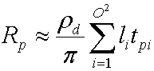
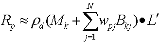

# PRT Equations (Direct3D 9)

To fully understand a shader that implements PRT, it is useful to derive the formula the shader uses to calculate exit radiance.

To start off, the following equation is the general equation to calculate exit radiance resulting from direct lighting on a diffuse object with arbitrary distant lighting.

where:

| Parameter     | Description                                                                                             |
|---------------|---------------------------------------------------------------------------------------------------------|
| Rₚ            | The exit radiance at vertex p. Evaluated at every vertex on the mesh.                                   |
| pd | The albedo of the surface.                                                                              |
| pi            | A constant, used as an energy conservation normalization factor.                                        |
| L(s)          | The lighting environment (source radiance).                                                             |
| Vₚ₍ₛ₎         | A binary visibility function for point p. It is 1 if the point can see the light, 0 if not.             |
| Hₙₚ₍ₛ₎        | The cosine term from Lambert's law. Equal to max((Nₚ· s), 0) where Nₚ is the surface normal at point p. |
| s             | The variable that integrates over the sphere.                                                           |

 

Using spherical basis functions, such as spherical harmonics, the following equation approximates the lighting environment.

where:

| Parameter        | Description                                              |
|------------------|----------------------------------------------------------|
| L(s)             | The lighting environment (source radiance).              |
| i                | An integer that sums over the number of basis functions. |
| O                | The order of spherical harmonics.                        |
| li    | A coefficient.                                           |
| Yi(s) | Some basis function over the sphere.                     |

 

The collection of these coefficients, L', provides the optimal approximation for function L(s) with the basis functions Y(s). Substituting and distributing yields the following equation.

The integral of Yi(s)Vₚ₍ₛ₎Hₙₚ₍ₛ₎ is a transfer coefficient tpi that the simulator precomputes for every vertex on the mesh. Substituting this yields the following equation.

Changing this to vector notation yields the following uncompressed equation to calculate exit radiance for each channel.

where:

| Parameter     | Description                                                                                                                                                                         |
|---------------|-------------------------------------------------------------------------------------------------------------------------------------------------------------------------------------|
| Rₚ            | The exit radiance at vertex p.                                                                                                                                                      |
| pd | The albedo of the surface.                                                                                                                                                          |
| L'            | The vector of li, and is the projection of the source radiance into the spherical harmonic basis functions. This is an order² vector of spherical harmonic coefficients. |
| Tₚ            | An order² transfer vector for vertex p. The simulator divides the transfer coefficients by p.                                                                                       |

 

Both of these vectors are an order² vector of spherical harmonic coefficients, so notice that this is simply a dot product. Depending on the order, the dot can be expensive so compression can be used. An algorithm called Clustered Principal Component Analysis (CPCA) efficiently compresses the data. This enables the use of a higher-order spherical harmonic approximation which results in sharper shadows.

CPCA provides the following equation to approximate the transfer vector.

where:

| Parameter      | Description                                          |
|----------------|------------------------------------------------------|
| Tₚ             | The transfer vector for vertex p.                    |
| Mₖ             | The mean for cluster k.                              |
| j              | An integer that sums over the number of PCA vectors. |
| N              | The number of PCA vectors.                           |
| wpj | The jth PCA weight for point p.                      |
| Bkj | The jth PCA basis vector for cluster k.              |

 

A cluster is simply some number of vertices that share the same mean vector. How to get the cluster mean, the PCA weights, the PCA basis vectors, and the cluster ids for the vertices is discussed below.

Substituting these two equations yields:

Then distributing the dot product yields the following equation.

Because both (Mₖ· L') and (Bkj· L') are constant per vertex, the sample calculates these values with the CPU and passes them as constants into the vertex shader; because wpj changes for each vertex, the sample stores this per-vertex data in the vertex buffer.

## Related topics

<dl> <dt>

[Precomputed Radiance Transfer](precomputed-radiance-transfer.md)
</dt> </dl>

 

 

