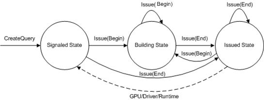

# Queries (Direct3D 9)

There are several types of queries which are designed to query the status of resources. The status of a given resource includes graphics processing unit (GPU) status, driver status, or runtime status. To understand the difference between the different query types, you need to understand the query states. The following state transition diagram explains each of the query states.



The diagram shows three states, each defined by circles. Each of the solid lines are application-driven events that cause a state transition. The dashed line is a resource-driven event that switches a query from the issued state to the signaled state. Each of these states has a different purpose:

-   The signaled state is like an idle state. The query object has been generated and is waiting for the application to issue the query. Once a query has completed and transitioned back to the signaled state, the answer to the query can be retrieved.
-   The building state is like a staging area for a query. From the building state, a query has been issued (by calling [**D3DISSUE\_BEGIN**](d3dissue-begin.md)) but has not yet transitioned to the issued state. When an application issues a query end (by calling [**D3DISSUE\_END**](d3dissue-end.md)), the query transitions to the issued state.
-   The issued state means that the resource being queried has control of the query. Once the resource finishes its work, the resource transitions the state machine to the signaled state. During the issued state, the application must poll to detect the transition to the signaled state. Once the transition to the signaled state occurs, [**GetData**](/windows/win32/api/d3d9helper/nf-d3d9helper-idirect3dquery9-getdata) returns the query result (through an argument) to the application.

The following table lists the available query types.


| Query Type        | Issue Event                                                                      | GetData buffer                                                              | Runtime      | Implicit beginning of query                      |
|-------------------|----------------------------------------------------------------------------------|-----------------------------------------------------------------------------|--------------|--------------------------------------------------|
| BANDWIDTHTIMINGS  | [**D3DISSUE\_BEGIN**](d3dissue-begin.md), [**D3DISSUE\_END**](d3dissue-end.md) | [**D3DDEVINFO\_D3D9BANDWIDTHTIMINGS**](d3ddevinfo-d3d9bandwidthtimings.md) | Retail/Debug | N/A                                              |
| CACHEUTILIZATION  | [**D3DISSUE\_BEGIN**](d3dissue-begin.md), [**D3DISSUE\_END**](d3dissue-end.md) | [**D3DDEVINFO\_D3D9CACHEUTILIZATION**](d3ddevinfo-d3d9cacheutilization.md) | Retail/Debug | N/A                                              |
| EVENT             | [**D3DISSUE\_END**](d3dissue-end.md)                                            | BOOL                                                                        | Retail/Debug | [**CreateDevice**](/windows/win32/api/d3d9/nf-d3d9-idirect3d9-createdevice) |
| INTERFACETIMINGS  | [**D3DISSUE\_BEGIN**](d3dissue-begin.md), [**D3DISSUE\_END**](d3dissue-end.md) | [**D3DDEVINFO\_D3D9INTERFACETIMINGS**](d3ddevinfo-d3d9interfacetimings.md) | Retail/Debug | N/A                                              |
| OCCLUSION         | [**D3DISSUE\_BEGIN**](d3dissue-begin.md), [**D3DISSUE\_END**](d3dissue-end.md) | DWORD                                                                       | Retail/Debug | N/A                                              |
| PIPELINETIMINGS   | [**D3DISSUE\_BEGIN**](d3dissue-begin.md), [**D3DISSUE\_END**](d3dissue-end.md) | [**D3DDEVINFO\_D3D9PIPELINETIMINGS**](d3ddevinfo-d3d9pipelinetimings.md)   | Retail/Debug | N/A                                              |
| RESOURCEMANAGER   | [**D3DISSUE\_END**](d3dissue-end.md)                                            | [**D3DDEVINFO\_ResourceManager**](d3ddevinfo-resourcemanager.md)           | Debug only   | [**Present**](/windows/win32/api/d3d9helper/nf-d3d9helper-idirect3ddevice9-present)     |
| TIMESTAMP         | [**D3DISSUE\_END**](d3dissue-end.md)                                            | UINT64                                                                      | Retail/Debug | N/A                                              |
| TIMESTAMPDISJOINT | [**D3DISSUE\_BEGIN**](d3dissue-begin.md), [**D3DISSUE\_END**](d3dissue-end.md) | BOOL                                                                        | Retail/Debug | N/A                                              |
| TIMESTAMPFREQ     | [**D3DISSUE\_END**](d3dissue-end.md)                                            | UINT64                                                                      | Retail/Debug | N/A                                              |
| VCACHE            | [**D3DISSUE\_END**](d3dissue-end.md)                                            | [**D3DDEVINFO\_VCACHE**](d3ddevinfo-vcache.md)                             | Retail/Debug | [**CreateDevice**](/windows/win32/api/d3d9/nf-d3d9-idirect3d9-createdevice) |
| VERTEXSTATS       | [**D3DISSUE\_END**](d3dissue-end.md)                                            | [**D3DDEVINFO\_D3DVERTEXSTATS**](d3ddevinfo-d3dvertexstats.md)             | Debug only   | [**Present**](/windows/win32/api/d3d9helper/nf-d3d9helper-idirect3ddevice9-present)     |
| VERTEXTIMINGS     | [**D3DISSUE\_BEGIN**](d3dissue-begin.md), [**D3DISSUE\_END**](d3dissue-end.md) | [**D3DDEVINFO\_D3D9STAGETIMINGS**](d3ddevinfo-d3d9stagetimings.md)         | Retail/Debug | N/A                                              |


 

Some of the queries require a begin and end event, while others only require an end event. The queries that only require an end event begin when another implicit event occurs (which is listed in the table). All queries return an answer, except the event query whose answer is always **TRUE**. An application uses either the state of the query or the return code of [**GetData**](/windows/win32/api/d3d9helper/nf-d3d9helper-idirect3dquery9-getdata).

## Create a Query

Before you create a query, you can check to see if the runtime supports queries by calling [**CreateQuery**](/windows/win32/api/d3d9helper/nf-d3d9helper-idirect3ddevice9-createquery) with a **NULL** pointer like this:


```
IDirect3DQuery9* pEventQuery;

// Create a device pointer m_pd3dDevice

// Create a query object
HRESULT hr = m_pd3dDevice->CreateQuery(D3DQUERYTYPE_EVENT, NULL);
```


This method returns a success code if a query can be created; otherwise it returns an error code. Once [**CreateQuery**](/windows/win32/api/d3d9helper/nf-d3d9helper-idirect3ddevice9-createquery) succeeds, you can create a query object like this:


```
IDirect3DQuery9* pEventQuery;
m_pd3dDevice->CreateQuery(D3DQUERYTYPE_EVENT, &pEventQuery);
```


If this call succeeds, a query object is created. The query is essentially idle in the signaled state (with an uninitialized answer) waiting to be issued. When you are finished with the query, release it like any other interface.

## Issue a Query

An application changes a query state by issuing a query. Here is an example of issuing a query:


```
IDirect3DQuery9* pEventQuery;
m_pD3DDevice->CreateQuery(D3DQUERYTYPE_EVENT, &pEventQuery);

// Issue a Begin event
pEventQuery->Issue(D3DISSUE_BEGIN);

or

// Issue an End event
pEventQuery->Issue(D3DISSUE_END);
```


A query in the signaled state will transition like this when issued:


| Issue Type                                | Query Transitions to the . . . |
|-------------------------------------------|--------------------------------|
| [**D3DISSUE\_BEGIN**](d3dissue-begin.md) | Building state.                |
| [**D3DISSUE\_END**](d3dissue-end.md)     | Issued state.                  |


 

A query in the building state will transition like this when issued:


| Issue Type                                | Query Transitions to the . . .                                            |
|-------------------------------------------|---------------------------------------------------------------------------|
| [**D3DISSUE\_BEGIN**](d3dissue-begin.md) | (No transition, stays in the building state. Restarts the query bracket.) |
| [**D3DISSUE\_END**](d3dissue-end.md)     | Issued state.                                                             |


 

A query in the issued state will transition like this when issued:


| Issue Type                                | Query Transitions to the . . .                    |
|-------------------------------------------|---------------------------------------------------|
| [**D3DISSUE\_BEGIN**](d3dissue-begin.md) | Building state and restarts the query bracket.    |
| [**D3DISSUE\_END**](d3dissue-end.md)     | Issued state after abandoning the existing query. |


 

## Check the Query State and Get the Answer to the Query

[**GetData**](/windows/win32/api/d3d9helper/nf-d3d9helper-idirect3dquery9-getdata) does two things:

1.  Returns the query state in the return code.
2.  Returns the answer to the query in *pData*.

From each of the three query states, here are the [**GetData**](/windows/win32/api/d3d9helper/nf-d3d9helper-idirect3dquery9-getdata) return codes:


| Query State | GetData return code |
|-------------|---------------------|
| Signaled    | S\_OK               |
| Building    | Error code          |
| Issued      | S\_FALSE            |


 

For example, when a query is in the issued state and the answer to the query is not available, [**GetData**](/windows/win32/api/d3d9helper/nf-d3d9helper-idirect3dquery9-getdata) returns S\_FALSE. When the resource finishes its work and the application has issued a query end, the resource transitions the query to the signaled state. From the signaled state, **GetData** returns S\_OK which means that the answer to the query is also returned in *pData*. For instance, here is the sequence of events to return the number of pixels (or samples when multisampling is enabled) drawn in a render sequence:

-   Create the query.
-   Issue a begin event.
-   Draw something.
-   Issue an end event.

The following is the corresponding sequence of code:


```
IDirect3DQuery9* pOcclusionQuery;
DWORD numberOfSamplesDrawn;

m_pD3DDevice->CreateQuery(D3DQUERYTYPE_OCCLUSION, &pOcclusionQuery);

// Add an end marker to the command buffer queue.
pOcclusionQuery->Issue(D3DISSUE_BEGIN);

// API render loop
...
Draw(...)
...

// Add an end marker to the command buffer queue.
pOcclusionQuery->Issue(D3DISSUE_END);

// Force the driver to execute the commands from the command buffer.
// Empty the command buffer and wait until the GPU is idle.
while(S_FALSE == pOcclusionQuery->GetData( &numberOfSamplesDrawn, 
                                  sizeof(DWORD), D3DGETDATA_FLUSH ))
    ;

// To get the number of pixels drawn when multisampling is enabled,
// divide numberOfSamplesDrawn by the sample count of the render target.
```


These lines of code do several things:

-   Call [**GetData**](/windows/win32/api/d3d9helper/nf-d3d9helper-idirect3dquery9-getdata) to return the number of pixels/samples drawn.
-   Specify [**D3DGETDATA\_FLUSH**](d3dgetdata-flush.md) to enable the resource to transition the query to the signaled state.
-   Poll the query resource by calling [**GetData**](/windows/win32/api/d3d9helper/nf-d3d9helper-idirect3dquery9-getdata) from a loop. As long as **GetData** returns S\_FALSE, this means the resource has not returned the answer yet.

The return value of [**GetData**](/windows/win32/api/d3d9helper/nf-d3d9helper-idirect3dquery9-getdata) essentially tells you in what state the query is. Possible values are S\_OK, S\_FALSE, and an error. Do not call **GetData** on a query that is in the building state.

-   S\_OK means the resource (GPU or driver, or runtime) is finished. The query is returning to the signaled state. The answer (if any) is being returned by [**GetData**](/windows/win32/api/d3d9helper/nf-d3d9helper-idirect3dquery9-getdata).
-   S\_FALSE means the resource (GPU or driver, or runtime) cannot return an answer yet. This could be because the GPU is not finished or has not seen the work yet.
-   An error means that the query has generated an error from which it cannot recover. This could be the case if the device is lost during a query. Once a query has generated an error (other than S\_FALSE), the query must be recreated which will restart the query sequence from the signaled state.

Instead of specifying [**D3DGETDATA\_FLUSH**](d3dgetdata-flush.md), which provides more up-to-date information, you could supply zero which is a more light-weight check if the query is in the issued state. Supplying zero will cause [**GetData**](/windows/win32/api/d3d9helper/nf-d3d9helper-idirect3dquery9-getdata) to not flush the command buffer. For this reason, care must be taken to avoid infinite loops (see **GetData** for details). Since the runtime queues up work in the command buffer, **D3DGETDATA\_FLUSH** is a mechanism for flushing the command buffer to the driver (and hence the GPU; see [Accurately Profiling Direct3D API Calls (Direct3D 9)](accurately-profiling-direct3d-api-calls.md)). During the command buffer flush, a query may transition to the signaled state.

## Example: An Event Query

An event query does not support a begin event.

-   Create the query.
-   Issue an end event.
-   Poll until the GPU is idle.
-   Issue an end event.


```
IDirect3DQuery9* pEventQuery = NULL;
m_pD3DDevice->CreateQuery(D3DQUERYTYPE_EVENT, &pEventQuery);

// Add an end marker to the command buffer queue.
pEventQuery->Issue(D3DISSUE_END);

// Empty the command buffer and wait until the GPU is idle.
while(S_FALSE == pEventQuery->GetData( NULL, 0, D3DGETDATA_FLUSH ))
    ;

... // API calls

// Add an end marker to the command buffer queue.
pEventQuery->Issue(D3DISSUE_END);

// Force the driver to execute the commands from the command buffer.
// Empty the command buffer and wait until the GPU is idle.
while(S_FALSE == pEventQuery->GetData( NULL, 0, D3DGETDATA_FLUSH ))
    ;
```


This is the sequence of commands an event query uses to profile application programming interface (API) calls (see [Accurately Profiling Direct3D API Calls (Direct3D 9)](accurately-profiling-direct3d-api-calls.md)). This sequence uses markers to help control the amount of work in the command buffer.

Note that applications should pay special attention to the large cost associated with flushing the command buffer because this causes the operating system to switch into kernel mode, thus incurring a sizeable performance penalty. Applications should also be aware of wasting CPU cycles by waiting for queries to complete.

Queries are an optimization to be used during rendering to increase performance. Therefore, it is not beneficial to spend time waiting for a query to finish. If a query is issued and if the results are not yet ready by the time the application checks for them, the attempt at optimizing did not succeed and rendering should continue as normal.

The classic example of this is during Occlusion Culling. Instead of the **while** loop above, an application using queries can implement occlusion culling to check to see if a query had finished by the time it needs the result. If the query has not finished, continue (as a worst-case scenario) as if the object being tested against is not occluded (i.e. it is visible) and render it. The code would look similar to the following.


```
IDirect3DQuery9* pOcclusionQuery = NULL;
m_pD3DDevice->CreateQuery( D3DQUERYTYPE_OCCLUSION, &pOcclusionQuery );

// Add a begin marker to the command buffer queue.
pOcclusionQuery->Issue( D3DISSUE_BEGIN );

... // API calls

// Add an end marker to the command buffer queue.
pOcclusionQuery->Issue( D3DISSUE_END );

// Avoid flushing and letting the CPU go idle by not using a while loop.
// Check if queries are finished:
DWORD dwOccluded = 0;
if( S_FALSE == pOcclusionQuery->GetData( &dwOccluded, sizeof(DWORD), 0 ) )
{
    // Query is not done yet or object not occluded; avoid flushing/wait by continuing with worst-case scenario
    pSomeComplexMesh->Render();
}
else if( dwOccluded != 0 )
{
    // Query is done and object is not occluded.
    pSomeComplexMesh->Render();
}
```


## Related topics

<dl> <dt>

[Advanced Topics](advanced-topics.md)
</dt> </dl>

 

 
