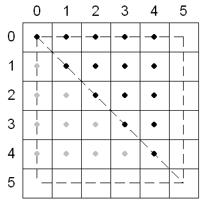
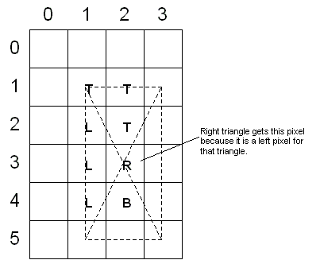
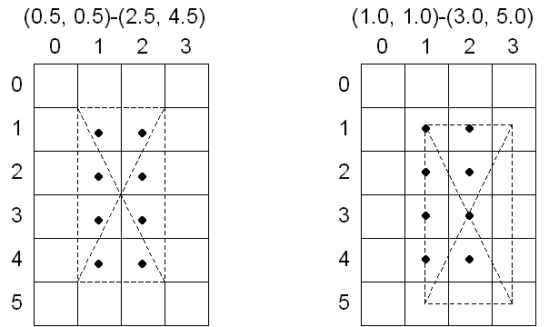

# Rasterization Rules (Direct3D 9)

Often, the points specified for vertices do not precisely match the pixels on the screen. When this happens, Direct3D applies triangle rasterization rules to decide which pixels apply to a given triangle.

-   [Triangle Rasterization Rules](#triangle-rasterization-rules)
-   [Point and Line Rules](#point-and-line-rules)
-   [Point Sprite Rules](#point-sprite-rules)

## Triangle Rasterization Rules

Direct3D uses a top-left filling convention for filling geometry. This is the same convention that is used for rectangles in GDI and OpenGL. In Direct3D, the center of the pixel is the decisive point. If the center is inside a triangle, the pixel is part of the triangle. Pixel centers are at integer coordinates.

This description of triangle-rasterization rules used by Direct3D does not necessarily apply to all available hardware. Your testing may uncover minor variations in the implementation of these rules.

The following illustration shows a rectangle whose upper-left corner is at (0, 0) and whose lower-right corner is at (5, 5). This rectangle fills 25 pixels, just as you would expect. The width of the rectangle is defined as right minus left. The height is defined as bottom minus top.

In the top-left filling convention, *top* refers to the vertical location of horizontal spans, and *left* refers to the horizontal location of pixels within a span. An edge cannot be a top edge unless it is horizontal. In general, most triangles have only left and right edges. The following illustration shows a top edge and a right edge.

The top-left filling convention determines the action taken by Direct3D when a triangle passes through the center of a pixel. The following illustration shows two triangles, one at (0, 0), (5, 0), and (5, 5), and the other at (0, 5), (0, 0), and (5, 5). The first triangle in this case gets 15 pixels (shown in black), whereas the second gets only 10 pixels (shown in gray) because the shared edge is the left edge of the first triangle.

If you define a rectangle with its upper-left corner at (0.5, 0.5) and its lower-right corner at (2.5, 4.5), the center point of this rectangle is at (1.5, 2.5). When the Direct3D rasterizer tessellates this rectangle, the center of each pixel is unambiguously inside each of the four triangles, and the top-left filling convention is not needed. The following illustration shows this. The pixels in the rectangle are labeled according to the triangle in which Direct3D includes them.

If you move the rectangle in the preceding illustration so that its upper-left corner is at (1.0, 1.0), its lower-right corner at (3.0, 5.0), and its center point at (2.0, 3.0), Direct3D applies the top-left filling convention. Most pixels in this rectangle straddle the border between two or more triangles, as the following illustration shows.

For both rectangles, the same pixels are affected, as shown in the following illustration.

## Point and Line Rules

Points are rendered the same as point sprites, which are both rendered as screen-aligned quadrilaterals and thus adhere to the same rules as polygon rendering.

Non-antialiased line rendering rules are exactly the same as those for [GDI lines](../gdi/lines.md).

For information about antialiased line rendering, see [**ID3DXLine**](id3dxline.md).

## Point Sprite Rules

Point sprites and patch primitives are rasterized as if the primitives were first tessellated into triangles and the resulting triangles rasterized. For more information, see [Point Sprites (Direct3D 9)](point-sprites.md).

## Related topics

<dl> <dt>

[Coordinate Systems and Geometry](coordinate-systems-and-geometry.md)
</dt> </dl>

 

 
