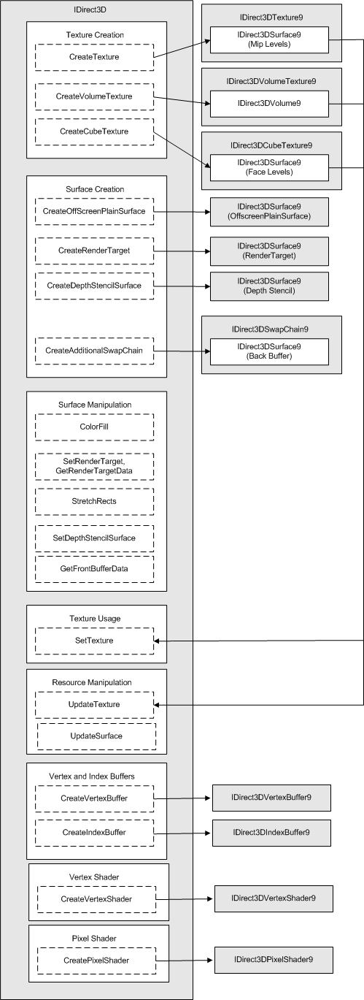

# Resource Relationships (Direct3D 9)

The following diagram shows the operations that are syntactically possible on specific resources and their contents. For more information about how to use resources, see [Manipulating Resources (Direct3D 9)](manipulating-resources.md).

Arrows running from left to right indicate that the target types are created by the given methods, while arrows running from right to left indicate that those resource types can be passed as arguments to the given methods.

## Related topics

<dl> <dt>

[Direct3D Resources](direct3d-resources.md)
</dt> </dl>

 

 

