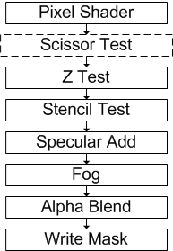

# Scissor Test (Direct3D 9)

The scissor test culls pixels that are outside of the scissor rectangle, a user-defined rectangular sub-section of the render target.

The scissor rectangle could be used to indicate the area of the render target where the game world is drawn. The area outside the rectangle is culled and could be devoted to a game's GUI. The scissor test cannot cull non-rectangular areas.

Scissor rectangles cannot be set larger than the render target, but they can be set larger than the viewport.

The scissor rectangle is managed by a device render state. A scissor test is enabled or disabled by setting the renderstate to **TRUE** or **FALSE**. This test is performed after the fragment color is computed but before alpha testing. [**IDirect3DDevice9::SetRenderTarget**](/windows/desktop/api) resets the scissor rectangle to the full render target, analogous to the viewport reset. [**IDirect3DDevice9::SetScissorRect**](/windows/desktop/api) is recorded by stateblocks, and [**IDirect3DDevice9::CreateStateBlock**](/windows/desktop/api) with the all state setting (D3DSBT\_ALL value in [**D3DSTATEBLOCKTYPE**](./d3dstateblocktype.md)). The scissor test also affects the device [**IDirect3DDevice9::Clear**](/windows/win32/api/d3d9helper/nf-d3d9helper-idirect3ddevice9-clear) operation.


```
// Methods
HRESULT IDirect3DDevice9::SetScissorRect(CONST RECT* pRect); 
HRESULT IDirect3DDevice9::GetScissorRect(RECT* pRect); 

// New RenderState, values are TRUE or FALSE 
D3DRS_SCISSORTESTENABLE 

// New hardware cap 
D3D9CAPS.RasterCaps -> D3DPRASTERCAPS_SCISSORTEST;
```


The default scissor rectangle is the full viewport.

Scissor testing is done just after pixel processing is completed by a pixel shader or the fixed function pipeline, as shown in the following diagram.



## Related topics

<dl> <dt>

[Pixel Pipeline](pixel-pipeline.md)
</dt> </dl>

 

 
