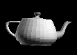
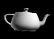

# Shading Modes (Direct3D 9)

The shading mode used to render a polygon has a profound effect on its appearance. Shading modes determine the intensity of color and lighting at any point on a polygon face. Direct3D supports two shading modes.

-   [Flat Shading](#flat-shading)
-   [Gouraud Shading](#gouraud-shading)

## Flat Shading

In the flat shading mode, the Direct3D rendering pipeline renders a polygon, using the color of the polygon material at its first vertex as the color for the entire polygon. 3D objects that are rendered with flat shading have visibly sharp edges between polygons if they are not coplanar.

The following illustration shows a teapot rendered with flat shading. The outline of each polygon is clearly visible. Flat shading is the fastest form of shading.

## Gouraud Shading

When Direct3D renders a polygon using Gouraud shading, it computes a color for each vertex by using the vertex normal and lighting parameters. Then, it interpolates the color across the face of the polygons The interpolation is done linearly. For example, if the red component of the color of vertex 1 is 0.8 and the red component of vertex 2 is 0.4, using the Gouraud shading mode and the RGB color model, the Direct3D lighting module assigns a red component of 0.6 to the pixel at the midpoint of the line between these vertices.

The following illustration demonstrates Gouraud shading. This teapot is composed of many flat, triangular polygons. However, Gouraud shading makes the surface of the object appear curved and smooth.

Gouraud shading can also be used to display objects with sharp edges.

For more information, see [Face and Vertex Normal Vectors (Direct3D 9)](face-and-vertex-normal-vectors.md).

## Related topics

<dl> <dt>

[Shading](shading.md)
</dt> </dl>

 

 

