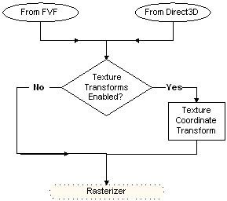

# Texture Coordinate Processing (Direct3D 9)

The following diagram shows the path taken by the texture coordinates from their source, through processing, and to the rasterizer.

There are two sources from which the system can draw texture coordinates. For a given texture stage, you can use texture coordinates included in the vertex format (D3DFVF\_TEX1 through D3DFVF\_TEX8), or you can use texture coordinates automatically generated by Direct3D. For details about the latter case, see [Automatically Generated Texture Coordinates (Direct3D 9)](automatically-generated-texture-coordinates.md). If the D3DTSS\_TEXTURETRANSFORMFLAGS texture stage state for the current texture stage is set to D3DTTFF\_DISABLE (the default setting), input coordinates are not transformed. If D3DTSS\_TEXTURETRANSFORMFLAGS> is set to any other value, the transformation matrix for that stage is applied to the input coordinates.

The [**D3DTEXTURETRANSFORMFLAGS**](./d3dtexturetransformflags.md) enumerated type defines valid values for the D3DTSS\_TEXTURETRANSFORMFLAGS texture-stage state. With the exception of the D3DTTFF\_DISABLE flag, which bypasses texture coordinate transformation, the values defined in this enumeration configure the number of output coordinates that the system passes to the rasterizer. The D3DTTFF\_COUNT1 through D3DTTFF\_COUNT4 flags instruct the system to pass one, two, three, or four elements from the output coordinates to the rasterizer.

The D3DTTFF\_PROJECTED flag is special: it tells the system that the texture coordinates are for a projected texture. Combine the D3DTTFF\_PROJECTED flag with another member of [**D3DTEXTURETRANSFORMFLAGS**](./d3dtexturetransformflags.md) to instruct the rasterizer to divide all the elements by the last element before rasterization takes place. For example, when explicitly using three-element texture coordinates, or when transformation results in a three-element texture coordinate, you can combine the D3DTTFF\_COUNT3 and D3DTTFF\_PROJECTED flags to cause the rasterizer to divide the first two elements by the last, producing 2D texture coordinates required to address a 2D texture.

> [!Note]  
> With the exception of cubic-environment maps and volume textures, rasterizers cannot address textures by using texture coordinates with more than two elements. If you specify more elements than can be used to address the current texture for that stage, the extraneous elements are ignored. This also applies when using 2D texture coordinates for a 1D texture.

 

Additional information is contained in the following topics.

-   [Automatically Generated Texture Coordinates (Direct3D 9)](automatically-generated-texture-coordinates.md)
-   [Texture Coordinate Transformations (Direct3D 9)](texture-coordinate-transformations.md)
-   [Special Effects (Direct3D 9)](special-effects.md)

## Related topics

<dl> <dt>

[Texture Coordinates](texture-coordinates.md)
</dt> </dl>

 

 
