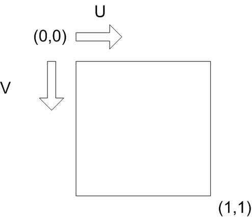
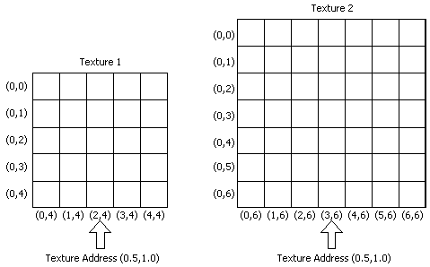
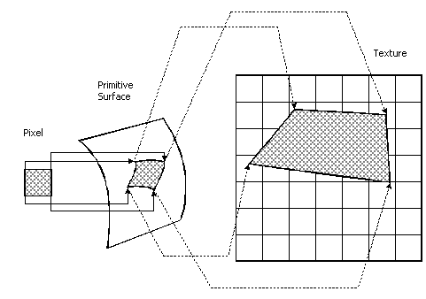
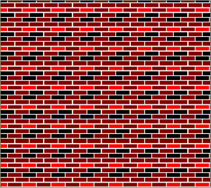

# Texture Coordinates (Direct3D 9)

Most textures, like bitmaps, are a two-dimensional array of color values. Cubic environment map textures are an exception. For details, see [Cubic Environment Mapping (Direct3D 9)](cubic-environment-mapping.md). The individual color values are called a texture element, or texel. Each texel has a unique address in the texture. The address can be thought of as a column and row number, which are labeled u and v respectively in the following illustration.

Texture coordinates are in texture space. That is, they are relative to the location (0,0) in the texture. When a texture is applied to a primitive in 3D space, its texel addresses must be mapped into object coordinates. They must then be translated into screen coordinates, or pixel locations.

## Mapping Texels to Screen Space

Direct3D maps texels in texture space directly to pixels in screen space, skipping the intermediate step for greater efficiency. This mapping process is actually an inverse mapping. That is, for each pixel in screen space, the corresponding texel position in texture space is calculated. The texture color at or around that point is sampled. The sampling process is called texture filtering. For more information, see [Texture Filtering (Direct3D 9)](texture-filtering.md).

Each texel in a texture can be specified by its texel coordinate. However, in order to map texels onto primitives, Direct3D requires a uniform address range for all texels in all textures. Therefore, it uses a generic addressing scheme in which all texel addresses are in the range of 0.0 to 1.0 inclusive. Direct3D applications specify texture coordinates in terms of u,v values, much like 2D Cartesian coordinates are specified in terms of x,y coordinates. Technically, the system can actually process texture coordinates outside the range of 0.0 and 1.0, and does so by using the parameters you set for texture addressing. For more information, see [Texture Addressing Modes (Direct3D 9)](texture-addressing-modes.md).

A result of this is that identical texture addresses can map to different texel coordinates in different textures. In the following illustration, the texture address is (0.5,1.0). However, because the textures are different sizes, the texture address maps to different texels. Texture 1, on the left, is 5x5. The texture address (0.5,1.0) maps to texel (2,4). Texture 2, on the right, is 7x7. The texture address (0.5,1.0) maps to texel (3,6).

A simplified version of the texel mapping process is shown in the following illustration. Admittedly, this example is extremely simple. For more detailed information, see [Directly Mapping Texels to Pixels (Direct3D 9)](directly-mapping-texels-to-pixels.md).

For this example, a pixel, shown at the left of the illustration, is idealized into a square of color. The addresses of the four corners of the pixel are mapped into the 3D primitive in object space. The shape of the pixel is often distorted because of the shape of the primitive in 3D space and because of the viewing angle. The corners of the surface area on the primitive that correspond the corners of the pixel are then mapped into texture space. The mapping process distorts the pixel's shape again, which is common. The final color value of the pixel is computed from the texels in the region to which the pixel maps. You determine the method that Direct3D uses to arrive at the pixel color when you set the texture filtering method. For more information, see [Texture Filtering (Direct3D 9)](texture-filtering.md).

Your application can assign texture coordinates directly to vertices. This capability gives you control over which portion of a texture is mapped into a primitive. For instance, suppose you create a rectangular primitive that is exactly the same size as the texture in the following illustration. In this example, you want your application to map the whole texture onto the whole wall. The texture coordinates your application assigns to the vertices of the primitive are (0.0,0.0), (1.0,0.0), (1.0,1.0), and (0.0,1.0).

If you decide to decrease the height of the wall by one-half, you can distort the texture to fit onto the smaller wall, or you can assign texture coordinates that cause Direct3D to use the lower half of the texture.

If you decide to distort or scale the texture to fit the smaller wall, the texture filtering method that you use will influence the quality of the image. For more information, see [Texture Filtering (Direct3D 9)](texture-filtering.md).

If, instead, you decide to assign texture coordinates to make Direct3D use the lower half of the texture for the smaller wall, the texture coordinates your application assigns to the vertices of the primitive in this example are (0.0,0.5), (1.0,0.5), (1.0,1.0), and (0.0,1.0). Direct3D applies the lower half of the texture to the wall.

It is possible for texture coordinates of a vertex to be greater than 1.0. When you assign texture coordinates to a vertex that are not in the range of 0.0 to 1.0 inclusive, you should also set the texture addressing mode. For more information, see [Texture Addressing Modes (Direct3D 9)](texture-addressing-modes.md).

## Texture Coordinates and Texture Stages

Texture coordinates are associated with textures by way of texture stages. Textures get assigned to texture stages with SetTexture(stageIndex, pTexture). See [**IDirect3DDevice9::SetTexture**](/windows/win32/api/d3d9helper/nf-d3d9helper-idirect3ddevice9-settexture).

A Flexible Vertex Format(FVF) code can define up to eight sets of texture coordinates. The texture coordinate data is furnished by the user in the vertex data. The data is referred to with a zero based index: 0 - 7. There are up to eight texture blending stages. A texture is associated with a particular stage using SetTexture( stageIndex, pTexture).

Once this is done, any set of texture coordinates can be used by any stage. Each set of coordinates is associated with a stage using SetTextureStageState( stageIndex, D3DTSS\_TEXCOORDINDEX, textureCoordinateIndex ). See [**IDirect3DDevice9::SetTextureStageState**](/windows/win32/api/d3d9helper/nf-d3d9helper-idirect3ddevice9-settexturestagestate). This way, the blending stages can be set up to use any texture and any texture coordinates. More than one stage can use the same textures, or texture coordinates.

Additional information is contained in the following topics.

-   [Texture Coordinate Formats (Direct3D 9)](texture-coordinate-formats.md)
-   [Texture Coordinate Processing (Direct3D 9)](texture-coordinate-processing.md)

## Related topics

<dl> <dt>

[Direct3D Textures](direct3d-textures.md)
</dt> </dl>

 

 
