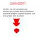
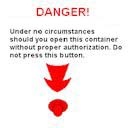
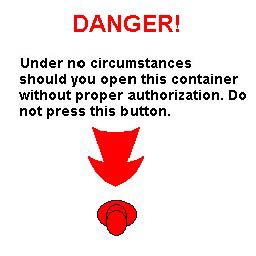

# Texture Filtering with Mipmaps (Direct3D 9)

A mipmap is a sequence of textures, each of which is a progressively lower resolution representation of the same image. The height and width of each image, or level, in the mipmap is a power of two smaller than the previous level. Mipmaps do not have to be square.

A high-resolution mipmap image is used for objects that are close to the user. Lower-resolution images are used as the object appears farther away. Mipmapping improves the quality of rendered textures at the expense of using more memory.

Direct3D represents mipmaps as a chain of attached surfaces. The highest resolution texture is at the head of the chain and has the next level of the mipmap as an attachment. In turn, that level has an attachment that is the next level in the mipmap, and so on, down to the lowest resolution level of the mipmap.

The following illustrations shows an example of these levels. The bitmap textures represent a sign on a container in a 3D first-person game. When created as a mipmap, the highest resolution texture is first in the set. Each succeeding texture in the mipmap set is smaller in height and width by a power of 2. In this case, the maximum-resolution mipmap is 256 pixels by 256 pixels. The next, texture is 128x128. The last texture in the chain is 64x64.

This sign has a maximum distance from which it is visible. If the user begins far away from the sign, the game displays the smallest texture in the mipmap chain, which in this case the 64x64 texture.



As the user moves the point of view closer to the sign, progressively higher-resolution textures in the mipmap chain are used. The resolution in the following illustration is 128x128.



The highest resolution texture is used when the user's point of view is at the minimum allowable distance from the sign, as shown in the following illustration.



This is a more efficient way of simulating perspective for textures. Rather than render a single texture at many resolutions, it is faster to use multiple textures at varying resolutions.

Direct3D can assess which texture in a mipmap set is the closest resolution to the desired output, and it can map pixels into its texel space. If the resolution of the final image is between the resolutions of the textures in the mipmap set, Direct3D can examine texels in both mipmaps and blend their color values together.

To use mipmaps, your application must build a set of mipmaps. Applications apply mipmaps by selecting the mipmap set as the first texture in the set of current textures. For more information, see [Texture Blending (Direct3D 9)](texture-blending.md).

Next, your application must set the filtering method that Direct3D uses to sample texels. The fastest method of mipmap filtering is to have Direct3D select the nearest texel. Use the D3DTEXF\_POINT enumerated value to select this. Direct3D can produce better filtering results if your application uses the D3DTEXF\_LINEAR enumerated value. This selects the nearest mipmap, and then computes a weighted average of the texels surrounding the location in the texture to which the current pixel maps.

Mipmap textures are used in 3D scenes to decrease the time required to render a scene. They also improve the scene's realism. However, they often require large amounts of memory.

## Creating a Set of Mipmaps

The following example shows how your application can call the [**IDirect3DDevice9::CreateTexture**](/windows/win32/api/d3d9helper/nf-d3d9helper-idirect3ddevice9-createtexture) method to build a chain of five mipmap levels: 256x256, 128x128, 64x64, 32x32, and 16x16.


```
// This code example assumes that m_d3dDevice is a
// valid pointer to a IDirect3DDevice9 interface

IDirect3DTexture9 * pMipMap;
m_pD3DDevice->CreateTexture(256, 256, 5, 0, D3DFMT_R8G8B8, 
    D3DPOOL_MANAGED, &pMipMap);
```


The first two parameters that are accepted by [**IDirect3DDevice9::CreateTexture**](/windows/win32/api/d3d9helper/nf-d3d9helper-idirect3ddevice9-createtexture) are the size and width of the top-level texture. The third parameter specifies the number of levels in the texture. If you set this to zero, Direct3D creates a chain of surfaces, each a power of two smaller than the previous one, down to the smallest possible size of 1x1. The fourth parameter specifies the usage for this resource; in this case, 0 is specified to indicate no specific usage for the resource. The fifth parameter specifies the surface format for the texture. Use a value from the [D3DFORMAT](d3dformat.md) enumerated type for this parameter. The sixth parameter specifies a member of the [**D3DPOOL**](./d3dpool.md) enumerated type indicating the memory class into which to place the created resource. Unless you are using dynamic textures, D3DPOOL\_MANAGED is recommended. The final parameter takes the address of a pointer to an [**IDirect3DTexture9**](/windows/win32/api/d3d9helper/nn-d3d9helper-idirect3dtexture9) interface.

> [!Note]  
> Each surface in a mipmap chain has dimensions that are one-half that of the previous surface in the chain. If the top-level mipmap has dimensions of 256x128, the dimensions of the second-level mipmap are 128x64, the third-level are 64x32, and so on, down to 1x1. You cannot request a number of mipmap levels in Levels that would cause either the width or height of any mipmap in the chain to be smaller than 1. In the simple case of a 4x2 top-level mipmap surface, the maximum value allowed for Levels is three. The top-level dimensions are 4x2, the second-level dimensions are 2x1, and the dimensions for the third level are 1x1. A value larger than 3 in Levels results in a fractional value in the height of the second-level mipmap, and is therefore disallowed.

 

## Selecting and Displaying a Mipmap

Call the [**IDirect3DDevice9::SetTexture**](/windows/desktop/api) method to set the mipmap texture set as the first texture in the list of current textures. For more information, see [Texture Blending (Direct3D 9)](texture-blending.md).

After your application selects the mipmap texture set, it must assign values from the [**D3DTEXTUREFILTERTYPE**](./d3dtexturefiltertype.md) enumerated type to the D3DSAMP\_MIPFILTER sampler state. Direct3D then automatically performs mipmap texture filtering. Enabling mipmap texture filtering is demonstrated in the following code example.


```
m_pD3DDevice->SetTexture(0, pMipMap);
m_pD3DDevice->SetSamplerState(0, D3DSAMP_MIPFILTER, D3DTEXF_POINT);
```


Your application can also manually traverse a chain of mipmap surfaces by using the [**IDirect3DTexture9::GetSurfaceLevel**](/windows/win32/api/d3d9helper/nf-d3d9helper-idirect3dtexture9-getsurfacelevel) method and specifying the mipmap level to retrieve. The following example traverses a mipmap chain from highest to lowest resolutions.


```
IDirect3DSurface9 * pSurfaceLevel;
for (int iLevel = 0; iLevel < pMipMap->GetLevelCount(); iLevel++)
{
    pMipMap->GetSurfaceLevel(iLevel, &pSurfaceLevel);
    // Process this level
    pSurfaceLevel->Release();
}
```


Applications need to manually traverse a mipmap chain to load bitmap data into each surface in the chain. This is typically the only reason to traverse the chain. An application can retrieve the number of levels in a mipmap by calling [**IDirect3DBaseTexture9::GetLevelCount**](/windows/win32/api/d3d9helper/nf-d3d9helper-idirect3dbasetexture9-getlevelcount).

## Related topics

<dl> <dt>

[Texture Filtering](texture-filtering.md)
</dt> </dl>

 

 
