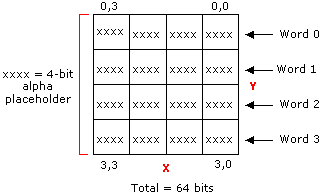

# Textures with Alpha Channels (Direct3D 9)

There are two ways to encode texture maps that exhibit more complex transparency. In each case, a block that describes the transparency precedes the 64-bit block already described. The transparency is either represented as a 4x4 bitmap with 4 bits per pixel (explicit encoding), or with fewer bits and linear interpolation that is analogous to what is used for color encoding.

The transparency block and the color block are arranged as shown in the following table.


| Word address | 64-bit block                      |
|--------------|-----------------------------------|
| 3:0          | Transparency block                |
| 7:4          | Previously described 64-bit block |


 

## Explicit Texture Encoding

For explicit texture encoding (DXT2 and DXT3 formats), the alpha components of the texels that describe transparency are encoded in a 4x4 bitmap with 4 bits per texel. These four bits can be achieved through a variety of means such as dithering or by using the four most significant bits of the alpha data. However they are produced, they are used just as they are, without any form of interpolation.

The following diagram shows a 64-bit transparency block.



> [!Note]  
> The compression method of Direct3D uses the four most significant bits.

 

The following tables illustrate how the alpha information is laid out in memory, for each 16-bit word.

This table contains the layout for word 0.


| Bits          | Alpha      |
|---------------|------------|
| 3:0 (LSB\*)   | \[0\]\[0\] |
| 7:4           | \[0\]\[1\] |
| 11:8          | \[0\]\[2\] |
| 15:12 (MSB\*) | \[0\]\[3\] |


 

\*least-significant bit, most significant bit (MSB)

This table contains the layout for word 1.


| Bits        | Alpha      |
|-------------|------------|
| 3:0 (LSB)   | \[1\]\[0\] |
| 7:4         | \[1\]\[1\] |
| 11:8        | \[1\]\[2\] |
| 15:12 (MSB) | \[1\]\[3\] |


 

This table contains the layout for word 2.


| Bits        | Alpha      |
|-------------|------------|
| 3:0 (LSB)   | \[2\]\[0\] |
| 7:4         | \[2\]\[1\] |
| 11:8        | \[2\]\[2\] |
| 15:12 (MSB) | \[2\]\[3\] |


 

This table contains the layout for word 3.


| Bits        | Alpha      |
|-------------|------------|
| 3:0 (LSB)   | \[3\]\[0\] |
| 7:4         | \[3\]\[1\] |
| 11:8        | \[3\]\[2\] |
| 15:12 (MSB) | \[3\]\[3\] |


 

The difference between DXT2 and DXT3 are that, in the DXT2 format, it is assumed that the color data has been premultiplied by alpha. In the DXT3 format, it is assumed that the color is not premultiplied by alpha. These two formats are needed because, in most cases, by the time a texture is used, just examining the data is not sufficient to determine if the color values have been multiplied by alpha. Because this information is needed at run time, the two FOURCC codes are used to differentiate these cases. However, the data and interpolation method used for these two formats is identical.

The color compare used in DXT1 to determine if the texel is transparent is not used in this format. It is assumed that without the color compare the color data is always treated as if in 4-color mode. In other words, the if statement at the top of the DXT1 code should be the following:


```
if ((color_0 > color_1) OR !DXT1) {
```


## Three-Bit Linear Alpha Interpolation

The encoding of transparency for the DXT4 and DXT5 formats is based on a concept similar to the linear encoding used for color. Two 8-bit alpha values and a 4x4 bitmap with three bits per pixel are stored in the first eight bytes of the block. The representative alpha values are used to interpolate intermediate alpha values. Additional information is available in the way the two alpha values are stored. If alpha\_0 is greater than alpha\_1, then six intermediate alpha values are created by the interpolation. Otherwise, four intermediate alpha values are interpolated between the specified alpha extremes. The two additional implicit alpha values are 0 (fully transparent) and 255 (fully opaque).

The following code example illustrates this algorithm.


```
// 8-alpha or 6-alpha block?    
if (alpha_0 > alpha_1) {    
    // 8-alpha block:  derive the other six alphas.    
    // Bit code 000 = alpha_0, 001 = alpha_1, others are interpolated.
    alpha_2 = (6 * alpha_0 + 1 * alpha_1 + 3) / 7;    // bit code 010
    alpha_3 = (5 * alpha_0 + 2 * alpha_1 + 3) / 7;    // bit code 011
    alpha_4 = (4 * alpha_0 + 3 * alpha_1 + 3) / 7;    // bit code 100
    alpha_5 = (3 * alpha_0 + 4 * alpha_1 + 3) / 7;    // bit code 101
    alpha_6 = (2 * alpha_0 + 5 * alpha_1 + 3) / 7;    // bit code 110
    alpha_7 = (1 * alpha_0 + 6 * alpha_1 + 3) / 7;    // bit code 111  
}    
else {  
    // 6-alpha block.    
    // Bit code 000 = alpha_0, 001 = alpha_1, others are interpolated.
    alpha_2 = (4 * alpha_0 + 1 * alpha_1 + 2) / 5;    // Bit code 010
    alpha_3 = (3 * alpha_0 + 2 * alpha_1 + 2) / 5;    // Bit code 011
    alpha_4 = (2 * alpha_0 + 3 * alpha_1 + 2) / 5;    // Bit code 100
    alpha_5 = (1 * alpha_0 + 4 * alpha_1 + 2) / 5;    // Bit code 101
    alpha_6 = 0;                                      // Bit code 110
    alpha_7 = 255;                                    // Bit code 111
}
```


The memory layout of the alpha block is as follows:


| Byte | Alpha                                                          |
|------|----------------------------------------------------------------|
| 0    | Alpha\_0                                                       |
| 1    | Alpha\_1                                                       |
| 2    | \[0\]\[2\] (2 MSBs), \[0\]\[1\], \[0\]\[0\]                    |
| 3    | \[1\]\[1\] (1 MSB), \[1\]\[0\], \[0\]\[3\], \[0\]\[2\] (1 LSB) |
| 4    | \[1\]\[3\], \[1\]\[2\], \[1\]\[1\] (2 LSBs)                    |
| 5    | \[2\]\[2\] (2 MSBs), \[2\]\[1\], \[2\]\[0\]                    |
| 6    | \[3\]\[1\] (1 MSB), \[3\]\[0\], \[2\]\[3\], \[2\]\[2\] (1 LSB) |
| 7    | \[3\]\[3\], \[3\]\[2\], \[3\]\[1\] (2 LSBs)                    |


 

The difference between DXT4 and DXT5 is that in the DXT4 format it is assumed that the color data has been premultiplied by alpha. In the DXT5 format, it is assumed the color is not premultiplied by alpha. These two formats are needed because, in most cases, by the time a texture is used, just examining the data is not sufficient to determine if the color values have been multiplied by alpha. Because this information is needed at run time, the two FOURCC codes are used to differentiate these cases. However, the data and interpolation method used for these two formats is identical.

The color compare used in DXT1 to determine if the texel is transparent is not used with these formats. It is assumed that without the color compare the color data is always treated as if in 4-color mode. In other words, the if statement at the top of the DXT1 code should be:


```
if ((color_0 > color_1) OR !DXT1) {
```


## Related topics

<dl> <dt>

[Compressed Texture Resources](compressed-texture-resources.md)
</dt> </dl>

 

 


