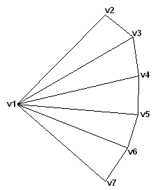
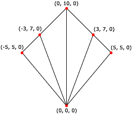

# Triangle Fans (Direct3D 9)

A triangle fan is similar to a triangle strip, except that all the triangles share one vertex, as shown in the following illustration.



The system uses vertices v2, v3, and v1 to draw the first triangle; v3, v4, and v1 to draw the second triangle; v4, v5, and v1 to draw the third triangle; and so on. When flat shading is enabled, the system shades the triangle with the color from its first vertex.

The following illustration depicts a rendered triangle fan.



The following code shows how to create vertices for this triangle fan.


```
struct CUSTOMVERTEX
{
    float x,y,z;
};

CUSTOMVERTEX Vertices[] = 
{
    { 0.0, 0.0, 0.0},
    {-5.0, 5.0, 0.0},
    {-3.0,  7.0, 0.0},
    { 0.0, 10.0, 0.0},
    { 3.0,  7.0, 0.0},
    { 5.0,  5.0, 0.0},
};
```


The code example below shows how to render this triangle fan in Direct3D 9 using [**IDirect3DDevice9::DrawPrimitive**](/windows/win32/api/d3d9helper/nf-d3d9helper-idirect3ddevice9-drawprimitive).


```
//
// It is assumed that d3dDevice is a valid
// pointer to a IDirect3DDevice9 interface.
//
d3dDevice->DrawPrimitive( D3DPT_TRIANGLEFAN, 0, 4 );
```


Triangle fans are not supported in Direct3D 10 or later.

## Related topics

<dl> <dt>

[Primitives](primitives.md)
</dt> </dl>

 

 
