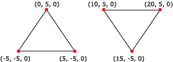

# Triangle Lists

A triangle list is a list of isolated triangles. They might or might not be near each other. A triangle list must have at least three vertices and the total number of vertices must be divisible by three.

Use triangle lists to create an object that is composed of disjoint pieces. For instance, one way to create a force-field wall in a 3D game is to specify a large list of small, unconnected triangles. Then apply a material and texture that appears to emit light to the triangle list. Each triangle in the wall appears to glow. The scene behind the wall becomes partially visible through the gaps between the triangles, as a player might expect when looking at a force field.

Triangle lists are also useful for creating primitives that have sharp edges and are shaded with Gouraud shading. See [Face and Vertex Normal Vectors (Direct3D 9)](face-and-vertex-normal-vectors.md).

The following illustration depicts a rendered triangle list.



The following code shows how to create vertices for this triangle list.


```
struct CUSTOMVERTEX
{
    float x,y,z;
};

CUSTOMVERTEX Vertices[] = 
{
    {-5.0, -5.0, 0.0},
    { 0.0,  5.0, 0.0},
    { 5.0, -5.0, 0.0},
    {10.0,  5.0, 0.0},
    {15.0, -5.0, 0.0},
    {20.0,  5.0, 0.0}

};
```


The code example below shows how to render this triangle list in Direct3D 9 using [**IDirect3DDevice9::DrawPrimitive**](/windows/win32/api/d3d9helper/nf-d3d9helper-idirect3ddevice9-drawprimitive).


```
//
// It is assumed that d3dDevice is a valid
// pointer to a IDirect3DDevice9 interface.
//
d3dDevice->DrawPrimitive( D3DPT_TRIANGLELIST, 0, 2 );
```


You can also use triangle strips to render triangles that are not connected to one another. To do this, specify a degenerate triangle (that is, a triangle with zero size) in the list; this will create a line between the two triangles which will not appear during rendering. For example, to render only the first and last triangle from the previous example, initialize the vertex buffer with the following vertices:


```
CUSTOMVERTEX Vertices[] =
{
    {-5.0, -5.0, 0.0},
    { 0.0,  5.0, 0.0},
    { 5.0, -5.0, 0.0},
    { 5.0, -5.0, 0.0}, // degenerate triangle
    {10.0,  5.0, 0.0}, // degenerate triangle
    {10.0,  5.0, 0.0},
    {15.0, -5.0, 0.0},
    {20.0,  5.0, 0.0}
};
```


## Related topics

<dl> <dt>

[Primitives](primitives.md)
</dt> </dl>

 

 
