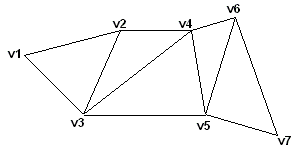
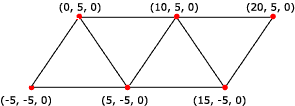

# Triangle Strips

A triangle strip is a series of connected triangles. Because the triangles are connected, the application does not need to repeatedly specify all three vertices for each triangle. For example, you need only seven vertices to define the following triangle strip.



The system uses vertices v1, v2, and v3 to draw the first triangle; v2, v4, and v3 to draw the second triangle; v3, v4, and v5 to draw the third; v4, v6, and v5 to draw the fourth; and so on. Notice that the vertices of the second and fourth triangles are out of order; this is required to make sure that all the triangles are drawn in a clockwise orientation.

Most objects in 3D scenes are composed of triangle strips. This is because triangle strips can be used to specify complex objects in a way that makes efficient use of memory and processing time.

The following illustration depicts a rendered triangle strip.



The following code shows how to create vertices for this triangle strip.


```
struct CUSTOMVERTEX
{
float x,y,z;
};

CUSTOMVERTEX Vertices[] = 
{
    {-5.0, -5.0, 0.0},
    { 0.0,  5.0, 0.0},
    { 5.0, -5.0, 0.0},
    {10.0,  5.0, 0.0},
    {15.0, -5.0, 0.0},
    {20.0,  5.0, 0.0}
};
```


The code example below shows how to render this triangle strip in Direct3D 9 using [**IDirect3DDevice9::DrawPrimitive**](/windows/win32/api/d3d9helper/nf-d3d9helper-idirect3ddevice9-drawprimitive).


```
//
// It is assumed that d3dDevice is a valid
// pointer to a IDirect3DDevice9 interface.
//
d3dDevice->DrawPrimitive( D3DPT_TRIANGLESTRIP, 0, 4);
```


Use a triangle strip to render triangles that are not connected to one another. To do this, specify a degenerate triangle (that is, a triangle whose area is zero) in the triangle list. This creates a line between the two triangles which will not render. To render only the first and last triangles from the previous example, modify the vertex buffer as shown here:


```
CUSTOMVERTEX Vertices[] =
{
    {-5.0, -5.0, 0.0},
    { 0.0,  5.0, 0.0},
    { 5.0, -5.0, 0.0},
    { 5.0, -5.0, 0.0}, // degenerate triangle
    {10.0,  5.0, 0.0}, // degenerate triangle
    {10.0,  5.0, 0.0},
    {15.0, -5.0, 0.0},
    {20.0,  5.0, 0.0}
};
```


## Related topics

<dl> <dt>

[Primitives](primitives.md)
</dt> </dl>

 

 
