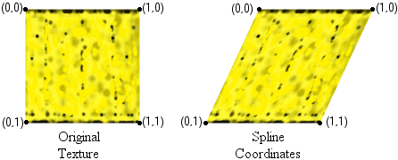
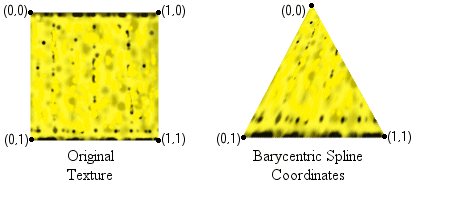

# Using Higher-Order Primitives (Direct3D 9)

This section shows you how to use higher-order primitives in your application.

-   [Determining Higher-Order Primitive Support](#determining-higher-order-primitive-support)
-   [Drawing Patches](#drawing-patches)
-   [Generating Normals and Texture Coordinates](#generating-normals-and-texture-coordinates)

## Determining Higher-Order Primitive Support

The [**D3DCAPS9**](/windows/desktop/api/D3D9Caps/ns-d3d9caps-d3dcaps9) structure's DevCaps member can be queried to determine the level of support for operations involving higher-order primitives. The following table lists the device capabilities related to higher-order primitives in Direct3D 9.

| Device capability             | Description                                                                                                                                                  |
|-------------------------------|--------------------------------------------------------------------------------------------------------------------------------------------------------------|
| D3DDEVCAPS\_NPATCHES          | Device supports N-patches and is based on [Curved PN Triangles](https://alex.vlachos.com/graphics/CurvedPNTriangles.pdf) (a special kind of cubic Bézier triangles). |
| D3DDEVCAPS\_QUINTICRTPATCHES  | Device supports quintic Bezier curves and B-splines.                                                                                                         |
| D3DDEVCAPS\_RTPATCHES         | Device supports rectangular and triangular patches (RT-patches).                                                                                             |
| D3DDEVCAPS\_RTPATCHHANDLEZERO | RT-patches might be drawn efficiently using handle zero.                                                                                                     |

 

Note that D3DDEVCAPS\_RTPATCHHANDLEZERO does not mean that a patch with handle zero can be drawn. A handle zero patch can always be drawn, whether this device capability is set or not. When this capability is set, the hardware architecture does not require caching of any information and that uncached patches (handle zero) be drawn as efficiently as cached ones.

## Drawing Patches

Direct3D 9 supports two types of higher-order primitives, or patches. These are referred to as N-Patches and Rect/Tri patches. N-patches can be rendered using any triangle rendering call by enabling N-patches through the call to [**IDirect3DDevice9::SetNPatchMode**](/windows/win32/api/d3d9helper/nf-d3d9helper-idirect3ddevice9-setnpatchmode)( nSegments ) with nSegments value greater than 1.0. Rect/Tri patches must be rendered using the following explicit entry points.

You can use the following methods to draw patches.

-   [**IDirect3DDevice9::DrawRectPatch**](/windows/win32/api/d3d9helper/nf-d3d9helper-idirect3ddevice9-drawrectpatch). To better understand how the patch data is referenced in the vertex buffer, see [**D3DRECTPATCH\_INFO**](d3drectpatch-info.md).
-   [**IDirect3DDevice9::DrawTriPatch**](/windows/desktop/api). To better understand how the patch data is referenced in the vertex buffer, see [**D3DTRIPATCH\_INFO**](d3dtripatch-info.md).

[**IDirect3DDevice9::DrawRectPatch**](/windows/win32/api/d3d9helper/nf-d3d9helper-idirect3ddevice9-drawrectpatch) draws a rectangular high-order patch specified by the pRectPatchInfo parameter using the currently set streams. The Handle parameter is used to associate the patch with a handle, so that the next time the patch is drawn, there is no need to respecify pRectPatchInfo. This makes it possible to precompute and cache forward difference coefficients or other information, which in turn enables subsequent calls to **IDirect3DDevice9::DrawRectPatch** using the same handle to run efficiently.

It is intended that for static patches, an application would set the vertex shader and appropriate streams, supply patch information in the pRectPatchInfo parameter, and specify a handle so that Direct3D can capture and cache information. The application can then call [**IDirect3DDevice9::DrawRectPatch**](/windows/win32/api/d3d9helper/nf-d3d9helper-idirect3ddevice9-drawrectpatch) subsequently with pRectPatchInfo set to **NULL** to efficiently draw the patch. When drawing a cached patch, the currently set streams are ignored. However, it is possible to override the cached pNumSegs by specifying new values for pNumSegs. Also, it is required to set the same vertex shader when rendering a cached patch as was set when it was captured.

For dynamic patches, the patch data changes for every rendering of the patch, so it is not efficient to cache information. The application can convey this to Direct3D by setting Handle to 0. In this case, Direct3D draws the patch using the currently set streams and the pNumSegs values and does not cache any information. It is not valid to simultaneously set Handle to 0 and pPatch to **NULL**.

By respecifying pRectPatchInfo for the same handle, the application can overwrite the previously cached information.

[**IDirect3DDevice9::DrawTriPatch**](/windows/desktop/api) is similar to [**IDirect3DDevice9::DrawRectPatch**](/windows/win32/api/d3d9helper/nf-d3d9helper-idirect3ddevice9-drawrectpatch) except that it draws a triangular high-order patch.

## Generating Normals and Texture Coordinates

If you are using a flexible vertex format (FVF) shader, automatic generation of normals and texture coordinates is not possible.

For normals, you can either directly supply them or have Direct3D calculate them for you.

The coordinates generated for rectangular patches are spline-based coordinates, as shown in the following illustrations.

The coordinates generated for triangular patches are barycentric spline-based coordinates, as shown in the following illustrations.

If an application must change the range of the generated texture coordinates, this can be done using texture transforms.

## Related topics

<dl> <dt>

[Higher-Order Primitives](higher-order-primitives.md)
</dt> </dl>

 

 
