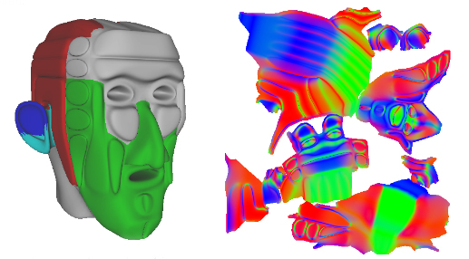

# Using UVAtlas (Direct3D 9)

> [!NOTE]
> UVAtlas was originally shipped in the now-deprecated D3DX9 utilty library. The latest version is available at [UV Atlas Command-Line Tool (uvatlas.exe)](https://github.com/Microsoft/UVAtlas).

Many rendering and content generation techniques require a unique, non-overlapping map of a 2D signal (such as a texture) onto a mesh. Such techniques include:

-   Normal/displacement mapping
-   Texture-space PRT simulations and light maps
-   Surface painting
-   Texture-space lighting

Generating a unique UV mapping manually is often time-consuming and tedious; this is especially true when the input geometry is complex and efficient/low-distortion texture-space utilization is desired. The following illustration shows an example mesh and its corresponding texture atlas.



This example shows a mesh (on the left) and the corresponding UV-space normal map (on the right). Notice that the texture atlas contains several groups or clusters of data; each cluster is called a chart and in the example above, displays contains the normal data for a portion of the mesh.

The D3DX UVAtlas APIs automatically generate an optimal, non-overlapping texture atlas. The APIs provide input parameters that allow you to:

-   Minimize texture stretch, distortion, and undersampling.
-   Maximize texture-space packing density for efficient use of memory.
-   Provide an even sampling across the mesh, minimizing discontinuities in sampling frequency.

## How UVAtlas Works

The UVAtlas APIs (see [UVAtlas Functions](dx9-graphics-reference-d3dx-functions-uvatlas.md)) generate a texture atlas by partitioning a surface into charts and packing the charts into a texture atlas. Use [**D3DXUVAtlasPartition**](d3dxuvatlaspartition.md) and [**D3DXUVAtlasPack**](d3dxuvatlaspack.md) to perform these steps separately; or use [**D3DXUVAtlasCreate**](d3dxuvatlascreate.md) to partition, parameterize and pack in a single call.

-   [Partitioning and Parameterizing a Mesh](#partitioning-and-parameterizing-a-mesh)
-   [Using Integrated Metric Tensors to Control Parameterization](#using-integrated-metric-tensors-to-control-parameterization)
-   [Using Adjacency Data for User Specified Creases](#using-adjacency-data-for-user-specified-creases)
-   [Packing Charts Into an Atlas](#packing-charts-into-an-atlas)

### Partitioning and Parameterizing a Mesh

First, the mesh is partitioned into charts, then each chart is parameterized into its own \[0,1\] UV-space. A cylinder can be parameterized by one chart; a sphere on the other hand will require two charts, as shown in the following illustration.


A mesh which can be parameterized with a single chart is classified as "homeomorphic to a disk", meaning you could spread out an infinitely flexible, infinitely stretchable disk over the chart and cover the geometry perfectly. This stretching, called a homeomorphism, is a bidirectional function; which means you can go from one parameterization to the other without losing information.

Very few real-world meshes can be parameterized into two dimensions without separating the mesh into clusters, or charts. The following illustration shows another example mesh and its corresponding texture atlas.


There are two parameters that determine the number of charts created:

-   The maximum number of charts allowed for the atlas
-   The maximum amount of stretch allowed for each chart

The amount of stretch will determine the number of charts that are generated, and the overall quality of the sampling. Stretch ranges from 0.0 (no stretch) to 1.0 (any amount of stretch). D3DXUVAtlasCreate and D3DXUVAtlasPartition return the maximum stretch generated by the algorithm. The following illustration shows another example mesh and its corresponding texture atlas.


### Using Integrated Metric Tensors to Control Parameterization

Texture-space prioritization can be specified on a per-triangle basis. Integrated Metric Tensors can be provided to control how triangles are stretched in the resulting texture-space atlas. IMT's can be specified directly or computed based on an input signal using the D3DX IMT computation functions. An integrated metric tensor (or IMT) is a symmetrical 2x2 matrix that describes how a triangle is stretched in the atlas. Each IMT is defined by 3 floats, call them (a,b,c). They can be arranged in a symmetric 2x2 matrix like this:


```
a b
b c
```


Then the IMT can be used to find the distance between two vectors. Given two vectors v1 and v2, where :


```
vector v1
vector v2 = v1 + (s,t)
```


The distance between v1 and v2 can be calculated as:


```
sqrt((s, t) * M * (s, t)^T)
```


In other words, the vector (s,t) could be the magnitude of the stretch in an arbitrary direction in u-v space. In this case, the s vector is a direction from the first to the second vertex, and t is the cross product of the normal and s. For instance:


```
(1,1) * (1,1) = (2,2)
        (1,1)
IMT(1,1,1) scales by 2
```


```
(1,-1) * (1,1) = (0,0)
         (1,1)
IMT(2,0,2) scales by 2 with no shearing
```


IMT's can be specified directly or computed based on an input signal using the D3DX IMT computation functions: D3DXComputeIMTFromPerVertexSignal, D3DXComputeIMTFromPerTexelSignal, D3DXComputeIMTFromSignal, and D3DXComputeIMTFromTexture\_graphics.

Specify IMT data directly if you want to control how texture-space is allocated to individual triangles. By doing so, allocate more area in the atlas to important areas of a mesh (such as a character's face or chest logo, or regions of a scene near a player's walking-path). By specifying IMT's that are multiples of the identity matrix, the resulting triangles will be scaled uniformly in texture space.

For example, given a high-resolution normal map, you can compute IMT to provide more texture-space to areas of higher frequency signal in the normal map. Triangles that are "flat" (that mapped to constant regions of the original normal map) will receive less texture space. Triangles that contain a great deal of normal-map detail will receive more texture area in the final result. You can then resample the normal map into a smaller texture but maintain detail, or you can recompute the normal map with the more optimal UV mapping.

### Using Adjacency Data for User Specified Creases

User-defined adjacency information can be provided to the partitioning function to describe pre-defined creases in the mesh, and thus define a chart boundary between adjacent faces. This is a simple way for the caller to specify their own chart partitioning as input into the algorithm, which will further refine charts to bring the stretch under the maximum allowed.

### Example

This example illustrates how you might use the UVAtlas APIs and the DirectX Viewer (Dxviewer.exe) to find and fix discontinuities in your model that can dramatically affect the size of your texture atlas. You can get Dxviewer.exe and learn about it from the DirectX SDK. Dxviewer.exe was removed from the DirectX SDK after the August 2009 version so to get it you'll need at least the August 2009 DirectX SDK. For info about the DirectX SDK, see [Where is the DirectX SDK?](../directx-sdk--august-2009-.md).

Assume you started with some model in your favorite content generation software (this example uses a dwarf head model that was created in Maya). Export the textured model to an .x file and create a texture atlas with D3DXUVAtlasCreate. The resulting texture atlas would look something like the following illustration.


The atlas has 22 charts and a maximum stretch of 0.994.

Now look at the textured model to see how well the texture atlas maps to the geometry. To do this, load the model into the viewer tool:

-   Open the viewer tool from the DirectX Utilities.
-   Load the .x file by clicking the Open button.
-   Enabling the crease viewing option by clicking the view button and selecting Creases from popup.

The following illustration shows what you should see in the viewer tool.


Each line is a crease which is an adjacent edge between two charts in the texture atlas. The number of charts generated by the algorithm is caused by slight differences perhaps due to discontinuities in the normals. These small differences can be reduced by welding data, that is, forcing data that is nearly equal to be equal. To weld the normals and the skinweights:

-   Run the DirectX Ops (dxops.exe) tool with the following command line on the mesh (replacing 'modelName.x' with the name of your model):
    ```
    Dxops.exe -s "load 'modelName.x'; Optimize n:2.01 w:2.01 uv0:0.01;  save 'newModelName.x';"
    ```

    

This compares the normals and skinweights, and where they differ in value by less than 2.01, the data is made equal. The following illustrations shows a close up of the eye to see the creases before welding (on the left) and the creases after welding (on the right):


Figure 7: Removing creases by welding

In this example, welding removed 86 vertices from the input mesh. With fewer creases in the mesh, you can regenerate the atlas, as the following illustration shows.


The atlas only has 7 charts and a maximum stretch of approximately 0.0776. The new atlas now fits into a smaller texture (approximately 30% smaller in this example).

### Packing Charts Into an Atlas

Once a mesh has been partitioned into individually-parameterized charts, the charts need to be packed efficiently into a single texture map. This is performed as the second step of D3DXUVAtlasCreate or can be invoked explicitly by calling D3DXUVAtlasPack.

Packed charts are separated by a user-specified gutter width. The gutter width is the amount of separation between charts, and allows for bilinear interpolation and mip-mapping to avoid rendering artifacts at chart boundaries. D3DX provides an interface for automatically filling in these gutters - see [**ID3DXTextureGutterHelper**](id3dxtexturegutterhelper.md) for more information.

## Integrating UVAtlas Into Your Pipeline

In addition to being artist-invoked prior to texture painting, these functions can be integrated into an automated art pipeline. For example, a UVAtlas call can be issued automatically after an asset is updated, prior to performing a PRT simulation or normal mapping pass. This avoids any need to manually manual repair of an object's UV mapping if the mesh's topology has been modified.

See the [UV Atlas Command-Line Tool (uvatlas.exe)](https://github.com/Microsoft/UVAtlas) for example usage of the UVAtlas functions.

## Related topics

<dl> <dt>

[Advanced Topics](advanced-topics.md)
</dt> </dl>

 

 
