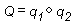

# Vectors, Vertices, and Quaternions (Direct3D 9)

Throughout Direct3D, vertices describe position and orientation. Each vertex in a primitive is described by a vector that gives its position, color, texture coordinates, and a normal vector that gives its orientation.

Quaternions add a fourth element to the \[x, y, z\] values that define a three-component-vector. Quaternions are an alternative to the matrix methods that are typically used for 3D rotations. A quaternion represents an axis in 3D space and a rotation around that axis. For example, a quaternion might represent a (1,1,2) axis and a rotation of 1 radian. Quaternions carry valuable information, but their true power comes from the two operations that you can perform on them: composition and interpolation.

Performing composition on quaternions is similar to combining them. The composition of two quaternions is notated like the following illustration.

The composition of two quaternions applied to a geometry means "rotate the geometry around axis₂ by rotation₂, then rotate it around axis₁ by rotation₁." In this case, Q represents a rotation around a single axis that is the result of applying q₂, then q₁ to the geometry.

Using quaternion interpolation, an application can calculate a smooth and reasonable path from one axis and orientation to another. Therefore, interpolation between q₁ and q₂ provides a simple way to animate from one orientation to another.

When you use composition and interpolation together, they provide you with a simple way to manipulate a geometry in a manner that appears complex. For example, imagine that you have a geometry that you want to rotate to a given orientation. You know that you want to rotate it r₂ degrees around axis₂, then rotate it r₁ degrees around axis₁, but you don't know the final quaternion. By using composition, you could combine the two rotations on the geometry to get a single quaternion that is the result. Then, you could interpolate from the original to the composed quaternion to achieve a smooth transition from one to the other.

The D3DX utility library includes functions that help you work with quaternions. For example, the [**D3DXQuaternionRotationAxis**](d3dxquaternionrotationaxis.md) function adds a rotation value to a vector that defines an axis of rotation, and returns the result in a quaternion defined by a [**D3DXQUATERNION**](d3dxquaternion.md) structure. Additionally, the [**D3DXQuaternionMultiply**](d3dxquaternionmultiply.md) function composes quaternions and the [**D3DXQuaternionSlerp**](d3dxquaternionslerp.md) performs spherical linear interpolation between two quaternions.

Direct3D applications can use the following functions to simplify the task of working with quaternions.

-   [**D3DXQuaternionBaryCentric**](d3dxquaternionbarycentric.md)
-   [**D3DXQuaternionConjugate**](d3dxquaternionconjugate.md)
-   [**D3DXQuaternionDot**](d3dxquaterniondot.md)
-   [**D3DXQuaternionExp**](d3dxquaternionexp.md)
-   [**D3DXQuaternionIdentity**](d3dxquaternionidentity.md)
-   [**D3DXQuaternionInverse**](d3dxquaternioninverse.md)
-   [**D3DXQuaternionIsIdentity**](d3dxquaternionisidentity.md)
-   [**D3DXQuaternionLength**](d3dxquaternionlength.md)
-   [**D3DXQuaternionLengthSq**](d3dxquaternionlengthsq.md)
-   [**D3DXQuaternionLn**](d3dxquaternionln.md)
-   [**D3DXQuaternionMultiply**](d3dxquaternionmultiply.md)
-   [**D3DXQuaternionNormalize**](d3dxquaternionnormalize.md)
-   [**D3DXQuaternionRotationAxis**](d3dxquaternionrotationaxis.md)
-   [**D3DXQuaternionRotationMatrix**](d3dxquaternionrotationmatrix.md)
-   [**D3DXQuaternionRotationYawPitchRoll**](d3dxquaternionrotationyawpitchroll.md)
-   [**D3DXQuaternionSlerp**](d3dxquaternionslerp.md)
-   [**D3DXQuaternionSquad**](d3dxquaternionsquad.md)
-   [**D3DXQuaternionToAxisAngle**](d3dxquaterniontoaxisangle.md)

Direct3D applications can use the following functions to simplify the task of working with three-component-vectors.

-   [**D3DXVec3Add**](d3dxvec3add.md)
-   [**D3DXVec3BaryCentric**](d3dxvec3barycentric.md)
-   [**D3DXVec3CatmullRom**](d3dxvec3catmullrom.md)
-   [**D3DXVec3Cross**](d3dxvec3cross.md)
-   [**D3DXVec3Dot**](d3dxvec3dot.md)
-   [**D3DXVec3Hermite**](d3dxvec3hermite.md)
-   [**D3DXVec3Length**](d3dxvec3length.md)
-   [**D3DXVec3LengthSq**](d3dxvec3lengthsq.md)
-   [**D3DXVec3Lerp**](d3dxvec3lerp.md)
-   [**D3DXVec3Maximize**](d3dxvec3maximize.md)
-   [**D3DXVec3Minimize**](d3dxvec3minimize.md)
-   [**D3DXVec3Normalize**](d3dxvec3normalize.md)
-   [**D3DXVec3Project**](d3dxvec3project.md)
-   [**D3DXVec3Scale**](d3dxvec3scale.md)
-   [**D3DXVec3Subtract**](d3dxvec3subtract.md)
-   [**D3DXVec3Transform**](d3dxvec3transform.md)
-   [**D3DXVec3TransformCoord**](d3dxvec3transformcoord.md)
-   [**D3DXVec3TransformNormal**](d3dxvec3transformnormal.md)
-   [**D3DXVec3Unproject**](d3dxvec3unproject.md)

Many additional functions that simplify tasks using two- and four-component-vectors are included among the [Math Functions](dx9-graphics-reference-d3dx-functions-math.md) supplied by the D3DX utility library.

## Related topics

<dl> <dt>

[Coordinate Systems and Geometry](coordinate-systems-and-geometry.md)
</dt> </dl>

 

 

