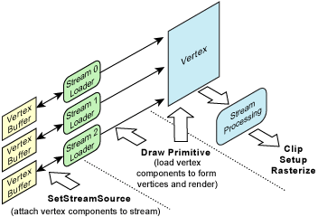

# Vertex Data Streams (Direct3D 9)

The rendering interfaces for Direct3D consist of methods that render primitives from vertex data stored in one or more data buffers. Vertex data consists of vertex elements combined to form vertex components. Vertex elements, the smallest unit of a vertex, represent entities such as position, normal, or color.

Vertex components are one or more vertex elements stored contiguously (interleaved per vertex) in a single memory buffer. A complete vertex consists of one or more components, where each component is in a separate memory buffer. To render a primitive, multiple vertex components are read and assembled so that complete vertices are available for vertex processing. The following diagram shows the process of rendering primitives using vertex components.

Rendering primitives consists of two steps. First, set up one or more vertex component streams; second, invoke a [**IDirect3DDevice9::DrawPrimitive**](/windows/win32/api/d3d9helper/nf-d3d9helper-idirect3ddevice9-drawprimitive) method to render from those streams. Identification of vertex elements within these component streams is specified by the vertex shader.

The [**IDirect3DDevice9::DrawPrimitive**](/windows/win32/api/d3d9helper/nf-d3d9helper-idirect3ddevice9-drawprimitive) methods specify an offset in the vertex data streams so that an arbitrary contiguous subset of the primitives within one set of vertex data can be rendered with each draw invocation. This enables you to change the device rendering state between groups of primitives that are rendered from the same vertex buffers.

Both indexed and nonindexed drawing methods are supported. For more information, see [Rendering from Vertex and Index Buffers (Direct3D 9)](rendering-from-vertex-and-index-buffers.md).

## Related topics

<dl> <dt>

[Rendering Primitives](rendering-primitives.md)
</dt> </dl>

 

 
