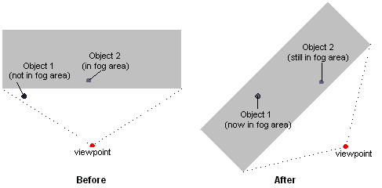

# Vertex Fog (Direct3D 9)

When the system performs vertex fogging, it applies fog calculations at each vertex in a polygon, and then interpolates the results across the face of the polygon during rasterization. Vertex fog effects are computed by the Direct3D lighting and transformation engine. For more information, see [Fog Parameters (Direct3D 9)](fog-parameters.md).

If your application does not use Direct3D for transformation and lighting, the application must perform fog calculations. In this case, place the fog factor that is computed in the alpha component of the specular color for each vertex. You are free to use whatever formulas you want - range-based, volumetric, or otherwise. Direct3D uses the supplied fog factor to interpolate across the face of each polygon. Applications that perform their own transformation and lighting must also perform their own vertex fog calculations. As a result, such an application need only enable fog blending and set the fog color through the associated render states, as described in [Fog Blending (Direct3D 9)](fog-blending.md) and [Fog Color (Direct3D 9)](fog-color.md).

> [!Note]  
> When using a vertex shader, you must use vertex fog. This is accomplished by using the vertex shader to write the per-vertex fog intensity to the oFog register. After the pixel shader completes, the oFog data is used to linearly interpolate with the fog color. This intensity is not available in a pixel shader.

 

## Range-Based Fog

> [!Note]  
> Direct3D uses range-based fog calculations only when using vertex fog with the Direct3D transformation and lighting engine. This is because pixel fog is implemented in the device driver, and no hardware currently exists to support per-pixel range-based fog. If your application performs its own transformation and lighting, it must perform its own fog calculations, range-based or otherwise.

 

Sometimes, using fog can introduce graphic artifacts that cause objects to be blended with the fog color in nonintuitive ways. For example, imagine a scene in which there are two visible objects: one distant enough to be affected by fog, and the other near enough to be unaffected. If the viewing area rotates in place, the apparent fog effects can change, even if the objects are stationary. The following diagram shows a top-down view of such a situation.



Range-based fog is another, more accurate, way to determine the fog effects. In range-based fog, Direct3D uses the actual distance from the viewpoint to a vertex for its fog calculations. Direct3D increases the effect of fog as the distance between the two points increases, rather than the depth of the vertex within in the scene, thereby avoiding rotational artifacts.

If the current device supports range-based fog, it will set the D3DPRASTERCAPS\_FOGRANGE value in the RasterCaps member of [**D3DCAPS9**](/windows/desktop/api/D3D9Caps/ns-d3d9caps-d3dcaps9) when you call the [**IDirect3DDevice9::GetDeviceCaps**](/windows/win32/api/d3d9helper/nf-d3d9helper-idirect3ddevice9-getdevicecaps) method. To enable range-based fog, set the D3DRS\_RANGEFOGENABLE render state to **TRUE**.

Range-based fog is computed by Direct3D during transformation and lighting. Applications that don't use the Direct3D transformation and lighting engine must also perform their own vertex fog calculations. In this case, provide the range-based fog factor in the alpha component of the specular component for each vertex.

## Using Vertex Fog

Use the following steps to enable vertex fog in your application.

1.  Enable fog blending by setting D3DRS\_FOGENABLE to **TRUE**.
2.  Set the fog color in the D3DRS\_FOGCOLOR render state.
3.  Choose the desired fog formula by setting the D3DRS\_FOGVERTEXMODE render state to a member of the [**D3DFOGMODE**](./d3dfogmode.md) enumerated type.
4.  Set the fog parameters as desired for the selected fog formula in the render states.

The following example, written in C++, shows what these steps might look like in code.


```
// For brevity, error values in this example are not checked 
//   after each call. A real-world application should check 
//   these values appropriately.
//
// For the purposes of this example, g_pDevice is a valid
//   pointer to an IDirect3DDevice9 interface.
void SetupVertexFog(DWORD Color, DWORD Mode, BOOL UseRange, FLOAT Density)
{
    float Start = 0.5f,    // Linear fog distances
          End   = 0.8f;
 
    // Enable fog blending.
    g_pDevice->SetRenderState(D3DRS_FOGENABLE, TRUE);
 
    // Set the fog color.
    g_pDevice->SetRenderState(D3DRS_FOGCOLOR, Color);
    
    // Set fog parameters.
    if(D3DFOG_LINEAR == Mode)
    {
        g_pDevice->SetRenderState(D3DRS_FOGVERTEXMODE, Mode);
        g_pDevice->SetRenderState(D3DRS_FOGSTART, *(DWORD *)(&Start));
        g_pDevice->SetRenderState(D3DRS_FOGEND,   *(DWORD *)(&End));
    }
    else
    {
        g_pDevice->SetRenderState(D3DRS_FOGVERTEXMODE, Mode);
        g_pDevice->SetRenderState(D3DRS_FOGDENSITY, *(DWORD *)(&Density));
    }

    // Enable range-based fog if desired (only supported for
    //   vertex fog). For this example, it is assumed that UseRange
    //   is set to a nonzero value only if the driver exposes the 
    //   D3DPRASTERCAPS_FOGRANGE capability.
    // Note: This is slightly more performance intensive
    //   than non-range-based fog.
    if(UseRange)
        g_pDevice->SetRenderState(D3DRS_RANGEFOGENABLE, TRUE);
}
```


Some fog parameters are required as floating-point values, even though the [**IDirect3DDevice9::SetRenderState**](/windows/win32/api/d3d9helper/nf-d3d9helper-idirect3ddevice9-setrenderstate) method only accepts DWORD values in the second parameter. This example successfully provides the floating-point values to these methods without data translation by casting the addresses of the floating-point variables as DWORD pointers, and then dereferencing them.

## Related topics

<dl> <dt>

[Fog Types](fog-types.md)
</dt> </dl>

 

 
