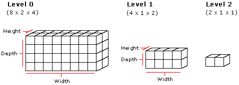

# Volume Texture Resources (Direct3D 9)

Volume textures are three-dimensional collections of pixels (texels) that can be used to paint a two-dimensional primitive such as a triangle or a line. Three-element texture coordinates are required for each vertex of a primitive that is to be textured with a volume. As the primitive is drawn, each contained pixel is filled with the color value from some pixel within the volume, in accordance with rules analogous to the two-dimensional texture case. Volumes are not rendered directly because there are no three-dimensional primitives that can be painted with them.

You can use volume textures for special effects such as patchy fog, explosions, and so on.

Volumes are organized into slices and can be thought of as width x height 2D surfaces stacked to make a width x height x depth volume. Each slice is a single row. Volumes can have subsequent levels in which the dimensions of each level are truncated to half the dimensions of the previous level. The following diagram shows what a volume texture with multiple levels looks like.



## Creating a Volume Texture

The code examples below show the steps required to use a volume texture.

First, specify a custom vertex type that has three texture coordinates for each vertex, as shown in this code example.


```
struct VOLUMEVERTEX
{
    FLOAT x, y, z;
    DWORD color;
    FLOAT tu, tv, tw;
};

#define D3DFVF_VOLUMEVERTEX (D3DFVF_XYZ|D3DFVF_DIFFUSE|
                             D3DFVF_TEX1|D3DFVF_TEXCOORDSIZE3(0))
```


Next, fill the vertices with data.


```
VOLUMEVERTEX g_vVertices[4] =
{
    { 1.0f, 1.0f, 0.0f, 0xffffffff, 1.0f, 1.0f, 0.0f },
    {-1.0f, 1.0f, 0.0f, 0xffffffff, 0.0f, 1.0f, 0.0f },
    { 1.0f,-1.0f, 0.0f, 0xffffffff, 1.0f, 0.0f, 0.0f },
    {-1.0f,-1.0f, 0.0f, 0xffffffff, 0.0f, 0.0f, 0.0f }
};
```


Now, create a vertex buffer and fill it with data from the vertices.

The next step is to use the [**IDirect3DDevice9::CreateVolumeTexture**](/windows/win32/api/d3d9helper/nf-d3d9helper-idirect3ddevice9-createvolumetexture) method to create a volume texture, as shown in this code example.


```
LPDIRECT3DVOLUMETEXTURE9 pVolumeTexture;
d3dDevice->CreateVolumeTexture( 8, 4, 4, 1, 0, D3DFMT_R8G8B8,D3DPOOL_MANAGED, 
                                &pVolumeTexture );
```


Before rendering the primitive, set the current texture to the volume texture created above. The code example below shows the entire rendering process for a strip of triangles.


```
if( SUCCEEDED( d3dDevice->BeginScene() ) )
{
    // Draw the quad, with the volume texture.
    d3dDevice->SetTexture( 0, pVolumeTexture );
    d3dDevice->SetFVF( D3DFVF_VOLUMEVERTEX );
    d3dDevice->SetStreamSource( 0, pVB, sizeof(VOLUMEVERTEX) );
    d3dDevice->DrawPrimitive( D3DPT_TRIANGLESTRIP, 0, 2);

   // End the scene.
   d3dDevice->EndScene();
}
```


## Related topics

<dl> <dt>

[Direct3D Textures](direct3d-textures.md)
</dt> </dl>

 

 
