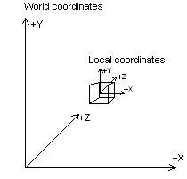

# World Transform (Direct3D 9)

The discussion of the world transformation introduces basic concepts and provides details on how to set up a world transform.

## What Is a World Transform?

A world transform changes coordinates from model space, where vertices are defined relative to a model's local origin, to World Space, where vertices are defined relative to an origin common to all the objects in a scene. In essence, the world transform places a model into the world; hence its name. The following diagram shows the relationship between the world coordinate system and a model's local coordinate system.



The world transform can include any combination of translations, rotations, and scalings.

## Setting Up a World Matrix

As with any other transform, create the world transform by concatenating a series of matrices into a single matrix that contains the sum total of their effects. In the simplest case, when a model is at the world origin and its local coordinate axes are oriented the same as world space, the world matrix is the identity matrix. More commonly, the world matrix is a combination of a translation into world space and possibly one or more rotations to turn the model as needed.

The following example, from a fictitious 3D model class written in C++, uses the helper functions included in the D3DX utility library to create a world matrix that includes three rotations to orient a model and a translation to relocate it relative to its position in world space.


```
/*
 * For the purposes of this example, the following variables
 * are assumed to be valid and initialized.
 *
 * The m_xPos, m_yPos, m_zPos variables contain the model's
 * location in world coordinates.
 *
 * The m_fPitch, m_fYaw, and m_fRoll variables are floats that 
 * contain the model's orientation in terms of pitch, yaw, and roll
 * angles, in radians.
 */
 
void C3DModel::MakeWorldMatrix( D3DXMATRIX* pMatWorld )
{
    D3DXMATRIX MatTemp;  // Temp matrix for rotations.
    D3DXMATRIX MatRot;   // Final rotation matrix, applied to 
                         // pMatWorld.
 
    // Using the left-to-right order of matrix concatenation,
    // apply the translation to the object's world position
    // before applying the rotations.
    D3DXMatrixTranslation(pMatWorld, m_xPos, m_yPos, m_zPos);
    D3DXMatrixIdentity(&MatRot);

    // Now, apply the orientation variables to the world matrix
    if(m_fPitch || m_fYaw || m_fRoll) {
        // Produce and combine the rotation matrices.
        D3DXMatrixRotationX(&MatTemp, m_fPitch);         // Pitch
        D3DXMatrixMultiply(&MatRot, &MatRot, &MatTemp);
        D3DXMatrixRotationY(&MatTemp, m_fYaw);           // Yaw
        D3DXMatrixMultiply(&MatRot, &MatRot, &MatTemp);
        D3DXMatrixRotationZ(&MatTemp, m_fRoll);          // Roll
        D3DXMatrixMultiply(&MatRot, &MatRot, &MatTemp);
 
        // Apply the rotation matrices to complete the world matrix.
        D3DXMatrixMultiply(pMatWorld, &MatRot, pMatWorld);
    }
}
```


After you prepare the world matrix, call the [**IDirect3DDevice9::SetTransform**](/windows/desktop/api) method to set it, specifying the [**D3DTS\_WORLD**](d3dts-world.md) macro for the first parameter.

> [!Note]  
> Direct3D uses the world and view matrices that you set to configure several internal data structures. Each time you set a new world or view matrix, the system recalculates the associated internal structures. Setting these matrices frequently-for example, thousands of times per frame-is computationally time-consuming. You can minimize the number of required calculations by concatenating your world and view matrices into a world-view matrix that you set as the world matrix, and then setting the view matrix to the identity. Keep cached copies of individual world and view matrices so that you can modify, concatenate, and reset the world matrix as needed. For clarity, in this documentation Direct3D samples rarely employ this optimization.

 

## Related topics

<dl> <dt>

[Transforms](transforms.md)
</dt> </dl>

 

 


