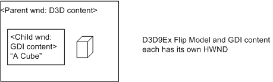
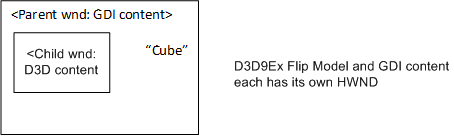

# Direct3D 9Ex improvements

This topic describes Windows 7's added support for Flip Mode Present and its associated present statistics in Direct3D 9Ex and Desktop Window Manager. Target applications include video or frame rate-based presentation applications. Applications that use Direct3D 9Ex Flip Mode Present reduce the system resource load when DWM is enabled. Present statistics enhancements associated with Flip Mode Present enable Direct3D 9Ex applications to better control the rate of presentation by providing real-time feedback and correction mechanisms. Detailed explanations and pointers to sample resources are included.

This topic contains the following sections.

-   [What's Improved about Direct3D 9Ex for Windows 7](#whats-improved-about-direct3d-9ex-for-windows-7)
-   [Direct3D 9EX Flip Mode Presentation](#direct3d-9ex-flip-mode-presentation)
-   [Programming Model and APIs](#programming-model-and-apis)
    -   [How to Opt Into the Direct3D 9Ex Flip Model](#how-to-opt-into-the-direct3d-9ex-flip-model)
    -   [Design Guidelines for Direct3D 9Ex Flip Model Applications](#design-guidelines-for-direct3d-9ex-flip-model-applications)
    -   [Frame Synchronization of Direct3D 9Ex Flip Model Applications](#frame-synchronization-of-direct3d-9ex-flip-model-applications)
    -   [Frame Synchronization for Windowed Applications When DWM is Off](#frame-synchronization-for-windowed-applications-when-dwm-is-off)
-   [Walk-Through of a Direct3D 9Ex Flip Model and Present Statistics Sample](#walk-through-of-a-direct3d-9ex-flip-model-and-present-statistics-sample)
    -   [Summary of Programming Recommendations for Frame Synchronization](#summary-of-programming-recommendations-for-frame-synchronization)
-   [Conclusion about Direct3D 9Ex Improvements](#conclusion-about-direct3d-9ex-improvements)
-   [Call to Action](#call-to-action)
-   [Related topics](#related-topics)

## What's Improved about Direct3D 9Ex for Windows 7

Flip Mode Presentation of Direct3D 9Ex is an improved mode of presenting images in Direct3D 9Ex that efficiently hands off rendered images to Windows 7 Desktop Window Manager (DWM) for composition. Beginning in Windows Vista, DWM composes the entire Desktop. When DWM is enabled, windowed mode applications present their contents on the Desktop by using a method called Blt Mode Present to DWM (or Blt Model). With Blt Model, DWM maintains a copy of the Direct3D 9Ex rendered surface for Desktop composition. When the application updates, the new content is copied to the DWM surface through a blt. For applications that contain Direct3D and GDI content, the GDI data is also copied onto the DWM surface.

Available in Windows 7, Flip Mode Present to DWM (or Flip Model) is a new presentation method that essentially enables passing handles of application surfaces between windowed mode applications and DWM. In addition to saving resources, Flip Model supports enhanced present statistics.

Present statistics are frame-timing information that applications can use to synchronize video and audio streams and recover from video playback glitches. The frame-timing information in present statistics allows applications to adjust the presentation rate of their video frames for smoother presentation. In Windows Vista, where DWM maintains a corresponding copy of the frame surface for Desktop composition, applications can use present statistics provided by DWM. This method of obtaining present statistics will still be available in Windows 7 for existing applications.

In Windows 7, Direct3D 9Ex-based applications that adopt Flip Model should use D3D9Ex APIs to obtain present statistics. When DWM is enabled, windowed mode and full-screen exclusive mode Direct3D 9Ex applications can expect the same present statistics information when using Flip Model. Direct3D 9Ex Flip Model present statistics enable applications to query for present statistics in real time, rather than after the frame has been shown on screen; the same present statistics information is available for windowed-mode Flip-Model enabled applications as full-screen applications; an added flag in D3D9Ex APIs allows Flip Model applications to effectively discard late frames at presentation time.

Direct3D 9Ex Flip Model should be used by new video or frame rate-based presentation applications that target Windows 7. Because of the synchronization between DWM and the Direct3D 9Ex runtime, applications that use Flip Model should specify between 2 to 4 backbuffers to ensure smooth presentation. Those applications that use present statistics information will benefit from using Flip Model enabled present statistics enhancements.

## Direct3D 9EX Flip Mode Presentation

Performance improvements of Direct3D 9Ex Flip Mode Present are significant on the system when DWM is on and when the application is in windowed mode, rather than in full screen exclusive mode. The following table and illustration show a simplified comparison of memory bandwidth usages and system reads and writes of windowed applications that choose Flip Model versus the default usage Blt Model.


| Blt mode present to DWM                                                                                                 | D3D9Ex Flip Mode Present to DWM                                             |
|-------------------------------------------------------------------------------------------------------------------------|-----------------------------------------------------------------------------|
| 1. The application updates its frame (Write)<br/>                                                                 | 1. The application updates its frame (Write)<br/>                     |
| 2. Direct3D runtime copies surface contents to a DWM redirection surface (Read, Write)<br/>                       | 2. Direct3D runtime passes the application surface to DWM<br/>        |
| 3. After the shared surface copy is completed, DWM renders the application surface onto screen (Read, Write)<br/> | 3. DWM renders the application surface onto screen (Read, Write)<br/> |


 


Flip Mode Present reduces system memory usage by reducing the number of reads and writes by the Direct3D runtime for the windowed frame composition by DWM. This reduces the system power consumption and overall memory usage.

Applications can take advantage of Direct3D 9Ex Flip Mode present statistics enhancements when DWM is on, regardless of whether the application is in windowed mode or in full screen exclusive mode.

## Programming Model and APIs

New video or frame rate-gauging applications that use Direct3D 9Ex APIs on Windows 7 can take advantage of the memory and power savings and of the improved presentation offered by Flip Mode Present when running on Windows 7. (When running on previous Windows versions, the Direct3D runtime defaults the application to Blt Mode Present.)

Flip Mode Present entails that the application can take advantage of real-time present statistics feedback and correction mechanisms when DWM is on. However, applications that use Flip Mode Present should be aware of limitations when they use concurrent GDI API rendering.

You can modify existing applications to take advantage of Flip Mode Present, with the same benefits and caveats as the newly developed applications.

### How to Opt Into the Direct3D 9Ex Flip Model

Direct3D 9Ex applications that target Windows 7 can opt into the Flip Model by creating the swap chain with the [**D3DSWAPEFFECT\_FLIPEX**](/windows/desktop/direct3d9/d3dswapeffect) enumeration value. To opt into the Flip Model, applications specify the [**D3DPRESENT\_PARAMETERS**](/windows/desktop/direct3d9/d3dpresent-parameters) structure, and then pass a pointer to this structure when they call the [**IDirect3D9Ex::CreateDeviceEx**](/windows/desktop/api/d3d9/nf-d3d9-idirect3d9ex-createdeviceex) API. This section describes how applications that target Windows 7 use **IDirect3D9Ex::CreateDeviceEx** to opt into the Flip Model. For more information about the **IDirect3D9Ex::CreateDeviceEx** API, see **IDirect3D9Ex::CreateDeviceEx on MSDN**.

For convenience, the syntax of [**D3DPRESENT\_PARAMETERS**](/windows/desktop/direct3d9/d3dpresent-parameters) and [**IDirect3D9Ex::CreateDeviceEx**](/windows/desktop/api/d3d9/nf-d3d9-idirect3d9ex-createdeviceex) is repeated here.

``` syntax
HRESULT CreateDeviceEx(
  UINT Adapter,
  D3DDEVTYPE DeviceType,
  HWND hFocusWindow,
  DWORD BehaviorFlags,
  D3DPRESENT_PARAMETERS* pPresentationParameters,
  D3DDISPLAYMODEEX *pFullscreenDisplayMode,
  IDirect3DDevice9Ex **ppReturnedDeviceInterface
);
```

``` syntax
typedef struct D3DPRESENT_PARAMETERS {
    UINT BackBufferWidth, BackBufferHeight;
    D3DFORMAT BackBufferFormat;
    UINT BackBufferCount;
    D3DMULTISAMPLE_TYPE MultiSampleType;
    DWORD MultiSampleQuality;
    D3DSWAPEFFECT SwapEffect;
    HWND hDeviceWindow;
    BOOL Windowed;
    BOOL EnableAutoDepthStencil;
    D3DFORMAT AutoDepthStencilFormat;
    DWORD Flags;
    UINT FullScreen_RefreshRateInHz;
    UINT PresentationInterval;
} D3DPRESENT_PARAMETERS, *LPD3DPRESENT_PARAMETERS;
```

When you modify Direct3D 9Ex applications for Windows 7 to opt into the Flip Model, you should consider the following items about the specified members of [**D3DPRESENT\_PARAMETERS**](/windows/desktop/direct3d9/d3dpresent-parameters):

<dl> <dt>

**BackBufferCount**
</dt> <dd>

(Windows 7 Only)

When **SwapEffect** is set to the new D3DSWAPEFFECT\_FLIPEX swap chain effect type, the back buffer count should be equal or greater than 2, to prevent an application performance penalty as a result of waiting on the previous Present buffer to be released by DWM.

When the application also uses present statistics associated with D3DSWAPEFFECT\_FLIPEX, we recommend that you set the back buffer count to from 2 to 4.

Using D3DSWAPEFFECT\_FLIPEX on Windows Vista or previous operating system versions will return fail from [**CreateDeviceEx**](/windows/desktop/api/d3d9/nf-d3d9-idirect3d9ex-createdeviceex).

</dd> <dt>

**SwapEffect**
</dt> <dd>

(Windows 7 Only)

The new D3DSWAPEFFECT\_FLIPEX swap chain effect type designates when an application is adopting Flip Mode Present to DWM. It allows the application more efficient usage of memory and power, and also enables the application to take advantage of full-screen present statistics in windowed mode. Full-screen application behavior is not affected. If Windowed is set to **TRUE** and **SwapEffect** is set to D3DSWAPEFFECT\_FLIPEX, the runtime creates one extra back buffer and rotates whichever handle belongs to the buffer that becomes the front buffer at presentation time.

</dd> <dt>

**Flags**
</dt> <dd>

(Windows 7 Only)

The [D3DPRESENTFLAG\_LOCKABLE\_BACKBUFFER](/windows/desktop/direct3d9/d3dpresentflag) flag cannot be set if **SwapEffect** is set to the new [**D3DSWAPEFFECT\_FLIPEX**](/windows/desktop/direct3d9/d3dswapeffect) swap chain effect type.

</dd> </dl>

### Design Guidelines for Direct3D 9Ex Flip Model Applications

Use the guidelines in the following sections to design your Direct3D 9Ex Flip Model applications.

### Use Flip Mode Present in a Separate HWND from Blt Mode Present

Applications should use Direct3D 9Ex Flip Mode Present in an HWND that is not also targeted by other APIs, including Blt Mode Present Direct3D 9Ex, other versions of Direct3D, or GDI. Flip Mode Present can be used to present to child windows; that is, applications can use Flip Model when it is not mixed with Blt Model in the same HWND, as shown in the following illustrations.





Because Blt Model maintains an additional copy of the surface, GDI and other Direct3D contents can be added to the same HWND through piecemeal updates from Direct3D and GDI. Using the Flip Model, only Direct3D 9Ex content in [**D3DSWAPEFFECT\_FLIPEX**](/windows/desktop/direct3d9/d3dswapeffect) swap chains that are passed to DWM will be visible. All other Blt Model Direct3D or GDI content updates will be ignored, as shown in the following illustrations.


Therefore, Flip Model should be enabled for swap chain buffers surfaces where the Direct3D 9Ex Flip Model alone renders to the entire HWND.

### Do Not Use Flip Model with GDI's ScrollWindow or ScrollWindowEx

Some Direct3D 9Ex applications use GDI's ScrollWindow or ScrollWindowEx functions to update window contents when a user scroll event is triggered. ScrollWindow and ScrollWindowEx perform blts of window contents on screen as a window is scrolled. These functions also require Blt Model updates for GDI and Direct3D 9Ex content. Applications that use either function will not necessarily display visible window contents scrolling on screen when the application is in windowed mode and DWM is enabled. We recommend that you not use GDI's ScrollWindow and ScrollWindowEx APIs in your applications, and instead redraw their contents on screen in response to scrolling.

### Use One D3DSWAPEFFECT\_FLIPEX Swap Chain per HWND

Applications that use Flip Model should not use multiple Flip Model swap chains targeting the same HWND.

### Frame Synchronization of Direct3D 9Ex Flip Model Applications

Present statistics are frame timing information that media applications use to synchronize video and audio streams and recover from video playback glitches. To enable present statistics availability, the Direct3D 9Ex application must ensure that the *BehaviorFlags* parameter that the application passes to [**IDirect3D9Ex::CreateDeviceEx**](/windows/desktop/api/d3d9/nf-d3d9-idirect3d9ex-createdeviceex) contains the device behavior flag [D3DCREATE\_ENABLE\_PRESENTSTATS](/windows/desktop/direct3d9/d3dcreate).

For convenience, the syntax of [**IDirect3D9Ex::CreateDeviceEx**](/windows/desktop/api/d3d9/nf-d3d9-idirect3d9ex-createdeviceex) is repeated here.

``` syntax
HRESULT CreateDeviceEx(
  UINT Adapter,
  D3DDEVTYPE DeviceType,
  HWND hFocusWindow,
  DWORD BehaviorFlags,
  D3DPRESENT_PARAMETERS* pPresentationParameters,
  D3DDISPLAYMODEEX *pFullscreenDisplayMode,
  IDirect3DDevice9Ex **ppReturnedDeviceInterface
);
```

Direct3D 9Ex Flip Model adds the [D3DPRESENT\_FORCEIMMEDIATE](/windows/desktop/direct3d9/d3dpresent) presentation flag that enforces the [D3DPRESENT\_INTERVAL\_IMMEDIATE](/windows/desktop/direct3d9/d3dpresent) presentation-flag behavior. The Direct3D 9Ex application specifies these presentation flags in the *dwFlags* parameter that the application passes to [**IDirect3DDevice9Ex::PresentEx**](/windows/desktop/api/d3d9/nf-d3d9-idirect3ddevice9ex-presentex), as shown here.

``` syntax
HRESULT PresentEx(
  CONST RECT *pSourceRect,
  CONST RECT *pDestRect,
  HWND hDestWindowOverride,
  CONST RGNDATA *pDirtyRegion,
  DWORD dwFlags
);
```

When you modify your Direct3D 9Ex application for Windows 7, you should consider the following information about the specified [D3DPRESENT](/windows/desktop/direct3d9/d3dpresent) presentation flags:

<dl> <dt>

[D3DPRESENT\_DONOTFLIP](/windows/desktop/direct3d9/d3dpresent)
</dt> <dd>

This flag is available only in full-screen mode or

(Windows 7 Only)

when the application sets the **SwapEffect** member of [**D3DPRESENT\_PARAMETERS**](/windows/desktop/direct3d9/d3dpresent-parameters) to [**D3DSWAPEFFECT\_FLIPEX**](/windows/desktop/direct3d9/d3dswapeffect) in a call to [**CreateDeviceEx**](/windows/desktop/api/d3d9/nf-d3d9-idirect3d9ex-createdeviceex).

</dd> <dt>

[D3DPRESENT\_FORCEIMMEDIATE](/windows/desktop/direct3d9/d3dpresent)
</dt> <dd>

(Windows 7 Only)

This flag can be specified only if the application sets the **SwapEffect** member of [**D3DPRESENT\_PARAMETERS**](/windows/desktop/direct3d9/d3dpresent-parameters) to [**D3DSWAPEFFECT\_FLIPEX**](/windows/desktop/direct3d9/d3dswapeffect) in a call to [**CreateDeviceEx**](/windows/desktop/api/d3d9/nf-d3d9-idirect3d9ex-createdeviceex). The application can use this flag to immediately update a surface with several frames later in the DWM Present queue, essentially skipping intermediate frames.

Windowed FlipEx-enabled applications can use this flag to immediately update a surface with a frame that is later in the DWM Present queue, skipping intermediate frames. This is especially useful for media applications that want to discard frames that have been detected as late and present subsequent frames at composition time. [**IDirect3DDevice9Ex::PresentEx**](/windows/desktop/api/d3d9/nf-d3d9-idirect3ddevice9ex-presentex) returns invalid parameter error if this flag is improperly specified.

</dd> </dl>

To obtain present statistics information, the application obtains the [**D3DPRESENTSTATS**](/windows/desktop/direct3d9/d3dpresentstats) structure by calling the [**IDirect3DSwapChain9Ex::GetPresentStatistics**](/previous-versions/windows/desktop/legacy/bb205901(v=vs.85)) API.

The [**D3DPRESENTSTATS**](/windows/desktop/direct3d9/d3dpresentstats) structure contains statistics about [**IDirect3DDevice9Ex::PresentEx**](/windows/desktop/api/d3d9/nf-d3d9-idirect3ddevice9ex-presentex) calls. The device must be created by using a [**IDirect3D9Ex::CreateDeviceEx**](/windows/desktop/api/d3d9/nf-d3d9-idirect3d9ex-createdeviceex) call with the [D3DCREATE\_ENABLE\_PRESENTSTATS](/windows/desktop/direct3d9/d3dcreate) flag. Otherwise, the data returned by [**GetPresentStatistics**](/previous-versions/windows/desktop/legacy/bb205901(v=vs.85)) is undefined. A Flip-Model-enabled Direct3D 9Ex swap chain provides present statistics information in both windowed and full-screen modes.

For Blt-Model-enabled Direct3D 9Ex swap chains in windowed mode, all [**D3DPRESENTSTATS**](/windows/desktop/direct3d9/d3dpresentstats) structure values will be zeroes.

For FlipEx present statistics, [**GetPresentStatistics**](/previous-versions/windows/desktop/legacy/bb205901(v=vs.85)) returns D3DERR\_PRESENT\_STATISTICS\_DISJOINT in the following situations:

-   First call to [**GetPresentStatistics**](/previous-versions/windows/desktop/legacy/bb205901(v=vs.85)) ever, which indicates the beginning of a sequence
-   DWM transition from on to off
-   Mode change: either windowed mode to or from full screen or full screen to full screen transitions

For convenience, the syntax of [**GetPresentStatistics**](/previous-versions/windows/desktop/legacy/bb205901(v=vs.85)) is repeated here.

``` syntax
HRESULT GetPresentStatistics(
  D3DPRESENTSTATS * pPresentationStatistics
);
```

The [**IDirect3DSwapChain9Ex::GetLastPresentCount**](/windows/desktop/api/d3d9/nf-d3d9-idirect3dswapchain9ex-getlastpresentcount) method returns the last PresentCount, that is, the Present ID of the last successful Present call that was made by a display device that is associated with the swap chain. This Present ID is the value of the **PresentCount** member of the [**D3DPRESENTSTATS**](/windows/desktop/direct3d9/d3dpresentstats) structure. For Blt-Model-enabled Direct3D 9Ex swap chains, while in windowed mode, all **D3DPRESENTSTATS** structure values will be zeroes.

For convenience, the syntax of [**IDirect3DSwapChain9Ex::GetLastPresentCount**](/windows/desktop/api/d3d9/nf-d3d9-idirect3dswapchain9ex-getlastpresentcount) is repeated here.

``` syntax
HRESULT GetLastPresentCount(
  UINT * pLastPresentCount
);
```

When you modify your Direct3D 9Ex application for Windows 7, you should consider the following information about the [**D3DPRESENTSTATS**](/windows/desktop/direct3d9/d3dpresentstats) structure:

-   The PresentCount value that [**GetLastPresentCount**](/windows/desktop/api/d3d9/nf-d3d9-idirect3dswapchain9ex-getlastpresentcount) returns does not update when a [**PresentEx**](/windows/desktop/api/d3d9/nf-d3d9-idirect3ddevice9ex-presentex) call with D3DPRESENT\_DONOTWAIT specified in the *dwFlags* parameter returns failure.
-   When [**PresentEx**](/windows/desktop/api/d3d9/nf-d3d9-idirect3ddevice9ex-presentex) is called with D3DPRESENT\_DONOTFLIP, a [**GetPresentStatistics**](/previous-versions/windows/desktop/legacy/bb205901(v=vs.85)) call succeeds but does not return an updated [**D3DPRESENTSTATS**](/windows/desktop/direct3d9/d3dpresentstats) structure when the application is in windowed mode.
-   **PresentRefreshCount** versus **SyncRefreshCount** in [**D3DPRESENTSTATS**](/windows/desktop/direct3d9/d3dpresentstats):
    -   **PresentRefreshCount** is equal to **SyncRefreshCount** when the application presents on every vsync.
    -   **SyncRefreshCount** is obtained on the vsync interval when the present was submitted, **SyncQPCTime** is approximately the time associated with the vsync interval.

``` syntax
typedef struct _D3DPRESENTSTATS {
    UINT PresentCount;
    UINT PresentRefreshCount;
    UINT SyncRefreshCount;
    LARGE_INTEGER SyncQPCTime;
    LARGE_INTEGER SyncGPUTime;
} D3DPRESENTSTATS;
```

### Frame Synchronization for Windowed Applications When DWM is Off

When DWM is off, windowed applications display directly to the monitor screen without going through a flip chain. In Windows Vista, there is no support for obtaining frame statistics information for windowed applications when DWM is off. To maintain an API where applications need not be DWM- aware, Windows 7 will return frame statistics information for windowed applications when DWM is off. The frame statistics returned when DWM is off are estimations only.

## Walk-Through of a Direct3D 9Ex Flip Model and Present Statistics Sample

**To opt into FlipEx presentation for Direct3D 9Ex sample**

1.  Ensure the sample application is running on Windows 7 or later operating system version.
2.  Set the **SwapEffect** member of [**D3DPRESENT\_PARAMETERS**](/windows/desktop/direct3d9/d3dpresent-parameters) to [**D3DSWAPEFFECT\_FLIPEX**](/windows/desktop/direct3d9/d3dswapeffect) in a call to [**CreateDeviceEx**](/windows/desktop/api/d3d9/nf-d3d9-idirect3d9ex-createdeviceex).


```C++
    OSVERSIONINFO version;
    ZeroMemory(&version, sizeof(version));
    version.dwOSVersionInfoSize = sizeof(version);
    GetVersionEx(&version);
    
    // Sample would run only on Win7 or higher
    // Flip Model present and its associated present statistics behavior are only available on Windows 7 or higher operating system
    bool bIsWin7 = (version.dwMajorVersion > 6) || 
        ((version.dwMajorVersion == 6) && (version.dwMinorVersion >= 1));

    if (!bIsWin7)
    {
        MessageBox(NULL, L"This sample requires Windows 7 or higher", NULL, MB_OK);
        return 0;
    }
```


**To also opt into FlipEx associated Present Statistics for Direct3D 9Ex sample**

-   Set [D3DCREATE\_ENABLE\_PRESENTSTATS](/windows/desktop/direct3d9/d3dcreate) in the *BehaviorFlags* parameter of [**CreateDeviceEx**](/windows/desktop/api/d3d9/nf-d3d9-idirect3d9ex-createdeviceex).


```C++
    // Set up the structure used to create the D3DDevice
    D3DPRESENT_PARAMETERS d3dpp;
    ZeroMemory(&d3dpp, sizeof(d3dpp));

    d3dpp.Windowed = TRUE;
    d3dpp.SwapEffect = D3DSWAPEFFECT_FLIPEX;        // Opts into Flip Model present for D3D9Ex swapchain
    d3dpp.BackBufferFormat = D3DFMT_X8R8G8B8;
    d3dpp.BackBufferWidth = 256;                
    d3dpp.BackBufferHeight = 256;
    d3dpp.BackBufferCount = QUEUE_SIZE;
    d3dpp.PresentationInterval = D3DPRESENT_INTERVAL_ONE;

    g_iWidth = d3dpp.BackBufferWidth;
    g_iHeight = d3dpp.BackBufferHeight;

    // Create the D3DDevice with present statistics enabled - set D3DCREATE_ENABLE_PRESENTSTATS for behaviorFlags parameter
    if(FAILED(g_pD3D->CreateDeviceEx(D3DADAPTER_DEFAULT, D3DDEVTYPE_HAL, hWnd,
                                      D3DCREATE_HARDWARE_VERTEXPROCESSING | D3DCREATE_ENABLE_PRESENTSTATS,
                                      &d3dpp, NULL, &g_pd3dDevice)))
    {
        return E_FAIL;
    }
```


**To avoid, detect and recover from glitches**

1.  Queue Present calls: recommended backbuffer count is from 2 to 4.
2.  Direct3D 9Ex sample adds an implicit backbuffer, actual Present queue length is backbuffer count + 1.
3.  Create helper Present queue structure to store all successfully submitted Present's Present ID (PresentCount) and associated, calculated/expected PresentRefreshCount.
4.  To detect glitch occurrence:

    -   Call [**GetPresentStatistics**](/previous-versions/windows/desktop/legacy/bb205901(v=vs.85)).
    -   Get the Present ID (PresentCount) and vsync count where the frame is shown (PresentRefreshCount) of the frame whose present statistics is obtained.
    -   Retrieve the expected PresentRefreshCount (TargetRefresh in sample code) associated with the Present ID.
    -   If actual PresentRefreshCount is later than expected, a glitch has occurred.

5.  To recover from glitch:

    -   Calculate how many frames to skip (g\_ iImmediates variable in sample code).
    -   Present the skipped frames with interval D3DPRESENT\_FORCEIMMEDIATE.

**Considerations for glitch detection and recovery**

1.  Glitch recovery takes N (g\_iQueueDelay variable in sample code) number of Present calls where N (g\_iQueueDelay) equals g\_iImmediates plus length of the Present queue, that is:

    -   Skipping frames with Present interval D3DPRESENT\_FORCEIMMEDIATE, plus
    -   Queued Presents that need to be processed

2.  Set a limit to the glitch length (GLITCH\_RECOVERY\_LIMIT in sample). If the sample application cannot recover from a glitch that is too long (that is say, 1 second, or 60 vsyncs on 60Hz monitor), jump over the intermittent animation and reset the Present helper queue.


```C++
VOID Render()
{
    g_pd3dDevice->Clear(0, NULL, D3DCLEAR_TARGET, D3DCOLOR_XRGB(0, 0, 0), 1.0f, 0);

    g_pd3dDevice->BeginScene();

    // Compute new animation parameters for time and frame based animations

    // Time-based is a difference between base and current SyncRefreshCount
    g_aTimeBasedHistory[g_iBlurHistoryCounter] = g_iStartFrame + g_LastSyncRefreshCount - g_SyncRefreshCount;
    // Frame-based is incrementing frame value
    g_aFrameBasedHistory[g_iBlurHistoryCounter] = g_iStartFrame + g_iFrameNumber;

    RenderBlurredMesh(TRUE);    // Time-based
    RenderBlurredMesh(FALSE);   // Frame-based

    g_iBlurHistoryCounter = (g_iBlurHistoryCounter + 1) % BLUR_FRAMES;

    DrawText();

    g_pd3dDevice->EndScene();

    // Performs glitch recovery if glitch was detected
    if (g_bGlitchRecovery && (g_iImmediates > 0))
    {
        // If we have present immediates queued as a result of glitch detected, issue forceimmediate Presents for glitch recovery 
        g_pd3dDevice->PresentEx(NULL, NULL, NULL, NULL, D3DPRESENT_FORCEIMMEDIATE);
        g_iImmediates--;
        g_iShowingGlitchRecovery = MESSAGE_SHOW;
    }
    // Otherwise, Present normally
    else
    {
        g_pd3dDevice->PresentEx(NULL, NULL, NULL, NULL, 0);
    }

    // Add to helper Present queue: PresentID + expected present refresh count of last submitted Present
    UINT PresentCount;
    g_pd3dSwapChain->GetLastPresentCount(&PresentCount);
    g_Queue.QueueFrame(PresentCount, g_TargetRefreshCount);
    
    // QueueDelay specifies # Present calls to be processed before another glitch recovery attempt
    if (g_iQueueDelay > 0)
    {
        g_iQueueDelay--;
    }

    if (g_bGlitchRecovery)
    {
        // Additional DONOTFLIP presents for frame conversions, which basically follows the same logic, but without rendering
        for (DWORD i = 0; i < g_iDoNotFlipNum; i++)
        {
            if (g_TargetRefreshCount != -1)
            {
                g_TargetRefreshCount++;
                g_iFrameNumber++;
                g_aTimeBasedHistory[g_iBlurHistoryCounter] = g_iStartFrame + g_LastSyncRefreshCount - g_SyncRefreshCount;
                g_aFrameBasedHistory[g_iBlurHistoryCounter] = g_iStartFrame + g_iFrameNumber;
                g_iBlurHistoryCounter = (g_iBlurHistoryCounter + 1) % BLUR_FRAMES;
            }
            
            if (g_iImmediates > 0)
            {
                g_pd3dDevice->PresentEx(NULL, NULL, NULL, NULL, D3DPRESENT_FORCEIMMEDIATE | D3DPRESENT_DONOTFLIP);
                g_iImmediates--;
            }
            else
            {
                g_pd3dDevice->PresentEx(NULL, NULL, NULL, NULL, D3DPRESENT_DONOTFLIP);
            }
            UINT PresentCount;
            g_pd3dSwapChain->GetLastPresentCount(&PresentCount);
            g_Queue.QueueFrame(PresentCount, g_TargetRefreshCount);

            if (g_iQueueDelay > 0)
            {
                g_iQueueDelay--;
            }
        }
    }

    // Check Present Stats info for glitch detection 
    D3DPRESENTSTATS PresentStats;

    // Obtain present statistics information for successfully displayed presents
    HRESULT hr = g_pd3dSwapChain->GetPresentStats(&PresentStats);

    if (SUCCEEDED(hr))
    {
        // Time-based update
        g_LastSyncRefreshCount = PresentStats.SyncRefreshCount;
        if ((g_SyncRefreshCount == -1) && (PresentStats.PresentCount != 0))
        {
            // First time SyncRefreshCount is reported, use it as base
            g_SyncRefreshCount = PresentStats.SyncRefreshCount;
        }

        // Fetch frame from the queue...
        UINT TargetRefresh = g_Queue.DequeueFrame(PresentStats.PresentCount);

        // If PresentStats returned a really old frame that we no longer have in the queue, just don't do any glitch detection
        if (TargetRefresh == FRAME_NOT_FOUND)
            return;

        if (g_TargetRefreshCount == -1)
        {
            // This is first time issued frame is confirmed by present stats, so fill target refresh count for all frames in the queue
            g_TargetRefreshCount = g_Queue.FillRefreshCounts(PresentStats.PresentCount, g_SyncRefreshCount);
        } 
        else
        {
            g_TargetRefreshCount++;
            g_iFrameNumber++;

            // To determine whether we're glitching, see if our estimated refresh count is confirmed
            // if the frame is displayed later than the expected vsync count
            if (TargetRefresh < PresentStats.PresentRefreshCount)
            {
                // then, glitch is detected!

                // If glitch is too big, don't bother recovering from it, just jump animation
                if ((PresentStats.PresentRefreshCount - TargetRefresh) > GLITCH_RECOVERY_LIMIT)
                {
                    g_iStartFrame += PresentStats.SyncRefreshCount - g_SyncRefreshCount;
                    ResetAnimation();
                    if (g_bGlitchRecovery)
                        g_iGlitchesInaRow++;    
                } 
                // Otherwise, compute number of immediate presents to recover from it -- if we?re not still trying to recover from another glitch
                else if (g_iQueueDelay == 0)
                {
                      // skip frames to catch up to expected refresh count
                    g_iImmediates = PresentStats.PresentRefreshCount - TargetRefresh;
                    // QueueDelay specifies # Present calls before another glitch recovery 
                    g_iQueueDelay = g_iImmediates + QUEUE_SIZE;
                    if (g_bGlitchRecovery)
                        g_iGlitchesInaRow++;
                }
            }
            else
            {
                // No glitch, reset glitch count
                g_iGlitchesInaRow = 0;
            }
        }
    }
    else if (hr == D3DERR_PRESENT_STATISTICS_DISJOINT)
    {
        // D3DERR_PRESENT_STATISTICS_DISJOINT means measurements should be started from the scratch (could be caused by mode change or DWM on/off transition)
        ResetAnimation();
    }

    // If we got too many glitches in a row, reduce framerate conversion factor (that is, render less frames)
    if (g_iGlitchesInaRow == FRAMECONVERSION_GLITCH_LIMIT)
    {
        if (g_iDoNotFlipNum < FRAMECONVERSION_LIMIT)
        {
            g_iDoNotFlipNum++;
        }
        g_iGlitchesInaRow = 0;
        g_iShowingDoNotFlipBump = MESSAGE_SHOW;
    }
}
```


**Sample scenario**

-   The following illustration shows an application with backbuffer count of 4. The actual Present queue length is therefore 5.

    

    Frame A is targeted to go on screen on sync interval count of 1 but was detected that it was shown on sync interval count of 4. Therefore a glitch has occurred. Subsequent 3 frames are presented with D3DPRESENT\_INTERVAL\_FORCEIMMEDIATE. The glitch should take a total of 8 Present calls before it is recovered - the next frame will be shown as per its targeted sync interval count.

### Summary of Programming Recommendations for Frame Synchronization

-   Create a backup list of all the LastPresentCount IDs (obtained via [**GetLastPresentCount**](/windows/desktop/api/d3d9/nf-d3d9-idirect3dswapchain9ex-getlastpresentcount)) and associated estimated PresentRefreshCount of all the Presents submitted.
    > [!Note]  
    > When the application calls [**PresentEx**](/windows/desktop/api/d3d9/nf-d3d9-idirect3ddevice9ex-presentex) with D3DPRESENT\_DONOTFLIP, the [**GetPresentStatistics**](/previous-versions/windows/desktop/legacy/bb205901(v=vs.85)) call succeeds but does not return an updated [**D3DPRESENTSTATS**](/windows/desktop/direct3d9/d3dpresentstats) structure when the application is in windowed mode.

     

-   Call [**GetPresentStatistics**](/previous-versions/windows/desktop/legacy/bb205901(v=vs.85)) to obtain the actual PresentRefreshCount associated with each Present ID of frames shown, to make sure that the application handles failure returns from the call.
-   If actual PresentRefreshCount is later than estimated PresentRefreshCount, a glitch is detected. Compensate by submitting lagging frames' Present with D3DPRESENT\_FORCEIMMEDIATE.
-   When one frame is presented late in the Present queue, all subsequent queued frames will be presented late. D3DPRESENT\_FORCEIMMEDIATE will correct only the next frame to be presented after all the queued frames. Therefore, the Present queue or backbuffer count should not be too long -- so there are less frame glitches to catch up with. The optimal backbuffer count is 2 to 4.
-   If estimated PresentRefreshCount is later than the actual PresentRefreshCount, DWM throttling might have occurred. The following solutions are possible:

    -   reducing Present queue length
    -   reducing GPU memory requirements with any other means besides reducing Present Queue length (that is, decreasing quality, removing effects, and so on)
    -   specifying [**DwmEnableMMCSS**](/windows/desktop/api/dwmapi/nf-dwmapi-dwmenablemmcss) to prevent DWM throttling in general

-   Verify application display functionality and frame statistics performance in the following scenarios:

    -   with DWM on and off
    -   fullscreen exclusive and windowed modes
    -   lower capability hardware

-   When applications cannot recover from large numbers of glitched frames with D3DPRESENT\_FORCEIMMEDIATE Present, they can potentially perform the following operations:

    -   reduce CPU and GPU usage by rendering with less workload.
    -   in the case of video decode, decode faster by reducing quality and, therefore, CPU and GPU usage.

## Conclusion about Direct3D 9Ex Improvements

On Windows 7, applications that display video or gauge frame rate during presentation can opt into Flip Model. The present statistics improvements that are associated with Flip Model Direct3D 9Ex can benefit applications that synchronize presentation per frame rate, with real time feedback for glitch detection and recovery. Developers that adopt the Direct3D 9Ex Flip Model should take targeting a separate HWND from GDI content and frame rate synchronization into account. Refer to details in this topic, and MSDN documentation. For additional documentation, see [DirectX Developer Center on MSDN](/previous-versions/windows/apps/hh452744(v=win.10)).

## Call to Action

We encourage you to use Direct3D 9Ex Flip Model and its present statistics on Windows 7 when you create applications that attempt to synchronize presentation frame rate or recover from display glitches.

## Related topics

[DirectX Developer Center on MSDN](/previous-versions/windows/apps/hh452744(v=win.10))
</dt> </dl>