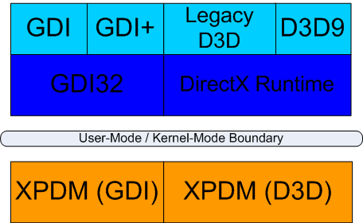
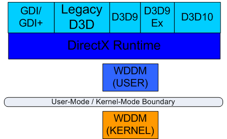

# Graphics APIs in Windows

Windows Vista includes support for an entirely new display driver model that represents a major revision in the design of video drivers since the introduction of the Windows Driver Model (WDM) for Windows 98. This redesigned model reflects the evolution of video hardware from the world of 2D raster operations and GDI applications to that of 3D games with fixed-function graphics hardware, and finally to that of the modern programmable graphics processing unit (GPU) that supports a wide-range of high-performance graphics applications. Windows 7 and Windows 8 build on the Windows Vista graphics infrastructure by providing additional graphics features and APIs. This articles discusses Windows graphics features and APIs.

-   [Background](#background)
-   [Direct3D 9](#direct3d-9)
-   [Direct3D 9Ex](#direct3d-9ex)
-   [Direct3D 10](#direct3d-10)
-   [Direct3D 10.1](#direct3d-101)
-   [Direct3D 11](#direct3d-11)
-   [Direct3D 11.1](#direct3d-111)
-   [OpenGL](#opengl)
-   [Application Compatibility, GDI, and older versions of Direct3D](#application-compatibility-gdi-and-older-versions-of-direct3d)
-   [Recommendations](#recommendations)

## Background

The primary API for programming graphics since the early days of Windows has been the Graphical Device Interface (GDI). This API was designed to handle numerous 2D output devices, and it formed the basis for the Windows user interface experience. DirectDraw and Direct3D were introduced as alternative APIs to support full-screen games and 3D rendering as extensions to the existing hardware of the time. Interactions with GDI were complicated. The effective intermixing of traditional GDI elements with Direct3D elements has been limited by this design. The Windows XP version of WDM, known as XPDM, reflects the side-by-side nature of GDI and Direct3D (see Figure 1).

**Figure 1. Graphics APIs in Windows XP**

Over the years, the power of 3D video cards has grown dramatically to the point where the vast majority of hardware is dedicated to this function. A new driver model, Windows Display Driver Model (WDDM), brings the GPU and Direct3D to the forefront, allowing the creation of an entirely new experience, the 3D desktop, that seamlessly blends the 2D world of GDI with the power of modern programmable GPUs. With WDDM, the video hardware is driven entirely by Direct3D, and all other graphics interfaces communicate with the video hardware via the new Direct3D–centric driver model (see Figure 2).

**Figure 2. Graphics APIs in Windows Vista**

For more information about the WDDM, see [Windows Vista Display Driver Model (WDDM) Design Guide](/windows-hardware/drivers/display/windows-vista-display-driver-model-design-guide) on MSDN.

## Direct3D 9

Version 9 of DirectX was first released for Windows in 2002, with subsequent updates in 2003 and 2004. This API represents a decade of evolution of the DirectX technologies, the introduction of more powerful shader programming models for Direct3D, and a maturity backed by thousands of shipping titles. Direct3D 9 is the primary graphics interface on Windows Vista. It remains the ideal API to use for writing 3D games and applications that need to run on the broad range of existing hardware and Windows releases. The details of the new driver model are hidden from applications using the Direct3D 9 interfaces, but behind the scenes the operating system is taking full advantage of the new capabilities to provide true multitasking of the GPU, more efficient resource management, and robust performance.

To ensure full compatibility with older versions of Windows, some quirks of the old driver model must be emulated even with the new Windows Vista display driver model. For example, when a full-screen application loses focus, it must assume it has lost all the resources in video memory (VRAM) and reload those it created as unmanaged resources even though the new driver model handles the resources transparently without evicting them from the device context. Even the concept of a managed vs. default resource type is specific to the old driver model. Another example is the expectation of failure when allocating unmanaged (default pool) resources in excess of the amount of VRAM available, even though the new driver model can provide a nearly unlimited amount of virtual video memory. Because of these requirements, Direct3D applications running on Windows Vista will still receive these error conditions. Thus, they are limited in their ability to use the basic Direct3D 9 interfaces to fully use some features of the new driver model.

While new systems shipping with Windows Vista will include video cards with WDDM drivers, and new drivers for a number of popular video cards are included in the box, Windows Vista continues to support the ability to use older XPDM drivers for upgrades and corporate editions. On systems using the old driver model, Direct3D 9 and older interfaces must be used, and the operation of the graphics system is very similar to that of Windows XP (Figure 1). WDDM is required for applications to use Direct3D 9Ex, Direct3D 10, and later versions.

## Direct3D 9Ex

The Direct3D 9Ex interface provides access to a slight extension of the standard Direct3D 9 API that exposes the virtualized resource allocation, new lost device semantics, and some other new features available while running on Windows Vista. By creating this extended object, the Direct3D 9 API uses the new semantics, and therefore requires the application to use different logic (and therefore different code paths) for resource creation, management, and error handling for new kinds of conditions. This API is only available on Windows Vista, and it requires WDDM drivers. Because Direct3D 9Ex uses a separate API and driver code path than Direct3D 9, supporting this API requires additional test cases for your application.

The primary reason for creating the new Direct3D 9Ex API was to allow full access to the new capabilities of WDDM while maintaining compatibility for existing Direct3D applications. The new 3D desktop and many Windows Vista-specific applications make use of this version of Direct3D 9, but they are not functional when running on older XPDM drivers. Because the Direct3D 9Ex API will never appear on older versions of Windows due to a lack of support for the WDDM, the standard Direct3D 9 interfaces cover a much broader set of systems. For high-performance applications that can take advantage of the next generation of video hardware, the entirely new version 10 of Direct3D provides many new capabilities not exposed by Direct3D 9Ex. As a result, for games and most other applications, Direct3D 9 or Direct3D 10 is the recommended API.

> [!Note]  
> The DirectX SDK does not provide samples, headers, or libraries for the Direct3D 9Ex interface. The MSDN Library and Windows SDK (formerly known as the Platform SDK) contain the available documentation, headers, and libraries.

 

For more information about Direct3D 9Ex, see [DirectX for Windows Vista](/previous-versions//ms681824(v=vs.85)) on MDSN.

## Direct3D 10

To fully realize the potential of the new Windows Vista driver model and next-generation hardware, an entirely new version of the Direct3D API has been created. While WDDM eliminates some of the limitations on performance in the existing graphics system, Direct3D 10 goes further by removing design bottlenecks in the existing Direct3D API, and greatly simplifies the task of programming the GPU.

The new API completely eliminates all but a few fixed-function aspects, replacing them with programmable constructs and greatly streamlining the internal implementation. The hundreds of capability bits in previous versions of Direct3D have been completely eliminated and replaced with a well-defined, inclusive set of functionality that has only a few optional usage scenarios for specific resource formats. CPU-intensive resource creation and validation now have explicit semantics in the new API. This allows for much more predictable performance behavior, and greatly reduced per-draw overhead. Resources can be reconfigured into multiple forms to allow efficient use at various stages, and the feature set imposes far fewer restrictions on usage scenarios for formats. There are also new block-compressed normal-map texture formats.

In the new API, shader constants and device state are explicit resources, allowing for far more efficient caching on the hardware and greatly simplified driver validation. The programmable shader model has been unified across both vertex and pixel shaders, and made more expressive with a well-defined computational model and operator set. Also, a new geometry shader stage has been added to operate on primitives after the vertex shader stage. The results of the GPU’s work in the vertex and geometry shader stages of the pipeline can be streamed out to video RAM for reuse, allowing for the possibility of extremely complex multi-pass GPU operations with minimal CPU interaction.

All of these enhancements enable next-generation graphics technology and expand the ability of applications to off-load work to the GPU. Offloading allows more complex GPU-based character skinning, accelerated morphing techniques, shadow volume generation and extrusion, particle and physics systems that are entirely GPU-based, more complex materials combined into efficient large-draw batches, procedural detailing, real-time ray-traced displacement mapping, single-pass cube-map generation, and many more techniques—all while freeing up CPU resources for more complex applications.

To provide this level of innovation in Direct3D 10, older hardware cannot be expressed as a partial implementation of a new interface. A video card is either capable of supporting all of the new features, or it’s not a Direct3D 10–capable card. Therefore, while Direct3D 9 could drive DirectX7-era hardware with many missing capability bits and usage limitations, Direct3D 10 only works on a new generation of video cards. For an application to support older video hardware, it must also support the Direct3D 9 interfaces. Future versions of Direct3D will build on version 10, extending it to new versions of the API while ensuring a strict superset of Direct3D 10 functionality.

For more information about Direct3D 10, see [Direct3D 10](/windows/desktop/direct3d10/d3d10-graphics).

## Direct3D 10.1

Windows Vista Service Pack 1 extends the Direct3D 10 API with Direct3D 10.1, which adds optional interfaces and an additional shader model to support new hardware features of video cards that support Direct3D 10.1. All hardware that is capable of supporting Direct3D 10.1 also fully supports all features of Direct3D 10, and game developers can make use of the additional features of Direct3D 10.1, when available.

> [!Note]  
> Direct3D 10.1 is the graphics API used by the Windows 7 desktop.

 

> [!Note]  
> Windows 7 and the Windows Vista update add support for DXGI 1.1, 10level9 feature levels, and the WARP10 device to the existing Direct3D 10.1 API.

 

## Direct3D 11

Windows 7 supports a new revision of Direct3D, Direct3D 11, built on the design of Direct3D 10.1 API. New features of the API include multithreaded rendering and resource creation, Compute Shader, support for 10level9 feature levels and the WARP10 software rendering device, and new Direct3D 11 class hardware features such as tessellation using hull & domain shaders, BC6H and BC7 texture compression formats, Shader Model 5.0, and Dynamic Shader Linkage. The new API can use existing Direct3D 10 and 10.1 class video cards, some Direct3D 9 cards through the 10level9 feature levels with limited feature support, and the latest generation Direct3D 11 class video cards.

In addition to the Direct3D 11 API, Windows 7 includes DXGI 1.1, Direct2D, DirectWrite, and support for WDDM 1.1 drivers.

> [!Note]  
> The Direct3D 11 and related APIs are also available as an update to Windows Vista (see [How to install the latest version of DirectX](https://support.microsoft.com/topic/how-to-install-the-latest-version-of-directx-d1f5ffa5-dae2-246c-91b1-ee1e973ed8c2)).

 

## Direct3D 11.1

Windows 8 extends the [Direct3D 11 API](#direct3d-11) with Direct3D 11.1. Direct3D 11.1 supports all existing hardware that [feature levels](/windows/desktop/direct3d11/overviews-direct3d-11-devices-downlevel-intro) 11, 10\_x, and 9\_x support, as well as a new 11\_1 feature level.

In addition to the [Direct3D 11.1 API](/windows/desktop/direct3d11/direct3d-11-1-features), Windows 8 includes [DXGI 1.2](/windows/desktop/direct3ddxgi/dxgi-1-2-improvements), [Direct2D device contexts](/windows/desktop/Direct2D/devices-and-device-contexts), and support for WDDM 1.2 drivers.

> [!Note]  
> If you want your Windows Store apps to program 3D graphics with DirectX, you can use the Direct3D 11.1 API. For more info about programming 3D graphics with DirectX, see [Introduction to 3D graphics with DirectX](/previous-versions/windows/apps/hh465137(v=win.10)).

 

**Platform Update for Windows 7:** Partial support is available for the [Direct3D 11.1 API](/windows/desktop/direct3d11/direct3d-11-1-features) on Windows 7 or Windows Server 2008 R2 with the [Platform Update for Windows 7](https://support.microsoft.com/kb/2670838) installed. For more info about the Platform Update for Windows 7, see [Platform Update for Windows 7](platform-update-for-windows-7.md).

## OpenGL

Windows Vista, Windows 7, and Windows 8 provide the same support as Windows XP for OpenGL, which allows video card manufactures to provide an installable client driver (ICD) for OpenGL that provides hardware-accelerated support. Note that newer versions of such ICDs are required to fully support Windows Vista, or Windows 7, or Windows 8. If no ICD is installed, the system will fall back to the OpenGL v1.1 software layer in most cases.

## Application Compatibility, GDI, and older versions of Direct3D

The Windows Vista, Windows 7, and Windows 8 graphics systems are designed to support a broad range of hardware and usage scenarios to enable new technology while continuing to support existing systems. Existing graphics interfaces, such as GDI, GDI+, and older versions of Direct3D, continue to work on Windows Vista and Windows 7, but are internally remapped where possible. This means that the majority of existing Windows applications will continue to work.

Windows Vista, Windows 7, and Windows 8 continue to support the same Direct3D and DirectDraw interfaces as Windows XP, back to version 3 of DirectX (with the exception of Direct3D's Retained Mode, which has been removed). Just as with Windows XP Professional x64 Edition, 64-bit native applications on newer versions of Windows are limited to Direct3D9, DirectDraw7, or newer interfaces. High-performance applications should make use of Direct3D 9 or later to ensure that they have the closest match to the hardware capabilities.

## Recommendations

Consider the following recommendations when selecting an API for your graphical application:

-   Use Direct3D 9 if your application must support Windows XP or an earlier version of Windows.
-   Use Direct3D 9 if you want to support Windows Vista or Windows 7 running with XPDM drivers. For Windows Vista or Windows 7 systems that lack Direct3D 10 or better video hardware, you can either choose to use the existing Windows XP Direct3D 9 code path or use the 10level9 feature levels through the Direct3D 10.1 or Direct3D 11 API.
-   Use Direct3D 11 to take advantage of the next generation of video hardware on Windows Vista, Windows 7, and Windows 8. Windows Store apps must use Direct3D 11 or later.

 

 
