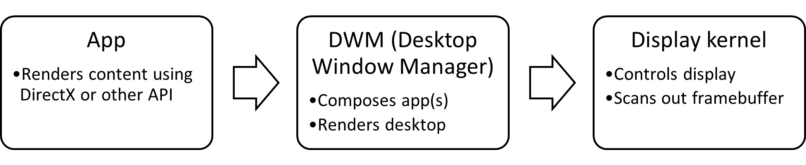
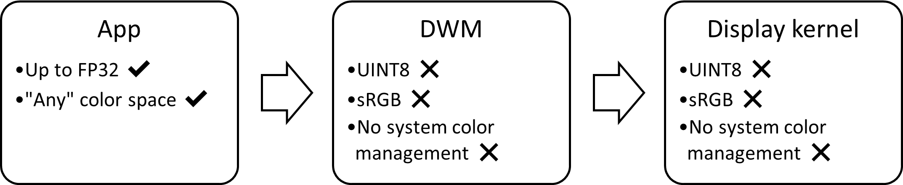
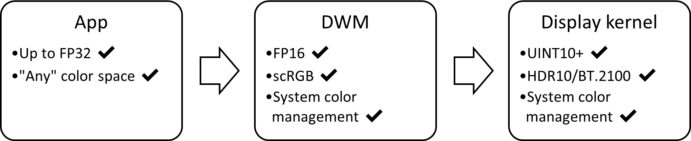
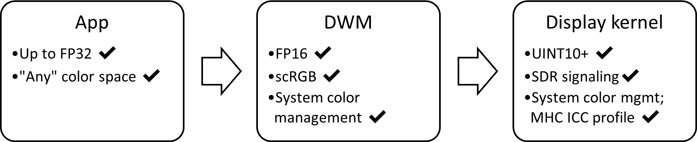

# Use DirectX with Advanced Color on high/standard dynamic range displays

This topic shows how to use DirectX with Advanced Color scenarios&mdash;including high dynamic range (HDR), wide color gamut (WCG) with automatic system color management, and high bit-depth. Premium personal computer (PC) displays with at least one of the above enhancements are becoming widespread, providing significantly higher color fidelity than traditional standard dynamic range (SDR) displays.

In this topic, you'll get an overview of the key technical concepts behind Windows Advanced Color support. You'll learn requirements and instructions for rendering HDR, WCG, and high bit-depth DirectX content to one of these displays. If you have a color-managed app (for example, using ICC profiles), then you'll learn how auto color management enables better color accuracy for your scenarios.

## Introduction to Advanced Color in Windows

*Advanced Color* is an umbrella term of operating system (OS) technologies for displays with significantly higher color fidelity than standard displays. The predominant extended capabilities are described in the sections below. Advanced Color capabilities were first introduced for HDR displays with Windows 10, version 1709 (Fall Creators Update), and for specially provisioned SDR displays with the Windows 11, version 22H2 (10.0; Build 22621) release.

### High dynamic range

Dynamic range refers to the difference between the maximum and minimum luminance in a scene; this is often measured in nits (candelas per square centimeter). Real world scenes, such as this sunset, often have dynamic ranges of 10 orders of magnitude of luminance; the human eye can discern an even greater range after adaptation.


Ever since Direct3D 9, graphics engines have been able to internally render their scenes with this level of physically accurate fidelity. However, a typical standard dynamic range display can reproduce only a little more than 3 orders of magnitude of luminance, and therefore any HDR-rendered content had to be tonemapped (compressed) into the limited range of the display. New HDR displays, including those that comply with the HDR10 (BT.2100) standard, break through this limitation; for example, high quality self-emissive displays can achieve greater than 6 orders of magnitude.

### Wide color gamut

Color gamut refers to the range and saturation of hues that a display can reproduce. The most saturated natural colors the human eye can perceive consist of pure, monochromatic light such as that produced by lasers. However, mainstream consumer displays can often reproduce colors only within the sRGB gamut, which represents only about 35% of all human-perceivable colors. The diagram below is a representation of the human "spectral locus", or all perceivable colors (at a given luminance level), where the smaller triangle is the sRGB gamut.


High end, professional PC displays have long supported color gamuts that are significantly wider than sRGB, such as Adobe RGB and DCI-P3 which cover around half of human-perceivable colors. And these wide gamut displays are becoming more common.

### Automatic system color management

Color management is the technology and practice of ensuring accurate and consistent color reproduction across devices. If you're a digital content creator, its crucial for the colors in your visual content&mdash;such as a photo, a product image, or a logo&mdash;to appear the same on your display as it does on your audience's wide variety of digital devices.

Windows has provided color management support APIs since Windows 2000 with the Image Color Management (ICM) and later [Windows Color System (WCS)](/windows/win32/wcs/windows-color-system) APIs. However, those APIs were only helpers for apps that wished/required to do color management; while most apps and digital content simply assumed the industry standard sRGB color space, and were never color-managed by the OS. That was a reasonable assumption in the past, but high-quality wide gamut displays are becoming much more common.

New versions of Windows support automatic system color management; that ensures that all colors in every Windows app, whether or not they are color-aware, appear accurately and consistently on every supported display.

> [!NOTE]
> Auto color management is not a property of the display hardware; instead, it's a Windows feature to properly support displays that have larger color gamuts than sRGB.

### Deep precision/bit depth

Numerical precision, or bit depth, refers to the amount of information used to uniquely identify colors. Higher bit depth means that you can distinguish between very similar colors without artifacts such as banding. Mainstream PC displays support 8 bits per color channel, while the human eye requires at least 10-12 bits of precision to avoid perceivable distortions.


Prior to Advanced Color, the Desktop Window Manager (DWM) restricted windowed apps to output content at only 8 bits per color channel, even if the display supported a higher bit depth. When Advanced Color is enabled, the DWM performs its composition using IEEE half-precision floating point (FP16), eliminating any bottlenecks, and allowing the full precision of the display to be used.

## Windows Advanced Color system architecture

The info in this section is optional for building Advanced Color apps; but it's helpful to understand how the technology works in order to optimize your app's rendering and behavior.

In this section, we'll use a simplified diagram to describe the relevant components of the Windows graphics stack:



### Existing Windows: 8-bit / sRGB displays

For decades, consumer displays and the Windows graphics stack were based around 8 bits per channel (24 bits per pixel) sRGB content. Apps using graphics APIs such as DirectX could perform internal rendering using high bit-depths and extended color spaces; however, the OS supported only 8-bit integer with implicit sRGB and no system color management:



That meant that any additional color data rendered by an app would be lost when being displayed; and that the app had to perform color management itself to ensure accurate reproduction on a display.

### Windows 10, version 1703: HDR displays with Advanced Color

Windows 10, version 1703 introduced the first version of Advanced Color capabilities for HDR displays. That required several significant advances in the OS graphics stack:

* HDR display signaling support
* System composition using a high bit-depth, canonical color space
* Automatic system color management



Each advancement is covered in the sub-sections below. The net result is that extended app color data is now correctly preserved by the OS, and accurately reproduced on HDR displays.

#### HDR display signaling support

HDR signaling over display connectors such as DisplayPort and HDMI primarily uses 10 bits per channel precision (or greater) and the BT.2100 ST.2084 color space. The display kernel, display driver, and underlying GPU hardware all need to support detecting, selecting, and driving this signaling mode.

#### System composition using a high bit-depth, canonical color space

The BT.2100 ST.2084 color space is an efficient standard for encoding HDR colors, but it's not well suited for many rendering and composition (blending) operations. We also want to future proof the OS to support technologies and color spaces well beyond BT.2100, which covers less than 2/3 of human-visible colors. Finally, where possible we want to minimize GPU resource consumption in order to improve power and performance.

When in HDR mode, the Desktop Window Manager (DWM) uses a canonical composition color space (CCCS) defined as:

* scRGB color space (BT.709/sRGB primaries with linear gamma)
* IEEE half precision (FP16 bit depth)

That provides a good balance between all of the above goals. CCCS allows color values outside of the [0, 1] numeric range; given the range of valid FP16 values, it can represent orders of magnitude more colors than the natural human visual range, including luminance values over 5 million nits. FP16 has excellent precision for linear gamma blend operations, but costs half the GPU memory consumption and bandwidth of traditional single precision (FP32) with no perceivable quality loss.

#### Automatic system color management

Windows is a multitasking environment where the user can run any number of SDR and HDR apps at the same time with overlapping windows. Therefore, it's crucial that all types of content look correct and at maximum quality when output to a display; for example, an sRGB (SDR) productivity app with a BT.2100 ST.2084 (HDR) video window playing over it.

When in HDR mode, Windows performs color management operations in two stages:

1. The DWM converts each app from its native color space to CCCS before blending.
2. The display kernel converts the OS framebuffer from CCCS to the wire format color space (BT.2100 ST.2084).
    * Optionally, the display kernel works with the display driver to perform additional display color calibration; for more info, see [Windows hardware display color calibration pipeline](/windows/win32/wcs/display-calibration-mhc).


> [!NOTE]
> In both stages, the color management operation consists of a color space conversion (matrix and 1DLUT). Colors that exceed the display's target color gamut are numerically clipped.

### Windows 11, version 22H2: SDR displays with Advanced Color

While the prevalence of HDR displays is growing rapidly, SDR displays will remain important for years to come. HDR support in Windows 10, version 1703 laid most of the groundwork needed to enhance SDR displays too. Windows 11, version 22H2  extends Advanced Color and auto color management capabilities to certain qualifying SDR displays. The graphics block diagram for Advanced Color SDR displays looks very similar to HDR:



#### SDR display signaling support with high bit-depth

The underlying signaling for SDR displays is unchanged, although the Windows 11m version 22H2 release supports 10 bits per channel and greater, depending on the display's capabilities.

#### System composition using a high bit-depth, canonical color space

DWM Advanced Color functionality including blending in CCCS is almost entirely unchanged from HDR displays. The main difference is that DWM uses display-referred luminance with SDR displays, and scene-referred luminance with HDR displays. This changes the way that your Advanced Color rendered content is interpreted by the OS:

| Display kind | Luminance behavior | How is 1.0f interpreted                     |
| ------------ | ------------------ | ------------------------------------------- |
| SDR          | Display-referred   | As the reference white level of the display |
| HDR          | Scene-referred     | As 80 nits (nominal reference white)        |

#### Automatic system color management

OS system color management capabilities are also mostly unchanged from HDR displays. The main difference is that the display kernel converts to the display-referred color space as defined by the display's colorimetry and calibration data, instead of the standard BT.2100 ST.2084 color space for HDR displays.

#### Display provisioning required

Accurate data from an MHC ICC profile is needed to define the display kernel's output color management operation. Therefore, only SDR displays that have been specifically provisioned by the manufacturer or a display calibration provider with a valid profile are eligible for auto color management. See [ICC profile behavior with Advanced Color](/windows/win32/wcs/advanced-color-icc-profiles) for more info.

## System requirements and operating system support

Windows 10, version 1709 first shipped Advanced Color support for HDR displays. The Windows 11, version 22H2 release adds Advanced Color support for SDR displays that have accurate provisioning data.

This topic assumes that your app is targeting Windows 10, version 2004 (or later) for HDR displays, and the Windows 11, version 22H2 release (or later) for SDR displays.

### Display

A high dynamic range display must implement the HDR10, or BT.2100 ST.2084, standard. HDR display quality can vary greatly, and we strongly recommend displays that are certified, such as [VESA DisplayHDR](https://displayhdr.org/). Starting with the Windows 11, version 22H2 release, Windows displays the certification status of known displays in the **Settings** app.

A standard dynamic range display must have accurate color provisioning data for Advanced Color support. In the Windows 11, version 22H2 release, the only supported method to override this data is via an MHC ICC profile; in addition, the user or display manufacturer must have enabled auto color management. For more info, see [ICC profile behavior with Advanced Color](/windows/win32/wcs/advanced-color-icc-profiles).

### Graphics processor (GPU)

For full Advanced Color functionality on both SDR and HDR displays, a recent GPU is required:

* AMD Radeon RX 400 series (Polaris), or newer
* NVIDIA GeForce 10 series (Pascal), or newer
* Selected Intel Core 10th gen (Ice Lake), or newer\*

> [!NOTE]
> Intel code name Comet Lake (5 digit model code) chipsets don't provide full functionality.

Additional hardware requirements might apply, depending on the scenarios, including hardware codec acceleration (10 bit HEVC, 10 bit VP9, etc.) and PlayReady support (SL3000). Contact your GPU vendor for more specific information.

### Graphics driver (WDDM)

The latest available graphics driver is strongly recommended, either from Windows Update or from the GPU vendor or PC manufacturer's website. This topic relies on driver functionality from WDDM 2.7 (Windows 10, version 2004) for HDR displays, and WDDM 3.0 (Windows 11, version 21H2) for SDR displays.

### Supported rendering APIs

Windows 10 supports a wide variety of rendering APIs and frameworks. Advanced color support fundamentally relies on your app being able to perform modern presentation using either DXGI or the Visual Layer APIs.

* [DirectX Graphics Infrastructure (DXGI)](/windows/win32/direct3ddxgi/dx-graphics-dxgi)
* [Visual Layer (Windows.UI.Composition)](/windows/uwp/composition/visual-layer)

Therefore, any rendering API that can output to one of those presentations methods can support Advanced Color. That includes (but is not limited to) the below.

* [Direct3D 11](../direct3d11/atoc-dx-graphics-direct3d-11.md)
* [Direct3D 12](../direct3d12/direct3d-12-graphics.md)
* [Direct2D](../direct2d/direct2d-portal.md)
* [Win2D](https://github.com/Microsoft/Win2D)
  * Requires using the lower level **CanvasSwapChain** or **CanvasSwapChainPanel** APIs.
* [Windows.UI.Input.Inking](/uwp/api/Windows.UI.Input.Inking)
  * Supports custom dry ink rendering using DirectX.
* [XAML](/windows/uwp/xaml-platform/)
  * Supports playback of HDR videos using **MediaPlayerElement**.
  * Supports decode of JPEG XR images using **Image** element.
  * Supports DirectX interop using **SwapChainPanel**.

## Handling dynamic display capabilities

Windows 10 supports an enormous range of Advanced Color-capable displays, from power-efficient integrated panels to high-end gaming monitors and TVs. Windows users expect that your app will seamlessly handle all of those variations, including ubiquitous existing SDR displays.

Windows 10 provides control over HDR and Advanced Color capabilities to the user. Your app must detect the current display's configuration, and respond dynamically to any changes in capability. That could occur for many reasons, for example, because the user enabled or disabled a feature, or moved the app between different displays, or the system's power state changed.

### Option 1: AdvancedColorInfo

> [!NOTE]
> The [**AdvancedColorInfo**](/uwp/api/windows.graphics.display.advancedcolorinfo) Windows Runtime API is usable independently of the rendering API, supports Advanced Color for SDR displays, and uses events to signal when capabilities change. However, it's available only for Universal Windows Platform (UWP) apps; desktop apps (which don't have a [**CoreWindow**](/uwp/api/Windows.UI.Core.CoreWindow)) can't use it. For more info, see [Windows Runtime APIs not supported in desktop apps](/windows/apps/desktop/modernize/desktop-to-uwp-supported-api).

First, obtain an instance of **AdvancedColorInfo** from [**DisplayInformation::GetAdvancedColorInfo**](/uwp/api/windows.graphics.display.displayinformation.getadvancedcolorinfo).

To check what Advanced Color kind is currently active, use the [**AdvancedColorInfo::CurrentAdvancedColorKind**](/uwp/api/windows.graphics.display.advancedcolorinfo.currentadvancedcolorkind) property. That's the most important property to check, and you should configure your render and presentation pipeline in response to the active kind:

| Advanced color kind | Display capabilities                                      |
| ------------------- | --------------------------------------------------------- |
| SDR                 | SDR display with no Advanced Color capabilities           |
| WCG                 | SDR display with high bit-depth and auto color management |
| HDR                 | HDR display with all Advanced Color capabilities          |

To check what Advanced Color kinds are supported, but not necessarily active, call [**AdvancedColorInfo::IsAdvancedColorKindAvailable**](/uwp/api/windows.graphics.display.advancedcolorinfo.isadvancedcolorkindavailable). You could use that information, for example, to prompt the user to navigate to the Windows **Settings** app so that they can enable HDR or auto color management.

The other members of **AdvancedColorInfo** provide quantitative information about the panel's physical color volume (luminance and chrominance), corresponding to SMPTE ST.2086 static HDR metadata. Even though ST.2086 was originally designed for HDR displays, that info is useful, and is available for both HDR and SDR displays. You should use that information to configure your app's tone mapping and gamut mapping.

To handle changes in Advanced Color capabilities, register for the [**DisplayInformation::AdvancedColorInfoChanged**](/uwp/api/windows.graphics.display.displayinformation.advancedcolorinfochanged) event. That event is raised if any parameter of the display's Advanced Color capabilities changes for any reason.

Handle that event by obtaining a new instance of **AdvancedColorInfo**, and checking which values have changed.

### IDXGIOutput6

> [!NOTE]
> The DirectX Graphics Infrastructure [**IDXGIOutput6**](/windows/win32/api/dxgi1_6/nn-dxgi1_6-idxgioutput6) interface is available for any app that uses DirectX, whether it's desktop or Universal Windows Platform (UWP). However, **IDXGIOutput6** *doesn't* support SDR displays with Advanced Color capabilities such as auto color management; it can identify only HDR displays.

If you're writing a Win32 desktop app, and using DirectX to render, then use [**DXGI_OUTPUT_DESC1**](/windows/win32/api/DXGI1_6/ns-dxgi1_6-dxgi_output_desc1) to get display capabilities. Obtain an instance of that struct via [**IDXGIOutput6::GetDesc1**](/windows/win32/api/dxgi1_6/nf-dxgi1_6-idxgioutput6-getdesc1).

To check what Advanced Color kind is currently active, use the **ColorSpace** property, which is of type [**DXGI_COLOR_SPACE_TYPE**](/windows/win32/api/dxgicommon/ne-dxgicommon-dxgi_color_space_type), and contains one of the following values:

| DXGI_COLOR_SPACE_TYPE                      | Display capabilities                             |
| ------------------------------------------ | ------------------------------------------------ |
| DXGI_COLOR_SPACE_RGB_FULL_G22_NONE_P709    | SDR display with no Advanced Color capabilities  |
| DXGI_COLOR_SPACE_RGB_FULL_G2084_NONE_P2020 | HDR display with all Advanced Color capabilities |

> [!NOTE]
> SDR displays with Advanced Color capabilities are also reported as **DXGI_COLOR_SPACE_RGB_FULL_G22_NONE_P709**; DXGI doesn't allow you to distinguish between the two types.

> [!NOTE]
> DXGI doesn't let you check what Advanced Color kinds are supported-but-not-active at the moment.

Most of the other members of **DXGI_OUTPUT_DESC1** provide quantitative information about the panel's physical color volume (luminance and chrominance), corresponding to SMPTE ST.2086 static HDR metadata. Even though ST.2086 was originally designed for HDR displays, that info is useful and is available for both HDR and SDR displays. You should use that information to configure your app's tone mapping and gamut mapping.

Win32 desktop apps don't have a native mechanism to respond to Advanced Color capability changes. Instead, if your app uses a render loop, then you should query [**IDXGIFactory1::IsCurrent**](/windows/win32/api/DXGI/nf-dxgi-idxgifactory1-iscurrent) with each frame. If it reports **FALSE**, then you should obtain a new **DXGI_OUTPUT_DESC1**, and check which values have changed.

In addition, your Win32 message pump should handle the [**WM_SIZE**](../winmsg/wm-size.md) message, which indicates that your app might have moved between different displays.

> [!NOTE]
> To obtain a new **DXGI_OUTPUT_DESC1**, you must obtain the current display. However, you shouldn't call **IDXGISwapChain::GetContainingOutput**. That's because swap chains return a stale DXGI output once **DXGIFactory::IsCurrent** is false; and recreating the swap chain to get a current output results in a temporarily black screen. Instead, we recommend that you enumerate through the bounds of all DXGI outputs, and determine which one has the greatest intersection with your app window's bounds.

The following example code comes from the [Direct3D 12 HDR sample app](https://github.com/Microsoft/DirectX-Graphics-Samples/tree/master/Samples/Desktop/D3D12HDR) on GitHub.

```cpp
// Retrieve the current default adapter.
ComPtr<IDXGIAdapter1> dxgiAdapter;
ThrowIfFailed(m_dxgiFactory->EnumAdapters1(0, &dxgiAdapter));

// Iterate through the DXGI outputs associated with the DXGI adapter,
// and find the output whose bounds have the greatest overlap with the
// app window (i.e. the output for which the intersection area is the
// greatest).

UINT i = 0;
ComPtr<IDXGIOutput> currentOutput;
ComPtr<IDXGIOutput> bestOutput;
float bestIntersectArea = -1;

while (dxgiAdapter->EnumOutputs(i, &currentOutput) != DXGI_ERROR_NOT_FOUND)
{
    // Get the retangle bounds of the app window
    int ax1 = m_windowBounds.left;
    int ay1 = m_windowBounds.top;
    int ax2 = m_windowBounds.right;
    int ay2 = m_windowBounds.bottom;

    // Get the rectangle bounds of current output
    DXGI_OUTPUT_DESC desc;
    ThrowIfFailed(currentOutput->GetDesc(&desc));
    RECT r = desc.DesktopCoordinates;
    int bx1 = r.left;
    int by1 = r.top;
    int bx2 = r.right;
    int by2 = r.bottom;

    // Compute the intersection
    int intersectArea = ComputeIntersectionArea(ax1, ay1, ax2, ay2, bx1, by1, bx2, by2);
    if (intersectArea > bestIntersectArea)
    {
        bestOutput = currentOutput;
        bestIntersectArea = static_cast<float>(intersectArea);
    }

    i++;
}

// Having determined the output (display) upon which the app is primarily being 
// rendered, retrieve the HDR capabilities of that display by checking the color space.
ComPtr<IDXGIOutput6> output6;
ThrowIfFailed(bestOutput.As(&output6));

DXGI_OUTPUT_DESC1 desc1;
ThrowIfFailed(output6->GetDesc1(&desc1));
```

## Setting up Your DirectX swap chain

Once you've determined that the display currently supports Advanced Color capabilities, configure your swap chain as follows.

### Use a flip presentation model effect

When creating your swap chain using one of the **CreateSwapChainFor[Hwnd|Composition|CoreWindow]** methods, you must use the DXGI flip model by selecting either the **DXGI_SWAP_EFFECT_FLIP_SEQUENTIAL** or **DXGI_SWAP_EFFECT_FLIP_DISCARD** option, which makes your swap chain eligible for Advanced Color processing from DWM and various fullscreen optimizations. For more information, see [For best performance, use DXGI flip model](/windows/win32/direct3ddxgi/for-best-performance--use-dxgi-flip-model).

### Option 1. Use FP16 pixel format and scRGB color space

Windows 10 supports two main combinations of pixel format and color space for Advanced Color. Select one based on your app's specific requirements.

We recommend that general-purpose apps use Option 1. It's the only option that works for all types of Advanced Color displays, content, and rendering APIs. When creating your swap chain, specify [**DXGI_FORMAT_R16G16B16A16_FLOAT**](/windows/win32/api/dxgiformat/ne-dxgiformat-dxgi_format) in your [**DXGI_SWAP_CHAIN_DESC1**](/windows/win32/api/dxgi1_2/ns-dxgi1_2-dxgi_swap_chain_desc1). By default, a swap chain created with a floating point pixel format is treated as if it uses the [**DXGI_COLOR_SPACE_RGB_FULL_G10_NONE_P709**](/windows/win32/api/dxgicommon/ne-dxgicommon-dxgi_color_space_type) color space. That's the same pixel format and color space used by the DWM.

That combination provides you with the numeric range and precision to specify any physically possible color, and perform arbitrary processing including blending. 

However, that option consumes 64 bits per pixel, which doubles GPU bandwidth and memory consumption compared to the traditional UINT8 pixel formats. In addition, scRGB uses numeric values that are outside the normalized [0, 1] range to represent colors that are outside the sRGB gamut and/or greater than 80 nits of luminance. For example, scRGB (1.0, 1.0, 1.0) encodes the standard D65 white at 80 nits; but scRGB (12.5, 12.5, 12.5) encodes the same D65 white at a much brighter 1000 nits. Some graphics operations require a normalized numeric range, and you must either modify the operation, or re-normalize color values.

The way that luminance values are interpreted with that option differs between SDR and HDR displays; see below.

### Option 2: Use UINT10/RGB10 pixel format and HDR10/BT.2100 color space

Option 2 is a performance optimization that's available only if your app meets all of the following conditions:

* Targets an HDR display
* Uses Direct3D 12 or Direct3D 11
* Swap chain doesn't require blending with alpha/transparency

If your app doesn't meet all of those conditions, then you must use Option 1.

But if your app qualifies for option 2, then that might provide better performance if your app is consuming HDR10-encoded content, such as a video player, or if it mainly will be used in fullscreen scenarios, such as a game. When creating your swap chain you should consider specifying [**DXGI_FORMAT_R10G10B10A2_UNORM**](/windows/win32/api/dxgiformat/ne-dxgiformat-dxgi_format) in [**DXGI_SWAP_CHAIN_DESC1**](/windows/win32/api/dxgi1_2/ns-dxgi1_2-dxgi_swap_chain_desc1). By default, that's treated as using the sRGB color space; therefore, you must explicitly call [**IDXGISwapChain3::SetColorSpace1**](/windows/win32/api/dxgi1_4/nf-dxgi1_4-idxgiswapchain3-setcolorspace1), and set as your color space [**DXGI_COLOR_SPACE_RGB_FULL_G2084_NONE_P2020**](/windows/win32/api/dxgicommon/ne-dxgicommon-dxgi_color_space_type), also known as HDR10/BT.2100.

This option consumes the same 32 bits per pixel as traditional UINT8 SDR pixel formats. In addition, on certain GPUs this eliminates some processing needed to convert the content to the HDR10 wire format.

### Using an Advanced Color swap chain when the display is in SDR mode

You can use an Advanced Color swap chain even if the display doesn't support all Advanced Color capabilities. In those cases, the Desktop Window Manager (DWM) will downconvert your content to fit the display's capabilities by performing numeric clipping. For example, if you render to an FP16 scRGB swap chain, and target a standard display, then everything outside of the [0, 1] numeric range is clipped.

That downconversion behavior will also occur if your app window is straddling two or more displays with differing Advanced Color capabilities. **AdvancedColorInfo** and **IDXGIOutput6** are abstracted to report only the *main* display's characteristics (*main* being defined as the display containing the center of the window).

## Match your app's reference white to the OS SDR reference white level

> [!NOTE]
> Reference white applies only to HDR displays; for SDR Advanced Color displays, (1.0, 1.0, 1.0) always means the maximum white luminance that the display can reproduce.

In many scenarios, your app will want to render both SDR and HDR content; for example, rendering subtitles or transport controls over HDR video, or UI into a game scene. It's important to understand the concept of *SDR reference white level* to ensure that your SDR content looks correct on an HDR display. Reference white indicates the brightness at which a diffuse white object (such as a sheet of paper, or sometimes UI) appears in an HDR scene. Because HDR color values have *scene-referred brightness*, a particular color value should be displayed at an absolute luminance level, and not relative to the maximum possible panel value. For example, scRGB (1.0, 1.0, 1.0) and HDR10 (497, 497, 497) both encode exactly D65 white at 80 nits luminance. Windows allows the user to adjust the *SDR reference white level* to their preference; that's the luminance that Windows will render sRGB (1.0, 1.0, 1.0) at. On desktop HDR monitors, SDR reference white levels are typically set to around 200 nits.

Your HDR app must allow the user to either set their desired reference white level, or to read the value configured by the system. You must map your diffuse white color values in your scene to the SDR reference white level. That entails multiplying your app framebuffer in linear gamma space.

> [!NOTE]
> On a display that supports a brightness control, such as on a laptop, Windows also adjusts the luminance of HDR (scene-referred) content to match the user's desired brightness level, but that's invisible to the app. Unless you're trying to guarantee bit-accurate reproduction of the HDR signal, you can generally ignore that.

If your app always renders SDR and HDR to separate surfaces, and relies on OS composition, then Windows will automatically perform the correct adjustment to boost SDR content to the desired white level. For example, if your app uses XAML, and renders HDR content to its own [**SwapChainPanel**](/uwp/api/windows.ui.xaml.controls.swapchainpanel).

However, if your app performs its own composition of SDR and HDR content into a single surface, then you're responsible for performing the SDR reference white level adjustment yourself. Otherwise the SDR content might appear too dim under typical desktop viewing conditions. First, you must obtain the current SDR reference white level, and then you must adjust the color values of any SDR content you're rendering.

### Step 1. Obtain the current SDR reference white level

Currently, only UWP apps can obtain the current SDR reference white level via [**AdvancedColorInfo.SdrWhiteLevelInNits**](/uwp/api/windows.graphics.display.advancedcolorinfo.sdrwhitelevelinnits). That API requires a [**CoreWindow**](/uwp/api/Windows.UI.Core.CoreWindow).

### Step 2. Adjust color values of SDR content

Windows defines the nominal, or default, reference white level at 80 nits. Therefore if you were to render a standard sRGB (1.0, 1.0, 1.0) white to an FP16 swap chain, then it would be reproduced at 80 nits luminance. In order to match the actual user-defined reference white level, you must adjust SDR content from 80 nits to the level specified via **AdvancedColorInfo.SdrWhiteLevelInNits**.

If you're rendering using FP16 and scRGB, or any color space that uses linear (1.0) gamma, then you can simply multiply the SDR color value by `AdvancedColorInfo.SdrWhiteLevelInNits / 80`. If you're using Direct2D, then there's a predefined constant [**D2D1_SCENE_REFERRED_SDR_WHITE_LEVEL**](../direct2d/direct2d-constants.md#d2d1_scene_referred_sdr_white_level-800f), which has a value of 80.

```cpp
D2D1_VECTOR_4F inputColor; // Input SDR color value.
D2D1_VECTOR_4F outputColor; // Output color adjusted for SDR white level.
auto acInfo = ...; // Obtain an AdvancedColorInfo.

float sdrAdjust = acInfo->SdrWhiteLevelInNits / D2D1_SCENE_REFERRED_SDR_WHITE_LEVEL;

// Normally in DirectX, color values are manipulated in shaders on GPU textures.
// This example performs scaling on a CPU color value.
outputColor.r = inputColor.r * sdrAdjust; // Assumes linear gamma color values.
outputColor.g = inputColor.g * sdrAdjust;
outputColor.b = inputColor.b * sdrAdjust;
outputColor.a = inputColor.a;
```

If you're rendering using a nonlinear gamma color space such as HDR10, then performing SDR white level adjustment is more complex. If you're writing your own pixel shader, then consider converting into linear gamma to apply the adjustment.

## Adapt HDR content to the display's capabilities using tone mapping

HDR and Advanced Color displays vary greatly in terms of their capabilities. For example, in the minimum and maximum luminance and the color gamut that they're capable of reproducing. In many cases, your HDR content will contain colors that exceed the display's capabilities. For the best image quality it's important for you to perform HDR tone mapping, essentially compressing the range of colors to fit the display while best preserving the visual intent of the content.

The most important single parameter to adapt for is max luminance, also known as MaxCLL (content light level); more sophisticated tone mappers will also adapt min luminance (MinCLL) and/or color primaries.

### Step 1. Get the display's color volume capabilities

#### Universal Windows Platform (UWP) apps

Use [**AdvancedColorInfo**](/uwp/api/windows.graphics.display.advancedcolorinfo) to get the display's color volume.

#### Win32 (desktop) DirectX apps

Use [**DXGI_OUTPUT_DESC1**](/windows/desktop/api/DXGI1_6/ns-dxgi1_6-dxgi_output_desc1) to get the display's color volume.

### Step 2. Get the content's color volume information

Depending on where your HDR content came from, there are multiple potential ways to determine its luminance and color gamut information. Certain HDR video and image files contain SMPTE ST.2086 metadata. If your content was rendered dynamically, then you might be able to extract scene information from the internal rendering stages&mdash;for example, the brightest light source in a scene.

A more general but computationally expensive solution is to run a histogram or other analysis pass on the rendered frame. The [Direct2D advanced color image rendering sample app](https://github.com/Microsoft/Windows-universal-samples/tree/master/Samples/D2DAdvancedColorImages) on GitHub demonstrates how to do that using Direct2D; the most relevant code snippets are included below:

```cpp
// Perform histogram pipeline setup; this should occur as part of image resource creation.
// Histogram results in no visual output but is used to calculate HDR metadata for the image.
void D2DAdvancedColorImagesRenderer::CreateHistogramResources()
{
    auto context = m_deviceResources->GetD2DDeviceContext();

    // We need to preprocess the image data before running the histogram.
    // 1. Spatial downscale to reduce the amount of processing needed.
    DX::ThrowIfFailed(
        context->CreateEffect(CLSID_D2D1Scale, &m_histogramPrescale)
        );

    DX::ThrowIfFailed(
        m_histogramPrescale->SetValue(D2D1_SCALE_PROP_SCALE, D2D1::Vector2F(0.5f, 0.5f))
        );

    // The right place to compute HDR metadata is after color management to the
    // image's native colorspace but before any tonemapping or adjustments for the display.
    m_histogramPrescale->SetInputEffect(0, m_colorManagementEffect.Get());

    // 2. Convert scRGB data into luminance (nits).
    // 3. Normalize color values. Histogram operates on [0-1] numeric range,
    //    while FP16 can go up to 65504 (5+ million nits).
    // Both steps are performed in the same color matrix.
    ComPtr<ID2D1Effect> histogramMatrix;
    DX::ThrowIfFailed(
        context->CreateEffect(CLSID_D2D1ColorMatrix, &histogramMatrix)
        );

    histogramMatrix->SetInputEffect(0, m_histogramPrescale.Get());

    float scale = sc_histMaxNits / sc_nominalRefWhite;

    D2D1_MATRIX_5X4_F rgbtoYnorm = D2D1::Matrix5x4F(
        0.2126f / scale, 0, 0, 0,
        0.7152f / scale, 0, 0, 0,
        0.0722f / scale, 0, 0, 0,
        0              , 0, 0, 1,
        0              , 0, 0, 0);
    // 1st column: [R] output, contains normalized Y (CIEXYZ).
    // 2nd column: [G] output, unused.
    // 3rd column: [B] output, unused.
    // 4th column: [A] output, alpha passthrough.
    // We explicitly calculate Y; this deviates from the CEA 861.3 definition of MaxCLL
    // which approximates luminance with max(R, G, B).

    DX::ThrowIfFailed(histogramMatrix->SetValue(D2D1_COLORMATRIX_PROP_COLOR_MATRIX, rgbtoYnorm));

    // 4. Apply a gamma to allocate more histogram bins to lower luminance levels.
    ComPtr<ID2D1Effect> histogramGamma;
    DX::ThrowIfFailed(
        context->CreateEffect(CLSID_D2D1GammaTransfer, &histogramGamma)
        );

    histogramGamma->SetInputEffect(0, histogramMatrix.Get());

    // Gamma function offers an acceptable tradeoff between simplicity and efficient bin allocation.
    // A more sophisticated pipeline would use a more perceptually linear function than gamma.
    DX::ThrowIfFailed(histogramGamma->SetValue(D2D1_GAMMATRANSFER_PROP_RED_EXPONENT, sc_histGamma));
    // All other channels are passthrough.
    DX::ThrowIfFailed(histogramGamma->SetValue(D2D1_GAMMATRANSFER_PROP_GREEN_DISABLE, TRUE));
    DX::ThrowIfFailed(histogramGamma->SetValue(D2D1_GAMMATRANSFER_PROP_BLUE_DISABLE, TRUE));
    DX::ThrowIfFailed(histogramGamma->SetValue(D2D1_GAMMATRANSFER_PROP_ALPHA_DISABLE, TRUE));

    // 5. Finally, the histogram itself.
    HRESULT hr = context->CreateEffect(CLSID_D2D1Histogram, &m_histogramEffect);
    
    if (hr == D2DERR_INSUFFICIENT_DEVICE_CAPABILITIES)
    {
        // The GPU doesn't support compute shaders and we can't run histogram on it.
        m_isComputeSupported = false;
    }
    else
    {
        DX::ThrowIfFailed(hr);
        m_isComputeSupported = true;

        DX::ThrowIfFailed(m_histogramEffect->SetValue(D2D1_HISTOGRAM_PROP_NUM_BINS, sc_histNumBins));

        m_histogramEffect->SetInputEffect(0, histogramGamma.Get());
    }
}

// Uses a histogram to compute a modified version of MaxCLL (ST.2086 max content light level).
// Performs Begin/EndDraw on the D2D context.
void D2DAdvancedColorImagesRenderer::ComputeHdrMetadata()
{
    // Initialize with a sentinel value.
    m_maxCLL = -1.0f;

    // MaxCLL is not meaningful for SDR or WCG images.
    if ((!m_isComputeSupported) ||
        (m_imageInfo.imageKind != AdvancedColorKind::HighDynamicRange))
    {
        return;
    }

    // MaxCLL is nominally calculated for the single brightest pixel in a frame.
    // But we take a slightly more conservative definition that takes the 99.99th percentile
    // to account for extreme outliers in the image.
    float maxCLLPercent = 0.9999f;

    auto ctx = m_deviceResources->GetD2DDeviceContext();

    ctx->BeginDraw();

    ctx->DrawImage(m_histogramEffect.Get());

    // We ignore D2DERR_RECREATE_TARGET here. This error indicates that the device
    // is lost. It will be handled during the next call to Present.
    HRESULT hr = ctx->EndDraw();
    if (hr != D2DERR_RECREATE_TARGET)
    {
        DX::ThrowIfFailed(hr);
    }

    float *histogramData = new float[sc_histNumBins];
    DX::ThrowIfFailed(
        m_histogramEffect->GetValue(D2D1_HISTOGRAM_PROP_HISTOGRAM_OUTPUT,
            reinterpret_cast<BYTE*>(histogramData),
            sc_histNumBins * sizeof(float)
            )
        );

    unsigned int maxCLLbin = 0;
    float runningSum = 0.0f; // Cumulative sum of values in histogram is 1.0.
    for (int i = sc_histNumBins - 1; i >= 0; i--)
    {
        runningSum += histogramData[i];
        maxCLLbin = i;

        if (runningSum >= 1.0f - maxCLLPercent)
        {
            break;
        }
    }

    float binNorm = static_cast<float>(maxCLLbin) / static_cast<float>(sc_histNumBins);
    m_maxCLL = powf(binNorm, 1 / sc_histGamma) * sc_histMaxNits;

    // Some drivers have a bug where histogram will always return 0. Treat this as unknown.
    m_maxCLL = (m_maxCLL == 0.0f) ? -1.0f : m_maxCLL;
}
```

### Step 3. Perform the HDR tonemapping operation

Tonemapping is inherently a lossy process, and can be optimized for a number of perceptual or objective metrics, so there's no single standard algorithm. Windows provides a built-in [HDR tonemapper effect](../direct2d/hdr-tone-map-effect.md) as part of Direct2D as well as in the Media Foundation HDR video playback pipeline. Some other commonly used algorithms include ACES Filmic, Reinhard, and ITU-R BT.2390-3 EETF (electrical-electrical transfer function).

A simplified Reinhard tonemapper operator is shown in this next code example.

```cpp
// This example uses C++. A typical DirectX implementation would port this to HLSL.
D2D1_VECTOR_4F simpleReinhardTonemapper(
    float inputMax, // Content's maximum luminance in scRGB values, e.g. 1.0 = 80 nits.
    float outputMax, // Display's maximum luminance in scRGB values, e.g. 1.0 = 80 nits.
    D2D1_VECTOR_4F input // scRGB color.
)
{
    D2D1_VECTOR_4F output = input;

    // Vanilla Reinhard normalizes color values to [0, 1].
    // This modification scales to the luminance range of the display.
    output.r /= inputMax;
    output.g /= inputMax;
    output.b /= inputMax;

    output.r = (output.r / 1 + output.r);
    output.g = (output.g / 1 + output.g);
    output.b = (output.b / 1 + output.b);

    output.r *= outputMax;
    output.g *= outputMax;
    output.b *= outputMax;

    return output;
}
```

## Capturing HDR and WCG screen content

APIs that support specifying pixel formats, such as those in the [**Windows.Graphics.Capture**](/uwp/api/windows.graphics.capture) namespace, and the [**IDXGIOutput5::DuplicateOutput1**](/windows/win32/api/dxgi1_5/nf-dxgi1_5-idxgioutput5-duplicateoutput1) method, provide the capability to capture HDR and WCG content without losing pixel information. Note that after acquiring content frames, additional processing is required. For example, HDR-to-SDR tone mapping (for example, SDR screenshot copy for internet sharing) and content saving with proper format (for example, JPEG XR).

## Changes to legacy color management and ICC profile behavior

Advanced color and auto color management ensure consistent and colorimetrically accurate display color for all apps, legacy and modern. However, some apps may perform their own explicit color management using International Color Consortium (ICC) color profiles.

When Advanced Color is active on either SDR or HDR displays, the behavior of display ICC profiles changes in non-backwards compatible ways. If your app works with display ICC profiles, Windows offers compatibility helpers to ensure your app continues to get correct behavior.

More info about the changes to ICC profile behavior and how you can adapt your app to maximize compatibility with Advanced Color, refer to [ICC profile behavior with Advanced Color](/windows/win32/wcs/advanced-color-icc-profiles).

## Additional resources

* On GitHub, *Using HDR Rendering with the DirectX Tool Kit* for [DirectX 11](https://github.com/Microsoft/DirectXTK/wiki/Using-HDR-rendering) / [DirectX 12](https://github.com/microsoft/DirectXTK12/wiki/Using-HDR-rendering). Walkthrough of how to add HDR support to a DirectX app using the DirectX Tool Kit (DirectXTK).
* [Direct2D advanced color image rendering sample app](https://github.com/Microsoft/Windows-universal-samples/tree/master/Samples/D2DAdvancedColorImages). UWP SDK sample app implementing an Advanced Color-aware HDR and WCG image viewer using Direct2D. Demonstrates the full range of best practices for UWP apps, including responding to display capability changes and adjusting for SDR white level.
* [Direct3D 12 HDR desktop sample app](https://github.com/microsoft/DirectX-Graphics-Samples/tree/master/Samples/Desktop/D3D12HDR). Desktop SDK sample implementing a basic Direct3D 12 HDR scene.
* [Direct3D 12 HDR UWP sample app](https://github.com/microsoft/DirectX-Graphics-Samples/tree/master/Samples/UWP/D3D12HDR). UWP equivalent of the above sample.
* [SimpleHDR_PC](https://github.com/microsoft/Xbox-ATG-Samples/tree/master/PCSamples/Graphics/SimpleHDR_PC). An Xbox ATG SimpleHDR PC sample app (a desktop sample app) implementing a basic Direct3D 11 HDR scene.
