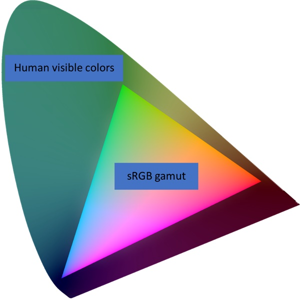
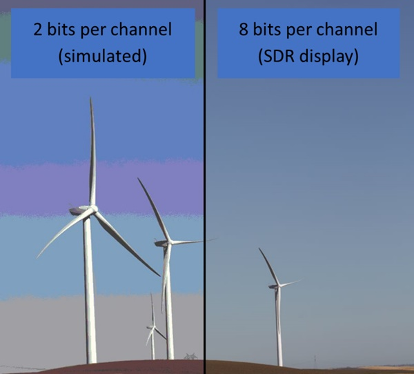

# Using DirectX with high dynamic range Displays and Advanced Color

This topic provides a technical overview of outputting high dynamic range (HDR) Direct3D 11 and Direct3D 12 content to an HDR10 display using Windows 10 advanced color support. It summarizes some key conceptual differences between outputting to HDR10 displays as compared to traditional standard dynamic range (SDR) displays. It also covers the key technical requirements for your app to properly support Windows advanced color, as well as recommendations and best practices.

## Introduction

Windows 10 supports HDR and other advanced color displays, which provide significantly higher color fidelity than traditional SDR displays. You can use Direct3D, Direct2D and other graphics APIs to render HDR content to a capable display.

Windows advanced color refers to several related technologies, first introduced with Windows 10 version 1703, that provide support for displays that exceed the color capabilities of traditional standard dynamic range (SDR) displays. The three major extended capabilities are described below. The most common type of advanced color display, HDR10, supports all three extended capabilities.

### High dynamic range

Dynamic range refers to the difference between the maximum and minimum luminance in a scene; this is often measured in nits (candelas per square centimeter). Real world scenes, such as this sunset, often have dynamic ranges of 10 orders of magnitude of luminance; the human eye can discern an even greater range after adaptation.


Ever since Direct3D 9, graphics engines have been able to internally render their scenes with this level of physically accurate fidelity. However, a typical standard dynamic range display can reproduce only a little more than 3 orders of magnitude of luminance, and therefore any HDR-rendered content had to be tonemapped (compressed) into the limited range of the display. New HDR displays, including those that comply with the HDR10 (BT.2100) standard, break through this limitation.

### Wide color gamut with automatic system color management

Color gamut refers to the range and saturation of hues that a display can reproduce. The most saturated natural color the human eye can perceive is pure, monochromatic light such as what is produced by a laser. However, mainstream consumer displays can often reproduce colors only within the sRGB gamut, which represents only about 35% of all human-perceivable colors. The diagram below is a representation of the human "spectral locus", or all perceivable colors (at a given luminance level), where the smaller triangle is the sRGB gamut.



High end, professional PC displays have long supported color gamuts that are significantly wider than sRGB, such as Adobe RGB and D65-P3. And these wide gamut displays are becoming more common. However, prior to advanced color, Windows didn't perform any system-level color management for applications. This meant that if a DirectX app rendered, for example, a pure red or RGB(1.0, 0.0, 0.0) to its swap chain, then Windows would simply scan out the most saturated red that the display could reproduce, regardless of what the actual color gamut of the display was.

Apps that needed high color accuracy could query the color capabilities of the display (for example, using ICC profiles), and perform their own in-process color management to correctly target the display's color gamut. However, the vast majority of apps and visual content assume that the display is sRGB, and they rely on the operating system to fulfill this assumption.

Windows advanced color adds automatic system-level color management. The Desktop Window Manager (DWM) is Windows' compositor. When advanced color is enabled, the DWM performs an explicit color conversion from the app visual content's colorspace to a canonical composition color space, which is scRGB. Windows then color-converts the composed framebuffer content to the display's native color space. In this way, traditional sRGB content automatically gets color-accurate behavior, while advanced color-aware apps can take advantage of the full color capabilities of the display.

### Deep precision/bit depth

Numerical precision, or bit depth, refers to representing or distinguishing between similar but distinct colors without banding nor artifacts. Mainstream PC displays support 8 bits per color channel, while the human eye requires at least 10-12 bits of precision to avoid perceivable distortions, without resorting to techniques such as dithering or depending on viewing conditions.



Prior to advanced color, the DWM restricted windowed apps to output content at only 8 bits per color channel, even if the display supported a higher bit depth. When advanced color is enabled, the DWM performs its composition using IEEE half-precision floating point (FP16), eliminating any bottlenecks, and allowing the full precision of the display to be used.

## System Requirements

### Operating system (OS)

Advanced color support first shipped with Windows 10, version 1703, and it has been significantly improved with each update. This topic assumes that your app is targeting Windows 10, version 1903, or later.

### Display

To take advantage of high dynamic range, you must have a display that supports the HDR10 standard. Windows works best with displays that are [VESA DisplayHDR certified](https://displayhdr.org/).

### Graphics processor (GPU)

A recent GPU is required. To support HDR10 displays, Windows 10 requires one of the following.

* Nvidia GeForce 1000 series (Pascal), or newer
* AMD Radeon RX 400 series (Polaris), or newer
* Selected Intel Core 7 series (Kaby Lake), or newer

Note that additional hardware requirements apply depending on the scenarios, including hardware codec acceleration (10 bit HEVC, 10 bit VP9, etc.) and PlayReady support (SL3000). Contact your GPU vendor for more specific information.

### Graphics driver (WDDM)

The latest available graphics driver is strongly recommended, either from Windows Update or from the GPU vendor or PC manufacturer's website. For Windows 10, version 1903, and later, we recommend drivers that support at least Windows Display Driver Model (WDDM) version 2.6.

## Supported rendering APIs

Windows 10 supports a wide variety of rendering APIs and frameworks. Advanced color support fundamentally relies on your app being able to perform modern presentation using either DXGI or the Visual Layer APIs.

* [DirectX Graphics Infrastructure (DXGI)](../direct3ddxgi/dx-graphics-dxgi.md)
* [Visual Layer (Windows.UI.Composition)](/windows/uwp/composition/visual-layer)

Therefore, any rendering API that can output to one of these presentations methods can support advanced color. This includes but is not limited to these.

* [Direct3D 11](../direct3d11/atoc-dx-graphics-direct3d-11.md)
* [Direct3D 12](../direct3d12/direct3d-12-graphics.md)
* [Direct2D](../direct2d/direct2d-portal.md)
* [Win2D](https://github.com/Microsoft/Win2D)
  * Requires using the lower level **CanvasSwapChain** or **CanvasSwapChainPanel** APIs.
* [**Windows.UI.Input.Inking**](/uwp/api/Windows.UI.Input.Inking)
  * Supports custom dry ink rendering using DirectX.
* [XAML](/windows/uwp/xaml-platform/)
  * Supports playback of HDR videos using **MediaPlayerElement**.
  * Supports decode of JPEG XR images using **Image** element.
  * Supports DirectX interop using **SwapChainPanel**.

## Handling dynamic display capabilities

Windows 10 supports an enormous range of advanced color-capable displays, from power-efficient integrated panels to high end gaming monitors and TVs. Windows users expect that your app will seamlessly handle all of these variations, including ubiquitous existing SDR displays.

Windows 10 provides control over HDR and advanced color capabilities to the user. Your app must detect the current display's configuration, and respond dynamically to any changes in capability. This could occur for many reasons, for example, because the user enabled or disabled a feature, or moved the app between different displays, or the system's power state changed.

### Universal Windows Platform (UWP) apps

If you're writing a UWP app, regardless of the graphics rendering API you're using, use [**AdvancedColorInfo**](/uwp/api/windows.graphics.display.advancedcolorinfo) to get display capabilities. Obtain an instance of **AdvancedColorInfo** from [**DisplayInformation::GetAdvancedColorInfo**](/uwp/api/windows.graphics.display.displayinformation.getadvancedcolorinfo).

To check what advanced color kind is currently active, use the [**CurrentAdvancedColorKind**](/uwp/api/windows.graphics.display.advancedcolorinfo.currentadvancedcolorkind) property. In Windows 10, version 1903, and later, this returns one of three possible values: **SDR**, **WCG**, or **HDR**. This is the most important property to check, and you should configure your render and presentation pipeline in response to the active kind.

To check what advanced color kinds are supported, but not necessarily active, call [**IsAdvancedColorKindAvailable**](/uwp/api/windows.graphics.display.advancedcolorinfo.isadvancedcolorkindavailable). You could use this information, for example, to prompt the user to navigate to the Windows Settings app so that they can enable HDR or WCG.

The other members of **AdvancedColorInfo** provide quantitative information about the panel's physical color volume (luminance and chrominance), corresponding to SMPTE ST.2086 static HDR metadata. You should use this information to configure your app's HDR tonemapping and gamut mapping.

To handle changes in advanced color capabilities, register for the [**AdvancedColorInfoChanged**](/uwp/api/windows.graphics.display.displayinformation.advancedcolorinfochanged) event. This event is raised if any parameter of the display's advanced color capabilities changes for any reason.

Handle this event by obtaining a new instance of **AdvancedColorInfo**, and checking which values have changed.

### Desktop (Win32) DirectX apps

If you're writing a Win32 app, and using DirectX to render, then use [**DXGI_OUTPUT_DESC1**](/windows/desktop/api/DXGI1_6/ns-dxgi1_6-dxgi_output_desc1) to get display capabilities. Obtain an instance of this struct via [**IDXGIOutput6::GetDesc1**](/windows/win32/api/dxgi1_6/nf-dxgi1_6-idxgioutput6-getdesc1).

To check what advanced color kind is currently active, use the **ColorSpace** property, which is of type [**DXGI_COLOR_SPACE_TYPE**](/windows/win32/api/dxgicommon/ne-dxgicommon-dxgi_color_space_type), and contains one of the following values:

* **DXGI_COLOR_SPACE_RGB_FULL_G22_NONE_P709**, SDR
* **DXGI_COLOR_SPACE_RGB_FULL_G2084_NONE_P2020**, HDR

> [!Note]
> Other advanced color kinds such as WCG are treated as SDR by DXGI. You can't use DXGI to identify a WCG display.

> [!Note]
> DXGI doesn't let you check what advanced color kinds are supported but not active at the moment.

Most of the other members of **DXGI_OUTPUT_DESC1** provide quantitative information about the panel's physical color volume (luminance and chrominance), corresponding to SMPTE ST.2086 static HDR metadata. You should use this information to configure your app's HDR tonemapping and gamut mapping.

Win32 apps don't have a native mechanism to respond to advanced color capability changes. Instead, if your app uses a render loop, then you should query [**IDXGIFactory1::IsCurrent**](/windows/desktop/api/DXGI/nf-dxgi-idxgifactory1-iscurrent) with each frame. If it reports **FALSE**, then you should obtain a new **DXGI_OUTPUT_DESC1**, and check which values have changed.

In addition, your Win32 message pump should handle the [**WM_SIZE**](../winmsg/wm-size.md) message, which indicates that your app may have moved between different displays.

> [!Note]
> To obtain a new **DXGI_OUTPUT_DESC1**, you must obtain the current display. However, you should not call **IDXGISwapChain::GetContainingOutput**. This is because swap chains will return a stale DXGI output once **DXGIFactory::IsCurrent** is false, and recreating the swap chain to get a current output results in a temporary black screen. Instead, we recommend that you enumerate through the bounds of all DXGI outputs, and determine which one has the greatest intersection with your app window's bounds.

The following code example comes from the [DirectX-Graphics-Samples repository](https://github.com/Microsoft/DirectX-Graphics-Samples/tree/master/Samples/Desktop/D3D12HDR).

```cpp
// Retrieve the current default adapter.
ComPtr<IDXGIAdapter1> dxgiAdapter;
ThrowIfFailed(m_dxgiFactory->EnumAdapters1(0, &dxgiAdapter));

// Iterate through the DXGI outputs associated with the DXGI adapter,
// and find the output whose bounds have the greatest overlap with the
// app window (i.e. the output for which the intersection area is the
// greatest).

UINT i = 0;
ComPtr<IDXGIOutput> currentOutput;
ComPtr<IDXGIOutput> bestOutput;
float bestIntersectArea = -1;

while (dxgiAdapter->EnumOutputs(i, &currentOutput) != DXGI_ERROR_NOT_FOUND)
{
    // Get the retangle bounds of the app window
    int ax1 = m_windowBounds.left;
    int ay1 = m_windowBounds.top;
    int ax2 = m_windowBounds.right;
    int ay2 = m_windowBounds.bottom;

    // Get the rectangle bounds of current output
    DXGI_OUTPUT_DESC desc;
    ThrowIfFailed(currentOutput->GetDesc(&desc));
    RECT r = desc.DesktopCoordinates;
    int bx1 = r.left;
    int by1 = r.top;
    int bx2 = r.right;
    int by2 = r.bottom;

    // Compute the intersection
    int intersectArea = ComputeIntersectionArea(ax1, ay1, ax2, ay2, bx1, by1, bx2, by2);
    if (intersectArea > bestIntersectArea)
    {
        bestOutput = currentOutput;
        bestIntersectArea = static_cast<float>(intersectArea);
    }

    i++;
}

// Having determined the output (display) upon which the app is primarily being 
// rendered, retrieve the HDR capabilities of that display by checking the color space.
ComPtr<IDXGIOutput6> output6;
ThrowIfFailed(bestOutput.As(&output6));

DXGI_OUTPUT_DESC1 desc1;
ThrowIfFailed(output6->GetDesc1(&desc1));
```

## Setting up Your DirectX swap chain

Once you have determined that the display currently supports advanced color capabilities, configure your swap chain as follows.

### Use a flip presentation model effect

When creating your swap chain using the **CreateSwapChainFor[Hwnd|Composition|CoreWindow]** methods, you must use the DXGI flip model by selecting either the **DXGI_SWAP_EFFECT_FLIP_SEQUENTIAL** or **DXGI_SWAP_EFFECT_FLIP_DISCARD** option, which makes your swap chain eligible for advanced color processing from DWM and various fullscreen optimizations. For more information, refer to the [For best performance, use DXGI flip model](../direct3ddxgi/for-best-performance--use-dxgi-flip-model.md) topic.

### Option 1. Use FP16 pixel format and scRGB color space

Windows 10 supports two main combinations of pixel format and color space for advanced color. Select one based on your app's specific requirements.

For general-purpose apps, when creating your swap chain we recommend specifying [**DXGI_FORMAT_R16G16B16A16_FLOAT**](/windows/win32/api/dxgiformat/ne-dxgiformat-dxgi_format). That's also known as *FP16* in your [**DXGI_SWAP_CHAIN_DESC1**](/windows/win32/api/dxgi1_2/ns-dxgi1_2-dxgi_swap_chain_desc1). By default, a swap chain created with a floating point pixel format is treated as if it uses the [**DXGI_COLOR_SPACE_RGB_FULL_G10_NONE_P709**](/windows/win32/api/dxgicommon/ne-dxgicommon-dxgi_color_space_type) color space, which is also known as *scRGB*.

This combination provides you with the numeric range and precision to specify almost any physically possible color, and perform arbitrary processing including blending. In addition, if you're using Direct2D, Win2D, or Windows.UI.Composition, then this is the only supported combination for any swap chain or intermediate target that contains advanced color content. 

The main tradeoff of this option is that it consumes 64 bits per pixel, which doubles GPU bandwidth and memory consumption compared to the traditional UINT8 SDR pixel formats. In addition, scRGB uses numeric values that are outside the normalized [0, 1] range to represent colors that are outside the sRGB gamut and/or greater than 80 nits of luminance. For example, scRGB (1.0, 1.0, 1.0) encodes the standard D65 white at 80 nits; but scRGB (12.5, 12.5, 12.5) encodes the same D65 white at a much brighter 1000 nits. Some graphics operations require a normalized numeric range, and you must either modify the operation, or re-normalize color values.

### Option 2: Use UINT10/RGB10 pixel format and HDR10/BT.2100 color space

For apps that consume HDR10-encoded content, such as media players, or apps that are expected to be used mainly in fullscreen scenarios such as games, when creating your swap chain you should consider specifying [**DXGI_FORMAT_R10G10B10A2_UNORM**](/windows/win32/api/dxgiformat/ne-dxgiformat-dxgi_format) in [**DXGI_SWAP_CHAIN_DESC1**](/windows/win32/api/dxgi1_2/ns-dxgi1_2-dxgi_swap_chain_desc1). By default, this is treated as using the sRGB color space; therefore, you must explicitly call [**IDXGISwapChain3::SetColorSpace1**](/windows/win32/api/dxgi1_4/nf-dxgi1_4-idxgiswapchain3-setcolorspace1), and set as your color space [**DXGI_COLOR_SPACE_RGB_FULL_G2084_NONE_P2020**](/windows/win32/api/dxgicommon/ne-dxgicommon-dxgi_color_space_type), also known as HDR10/BT.2100.

This combination has more stringent restrictions than FP16. You can use this only with Direct3D 11 or Direct3D 12. In addition, UINT10/HDR10 has limitations as an intermediate format because it uses the ST.2084 EOTF ("gamma" function), which is highly nonlinear, and optimized as a wire format, and because it offers only 2 bits of alpha.

However, this combination can offer powerful performance optimizations when used in your app's final output. It consumes the same 32 bits per pixel as traditional UINT8 SDR pixel formats. In addition, in certain fullscreen scenarios, the OS can optimize performance by directly scanning out the HDR10 surface.

### Using an advanced color swap chain when the display is in SDR mode

You can use an advanced color swap chain even if the display doesn't support some or all of the advanced color capabilities your content requires. In those cases, the Desktop Window Manager (DWM) will downconvert your content to fit the display's capabilities. In Windows 10, version 1903, and later, it will perform numeric clipping; for example, if you render to an FP16 scRGB swap chain, then everything outside of the [0, 1] numeric range is clipped.

This downconversion behavior will also occur if your app window is straddling two or more displays with differing advanced color capabilities. **AdvancedColorInfo** and **IDXGIOutput6** are abstracted to report only the "main" display's characteristics (defined as the display containing the center of the window).

## Correctly render SDR content with SDR reference white level

In many scenarios, your app will want to render both SDR and HDR content; for example, rendering subtitles or transport controls over HDR video, or UI into a game scene. It is important to understand the concept of *SDR reference white level* to ensure that your SDR content looks correct on an HDR display.

Windows treats HDR content as _scene-referred_, meaning that a particular color value should be displayed at a specific luminance level; for example, scRGB (1.0, 1.0, 1.0) and HDR10 (497, 497, 497) both encode exactly D65 white at 80 nits luminance. Meanwhile, SDR content traditionally has been _output-referred_ (or display-referred), meaning that its luminance is left up to the user or the device; for example sRGB (1.0, 1.0, 1.0) encodes D65 white as in the HDR examples, but at whatever maximum luminance the display is configured for. Windows allows the user to adjust the _SDR reference white level_ to their preference; this is the luminance that Windows will render sRGB (1.0, 1.0, 1.0) at. On desktop HDR monitors, SDR reference white levels are typically set to around 200 nits.

> [!Note]
> On a display that supports a brightness control, such as on a laptop, Windows will also adjust the luminance of HDR (scene-referred) content to match the user's desired brightness level, but this is invisible to the app. Unless you're trying to guarantee bit-accurate reproduction of the HDR signal, you can generally ignore this.

If your app always renders SDR and HDR to separate surfaces, and relies on OS composition, then Windows will automatically perform the correct adjustment to boost SDR content to the desired white level. For example, if your app uses XAML and renders HDR content to its own **SwapChainPanel**.

However, if your app performs its own composition of SDR and HDR content into a single surface, then you're responsible for performing the SDR reference white level adjustment yourself. Otherwise the SDR content might appear too dim assuming typical desktop viewing conditions. First, you must obtain the current SDR reference white level, and then you must adjust the color values of any SDR content you're rendering.

### Step 1. Obtain the current SDR reference white level

Currently, only UWP apps can obtain the current SDR reference white level via [**AdvancedColorInfo.SdrWhiteLevelInNits**](/uwp/api/windows.graphics.display.advancedcolorinfo.sdrwhitelevelinnits). This API requires a [**CoreWindow**](/uwp/api/Windows.UI.Core.CoreWindow).

### Step 2. Adjust color values of SDR content

Windows defines the nominal, or default, reference white level at 80 nits; therefore if you were to render a standard sRGB (1.0, 1.0, 1.0) white to an FP16 swap chain, it would be reproduced at 80 nits luminance. In order to match the actual user-defined reference white level, you must adjust SDR content from 80 nits to the level specified via **AdvancedColorInfo.SdrWhiteLevelInNits**.

If you're rendering using FP16 and scRGB, or any color space that uses linear (1.0) gamma, then you can simply multiply the SDR color value by _AdvancedColorInfo.SdrWhiteLevelInNits_ / _80_. If you're using Direct2D, there is a predefined constant [**D2D1_SCENE_REFERRED_SDR_WHITE_LEVEL**](../direct2d/direct2d-constants.md#d2d1_scene_referred_sdr_white_level-800f), which has a value of 80.

```cpp
D2D1_VECTOR_4F inputColor; // Input SDR color value.
D2D1_VECTOR_4F outputColor; // Output color adjusted for SDR white level.
auto acInfo; // AdvancedColorInfo

float sdrAdjust = acInfo->SdrWhiteLevelInNits / D2D1_SCENE_REFERRED_SDR_WHITE_LEVEL;

// Normally in DirectX, color values are manipulated in shaders on GPU textures.
// This example performs scaling on a CPU color value.
outputColor.r = inputColor.r * sdrAdjust; // Assumes linear gamma color values.
outputColor.g = inputColor.g * sdrAdjust;
outputColor.b = inputColor.b * sdrAdjust;
outputColor.a = inputColor.a;
```

If you're rendering using a nonlinear gamma color space such as HDR10, then performing SDR white level adjustment is more complex; if you're writing your own pixel shader you should consider converting into linear gamma to apply the adjustment.

## Adapt HDR content to the display's capabilities using tonemapping

HDR and advanced color displays vary greatly in terms of their capabilities. For example, the minimum and maximum luminance and the color gamut they are capable of reproducing. In many cases, your HDR content will contain colors that exceed the display's capabilities. For the best image quality it is important for you to perform HDR tonemapping, essentially compressing the range of colors to fit the display while best preserving the visual intent of the content.

The most important single parameter to adapt for is max luminance, also known as MaxCLL (content light level); more sophisticated tonemappers will also adapt min luminance (MinCLL) and/or color primaries.

### Step 1. Get the display's color volume capabilities

#### Universal Windows Platform (UWP) apps

Use [**AdvancedColorInfo**](/uwp/api/windows.graphics.display.advancedcolorinfo) to get the display's color volume.

#### Win32 (desktop) DirectX apps

Use [**DXGI_OUTPUT_DESC1**](/windows/desktop/api/DXGI1_6/ns-dxgi1_6-dxgi_output_desc1) to get the display's color volume.

### Step 2. Get the content's color volume information

Depending on where your HDR content came from, there are multiple potential ways to determine its luminance and color gamut information. Certain HDR video and image files contain SMPTE ST.2086 metadata. If your content was rendered dynamically, then you may be able to extract scene information from the internal rendering stages, for example the brightest light source in a scene.

A more general but computationally expensive solution is to run a histogram or other analysis pass on the rendered frame. The [Direct2D advanced color images SDK sample](https://github.com/Microsoft/Windows-universal-samples/tree/master/Samples/D2DAdvancedColorImages) demonstrates how to do this using Direct2D; the most relevant code snippets are included below:

```cpp
// Perform histogram pipeline setup; this should occur as part of image resource creation.
// Histogram results in no visual output but is used to calculate HDR metadata for the image.
void D2DAdvancedColorImagesRenderer::CreateHistogramResources()
{
    auto context = m_deviceResources->GetD2DDeviceContext();

    // We need to preprocess the image data before running the histogram.
    // 1. Spatial downscale to reduce the amount of processing needed.
    DX::ThrowIfFailed(
        context->CreateEffect(CLSID_D2D1Scale, &m_histogramPrescale)
        );

    DX::ThrowIfFailed(
        m_histogramPrescale->SetValue(D2D1_SCALE_PROP_SCALE, D2D1::Vector2F(0.5f, 0.5f))
        );

    // The right place to compute HDR metadata is after color management to the
    // image's native colorspace but before any tonemapping or adjustments for the display.
    m_histogramPrescale->SetInputEffect(0, m_colorManagementEffect.Get());

    // 2. Convert scRGB data into luminance (nits).
    // 3. Normalize color values. Histogram operates on [0-1] numeric range,
    //    while FP16 can go up to 65504 (5+ million nits).
    // Both steps are performed in the same color matrix.
    ComPtr<ID2D1Effect> histogramMatrix;
    DX::ThrowIfFailed(
        context->CreateEffect(CLSID_D2D1ColorMatrix, &histogramMatrix)
        );

    histogramMatrix->SetInputEffect(0, m_histogramPrescale.Get());

    float scale = sc_histMaxNits / sc_nominalRefWhite;

    D2D1_MATRIX_5X4_F rgbtoYnorm = D2D1::Matrix5x4F(
        0.2126f / scale, 0, 0, 0,
        0.7152f / scale, 0, 0, 0,
        0.0722f / scale, 0, 0, 0,
        0              , 0, 0, 1,
        0              , 0, 0, 0);
    // 1st column: [R] output, contains normalized Y (CIEXYZ).
    // 2nd column: [G] output, unused.
    // 3rd column: [B] output, unused.
    // 4th column: [A] output, alpha passthrough.
    // We explicitly calculate Y; this deviates from the CEA 861.3 definition of MaxCLL
    // which approximates luminance with max(R, G, B).

    DX::ThrowIfFailed(histogramMatrix->SetValue(D2D1_COLORMATRIX_PROP_COLOR_MATRIX, rgbtoYnorm));

    // 4. Apply a gamma to allocate more histogram bins to lower luminance levels.
    ComPtr<ID2D1Effect> histogramGamma;
    DX::ThrowIfFailed(
        context->CreateEffect(CLSID_D2D1GammaTransfer, &histogramGamma)
        );

    histogramGamma->SetInputEffect(0, histogramMatrix.Get());

    // Gamma function offers an acceptable tradeoff between simplicity and efficient bin allocation.
    // A more sophisticated pipeline would use a more perceptually linear function than gamma.
    DX::ThrowIfFailed(histogramGamma->SetValue(D2D1_GAMMATRANSFER_PROP_RED_EXPONENT, sc_histGamma));
    // All other channels are passthrough.
    DX::ThrowIfFailed(histogramGamma->SetValue(D2D1_GAMMATRANSFER_PROP_GREEN_DISABLE, TRUE));
    DX::ThrowIfFailed(histogramGamma->SetValue(D2D1_GAMMATRANSFER_PROP_BLUE_DISABLE, TRUE));
    DX::ThrowIfFailed(histogramGamma->SetValue(D2D1_GAMMATRANSFER_PROP_ALPHA_DISABLE, TRUE));

    // 5. Finally, the histogram itself.
    HRESULT hr = context->CreateEffect(CLSID_D2D1Histogram, &m_histogramEffect);
    
    if (hr == D2DERR_INSUFFICIENT_DEVICE_CAPABILITIES)
    {
        // The GPU doesn't support compute shaders and we can't run histogram on it.
        m_isComputeSupported = false;
    }
    else
    {
        DX::ThrowIfFailed(hr);
        m_isComputeSupported = true;

        DX::ThrowIfFailed(m_histogramEffect->SetValue(D2D1_HISTOGRAM_PROP_NUM_BINS, sc_histNumBins));

        m_histogramEffect->SetInputEffect(0, histogramGamma.Get());
    }
}

// Uses a histogram to compute a modified version of MaxCLL (ST.2086 max content light level).
// Performs Begin/EndDraw on the D2D context.
void D2DAdvancedColorImagesRenderer::ComputeHdrMetadata()
{
    // Initialize with a sentinel value.
    m_maxCLL = -1.0f;

    // MaxCLL is not meaningful for SDR or WCG images.
    if ((!m_isComputeSupported) ||
        (m_imageInfo.imageKind != AdvancedColorKind::HighDynamicRange))
    {
        return;
    }

    // MaxCLL is nominally calculated for the single brightest pixel in a frame.
    // But we take a slightly more conservative definition that takes the 99.99th percentile
    // to account for extreme outliers in the image.
    float maxCLLPercent = 0.9999f;

    auto ctx = m_deviceResources->GetD2DDeviceContext();

    ctx->BeginDraw();

    ctx->DrawImage(m_histogramEffect.Get());

    // We ignore D2DERR_RECREATE_TARGET here. This error indicates that the device
    // is lost. It will be handled during the next call to Present.
    HRESULT hr = ctx->EndDraw();
    if (hr != D2DERR_RECREATE_TARGET)
    {
        DX::ThrowIfFailed(hr);
    }

    float *histogramData = new float[sc_histNumBins];
    DX::ThrowIfFailed(
        m_histogramEffect->GetValue(D2D1_HISTOGRAM_PROP_HISTOGRAM_OUTPUT,
            reinterpret_cast<BYTE*>(histogramData),
            sc_histNumBins * sizeof(float)
            )
        );

    unsigned int maxCLLbin = 0;
    float runningSum = 0.0f; // Cumulative sum of values in histogram is 1.0.
    for (int i = sc_histNumBins - 1; i >= 0; i--)
    {
        runningSum += histogramData[i];
        maxCLLbin = i;

        if (runningSum >= 1.0f - maxCLLPercent)
        {
            break;
        }
    }

    float binNorm = static_cast<float>(maxCLLbin) / static_cast<float>(sc_histNumBins);
    m_maxCLL = powf(binNorm, 1 / sc_histGamma) * sc_histMaxNits;

    // Some drivers have a bug where histogram will always return 0. Treat this as unknown.
    m_maxCLL = (m_maxCLL == 0.0f) ? -1.0f : m_maxCLL;
}
```

### Step 3. Perform the HDR tonemapping operation

Tonemapping is inherently a lossy process, and can be optimized for a number of perceptual or objective metrics, so there is no one standard algorithm. Windows provides a built-in [HDR tonemapper effect](../direct2d/hdr-tone-map-effect.md) as part of Direct2D as well as in the Media Foundation HDR video playback pipeline. Some other commonly used algorithms include ACES Filmic, Reinhard, and ITU-R BT.2390-3 EETF (electrical-electrical transfer function).

A simplified Reinhard tonemapper operator is shown below.

```cpp
// Normally in DirectX, color values are manipulated in shaders on GPU textures.
// This example performs scaling on a CPU color value.
D2D1_VECTOR_4F simpleReinhardTonemapper(
    float inputMax, // Content's maximum luminance in scRGB values, e.g. 1.0 = 80 nits.
    float outputMax, // Display's maximum luminance in scRGB values, e.g. 1.0 = 80 nits.
    D2D1_VECTOR_4F input // scRGB color.
)
{
    D2D1_VECTOR_4F output = input;

    // Vanilla Reinhard normalizes color values to [0, 1].
    // This modification scales to the luminance range of the display.
    output.r /= inputMax;
    output.g /= inputMax;
    output.b /= inputMax;

    output.r = (output.r / 1 + output.r);
    output.g = (output.g / 1 + output.g);
    output.b = (output.b / 1 + output.b);

    output.r *= outputMax;
    output.g *= outputMax;
    output.b *= outputMax;

    return output;
}
```

## Capturing HDR and WCG content

New APIs that support specifying pixel formats, such as [Windows.Graphics.Capture](/uwp/api/windows.graphics.capture) and [IDXGIOutput5::DuplicateOutput1](/windows/win32/api/dxgi1_5/nf-dxgi1_5-idxgioutput5-duplicateoutput1) provide the capability to capture HDR and WCG content without losing pixel information. Note that after acquiring content frames, additional processing is required. For example, HDR-to-SDR tone mapping (e.g. SDR screenshot copy for Internet sharing) and content saving with proper format (e.g. JPEG XR).

## Additional resources

* *Using HDR Rendering with the DirectX Tool Kit* for [DirectX 11](https://github.com/Microsoft/DirectXTK/wiki/Using-HDR-rendering) / [DirectX 12](https://github.com/microsoft/DirectXTK12/wiki/Using-HDR-rendering). Walkthrough of how to add HDR support to a DirectX app using the DirectX Tool Kit (DirectXTK).
* [Direct2D advanced color images SDK sample](https://github.com/Microsoft/Windows-universal-samples/tree/master/Samples/D2DAdvancedColorImages). UWP SDK sample implementing an advanced color-aware HDR and WCG image viewer using Direct2D. Demonstrates the full range of best practices for UWP apps, including responding to display capability changes and adjusting for SDR white level.
* [Direct3D 12 HDR desktop sample](https://github.com/microsoft/DirectX-Graphics-Samples/tree/master/Samples/Desktop/D3D12HDR). Desktop SDK sample implementing a basic Direct3D 12 HDR scene.
* [Direct3D 12 HDR UWP sample](https://github.com/microsoft/DirectX-Graphics-Samples/tree/master/Samples/UWP/D3D12HDR). UWP equivalent of the above sample.
* [Xbox ATG SimpleHDR PC sample](https://github.com/microsoft/Xbox-ATG-Samples/tree/master/PCSamples/Graphics/SimpleHDR_PC). Desktop SDK sample implementing a basic Direct3D 11 HDR scene.
