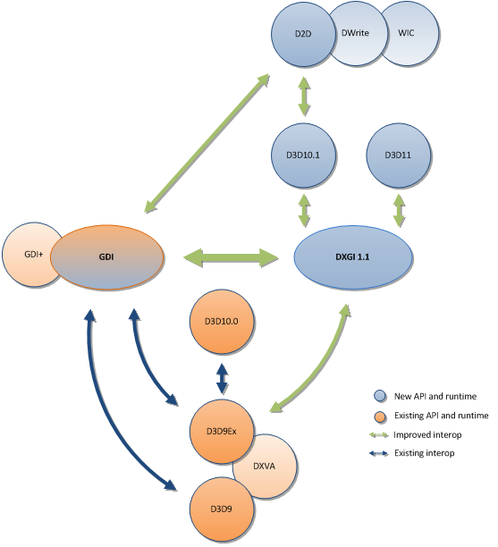

# Surface sharing between Windows graphics APIs

This topic provides a technical overview of interoperability using surface sharing between Windows graphics APIs, including Direct3D 11, Direct2D, DirectWrite, Direct3D 10, and Direct3D 9Ex. If you already have a working knowledge of these APIs, this paper can help you use multiple APIs to render to the same surface in an application designed for the Windows 7 or Windows Vista operating systems. This topic also provides best practice guidelines and pointers to additional resources.

> [!Note]  
> For Direct2D and DirectWrite interoperability on the DirectX 11.1 runtime, you can use [Direct2D devices and device contexts](/windows/desktop/Direct2D/devices-and-device-contexts) to render directly to Direct3D 11 devices.

 

This topic contains the following sections.

-   [Introduction](#introduction)
-   [API Interoperability Overview](#api-interoperability-overview)
-   [Interoperability Scenarios](#interoperability-scenarios)
    -   [Direct3D 10.1 Device Sharing with Direct2D](#direct3d-101-device-sharing-with-direct2d)
    -   [DXGI 1.1 Synchronized Shared Surfaces](#dxgi-11-synchronized-shared-surfaces)
    -   [Interoperability between Direct3D 9Ex and DXGI based APIs](#interoperability-between-direct3d-9ex-and-dxgi-based-apis)
-   [Conclusion](#conclusion)

## Introduction

In this document, Windows graphics API interoperability refers to the sharing of the same rendering surface by different APIs. This kind of interoperability enables applications to create compelling displays by leveraging multiple Windows graphics APIs, and to ease migration to new technologies by maintaining compatibility with existing APIs.

In Windows 7 (and Windows Vista SP2 with Windows 7 Interop Pack, Vista 7IP), the graphics rendering APIs are Direct3D 11, Direct2D, Direct3D 10.1, Direct3D 10.0, Direct3D 9Ex, Direct3D 9c and earlier Direct3D APIs, as well GDI and GDI+. Windows Imaging Component (WIC) and DirectWrite are related technologies for image processing, and Direct2D performs text rendering. DirectX Video Acceleration API (DXVA), based on Direct3D 9c and Direct3D 9Ex, is used for video processing.

As Windows graphics APIs evolve towards being Direct3D-based, Microsoft is investing more effort in ensuring interoperability across APIs. Newly developed Direct3D APIs and higher level APIs based on Direct3D APIs also provide support where needed for bridging compatibility with older APIs. To illustrate, Direct2D applications can use Direct3D 10.1 by sharing a Direct3D 10.1 device. Also, Direct3D 11, Direct2D, and Direct3D 10.1 APIs can all take advantage of DirectX Graphics Infrastructure (DXGI) 1.1, which enables synchronized shared surfaces that fully support interoperability among these APIs. DXGI 1.1-based APIs interoperate with GDI, and with GDI+ by association, by obtaining the GDI device context from a DXGI 1.1 surface. For more information, see the DXGI and GDI interoperability documentation available on MSDN.

Unsynchronized surface sharing is supported by the Direct3D 9Ex runtime. DXVA-based video applications can use the Direct3D 9Ex and DXGI interoperability helper for Direct3D 9Ex-based DXVA interoperability with Direct3D 11 for compute shader, or can interoperate with Direct2D for 2D controls or text rendering. WIC and DirectWrite also interoperate with GDI, Direct2D, and by association, other Direct3D APIs.

Direct3D 10.0, Direct3D 9c, and older Direct3D runtimes do not support shared surfaces. System memory copies will continue to be used for interoperability with GDI or DXGI-based APIs.

Note that the interoperability scenarios within this document refer to multiple graphics APIs rendering to a shared rendering surface, rather than to the same application window. Synchronization for separate APIs targeting different surfaces that are then composited onto the same window is outside the scope of this paper.

## API Interoperability Overview

Surface sharing interoperability of Windows graphics APIs can be described in terms of API-to-API scenarios and the corresponding interoperability functionality. As of Windows 7 and beginning with Windows Vista SP2 with 7IP, new APIs and associated runtimes include Direct2D and related technologies: Direct3D 11 and DXGI 1.1. GDI performance was also improved in Windows 7. Direct3D 10.1 was introduced in Windows Vista SP1. The following diagram shows the interoperability support between APIs.



In this diagram, arrows show interoperability scenarios in which the same surface can be accessible by the connected APIs. Blue arrows indicate interoperability mechanisms introduced in Windows Vista. Green arrows indicate interoperability support for new APIs or improvements that help older APIs to interoperate with newer APIs. For example, green arrows represent device sharing, synchronized shared surface support, Direct3D 9Ex/DXGI synchronization helper, and obtaining a GDI device context from a compatible surface.

## Interoperability Scenarios

As of Windows 7 and Windows Vista 7IP, mainstream offerings from Windows graphics APIs support multiple APIs rendering to the same DXGI 1.1 surface.

**Direct3D 11, Direct3D 10.1, Direct2D — Interoperability with each other**

Direct3D 11, Direct3D 10.1 and Direct2D APIs (and its related APIs such as DirectWrite and WIC) can interoperate with each other using either Direct3D 10.1 device sharing or synchronized shared surfaces.

### Direct3D 10.1 Device Sharing with Direct2D

Device sharing between Direct2D and Direct3D 10.1 allows an application to use both APIs to seamlessly and efficiently render onto the same DXGI 1.1 surface, using the same underlying Direct3D device object. Direct2D provides the ability to call Direct2D APIs using an existing Direct3D 10.1 device, leveraging the fact that Direct2D is built on top of Direct3D 10.1 and DXGI 1.1 runtimes. The following code snippets illustrate how Direct2D obtains the Direct3D 10.1 device render target from a DXGI 1.1 surface associated with the device. The Direct3D 10.1 device render target can execute Direct2D drawing calls between BeginDraw and EndDraw APIs.


```C++
// Direct3D 10.1 Device and Swapchain creation
HRESULT hr = D3D10CreateDeviceandSwapChain1(
                pAdapter,
                DriverType,
                Software,
                D3D10_CREATE_DEVICE_BGRA_SUPPORT,
                featureLevel,
                D3D10_1_SDK_VERSION,
                pSwapChainDesc,
                &pSwapChain,
                &pDevice
                );

hr = pSwapChain->GetBuffer(
        0,
        __uuidof(IDXGISurface),
        (void **)&pDXGIBackBuffer
        ));

// Direct3D 10.1 API rendering calls
...

hr = D2D1CreateFactory(
        D2D1_FACTORY_TYPE_SINGLE_THREADED,
        &m_spD2DFactory
        ));

pD2DFactory->CreateDxgiSurfaceRenderTarget(
        pDXGIBackBuffer,
        &renderTargetProperties,
        &pD2DBackBufferRenderTarget
        ));
...

pD2DBackBufferRenderTarget->BeginDraw();
//Direct2D API rendering calls
...

pD2DBackBufferRenderTarget->EndDraw();

pSwapChain->Present(0, 0);
```


**Remarks**

-   The associated Direct3D 10.1 device must support BGRA format. That device was created by calling D3D10CreateDevice1 with parameter D3D10\_CREATE\_DEVICE\_BGRA\_SUPPORT. BGRA format is supported starting with Direct3D 10 feature level 9.1.
-   The application should not create multiple ID2D1RenderTargets associating to the same Direct3D10.1 device.
-   For optimal performance, keep at least one resource around at all times, such as textures or surfaces associated with the device.

Device sharing is suitable for in-process, single-threaded usage of one rendering device shared by both Direct3D 10.1 and Direct2D rendering APIs. Synchronized shared surfaces enable multi-threaded, in-process and out-of-process usage of multiple rendering devices used by Direct3D 10.1, Direct2D and Direct3D 11 APIs.

Another method of Direct3D 10.1 and Direct2D interoperability is by using ID3D1RenderTarget::CreateSharedBitmap, which creates an ID2D1Bitmap object from IDXGISurface. You can write a Direct3D10.1 scene to the bitmap and render it with Direct2D. For more information, see [ID2D1RenderTarget::CreateSharedBitmap Method](/windows/win32/api/d2d1/nf-d2d1-id2d1rendertarget-createsharedbitmap).

### Direct2D Software Rasterization

Device sharing with Direct3D 10.1 is not supported when using the Direct2D software renderer, for example, by specifying D2D1\_RENDER\_TARGET\_USAGE\_FORCE\_SOFTWARE\_RENDERING in D2D1\_RENDER\_TARGET\_USAGE when creating a Direct2D render target.

Direct2D can use the WARP10 software rasterizer to share device with Direct3D 10 or Direct3D 11, but the performance declines significantly.

### DXGI 1.1 Synchronized Shared Surfaces

Direct3D 11, Direct3D 10.1 and Direct2D APIs all use DXGI 1.1, which provides the functionality to synchronize reading from and writing to the same video memory surface (DXGISurface1) by two or more Direct3D devices. The rendering devices using synchronized shared surfaces can be Direct3D 10.1 or Direct3D 11 devices, each running in the same process or cross-processes.

Applications can use synchronized shared surfaces to interoperate between any DXGI 1.1-based devices, such as Direct3D 11 and Direct3D 10.1, or between Direct3D 11 and Direct2D, by obtaining the Direct3D 10.1 device from Direct2D render target object.

In Direct3D 10.1 and later APIs, to use DXGI 1.1, ensure that the Direct3D device is created using a DXGI 1.1 adapter object, which is enumerated from the DXGI 1.1 factory object. Call CreateDXGIFactory1 to create the IDXGIFactory1 object, and EnumAdapters1 to enumerate the IDXGIAdapter1 object. The IDXGIAdapter1 object needs to be passed in as part of D3D10CreateDevice or D3D10CreateDeviceAndSwapChain call. For more information on DXGI 1.1 APIs, please refer to the [Programming Guide for DXGI](https://msdn.microsoft.com/library/ee418147(VS.85).aspx).

### APIs

**D3D10\_RESOURCE\_MISC\_SHARED\_KEYEDMUTEX**  
When creating the synchronized shared resource, set D3D10\_RESOURCE\_MISC\_SHARED\_KEYEDMUTEX in D3D10\_RESOURCE\_MISC\_FLAG.  


```C++
typedef enum D3D10_RESOURCE_MISC_FLAG {
    D3D10_RESOURCE_MISC_GENERATE_MIPS      = 0x1L,
    D3D10_RESOURCE_MISC_SHARED             = 0x2L,
    D3D10_RESOURCE_MISC_TEXTURECUBE        = 0x4L,
    D3D10_RESOURCE_MISC_SHARED_KEYEDMUTEX  = 0x10L,
    D3D10_RESOURCE_MISC_GDI_COMPATIBLE     = 0x20L,
}   D3D10_RESOURCE_MISC_FLAG;
```


**D3D10\_RESOURCE\_MISC\_SHARED\_KEYEDMUTEX**  
Enables the resource created to be synchronized using the IDXGIKeyedMutex::AcquireSync and ReleaseSync APIs. The following resource creation Direct3D 10.1 APIs that all take a D3D10\_RESOURCE\_MISC\_FLAG parameter have been extended to support the new flag.  

-   ID3D10Device1::CreateTexture1D
-   ID3D10Device1::CreateTexture2D
-   ID3D10Device1::CreateTexture3D
-   ID3D10Device1::CreateBuffer

  
If any of the listed functions are called with the D3D10\_RESOURCE\_MISC\_SHARED\_KEYEDMUTEX flag set, the interface returned can be queried for an IDXGIKeyedMutex interface, which implements AcquireSync and ReleaseSync APIs to synchronize access to the surface. The device creating the surface and any other device opening the surface (using OpenSharedResource) is required to call IDXGIKeyedMutex::AcquireSync before any rendering commands to the surface, and IDXGIKeyedMutex::ReleaseSync when it is done rendering.  
WARP and REF devices do not support shared resources. Attempting to create a resource with this flag on either a WARP or REF device will cause the create method to return an E\_OUTOFMEMORY error code.  
**IDXGIKEYEDMUTEX INTERFACE**  
A new interface in DXGI 1.1, IDXGIKeyedMutex, represents a keyed mutex, which allows exclusive access to a shared resource that is used by multiple devices. For reference documentation about this interface and its two methods, AcquireSync and ReleaseSync, see [IDXGIKeyedMutex](https://msdn.microsoft.com/library/ee421920(VS.85).aspx).  
</dl>

### Sample: Synchronized Surface Sharing Between two Direct3D 10.1 Devices

The example below illustrates sharing a surface between two Direct3D 10.1 devices. The synchronized shared surface is created by a Direct3D10.1 device.


```C++
// Create Sync Shared Surface using Direct3D10.1 Device 1.
D3D10_TEXTURE2D_DESC desc;
ZeroMemory( &desc, sizeof(desc) );
desc.Width = width;
desc.Height = height;
desc.MipLevels = 1;
desc.ArraySize = 1;
// must match swapchain format in order to CopySubresourceRegion.
desc.Format = DXGI_FORMAT_R8G8B8A8_UNORM;
desc.SampleDesc.Count = 1;
desc.Usage = D3D10_USAGE_DEFAULT;
// creates 2D texture as a Synchronized Shared Surface.
desc.MiscFlags = D3D10_RESOURCE_MISC_SHARED_KEYEDMUTEX;
desc.BindFlags = D3D10_BIND_RENDER_TARGET | D3D10_BIND_SHADER_RESOURCE;
ID3D10Texture2D* g_pShared = NULL;
g_pd3dDevice1->CreateTexture2D( &desc, NULL, &g_pShared );

// QI IDXGIResource interface to synchronized shared surface.
IDXGIResource* pDXGIResource = NULL;
g_pShared->QueryInterface(__uuidof(IDXGIResource), (LPVOID*) &pDXGIResource);

// obtain handle to IDXGIResource object.
pDXGIResource->GetSharedHandle(&g_hsharedHandle);
pDXGIResource->Release();
if ( !g_hsharedHandle )
    return E_FAIL;

// QI IDXGIKeyedMutex interface of synchronized shared surface's resource handle.
hr = g_pShared->QueryInterface( __uuidof(IDXGIKeyedMutex),
    (LPVOID*)&g_pDXGIKeyedMutex_dev1 );
If ( FAILED( hr ) || ( g_pDXGIKeyedMutex_dev1 == NULL ) )
    return E_FAIL;
```


The same Direct3D10.1 device can obtain the synchronized shared surface for rendering by calling AcquireSync, then releasing the surface for the other device's rendering by calling ReleaseSync. When not sharing the synchronized shared surface with any other Direct3D device, the creator can obtain and release the synchronized shared surface (to start and end rendering) by acquiring and release using the same key value.


```C++
// Obtain handle to Sync Shared Surface created by Direct3D10.1 Device 1.
hr = g_pd3dDevice2->OpenSharedResource( g_hsharedHandle,__uuidof(ID3D10Texture2D),
                                        (LPVOID*) &g_pdev2Shared);
if (FAILED (hr))
    return hr;
hr = g_pdev2Shared->QueryInterface( __uuidof(IDXGIKeyedMutex),
                                    (LPVOID*) &g_pDXGIKeyedMutex_dev2);
if( FAILED( hr ) || ( g_pDXGIKeyedMutex_dev2 == NULL ) )
    return E_FAIL;

// Rendering onto Sync Shared Surface from D3D10.1 Device 1 using D3D10.1 Device 2.
UINT acqKey = 1;
UINT relKey = 0;
DWORD timeOut = 5;
DWORD result = g_pDXGIKeyedMutex_dev2->AcquireSync(acqKey, timeOut);
if ( result == WAIT_OBJECT_0 )
    // Rendering calls using Device 2.
else
    // Handle unable to acquire shared surface error.
result = g_pDXGIKeyedMutex_dev2->ReleaseSync(relKey));
if (result == WAIT_OBJECT_0)
    return S_OK;
```


The second Direct3D10.1 device can obtain the synchronized shared surface for rendering by calling AcquireSync, then releasing the surface for the first device's rendering by calling ReleaseSync. Note that device 2 is able to acquire the synchronized shared surface using the same key value as the one specified in the ReleaseSync call by device 1.


```C++
// Rendering onto Sync Shared Surface from D3D10.1 Device 1 using D3D10.1 Device 1.
UINT acqKey = 0;
UINT relKey = 1;
DWORD timeOut = 5;
DWORD result = g_pDXGIKeyedMutex_dev1->AcquireSync(acqKey, timeOut);
if (result == WAIT_OBJECT_0)
    // Rendering calls using Device 1.
else
    // Handle unable to acquire shared surface error.
result = g_pDXGIKeyedMutex_dev1->ReleaseSync(relKey));
if ( result == WAIT_OBJECT_0 )
    return S_OK;
```


Additional devices sharing the same surface can take turns acquiring and releasing the surface by using additional keys, as shown in the following calls.


```C++
// Within Device 1's process/thread:
// Rendering onto Sync Shared Surface from D3D10.1 Device 1 using D3D10.1 Device 1
result = g_pDXGIKeyedMutex_dev1->AcquireSync(0, timeOut);
// Rendering calls using Device 1
...
result = g_pDXGIKeyedMutex_dev1->ReleaseSync(1);
...
////////////////////////////////////////////////////////////////////////////
// Within Device 2's process/thread:
// Rendering onto Sync Shared Surface from D3D10.1 Device 1 using D3D10.1 Device 2
result = g_pDXGIKeyedMutex_dev2->AcquireSync(1, timeOut);
// Rendering calls using Device 2
...
result = g_pDXGIKeyedMutex_dev1->ReleaseSync(2);

////////////////////////////////////////////////////////////////////////////
// Within Device 3's process/thread:
// Rendering onto Sync Shared Surface from D3D10.1 Device 1 using D3D10.1 Device 3
result = g_pDXGIKeyedMutex_dev1->AcquireSync(2, timeOut);
// Rendering calls using Device 3
...
result = g_pDXGIKeyedMutex_dev1->ReleaseSync(0);
...
```


Note that a real-world application might always render to an intermediate surface that is then copied into the shared surface to prevent any one device waiting on another device that shares the surface.

### Using Synchronized Shared Surfaces with Direct2D and Direct3D 11

Similarly, for sharing between Direct3D 11 and Direct3D 10.1 APIs, a synchronized shared surface can be created from either API device and shared with the other API device(s), in or out of process.

Applications that use Direct2D can share a Direct3D 10.1 device and use a synchronized shared surface to interoperate with Direct3D 11 or other Direct3D 10.1 devices, whether they belong to the same process or different processes. However, for single-process, single-thread applications, device sharing is the most high-performance and efficient method of interoperability between Direct2D and either Direct3D 10 or Direct3D 11.

### Software Rasterizer

Synchronized shared surfaces are not supported when applications use the Direct3D or Direct2D software rasterizers, including the reference rasterizer and WARP, instead of using graphics hardware acceleration.

### Interoperability between Direct3D 9Ex and DXGI based APIs

Direct3D 9Ex APIs included the notion of surface sharing to allow other APIs to read from the shared surface. In order to share reading and writing to a Direct3D 9Ex shared surface, you must add manual synchronization to the application itself.

### Direct3D 9Ex Shared Surfaces Plus Manual Synchronization Helper

The most fundamental task in Direct3D 9Ex and Direct3D 10 or 11 interoperability is passing a single surface from the first device (device A) to the second (device B) such that when device B acquires a handle on the surface, device A's rendering is guaranteed to have completed. Therefore, device B can use this surface without worry. This is very similar to the classic producer-consumer problem and this discussion models the problem that way. The first device that uses the surface and then relinquishes it is the producer (Device A), and the device that is initially waiting is the consumer (Device B). Any real-world application is more sophisticated than this, and will chain together multiple producer-consumer building blocks to create the desired functionality.

The producer-consumer building blocks are implemented in the helper by using a queue of surfaces. Surfaces are enqueued by the producer and dequeued by the consumer. The helper introduces three COM interfaces: ISurfaceQueue, ISurfaceProducer, and ISurfaceConsumer.

### High-Level Overview of Helper

The ISurfaceQueue object is the building block for using the shared surfaces. It is created with an initialized Direct3D device and a description to create a fixed number of shared surfaces. The queue object manages creation of resources and opening of code. The number and type of surfaces are fixed; once the surfaces are created, the application cannot add or remove them.

Each instance of the ISurfaceQueue object provides a sort of one-way street that can be used to send surfaces from the producing device to the consuming device. Multiple such one-way streets can be used to enable surface sharing scenarios between devices of specific applications.

**Creation/Object Lifetime**  
There are two ways to create the queue object: through CreateSurfaceQueue, or through the Clone method of ISurfaceQueue. Because the interfaces are COM objects, standard COM lifetime management applies.  
**Producer/Consumer Model**  
Enqueue (): The producer calls this function to indicate it is done with the surface, which can now become available to another device. Upon returning from this function, the producer device no longer has rights to the surface and it is unsafe to continue using it.  
Dequeue (): The consuming device calls this function to get a shared surface. The API guarantees that any dequeued surfaces are ready to be used.  
**Metadata**  
The API supports associating metadata with the shared surfaces.  
Enqueue() has the option of specifying additional metadata that will be passed to the consuming device. The metadata must be less than a maximum known at creation time.  
Dequeue() can optionally pass a buffer and a pointer to the size of the buffer. The queue fills in the buffer with the metadata from the corresponding Enqueue call.  
**Cloning**  
Each ISurfaceQueue object solves a one-way synchronization. We assume that the vast majority of applications using this API will use a closed system. The simplest closed system with two devices sending surfaces back and forth requires two queues. The ISurfaceQueue object has a Clone() method to make it possible to create multiple queues that are all part of the same larger pipeline.  
Clone creates a new ISurfaceQueue object from an existing one, and shares all the opened resources between them. The resulting object has exactly the same surfaces as the source queue. Cloned queues can have different metadata sizes from each other.  
**Surfaces**  
The ISurfaceQueue takes responsibility for creating and managing its surfaces. It is not valid to enqueue arbitrary surfaces. Furthermore, a surface should only have one active "owner." It should either be on a specific queue or being used by a specific device. It is not valid to have it on multiple queues or for devices to continue using the surface after it is enqueued.  
</dl>

### API Details

### IsurfaceQueue

The queue is responsible for creating and maintaining the shared resources. It also provides the functionality to chain multiple queues using Clone. The queue has methods that open the producing device and a consuming device. Only one of each can be opened at any time.

The queue exposes the following APIs:


| API                            | Description                                                                                 |
|-----------------------------|----------------------------------------------------------------------------------|
| CreateSurfaceQueue          | Creates an ISurfaceQueue object (the "root" queue).                              |
| ISurfaceQueue::OpenConsumer | Returns an interface for the consuming device to dequeue.                        |
| ISurfaceQueue::OpenProducer | Returns an interface for the producing device to enqueue.                        |
| ISurfaceQueue::Clone        | Creates an ISurfaceQueue object that shares surfaces with the root queue object. |


 

**CreateSurfaceQueue**  


```C++
typedef struct SURFACE_QUEUE_DESC {
  UINT            Width;
  UINT            Height;
  DXGI_FORMAT     Format;
  UINT            NumSurfaces;
  UINT            MetaDataSize;
  DWORD           Flags;
} SURFACE_QUEUE_DESC;
```


**Members**  

**Width**, **Height**  The dimensions of the shared surfaces. All shared surfaces must have the same dimensions.  
**Format** The format of the shared surfaces. All shared surfaces must have the same format. The valid formats depend on the devices that will be used, because different pairs of devices can share different format types.  
**NumSurfaces**  The number of surfaces that are part of the queue. This is a fixed number.  
 **MetaDataSize**  The maximum size of the metadata buffer.  
**Flags**  Flags to control the behavior of the queue. See Remarks.  


```C++
HRESULT CreateSurfaceQueue(
  [in]   SURFACE_QUEUE_DESC *pDesc,
  [in]   IUnknown *pDevice,
  [out]  IDXGIXSurfaceQueue **ppQueue
);
```


**Parameters**

 *pDesc* \[in\]  The description of the shared surface queue to be created.  

 *pDevice* \[in\]  The device that should be used to create the shared surfaces. This is an explicit parameter because of a feature in Windows Vista. For surfaces shared between Direct3D 9 and Direct3D 10, the surfaces must be created with Direct3D 9.  

 *ppQueue* \[out\]  On return, contains a pointer to the ISurfaceQueue object.  


**Return Values**

If *pDevice* is not capable of sharing resources, this function returns DXGI\_ERROR\_INVALID\_CALL. This function creates the resources. If it fails, it returns an error. If it succeeds, it returns S\_OK.

**Remarks**

Creating the queue object also creates all of the surfaces. All surfaces are assumed to be 2D render targets and will be created with the D3D10\_BIND\_RENDER\_TARGET and D3D10\_BIND\_SHADER\_RESOURCE flags set (or the equivalent flags for the different runtimes).

The developer can specify a flag that indicates whether the queue will be accessed by multiple threads. If no flags are set (**Flags** == 0), the queue will be used by multiple threads. The developer can specify single threaded access, which turns off the synchronization code and provides a performance improvement for those cases. Each cloned queue has its own flag, so it is possible for different queues in the system to have different synchronization controls.

 **Open a Producer**  


```C++
HRESULT OpenProducer(
  [in]   IUnknown *pDevice,
  [out]  IDXGIXSurfaceProducer **ppProducer
);
```


**Parameters**  

*pDevice* \[in\]  

The producer device that enqueues surfaces onto the surface queue. 

*ppProducer* \[out\] Returns an object to the producer interface.  


**Return Values**

If the device is not capable of sharing surfaces, returns DXGI\_ERROR\_INVALID\_CALL.

**Open a Consumer**  


```C++
HRESULT OpenConsumer(
  [in]   IUnknown *pDevice,
  [out]  IDXGIXSurfaceConsumer **ppConsumer
);
```


**Parameters**  
 *pDevice* \[in\]  
 The consumer device that dequeues surfaces from the surface queue. 
 *ppConsumer* \[out\]  Returns an object to the consumer interface.  


**Return Values**

If the device is not capable of sharing surfaces, returns DXGI\_ERROR\_INVALID\_CALL.

**Remarks**

This function opens all of the surfaces in the queue for the input device and caches them. Subsequent calls to Dequeue will simply go to the cache and not have to reopen the surfaces each time.


### Cloning an IDXGIXSurfaceQueue


```C++
typedef struct SHARED_SURFACE_QUEUE_CLONE_DESC {
  UINT         MetaDataSize;
  DWORD        Flags;
} SHARED_SURFACE_QUEUE_CLONE_DESC;
```


**Members** **MetaDataSize** and **Flags** have the same behavior as they do for CreateSurfaceQueue.  


```C++
HRESULT Clone(
  [in]   SHARED_SURFACE_QUEUE_CLONE_DESC *pDesc,
  [out]  IDXGIXSurfaceQueue **ppQueue
);
```


**Parameters**

*pDesc* \[in\] A struct that provides a description of the Clone object to be created. This parameter should be initialized.  
*ppQueue* \[out\] Returns the initialized object.  
</dl>

**Remarks**

You can clone from any existing queue object, even if it is not the root.  
</dl>

### IDXGIXSurfaceConsumer

<dl>


```C++
HRESULT Dequeue(
  [in]      REFIID    id,
  [out]     void      **ppSurface,
  [in,out]  void      *pBuffer,
  [in,out]  UINT      *pBufferSize,
  [in]      DWORD     dwTimeout
);
```


**Parameters**  
*id* \[in\]  
The REFIID of a 2D surface of the consuming device.  

-   For a IDirect3DDevice9, the REFIID should be \_\_uuidof(IDirect3DTexture9).
-   For a ID3D10Device, the REFIID should be \_\_uuidof(ID3D10Texture2D).
-   For a ID3D11Device, the REFIID should be \_\_uuidof(ID3D11Texture2D).

*ppSurface* \[out\] Returns a pointer to the surface.  
*pBuffer* \[in, out\] An optional parameter and if not **NULL**, on return, contains the metadata that was passed in on the corresponding enqueue call.  
*pBufferSize* \[in, out\] The size of *pBuffer*, in bytes. Returns the number of bytes returned in *pBuffer*. If the enqueue call did not provide metadata, *pBuffer* is set to 0.  
*dwTimeout* \[in\] Specifies a timeout value. See the Remarks for more detail.  
</dl>

**Return Values**

This function can return WAIT\_TIMEOUT if a timeout value is specified and the function does not return before the time out value. See Remarks. If no surfaces are available, the function returns with *ppSurface* set to **NULL**, *pBufferSize* set to 0 and the return value is 0x80070120 (WIN32\_TO\_HRESULT(WAIT\_TIMEOUT)).  
</dl>

**Remarks**

This API can block if the queue is empty. The *dwTimeout* parameter works identically to the Windows synchronization APIs, such as WaitForSingleObject. For non-blocking behavior, use a timeout of 0.  
</dl>

### ISurfaceProducer

This interface provides two methods that allow the app to enqueue surfaces. After a surface is enqueued, the surface pointer is no longer valid and is not safe to use. The only action that the application should perform with the pointer is to release it.


| Method                          | Description                                                                                                                                                      |
|---------------------------|-------------------------------------------------------------------------------------------------------------------------------------------------------|
| ISurfaceProducer::Enqueue | Enqueues a surface to the queue object. After this call completes, the producer is done with the surface and the surface is ready for another device. |
| ISurfaceProducer::Flush   | Used if the applications should have non-blocking behavior. See Remarks for details.                                                                  |


 

**Enqueue**  


```C++
HRESULT Enqueue(
  [in]  IUnknown *pSurface,
  [in]  void *pBuffer,
  [in]  UINT BufferSize,
  [in]  DWORD Flags
);
```


**Parameters**  
*pSurface* \[in\]  
The surface of the producing device that needs to be enqueued. This surface must be a dequeued surface from the same queue network. *pBuffer* \[in\] An optional parameter, which is used to pass in metadata. It should point to the data that will be passed on to the dequeue call.  
*BufferSize* \[in\] The size of *pBuffer*, in bytes.  
*Flags* \[in\] An optional parameter that controls the behavior of this function. The only flag is SURFACE\_QUEUE\_FLAG\_ DO\_NOT\_WAIT. See the Remarks for Flush. If no flag is passed (*Flags* == 0), then the default blocking behavior is used.  
</dl>

**Return Values**

This function can return DXGI\_ERROR\_WAS\_STILL\_DRAWING if a SURFACE\_QUEUE\_FLAG\_DO\_NOT\_WAIT flag is used.  
</dl>

**Remarks**

-   This function puts the surface on the queue. If the application does not specify SURFACE\_QUEUE\_FLAG\_DO\_NOT\_WAIT, this function is blocking and will do a GPU-CPU synchronization to assure that all the rendering on the enqueued surface is complete. If this function succeeds, a surface will be available for dequeue. If you want non-blocking behavior, use the DO\_NOT\_WAIT flag. See Flush() for details.
-   As per the COM reference counting rules, the surface returned by Dequeue will be AddRef() so the application does not need to do this. After calling Enqueue, the application must Release the surface because they are no longer using it.

**Flush**  


```C++
HRESULT Flush(
  [in]  DWORD Flags,
  [out] UINT *nSurfaces
);
```


**Parameters**  
*Flags* \[in\]  
The only flag is SURFACE\_QUEUE\_FLAG\_ DO\_NOT\_WAIT. See Remarks. *nSurfaces* \[out\] Returns the number of surfaces that are still pending and not flushed.  
</dl>

**Return Values**

This function can return DXGI\_ERROR\_WAS\_STILL\_DRAWING if the SURFACE\_QUEUE\_FLAG\_DO\_NOT\_WAIT flag is used. This function returns S\_OK if any surfaces were successfully flushed. This function returns DXGI\_ERROR\_WAS\_STILL\_DRAWING only if no surfaces were flushed. Together, the return value and *nSurfaces* indicate to the application what work has been done and if any work is left to do.  
</dl>

**Remarks**

Flush is meaningful only if the previous call to enqueue used the DO\_NOT\_WAIT flag; otherwise, it will be a no-op. If the call to enqueue used the DO\_NOT\_WAIT flag, enqueue returns immediately and the GPU-CPU synchronization is not guaranteed. The surface is still considered enqueued, the producing device cannot continue using it, but it is not available for dequeue. In order to try to commit the surface for dequeue, Flush must be called. Flush attempts to commit all of the surfaces that are currently enqueued. If no flag is passed to Flush, it will block and clear out the entire queue, readying all surfaces in it for dequeue. If the DO\_NOT\_WAIT flag is used, the queue will check the surfaces to see if any of them are ready; this step is non-blocking. Surfaces that have finished the GPU-CPU sync will be ready for the consumer device. Surfaces that are still pending will be unaffected. The function returns the number of surfaces that still need to be flushed.

> [!Note]  
> Flush will not break the queue semantics. The API guarantees that surfaces enqueued first will be committed before surfaces enqueued later, regardless of when the GPU-CPU sync happens.

 

  
</dl>

### Direct3D 9Ex and DXGI Interop Helper: How To Use

We expect most of the usage cases to involve two devices sharing a number of surfaces. Because this also happens to be the simplest scenario, this paper details how to use the APIs to achieve this goal, discusses a non-blocking variation, and ends with a brief section about initializing for three devices.

### Two Devices

The example application that uses this helper can use Direct3D 9Ex and Direct3D 11 together. The application can process content with both devices, and present content using Direct3D 9. Processing could mean rendering content, decoding video, running compute shaders, and so on. For every frame, the application will first process with Direct3D 11, then process with Direct3D 9, and finally present with Direct3D 9. Furthermore, the processing with Direct3D 11 will produce some metadata that the Direct3D 9 present will need to consume. This section covers the helper usage in three parts that correspond to this sequence: Initialization, Main Loop, and Cleanup.

**Initialization**  
Initialization involves the following steps:  

1.  Initialize both devices.
2.  Create the Root Queue: m\_11to9Queue.
3.  Clone from the Root Queue: m\_9to11Queue.
4.  Call OpenProducer/OpenConsumer on both queues.

The queue names use the numbers 9 and 11 to indicate which API is the producer and which is the consumer: **m\_***producer***to***consumer***Queue**. Accordingly, m\_11to9Queue indicates a queue for which the Direct3D 11 device produces surfaces that the Direct3D 9 device consumes. Similarly, m\_9to11Queue indicates a queue for which Direct3D 9 produces surfaces that Direct3D 11 consumes.  
The Root queue is initially full and all cloned queues are initially empty. This should not be a problem for the application except for the first cycle of the Enqueues and Dequeues and the availability of metadata. If a dequeue asks for metadata but none was set (either because nothing is there initially or the enqueue did not set anything), dequeue sees that no metadata was received.  

1.  **Initialize Both Devices.**  
    ```C++
    m_pD3D9Device = InitializeD3D9ExDevice();
    m_pD3D11Device = InitializeD3D11Device();
    ```

    

2.  **Create the Root Queue.**  
    This step also creates the surfaces. Size and format restrictions are identical to creating any shared resource. The size of the metadata buffer is fixed at create time, and in this case, we'll just be passing a UINT.  
    The queue must be created with a fixed number of surfaces. Performance will vary depending on the scenario. Having multiple surfaces increases the chances that devices are busy. For example, if there is only one surface, then there will be no parallelization between the two devices. On the other hand, increasing the number of surfaces increases the memory footprint, which can degrade performance. This example uses two surfaces.  
    ```C++
    SURFACE_QUEUE_DESC Desc;
    Desc.Width        = 640;
    Desc.Height       = 480;
    Desc.Format       = DXGI_FORMAT_R16G16B16A16_FLOAT;
    Desc.NumSurfaces  = 2;
    Desc.MetaDataSize = sizeof(UINT);
    Desc.Flags        = 0;

    CreateSurfaceQueue(&Desc, m_pD3D9Device, &m_11to9Queue);
    ```

    

3.  **Clone the Root Queue.**  
    Each cloned queue must use the same surfaces but can have different metadata buffer sizes and different flags. In this case, there is no metadata from Direct3D 9 to Direct3D 11.  
    ```C++
    SURFACE_QUEUE_CLONE_DESC Desc;
    Desc.MetaDataSize = 0;
    Desc.Flags        = 0;

    m_11to9Queue->Clone(&Desc, &m_9to11Queue);
    ```

    

4.  **Open the Producer and Consumer Devices.**  
    The application must perform this step before calling Enqueue and Dequeue. Opening a producer and consumer returns interfaces which contain the enqueue/dequeue APIs.  
    ```C++
    // Open for m_p9to11Queue.
    m_p9to11Queue->OpenProducer(m_pD3D9Device, &m_pD3D9Producer);
    m_p9to11Queue->OpenConsumer(m_pD3D11Device, &m_pD3D11Consumer);

    // Open for m_p11to9Queue.
    m_p11to9Queue->OpenProducer(m_pD3D11Device, &m_pD3D11Producer);
    m_p11to9Queue->OpenConsumer(m_pD3D9Device, &m_pD3D9Consumer);
    ```

    

**Main Loop**  
The usage of the queue is modeled after the classical producer/consumer problem. Think of this from a per-device perspective. Each device must perform these steps: dequeue to get a surface from its consuming queue, process on the surface, and then enqueue onto its producing queue. For the Direct3D 11 device, the Direct3D 9 usage is almost identical.  


```C++
// Direct3D 9 Device.
IDirect3DTexture9* pTexture9 = NULL;
REFIID             surfaceID9 = _uuidof(IDirect3DTexture9);
UINT               metaData;
UINT               metaDataSize;
while (!done)
{
    // Dequeue surface.
    m_pD3D9Consumer->Dequeue(surfaceID9, (void**)&pSurface9,
                             &metaData, &metaDataSize, INFINITE);

    // Process the surface.
    ProcessD3D9(pSurface9);

    // Present the surface using the meta data.
    PresentD3D9(pSurface9, metaData, metaDataSize);

    // Enqueue surface.
    m_pD3D9Producer->Enqueue(pSurface9, NULL, 0, 0);
}
```


**Cleaning Up**  
This step is very straightforward. In addition to the normal steps for cleaning up Direct3D APIs, the application must release the return COM interfaces.  


```C++
m_pD3D9Producer->Release();
m_pD3D9Consumer->Release();
m_pD3D11Producer->Release();
m_pD3D11Consumer->Release();
m_p9to11Queue->Release();
m_p11to9Queue->Release();
```


</dl>

### Non-Blocking Use

The previous example makes sense for a multithreaded usage case in which each device has its own thread. The example uses the blocking versions of the APIs: INFINITE for timeout, and no flag to enqueue. If you want to use the helper in a non-blocking way, you need to make only a few changes. This section shows non-blocking use with both devices on one thread.

**Initialization**  
Initialization is identical except for the flags. Because the application is single-threaded, use that flag for creation. This turns off some of the synchronization code, which potentially improves performance.  


```C++
SURFACE_QUEUE_DESC Desc;
Desc.Width        = 640;
Desc.Height       = 480;
Desc.Format       = DXGI_FORMAT_R16G16B16A16_FLOAT;
Desc.NumSurfaces  = 2;
Desc.MetaDataSize = sizeof(UINT);
Desc.Flags        = SURFACE_QUEUE_FLAG_SINGLE_THREADED;

CreateSurfaceQueue(&Desc, m_pD3D9Device, &m_11to9Queue);
```


```C++
SURFACE_QUEUE_CLONE_DESC Desc;
Desc.MetaDataSize = 0;
Desc.Flags        = SURFACE_QUEUE_FLAG_SINGLE_THREADED;

m_11to9Queue->Clone(&Desc, &m_9to11Queue);
```


Opening the producer and consumer devices are the same as in the blocking example.  
**Using the Queue**  
There are many ways of using the queue in a non-blocking fashion with various performance characteristics. The following example is simple but has poor performance due to excessive spinning and polling. Despite these problems, the example shows how to use the helper. The approach is to constantly sit in a loop and dequeue, process, enqueue, and flush. If any of the steps fail because the resource is not available, the application simply tries again the next loop.  


```C++
// Direct3D 11 Device.
ID3D11Texture2D* pSurface11 = NULL;
REFIID           surfaceID11 = __uuidof(ID3D11Texture2D);
UINT             metaData;
while (!done)
{
    //
    // D3D11 Portion.
    //

    // Dequeue surface.
    hr = m_pD3D11Consumer->Dequeue(surfaceID11,
                                   (void**)&pSurface11,
                                   NULL, 0, 0);
    // Only continue if we got a surface.
    if (SUCCEEDED(hr))
    {
        // Process the surface and return some meta data.
        ProcessD3D11(pSurface11, &metaData);

        // Enqueue surface.
        m_pD3D11Producer->Enqueue(pSurface11, &metaData,
                                  sizeof(UINT),
                                  SURFACE_QUEUE_FLAG_DO_NOT_WAIT);
    }
    // Flush the queue to check if any surfaces completed.
    m_pD3D11Producer->Flush(NULL,SURFACE_QUEUE_FLAG_DO_NOT_WAIT);

    //
    // Do the same with the Direct3D 9 Device.
    //

    // Dequeue surface.
    hr = m_pD3D9Consumer->Dequeue(surfaceID9,
                                  (void**)&pSurface9,
                                  &metaData,
                                  &metaDataSize, 0);
    // Only continue if we got a surface.
    if (SUCCEEDED(hr)))
    {
        // Process the surface.
        ProcessD3D9(pSurface9);

        // Present the surface using the meta data.
        PresentD3D9(pSurface9, metaData, metaDataSize);

        // Enqueue surface.
        m_pD3D9Producer->Enqueue(pSurface9, NULL, 0,
                                 SURFACE_QUEUE_FLAG_DO_NOT_WAIT);
    }
    // Flush the queue to check if any surfaces completed.
    m_pD3D9Producer->Flush(NULL,SURFACE_QUEUE_FLAG_DO_NOT_WAIT);
}
```


A more complex solution could check the return value from enqueue and from flush to determine if flushing is necessary.  
</dl>

### Three Devices

Extending the previous examples to cover multiple devices is straightforward. The following code performs the initialization. After the Producer/Consumer objects have been created, the code to use them is the same. This example has three devices and therefore three queues. Surfaces flow from Direct3D 9 to Direct3D 10 to Direct3D 11.


```C++
SURFACE_QUEUE_DESC Desc;
Desc.Width        = 640;
Desc.Height       = 480;
Desc.Format       = DXGI_FORMAT_R16G16B16A16_FLOAT;
Desc.NumSurfaces  = 2;
Desc.MetaDataSize = sizeof(UINT);
Desc.Flags        = 0;

SURFACE_QUEUE_CLONE_DESC Desc;
Desc.MetaDataSize = 0;
Desc.Flags        = 0;

CreateSurfaceQueue(&Desc, m_pD3D9Device, &m_11to9Queue);
m_11to9Queue->Clone(&Desc, &m_9to10Queue);
m_11to9Queue->Clone(&Desc, &m_10to11Queue);
```


As mentioned earlier, cloning works the same way, no matter which queue is cloned. For example, the second Clone call could have been off of the m\_9to10Queue object.


```C++
// Open for m_p9to10Queue.
m_p9to10Queue->OpenProducer(m_pD3D9Device, &m_pD3D9Producer);
m_p9to10Queue->OpenConsumer(m_pD3D10Device, &m_pD3D10Consumer);

// Open for m_p10to11Queue.
m_p10to11Queue->OpenProducer(m_pD3D10Device, &m_pD3D10Producer);
m_p10to11Queue->OpenConsumer(m_pD3D11Device, &m_pD3D11Consumer);

// Open for m_p11to9Queue.
m_p11to9Queue->OpenProducer(m_pD3D11Device, &m_pD3D11Producer);
m_p11to9Queue->OpenConsumer(m_pD3D9Device, &m_pD3D9Consumer);
```


## Conclusion

You can create solutions that use interoperability to employ the power of multiple DirectX APIs. Windows graphics API interoperability now offers a common surface management runtime DXGI 1.1. This runtime enables synchronized surface sharing support within newly developed APIs, such as Direct3D 11, Direct3D 10.1 and Direct2D. Interoperability improvements between new APIs and existing APIs aid application migration and backward compatibility. Direct3D 9Ex and DXGI 1.1 consumer APIs can interoperate, as shown with the synchronization mechanism provided through sample helper code on MSDN Code Gallery.

 

 