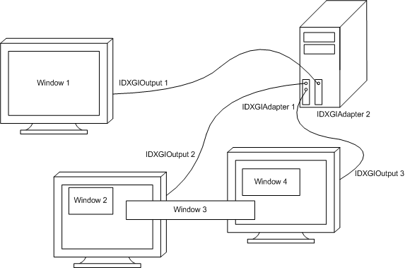

# DXGI overview

Microsoft DirectX Graphics Infrastructure (DXGI) recognizes that some parts of graphics evolve more slowly than others. The primary goal of DXGI is to manage low-level tasks that can be independent of the DirectX graphics runtime. DXGI provides a common framework for future graphics components; the first component that takes advantage of DXGI is Microsoft Direct3D 10.

In previous versions of Direct3D, low-level tasks like enumeration of hardware devices, presenting rendered frames to an output, controlling gamma, and managing a full-screen transition were included in the Direct3D runtime. These tasks are now implemented in DXGI.

DXGI's purpose is to communicate with the kernel mode driver and the system hardware, as shown in the following diagram.


An application can access DXGI directly, or call the Direct3D APIs in D3D11\_1.h, D3D11.h, D3D10\_1.h, or D3D10.h, which handles the communications with DXGI for you. You may want to work with DXGI directly if your application needs to enumerate devices or control how data is presented to an output.

This topic contains the following sections.

-   [Enumerating Adapters](#enumerating-adapters)
    -   [New info about enumerating adapters for Windows 8](#new-info-about-enumerating-adapters-for-windows-8)
-   [Presentation](#presentation)
    -   [Create a Swap Chain](#create-a-swap-chain)
    -   [Care and Feeding of the Swap Chain](#care-and-feeding-of-the-swap-chain)
    -   [Handling Window Resizing](#handling-window-resizing)
    -   [Choosing the DXGI Output and Size](#choosing-the-dxgi-output-and-size)
    -   [Debugging in Full-Screen Mode](#debugging-in-full-screen-mode)
    -   [Destroying a Swap Chain](#destroying-a-swap-chain)
    -   [Using a Rotated Monitor](#using-a-rotated-monitor)
    -   [Switching Modes](#switching-modes)
    -   [Full-Screen Performance Tip](#full-screen-performance-tip)
    -   [Multithread Considerations](#multithread-considerations)
-   [DXGI Responses from DLLMain](#dxgi-responses-from-dllmain)
-   [DXGI 1.1 Changes](#dxgi-11-changes)
-   [DXGI 1.2 Changes](#dxgi-12-changes)
-   [Related topics](#related-topics)

To see which formats are supported by Direct3D 11 hardware:

-   [DXGI Format Support for Direct3D Feature Level 12.1 Hardware](hardware-support-for-direct3d-12-1-formats.md)
-   [DXGI Format Support for Direct3D Feature Level 12.0 Hardware](hardware-support-for-direct3d-12-0-formats.md)
-   [DXGI Format Support for Direct3D Feature Level 11.1 Hardware](format-support-for-direct3d-11-1-feature-level-hardware.md)
-   [DXGI Format Support for Direct3D Feature Level 11.0 Hardware](format-support-for-direct3d-11-0-feature-level-hardware.md)
-   [Hardware Support for Direct3D 10Level9 Formats](/previous-versions//ff471324(v=vs.85))
-   [Hardware Support for Direct3D 10.1 Formats](/previous-versions//cc627091(v=vs.85))
-   [Hardware Support for Direct3D 10 Formats](/previous-versions//cc627090(v=vs.85))

## Enumerating adapters

An adapter is an abstraction of the hardware and the software capability of your computer. There are generally many adapters on your machine. Some devices are implemented in hardware (like your video card) and some are implemented in software (like the Direct3D reference rasterizer). Adapters implement functionality used by a graphic application. The following diagram shows a system with a single computer, two adapters (video cards), and three output monitors.



When enumerating these pieces of hardware, DXGI creates an [**IDXGIOutput1**](/windows/win32/api/DXGI1_2/nn-dxgi1_2-idxgioutput1) interface for each output (or monitor) and an [**IDXGIAdapter2**](/windows/win32/api/DXGI1_2/nn-dxgi1_2-idxgiadapter2) interface for each video card (even if it is a video card built into a motherboard). Enumeration is done by using an [**IDXGIFactory**](/windows/win32/api/DXGI1_2/nn-dxgi1_2-idxgifactory2) interface call, [**IDXGIFactory::EnumAdapters**](/windows/win32/api/DXGI/nf-dxgi-idxgifactory-enumadapters), to return a set of [**IDXGIAdapter**](/windows/win32/api/DXGI/nn-dxgi-idxgiadapter) interfaces that represent the video hardware.

DXGI 1.1 added the [**IDXGIFactory1**](/windows/win32/api/DXGI/nn-dxgi-idxgifactory1) interface. [**IDXGIFactory1::EnumAdapters1**](/windows/win32/api/DXGI/nf-dxgi-idxgifactory1-enumadapters1) returns a set of [**IDXGIAdapter1**](/windows/win32/api/DXGI/nn-dxgi-idxgiadapter1) interfaces that represents the video hardware.

If you want to select specific video hardware capabilities when you use Direct3D APIs, we recommend that you iteratively call the [**D3D11CreateDevice**](/windows/win32/api/d3d11/nf-d3d11-d3d11createdevice) or [**D3D11CreateDeviceAndSwapChain**](/windows/win32/api/d3d11/nf-d3d11-d3d11createdeviceandswapchain) function with each adapter handle and possible hardware [feature level](../direct3d11/overviews-direct3d-11-devices-downlevel-intro.md). This function succeeds if the feature level is supported by the specified adapter.

### New info about enumerating adapters for Windows 8

Starting with Windows 8, an adapter called the "Microsoft Basic Render Driver" is always present. This adapter has a VendorId of **0x1414** and a DeviceID of **0x8c**. This adapter also has the [**DXGI\_ADAPTER\_FLAG\_SOFTWARE**](/windows/win32/api/dxgi/ne-dxgi-dxgi_adapter_flag) value set in the **Flags** member of its [**DXGI\_ADAPTER\_DESC2**](/windows/win32/api/DXGI1_2/ns-dxgi1_2-dxgi_adapter_desc2) structure. This adapter is a render-only device that has no display outputs. DXGI never returns [**DXGI\_ERROR\_DEVICE\_REMOVED**](dxgi-error.md) for this adapter.

If a computer's display driver is not functioning or is disabled, the computer's primary (**NULL**) adapter might also be called "Microsoft Basic Render Driver." But this adapter has outputs and doesn't have the [**DXGI\_ADAPTER\_FLAG\_SOFTWARE**](/windows/win32/api/dxgi/ne-dxgi-dxgi_adapter_flag) value set. The operating system and apps use this adapter by default. If a display driver is installed or enabled, apps can receive [**DXGI\_ERROR\_DEVICE\_REMOVED**](dxgi-error.md) for this adapter and then must re-enumerate adapters again.

When a computer's primary display adapter is the "Microsoft Basic Display Adapter" ([WARP](../direct3d11/overviews-direct3d-11-devices-create-warp.md) adapter), that computer also has a second adapter. This second adapter is the render-only device that has no display outputs and for which DXGI never returns [**DXGI\_ERROR\_DEVICE\_REMOVED**](dxgi-error.md).

If you want to use WARP for rendering, compute, or other long running tasks, we recommend to use the render-only device. You can obtain a pointer to the render-only device by calling the [**IDXGIFactory1::EnumAdapters1**](/windows/win32/api/DXGI/nf-dxgi-idxgifactory1-enumadapters1) method. You also create the render-only device when you specify [**D3D\_DRIVER\_TYPE\_WARP**](/windows/win32/api/d3dcommon/ne-d3dcommon-d3d_driver_type) in the *DriverType* parameter of [**D3D11CreateDevice**](/windows/win32/api/d3d11/nf-d3d11-d3d11createdevice) because the WARP device also uses the render-only WARP adapter.

## Presentation

Your application's job is to render frames and ask DXGI to present those frames to the output. If the application has two buffers available, it can render one buffer while presenting another one. The application might require more than two buffers depending on the time it takes to render a frame or the desired frame rate for presentation. The set of buffers created is called a swap chain, as shown here.


-   [Create a Swap Chain](#create-a-swap-chain)
-   [Care and Feeding of the Swap Chain](#care-and-feeding-of-the-swap-chain)
-   [Handling Window Resizing](#handling-window-resizing)
-   [Choosing the DXGI Output and Size](#choosing-the-dxgi-output-and-size)
-   [Debugging in Full-Screen Mode](#debugging-in-full-screen-mode)
-   [Destroying a Swap Chain](#destroying-a-swap-chain)
-   [Using a Rotated Monitor](#using-a-rotated-monitor)
-   [Switching Modes](#switching-modes)
-   [Full-Screen Performance Tip](#full-screen-performance-tip)
-   [Multithread Considerations](#multithread-considerations)

A swap chain has one front buffer and one or more back buffers. Each application creates its own swap chain. To maximize the speed of the presentation of the data to an output, a swap chain is almost always created in the memory of a display sub-system, which is shown in the following illustration.


The display sub-system (which is often a video card but could be implemented on a motherboard) contains a GPU, a digital to analog converter (DAC), and memory. The swap chain is allocated within this memory to make presentation very fast. The display sub-system presents the data in the front buffer to the output.

A swap chain is set up to draw in full-screen or windowed mode, this eliminates the need to know whether an output is windowed or full screen. A full-screen mode swap chain can optimize performance by switching the display resolution.

### Create a swap chain

<table>
<colgroup>
<col style="width: 100%" />
</colgroup>
<tbody>
<tr class="odd">
<td>Differences between Direct3D 9 and Direct3D 10: Direct3D 10 is the first graphics component to use DXGI. DXGI has some different swap chain behaviors.<br/>
<ul>
<li>In DXGI, a swap chain is tied to a window when the swap chain is created. This change improves performance and saves memory. Previous versions of Direct3D allowed the swap chain to change the window that the swap chain is tied to.</li>
<li>In DXGI, a swap chain is tied to a rendering device on creation. The device object that the Direct3D create device functions return implements the <a href="/windows/win32/api/unknwn/nn-unknwn-iunknown"><strong>IUnknown</strong></a> interface. You can call <a href="/windows/win32/api/unknwn/nf-unknwn-iunknown-queryinterface(q)"><strong>QueryInterface</strong></a> to query for the device's corresponding <a href="/windows/win32/api/DXGI1_2/nn-dxgi1_2-idxgidevice2"><strong>IDXGIDevice2</strong></a> interface. A change to the rendering device requires the swap chain to be recreated.</li>
<li><p>In DXGI, the swap effects available are DXGI_SWAP_EFFECT_DISCARD and DXGI_SWAP_EFFECT_SEQUENTIAL. Starting with Windows 8 the DXGI_SWAP_EFFECT_FLIP_SEQUENTIAL swap effect is also available. The following table shows a mapping of Direct3D 9 to DXGI swap effect defines. </p>
<table>
<thead>
<tr class="header">
<th>D3D9 Swap Effect</th>
<th>DXGI Swap Effect</th>
</tr>
</thead>
<tbody>
<tr class="odd">
<td>D3DSWAPEFFECT_DISCARD</td>
<td>DXGI_SWAP_EFFECT_DISCARD</td>
</tr>
<tr class="even">
<td>D3DSWAPEFFECT_COPY</td>
<td>DXGI_SWAP_EFFECT_SEQUENTIAL with 1 buffer</td>
</tr>
<tr class="odd">
<td>D3DSWAPEFFECT_FLIP</td>
<td>DXGI_SWAP_EFFECT_SEQUENTIAL with 2 or more buffers</td>
</tr>
<tr class="even">
<td>D3DSWAPEFFECT_FLIPEX</td>
<td>DXGI_SWAP_EFFECT_FLIP_SEQUENTIAL with 2 or more buffers</td>
</tr>
</tbody>
</table>
<p></p>
<p> </p></li>
</ul></td>
</tr>
</tbody>
</table>


 

A swap chain's buffers are created at a particular size and in a particular format. The application specifies these values (or you can inherit the size from the target window) at startup, and can then optionally modify them as the window size changes in response to user input or program events.

After you create the swap chain, you will typically want to render images into it. Here's a code fragment that sets up a Direct3D context to render into a swap chain. This code extracts a buffer from the swap chain, creates a render-target-view from that buffer, then sets it on the device:


```
ID3D11Resource * pBB;
ThrowFailure( pSwapChain->GetBuffer(0, __uuidof(pBB),    
  reinterpret_cast<void**>(&pBB)), "Couldn't get back buffer");
ID3D11RenderTargetView * pView;
ThrowFailure( pD3D11Device->CreateRenderTargetView(pBB, NULL, &pView), 
  "Couldn't create view" );
pD3D11DeviceContext->OMSetRenderTargets(1, &pView, 0);
        
```


After your application renders a frame into a swap-chain buffer, call [**IDXGISwapChain1::Present1**](/windows/win32/api/DXGI1_2/nf-dxgi1_2-idxgiswapchain1-present1). The application can then go render the next image.

### Care and feeding of the swap chain

After you render your image, call [**IDXGISwapChain1::Present1**](/windows/win32/api/DXGI1_2/nf-dxgi1_2-idxgiswapchain1-present1) and go render the next image. That is the extent of your responsibility.

If you previously called [**IDXGIFactory::MakeWindowAssociation**](/windows/win32/api/DXGI/nf-dxgi-idxgifactory-makewindowassociation), the user can press the Alt-Enter key combination and DXGI will transition your application between windowed and full-screen mode. **IDXGIFactory::MakeWindowAssociation** is recommended, because a standard control mechanism for the user is strongly desired.

While you don't have to write any more code than has been described, a few simple steps can make your application more responsive. The most important consideration is the resizing of the swap chain's buffers in response to the resizing of the output window. Naturally, the application's best route is to respond to WM\_SIZE, and call [**IDXGISwapChain::ResizeBuffers**](/windows/win32/api/DXGI/nf-dxgi-idxgiswapchain-resizebuffers), passing the size contained in the message's parameters. This behavior obviously makes your application respond well to the user when he or she drags the window's borders, but it is also exactly what enables a smooth full-screen transition. Your window will receive a WM\_SIZE message whenever such a transition happens, and calling **IDXGISwapChain::ResizeBuffers** is the swap chain's chance to re-allocate the buffers' storage for optimal presentation. This is why the application is required to release any references it has on the existing buffers before it calls **IDXGISwapChain::ResizeBuffers**.

Failure to call [**IDXGISwapChain::ResizeBuffers**](/windows/win32/api/DXGI/nf-dxgi-idxgiswapchain-resizebuffers) in response to switching to full-screen mode (most naturally, in response to WM\_SIZE), can preclude the optimization of flipping, wherein DXGI can simply swap which buffer is being displayed, rather than copying a full screen's worth of data around.

[**IDXGISwapChain1::Present1**](/windows/win32/api/DXGI1_2/nf-dxgi1_2-idxgiswapchain1-present1) will inform you if your output window is entirely occluded via **DXGI\_STATUS\_OCCLUDED**. When this occurs, we recommended that your application go into standby mode (by calling **IDXGISwapChain1::Present1** with **DXGI\_PRESENT\_TEST**) since resources used to render the frame are wasted. Using **DXGI\_PRESENT\_TEST** will prevent any data from being presented while still performing the occlusion check. Once **IDXGISwapChain1::Present1** returns S\_OK, you should exit standby mode; do not use the return code to switch to standby mode as doing so can leave the swap chain unable to relinquish full-screen mode.

The Direct3D 11.1 runtime, which is available starting with Windows 8, provides a flip-model swap chain (that is, a swap chain that has the [**DXGI\_SWAP\_EFFECT\_FLIP\_SEQUENTIAL**](/windows/win32/api/DXGI/ne-dxgi-dxgi_swap_effect) value set in the **SwapEffect** member of [**DXGI\_SWAP\_CHAIN\_DESC**](/windows/win32/api/DXGI/ns-dxgi-dxgi_swap_chain_desc) or [**DXGI\_SWAP\_CHAIN\_DESC1**](/windows/win32/api/DXGI1_2/ns-dxgi1_2-dxgi_swap_chain_desc1)). When you present frames to an output with a flip-model swap chain, DXGI unbinds the back buffer from all pipeline state locations, like an output-merger render target, that write to back buffer 0. Therefore, we recommend that you call [**ID3D11DeviceContext::OMSetRenderTargets**](/windows/win32/api/d3d11/nf-d3d11-id3d11devicecontext-omsetrendertargets) immediately before you render to the back buffer. For example, don't call **OMSetRenderTargets** and then perform compute shader work that doesn't end up rendering to the resource. For more info about flip-model swap chains and their benefits, see [DXGI Flip Model](dxgi-flip-model.md).

> [!NOTE]  
> In Direct3D 10 and Direct3D 11, you don't have to call [**IDXGISwapChain::GetBuffer**](/windows/win32/api/DXGI/nf-dxgi-idxgiswapchain-getbuffer) to retrieve back buffer 0 after you call [**IDXGISwapChain1::Present1**](/windows/win32/api/DXGI1_2/nf-dxgi1_2-idxgiswapchain1-present1) because for convenience the identities of back buffers change. This doesn't happen in Direct3D 12, and your application must instead manually track back buffer indices.

### Handling window resizing

You can use the [**IDXGISwapChain::ResizeBuffers**](/windows/win32/api/DXGI/nf-dxgi-idxgiswapchain-resizebuffers) method to handle window resizing. Before you call **ResizeBuffers**, you must release all outstanding references to the swap chain's buffers. The object that typically holds a reference to a swap chain's buffer is a render-target-view.

The following example code shows how to call [**ResizeBuffers**](/windows/win32/api/DXGI/nf-dxgi-idxgiswapchain-resizebuffers) from within the WindowProc handler for WM\_SIZE messages:


```
    case WM_SIZE:
        if (g_pSwapChain)
        {
            g_pd3dDeviceContext->OMSetRenderTargets(0, 0, 0);

            // Release all outstanding references to the swap chain's buffers.
            g_pRenderTargetView->Release();

            HRESULT hr;
            // Preserve the existing buffer count and format.
            // Automatically choose the width and height to match the client rect for HWNDs.
            hr = g_pSwapChain->ResizeBuffers(0, 0, 0, DXGI_FORMAT_UNKNOWN, 0);
                                            
            // Perform error handling here!

            // Get buffer and create a render-target-view.
            ID3D11Texture2D* pBuffer;
            hr = g_pSwapChain->GetBuffer(0, __uuidof( ID3D11Texture2D),
                                         (void**) &pBuffer );
            // Perform error handling here!

            hr = g_pd3dDevice->CreateRenderTargetView(pBuffer, NULL,
                                                     &g_pRenderTargetView);
            // Perform error handling here!
            pBuffer->Release();

            g_pd3dDeviceContext->OMSetRenderTargets(1, &g_pRenderTargetView, NULL );

            // Set up the viewport.
            D3D11_VIEWPORT vp;
            vp.Width = width;
            vp.Height = height;
            vp.MinDepth = 0.0f;
            vp.MaxDepth = 1.0f;
            vp.TopLeftX = 0;
            vp.TopLeftY = 0;
            g_pd3dDeviceContext->RSSetViewports( 1, &vp );
        }
        return 1;
```


### Choosing the DXGI output and size

By default, DXGI chooses the output that contains most of the client area of the window. This is the only option available to DXGI when it goes full-screen itself in response to alt-enter. If the application chooses to go to full-screen mode by itself, then it can call [**IDXGISwapChain::SetFullscreenState**](/windows/win32/api/DXGI/nf-dxgi-idxgiswapchain-setfullscreenstate) and pass an explicit [**IDXGIOutput1**](/windows/win32/api/DXGI1_2/nn-dxgi1_2-idxgioutput1) (or **NULL**, if the application is happy to let DXGI decide).

To resize the output while either full screen or windowed, we recommend to call [**IDXGISwapChain::ResizeTarget**](/windows/win32/api/DXGI/nf-dxgi-idxgiswapchain-resizetarget), since this method resizes the target window also. Since the target window is resized, the operating system sends **WM\_SIZE**, and your code will naturally call [**IDXGISwapChain::ResizeBuffers**](/windows/win32/api/DXGI/nf-dxgi-idxgiswapchain-resizebuffers) in response. It's thus a waste of effort to resize your buffers, and then subsequently resize the target.

### Debugging in full-screen mode

A DXGI swap chain relinquishes full-screen mode only when absolutely necessary. This means that you can debug a full-screen application using multiple monitors, as long as the debug window doesn't overlap the swap chain's target window. Alternatively, you can prevent mode switching altogether by not setting the **DXGI\_SWAP\_CHAIN\_FLAG\_ALLOW\_MODE\_SWITCH** flag.

If mode switching is allowed, a swap chain will relinquish full-screen mode whenever its output window is occluded by another window. The occlusion check is performed during [**IDXGISwapChain1::Present1**](/windows/win32/api/DXGI1_2/nf-dxgi1_2-idxgiswapchain1-present1), or by a separate thread whose purpose is to watch to see if the application has becomes unresponsive (and no longer calls **IDXGISwapChain1::Present1**). To disable the ability of the separate thread to cause a switch, set the following registry key to any non-zero value.

**HKCU\\Software\\Microsoft\\DXGI\\DisableFullscreenWatchdog**

### Destroying a swap chain

You may not release a swap chain in full-screen mode because doing so may create thread contention (which will cause DXGI to raise a non-continuable exception). Before releasing a swap chain, first switch to windowed mode (using [**IDXGISwapChain::SetFullscreenState**](/windows/win32/api/DXGI/nf-dxgi-idxgiswapchain-setfullscreenstate)( **FALSE**, **NULL** )) and then call [**IUnknown::Release**](/windows/win32/api/unknwn/nf-unknwn-iunknown-release).

### Using a rotated monitor

An application does not need to worry about monitor orientation, DXGI will rotate a swap-chain buffer during presentation, if necessary. Of course, this additional rotation can impact performance. For best performance, take care of the rotation in your application by doing the following:

-   Use the **DXGI\_SWAP\_CHAIN\_FLAG\_NONPREROTATED**. This notifies DXGI that the application will produce a rotated image (for example, by altering its projection matrix). One thing to note, this flag is only valid while in full-screen mode.
-   Allocate each swap-chain buffer in its rotated size. Use [**IDXGIOutput::GetDesc**](/windows/win32/api/DXGI/nf-dxgi-idxgioutput-getdesc) to get these values, if necessary.

By performing the rotation in your application, DXGI will simply do a copy instead of a copy and a rotate.

The Direct3D 11.1 runtime, which is available starting with Windows 8, provides a flip-model swap chain (that is, a swap chain that has the [**DXGI\_SWAP\_EFFECT\_FLIP\_SEQUENTIAL**](/windows/win32/api/DXGI/ne-dxgi-dxgi_swap_effect) value set in the **SwapEffect** member of [**DXGI\_SWAP\_CHAIN\_DESC1**](/windows/win32/api/DXGI1_2/ns-dxgi1_2-dxgi_swap_chain_desc1)). To maximize the presentation optimizations available with a flip-model swap chain, we recommend that you make your applications orient content to match the particular output on which the content resides when that content fully occupies the output. For more info about flip-model swap chains and their benefits, see [DXGI Flip Model](dxgi-flip-model.md).

### Switching modes

The DXGI swap chain might change the display mode of an output when making a full-screen transition. To enable the automatic display mode change, you must specify **DXGI\_SWAP\_CHAIN\_FLAG\_ALLOW\_MODE\_SWITCH** in the swap-chain description. If the display mode automatically changes, DXGI will choose the most modest mode (size and resolution will not change, but the color depth may). Resizing swap chain buffers will not cause a mode switch. The swap chain makes an implicit promise that if you choose a back buffer that exactly matches a display mode supported by the target output, then it will switch to that display mode when entering full-screen mode on that output. Consequently, you choose a display mode by choosing your back buffer size and format.

### Full-screen performance tip

When you call [**IDXGISwapChain1::Present1**](/windows/win32/api/DXGI1_2/nf-dxgi1_2-idxgiswapchain1-present1) on a full-screen application, the swap chain flips (as opposed to blits) the contents of the back buffer to the front buffer. This requires that the swap chain was created by using an enumerated display mode (specified in [**DXGI\_SWAP\_CHAIN\_DESC1**](/windows/win32/api/DXGI1_2/ns-dxgi1_2-dxgi_swap_chain_desc1)). If you fail to enumerate display modes, or incorrectly specify the display mode in the description, the swap chain may perform a bit-block transfer (bitblt) instead. The bitblt causes an extra stretching copy as well as some increased video memory usage, and is difficult to detect. To avoid this problem, enumerate display modes, and initialize the swap chain description correctly before you create the swap chain. This will ensure maximum performance when flipping in full-screen mode and avoid the extra memory overhead.

### Multithread considerations

When you use DXGI in an application with multiple threads, you need to be careful to avoid creating a deadlock, where two different threads are waiting on each other to complete. There are two situations where this can occur.

-   The rendering thread is not the message-pump thread.
-   The thread executing a DXGI API is not the same thread that created the window.

Be careful that you never have the message-pump thread wait on the render thread when you use full-screen swap chains. For instance, calling [**IDXGISwapChain1::Present1**](/windows/win32/api/DXGI1_2/nf-dxgi1_2-idxgiswapchain1-present1) (from the render thread) may cause the render thread to wait on the message-pump thread. When a mode change occurs, this scenario is possible if **Present1** calls ::SetWindowPos() or ::SetWindowStyle() and either of these methods call ::SendMessage(). In this scenario, if the message-pump thread has a critical section guarding it or if the render thread is blocked, then the two threads will deadlock.

For more info about using DXGI with multiple threads, see [Multithreading and DXGI](../direct3d11/overviews-direct3d-11-render-multi-thread-intro.md).

## DXGI responses from DLLMain

Because a [**DllMain**](../dlls/dllmain.md) function can't guarantee the order in which it loads and unloads DLLs, we recommend that your app's **DllMain** function not call Direct3D or DXGI functions or methods, including functions or methods that create or release objects. If your app's **DllMain** function calls into a particular component, that component might call another DLL that isn't present on the operating system, which causes the operating system to crash. Direct3D and DXGI might load a set of DLLs, typically a set of drivers, that differs from computer to computer. Therefore, even if your app doesn t crash on your development and test computers when its **DllMain** function calls Direct3D or DXGI functions or methods, it might crash when it runs on another computer.

To prevent you from creating an app that might cause the operating system to crash, DXGI provides the following responses in the specified situations:

-   If your app's [**DllMain**](../dlls/dllmain.md) function releases its last reference to a DXGI factory, DXGI raises an exception.
-   If your app's [**DllMain**](../dlls/dllmain.md) function creates a DXGI factory, DXGI returns an error code.

## DXGI 1.1 changes

We added the following functionality in DXGI 1.1.

-   Synchronized Shared Surfaces Support

    Synchronized shared surfaces for Direct3D 10.1 and Direct3D 11 enables efficient read and write surface sharing between multiple Direct3D devices (sharing between Direct3D 10 and Direct3D 11 devices is possible). See [**IDXGIKeyedMutex::AcquireSync**](/windows/win32/api/DXGI/nf-dxgi-idxgikeyedmutex-acquiresync) and [**IDXGIKeyedMutex::ReleaseSync**](/windows/win32/api/DXGI/nf-dxgi-idxgikeyedmutex-releasesync).

-   High Color Support

    Supports the DXGI\_FORMAT\_R10G10B10\_XR\_BIAS\_A2\_UNORM format.

-   [**IDXGIDevice1::SetMaximumFrameLatency**](/windows/win32/api/DXGI/nf-dxgi-idxgidevice1-setmaximumframelatency) and [**IDXGIDevice1::GetMaximumFrameLatency**](/windows/win32/api/DXGI/nf-dxgi-idxgidevice1-getmaximumframelatency)
-   [**IDXGIFactory1::EnumAdapters1**](/windows/win32/api/DXGI/nf-dxgi-idxgifactory1-enumadapters1) enumerates local adapter(s) without any monitors or outputs attached, as well as adapters(s) with outputs attached. The first adapter returned will be the local adapter on which the Desktop primary is displayed.
-   BGRA format support

    DXGI\_FORMAT\_B8G8R8A8\_UNORM and DXGI\_FORMAT\_B8G8R8A8\_UNORM\_SRGB, see [**IDXGISurface1::GetDC**](/windows/win32/api/DXGI/nf-dxgi-idxgisurface1-getdc) and [**IDXGISurface1::ReleaseDC**](/windows/win32/api/DXGI/nf-dxgi-idxgisurface1-releasedc).

## DXGI 1.2 changes

We added the following functionality in DXGI 1.2.

-   Stereo swap chain
-   [Flip-model swap chain](dxgi-flip-model.md)
-   Optimized presentation (scrolling, dirty rectangles, and rotation)
-   Improved shared resources and synchronization
-   [Desktop Duplication](desktop-dup-api.md)
-   Optimized use of video memory
-   Support for 16 bits per pixel (bpp) formats (DXGI\_FORMAT\_B5G6R5\_UNORM, DXGI\_FORMAT\_B5G5R5A1\_UNORM, DXGI\_FORMAT\_B4G4R4A4\_UNORM)
-   Debugging APIs

For more info about DXGI 1.2, see [DXGI 1.2 Improvements](dxgi-1-2-improvements.md).

## Related topics

[Programming Guide for DXGI](dx-graphics-dxgi-overviews.md)
