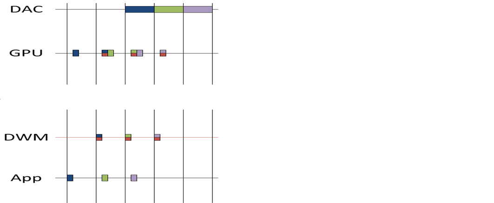

# DXGI flip model

Windows 8 adds support for flip presentation model and its associated present statistics in DXGI 1.2. Windows 8’s DXGI flip presentation model is similar to Windows 7’s [Direct3D 9EX Flip Mode Presentation](../direct3darticles/direct3d-9ex-improvements.md). Video or frame rate-based presentation apps such as games can benefit most by using flip presentation model. Apps that use DXGI flip presentation model reduce the system resource load and increase performance. Apps can also use present statistics enhancements with flip presentation model to better control the rate of presentation by providing real-time feedback and correction mechanisms.

-   [Comparing the DXGI flip model and the BitBlt model](#comparing-the-dxgi-flip-model-and-the-bitblt-model)
-   [How to use DXGI flip model](#how-to-use-dxgi-flip-model)
-   [Frame synchronization of DXGI flip model apps](#frame-synchronization-of-dxgi-flip-model-apps)
-   [Avoiding, detecting, and recovering from glitches](#avoiding-detecting-and-recovering-from-glitches)
-   [Related topics](#related-topics)

## Comparing the DXGI flip model and the BitBlt model

The runtime uses the bit-block transfer (bitblt) and flip presentation models to present graphics content on display monitors. The biggest difference between bitblt and flip presentation models is how back-buffer contents get to the Windows 8 DWM for composition. In the bitblt model, contents of the back buffer are copied into the redirection surface on each call to [**IDXGISwapChain1::Present1**](/windows/desktop/api/DXGI1_2/nf-dxgi1_2-idxgiswapchain1-present1). In the flip model, all back buffers are shared with the Desktop Window Manager (DWM). Therefore, the DWM can compose straight from those back buffers without any additional copy operations. In general, the flip model is more efficient. The flip model also provides more features, such as enhanced present statistics.

If you have legacy components that use Windows Graphics Device Interface (GDI) to write to an [**HWND**](../winprog/windows-data-types.md) directly, use the bitblt model.

Performance improvements of DXGI flip model are significant when the app is in windowed mode. The sequence in this table and the illustration compare memory bandwidth usages and system reads and writes of windowed apps that choose flip model versus the bitblt model.

| Step | BitBlt model present to DWM                                                                               | DXGI flip model present to DWM                                   |
|------|-----------------------------------------------------------------------------------------------------------|------------------------------------------------------------------|
| 1.   | The app updates its frame (Write)                                                               | The app updates its frame (Write)                      |
| 2.   | Direct3D runtime copies surface contents to a DWM redirection surface (Read, Write)             | Direct3D runtime passes the app surface to DWM         |
| 3.   | After the shared surface copy completes, DWM renders the app surface onto screen (Read, Write)  | DWM renders the app surface onto screen (Read, Write)  |

 

Flip model reduces system memory usage by reducing the number of reads and writes by the Direct3D runtime for the windowed frame composition by DWM.

## How to use DXGI flip model

Direct3D 11.1 apps that target Windows 8 use flip model by creating the swap chain with the [**DXGI\_SWAP\_EFFECT\_FLIP\_SEQUENTIAL**](/windows/desktop/api/DXGI/ne-dxgi-dxgi_swap_effect) enumeration value set in the **SwapEffect** member of the [**DXGI\_SWAP\_CHAIN\_DESC1**](/windows/desktop/api/DXGI1_2/ns-dxgi1_2-dxgi_swap_chain_desc1) structure. When you set **SwapEffect** to **DXGI\_SWAP\_EFFECT\_FLIP\_SEQUENTIAL**, also set these members of **DXGI\_SWAP\_CHAIN\_DESC1** to the indicated values:

-   **BufferCount** to a value between 2 and 16 to prevent a performance penalty as a result of waiting on DWM to release the previous presentation buffer.
-   **Format** to DXGI\_FORMAT\_R16G16B16A16\_FLOAT, DXGI\_FORMAT\_B8G8R8A8\_UNORM, or DXGI\_FORMAT\_R8G8B8A8\_UNORM
-   **Count** member of the [**DXGI\_SAMPLE\_DESC**](/windows/desktop/api/dxgicommon/ns-dxgicommon-dxgi_sample_desc) structure that the **SampleDesc** member specifies to one and the **Quality** member of **DXGI\_SAMPLE\_DESC** to zero because multiple sample antialiasing (MSAA) is not supported

If you use [**DXGI\_SWAP\_EFFECT\_FLIP\_SEQUENTIAL**](/windows/desktop/api/DXGI/ne-dxgi-dxgi_swap_effect) on Windows 7 or earlier operating system, device creation fails. When you use flip model, you can use full-screen present statistics in windowed mode. Full-screen behavior is not affected. If you pass **NULL** to the *pFullscreenDesc* parameter of [**IDXGIFactory2::CreateSwapChainForHwnd**](/windows/desktop/api/DXGI1_2/nf-dxgi1_2-idxgifactory2-createswapchainforhwnd) for a windowed swap chain and set **SwapEffect** to **DXGI\_SWAP\_EFFECT\_FLIP\_SEQUENTIAL**, the runtime creates one extra back buffer and rotates whichever handle belongs to the buffer that becomes the front buffer at presentation time.

When you use flip model, consider these tips:

-   Use one flip model swap chain per [**HWND**](../winprog/windows-data-types.md). Do not target multiple flip model swap chains to the same **HWND**.
-   Do not use flip model swap chain with GDI's [**ScrollWindow**](/windows/win32/api/winuser/nf-winuser-scrollwindow) or [**ScrollWindowEx**](/windows/win32/api/winuser/nf-winuser-scrollwindowex) function. Some Direct3D apps use GDI's **ScrollWindow** and **ScrollWindowEx** functions to update window contents after a user scroll event occurs. **ScrollWindow** and **ScrollWindowEx** perform bitblts of window contents on screen as the user scrolls a window. These functions also require bitblt model updates for GDI and Direct3D content. Apps that use either function will not necessarily display visible window contents scrolling on screen when the app is in windowed mode. We recommend that you not use GDI's **ScrollWindow** and **ScrollWindowEx** functions, and instead redraw GDI and Direct3D contents on screen in response to scrolling.
-   Use flip model in an [**HWND**](../winprog/windows-data-types.md) that is not also targeted by other APIs, including DXGI bitblt presentation model, other versions of Direct3D, or GDI. Because bitblt model maintains an additional copy of the surface, you can add GDI and other Direct3D contents to the same **HWND** through piecemeal updates from Direct3D and GDI. When you use the flip model, only Direct3D content in flip model swap chains that the runtime passes to DWM are visible. The runtime ignores all other bitblt model Direct3D or GDI content updates.

## Frame synchronization of DXGI flip model apps

Present statistics are frame-timing information that media apps use to synchronize video and audio streams and recover from video playback glitches. Apps can use the frame-timing information in present statistics to adjust the presentation rate of their video frames for smoother presentation. To obtain present statistics information, call the [**IDXGISwapChain::GetFrameStatistics**](/windows/desktop/api/DXGI/nf-dxgi-idxgiswapchain-getframestatistics) method to obtain the [**DXGI\_FRAME\_STATISTICS**](/windows/desktop/api/DXGI/ns-dxgi-dxgi_frame_statistics) structure. **DXGI\_FRAME\_STATISTICS** contains statistics about [**IDXGISwapChain1::Present1**](/windows/desktop/api/DXGI1_2/nf-dxgi1_2-idxgiswapchain1-present1) calls. A flip model swap chain provides present statistics information in both windowed and full-screen modes. For bitblt model swap chains in windowed mode, all **DXGI\_FRAME\_STATISTICS** values are zeroes.

For flip model present statistics, [**IDXGISwapChain::GetFrameStatistics**](/windows/desktop/api/DXGI/nf-dxgi-idxgiswapchain-getframestatistics) returns **DXGI\_ERROR\_FRAME\_STATISTICS\_DISJOINT** in these situations:

-   First call to [**GetFrameStatistics**](/windows/desktop/api/DXGI/nf-dxgi-idxgiswapchain-getframestatistics), which indicates the beginning of a sequence
-   Mode change: either windowed mode to or from full screen or full screen to full screen transitions

The values in **PresentRefreshCount**, **SyncRefreshCount**, and **SyncQPCTime** members of [**DXGI\_FRAME\_STATISTICS**](/windows/desktop/api/DXGI/ns-dxgi-dxgi_frame_statistics) have the following characteristics:

-   **PresentRefreshCount** is equal to **SyncRefreshCount** when the app presents on every vsync.
-   **SyncRefreshCount** is obtained on the vsync interval when the present was submitted, **SyncQPCTime** is approximately the time associated with the vsync interval.

The [**IDXGISwapChain::GetLastPresentCount**](/windows/desktop/api/DXGI/nf-dxgi-idxgiswapchain-getlastpresentcount) method returns the last present count, that is, the present ID of the last successful [**IDXGISwapChain1::Present1**](/windows/desktop/api/DXGI1_2/nf-dxgi1_2-idxgiswapchain1-present1) call made by a display device that is associated with the swap chain. This present ID is the value of the **PresentCount** member of the [**DXGI\_FRAME\_STATISTICS**](/windows/desktop/api/DXGI/ns-dxgi-dxgi_frame_statistics) structure. For bitblt model swap chains, while in windowed mode, all **DXGI\_FRAME\_STATISTICS** values are zeroes.

## Avoiding, detecting, and recovering from glitches

Perform these steps to avoid, detect, and recover from glitches in frame presentation:

1.  Queue [**IDXGISwapChain1::Present1**](/windows/desktop/api/DXGI1_2/nf-dxgi1_2-idxgiswapchain1-present1) calls (that is, call **IDXGISwapChain1::Present1** multiple times, which causes them to collect in a queue).
2.  Create a present-queue structure to store all successfully submitted [**IDXGISwapChain1::Present1**](/windows/desktop/api/DXGI1_2/nf-dxgi1_2-idxgiswapchain1-present1)'s present ID (returned by [**IDXGISwapChain::GetLastPresentCount**](/windows/desktop/api/DXGI/nf-dxgi-idxgiswapchain-getlastpresentcount)) and associated, calculated/expected **PresentRefreshCount** values.
3.  To detect a glitch:

    -   Call [**IDXGISwapChain::GetFrameStatistics**](/windows/desktop/api/DXGI/nf-dxgi-idxgiswapchain-getframestatistics).
    -   For this frame, get the present ID (**PresentCount**) and vsync count where the operating system presented the last image to the monitor (**PresentRefreshCount**).
    -   Retrieve the expected **PresentRefreshCount** that is associated with the present ID and that you previously stored in the present-queue structure.
    -   If the actual **PresentRefreshCount** is later than the expected **PresentRefreshCount**, a glitch has occurred.

4.  To recover from the glitch:

    -   Calculate the number of frames to skip to recover from the glitch. For example, if step 3 reveals that the expected vsync count (**PresentRefreshCount**) for a present ID (**PresentCount**) is 5 and the actual vsync count for the present ID is 8, the number of frames to skip to recover from the glitch is 3 frames.
    -   Pass 0 to the *SyncInterval* parameter in this number of calls to [**IDXGISwapChain1::Present1**](/windows/desktop/api/DXGI1_2/nf-dxgi1_2-idxgiswapchain1-present1) to discard and skip this number of frames.

        > [!Note]  
        > If the glitch consists of a large number of frames, call [**IDXGISwapChain1::Present1**](/windows/desktop/api/DXGI1_2/nf-dxgi1_2-idxgiswapchain1-present1) with the *Flags* parameter set to [**DXGI\_PRESENT\_RESTART**](dxgi-present.md) to discard and skip all outstanding queued presents.

         

Here is an example scenario of recovering from glitches in frame presentation:

In the example scenario, you expect frame A to go on screen on a vsync count of 1. But you actually detect the vsync count that frame A appears on screen as 4. Therefore, you determine that a glitch occurred. You can then discard 3 frames, that is, you can pass 0 to the *SyncInterval* parameter in 3 calls to [**IDXGISwapChain1::Present1**](/windows/desktop/api/DXGI1_2/nf-dxgi1_2-idxgiswapchain1-present1). In the preceding example scenario, to recover from the glitch, you need a total of 8 **IDXGISwapChain1::Present1** calls. The 9th frame is then visible as per the vsync count that you expect.

Here's a time line of presentation events. Each vertical line represents a vsync. The horizontal direction is time, which increases to the right. You can use the figure to imagine how glitches can occur.

The figure illustrates this sequence:

1.  The app wakes up on vsync, renders blue, calls [**IDXGISwapChain1::Present1**](/windows/desktop/api/DXGI1_2/nf-dxgi1_2-idxgiswapchain1-present1), and then goes back to sleep.
2.  The graphics processing unit (GPU) wakes up from idle, performs the render to blue, and then goes back to sleep.
3.  The DWM wakes up at the next vsync, composes blue into its back buffer, calls [**IDXGISwapChain1::Present1**](/windows/desktop/api/DXGI1_2/nf-dxgi1_2-idxgiswapchain1-present1), and then goes back to sleep.
4.  The app wakes up, renders green, calls [**IDXGISwapChain1::Present1**](/windows/desktop/api/DXGI1_2/nf-dxgi1_2-idxgiswapchain1-present1), and then goes back to sleep.
    > [!Note]  
    > The app concurrently executes while the GPU performs the compose of blue.

     

5.  Next, the GPU renders green for the app.
6.  Finally, the digital to analog converter (DAC) shows results of the DWM composition on the monitor on the next vsync.

From the time line, you can imagine the latency of present statistics and how glitches can occur. For example, to show a DWM glitch for the green color appearing on screen, imagine widening the green/red box so that the right side of the green/red box matches up to the right side of the purple/red box. In this scenario, the DAC shows two frames of blue and then the green frame. You can see that this glitch occurred from reading present statistics.

## Related topics

<dl> <dt>

[Enhancing presentation with the flip model, dirty rectangles, and scrolled areas](dxgi-1-2-presentation-improvements.md)
</dt> </dl>

 

 
