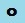
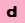

# Format support for Direct3D Feature 10Level9 9.1 hardware

This section specifies the formats ([**DXGI_FORMAT_***](/windows/win32/api/dxgiformat/ne-dxgiformat-dxgi_format) values) that are supported in Direct3D Feature 10Level9 9.1 hardware.

The table summarizes the feature support, using the following key.

| Symbol                            | Description                                                                   |
|-----------------------------------|-------------------------------------------------------------------------------|
| **-**                             | Disallowed or not available.                                                  |
|   | Hardware support is required.                                                 |
|   | Hardware support optional; the format may or may not be hardware accelerated. |
|  | Required if a related optional feature is supported.                            |

This topic contains a section per format. A format *target* (the tables contain one row per target) can be a resource type, an HLSL intrinsic function, or a particular functionality that is dependent on a particular format.

To programmatically verify format support in D3D11 and D3D12, refer to [Checking hardware feature support](checking-hardware-feature-support.md).

> [!NOTE] 
> The numbers of the formats are mostly, but not all, in ascending numerical order&mdash;some are out of numerical order, and listed alongside other relevant formats. Note also that *typeless* in a format name can mean *partially* typed, and not strictly typeless (refer to the [Format notes](#format-notes) section at the end of the topic).

// 

## DXGI_FORMAT_UNKNOWNL (0)
| Target | Support |
| - | - |
| Bits Per Element (BPE) | 0 |
| Format Support | \- |
| Buffer | \- |
| Input Assembler Vertex Buffer | \- |
| Input Assembler Index Buffer | \- |
| Stream Output Buffer | \- |
| Texture1D | \- |
| Texture2D | \- |
| Texture3D | \- |
| TextureCube | \- |
| Shader sample (point sample only) | \- |
| Shader sample (any filter) | \- |
| Shader sample\_c (comparison filter) | \- |
| Shader sample (mono 1-bit filter) | \- |
| Shader gather4 | \- |
| Shader gather4\_c | \- |
| Mipmap | \- |
| Mipmap Auto-Generation | \- |
| RenderTarget | \- |
| Blendable RenderTarget | \- |
| Output Merger Logic Op | \- |
| Depth/Stencil Target | \- |
| Raw UAV and SRV | \- |
| Structured UAV and SRV | \- |
| Typed UAV | \- |
| UAV Typed Store | \- |
| UAV Typed Load | \- |
| UAV Atomic Add | \- |
| UAV Atomic Bitwise Ops | \- |
| UAV Atomic Cmp&Store/ Cmp&Exch | \- |
| UAV Atomic Exchange | \- |
| UAV Atomic Signed Min or Max | \- |
| UAV Atomic Unsigned Min or Max | \- |
| CPU Lockable | \- |
| 4x Multisample RenderTarget | \- |
| 8x Multisample RenderTarget | \- |
| Other Multisample Count RT | \- |
| Multisample Resolve | \- |
| Multisample Load | \- |
| Display Scan-Out | \- |
| Cast Within Bit Layout | \- |
| Video Decoder Support | \- |
| Video Processor Input | \- |
| Video Processor Output | \- |
| Shared Resource | \- |
| Tiled Resource | \- |

## DXGI_FORMAT_R32G32B32A32\_TYPELESSPCS (1)
| Target | Support |
| - | - |
| Bits Per Element (BPE) | 128 |
| Format Support | \- |
| Buffer | \- |
| Input Assembler Vertex Buffer | \- |
| Input Assembler Index Buffer | \- |
| Stream Output Buffer | \- |
| Texture1D | \- |
| Texture2D | \- |
| Texture3D | \- |
| TextureCube | \- |
| Shader sample (point sample only) | \- |
| Shader sample (any filter) | \- |
| Shader sample\_c (comparison filter) | \- |
| Shader sample (mono 1-bit filter) | \- |
| Shader gather4 | \- |
| Shader gather4\_c | \- |
| Mipmap | \- |
| Mipmap Auto-Generation | \- |
| RenderTarget | \- |
| Blendable RenderTarget | \- |
| Output Merger Logic Op | \- |
| Depth/Stencil Target | \- |
| Raw UAV and SRV | \- |
| Structured UAV and SRV | \- |
| Typed UAV | \- |
| UAV Typed Store | \- |
| UAV Typed Load | \- |
| UAV Atomic Add | \- |
| UAV Atomic Bitwise Ops | \- |
| UAV Atomic Cmp&Store/ Cmp&Exch | \- |
| UAV Atomic Exchange | \- |
| UAV Atomic Signed Min or Max | \- |
| UAV Atomic Unsigned Min or Max | \- |
| CPU Lockable | \- |
| 4x Multisample RenderTarget | \- |
| 8x Multisample RenderTarget | \- |
| Other Multisample Count RT | \- |
| Multisample Resolve | \- |
| Multisample Load | \- |
| Display Scan-Out | \- |
| Cast Within Bit Layout | \- |
| Video Decoder Support | \- |
| Video Processor Input | \- |
| Video Processor Output | \- |
| Shared Resource | \- |
| Tiled Resource | \- |

## DXGI_FORMAT_R32G32B32A32\_FLOATFNS (2)
| Target | Support |
| - | - |
| Bits Per Element (BPE) | 128 |
| Format Support |  |
| Buffer | \- |
| Input Assembler Vertex Buffer |  |
| Input Assembler Index Buffer | \- |
| Stream Output Buffer | \- |
| Texture1D | \- |
| Texture2D | \- |
| Texture3D | \- |
| TextureCube | \- |
| Shader sample (point sample only) | \- |
| Shader sample (any filter) | \- |
| Shader sample\_c (comparison filter) | \- |
| Shader sample (mono 1-bit filter) | \- |
| Shader gather4 | \- |
| Shader gather4\_c | \- |
| Mipmap | \- |
| Mipmap Auto-Generation | \- |
| RenderTarget | \- |
| Blendable RenderTarget | \- |
| Output Merger Logic Op | \- |
| Depth/Stencil Target | \- |
| Raw UAV and SRV | \- |
| Structured UAV and SRV | \- |
| Typed UAV | \- |
| UAV Typed Store | \- |
| UAV Typed Load | \- |
| UAV Atomic Add | \- |
| UAV Atomic Bitwise Ops | \- |
| UAV Atomic Cmp&Store/ Cmp&Exch | \- |
| UAV Atomic Exchange | \- |
| UAV Atomic Signed Min or Max | \- |
| UAV Atomic Unsigned Min or Max | \- |
| CPU Lockable | \- |
| 4x Multisample RenderTarget | \- |
| 8x Multisample RenderTarget | \- |
| Other Multisample Count RT | \- |
| Multisample Resolve | \- |
| Multisample Load | \- |
| Display Scan-Out | \- |
| Cast Within Bit Layout | \- |
| Video Decoder Support | \- |
| Video Processor Input | \- |
| Video Processor Output | \- |
| Shared Resource | \- |
| Tiled Resource | \- |

## DXGI_FORMAT_R32G32B32A32\_UINTFNS (3)
| Target | Support |
| - | - |
| Bits Per Element (BPE) | 128 |
| Format Support | \- |
| Buffer | \- |
| Input Assembler Vertex Buffer | \- |
| Input Assembler Index Buffer | \- |
| Stream Output Buffer | \- |
| Texture1D | \- |
| Texture2D | \- |
| Texture3D | \- |
| TextureCube | \- |
| Shader sample (point sample only) | \- |
| Shader sample (any filter) | \- |
| Shader sample\_c (comparison filter) | \- |
| Shader sample (mono 1-bit filter) | \- |
| Shader gather4 | \- |
| Shader gather4\_c | \- |
| Mipmap | \- |
| Mipmap Auto-Generation | \- |
| RenderTarget | \- |
| Blendable RenderTarget | \- |
| Output Merger Logic Op | \- |
| Depth/Stencil Target | \- |
| Raw UAV and SRV | \- |
| Structured UAV and SRV | \- |
| Typed UAV | \- |
| UAV Typed Store | \- |
| UAV Typed Load | \- |
| UAV Atomic Add | \- |
| UAV Atomic Bitwise Ops | \- |
| UAV Atomic Cmp&Store/ Cmp&Exch | \- |
| UAV Atomic Exchange | \- |
| UAV Atomic Signed Min or Max | \- |
| UAV Atomic Unsigned Min or Max | \- |
| CPU Lockable | \- |
| 4x Multisample RenderTarget | \- |
| 8x Multisample RenderTarget | \- |
| Other Multisample Count RT | \- |
| Multisample Resolve | \- |
| Multisample Load | \- |
| Display Scan-Out | \- |
| Cast Within Bit Layout | \- |
| Video Decoder Support | \- |
| Video Processor Input | \- |
| Video Processor Output | \- |
| Shared Resource | \- |
| Tiled Resource | \- |

## DXGI_FORMAT_R32G32B32A32\_SINTFNS (4)
| Target | Support |
| - | - |
| Bits Per Element (BPE) | 128 |
| Format Support | \- |
| Buffer | \- |
| Input Assembler Vertex Buffer | \- |
| Input Assembler Index Buffer | \- |
| Stream Output Buffer | \- |
| Texture1D | \- |
| Texture2D | \- |
| Texture3D | \- |
| TextureCube | \- |
| Shader sample (point sample only) | \- |
| Shader sample (any filter) | \- |
| Shader sample\_c (comparison filter) | \- |
| Shader sample (mono 1-bit filter) | \- |
| Shader gather4 | \- |
| Shader gather4\_c | \- |
| Mipmap | \- |
| Mipmap Auto-Generation | \- |
| RenderTarget | \- |
| Blendable RenderTarget | \- |
| Output Merger Logic Op | \- |
| Depth/Stencil Target | \- |
| Raw UAV and SRV | \- |
| Structured UAV and SRV | \- |
| Typed UAV | \- |
| UAV Typed Store | \- |
| UAV Typed Load | \- |
| UAV Atomic Add | \- |
| UAV Atomic Bitwise Ops | \- |
| UAV Atomic Cmp&Store/ Cmp&Exch | \- |
| UAV Atomic Exchange | \- |
| UAV Atomic Signed Min or Max | \- |
| UAV Atomic Unsigned Min or Max | \- |
| CPU Lockable | \- |
| 4x Multisample RenderTarget | \- |
| 8x Multisample RenderTarget | \- |
| Other Multisample Count RT | \- |
| Multisample Resolve | \- |
| Multisample Load | \- |
| Display Scan-Out | \- |
| Cast Within Bit Layout | \- |
| Video Decoder Support | \- |
| Video Processor Input | \- |
| Video Processor Output | \- |
| Shared Resource | \- |
| Tiled Resource | \- |

## DXGI_FORMAT_R32G32B32\_TYPELESSPCS (5)
| Target | Support |
| - | - |
| Bits Per Element (BPE) | 96 |
| Format Support | \- |
| Buffer | \- |
| Input Assembler Vertex Buffer | \- |
| Input Assembler Index Buffer | \- |
| Stream Output Buffer | \- |
| Texture1D | \- |
| Texture2D | \- |
| Texture3D | \- |
| TextureCube | \- |
| Shader sample (point sample only) | \- |
| Shader sample (any filter) | \- |
| Shader sample\_c (comparison filter) | \- |
| Shader sample (mono 1-bit filter) | \- |
| Shader gather4 | \- |
| Shader gather4\_c | \- |
| Mipmap | \- |
| Mipmap Auto-Generation | \- |
| RenderTarget | \- |
| Blendable RenderTarget | \- |
| Output Merger Logic Op | \- |
| Depth/Stencil Target | \- |
| Raw UAV and SRV | \- |
| Structured UAV and SRV | \- |
| Typed UAV | \- |
| UAV Typed Store | \- |
| UAV Typed Load | \- |
| UAV Atomic Add | \- |
| UAV Atomic Bitwise Ops | \- |
| UAV Atomic Cmp&Store/ Cmp&Exch | \- |
| UAV Atomic Exchange | \- |
| UAV Atomic Signed Min or Max | \- |
| UAV Atomic Unsigned Min or Max | \- |
| CPU Lockable | \- |
| 4x Multisample RenderTarget | \- |
| 8x Multisample RenderTarget | \- |
| Other Multisample Count RT | \- |
| Multisample Resolve | \- |
| Multisample Load | \- |
| Display Scan-Out | \- |
| Cast Within Bit Layout | \- |
| Video Decoder Support | \- |
| Video Processor Input | \- |
| Video Processor Output | \- |
| Shared Resource | \- |
| Tiled Resource | \- |

## DXGI_FORMAT_R32G32B32\_FLOATFNS (6)
| Target | Support |
| - | - |
| Bits Per Element (BPE) | 96 |
| Format Support |  |
| Buffer | \- |
| Input Assembler Vertex Buffer |  |
| Input Assembler Index Buffer | \- |
| Stream Output Buffer | \- |
| Texture1D | \- |
| Texture2D | \- |
| Texture3D | \- |
| TextureCube | \- |
| Shader sample (point sample only) | \- |
| Shader sample (any filter) | \- |
| Shader sample\_c (comparison filter) | \- |
| Shader sample (mono 1-bit filter) | \- |
| Shader gather4 | \- |
| Shader gather4\_c | \- |
| Mipmap | \- |
| Mipmap Auto-Generation | \- |
| RenderTarget | \- |
| Blendable RenderTarget |  |
| Output Merger Logic Op | \- |
| Depth/Stencil Target | \- |
| Raw UAV and SRV | \- |
| Structured UAV and SRV | \- |
| Typed UAV | \- |
| UAV Typed Store | \- |
| UAV Typed Load | \- |
| UAV Atomic Add | \- |
| UAV Atomic Bitwise Ops | \- |
| UAV Atomic Cmp&Store/ Cmp&Exch | \- |
| UAV Atomic Exchange | \- |
| UAV Atomic Signed Min or Max | \- |
| UAV Atomic Unsigned Min or Max | \- |
| CPU Lockable | \- |
| 4x Multisample RenderTarget |  |
| 8x Multisample RenderTarget |  |
| Other Multisample Count RT | \- |
| Multisample Resolve | \- |
| Multisample Load | \- |
| Display Scan-Out | \- |
| Cast Within Bit Layout | \- |
| Video Decoder Support | \- |
| Video Processor Input | \- |
| Video Processor Output | \- |
| Shared Resource | \- |
| Tiled Resource | \- |

## DXGI_FORMAT_R32G32B32\_UINTFNS (7)
| Target | Support |
| - | - |
| Bits Per Element (BPE) | 96 |
| Format Support | \- |
| Buffer | \- |
| Input Assembler Vertex Buffer | \- |
| Input Assembler Index Buffer | \- |
| Stream Output Buffer | \- |
| Texture1D | \- |
| Texture2D | \- |
| Texture3D | \- |
| TextureCube | \- |
| Shader sample (point sample only) | \- |
| Shader sample (any filter) | \- |
| Shader sample\_c (comparison filter) | \- |
| Shader sample (mono 1-bit filter) | \- |
| Shader gather4 | \- |
| Shader gather4\_c | \- |
| Mipmap | \- |
| Mipmap Auto-Generation | \- |
| RenderTarget | \- |
| Blendable RenderTarget | \- |
| Output Merger Logic Op | \- |
| Depth/Stencil Target | \- |
| Raw UAV and SRV | \- |
| Structured UAV and SRV | \- |
| Typed UAV | \- |
| UAV Typed Store | \- |
| UAV Typed Load | \- |
| UAV Atomic Add | \- |
| UAV Atomic Bitwise Ops | \- |
| UAV Atomic Cmp&Store/ Cmp&Exch | \- |
| UAV Atomic Exchange | \- |
| UAV Atomic Signed Min or Max | \- |
| UAV Atomic Unsigned Min or Max | \- |
| CPU Lockable | \- |
| 4x Multisample RenderTarget |  |
| 8x Multisample RenderTarget |  |
| Other Multisample Count RT | \- |
| Multisample Resolve | \- |
| Multisample Load | \- |
| Display Scan-Out | \- |
| Cast Within Bit Layout | \- |
| Video Decoder Support | \- |
| Video Processor Input | \- |
| Video Processor Output | \- |
| Shared Resource | \- |
| Tiled Resource | \- |

## DXGI_FORMAT_R32G32B32\_SINTFNS (8)
| Target | Support |
| - | - |
| Bits Per Element (BPE) | 96 |
| Format Support | \- |
| Buffer | \- |
| Input Assembler Vertex Buffer | \- |
| Input Assembler Index Buffer | \- |
| Stream Output Buffer | \- |
| Texture1D | \- |
| Texture2D | \- |
| Texture3D | \- |
| TextureCube | \- |
| Shader sample (point sample only) | \- |
| Shader sample (any filter) | \- |
| Shader sample\_c (comparison filter) | \- |
| Shader sample (mono 1-bit filter) | \- |
| Shader gather4 | \- |
| Shader gather4\_c | \- |
| Mipmap | \- |
| Mipmap Auto-Generation | \- |
| RenderTarget | \- |
| Blendable RenderTarget | \- |
| Output Merger Logic Op | \- |
| Depth/Stencil Target | \- |
| Raw UAV and SRV | \- |
| Structured UAV and SRV | \- |
| Typed UAV | \- |
| UAV Typed Store | \- |
| UAV Typed Load | \- |
| UAV Atomic Add | \- |
| UAV Atomic Bitwise Ops | \- |
| UAV Atomic Cmp&Store/ Cmp&Exch | \- |
| UAV Atomic Exchange | \- |
| UAV Atomic Signed Min or Max | \- |
| UAV Atomic Unsigned Min or Max | \- |
| CPU Lockable | \- |
| 4x Multisample RenderTarget |  |
| 8x Multisample RenderTarget |  |
| Other Multisample Count RT | \- |
| Multisample Resolve | \- |
| Multisample Load | \- |
| Display Scan-Out | \- |
| Cast Within Bit Layout | \- |
| Video Decoder Support | \- |
| Video Processor Input | \- |
| Video Processor Output | \- |
| Shared Resource | \- |
| Tiled Resource | \- |

## DXGI_FORMAT_R16G16B16A16\_TYPELESSPCS (9)
| Target | Support |
| - | - |
| Bits Per Element (BPE) | 64 |
| Format Support | \- |
| Buffer | \- |
| Input Assembler Vertex Buffer | \- |
| Input Assembler Index Buffer | \- |
| Stream Output Buffer | \- |
| Texture1D | \- |
| Texture2D | \- |
| Texture3D | \- |
| TextureCube | \- |
| Shader sample (point sample only) | \- |
| Shader sample (any filter) | \- |
| Shader sample\_c (comparison filter) | \- |
| Shader sample (mono 1-bit filter) | \- |
| Shader gather4 | \- |
| Shader gather4\_c | \- |
| Mipmap | \- |
| Mipmap Auto-Generation | \- |
| RenderTarget | \- |
| Blendable RenderTarget | \- |
| Output Merger Logic Op | \- |
| Depth/Stencil Target | \- |
| Raw UAV and SRV | \- |
| Structured UAV and SRV | \- |
| Typed UAV | \- |
| UAV Typed Store | \- |
| UAV Typed Load | \- |
| UAV Atomic Add | \- |
| UAV Atomic Bitwise Ops | \- |
| UAV Atomic Cmp&Store/ Cmp&Exch | \- |
| UAV Atomic Exchange | \- |
| UAV Atomic Signed Min or Max | \- |
| UAV Atomic Unsigned Min or Max | \- |
| CPU Lockable | \- |
| 4x Multisample RenderTarget | \- |
| 8x Multisample RenderTarget | \- |
| Other Multisample Count RT | \- |
| Multisample Resolve | \- |
| Multisample Load | \- |
| Display Scan-Out | \- |
| Cast Within Bit Layout | \- |
| Video Decoder Support | \- |
| Video Processor Input | \- |
| Video Processor Output | \- |
| Shared Resource | \- |
| Tiled Resource | \- |

## DXGI_FORMAT_R16G16B16A16\_FLOATFNS (10)
| Target | Support |
| - | - |
| Bits Per Element (BPE) | 64 |
| Format Support | \- |
| Buffer | \- |
| Input Assembler Vertex Buffer | \- |
| Input Assembler Index Buffer | \- |
| Stream Output Buffer | \- |
| Texture1D | \- |
| Texture2D | \- |
| Texture3D | \- |
| TextureCube | \- |
| Shader sample (point sample only) | \- |
| Shader sample (any filter) | \- |
| Shader sample\_c (comparison filter) | \- |
| Shader sample (mono 1-bit filter) | \- |
| Shader gather4 | \- |
| Shader gather4\_c | \- |
| Mipmap | \- |
| Mipmap Auto-Generation | \- |
| RenderTarget | \- |
| Blendable RenderTarget | \- |
| Output Merger Logic Op | \- |
| Depth/Stencil Target | \- |
| Raw UAV and SRV | \- |
| Structured UAV and SRV | \- |
| Typed UAV | \- |
| UAV Typed Store | \- |
| UAV Typed Load | \- |
| UAV Atomic Add | \- |
| UAV Atomic Bitwise Ops | \- |
| UAV Atomic Cmp&Store/ Cmp&Exch | \- |
| UAV Atomic Exchange | \- |
| UAV Atomic Signed Min or Max | \- |
| UAV Atomic Unsigned Min or Max | \- |
| CPU Lockable | \- |
| 4x Multisample RenderTarget | \- |
| 8x Multisample RenderTarget | \- |
| Other Multisample Count RT | \- |
| Multisample Resolve | \- |
| Multisample Load | \- |
| Display Scan-Out | \- |
| Cast Within Bit Layout | \- |
| Video Decoder Support | \- |
| Video Processor Input | \- |
| Video Processor Output | \- |
| Shared Resource |  |
| Tiled Resource | \- |

## DXGI_FORMAT_R16G16B16A16\_UNORMFNS (11)
| Target | Support |
| - | - |
| Bits Per Element (BPE) | 64 |
| Format Support | \- |
| Buffer | \- |
| Input Assembler Vertex Buffer | \- |
| Input Assembler Index Buffer | \- |
| Stream Output Buffer | \- |
| Texture1D | \- |
| Texture2D | \- |
| Texture3D | \- |
| TextureCube | \- |
| Shader sample (point sample only) | \- |
| Shader sample (any filter) | \- |
| Shader sample\_c (comparison filter) | \- |
| Shader sample (mono 1-bit filter) | \- |
| Shader gather4 | \- |
| Shader gather4\_c | \- |
| Mipmap | \- |
| Mipmap Auto-Generation | \- |
| RenderTarget | \- |
| Blendable RenderTarget | \- |
| Output Merger Logic Op | \- |
| Depth/Stencil Target | \- |
| Raw UAV and SRV | \- |
| Structured UAV and SRV | \- |
| Typed UAV | \- |
| UAV Typed Store | \- |
| UAV Typed Load | \- |
| UAV Atomic Add | \- |
| UAV Atomic Bitwise Ops | \- |
| UAV Atomic Cmp&Store/ Cmp&Exch | \- |
| UAV Atomic Exchange | \- |
| UAV Atomic Signed Min or Max | \- |
| UAV Atomic Unsigned Min or Max | \- |
| CPU Lockable | \- |
| 4x Multisample RenderTarget | \- |
| 8x Multisample RenderTarget | \- |
| Other Multisample Count RT | \- |
| Multisample Resolve | \- |
| Multisample Load | \- |
| Display Scan-Out | \- |
| Cast Within Bit Layout | \- |
| Video Decoder Support | \- |
| Video Processor Input | \- |
| Video Processor Output | \- |
| Shared Resource | \- |
| Tiled Resource | \- |

## DXGI_FORMAT_R16G16B16A16\_UINTFNS (12)
| Target | Support |
| - | - |
| Bits Per Element (BPE) | 64 |
| Format Support | \- |
| Buffer | \- |
| Input Assembler Vertex Buffer | \- |
| Input Assembler Index Buffer | \- |
| Stream Output Buffer | \- |
| Texture1D | \- |
| Texture2D | \- |
| Texture3D | \- |
| TextureCube | \- |
| Shader sample (point sample only) | \- |
| Shader sample (any filter) | \- |
| Shader sample\_c (comparison filter) | \- |
| Shader sample (mono 1-bit filter) | \- |
| Shader gather4 | \- |
| Shader gather4\_c | \- |
| Mipmap | \- |
| Mipmap Auto-Generation | \- |
| RenderTarget | \- |
| Blendable RenderTarget | \- |
| Output Merger Logic Op | \- |
| Depth/Stencil Target | \- |
| Raw UAV and SRV | \- |
| Structured UAV and SRV | \- |
| Typed UAV | \- |
| UAV Typed Store | \- |
| UAV Typed Load | \- |
| UAV Atomic Add | \- |
| UAV Atomic Bitwise Ops | \- |
| UAV Atomic Cmp&Store/ Cmp&Exch | \- |
| UAV Atomic Exchange | \- |
| UAV Atomic Signed Min or Max | \- |
| UAV Atomic Unsigned Min or Max | \- |
| CPU Lockable | \- |
| 4x Multisample RenderTarget | \- |
| 8x Multisample RenderTarget | \- |
| Other Multisample Count RT | \- |
| Multisample Resolve | \- |
| Multisample Load | \- |
| Display Scan-Out | \- |
| Cast Within Bit Layout | \- |
| Video Decoder Support | \- |
| Video Processor Input | \- |
| Video Processor Output | \- |
| Shared Resource | \- |
| Tiled Resource | \- |

## DXGI_FORMAT_R16G16B16A16\_SNORMFNS (13)
| Target | Support |
| - | - |
| Bits Per Element (BPE) | 64 |
| Format Support |  |
| Buffer | \- |
| Input Assembler Vertex Buffer |  |
| Input Assembler Index Buffer | \- |
| Stream Output Buffer | \- |
| Texture1D | \- |
| Texture2D | \- |
| Texture3D | \- |
| TextureCube | \- |
| Shader sample (point sample only) | \- |
| Shader sample (any filter) | \- |
| Shader sample\_c (comparison filter) | \- |
| Shader sample (mono 1-bit filter) | \- |
| Shader gather4 | \- |
| Shader gather4\_c | \- |
| Mipmap | \- |
| Mipmap Auto-Generation | \- |
| RenderTarget | \- |
| Blendable RenderTarget | \- |
| Output Merger Logic Op | \- |
| Depth/Stencil Target | \- |
| Raw UAV and SRV | \- |
| Structured UAV and SRV | \- |
| Typed UAV | \- |
| UAV Typed Store | \- |
| UAV Typed Load | \- |
| UAV Atomic Add | \- |
| UAV Atomic Bitwise Ops | \- |
| UAV Atomic Cmp&Store/ Cmp&Exch | \- |
| UAV Atomic Exchange | \- |
| UAV Atomic Signed Min or Max | \- |
| UAV Atomic Unsigned Min or Max | \- |
| CPU Lockable | \- |
| 4x Multisample RenderTarget | \- |
| 8x Multisample RenderTarget | \- |
| Other Multisample Count RT | \- |
| Multisample Resolve | \- |
| Multisample Load | \- |
| Display Scan-Out | \- |
| Cast Within Bit Layout | \- |
| Video Decoder Support | \- |
| Video Processor Input | \- |
| Video Processor Output | \- |
| Shared Resource | \- |
| Tiled Resource | \- |

## DXGI_FORMAT_R16G16B16A16\_SINTFNS (14)
| Target | Support |
| - | - |
| Bits Per Element (BPE) | 64 |
| Format Support |  |
| Buffer | \- |
| Input Assembler Vertex Buffer |  |
| Input Assembler Index Buffer | \- |
| Stream Output Buffer | \- |
| Texture1D | \- |
| Texture2D | \- |
| Texture3D | \- |
| TextureCube | \- |
| Shader sample (point sample only) | \- |
| Shader sample (any filter) | \- |
| Shader sample\_c (comparison filter) | \- |
| Shader sample (mono 1-bit filter) | \- |
| Shader gather4 | \- |
| Shader gather4\_c | \- |
| Mipmap | \- |
| Mipmap Auto-Generation | \- |
| RenderTarget | \- |
| Blendable RenderTarget | \- |
| Output Merger Logic Op | \- |
| Depth/Stencil Target | \- |
| Raw UAV and SRV | \- |
| Structured UAV and SRV | \- |
| Typed UAV | \- |
| UAV Typed Store | \- |
| UAV Typed Load | \- |
| UAV Atomic Add | \- |
| UAV Atomic Bitwise Ops | \- |
| UAV Atomic Cmp&Store/ Cmp&Exch | \- |
| UAV Atomic Exchange | \- |
| UAV Atomic Signed Min or Max | \- |
| UAV Atomic Unsigned Min or Max | \- |
| CPU Lockable | \- |
| 4x Multisample RenderTarget | \- |
| 8x Multisample RenderTarget | \- |
| Other Multisample Count RT | \- |
| Multisample Resolve | \- |
| Multisample Load | \- |
| Display Scan-Out | \- |
| Cast Within Bit Layout | \- |
| Video Decoder Support | \- |
| Video Processor Input | \- |
| Video Processor Output | \- |
| Shared Resource | \- |
| Tiled Resource | \- |

## DXGI_FORMAT_R32G32\_TYPELESSPCS (15)
| Target | Support |
| - | - |
| Bits Per Element (BPE) | 64 |
| Format Support | \- |
| Buffer | \- |
| Input Assembler Vertex Buffer | \- |
| Input Assembler Index Buffer | \- |
| Stream Output Buffer | \- |
| Texture1D | \- |
| Texture2D | \- |
| Texture3D | \- |
| TextureCube | \- |
| Shader sample (point sample only) | \- |
| Shader sample (any filter) | \- |
| Shader sample\_c (comparison filter) | \- |
| Shader sample (mono 1-bit filter) | \- |
| Shader gather4 | \- |
| Shader gather4\_c | \- |
| Mipmap | \- |
| Mipmap Auto-Generation | \- |
| RenderTarget | \- |
| Blendable RenderTarget | \- |
| Output Merger Logic Op | \- |
| Depth/Stencil Target | \- |
| Raw UAV and SRV | \- |
| Structured UAV and SRV | \- |
| Typed UAV | \- |
| UAV Typed Store | \- |
| UAV Typed Load | \- |
| UAV Atomic Add | \- |
| UAV Atomic Bitwise Ops | \- |
| UAV Atomic Cmp&Store/ Cmp&Exch | \- |
| UAV Atomic Exchange | \- |
| UAV Atomic Signed Min or Max | \- |
| UAV Atomic Unsigned Min or Max | \- |
| CPU Lockable | \- |
| 4x Multisample RenderTarget | \- |
| 8x Multisample RenderTarget | \- |
| Other Multisample Count RT | \- |
| Multisample Resolve | \- |
| Multisample Load | \- |
| Display Scan-Out | \- |
| Cast Within Bit Layout | \- |
| Video Decoder Support | \- |
| Video Processor Input | \- |
| Video Processor Output | \- |
| Shared Resource | \- |
| Tiled Resource | \- |

## DXGI_FORMAT_R32G32\_FLOATFNS (16)
| Target | Support |
| - | - |
| Bits Per Element (BPE) | 64 |
| Format Support |  |
| Buffer | \- |
| Input Assembler Vertex Buffer |  |
| Input Assembler Index Buffer | \- |
| Stream Output Buffer | \- |
| Texture1D | \- |
| Texture2D | \- |
| Texture3D | \- |
| TextureCube | \- |
| Shader sample (point sample only) | \- |
| Shader sample (any filter) | \- |
| Shader sample\_c (comparison filter) | \- |
| Shader sample (mono 1-bit filter) | \- |
| Shader gather4 | \- |
| Shader gather4\_c | \- |
| Mipmap | \- |
| Mipmap Auto-Generation | \- |
| RenderTarget | \- |
| Blendable RenderTarget | \- |
| Output Merger Logic Op | \- |
| Depth/Stencil Target | \- |
| Raw UAV and SRV | \- |
| Structured UAV and SRV | \- |
| Typed UAV | \- |
| UAV Typed Store | \- |
| UAV Typed Load | \- |
| UAV Atomic Add | \- |
| UAV Atomic Bitwise Ops | \- |
| UAV Atomic Cmp&Store/ Cmp&Exch | \- |
| UAV Atomic Exchange | \- |
| UAV Atomic Signed Min or Max | \- |
| UAV Atomic Unsigned Min or Max | \- |
| CPU Lockable | \- |
| 4x Multisample RenderTarget | \- |
| 8x Multisample RenderTarget | \- |
| Other Multisample Count RT | \- |
| Multisample Resolve | \- |
| Multisample Load | \- |
| Display Scan-Out | \- |
| Cast Within Bit Layout | \- |
| Video Decoder Support | \- |
| Video Processor Input | \- |
| Video Processor Output | \- |
| Shared Resource | \- |
| Tiled Resource | \- |

## DXGI_FORMAT_R32G32\_UINTFNS (17)
| Target | Support |
| - | - |
| Bits Per Element (BPE) | 64 |
| Format Support | \- |
| Buffer | \- |
| Input Assembler Vertex Buffer | \- |
| Input Assembler Index Buffer | \- |
| Stream Output Buffer | \- |
| Texture1D | \- |
| Texture2D | \- |
| Texture3D | \- |
| TextureCube | \- |
| Shader sample (point sample only) | \- |
| Shader sample (any filter) | \- |
| Shader sample\_c (comparison filter) | \- |
| Shader sample (mono 1-bit filter) | \- |
| Shader gather4 | \- |
| Shader gather4\_c | \- |
| Mipmap | \- |
| Mipmap Auto-Generation | \- |
| RenderTarget | \- |
| Blendable RenderTarget | \- |
| Output Merger Logic Op | \- |
| Depth/Stencil Target | \- |
| Raw UAV and SRV | \- |
| Structured UAV and SRV | \- |
| Typed UAV | \- |
| UAV Typed Store | \- |
| UAV Typed Load | \- |
| UAV Atomic Add | \- |
| UAV Atomic Bitwise Ops | \- |
| UAV Atomic Cmp&Store/ Cmp&Exch | \- |
| UAV Atomic Exchange | \- |
| UAV Atomic Signed Min or Max | \- |
| UAV Atomic Unsigned Min or Max | \- |
| CPU Lockable | \- |
| 4x Multisample RenderTarget | \- |
| 8x Multisample RenderTarget | \- |
| Other Multisample Count RT | \- |
| Multisample Resolve | \- |
| Multisample Load | \- |
| Display Scan-Out | \- |
| Cast Within Bit Layout | \- |
| Video Decoder Support | \- |
| Video Processor Input | \- |
| Video Processor Output | \- |
| Shared Resource | \- |
| Tiled Resource | \- |

## DXGI_FORMAT_R32G32\_SINTFNS (18)
| Target | Support |
| - | - |
| Bits Per Element (BPE) | 64 |
| Format Support | \- |
| Buffer | \- |
| Input Assembler Vertex Buffer | \- |
| Input Assembler Index Buffer | \- |
| Stream Output Buffer | \- |
| Texture1D | \- |
| Texture2D | \- |
| Texture3D | \- |
| TextureCube | \- |
| Shader sample (point sample only) | \- |
| Shader sample (any filter) | \- |
| Shader sample\_c (comparison filter) | \- |
| Shader sample (mono 1-bit filter) | \- |
| Shader gather4 | \- |
| Shader gather4\_c | \- |
| Mipmap | \- |
| Mipmap Auto-Generation | \- |
| RenderTarget | \- |
| Blendable RenderTarget | \- |
| Output Merger Logic Op | \- |
| Depth/Stencil Target | \- |
| Raw UAV and SRV | \- |
| Structured UAV and SRV | \- |
| Typed UAV | \- |
| UAV Typed Store | \- |
| UAV Typed Load | \- |
| UAV Atomic Add | \- |
| UAV Atomic Bitwise Ops | \- |
| UAV Atomic Cmp&Store/ Cmp&Exch | \- |
| UAV Atomic Exchange | \- |
| UAV Atomic Signed Min or Max | \- |
| UAV Atomic Unsigned Min or Max | \- |
| CPU Lockable | \- |
| 4x Multisample RenderTarget | \- |
| 8x Multisample RenderTarget | \- |
| Other Multisample Count RT | \- |
| Multisample Resolve | \- |
| Multisample Load | \- |
| Display Scan-Out | \- |
| Cast Within Bit Layout | \- |
| Video Decoder Support | \- |
| Video Processor Input | \- |
| Video Processor Output | \- |
| Shared Resource | \- |
| Tiled Resource | \- |

## DXGI_FORMAT_R32G8X24\_TYPELESSPCS (19)
| Target | Support |
| - | - |
| Bits Per Element (BPE) | 64 |
| Format Support | \- |
| Buffer | \- |
| Input Assembler Vertex Buffer | \- |
| Input Assembler Index Buffer | \- |
| Stream Output Buffer | \- |
| Texture1D | \- |
| Texture2D | \- |
| Texture3D | \- |
| TextureCube | \- |
| Shader sample (point sample only) | \- |
| Shader sample (any filter) | \- |
| Shader sample\_c (comparison filter) | \- |
| Shader sample (mono 1-bit filter) | \- |
| Shader gather4 | \- |
| Shader gather4\_c | \- |
| Mipmap | \- |
| Mipmap Auto-Generation | \- |
| RenderTarget | \- |
| Blendable RenderTarget | \- |
| Output Merger Logic Op | \- |
| Depth/Stencil Target | \- |
| Raw UAV and SRV | \- |
| Structured UAV and SRV | \- |
| Typed UAV | \- |
| UAV Typed Store | \- |
| UAV Typed Load | \- |
| UAV Atomic Add | \- |
| UAV Atomic Bitwise Ops | \- |
| UAV Atomic Cmp&Store/ Cmp&Exch | \- |
| UAV Atomic Exchange | \- |
| UAV Atomic Signed Min or Max | \- |
| UAV Atomic Unsigned Min or Max | \- |
| CPU Lockable | \- |
| 4x Multisample RenderTarget | \- |
| 8x Multisample RenderTarget | \- |
| Other Multisample Count RT | \- |
| Multisample Resolve | \- |
| Multisample Load | \- |
| Display Scan-Out | \- |
| Cast Within Bit Layout | \- |
| Video Decoder Support | \- |
| Video Processor Input | \- |
| Video Processor Output | \- |
| Shared Resource | \- |
| Tiled Resource | \- |

## DXGI_FORMAT_D32\_FLOAT\_S8X24\_UINTFNS (20)
| Target | Support |
| - | - |
| Bits Per Element (BPE) | 64 |
| Format Support | \- |
| Buffer | \- |
| Input Assembler Vertex Buffer | \- |
| Input Assembler Index Buffer | \- |
| Stream Output Buffer | \- |
| Texture1D | \- |
| Texture2D | \- |
| Texture3D | \- |
| TextureCube | \- |
| Shader sample (point sample only) | \- |
| Shader sample (any filter) | \- |
| Shader sample\_c (comparison filter) | \- |
| Shader sample (mono 1-bit filter) | \- |
| Shader gather4 | \- |
| Shader gather4\_c | \- |
| Mipmap | \- |
| Mipmap Auto-Generation | \- |
| RenderTarget | \- |
| Blendable RenderTarget | \- |
| Output Merger Logic Op | \- |
| Depth/Stencil Target | \- |
| Raw UAV and SRV | \- |
| Structured UAV and SRV | \- |
| Typed UAV | \- |
| UAV Typed Store | \- |
| UAV Typed Load | \- |
| UAV Atomic Add | \- |
| UAV Atomic Bitwise Ops | \- |
| UAV Atomic Cmp&Store/ Cmp&Exch | \- |
| UAV Atomic Exchange | \- |
| UAV Atomic Signed Min or Max | \- |
| UAV Atomic Unsigned Min or Max | \- |
| CPU Lockable | \- |
| 4x Multisample RenderTarget | \- |
| 8x Multisample RenderTarget | \- |
| Other Multisample Count RT | \- |
| Multisample Resolve | \- |
| Multisample Load | \- |
| Display Scan-Out | \- |
| Cast Within Bit Layout | \- |
| Video Decoder Support | \- |
| Video Processor Input | \- |
| Video Processor Output | \- |
| Shared Resource | \- |
| Tiled Resource | \- |

## DXGI_FORMAT_R32\_FLOAT\_X8X24\_TYPELESSFNS (21)
| Target | Support |
| - | - |
| Bits Per Element (BPE) | 64 |
| Format Support | \- |
| Buffer | \- |
| Input Assembler Vertex Buffer | \- |
| Input Assembler Index Buffer | \- |
| Stream Output Buffer | \- |
| Texture1D | \- |
| Texture2D | \- |
| Texture3D | \- |
| TextureCube | \- |
| Shader sample (point sample only) | \- |
| Shader sample (any filter) | \- |
| Shader sample\_c (comparison filter) | \- |
| Shader sample (mono 1-bit filter) | \- |
| Shader gather4 | \- |
| Shader gather4\_c | \- |
| Mipmap | \- |
| Mipmap Auto-Generation | \- |
| RenderTarget | \- |
| Blendable RenderTarget | \- |
| Output Merger Logic Op | \- |
| Depth/Stencil Target | \- |
| Raw UAV and SRV | \- |
| Structured UAV and SRV | \- |
| Typed UAV | \- |
| UAV Typed Store | \- |
| UAV Typed Load | \- |
| UAV Atomic Add | \- |
| UAV Atomic Bitwise Ops | \- |
| UAV Atomic Cmp&Store/ Cmp&Exch | \- |
| UAV Atomic Exchange | \- |
| UAV Atomic Signed Min or Max | \- |
| UAV Atomic Unsigned Min or Max | \- |
| CPU Lockable | \- |
| 4x Multisample RenderTarget | \- |
| 8x Multisample RenderTarget | \- |
| Other Multisample Count RT | \- |
| Multisample Resolve | \- |
| Multisample Load | \- |
| Display Scan-Out | \- |
| Cast Within Bit Layout | \- |
| Video Decoder Support | \- |
| Video Processor Input | \- |
| Video Processor Output | \- |
| Shared Resource | \- |
| Tiled Resource | \- |

## DXGI_FORMAT_X32\_TYPELESS\_G8X24\_UINTFNS (22)
| Target | Support |
| - | - |
| Bits Per Element (BPE) | 64 |
| Format Support | \- |
| Buffer | \- |
| Input Assembler Vertex Buffer | \- |
| Input Assembler Index Buffer | \- |
| Stream Output Buffer | \- |
| Texture1D | \- |
| Texture2D | \- |
| Texture3D | \- |
| TextureCube | \- |
| Shader sample (point sample only) | \- |
| Shader sample (any filter) | \- |
| Shader sample\_c (comparison filter) | \- |
| Shader sample (mono 1-bit filter) | \- |
| Shader gather4 | \- |
| Shader gather4\_c | \- |
| Mipmap | \- |
| Mipmap Auto-Generation | \- |
| RenderTarget | \- |
| Blendable RenderTarget | \- |
| Output Merger Logic Op | \- |
| Depth/Stencil Target | \- |
| Raw UAV and SRV | \- |
| Structured UAV and SRV | \- |
| Typed UAV | \- |
| UAV Typed Store | \- |
| UAV Typed Load | \- |
| UAV Atomic Add | \- |
| UAV Atomic Bitwise Ops | \- |
| UAV Atomic Cmp&Store/ Cmp&Exch | \- |
| UAV Atomic Exchange | \- |
| UAV Atomic Signed Min or Max | \- |
| UAV Atomic Unsigned Min or Max | \- |
| CPU Lockable | \- |
| 4x Multisample RenderTarget | \- |
| 8x Multisample RenderTarget | \- |
| Other Multisample Count RT | \- |
| Multisample Resolve | \- |
| Multisample Load | \- |
| Display Scan-Out | \- |
| Cast Within Bit Layout | \- |
| Video Decoder Support | \- |
| Video Processor Input | \- |
| Video Processor Output | \- |
| Shared Resource | \- |
| Tiled Resource | \- |

## DXGI_FORMAT_R10G10B10A2\_TYPELESSPCS (23)
| Target | Support |
| - | - |
| Bits Per Element (BPE) | 32 |
| Format Support | \- |
| Buffer | \- |
| Input Assembler Vertex Buffer | \- |
| Input Assembler Index Buffer | \- |
| Stream Output Buffer | \- |
| Texture1D | \- |
| Texture2D | \- |
| Texture3D | \- |
| TextureCube | \- |
| Shader sample (point sample only) | \- |
| Shader sample (any filter) | \- |
| Shader sample\_c (comparison filter) | \- |
| Shader sample (mono 1-bit filter) | \- |
| Shader gather4 | \- |
| Shader gather4\_c | \- |
| Mipmap | \- |
| Mipmap Auto-Generation | \- |
| RenderTarget | \- |
| Blendable RenderTarget | \- |
| Output Merger Logic Op | \- |
| Depth/Stencil Target | \- |
| Raw UAV and SRV | \- |
| Structured UAV and SRV | \- |
| Typed UAV | \- |
| UAV Typed Store | \- |
| UAV Typed Load | \- |
| UAV Atomic Add | \- |
| UAV Atomic Bitwise Ops | \- |
| UAV Atomic Cmp&Store/ Cmp&Exch | \- |
| UAV Atomic Exchange | \- |
| UAV Atomic Signed Min or Max | \- |
| UAV Atomic Unsigned Min or Max | \- |
| CPU Lockable | \- |
| 4x Multisample RenderTarget | \- |
| 8x Multisample RenderTarget | \- |
| Other Multisample Count RT | \- |
| Multisample Resolve | \- |
| Multisample Load | \- |
| Display Scan-Out | \- |
| Cast Within Bit Layout | \- |
| Video Decoder Support | \- |
| Video Processor Input | \- |
| Video Processor Output | \- |
| Shared Resource | \- |
| Tiled Resource | \- |

## DXGI_FORMAT_R10G10B10A2\_UNORMFNS (24)
| Target | Support |
| - | - |
| Bits Per Element (BPE) | 32 |
| Format Support | \- |
| Buffer | \- |
| Input Assembler Vertex Buffer | \- |
| Input Assembler Index Buffer | \- |
| Stream Output Buffer | \- |
| Texture1D | \- |
| Texture2D | \- |
| Texture3D | \- |
| TextureCube | \- |
| Shader sample (point sample only) | \- |
| Shader sample (any filter) | \- |
| Shader sample\_c (comparison filter) | \- |
| Shader sample (mono 1-bit filter) | \- |
| Shader gather4 | \- |
| Shader gather4\_c | \- |
| Mipmap | \- |
| Mipmap Auto-Generation | \- |
| RenderTarget | \- |
| Blendable RenderTarget | \- |
| Output Merger Logic Op | \- |
| Depth/Stencil Target | \- |
| Raw UAV and SRV | \- |
| Structured UAV and SRV | \- |
| Typed UAV | \- |
| UAV Typed Store | \- |
| UAV Typed Load | \- |
| UAV Atomic Add | \- |
| UAV Atomic Bitwise Ops | \- |
| UAV Atomic Cmp&Store/ Cmp&Exch | \- |
| UAV Atomic Exchange | \- |
| UAV Atomic Signed Min or Max | \- |
| UAV Atomic Unsigned Min or Max | \- |
| CPU Lockable | \- |
| 4x Multisample RenderTarget | \- |
| 8x Multisample RenderTarget | \- |
| Other Multisample Count RT | \- |
| Multisample Resolve | \- |
| Multisample Load | \- |
| Display Scan-Out | \- |
| Cast Within Bit Layout | \- |
| Video Decoder Support | \- |
| Video Processor Input | \- |
| Video Processor Output | \- |
| Shared Resource |  |
| Tiled Resource | \- |

## DXGI_FORMAT_R10G10B10A2\_UINTFNS (25)
| Target | Support |
| - | - |
| Bits Per Element (BPE) | 32 |
| Format Support | \- |
| Buffer | \- |
| Input Assembler Vertex Buffer | \- |
| Input Assembler Index Buffer | \- |
| Stream Output Buffer | \- |
| Texture1D | \- |
| Texture2D | \- |
| Texture3D | \- |
| TextureCube | \- |
| Shader sample (point sample only) | \- |
| Shader sample (any filter) | \- |
| Shader sample\_c (comparison filter) | \- |
| Shader sample (mono 1-bit filter) | \- |
| Shader gather4 | \- |
| Shader gather4\_c | \- |
| Mipmap | \- |
| Mipmap Auto-Generation | \- |
| RenderTarget | \- |
| Blendable RenderTarget | \- |
| Output Merger Logic Op | \- |
| Depth/Stencil Target | \- |
| Raw UAV and SRV | \- |
| Structured UAV and SRV | \- |
| Typed UAV | \- |
| UAV Typed Store | \- |
| UAV Typed Load | \- |
| UAV Atomic Add | \- |
| UAV Atomic Bitwise Ops | \- |
| UAV Atomic Cmp&Store/ Cmp&Exch | \- |
| UAV Atomic Exchange | \- |
| UAV Atomic Signed Min or Max | \- |
| UAV Atomic Unsigned Min or Max | \- |
| CPU Lockable | \- |
| 4x Multisample RenderTarget | \- |
| 8x Multisample RenderTarget | \- |
| Other Multisample Count RT | \- |
| Multisample Resolve | \- |
| Multisample Load | \- |
| Display Scan-Out | \- |
| Cast Within Bit Layout | \- |
| Video Decoder Support | \- |
| Video Processor Input | \- |
| Video Processor Output | \- |
| Shared Resource | \- |
| Tiled Resource | \- |

## DXGI_FORMAT_R10G10B10\_XR\_BIAS\_A2\_UNORMFNS (89)
| Target | Support |
| - | - |
| Bits Per Element (BPE) | 32 |
| Format Support | \- |
| Buffer | \- |
| Input Assembler Vertex Buffer | \- |
| Input Assembler Index Buffer | \- |
| Stream Output Buffer | \- |
| Texture1D | \- |
| Texture2D | \- |
| Texture3D | \- |
| TextureCube | \- |
| Shader sample (point sample only) | \- |
| Shader sample (any filter) | \- |
| Shader sample\_c (comparison filter) | \- |
| Shader sample (mono 1-bit filter) | \- |
| Shader gather4 | \- |
| Shader gather4\_c | \- |
| Mipmap | \- |
| Mipmap Auto-Generation | \- |
| RenderTarget | \- |
| Blendable RenderTarget | \- |
| Output Merger Logic Op | \- |
| Depth/Stencil Target | \- |
| Raw UAV and SRV | \- |
| Structured UAV and SRV | \- |
| Typed UAV | \- |
| UAV Typed Store | \- |
| UAV Typed Load | \- |
| UAV Atomic Add | \- |
| UAV Atomic Bitwise Ops | \- |
| UAV Atomic Cmp&Store/ Cmp&Exch | \- |
| UAV Atomic Exchange | \- |
| UAV Atomic Signed Min or Max | \- |
| UAV Atomic Unsigned Min or Max | \- |
| CPU Lockable | \- |
| 4x Multisample RenderTarget | \- |
| 8x Multisample RenderTarget | \- |
| Other Multisample Count RT | \- |
| Multisample Resolve | \- |
| Multisample Load | \- |
| Display Scan-Out | \- |
| Cast Within Bit Layout | \- |
| Video Decoder Support | \- |
| Video Processor Input | \- |
| Video Processor Output | \- |
| Shared Resource | \- |
| Tiled Resource | \- |

## DXGI_FORMAT_R11G11B10\_FLOATFNS (26)
| Target | Support |
| - | - |
| Bits Per Element (BPE) | 32 |
| Format Support | \- |
| Buffer | \- |
| Input Assembler Vertex Buffer | \- |
| Input Assembler Index Buffer | \- |
| Stream Output Buffer | \- |
| Texture1D | \- |
| Texture2D | \- |
| Texture3D | \- |
| TextureCube | \- |
| Shader sample (point sample only) | \- |
| Shader sample (any filter) | \- |
| Shader sample\_c (comparison filter) | \- |
| Shader sample (mono 1-bit filter) | \- |
| Shader gather4 | \- |
| Shader gather4\_c | \- |
| Mipmap | \- |
| Mipmap Auto-Generation | \- |
| RenderTarget | \- |
| Blendable RenderTarget | \- |
| Output Merger Logic Op | \- |
| Depth/Stencil Target | \- |
| Raw UAV and SRV | \- |
| Structured UAV and SRV | \- |
| Typed UAV | \- |
| UAV Typed Store | \- |
| UAV Typed Load | \- |
| UAV Atomic Add | \- |
| UAV Atomic Bitwise Ops | \- |
| UAV Atomic Cmp&Store/ Cmp&Exch | \- |
| UAV Atomic Exchange | \- |
| UAV Atomic Signed Min or Max | \- |
| UAV Atomic Unsigned Min or Max | \- |
| CPU Lockable | \- |
| 4x Multisample RenderTarget | \- |
| 8x Multisample RenderTarget | \- |
| Other Multisample Count RT | \- |
| Multisample Resolve | \- |
| Multisample Load | \- |
| Display Scan-Out | \- |
| Cast Within Bit Layout | \- |
| Video Decoder Support | \- |
| Video Processor Input | \- |
| Video Processor Output | \- |
| Shared Resource | \- |
| Tiled Resource | \- |

## DXGI_FORMAT_R8G8B8A8\_TYPELESSPCS (27)
| Target | Support |
| - | - |
| Bits Per Element (BPE) | 32 |
| Format Support | \- |
| Buffer | \- |
| Input Assembler Vertex Buffer | \- |
| Input Assembler Index Buffer | \- |
| Stream Output Buffer | \- |
| Texture1D | \- |
| Texture2D | \- |
| Texture3D | \- |
| TextureCube | \- |
| Shader sample (point sample only) | \- |
| Shader sample (any filter) | \- |
| Shader sample\_c (comparison filter) | \- |
| Shader sample (mono 1-bit filter) | \- |
| Shader gather4 | \- |
| Shader gather4\_c | \- |
| Mipmap | \- |
| Mipmap Auto-Generation | \- |
| RenderTarget | \- |
| Blendable RenderTarget | \- |
| Output Merger Logic Op | \- |
| Depth/Stencil Target | \- |
| Raw UAV and SRV | \- |
| Structured UAV and SRV | \- |
| Typed UAV | \- |
| UAV Typed Store | \- |
| UAV Typed Load | \- |
| UAV Atomic Add | \- |
| UAV Atomic Bitwise Ops | \- |
| UAV Atomic Cmp&Store/ Cmp&Exch | \- |
| UAV Atomic Exchange | \- |
| UAV Atomic Signed Min or Max | \- |
| UAV Atomic Unsigned Min or Max | \- |
| CPU Lockable | \- |
| 4x Multisample RenderTarget | \- |
| 8x Multisample RenderTarget | \- |
| Other Multisample Count RT | \- |
| Multisample Resolve | \- |
| Multisample Load | \- |
| Display Scan-Out | \- |
| Cast Within Bit Layout | \- |
| Video Decoder Support | \- |
| Video Processor Input | \- |
| Video Processor Output | \- |
| Shared Resource | \- |
| Tiled Resource | \- |

## DXGI_FORMAT_R8G8B8A8\_UNORMFNS (28)
| Target | Support |
| - | - |
| Bits Per Element (BPE) | 32 |
| Format Support |  |
| Buffer | \- |
| Input Assembler Vertex Buffer |  |
| Input Assembler Index Buffer | \- |
| Stream Output Buffer | \- |
| Texture1D | \- |
| Texture2D |  |
| Texture3D |  |
| TextureCube |  |
| Shader sample (point sample only) |  |
| Shader sample (any filter) |  |
| Shader sample\_c (comparison filter) | \- |
| Shader sample (mono 1-bit filter) | \- |
| Shader gather4 | \- |
| Shader gather4\_c | \- |
| Mipmap |  |
| Mipmap Auto-Generation |  |
| RenderTarget |  |
| Blendable RenderTarget |  |
| Output Merger Logic Op | \- |
| Depth/Stencil Target | \- |
| Raw UAV and SRV | \- |
| Structured UAV and SRV | \- |
| Typed UAV | \- |
| UAV Typed Store | \- |
| UAV Typed Load | \- |
| UAV Atomic Add | \- |
| UAV Atomic Bitwise Ops | \- |
| UAV Atomic Cmp&Store/ Cmp&Exch | \- |
| UAV Atomic Exchange | \- |
| UAV Atomic Signed Min or Max | \- |
| UAV Atomic Unsigned Min or Max | \- |
| CPU Lockable |  |
| 4x Multisample RenderTarget |  |
| 8x Multisample RenderTarget |  |
| Other Multisample Count RT |  |
| Multisample Resolve |  |
| Multisample Load | \- |
| Display Scan-Out |  |
| Cast Within Bit Layout | \- |
| Video Decoder Support | \- |
| Video Processor Input |  |
| Video Processor Output |  |
| Shared Resource |  |
| Tiled Resource | \- |

## DXGI_FORMAT_R8G8B8A8\_UNORM\_SRGBFNS (29)
| Target | Support |
| - | - |
| Bits Per Element (BPE) | 32 |
| Format Support |  |
| Buffer | \- |
| Input Assembler Vertex Buffer | \- |
| Input Assembler Index Buffer | \- |
| Stream Output Buffer | \- |
| Texture1D | \- |
| Texture2D |  |
| Texture3D |  |
| TextureCube |  |
| Shader sample (point sample only) |  |
| Shader sample (any filter) |  |
| Shader sample\_c (comparison filter) | \- |
| Shader sample (mono 1-bit filter) | \- |
| Shader gather4 | \- |
| Shader gather4\_c | \- |
| Mipmap |  |
| Mipmap Auto-Generation |  |
| RenderTarget |  |
| Blendable RenderTarget |  |
| Output Merger Logic Op | \- |
| Depth/Stencil Target | \- |
| Raw UAV and SRV | \- |
| Structured UAV and SRV | \- |
| Typed UAV | \- |
| UAV Typed Store | \- |
| UAV Typed Load | \- |
| UAV Atomic Add | \- |
| UAV Atomic Bitwise Ops | \- |
| UAV Atomic Cmp&Store/ Cmp&Exch | \- |
| UAV Atomic Exchange | \- |
| UAV Atomic Signed Min or Max | \- |
| UAV Atomic Unsigned Min or Max | \- |
| CPU Lockable |  |
| 4x Multisample RenderTarget |  |
| 8x Multisample RenderTarget |  |
| Other Multisample Count RT |  |
| Multisample Resolve |  |
| Multisample Load | \- |
| Display Scan-Out |  |
| Cast Within Bit Layout | \- |
| Video Decoder Support | \- |
| Video Processor Input |  |
| Video Processor Output |  |
| Shared Resource |  |
| Tiled Resource | \- |

## DXGI_FORMAT_R8G8B8A8\_UINTFNS (30)
| Target | Support |
| - | - |
| Bits Per Element (BPE) | 32 |
| Format Support |  |
| Buffer | \- |
| Input Assembler Vertex Buffer |  |
| Input Assembler Index Buffer | \- |
| Stream Output Buffer | \- |
| Texture1D | \- |
| Texture2D | \- |
| Texture3D | \- |
| TextureCube | \- |
| Shader sample (point sample only) | \- |
| Shader sample (any filter) | \- |
| Shader sample\_c (comparison filter) | \- |
| Shader sample (mono 1-bit filter) | \- |
| Shader gather4 | \- |
| Shader gather4\_c | \- |
| Mipmap | \- |
| Mipmap Auto-Generation | \- |
| RenderTarget | \- |
| Blendable RenderTarget | \- |
| Output Merger Logic Op | \- |
| Depth/Stencil Target | \- |
| Raw UAV and SRV | \- |
| Structured UAV and SRV | \- |
| Typed UAV | \- |
| UAV Typed Store | \- |
| UAV Typed Load | \- |
| UAV Atomic Add | \- |
| UAV Atomic Bitwise Ops | \- |
| UAV Atomic Cmp&Store/ Cmp&Exch | \- |
| UAV Atomic Exchange | \- |
| UAV Atomic Signed Min or Max | \- |
| UAV Atomic Unsigned Min or Max | \- |
| CPU Lockable | \- |
| 4x Multisample RenderTarget | \- |
| 8x Multisample RenderTarget | \- |
| Other Multisample Count RT | \- |
| Multisample Resolve | \- |
| Multisample Load | \- |
| Display Scan-Out | \- |
| Cast Within Bit Layout | \- |
| Video Decoder Support | \- |
| Video Processor Input | \- |
| Video Processor Output | \- |
| Shared Resource | \- |
| Tiled Resource | \- |

## DXGI_FORMAT_R8G8B8A8\_SNORMFNS (31)
| Target | Support |
| - | - |
| Bits Per Element (BPE) | 32 |
| Format Support |  |
| Buffer | \- |
| Input Assembler Vertex Buffer | \- |
| Input Assembler Index Buffer | \- |
| Stream Output Buffer | \- |
| Texture1D | \- |
| Texture2D |  |
| Texture3D | \- |
| TextureCube |  |
| Shader sample (point sample only) |  |
| Shader sample (any filter) |  |
| Shader sample\_c (comparison filter) | \- |
| Shader sample (mono 1-bit filter) | \- |
| Shader gather4 | \- |
| Shader gather4\_c | \- |
| Mipmap |  |
| Mipmap Auto-Generation | \- |
| RenderTarget | \- |
| Blendable RenderTarget | \- |
| Output Merger Logic Op | \- |
| Depth/Stencil Target | \- |
| Raw UAV and SRV | \- |
| Structured UAV and SRV | \- |
| Typed UAV | \- |
| UAV Typed Store | \- |
| UAV Typed Load | \- |
| UAV Atomic Add | \- |
| UAV Atomic Bitwise Ops | \- |
| UAV Atomic Cmp&Store/ Cmp&Exch | \- |
| UAV Atomic Exchange | \- |
| UAV Atomic Signed Min or Max | \- |
| UAV Atomic Unsigned Min or Max | \- |
| CPU Lockable |  |
| 4x Multisample RenderTarget | \- |
| 8x Multisample RenderTarget | \- |
| Other Multisample Count RT | \- |
| Multisample Resolve | \- |
| Multisample Load | \- |
| Display Scan-Out | \- |
| Cast Within Bit Layout | \- |
| Video Decoder Support | \- |
| Video Processor Input | \- |
| Video Processor Output | \- |
| Shared Resource | \- |
| Tiled Resource | \- |

## DXGI_FORMAT_R8G8B8A8\_SINTFNS (32)
| Target | Support |
| - | - |
| Bits Per Element (BPE) | 32 |
| Format Support | \- |
| Buffer | \- |
| Input Assembler Vertex Buffer | \- |
| Input Assembler Index Buffer | \- |
| Stream Output Buffer | \- |
| Texture1D | \- |
| Texture2D | \- |
| Texture3D | \- |
| TextureCube | \- |
| Shader sample (point sample only) | \- |
| Shader sample (any filter) | \- |
| Shader sample\_c (comparison filter) | \- |
| Shader sample (mono 1-bit filter) | \- |
| Shader gather4 | \- |
| Shader gather4\_c | \- |
| Mipmap | \- |
| Mipmap Auto-Generation | \- |
| RenderTarget | \- |
| Blendable RenderTarget | \- |
| Output Merger Logic Op | \- |
| Depth/Stencil Target | \- |
| Raw UAV and SRV | \- |
| Structured UAV and SRV | \- |
| Typed UAV | \- |
| UAV Typed Store | \- |
| UAV Typed Load | \- |
| UAV Atomic Add | \- |
| UAV Atomic Bitwise Ops | \- |
| UAV Atomic Cmp&Store/ Cmp&Exch | \- |
| UAV Atomic Exchange | \- |
| UAV Atomic Signed Min or Max | \- |
| UAV Atomic Unsigned Min or Max | \- |
| CPU Lockable | \- |
| 4x Multisample RenderTarget | \- |
| 8x Multisample RenderTarget | \- |
| Other Multisample Count RT | \- |
| Multisample Resolve | \- |
| Multisample Load | \- |
| Display Scan-Out | \- |
| Cast Within Bit Layout | \- |
| Video Decoder Support | \- |
| Video Processor Input | \- |
| Video Processor Output | \- |
| Shared Resource | \- |
| Tiled Resource | \- |

## DXGI_FORMAT_R16G16\_TYPELESSPCS (33)
| Target | Support |
| - | - |
| Bits Per Element (BPE) | 32 |
| Format Support | \- |
| Buffer | \- |
| Input Assembler Vertex Buffer | \- |
| Input Assembler Index Buffer | \- |
| Stream Output Buffer | \- |
| Texture1D | \- |
| Texture2D | \- |
| Texture3D | \- |
| TextureCube | \- |
| Shader sample (point sample only) | \- |
| Shader sample (any filter) | \- |
| Shader sample\_c (comparison filter) | \- |
| Shader sample (mono 1-bit filter) | \- |
| Shader gather4 | \- |
| Shader gather4\_c | \- |
| Mipmap | \- |
| Mipmap Auto-Generation | \- |
| RenderTarget | \- |
| Blendable RenderTarget | \- |
| Output Merger Logic Op | \- |
| Depth/Stencil Target | \- |
| Raw UAV and SRV | \- |
| Structured UAV and SRV | \- |
| Typed UAV | \- |
| UAV Typed Store | \- |
| UAV Typed Load | \- |
| UAV Atomic Add | \- |
| UAV Atomic Bitwise Ops | \- |
| UAV Atomic Cmp&Store/ Cmp&Exch | \- |
| UAV Atomic Exchange | \- |
| UAV Atomic Signed Min or Max | \- |
| UAV Atomic Unsigned Min or Max | \- |
| CPU Lockable | \- |
| 4x Multisample RenderTarget | \- |
| 8x Multisample RenderTarget | \- |
| Other Multisample Count RT | \- |
| Multisample Resolve | \- |
| Multisample Load | \- |
| Display Scan-Out | \- |
| Cast Within Bit Layout | \- |
| Video Decoder Support | \- |
| Video Processor Input | \- |
| Video Processor Output | \- |
| Shared Resource | \- |
| Tiled Resource | \- |

## DXGI_FORMAT_R16G16\_FLOATFNS (34)
| Target | Support |
| - | - |
| Bits Per Element (BPE) | 32 |
| Format Support | \- |
| Buffer | \- |
| Input Assembler Vertex Buffer | \- |
| Input Assembler Index Buffer | \- |
| Stream Output Buffer | \- |
| Texture1D | \- |
| Texture2D | \- |
| Texture3D | \- |
| TextureCube | \- |
| Shader sample (point sample only) | \- |
| Shader sample (any filter) | \- |
| Shader sample\_c (comparison filter) | \- |
| Shader sample (mono 1-bit filter) | \- |
| Shader gather4 | \- |
| Shader gather4\_c | \- |
| Mipmap | \- |
| Mipmap Auto-Generation | \- |
| RenderTarget | \- |
| Blendable RenderTarget | \- |
| Output Merger Logic Op | \- |
| Depth/Stencil Target | \- |
| Raw UAV and SRV | \- |
| Structured UAV and SRV | \- |
| Typed UAV | \- |
| UAV Typed Store | \- |
| UAV Typed Load | \- |
| UAV Atomic Add | \- |
| UAV Atomic Bitwise Ops | \- |
| UAV Atomic Cmp&Store/ Cmp&Exch | \- |
| UAV Atomic Exchange | \- |
| UAV Atomic Signed Min or Max | \- |
| UAV Atomic Unsigned Min or Max | \- |
| CPU Lockable | \- |
| 4x Multisample RenderTarget | \- |
| 8x Multisample RenderTarget | \- |
| Other Multisample Count RT | \- |
| Multisample Resolve | \- |
| Multisample Load | \- |
| Display Scan-Out | \- |
| Cast Within Bit Layout | \- |
| Video Decoder Support | \- |
| Video Processor Input | \- |
| Video Processor Output | \- |
| Shared Resource | \- |
| Tiled Resource | \- |

## DXGI_FORMAT_R16G16\_UNORMFNS (35)
| Target | Support |
| - | - |
| Bits Per Element (BPE) | 32 |
| Format Support | \- |
| Buffer | \- |
| Input Assembler Vertex Buffer | \- |
| Input Assembler Index Buffer | \- |
| Stream Output Buffer | \- |
| Texture1D | \- |
| Texture2D | \- |
| Texture3D | \- |
| TextureCube | \- |
| Shader sample (point sample only) | \- |
| Shader sample (any filter) | \- |
| Shader sample\_c (comparison filter) | \- |
| Shader sample (mono 1-bit filter) | \- |
| Shader gather4 | \- |
| Shader gather4\_c | \- |
| Mipmap | \- |
| Mipmap Auto-Generation | \- |
| RenderTarget | \- |
| Blendable RenderTarget | \- |
| Output Merger Logic Op | \- |
| Depth/Stencil Target | \- |
| Raw UAV and SRV | \- |
| Structured UAV and SRV | \- |
| Typed UAV | \- |
| UAV Typed Store | \- |
| UAV Typed Load | \- |
| UAV Atomic Add | \- |
| UAV Atomic Bitwise Ops | \- |
| UAV Atomic Cmp&Store/ Cmp&Exch | \- |
| UAV Atomic Exchange | \- |
| UAV Atomic Signed Min or Max | \- |
| UAV Atomic Unsigned Min or Max | \- |
| CPU Lockable | \- |
| 4x Multisample RenderTarget | \- |
| 8x Multisample RenderTarget | \- |
| Other Multisample Count RT | \- |
| Multisample Resolve | \- |
| Multisample Load | \- |
| Display Scan-Out | \- |
| Cast Within Bit Layout | \- |
| Video Decoder Support | \- |
| Video Processor Input | \- |
| Video Processor Output | \- |
| Shared Resource | \- |
| Tiled Resource | \- |

## DXGI_FORMAT_R16G16\_UINTFNS (36)
| Target | Support |
| - | - |
| Bits Per Element (BPE) | 32 |
| Format Support | \- |
| Buffer | \- |
| Input Assembler Vertex Buffer | \- |
| Input Assembler Index Buffer | \- |
| Stream Output Buffer | \- |
| Texture1D | \- |
| Texture2D | \- |
| Texture3D | \- |
| TextureCube | \- |
| Shader sample (point sample only) | \- |
| Shader sample (any filter) | \- |
| Shader sample\_c (comparison filter) | \- |
| Shader sample (mono 1-bit filter) | \- |
| Shader gather4 | \- |
| Shader gather4\_c | \- |
| Mipmap | \- |
| Mipmap Auto-Generation | \- |
| RenderTarget | \- |
| Blendable RenderTarget | \- |
| Output Merger Logic Op | \- |
| Depth/Stencil Target | \- |
| Raw UAV and SRV | \- |
| Structured UAV and SRV | \- |
| Typed UAV | \- |
| UAV Typed Store | \- |
| UAV Typed Load | \- |
| UAV Atomic Add | \- |
| UAV Atomic Bitwise Ops | \- |
| UAV Atomic Cmp&Store/ Cmp&Exch | \- |
| UAV Atomic Exchange | \- |
| UAV Atomic Signed Min or Max | \- |
| UAV Atomic Unsigned Min or Max | \- |
| CPU Lockable | \- |
| 4x Multisample RenderTarget | \- |
| 8x Multisample RenderTarget | \- |
| Other Multisample Count RT | \- |
| Multisample Resolve | \- |
| Multisample Load | \- |
| Display Scan-Out | \- |
| Cast Within Bit Layout | \- |
| Video Decoder Support | \- |
| Video Processor Input | \- |
| Video Processor Output | \- |
| Shared Resource | \- |
| Tiled Resource | \- |

## DXGI_FORMAT_R16G16\_SNORMFNS (37)
| Target | Support |
| - | - |
| Bits Per Element (BPE) | 32 |
| Format Support |  |
| Buffer | \- |
| Input Assembler Vertex Buffer |  |
| Input Assembler Index Buffer | \- |
| Stream Output Buffer | \- |
| Texture1D | \- |
| Texture2D |  |
| Texture3D | \- |
| TextureCube | \- |
| Shader sample (point sample only) |  |
| Shader sample (any filter) | \- |
| Shader sample\_c (comparison filter) | \- |
| Shader sample (mono 1-bit filter) | \- |
| Shader gather4 | \- |
| Shader gather4\_c | \- |
| Mipmap |  |
| Mipmap Auto-Generation | \- |
| RenderTarget | \- |
| Blendable RenderTarget | \- |
| Output Merger Logic Op | \- |
| Depth/Stencil Target | \- |
| Raw UAV and SRV | \- |
| Structured UAV and SRV | \- |
| Typed UAV | \- |
| UAV Typed Store | \- |
| UAV Typed Load | \- |
| UAV Atomic Add | \- |
| UAV Atomic Bitwise Ops | \- |
| UAV Atomic Cmp&Store/ Cmp&Exch | \- |
| UAV Atomic Exchange | \- |
| UAV Atomic Signed Min or Max | \- |
| UAV Atomic Unsigned Min or Max | \- |
| CPU Lockable |  |
| 4x Multisample RenderTarget | \- |
| 8x Multisample RenderTarget | \- |
| Other Multisample Count RT | \- |
| Multisample Resolve | \- |
| Multisample Load | \- |
| Display Scan-Out | \- |
| Cast Within Bit Layout | \- |
| Video Decoder Support | \- |
| Video Processor Input | \- |
| Video Processor Output | \- |
| Shared Resource | \- |
| Tiled Resource | \- |

## DXGI_FORMAT_R16G16\_SINTFNS (38)
| Target | Support |
| - | - |
| Bits Per Element (BPE) | 32 |
| Format Support |  |
| Buffer | \- |
| Input Assembler Vertex Buffer |  |
| Input Assembler Index Buffer | \- |
| Stream Output Buffer | \- |
| Texture1D | \- |
| Texture2D | \- |
| Texture3D | \- |
| TextureCube | \- |
| Shader sample (point sample only) | \- |
| Shader sample (any filter) | \- |
| Shader sample\_c (comparison filter) | \- |
| Shader sample (mono 1-bit filter) | \- |
| Shader gather4 | \- |
| Shader gather4\_c | \- |
| Mipmap | \- |
| Mipmap Auto-Generation | \- |
| RenderTarget | \- |
| Blendable RenderTarget | \- |
| Output Merger Logic Op | \- |
| Depth/Stencil Target | \- |
| Raw UAV and SRV | \- |
| Structured UAV and SRV | \- |
| Typed UAV | \- |
| UAV Typed Store | \- |
| UAV Typed Load | \- |
| UAV Atomic Add | \- |
| UAV Atomic Bitwise Ops | \- |
| UAV Atomic Cmp&Store/ Cmp&Exch | \- |
| UAV Atomic Exchange | \- |
| UAV Atomic Signed Min or Max | \- |
| UAV Atomic Unsigned Min or Max | \- |
| CPU Lockable | \- |
| 4x Multisample RenderTarget | \- |
| 8x Multisample RenderTarget | \- |
| Other Multisample Count RT | \- |
| Multisample Resolve | \- |
| Multisample Load | \- |
| Display Scan-Out | \- |
| Cast Within Bit Layout | \- |
| Video Decoder Support | \- |
| Video Processor Input | \- |
| Video Processor Output | \- |
| Shared Resource | \- |
| Tiled Resource | \- |

## DXGI_FORMAT_R32\_TYPELESSPCS (39)
| Target | Support |
| - | - |
| Bits Per Element (BPE) | 32 |
| Format Support | \- |
| Buffer | \- |
| Input Assembler Vertex Buffer | \- |
| Input Assembler Index Buffer | \- |
| Stream Output Buffer | \- |
| Texture1D | \- |
| Texture2D | \- |
| Texture3D | \- |
| TextureCube | \- |
| Shader sample (point sample only) | \- |
| Shader sample (any filter) | \- |
| Shader sample\_c (comparison filter) | \- |
| Shader sample (mono 1-bit filter) | \- |
| Shader gather4 | \- |
| Shader gather4\_c | \- |
| Mipmap | \- |
| Mipmap Auto-Generation | \- |
| RenderTarget | \- |
| Blendable RenderTarget | \- |
| Output Merger Logic Op | \- |
| Depth/Stencil Target | \- |
| Raw UAV and SRV | \- |
| Structured UAV and SRV | \- |
| Typed UAV | \- |
| UAV Typed Store | \- |
| UAV Typed Load | \- |
| UAV Atomic Add | \- |
| UAV Atomic Bitwise Ops | \- |
| UAV Atomic Cmp&Store/ Cmp&Exch | \- |
| UAV Atomic Exchange | \- |
| UAV Atomic Signed Min or Max | \- |
| UAV Atomic Unsigned Min or Max | \- |
| CPU Lockable | \- |
| 4x Multisample RenderTarget | \- |
| 8x Multisample RenderTarget | \- |
| Other Multisample Count RT | \- |
| Multisample Resolve | \- |
| Multisample Load | \- |
| Display Scan-Out | \- |
| Cast Within Bit Layout | \- |
| Video Decoder Support | \- |
| Video Processor Input | \- |
| Video Processor Output | \- |
| Shared Resource | \- |
| Tiled Resource | \- |

## DXGI_FORMAT_D32\_FLOATFNS (40)
| Target | Support |
| - | - |
| Bits Per Element (BPE) | 32 |
| Format Support | \- |
| Buffer | \- |
| Input Assembler Vertex Buffer | \- |
| Input Assembler Index Buffer | \- |
| Stream Output Buffer | \- |
| Texture1D | \- |
| Texture2D | \- |
| Texture3D | \- |
| TextureCube | \- |
| Shader sample (point sample only) | \- |
| Shader sample (any filter) | \- |
| Shader sample\_c (comparison filter) | \- |
| Shader sample (mono 1-bit filter) | \- |
| Shader gather4 | \- |
| Shader gather4\_c | \- |
| Mipmap | \- |
| Mipmap Auto-Generation | \- |
| RenderTarget | \- |
| Blendable RenderTarget | \- |
| Output Merger Logic Op | \- |
| Depth/Stencil Target | \- |
| Raw UAV and SRV | \- |
| Structured UAV and SRV | \- |
| Typed UAV | \- |
| UAV Typed Store | \- |
| UAV Typed Load | \- |
| UAV Atomic Add | \- |
| UAV Atomic Bitwise Ops | \- |
| UAV Atomic Cmp&Store/ Cmp&Exch | \- |
| UAV Atomic Exchange | \- |
| UAV Atomic Signed Min or Max | \- |
| UAV Atomic Unsigned Min or Max | \- |
| CPU Lockable | \- |
| 4x Multisample RenderTarget | \- |
| 8x Multisample RenderTarget | \- |
| Other Multisample Count RT | \- |
| Multisample Resolve | \- |
| Multisample Load | \- |
| Display Scan-Out | \- |
| Cast Within Bit Layout | \- |
| Video Decoder Support | \- |
| Video Processor Input | \- |
| Video Processor Output | \- |
| Shared Resource | \- |
| Tiled Resource | \- |

## DXGI_FORMAT_R32\_FLOATFNS (41)
| Target | Support |
| - | - |
| Bits Per Element (BPE) | 32 |
| Format Support |  |
| Buffer | \- |
| Input Assembler Vertex Buffer |  |
| Input Assembler Index Buffer | \- |
| Stream Output Buffer | \- |
| Texture1D | \- |
| Texture2D | \- |
| Texture3D | \- |
| TextureCube | \- |
| Shader sample (point sample only) | \- |
| Shader sample (any filter) | \- |
| Shader sample\_c (comparison filter) | \- |
| Shader sample (mono 1-bit filter) | \- |
| Shader gather4 | \- |
| Shader gather4\_c | \- |
| Mipmap | \- |
| Mipmap Auto-Generation | \- |
| RenderTarget | \- |
| Blendable RenderTarget | \- |
| Output Merger Logic Op | \- |
| Depth/Stencil Target | \- |
| Raw UAV and SRV | \- |
| Structured UAV and SRV | \- |
| Typed UAV | \- |
| UAV Typed Store | \- |
| UAV Typed Load | \- |
| UAV Atomic Add | \- |
| UAV Atomic Bitwise Ops | \- |
| UAV Atomic Cmp&Store/ Cmp&Exch | \- |
| UAV Atomic Exchange | \- |
| UAV Atomic Signed Min or Max | \- |
| UAV Atomic Unsigned Min or Max | \- |
| CPU Lockable | \- |
| 4x Multisample RenderTarget | \- |
| 8x Multisample RenderTarget | \- |
| Other Multisample Count RT | \- |
| Multisample Resolve | \- |
| Multisample Load | \- |
| Display Scan-Out | \- |
| Cast Within Bit Layout | \- |
| Video Decoder Support | \- |
| Video Processor Input | \- |
| Video Processor Output | \- |
| Shared Resource | \- |
| Tiled Resource | \- |

## DXGI_FORMAT_R32\_UINTFNS (42)
| Target | Support |
| - | - |
| Bits Per Element (BPE) | 32 |
| Format Support | \- |
| Buffer | \- |
| Input Assembler Vertex Buffer | \- |
| Input Assembler Index Buffer | \- |
| Stream Output Buffer | \- |
| Texture1D | \- |
| Texture2D | \- |
| Texture3D | \- |
| TextureCube | \- |
| Shader sample (point sample only) | \- |
| Shader sample (any filter) | \- |
| Shader sample\_c (comparison filter) | \- |
| Shader sample (mono 1-bit filter) | \- |
| Shader gather4 | \- |
| Shader gather4\_c | \- |
| Mipmap | \- |
| Mipmap Auto-Generation | \- |
| RenderTarget | \- |
| Blendable RenderTarget | \- |
| Output Merger Logic Op | \- |
| Depth/Stencil Target | \- |
| Raw UAV and SRV | \- |
| Structured UAV and SRV | \- |
| Typed UAV | \- |
| UAV Typed Store | \- |
| UAV Typed Load | \- |
| UAV Atomic Add | \- |
| UAV Atomic Bitwise Ops | \- |
| UAV Atomic Cmp&Store/ Cmp&Exch | \- |
| UAV Atomic Exchange | \- |
| UAV Atomic Signed Min or Max | \- |
| UAV Atomic Unsigned Min or Max | \- |
| CPU Lockable | \- |
| 4x Multisample RenderTarget | \- |
| 8x Multisample RenderTarget | \- |
| Other Multisample Count RT | \- |
| Multisample Resolve | \- |
| Multisample Load | \- |
| Display Scan-Out | \- |
| Cast Within Bit Layout | \- |
| Video Decoder Support | \- |
| Video Processor Input | \- |
| Video Processor Output | \- |
| Shared Resource | \- |
| Tiled Resource | \- |

## DXGI_FORMAT_R32\_SINTFNS (43)
| Target | Support |
| - | - |
| Bits Per Element (BPE) | 32 |
| Format Support | \- |
| Buffer | \- |
| Input Assembler Vertex Buffer | \- |
| Input Assembler Index Buffer | \- |
| Stream Output Buffer | \- |
| Texture1D | \- |
| Texture2D | \- |
| Texture3D | \- |
| TextureCube | \- |
| Shader sample (point sample only) | \- |
| Shader sample (any filter) | \- |
| Shader sample\_c (comparison filter) | \- |
| Shader sample (mono 1-bit filter) | \- |
| Shader gather4 | \- |
| Shader gather4\_c | \- |
| Mipmap | \- |
| Mipmap Auto-Generation | \- |
| RenderTarget | \- |
| Blendable RenderTarget | \- |
| Output Merger Logic Op | \- |
| Depth/Stencil Target | \- |
| Raw UAV and SRV | \- |
| Structured UAV and SRV | \- |
| Typed UAV | \- |
| UAV Typed Store | \- |
| UAV Typed Load | \- |
| UAV Atomic Add | \- |
| UAV Atomic Bitwise Ops | \- |
| UAV Atomic Cmp&Store/ Cmp&Exch | \- |
| UAV Atomic Exchange | \- |
| UAV Atomic Signed Min or Max | \- |
| UAV Atomic Unsigned Min or Max | \- |
| CPU Lockable | \- |
| 4x Multisample RenderTarget | \- |
| 8x Multisample RenderTarget | \- |
| Other Multisample Count RT | \- |
| Multisample Resolve | \- |
| Multisample Load | \- |
| Display Scan-Out | \- |
| Cast Within Bit Layout | \- |
| Video Decoder Support | \- |
| Video Processor Input | \- |
| Video Processor Output | \- |
| Shared Resource | \- |
| Tiled Resource | \- |

## DXGI_FORMAT_R24G8\_TYPELESSPCS (44)
| Target | Support |
| - | - |
| Bits Per Element (BPE) | 32 |
| Format Support | \- |
| Buffer | \- |
| Input Assembler Vertex Buffer | \- |
| Input Assembler Index Buffer | \- |
| Stream Output Buffer | \- |
| Texture1D | \- |
| Texture2D | \- |
| Texture3D | \- |
| TextureCube | \- |
| Shader sample (point sample only) | \- |
| Shader sample (any filter) | \- |
| Shader sample\_c (comparison filter) | \- |
| Shader sample (mono 1-bit filter) | \- |
| Shader gather4 | \- |
| Shader gather4\_c | \- |
| Mipmap | \- |
| Mipmap Auto-Generation | \- |
| RenderTarget | \- |
| Blendable RenderTarget | \- |
| Output Merger Logic Op | \- |
| Depth/Stencil Target | \- |
| Raw UAV and SRV | \- |
| Structured UAV and SRV | \- |
| Typed UAV | \- |
| UAV Typed Store | \- |
| UAV Typed Load | \- |
| UAV Atomic Add | \- |
| UAV Atomic Bitwise Ops | \- |
| UAV Atomic Cmp&Store/ Cmp&Exch | \- |
| UAV Atomic Exchange | \- |
| UAV Atomic Signed Min or Max | \- |
| UAV Atomic Unsigned Min or Max | \- |
| CPU Lockable | \- |
| 4x Multisample RenderTarget | \- |
| 8x Multisample RenderTarget | \- |
| Other Multisample Count RT | \- |
| Multisample Resolve | \- |
| Multisample Load | \- |
| Display Scan-Out | \- |
| Cast Within Bit Layout | \- |
| Video Decoder Support | \- |
| Video Processor Input | \- |
| Video Processor Output | \- |
| Shared Resource | \- |
| Tiled Resource | \- |

## DXGI_FORMAT_D24\_UNORM\_S8\_UINTFNS (45)
| Target | Support |
| - | - |
| Bits Per Element (BPE) | 32 |
| Format Support |  |
| Buffer | \- |
| Input Assembler Vertex Buffer | \- |
| Input Assembler Index Buffer | \- |
| Stream Output Buffer | \- |
| Texture1D | \- |
| Texture2D |  |
| Texture3D | \- |
| TextureCube | \- |
| Shader sample (point sample only) | \- |
| Shader sample (any filter) | \- |
| Shader sample\_c (comparison filter) | \- |
| Shader sample (mono 1-bit filter) | \- |
| Shader gather4 | \- |
| Shader gather4\_c | \- |
| Mipmap | \- |
| Mipmap Auto-Generation | \- |
| RenderTarget | \- |
| Blendable RenderTarget | \- |
| Output Merger Logic Op | \- |
| Depth/Stencil Target |  |
| Raw UAV and SRV | \- |
| Structured UAV and SRV | \- |
| Typed UAV | \- |
| UAV Typed Store | \- |
| UAV Typed Load | \- |
| UAV Atomic Add | \- |
| UAV Atomic Bitwise Ops | \- |
| UAV Atomic Cmp&Store/ Cmp&Exch | \- |
| UAV Atomic Exchange | \- |
| UAV Atomic Signed Min or Max | \- |
| UAV Atomic Unsigned Min or Max | \- |
| CPU Lockable | \- |
| 4x Multisample RenderTarget |  |
| 8x Multisample RenderTarget |  |
| Other Multisample Count RT |  |
| Multisample Resolve | \- |
| Multisample Load | \- |
| Display Scan-Out | \- |
| Cast Within Bit Layout | \- |
| Video Decoder Support | \- |
| Video Processor Input | \- |
| Video Processor Output | \- |
| Shared Resource | \- |
| Tiled Resource | \- |

## DXGI_FORMAT_R24\_UNORM\_X8\_TYPELESSFNS (46)
| Target | Support |
| - | - |
| Bits Per Element (BPE) | 32 |
| Format Support | \- |
| Buffer | \- |
| Input Assembler Vertex Buffer | \- |
| Input Assembler Index Buffer | \- |
| Stream Output Buffer | \- |
| Texture1D | \- |
| Texture2D | \- |
| Texture3D | \- |
| TextureCube | \- |
| Shader sample (point sample only) | \- |
| Shader sample (any filter) | \- |
| Shader sample\_c (comparison filter) | \- |
| Shader sample (mono 1-bit filter) | \- |
| Shader gather4 | \- |
| Shader gather4\_c | \- |
| Mipmap | \- |
| Mipmap Auto-Generation | \- |
| RenderTarget | \- |
| Blendable RenderTarget | \- |
| Output Merger Logic Op | \- |
| Depth/Stencil Target | \- |
| Raw UAV and SRV | \- |
| Structured UAV and SRV | \- |
| Typed UAV | \- |
| UAV Typed Store | \- |
| UAV Typed Load | \- |
| UAV Atomic Add | \- |
| UAV Atomic Bitwise Ops | \- |
| UAV Atomic Cmp&Store/ Cmp&Exch | \- |
| UAV Atomic Exchange | \- |
| UAV Atomic Signed Min or Max | \- |
| UAV Atomic Unsigned Min or Max | \- |
| CPU Lockable | \- |
| 4x Multisample RenderTarget | \- |
| 8x Multisample RenderTarget | \- |
| Other Multisample Count RT | \- |
| Multisample Resolve | \- |
| Multisample Load | \- |
| Display Scan-Out | \- |
| Cast Within Bit Layout | \- |
| Video Decoder Support | \- |
| Video Processor Input | \- |
| Video Processor Output | \- |
| Shared Resource | \- |
| Tiled Resource | \- |

## DXGI_FORMAT_X24\_TYPELESS\_G8\_UINTFNS (47)
| Target | Support |
| - | - |
| Bits Per Element (BPE) | 32 |
| Format Support | \- |
| Buffer | \- |
| Input Assembler Vertex Buffer | \- |
| Input Assembler Index Buffer | \- |
| Stream Output Buffer | \- |
| Texture1D | \- |
| Texture2D | \- |
| Texture3D | \- |
| TextureCube | \- |
| Shader sample (point sample only) | \- |
| Shader sample (any filter) | \- |
| Shader sample\_c (comparison filter) | \- |
| Shader sample (mono 1-bit filter) | \- |
| Shader gather4 | \- |
| Shader gather4\_c | \- |
| Mipmap | \- |
| Mipmap Auto-Generation | \- |
| RenderTarget | \- |
| Blendable RenderTarget | \- |
| Output Merger Logic Op | \- |
| Depth/Stencil Target | \- |
| Raw UAV and SRV | \- |
| Structured UAV and SRV | \- |
| Typed UAV | \- |
| UAV Typed Store | \- |
| UAV Typed Load | \- |
| UAV Atomic Add | \- |
| UAV Atomic Bitwise Ops | \- |
| UAV Atomic Cmp&Store/ Cmp&Exch | \- |
| UAV Atomic Exchange | \- |
| UAV Atomic Signed Min or Max | \- |
| UAV Atomic Unsigned Min or Max | \- |
| CPU Lockable | \- |
| 4x Multisample RenderTarget | \- |
| 8x Multisample RenderTarget | \- |
| Other Multisample Count RT | \- |
| Multisample Resolve | \- |
| Multisample Load | \- |
| Display Scan-Out | \- |
| Cast Within Bit Layout | \- |
| Video Decoder Support | \- |
| Video Processor Input | \- |
| Video Processor Output | \- |
| Shared Resource | \- |
| Tiled Resource | \- |

## DXGI_FORMAT_R8G8\_TYPELESSPCS (48)
| Target | Support |
| - | - |
| Bits Per Element (BPE) | 16 |
| Format Support | \- |
| Buffer | \- |
| Input Assembler Vertex Buffer | \- |
| Input Assembler Index Buffer | \- |
| Stream Output Buffer | \- |
| Texture1D | \- |
| Texture2D | \- |
| Texture3D | \- |
| TextureCube | \- |
| Shader sample (point sample only) | \- |
| Shader sample (any filter) | \- |
| Shader sample\_c (comparison filter) | \- |
| Shader sample (mono 1-bit filter) | \- |
| Shader gather4 | \- |
| Shader gather4\_c | \- |
| Mipmap | \- |
| Mipmap Auto-Generation | \- |
| RenderTarget | \- |
| Blendable RenderTarget | \- |
| Output Merger Logic Op | \- |
| Depth/Stencil Target | \- |
| Raw UAV and SRV | \- |
| Structured UAV and SRV | \- |
| Typed UAV | \- |
| UAV Typed Store | \- |
| UAV Typed Load | \- |
| UAV Atomic Add | \- |
| UAV Atomic Bitwise Ops | \- |
| UAV Atomic Cmp&Store/ Cmp&Exch | \- |
| UAV Atomic Exchange | \- |
| UAV Atomic Signed Min or Max | \- |
| UAV Atomic Unsigned Min or Max | \- |
| CPU Lockable | \- |
| 4x Multisample RenderTarget | \- |
| 8x Multisample RenderTarget | \- |
| Other Multisample Count RT | \- |
| Multisample Resolve | \- |
| Multisample Load | \- |
| Display Scan-Out | \- |
| Cast Within Bit Layout | \- |
| Video Decoder Support | \- |
| Video Processor Input | \- |
| Video Processor Output | \- |
| Shared Resource | \- |
| Tiled Resource | \- |

## DXGI_FORMAT_R8G8\_UNORMFNS (49)
| Target | Support |
| - | - |
| Bits Per Element (BPE) | 16 |
| Format Support |  |
| Buffer | \- |
| Input Assembler Vertex Buffer | \- |
| Input Assembler Index Buffer | \- |
| Stream Output Buffer | \- |
| Texture1D | \- |
| Texture2D |  |
| Texture3D | \- |
| TextureCube | \- |
| Shader sample (point sample only) |  |
| Shader sample (any filter) |  |
| Shader sample\_c (comparison filter) | \- |
| Shader sample (mono 1-bit filter) | \- |
| Shader gather4 | \- |
| Shader gather4\_c | \- |
| Mipmap | \- |
| Mipmap Auto-Generation | \- |
| RenderTarget |  |
| Blendable RenderTarget |  |
| Output Merger Logic Op | \- |
| Depth/Stencil Target | \- |
| Raw UAV and SRV | \- |
| Structured UAV and SRV | \- |
| Typed UAV | \- |
| UAV Typed Store | \- |
| UAV Typed Load | \- |
| UAV Atomic Add | \- |
| UAV Atomic Bitwise Ops | \- |
| UAV Atomic Cmp&Store/ Cmp&Exch | \- |
| UAV Atomic Exchange | \- |
| UAV Atomic Signed Min or Max | \- |
| UAV Atomic Unsigned Min or Max | \- |
| CPU Lockable |  |
| 4x Multisample RenderTarget | \- |
| 8x Multisample RenderTarget | \- |
| Other Multisample Count RT | \- |
| Multisample Resolve | \- |
| Multisample Load | \- |
| Display Scan-Out | \- |
| Cast Within Bit Layout | \- |
| Video Decoder Support | \- |
| Video Processor Input | \- |
| Video Processor Output | \- |
| Shared Resource |  |
| Tiled Resource | \- |

## DXGI_FORMAT_R8G8\_UINTFNS (50)
| Target | Support |
| - | - |
| Bits Per Element (BPE) | 16 |
| Format Support | \- |
| Buffer | \- |
| Input Assembler Vertex Buffer | \- |
| Input Assembler Index Buffer | \- |
| Stream Output Buffer | \- |
| Texture1D | \- |
| Texture2D | \- |
| Texture3D | \- |
| TextureCube | \- |
| Shader sample (point sample only) | \- |
| Shader sample (any filter) | \- |
| Shader sample\_c (comparison filter) | \- |
| Shader sample (mono 1-bit filter) | \- |
| Shader gather4 | \- |
| Shader gather4\_c | \- |
| Mipmap | \- |
| Mipmap Auto-Generation | \- |
| RenderTarget | \- |
| Blendable RenderTarget | \- |
| Output Merger Logic Op | \- |
| Depth/Stencil Target | \- |
| Raw UAV and SRV | \- |
| Structured UAV and SRV | \- |
| Typed UAV | \- |
| UAV Typed Store | \- |
| UAV Typed Load | \- |
| UAV Atomic Add | \- |
| UAV Atomic Bitwise Ops | \- |
| UAV Atomic Cmp&Store/ Cmp&Exch | \- |
| UAV Atomic Exchange | \- |
| UAV Atomic Signed Min or Max | \- |
| UAV Atomic Unsigned Min or Max | \- |
| CPU Lockable | \- |
| 4x Multisample RenderTarget | \- |
| 8x Multisample RenderTarget | \- |
| Other Multisample Count RT | \- |
| Multisample Resolve | \- |
| Multisample Load | \- |
| Display Scan-Out | \- |
| Cast Within Bit Layout | \- |
| Video Decoder Support | \- |
| Video Processor Input | \- |
| Video Processor Output | \- |
| Shared Resource | \- |
| Tiled Resource | \- |

## DXGI_FORMAT_R8G8\_SNORMFNS (51)
| Target | Support |
| - | - |
| Bits Per Element (BPE) | 16 |
| Format Support |  |
| Buffer | \- |
| Input Assembler Vertex Buffer | \- |
| Input Assembler Index Buffer | \- |
| Stream Output Buffer | \- |
| Texture1D | \- |
| Texture2D |  |
| Texture3D | \- |
| TextureCube | \- |
| Shader sample (point sample only) |  |
| Shader sample (any filter) |  |
| Shader sample\_c (comparison filter) | \- |
| Shader sample (mono 1-bit filter) | \- |
| Shader gather4 | \- |
| Shader gather4\_c | \- |
| Mipmap |  |
| Mipmap Auto-Generation | \- |
| RenderTarget | \- |
| Blendable RenderTarget | \- |
| Output Merger Logic Op | \- |
| Depth/Stencil Target | \- |
| Raw UAV and SRV | \- |
| Structured UAV and SRV | \- |
| Typed UAV | \- |
| UAV Typed Store | \- |
| UAV Typed Load | \- |
| UAV Atomic Add | \- |
| UAV Atomic Bitwise Ops | \- |
| UAV Atomic Cmp&Store/ Cmp&Exch | \- |
| UAV Atomic Exchange | \- |
| UAV Atomic Signed Min or Max | \- |
| UAV Atomic Unsigned Min or Max | \- |
| CPU Lockable |  |
| 4x Multisample RenderTarget | \- |
| 8x Multisample RenderTarget | \- |
| Other Multisample Count RT | \- |
| Multisample Resolve | \- |
| Multisample Load | \- |
| Display Scan-Out | \- |
| Cast Within Bit Layout | \- |
| Video Decoder Support | \- |
| Video Processor Input | \- |
| Video Processor Output | \- |
| Shared Resource | \- |
| Tiled Resource | \- |

## DXGI_FORMAT_R8G8\_SINTFNS (52)
| Target | Support |
| - | - |
| Bits Per Element (BPE) | 16 |
| Format Support | \- |
| Buffer | \- |
| Input Assembler Vertex Buffer | \- |
| Input Assembler Index Buffer | \- |
| Stream Output Buffer | \- |
| Texture1D | \- |
| Texture2D | \- |
| Texture3D | \- |
| TextureCube | \- |
| Shader sample (point sample only) | \- |
| Shader sample (any filter) | \- |
| Shader sample\_c (comparison filter) | \- |
| Shader sample (mono 1-bit filter) | \- |
| Shader gather4 | \- |
| Shader gather4\_c | \- |
| Mipmap | \- |
| Mipmap Auto-Generation | \- |
| RenderTarget | \- |
| Blendable RenderTarget | \- |
| Output Merger Logic Op | \- |
| Depth/Stencil Target | \- |
| Raw UAV and SRV | \- |
| Structured UAV and SRV | \- |
| Typed UAV | \- |
| UAV Typed Store | \- |
| UAV Typed Load | \- |
| UAV Atomic Add | \- |
| UAV Atomic Bitwise Ops | \- |
| UAV Atomic Cmp&Store/ Cmp&Exch | \- |
| UAV Atomic Exchange | \- |
| UAV Atomic Signed Min or Max | \- |
| UAV Atomic Unsigned Min or Max | \- |
| CPU Lockable | \- |
| 4x Multisample RenderTarget | \- |
| 8x Multisample RenderTarget | \- |
| Other Multisample Count RT | \- |
| Multisample Resolve | \- |
| Multisample Load | \- |
| Display Scan-Out | \- |
| Cast Within Bit Layout | \- |
| Video Decoder Support | \- |
| Video Processor Input | \- |
| Video Processor Output | \- |
| Shared Resource | \- |
| Tiled Resource | \- |

## DXGI_FORMAT_R16\_TYPELESSPCS (53)
| Target | Support |
| - | - |
| Bits Per Element (BPE) | 16 |
| Format Support | \- |
| Buffer | \- |
| Input Assembler Vertex Buffer | \- |
| Input Assembler Index Buffer | \- |
| Stream Output Buffer | \- |
| Texture1D | \- |
| Texture2D | \- |
| Texture3D | \- |
| TextureCube | \- |
| Shader sample (point sample only) | \- |
| Shader sample (any filter) | \- |
| Shader sample\_c (comparison filter) | \- |
| Shader sample (mono 1-bit filter) | \- |
| Shader gather4 | \- |
| Shader gather4\_c | \- |
| Mipmap | \- |
| Mipmap Auto-Generation | \- |
| RenderTarget | \- |
| Blendable RenderTarget | \- |
| Output Merger Logic Op | \- |
| Depth/Stencil Target | \- |
| Raw UAV and SRV | \- |
| Structured UAV and SRV | \- |
| Typed UAV | \- |
| UAV Typed Store | \- |
| UAV Typed Load | \- |
| UAV Atomic Add | \- |
| UAV Atomic Bitwise Ops | \- |
| UAV Atomic Cmp&Store/ Cmp&Exch | \- |
| UAV Atomic Exchange | \- |
| UAV Atomic Signed Min or Max | \- |
| UAV Atomic Unsigned Min or Max | \- |
| CPU Lockable | \- |
| 4x Multisample RenderTarget | \- |
| 8x Multisample RenderTarget | \- |
| Other Multisample Count RT | \- |
| Multisample Resolve | \- |
| Multisample Load | \- |
| Display Scan-Out | \- |
| Cast Within Bit Layout | \- |
| Video Decoder Support | \- |
| Video Processor Input | \- |
| Video Processor Output | \- |
| Shared Resource | \- |
| Tiled Resource | \- |

## DXGI_FORMAT_R16\_FLOATFNS (54)
| Target | Support |
| - | - |
| Bits Per Element (BPE) | 16 |
| Format Support | \- |
| Buffer | \- |
| Input Assembler Vertex Buffer | \- |
| Input Assembler Index Buffer | \- |
| Stream Output Buffer | \- |
| Texture1D | \- |
| Texture2D | \- |
| Texture3D | \- |
| TextureCube | \- |
| Shader sample (point sample only) | \- |
| Shader sample (any filter) | \- |
| Shader sample\_c (comparison filter) | \- |
| Shader sample (mono 1-bit filter) | \- |
| Shader gather4 | \- |
| Shader gather4\_c | \- |
| Mipmap | \- |
| Mipmap Auto-Generation | \- |
| RenderTarget | \- |
| Blendable RenderTarget | \- |
| Output Merger Logic Op | \- |
| Depth/Stencil Target | \- |
| Raw UAV and SRV | \- |
| Structured UAV and SRV | \- |
| Typed UAV | \- |
| UAV Typed Store | \- |
| UAV Typed Load | \- |
| UAV Atomic Add | \- |
| UAV Atomic Bitwise Ops | \- |
| UAV Atomic Cmp&Store/ Cmp&Exch | \- |
| UAV Atomic Exchange | \- |
| UAV Atomic Signed Min or Max | \- |
| UAV Atomic Unsigned Min or Max | \- |
| CPU Lockable | \- |
| 4x Multisample RenderTarget | \- |
| 8x Multisample RenderTarget | \- |
| Other Multisample Count RT | \- |
| Multisample Resolve | \- |
| Multisample Load | \- |
| Display Scan-Out | \- |
| Cast Within Bit Layout | \- |
| Video Decoder Support | \- |
| Video Processor Input | \- |
| Video Processor Output | \- |
| Shared Resource | \- |
| Tiled Resource | \- |

## DXGI_FORMAT_D16\_UNORMFNS (55)
| Target | Support |
| - | - |
| Bits Per Element (BPE) | 16 |
| Format Support |  |
| Buffer | \- |
| Input Assembler Vertex Buffer | \- |
| Input Assembler Index Buffer | \- |
| Stream Output Buffer | \- |
| Texture1D | \- |
| Texture2D |  |
| Texture3D | \- |
| TextureCube | \- |
| Shader sample (point sample only) | \- |
| Shader sample (any filter) | \- |
| Shader sample\_c (comparison filter) | \- |
| Shader sample (mono 1-bit filter) | \- |
| Shader gather4 | \- |
| Shader gather4\_c | \- |
| Mipmap | \- |
| Mipmap Auto-Generation | \- |
| RenderTarget | \- |
| Blendable RenderTarget | \- |
| Output Merger Logic Op | \- |
| Depth/Stencil Target |  |
| Raw UAV and SRV | \- |
| Structured UAV and SRV | \- |
| Typed UAV | \- |
| UAV Typed Store | \- |
| UAV Typed Load | \- |
| UAV Atomic Add | \- |
| UAV Atomic Bitwise Ops | \- |
| UAV Atomic Cmp&Store/ Cmp&Exch | \- |
| UAV Atomic Exchange | \- |
| UAV Atomic Signed Min or Max | \- |
| UAV Atomic Unsigned Min or Max | \- |
| CPU Lockable | \- |
| 4x Multisample RenderTarget |  |
| 8x Multisample RenderTarget |  |
| Other Multisample Count RT |  |
| Multisample Resolve | \- |
| Multisample Load | \- |
| Display Scan-Out | \- |
| Cast Within Bit Layout | \- |
| Video Decoder Support | \- |
| Video Processor Input | \- |
| Video Processor Output | \- |
| Shared Resource | \- |
| Tiled Resource | \- |

## DXGI_FORMAT_R16\_UNORMFNS (56)
| Target | Support |
| - | - |
| Bits Per Element (BPE) | 16 |
| Format Support | \- |
| Buffer | \- |
| Input Assembler Vertex Buffer | \- |
| Input Assembler Index Buffer | \- |
| Stream Output Buffer | \- |
| Texture1D | \- |
| Texture2D | \- |
| Texture3D | \- |
| TextureCube | \- |
| Shader sample (point sample only) | \- |
| Shader sample (any filter) | \- |
| Shader sample\_c (comparison filter) | \- |
| Shader sample (mono 1-bit filter) | \- |
| Shader gather4 | \- |
| Shader gather4\_c | \- |
| Mipmap | \- |
| Mipmap Auto-Generation | \- |
| RenderTarget | \- |
| Blendable RenderTarget | \- |
| Output Merger Logic Op | \- |
| Depth/Stencil Target | \- |
| Raw UAV and SRV | \- |
| Structured UAV and SRV | \- |
| Typed UAV | \- |
| UAV Typed Store | \- |
| UAV Typed Load | \- |
| UAV Atomic Add | \- |
| UAV Atomic Bitwise Ops | \- |
| UAV Atomic Cmp&Store/ Cmp&Exch | \- |
| UAV Atomic Exchange | \- |
| UAV Atomic Signed Min or Max | \- |
| UAV Atomic Unsigned Min or Max | \- |
| CPU Lockable | \- |
| 4x Multisample RenderTarget | \- |
| 8x Multisample RenderTarget | \- |
| Other Multisample Count RT | \- |
| Multisample Resolve | \- |
| Multisample Load | \- |
| Display Scan-Out | \- |
| Cast Within Bit Layout | \- |
| Video Decoder Support | \- |
| Video Processor Input | \- |
| Video Processor Output | \- |
| Shared Resource | \- |
| Tiled Resource | \- |

## DXGI_FORMAT_R16\_UINTFNS (57)
| Target | Support |
| - | - |
| Bits Per Element (BPE) | 16 |
| Format Support |  |
| Buffer | \- |
| Input Assembler Vertex Buffer | \- |
| Input Assembler Index Buffer |  |
| Stream Output Buffer | \- |
| Texture1D | \- |
| Texture2D | \- |
| Texture3D | \- |
| TextureCube | \- |
| Shader sample (point sample only) | \- |
| Shader sample (any filter) | \- |
| Shader sample\_c (comparison filter) | \- |
| Shader sample (mono 1-bit filter) | \- |
| Shader gather4 | \- |
| Shader gather4\_c | \- |
| Mipmap | \- |
| Mipmap Auto-Generation | \- |
| RenderTarget | \- |
| Blendable RenderTarget | \- |
| Output Merger Logic Op | \- |
| Depth/Stencil Target | \- |
| Raw UAV and SRV | \- |
| Structured UAV and SRV | \- |
| Typed UAV | \- |
| UAV Typed Store | \- |
| UAV Typed Load | \- |
| UAV Atomic Add | \- |
| UAV Atomic Bitwise Ops | \- |
| UAV Atomic Cmp&Store/ Cmp&Exch | \- |
| UAV Atomic Exchange | \- |
| UAV Atomic Signed Min or Max | \- |
| UAV Atomic Unsigned Min or Max | \- |
| CPU Lockable | \- |
| 4x Multisample RenderTarget | \- |
| 8x Multisample RenderTarget | \- |
| Other Multisample Count RT | \- |
| Multisample Resolve | \- |
| Multisample Load | \- |
| Display Scan-Out | \- |
| Cast Within Bit Layout | \- |
| Video Decoder Support | \- |
| Video Processor Input | \- |
| Video Processor Output | \- |
| Shared Resource | \- |
| Tiled Resource | \- |

## DXGI_FORMAT_R16\_SNORMFNS (58)
| Target | Support |
| - | - |
| Bits Per Element (BPE) | 16 |
| Format Support | \- |
| Buffer | \- |
| Input Assembler Vertex Buffer | \- |
| Input Assembler Index Buffer | \- |
| Stream Output Buffer | \- |
| Texture1D | \- |
| Texture2D | \- |
| Texture3D | \- |
| TextureCube | \- |
| Shader sample (point sample only) | \- |
| Shader sample (any filter) | \- |
| Shader sample\_c (comparison filter) | \- |
| Shader sample (mono 1-bit filter) | \- |
| Shader gather4 | \- |
| Shader gather4\_c | \- |
| Mipmap | \- |
| Mipmap Auto-Generation | \- |
| RenderTarget | \- |
| Blendable RenderTarget | \- |
| Output Merger Logic Op | \- |
| Depth/Stencil Target | \- |
| Raw UAV and SRV | \- |
| Structured UAV and SRV | \- |
| Typed UAV | \- |
| UAV Typed Store | \- |
| UAV Typed Load | \- |
| UAV Atomic Add | \- |
| UAV Atomic Bitwise Ops | \- |
| UAV Atomic Cmp&Store/ Cmp&Exch | \- |
| UAV Atomic Exchange | \- |
| UAV Atomic Signed Min or Max | \- |
| UAV Atomic Unsigned Min or Max | \- |
| CPU Lockable | \- |
| 4x Multisample RenderTarget | \- |
| 8x Multisample RenderTarget | \- |
| Other Multisample Count RT | \- |
| Multisample Resolve | \- |
| Multisample Load | \- |
| Display Scan-Out | \- |
| Cast Within Bit Layout | \- |
| Video Decoder Support | \- |
| Video Processor Input | \- |
| Video Processor Output | \- |
| Shared Resource | \- |
| Tiled Resource | \- |

## DXGI_FORMAT_R16\_SINTFNS (59)
| Target | Support |
| - | - |
| Bits Per Element (BPE) | 16 |
| Format Support | \- |
| Buffer | \- |
| Input Assembler Vertex Buffer | \- |
| Input Assembler Index Buffer | \- |
| Stream Output Buffer | \- |
| Texture1D | \- |
| Texture2D | \- |
| Texture3D | \- |
| TextureCube | \- |
| Shader sample (point sample only) | \- |
| Shader sample (any filter) | \- |
| Shader sample\_c (comparison filter) | \- |
| Shader sample (mono 1-bit filter) | \- |
| Shader gather4 | \- |
| Shader gather4\_c | \- |
| Mipmap | \- |
| Mipmap Auto-Generation | \- |
| RenderTarget | \- |
| Blendable RenderTarget | \- |
| Output Merger Logic Op | \- |
| Depth/Stencil Target | \- |
| Raw UAV and SRV | \- |
| Structured UAV and SRV | \- |
| Typed UAV | \- |
| UAV Typed Store | \- |
| UAV Typed Load | \- |
| UAV Atomic Add | \- |
| UAV Atomic Bitwise Ops | \- |
| UAV Atomic Cmp&Store/ Cmp&Exch | \- |
| UAV Atomic Exchange | \- |
| UAV Atomic Signed Min or Max | \- |
| UAV Atomic Unsigned Min or Max | \- |
| CPU Lockable | \- |
| 4x Multisample RenderTarget | \- |
| 8x Multisample RenderTarget | \- |
| Other Multisample Count RT | \- |
| Multisample Resolve | \- |
| Multisample Load | \- |
| Display Scan-Out | \- |
| Cast Within Bit Layout | \- |
| Video Decoder Support | \- |
| Video Processor Input | \- |
| Video Processor Output | \- |
| Shared Resource | \- |
| Tiled Resource | \- |

## DXGI_FORMAT_R8\_TYPELESSPCS (60)
| Target | Support |
| - | - |
| Bits Per Element (BPE) | 8 |
| Format Support | \- |
| Buffer | \- |
| Input Assembler Vertex Buffer | \- |
| Input Assembler Index Buffer | \- |
| Stream Output Buffer | \- |
| Texture1D | \- |
| Texture2D | \- |
| Texture3D | \- |
| TextureCube | \- |
| Shader sample (point sample only) | \- |
| Shader sample (any filter) | \- |
| Shader sample\_c (comparison filter) | \- |
| Shader sample (mono 1-bit filter) | \- |
| Shader gather4 | \- |
| Shader gather4\_c | \- |
| Mipmap | \- |
| Mipmap Auto-Generation | \- |
| RenderTarget | \- |
| Blendable RenderTarget | \- |
| Output Merger Logic Op | \- |
| Depth/Stencil Target | \- |
| Raw UAV and SRV | \- |
| Structured UAV and SRV | \- |
| Typed UAV | \- |
| UAV Typed Store | \- |
| UAV Typed Load | \- |
| UAV Atomic Add | \- |
| UAV Atomic Bitwise Ops | \- |
| UAV Atomic Cmp&Store/ Cmp&Exch | \- |
| UAV Atomic Exchange | \- |
| UAV Atomic Signed Min or Max | \- |
| UAV Atomic Unsigned Min or Max | \- |
| CPU Lockable | \- |
| 4x Multisample RenderTarget | \- |
| 8x Multisample RenderTarget | \- |
| Other Multisample Count RT | \- |
| Multisample Resolve | \- |
| Multisample Load | \- |
| Display Scan-Out | \- |
| Cast Within Bit Layout | \- |
| Video Decoder Support | \- |
| Video Processor Input | \- |
| Video Processor Output | \- |
| Shared Resource | \- |
| Tiled Resource | \- |

## DXGI_FORMAT_R8\_UNORMFNS (61)
| Target | Support |
| - | - |
| Bits Per Element (BPE) | 8 |
| Format Support |  |
| Buffer | \- |
| Input Assembler Vertex Buffer | \- |
| Input Assembler Index Buffer | \- |
| Stream Output Buffer | \- |
| Texture1D | \- |
| Texture2D |  |
| Texture3D |  |
| TextureCube |  |
| Shader sample (point sample only) |  |
| Shader sample (any filter) |  |
| Shader sample\_c (comparison filter) | \- |
| Shader sample (mono 1-bit filter) | \- |
| Shader gather4 | \- |
| Shader gather4\_c | \- |
| Mipmap |  |
| Mipmap Auto-Generation | \- |
| RenderTarget |  |
| Blendable RenderTarget |  |
| Output Merger Logic Op | \- |
| Depth/Stencil Target | \- |
| Raw UAV and SRV | \- |
| Structured UAV and SRV | \- |
| Typed UAV | \- |
| UAV Typed Store | \- |
| UAV Typed Load | \- |
| UAV Atomic Add | \- |
| UAV Atomic Bitwise Ops | \- |
| UAV Atomic Cmp&Store/ Cmp&Exch | \- |
| UAV Atomic Exchange | \- |
| UAV Atomic Signed Min or Max | \- |
| UAV Atomic Unsigned Min or Max | \- |
| CPU Lockable |  |
| 4x Multisample RenderTarget | \- |
| 8x Multisample RenderTarget | \- |
| Other Multisample Count RT | \- |
| Multisample Resolve | \- |
| Multisample Load | \- |
| Display Scan-Out | \- |
| Cast Within Bit Layout | \- |
| Video Decoder Support | \- |
| Video Processor Input | \- |
| Video Processor Output | \- |
| Shared Resource |  |
| Tiled Resource | \- |

## DXGI_FORMAT_R8\_UINTFNS (62)
| Target | Support |
| - | - |
| Bits Per Element (BPE) | 8 |
| Format Support | \- |
| Buffer | \- |
| Input Assembler Vertex Buffer | \- |
| Input Assembler Index Buffer | \- |
| Stream Output Buffer | \- |
| Texture1D | \- |
| Texture2D | \- |
| Texture3D | \- |
| TextureCube | \- |
| Shader sample (point sample only) | \- |
| Shader sample (any filter) | \- |
| Shader sample\_c (comparison filter) | \- |
| Shader sample (mono 1-bit filter) | \- |
| Shader gather4 | \- |
| Shader gather4\_c | \- |
| Mipmap | \- |
| Mipmap Auto-Generation | \- |
| RenderTarget | \- |
| Blendable RenderTarget | \- |
| Output Merger Logic Op | \- |
| Depth/Stencil Target | \- |
| Raw UAV and SRV | \- |
| Structured UAV and SRV | \- |
| Typed UAV | \- |
| UAV Typed Store | \- |
| UAV Typed Load | \- |
| UAV Atomic Add | \- |
| UAV Atomic Bitwise Ops | \- |
| UAV Atomic Cmp&Store/ Cmp&Exch | \- |
| UAV Atomic Exchange | \- |
| UAV Atomic Signed Min or Max | \- |
| UAV Atomic Unsigned Min or Max | \- |
| CPU Lockable | \- |
| 4x Multisample RenderTarget | \- |
| 8x Multisample RenderTarget | \- |
| Other Multisample Count RT | \- |
| Multisample Resolve | \- |
| Multisample Load | \- |
| Display Scan-Out | \- |
| Cast Within Bit Layout | \- |
| Video Decoder Support | \- |
| Video Processor Input | \- |
| Video Processor Output | \- |
| Shared Resource | \- |
| Tiled Resource | \- |

## DXGI_FORMAT_R8\_SNORMFNS (63)
| Target | Support |
| - | - |
| Bits Per Element (BPE) | 8 |
| Format Support | \- |
| Buffer | \- |
| Input Assembler Vertex Buffer | \- |
| Input Assembler Index Buffer | \- |
| Stream Output Buffer | \- |
| Texture1D | \- |
| Texture2D | \- |
| Texture3D | \- |
| TextureCube | \- |
| Shader sample (point sample only) | \- |
| Shader sample (any filter) | \- |
| Shader sample\_c (comparison filter) | \- |
| Shader sample (mono 1-bit filter) | \- |
| Shader gather4 | \- |
| Shader gather4\_c | \- |
| Mipmap | \- |
| Mipmap Auto-Generation | \- |
| RenderTarget | \- |
| Blendable RenderTarget | \- |
| Output Merger Logic Op | \- |
| Depth/Stencil Target | \- |
| Raw UAV and SRV | \- |
| Structured UAV and SRV | \- |
| Typed UAV | \- |
| UAV Typed Store | \- |
| UAV Typed Load | \- |
| UAV Atomic Add | \- |
| UAV Atomic Bitwise Ops | \- |
| UAV Atomic Cmp&Store/ Cmp&Exch | \- |
| UAV Atomic Exchange | \- |
| UAV Atomic Signed Min or Max | \- |
| UAV Atomic Unsigned Min or Max | \- |
| CPU Lockable | \- |
| 4x Multisample RenderTarget | \- |
| 8x Multisample RenderTarget | \- |
| Other Multisample Count RT | \- |
| Multisample Resolve | \- |
| Multisample Load | \- |
| Display Scan-Out | \- |
| Cast Within Bit Layout | \- |
| Video Decoder Support | \- |
| Video Processor Input | \- |
| Video Processor Output | \- |
| Shared Resource | \- |
| Tiled Resource | \- |

## DXGI_FORMAT_R8\_SINTFNS (64)
| Target | Support |
| - | - |
| Bits Per Element (BPE) | 8 |
| Format Support | \- |
| Buffer | \- |
| Input Assembler Vertex Buffer | \- |
| Input Assembler Index Buffer | \- |
| Stream Output Buffer | \- |
| Texture1D | \- |
| Texture2D | \- |
| Texture3D | \- |
| TextureCube | \- |
| Shader sample (point sample only) | \- |
| Shader sample (any filter) | \- |
| Shader sample\_c (comparison filter) | \- |
| Shader sample (mono 1-bit filter) | \- |
| Shader gather4 | \- |
| Shader gather4\_c | \- |
| Mipmap | \- |
| Mipmap Auto-Generation | \- |
| RenderTarget | \- |
| Blendable RenderTarget | \- |
| Output Merger Logic Op | \- |
| Depth/Stencil Target | \- |
| Raw UAV and SRV | \- |
| Structured UAV and SRV | \- |
| Typed UAV | \- |
| UAV Typed Store | \- |
| UAV Typed Load | \- |
| UAV Atomic Add | \- |
| UAV Atomic Bitwise Ops | \- |
| UAV Atomic Cmp&Store/ Cmp&Exch | \- |
| UAV Atomic Exchange | \- |
| UAV Atomic Signed Min or Max | \- |
| UAV Atomic Unsigned Min or Max | \- |
| CPU Lockable | \- |
| 4x Multisample RenderTarget | \- |
| 8x Multisample RenderTarget | \- |
| Other Multisample Count RT | \- |
| Multisample Resolve | \- |
| Multisample Load | \- |
| Display Scan-Out | \- |
| Cast Within Bit Layout | \- |
| Video Decoder Support | \- |
| Video Processor Input | \- |
| Video Processor Output | \- |
| Shared Resource | \- |
| Tiled Resource | \- |

## DXGI_FORMAT_A8\_UNORMFNS (65)
| Target | Support |
| - | - |
| Bits Per Element (BPE) | 8 |
| Format Support |  |
| Buffer | \- |
| Input Assembler Vertex Buffer | \- |
| Input Assembler Index Buffer | \- |
| Stream Output Buffer | \- |
| Texture1D | \- |
| Texture2D |  |
| Texture3D | \- |
| TextureCube | \- |
| Shader sample (point sample only) |  |
| Shader sample (any filter) |  |
| Shader sample\_c (comparison filter) | \- |
| Shader sample (mono 1-bit filter) | \- |
| Shader gather4 | \- |
| Shader gather4\_c | \- |
| Mipmap | \- |
| Mipmap Auto-Generation | \- |
| RenderTarget |  |
| Blendable RenderTarget |  |
| Output Merger Logic Op | \- |
| Depth/Stencil Target | \- |
| Raw UAV and SRV | \- |
| Structured UAV and SRV | \- |
| Typed UAV | \- |
| UAV Typed Store | \- |
| UAV Typed Load | \- |
| UAV Atomic Add | \- |
| UAV Atomic Bitwise Ops | \- |
| UAV Atomic Cmp&Store/ Cmp&Exch | \- |
| UAV Atomic Exchange | \- |
| UAV Atomic Signed Min or Max | \- |
| UAV Atomic Unsigned Min or Max | \- |
| CPU Lockable |  |
| 4x Multisample RenderTarget | \- |
| 8x Multisample RenderTarget | \- |
| Other Multisample Count RT | \- |
| Multisample Resolve | \- |
| Multisample Load | \- |
| Display Scan-Out | \- |
| Cast Within Bit Layout | \- |
| Video Decoder Support | \- |
| Video Processor Input | \- |
| Video Processor Output | \- |
| Shared Resource |  |
| Tiled Resource | \- |

## DXGI_FORMAT_R9G9B9E5\_SHAREDEXPFNC (67)
| Target | Support |
| - | - |
| Bits Per Element (BPE) | 32 |
| Format Support | \- |
| Buffer | \- |
| Input Assembler Vertex Buffer | \- |
| Input Assembler Index Buffer | \- |
| Stream Output Buffer | \- |
| Texture1D | \- |
| Texture2D | \- |
| Texture3D | \- |
| TextureCube | \- |
| Shader sample (point sample only) | \- |
| Shader sample (any filter) | \- |
| Shader sample\_c (comparison filter) | \- |
| Shader sample (mono 1-bit filter) | \- |
| Shader gather4 | \- |
| Shader gather4\_c | \- |
| Mipmap | \- |
| Mipmap Auto-Generation | \- |
| RenderTarget | \- |
| Blendable RenderTarget | \- |
| Output Merger Logic Op | \- |
| Depth/Stencil Target | \- |
| Raw UAV and SRV | \- |
| Structured UAV and SRV | \- |
| Typed UAV | \- |
| UAV Typed Store | \- |
| UAV Typed Load | \- |
| UAV Atomic Add | \- |
| UAV Atomic Bitwise Ops | \- |
| UAV Atomic Cmp&Store/ Cmp&Exch | \- |
| UAV Atomic Exchange | \- |
| UAV Atomic Signed Min or Max | \- |
| UAV Atomic Unsigned Min or Max | \- |
| CPU Lockable | \- |
| 4x Multisample RenderTarget | \- |
| 8x Multisample RenderTarget | \- |
| Other Multisample Count RT | \- |
| Multisample Resolve | \- |
| Multisample Load | \- |
| Display Scan-Out | \- |
| Cast Within Bit Layout | \- |
| Video Decoder Support | \- |
| Video Processor Input | \- |
| Video Processor Output | \- |
| Shared Resource | \- |
| Tiled Resource | \- |

## DXGI_FORMAT_R8G8\_B8G8\_UNORMFNC (68)
| Target | Support |
| - | - |
| Bits Per Element (BPE) | 16 |
| Format Support | \- |
| Buffer | \- |
| Input Assembler Vertex Buffer | \- |
| Input Assembler Index Buffer | \- |
| Stream Output Buffer | \- |
| Texture1D | \- |
| Texture2D | \- |
| Texture3D | \- |
| TextureCube | \- |
| Shader sample (point sample only) | \- |
| Shader sample (any filter) | \- |
| Shader sample\_c (comparison filter) | \- |
| Shader sample (mono 1-bit filter) | \- |
| Shader gather4 | \- |
| Shader gather4\_c | \- |
| Mipmap | \- |
| Mipmap Auto-Generation | \- |
| RenderTarget | \- |
| Blendable RenderTarget | \- |
| Output Merger Logic Op | \- |
| Depth/Stencil Target | \- |
| Raw UAV and SRV | \- |
| Structured UAV and SRV | \- |
| Typed UAV | \- |
| UAV Typed Store | \- |
| UAV Typed Load | \- |
| UAV Atomic Add | \- |
| UAV Atomic Bitwise Ops | \- |
| UAV Atomic Cmp&Store/ Cmp&Exch | \- |
| UAV Atomic Exchange | \- |
| UAV Atomic Signed Min or Max | \- |
| UAV Atomic Unsigned Min or Max | \- |
| CPU Lockable | \- |
| 4x Multisample RenderTarget | \- |
| 8x Multisample RenderTarget | \- |
| Other Multisample Count RT | \- |
| Multisample Resolve | \- |
| Multisample Load | \- |
| Display Scan-Out | \- |
| Cast Within Bit Layout | \- |
| Video Decoder Support | \- |
| Video Processor Input | \- |
| Video Processor Output | \- |
| Shared Resource | \- |
| Tiled Resource | \- |

## DXGI_FORMAT_G8R8\_G8B8\_UNORMFNC (69)
| Target | Support |
| - | - |
| Bits Per Element (BPE) | 16 |
| Format Support | \- |
| Buffer | \- |
| Input Assembler Vertex Buffer | \- |
| Input Assembler Index Buffer | \- |
| Stream Output Buffer | \- |
| Texture1D | \- |
| Texture2D | \- |
| Texture3D | \- |
| TextureCube | \- |
| Shader sample (point sample only) | \- |
| Shader sample (any filter) | \- |
| Shader sample\_c (comparison filter) | \- |
| Shader sample (mono 1-bit filter) | \- |
| Shader gather4 | \- |
| Shader gather4\_c | \- |
| Mipmap | \- |
| Mipmap Auto-Generation | \- |
| RenderTarget | \- |
| Blendable RenderTarget | \- |
| Output Merger Logic Op | \- |
| Depth/Stencil Target | \- |
| Raw UAV and SRV | \- |
| Structured UAV and SRV | \- |
| Typed UAV | \- |
| UAV Typed Store | \- |
| UAV Typed Load | \- |
| UAV Atomic Add | \- |
| UAV Atomic Bitwise Ops | \- |
| UAV Atomic Cmp&Store/ Cmp&Exch | \- |
| UAV Atomic Exchange | \- |
| UAV Atomic Signed Min or Max | \- |
| UAV Atomic Unsigned Min or Max | \- |
| CPU Lockable | \- |
| 4x Multisample RenderTarget | \- |
| 8x Multisample RenderTarget | \- |
| Other Multisample Count RT | \- |
| Multisample Resolve | \- |
| Multisample Load | \- |
| Display Scan-Out | \- |
| Cast Within Bit Layout | \- |
| Video Decoder Support | \- |
| Video Processor Input | \- |
| Video Processor Output | \- |
| Shared Resource | \- |
| Tiled Resource | \- |

## DXGI_FORMAT_BC1\_TYPELESSPCC (70)
| Target | Support |
| - | - |
| Bits Per Element (BPE) | 4 |
| Format Support | \- |
| Buffer | \- |
| Input Assembler Vertex Buffer | \- |
| Input Assembler Index Buffer | \- |
| Stream Output Buffer | \- |
| Texture1D | \- |
| Texture2D | \- |
| Texture3D | \- |
| TextureCube | \- |
| Shader sample (point sample only) | \- |
| Shader sample (any filter) | \- |
| Shader sample\_c (comparison filter) | \- |
| Shader sample (mono 1-bit filter) | \- |
| Shader gather4 | \- |
| Shader gather4\_c | \- |
| Mipmap | \- |
| Mipmap Auto-Generation | \- |
| RenderTarget | \- |
| Blendable RenderTarget | \- |
| Output Merger Logic Op | \- |
| Depth/Stencil Target | \- |
| Raw UAV and SRV | \- |
| Structured UAV and SRV | \- |
| Typed UAV | \- |
| UAV Typed Store | \- |
| UAV Typed Load | \- |
| UAV Atomic Add | \- |
| UAV Atomic Bitwise Ops | \- |
| UAV Atomic Cmp&Store/ Cmp&Exch | \- |
| UAV Atomic Exchange | \- |
| UAV Atomic Signed Min or Max | \- |
| UAV Atomic Unsigned Min or Max | \- |
| CPU Lockable | \- |
| 4x Multisample RenderTarget | \- |
| 8x Multisample RenderTarget | \- |
| Other Multisample Count RT | \- |
| Multisample Resolve | \- |
| Multisample Load | \- |
| Display Scan-Out | \- |
| Cast Within Bit Layout | \- |
| Video Decoder Support | \- |
| Video Processor Input | \- |
| Video Processor Output | \- |
| Shared Resource | \- |
| Tiled Resource | \- |

## DXGI_FORMAT_BC1\_UNORMFNC (71)
| Target | Support |
| - | - |
| Bits Per Element (BPE) | 4 |
| Format Support |  |
| Buffer | \- |
| Input Assembler Vertex Buffer | \- |
| Input Assembler Index Buffer | \- |
| Stream Output Buffer | \- |
| Texture1D | \- |
| Texture2D |  |
| Texture3D | \- |
| TextureCube |  |
| Shader sample (point sample only) |  |
| Shader sample (any filter) |  |
| Shader sample\_c (comparison filter) | \- |
| Shader sample (mono 1-bit filter) | \- |
| Shader gather4 | \- |
| Shader gather4\_c | \- |
| Mipmap |  |
| Mipmap Auto-Generation | \- |
| RenderTarget | \- |
| Blendable RenderTarget | \- |
| Output Merger Logic Op | \- |
| Depth/Stencil Target | \- |
| Raw UAV and SRV | \- |
| Structured UAV and SRV | \- |
| Typed UAV | \- |
| UAV Typed Store | \- |
| UAV Typed Load | \- |
| UAV Atomic Add | \- |
| UAV Atomic Bitwise Ops | \- |
| UAV Atomic Cmp&Store/ Cmp&Exch | \- |
| UAV Atomic Exchange | \- |
| UAV Atomic Signed Min or Max | \- |
| UAV Atomic Unsigned Min or Max | \- |
| CPU Lockable |  |
| 4x Multisample RenderTarget | \- |
| 8x Multisample RenderTarget | \- |
| Other Multisample Count RT | \- |
| Multisample Resolve | \- |
| Multisample Load | \- |
| Display Scan-Out | \- |
| Cast Within Bit Layout | \- |
| Video Decoder Support | \- |
| Video Processor Input | \- |
| Video Processor Output | \- |
| Shared Resource |  |
| Tiled Resource | \- |

## DXGI_FORMAT_BC1\_UNORM\_SRGBFNC (72)
| Target | Support |
| - | - |
| Bits Per Element (BPE) | 4 |
| Format Support |  |
| Buffer | \- |
| Input Assembler Vertex Buffer | \- |
| Input Assembler Index Buffer | \- |
| Stream Output Buffer | \- |
| Texture1D | \- |
| Texture2D |  |
| Texture3D | \- |
| TextureCube |  |
| Shader sample (point sample only) |  |
| Shader sample (any filter) |  |
| Shader sample\_c (comparison filter) | \- |
| Shader sample (mono 1-bit filter) | \- |
| Shader gather4 | \- |
| Shader gather4\_c | \- |
| Mipmap |  |
| Mipmap Auto-Generation | \- |
| RenderTarget | \- |
| Blendable RenderTarget | \- |
| Output Merger Logic Op | \- |
| Depth/Stencil Target | \- |
| Raw UAV and SRV | \- |
| Structured UAV and SRV | \- |
| Typed UAV | \- |
| UAV Typed Store | \- |
| UAV Typed Load | \- |
| UAV Atomic Add | \- |
| UAV Atomic Bitwise Ops | \- |
| UAV Atomic Cmp&Store/ Cmp&Exch | \- |
| UAV Atomic Exchange | \- |
| UAV Atomic Signed Min or Max | \- |
| UAV Atomic Unsigned Min or Max | \- |
| CPU Lockable |  |
| 4x Multisample RenderTarget | \- |
| 8x Multisample RenderTarget | \- |
| Other Multisample Count RT | \- |
| Multisample Resolve | \- |
| Multisample Load | \- |
| Display Scan-Out | \- |
| Cast Within Bit Layout | \- |
| Video Decoder Support | \- |
| Video Processor Input | \- |
| Video Processor Output | \- |
| Shared Resource |  |
| Tiled Resource | \- |

## DXGI_FORMAT_BC2\_TYPELESSPCC (73)
| Target | Support |
| - | - |
| Bits Per Element (BPE) | 8 |
| Format Support | \- |
| Buffer | \- |
| Input Assembler Vertex Buffer | \- |
| Input Assembler Index Buffer | \- |
| Stream Output Buffer | \- |
| Texture1D | \- |
| Texture2D | \- |
| Texture3D | \- |
| TextureCube | \- |
| Shader sample (point sample only) | \- |
| Shader sample (any filter) | \- |
| Shader sample\_c (comparison filter) | \- |
| Shader sample (mono 1-bit filter) | \- |
| Shader gather4 | \- |
| Shader gather4\_c | \- |
| Mipmap | \- |
| Mipmap Auto-Generation | \- |
| RenderTarget | \- |
| Blendable RenderTarget | \- |
| Output Merger Logic Op | \- |
| Depth/Stencil Target | \- |
| Raw UAV and SRV | \- |
| Structured UAV and SRV | \- |
| Typed UAV | \- |
| UAV Typed Store | \- |
| UAV Typed Load | \- |
| UAV Atomic Add | \- |
| UAV Atomic Bitwise Ops | \- |
| UAV Atomic Cmp&Store/ Cmp&Exch | \- |
| UAV Atomic Exchange | \- |
| UAV Atomic Signed Min or Max | \- |
| UAV Atomic Unsigned Min or Max | \- |
| CPU Lockable | \- |
| 4x Multisample RenderTarget | \- |
| 8x Multisample RenderTarget | \- |
| Other Multisample Count RT | \- |
| Multisample Resolve | \- |
| Multisample Load | \- |
| Display Scan-Out | \- |
| Cast Within Bit Layout | \- |
| Video Decoder Support | \- |
| Video Processor Input | \- |
| Video Processor Output | \- |
| Shared Resource | \- |
| Tiled Resource | \- |

## DXGI_FORMAT_BC2\_UNORMFNC (74)
| Target | Support |
| - | - |
| Bits Per Element (BPE) | 8 |
| Format Support |  |
| Buffer | \- |
| Input Assembler Vertex Buffer | \- |
| Input Assembler Index Buffer | \- |
| Stream Output Buffer | \- |
| Texture1D | \- |
| Texture2D |  |
| Texture3D | \- |
| TextureCube |  |
| Shader sample (point sample only) |  |
| Shader sample (any filter) |  |
| Shader sample\_c (comparison filter) | \- |
| Shader sample (mono 1-bit filter) | \- |
| Shader gather4 | \- |
| Shader gather4\_c | \- |
| Mipmap |  |
| Mipmap Auto-Generation | \- |
| RenderTarget | \- |
| Blendable RenderTarget | \- |
| Output Merger Logic Op | \- |
| Depth/Stencil Target | \- |
| Raw UAV and SRV | \- |
| Structured UAV and SRV | \- |
| Typed UAV | \- |
| UAV Typed Store | \- |
| UAV Typed Load | \- |
| UAV Atomic Add | \- |
| UAV Atomic Bitwise Ops | \- |
| UAV Atomic Cmp&Store/ Cmp&Exch | \- |
| UAV Atomic Exchange | \- |
| UAV Atomic Signed Min or Max | \- |
| UAV Atomic Unsigned Min or Max | \- |
| CPU Lockable |  |
| 4x Multisample RenderTarget | \- |
| 8x Multisample RenderTarget | \- |
| Other Multisample Count RT | \- |
| Multisample Resolve | \- |
| Multisample Load | \- |
| Display Scan-Out | \- |
| Cast Within Bit Layout | \- |
| Video Decoder Support | \- |
| Video Processor Input | \- |
| Video Processor Output | \- |
| Shared Resource |  |
| Tiled Resource | \- |

## DXGI_FORMAT_BC2\_UNORM\_SRGBFNC (75)
| Target | Support |
| - | - |
| Bits Per Element (BPE) | 8 |
| Format Support |  |
| Buffer | \- |
| Input Assembler Vertex Buffer | \- |
| Input Assembler Index Buffer | \- |
| Stream Output Buffer | \- |
| Texture1D | \- |
| Texture2D |  |
| Texture3D | \- |
| TextureCube |  |
| Shader sample (point sample only) |  |
| Shader sample (any filter) |  |
| Shader sample\_c (comparison filter) | \- |
| Shader sample (mono 1-bit filter) | \- |
| Shader gather4 | \- |
| Shader gather4\_c | \- |
| Mipmap |  |
| Mipmap Auto-Generation | \- |
| RenderTarget | \- |
| Blendable RenderTarget | \- |
| Output Merger Logic Op | \- |
| Depth/Stencil Target | \- |
| Raw UAV and SRV | \- |
| Structured UAV and SRV | \- |
| Typed UAV | \- |
| UAV Typed Store | \- |
| UAV Typed Load | \- |
| UAV Atomic Add | \- |
| UAV Atomic Bitwise Ops | \- |
| UAV Atomic Cmp&Store/ Cmp&Exch | \- |
| UAV Atomic Exchange | \- |
| UAV Atomic Signed Min or Max | \- |
| UAV Atomic Unsigned Min or Max | \- |
| CPU Lockable |  |
| 4x Multisample RenderTarget | \- |
| 8x Multisample RenderTarget | \- |
| Other Multisample Count RT | \- |
| Multisample Resolve | \- |
| Multisample Load | \- |
| Display Scan-Out | \- |
| Cast Within Bit Layout | \- |
| Video Decoder Support | \- |
| Video Processor Input | \- |
| Video Processor Output | \- |
| Shared Resource |  |
| Tiled Resource | \- |

## DXGI_FORMAT_BC3\_TYPELESSPCC (76)
| Target | Support |
| - | - |
| Bits Per Element (BPE) | 8 |
| Format Support | \- |
| Buffer | \- |
| Input Assembler Vertex Buffer | \- |
| Input Assembler Index Buffer | \- |
| Stream Output Buffer | \- |
| Texture1D | \- |
| Texture2D | \- |
| Texture3D | \- |
| TextureCube | \- |
| Shader sample (point sample only) | \- |
| Shader sample (any filter) | \- |
| Shader sample\_c (comparison filter) | \- |
| Shader sample (mono 1-bit filter) | \- |
| Shader gather4 | \- |
| Shader gather4\_c | \- |
| Mipmap | \- |
| Mipmap Auto-Generation | \- |
| RenderTarget | \- |
| Blendable RenderTarget | \- |
| Output Merger Logic Op | \- |
| Depth/Stencil Target | \- |
| Raw UAV and SRV | \- |
| Structured UAV and SRV | \- |
| Typed UAV | \- |
| UAV Typed Store | \- |
| UAV Typed Load | \- |
| UAV Atomic Add | \- |
| UAV Atomic Bitwise Ops | \- |
| UAV Atomic Cmp&Store/ Cmp&Exch | \- |
| UAV Atomic Exchange | \- |
| UAV Atomic Signed Min or Max | \- |
| UAV Atomic Unsigned Min or Max | \- |
| CPU Lockable | \- |
| 4x Multisample RenderTarget | \- |
| 8x Multisample RenderTarget | \- |
| Other Multisample Count RT | \- |
| Multisample Resolve | \- |
| Multisample Load | \- |
| Display Scan-Out | \- |
| Cast Within Bit Layout | \- |
| Video Decoder Support | \- |
| Video Processor Input | \- |
| Video Processor Output | \- |
| Shared Resource | \- |
| Tiled Resource | \- |

## DXGI_FORMAT_BC3\_UNORMFNC (77)
| Target | Support |
| - | - |
| Bits Per Element (BPE) | 8 |
| Format Support |  |
| Buffer | \- |
| Input Assembler Vertex Buffer | \- |
| Input Assembler Index Buffer | \- |
| Stream Output Buffer | \- |
| Texture1D | \- |
| Texture2D |  |
| Texture3D | \- |
| TextureCube |  |
| Shader sample (point sample only) |  |
| Shader sample (any filter) |  |
| Shader sample\_c (comparison filter) | \- |
| Shader sample (mono 1-bit filter) | \- |
| Shader gather4 | \- |
| Shader gather4\_c | \- |
| Mipmap |  |
| Mipmap Auto-Generation | \- |
| RenderTarget | \- |
| Blendable RenderTarget | \- |
| Output Merger Logic Op | \- |
| Depth/Stencil Target | \- |
| Raw UAV and SRV | \- |
| Structured UAV and SRV | \- |
| Typed UAV | \- |
| UAV Typed Store | \- |
| UAV Typed Load | \- |
| UAV Atomic Add | \- |
| UAV Atomic Bitwise Ops | \- |
| UAV Atomic Cmp&Store/ Cmp&Exch | \- |
| UAV Atomic Exchange | \- |
| UAV Atomic Signed Min or Max | \- |
| UAV Atomic Unsigned Min or Max | \- |
| CPU Lockable |  |
| 4x Multisample RenderTarget | \- |
| 8x Multisample RenderTarget | \- |
| Other Multisample Count RT | \- |
| Multisample Resolve | \- |
| Multisample Load | \- |
| Display Scan-Out | \- |
| Cast Within Bit Layout | \- |
| Video Decoder Support | \- |
| Video Processor Input | \- |
| Video Processor Output | \- |
| Shared Resource |  |
| Tiled Resource | \- |

## DXGI_FORMAT_BC3\_UNORM\_SRGBFNC (78)
| Target | Support |
| - | - |
| Bits Per Element (BPE) | 8 |
| Format Support |  |
| Buffer | \- |
| Input Assembler Vertex Buffer | \- |
| Input Assembler Index Buffer | \- |
| Stream Output Buffer | \- |
| Texture1D | \- |
| Texture2D |  |
| Texture3D | \- |
| TextureCube |  |
| Shader sample (point sample only) |  |
| Shader sample (any filter) |  |
| Shader sample\_c (comparison filter) | \- |
| Shader sample (mono 1-bit filter) | \- |
| Shader gather4 | \- |
| Shader gather4\_c | \- |
| Mipmap |  |
| Mipmap Auto-Generation | \- |
| RenderTarget | \- |
| Blendable RenderTarget | \- |
| Output Merger Logic Op | \- |
| Depth/Stencil Target | \- |
| Raw UAV and SRV | \- |
| Structured UAV and SRV | \- |
| Typed UAV | \- |
| UAV Typed Store | \- |
| UAV Typed Load | \- |
| UAV Atomic Add | \- |
| UAV Atomic Bitwise Ops | \- |
| UAV Atomic Cmp&Store/ Cmp&Exch | \- |
| UAV Atomic Exchange | \- |
| UAV Atomic Signed Min or Max | \- |
| UAV Atomic Unsigned Min or Max | \- |
| CPU Lockable |  |
| 4x Multisample RenderTarget | \- |
| 8x Multisample RenderTarget | \- |
| Other Multisample Count RT | \- |
| Multisample Resolve | \- |
| Multisample Load | \- |
| Display Scan-Out | \- |
| Cast Within Bit Layout | \- |
| Video Decoder Support | \- |
| Video Processor Input | \- |
| Video Processor Output | \- |
| Shared Resource |  |
| Tiled Resource | \- |

## DXGI_FORMAT_BC4\_TYPELESSPCC (79)
| Target | Support |
| - | - |
| Bits Per Element (BPE) | 4 |
| Format Support | \- |
| Buffer | \- |
| Input Assembler Vertex Buffer | \- |
| Input Assembler Index Buffer | \- |
| Stream Output Buffer | \- |
| Texture1D | \- |
| Texture2D | \- |
| Texture3D | \- |
| TextureCube | \- |
| Shader sample (point sample only) | \- |
| Shader sample (any filter) | \- |
| Shader sample\_c (comparison filter) | \- |
| Shader sample (mono 1-bit filter) | \- |
| Shader gather4 | \- |
| Shader gather4\_c | \- |
| Mipmap | \- |
| Mipmap Auto-Generation | \- |
| RenderTarget | \- |
| Blendable RenderTarget | \- |
| Output Merger Logic Op | \- |
| Depth/Stencil Target | \- |
| Raw UAV and SRV | \- |
| Structured UAV and SRV | \- |
| Typed UAV | \- |
| UAV Typed Store | \- |
| UAV Typed Load | \- |
| UAV Atomic Add | \- |
| UAV Atomic Bitwise Ops | \- |
| UAV Atomic Cmp&Store/ Cmp&Exch | \- |
| UAV Atomic Exchange | \- |
| UAV Atomic Signed Min or Max | \- |
| UAV Atomic Unsigned Min or Max | \- |
| CPU Lockable | \- |
| 4x Multisample RenderTarget | \- |
| 8x Multisample RenderTarget | \- |
| Other Multisample Count RT | \- |
| Multisample Resolve | \- |
| Multisample Load | \- |
| Display Scan-Out | \- |
| Cast Within Bit Layout | \- |
| Video Decoder Support | \- |
| Video Processor Input | \- |
| Video Processor Output | \- |
| Shared Resource | \- |
| Tiled Resource | \- |

## DXGI_FORMAT_BC4\_UNORMFNC (80)
| Target | Support |
| - | - |
| Bits Per Element (BPE) | 4 |
| Format Support | \- |
| Buffer | \- |
| Input Assembler Vertex Buffer | \- |
| Input Assembler Index Buffer | \- |
| Stream Output Buffer | \- |
| Texture1D | \- |
| Texture2D | \- |
| Texture3D | \- |
| TextureCube | \- |
| Shader sample (point sample only) | \- |
| Shader sample (any filter) | \- |
| Shader sample\_c (comparison filter) | \- |
| Shader sample (mono 1-bit filter) | \- |
| Shader gather4 | \- |
| Shader gather4\_c | \- |
| Mipmap | \- |
| Mipmap Auto-Generation | \- |
| RenderTarget | \- |
| Blendable RenderTarget | \- |
| Output Merger Logic Op | \- |
| Depth/Stencil Target | \- |
| Raw UAV and SRV | \- |
| Structured UAV and SRV | \- |
| Typed UAV | \- |
| UAV Typed Store | \- |
| UAV Typed Load | \- |
| UAV Atomic Add | \- |
| UAV Atomic Bitwise Ops | \- |
| UAV Atomic Cmp&Store/ Cmp&Exch | \- |
| UAV Atomic Exchange | \- |
| UAV Atomic Signed Min or Max | \- |
| UAV Atomic Unsigned Min or Max | \- |
| CPU Lockable | \- |
| 4x Multisample RenderTarget | \- |
| 8x Multisample RenderTarget | \- |
| Other Multisample Count RT | \- |
| Multisample Resolve | \- |
| Multisample Load | \- |
| Display Scan-Out | \- |
| Cast Within Bit Layout | \- |
| Video Decoder Support | \- |
| Video Processor Input | \- |
| Video Processor Output | \- |
| Shared Resource | \- |
| Tiled Resource | \- |

## DXGI_FORMAT_BC4\_SNORMFNC (81)
| Target | Support |
| - | - |
| Bits Per Element (BPE) | 4 |
| Format Support | \- |
| Buffer | \- |
| Input Assembler Vertex Buffer | \- |
| Input Assembler Index Buffer | \- |
| Stream Output Buffer | \- |
| Texture1D | \- |
| Texture2D | \- |
| Texture3D | \- |
| TextureCube | \- |
| Shader sample (point sample only) | \- |
| Shader sample (any filter) | \- |
| Shader sample\_c (comparison filter) | \- |
| Shader sample (mono 1-bit filter) | \- |
| Shader gather4 | \- |
| Shader gather4\_c | \- |
| Mipmap | \- |
| Mipmap Auto-Generation | \- |
| RenderTarget | \- |
| Blendable RenderTarget | \- |
| Output Merger Logic Op | \- |
| Depth/Stencil Target | \- |
| Raw UAV and SRV | \- |
| Structured UAV and SRV | \- |
| Typed UAV | \- |
| UAV Typed Store | \- |
| UAV Typed Load | \- |
| UAV Atomic Add | \- |
| UAV Atomic Bitwise Ops | \- |
| UAV Atomic Cmp&Store/ Cmp&Exch | \- |
| UAV Atomic Exchange | \- |
| UAV Atomic Signed Min or Max | \- |
| UAV Atomic Unsigned Min or Max | \- |
| CPU Lockable | \- |
| 4x Multisample RenderTarget | \- |
| 8x Multisample RenderTarget | \- |
| Other Multisample Count RT | \- |
| Multisample Resolve | \- |
| Multisample Load | \- |
| Display Scan-Out | \- |
| Cast Within Bit Layout | \- |
| Video Decoder Support | \- |
| Video Processor Input | \- |
| Video Processor Output | \- |
| Shared Resource | \- |
| Tiled Resource | \- |

## DXGI_FORMAT_BC5\_TYPELESSPCC (82)
| Target | Support |
| - | - |
| Bits Per Element (BPE) | 8 |
| Format Support | \- |
| Buffer | \- |
| Input Assembler Vertex Buffer | \- |
| Input Assembler Index Buffer | \- |
| Stream Output Buffer | \- |
| Texture1D | \- |
| Texture2D | \- |
| Texture3D | \- |
| TextureCube | \- |
| Shader sample (point sample only) | \- |
| Shader sample (any filter) | \- |
| Shader sample\_c (comparison filter) | \- |
| Shader sample (mono 1-bit filter) | \- |
| Shader gather4 | \- |
| Shader gather4\_c | \- |
| Mipmap | \- |
| Mipmap Auto-Generation | \- |
| RenderTarget | \- |
| Blendable RenderTarget | \- |
| Output Merger Logic Op | \- |
| Depth/Stencil Target | \- |
| Raw UAV and SRV | \- |
| Structured UAV and SRV | \- |
| Typed UAV | \- |
| UAV Typed Store | \- |
| UAV Typed Load | \- |
| UAV Atomic Add | \- |
| UAV Atomic Bitwise Ops | \- |
| UAV Atomic Cmp&Store/ Cmp&Exch | \- |
| UAV Atomic Exchange | \- |
| UAV Atomic Signed Min or Max | \- |
| UAV Atomic Unsigned Min or Max | \- |
| CPU Lockable | \- |
| 4x Multisample RenderTarget | \- |
| 8x Multisample RenderTarget | \- |
| Other Multisample Count RT | \- |
| Multisample Resolve | \- |
| Multisample Load | \- |
| Display Scan-Out | \- |
| Cast Within Bit Layout | \- |
| Video Decoder Support | \- |
| Video Processor Input | \- |
| Video Processor Output | \- |
| Shared Resource | \- |
| Tiled Resource | \- |

## DXGI_FORMAT_BC5\_UNORMFNC (83)
| Target | Support |
| - | - |
| Bits Per Element (BPE) | 8 |
| Format Support | \- |
| Buffer | \- |
| Input Assembler Vertex Buffer | \- |
| Input Assembler Index Buffer | \- |
| Stream Output Buffer | \- |
| Texture1D | \- |
| Texture2D | \- |
| Texture3D | \- |
| TextureCube | \- |
| Shader sample (point sample only) | \- |
| Shader sample (any filter) | \- |
| Shader sample\_c (comparison filter) | \- |
| Shader sample (mono 1-bit filter) | \- |
| Shader gather4 | \- |
| Shader gather4\_c | \- |
| Mipmap | \- |
| Mipmap Auto-Generation | \- |
| RenderTarget | \- |
| Blendable RenderTarget | \- |
| Output Merger Logic Op | \- |
| Depth/Stencil Target | \- |
| Raw UAV and SRV | \- |
| Structured UAV and SRV | \- |
| Typed UAV | \- |
| UAV Typed Store | \- |
| UAV Typed Load | \- |
| UAV Atomic Add | \- |
| UAV Atomic Bitwise Ops | \- |
| UAV Atomic Cmp&Store/ Cmp&Exch | \- |
| UAV Atomic Exchange | \- |
| UAV Atomic Signed Min or Max | \- |
| UAV Atomic Unsigned Min or Max | \- |
| CPU Lockable | \- |
| 4x Multisample RenderTarget | \- |
| 8x Multisample RenderTarget | \- |
| Other Multisample Count RT | \- |
| Multisample Resolve | \- |
| Multisample Load | \- |
| Display Scan-Out | \- |
| Cast Within Bit Layout | \- |
| Video Decoder Support | \- |
| Video Processor Input | \- |
| Video Processor Output | \- |
| Shared Resource | \- |
| Tiled Resource | \- |

## DXGI_FORMAT_BC5\_SNORMFNC (84)
| Target | Support |
| - | - |
| Bits Per Element (BPE) | 8 |
| Format Support | \- |
| Buffer | \- |
| Input Assembler Vertex Buffer | \- |
| Input Assembler Index Buffer | \- |
| Stream Output Buffer | \- |
| Texture1D | \- |
| Texture2D | \- |
| Texture3D | \- |
| TextureCube | \- |
| Shader sample (point sample only) | \- |
| Shader sample (any filter) | \- |
| Shader sample\_c (comparison filter) | \- |
| Shader sample (mono 1-bit filter) | \- |
| Shader gather4 | \- |
| Shader gather4\_c | \- |
| Mipmap | \- |
| Mipmap Auto-Generation | \- |
| RenderTarget | \- |
| Blendable RenderTarget | \- |
| Output Merger Logic Op | \- |
| Depth/Stencil Target | \- |
| Raw UAV and SRV | \- |
| Structured UAV and SRV | \- |
| Typed UAV | \- |
| UAV Typed Store | \- |
| UAV Typed Load | \- |
| UAV Atomic Add | \- |
| UAV Atomic Bitwise Ops | \- |
| UAV Atomic Cmp&Store/ Cmp&Exch | \- |
| UAV Atomic Exchange | \- |
| UAV Atomic Signed Min or Max | \- |
| UAV Atomic Unsigned Min or Max | \- |
| CPU Lockable | \- |
| 4x Multisample RenderTarget | \- |
| 8x Multisample RenderTarget | \- |
| Other Multisample Count RT | \- |
| Multisample Resolve | \- |
| Multisample Load | \- |
| Display Scan-Out | \- |
| Cast Within Bit Layout | \- |
| Video Decoder Support | \- |
| Video Processor Input | \- |
| Video Processor Output | \- |
| Shared Resource | \- |
| Tiled Resource | \- |

## DXGI_FORMAT_B5G6R5\_UNORMFNS (85)
| Target | Support |
| - | - |
| Bits Per Element (BPE) | 16 |
| Format Support |  |
| Buffer | \- |
| Input Assembler Vertex Buffer | \- |
| Input Assembler Index Buffer | \- |
| Stream Output Buffer | \- |
| Texture1D | \- |
| Texture2D |  |
| Texture3D | \- |
| TextureCube |  |
| Shader sample (point sample only) |  |
| Shader sample (any filter) |  |
| Shader sample\_c (comparison filter) | \- |
| Shader sample (mono 1-bit filter) | \- |
| Shader gather4 | \- |
| Shader gather4\_c | \- |
| Mipmap |  |
| Mipmap Auto-Generation |  |
| RenderTarget |  |
| Blendable RenderTarget |  |
| Output Merger Logic Op | \- |
| Depth/Stencil Target | \- |
| Raw UAV and SRV | \- |
| Structured UAV and SRV | \- |
| Typed UAV | \- |
| UAV Typed Store | \- |
| UAV Typed Load | \- |
| UAV Atomic Add | \- |
| UAV Atomic Bitwise Ops | \- |
| UAV Atomic Cmp&Store/ Cmp&Exch | \- |
| UAV Atomic Exchange | \- |
| UAV Atomic Signed Min or Max | \- |
| UAV Atomic Unsigned Min or Max | \- |
| CPU Lockable |  |
| 4x Multisample RenderTarget |  |
| 8x Multisample RenderTarget |  |
| Other Multisample Count RT |  |
| Multisample Resolve |  |
| Multisample Load | \- |
| Display Scan-Out | \- |
| Cast Within Bit Layout | \- |
| Video Decoder Support | \- |
| Video Processor Input | \- |
| Video Processor Output | \- |
| Shared Resource | \- |
| Tiled Resource | \- |

## DXGI_FORMAT_B5G5R5A1\_UNORMFNS (86)
| Target | Support |
| - | - |
| Bits Per Element (BPE) | 16 |
| Format Support |  |
| Buffer | \- |
| Input Assembler Vertex Buffer | \- |
| Input Assembler Index Buffer | \- |
| Stream Output Buffer | \- |
| Texture1D | \- |
| Texture2D |  |
| Texture3D | \- |
| TextureCube |  |
| Shader sample (point sample only) |  |
| Shader sample (any filter) |  |
| Shader sample\_c (comparison filter) | \- |
| Shader sample (mono 1-bit filter) | \- |
| Shader gather4 | \- |
| Shader gather4\_c | \- |
| Mipmap |  |
| Mipmap Auto-Generation | \- |
| RenderTarget | \- |
| Blendable RenderTarget | \- |
| Output Merger Logic Op | \- |
| Depth/Stencil Target | \- |
| Raw UAV and SRV | \- |
| Structured UAV and SRV | \- |
| Typed UAV | \- |
| UAV Typed Store | \- |
| UAV Typed Load | \- |
| UAV Atomic Add | \- |
| UAV Atomic Bitwise Ops | \- |
| UAV Atomic Cmp&Store/ Cmp&Exch | \- |
| UAV Atomic Exchange | \- |
| UAV Atomic Signed Min or Max | \- |
| UAV Atomic Unsigned Min or Max | \- |
| CPU Lockable |  |
| 4x Multisample RenderTarget | \- |
| 8x Multisample RenderTarget | \- |
| Other Multisample Count RT | \- |
| Multisample Resolve | \- |
| Multisample Load | \- |
| Display Scan-Out | \- |
| Cast Within Bit Layout | \- |
| Video Decoder Support | \- |
| Video Processor Input | \- |
| Video Processor Output | \- |
| Shared Resource | \- |
| Tiled Resource | \- |

## DXGI_FORMAT_B8G8R8A8\_TYPELESSPCS (90)
| Target | Support |
| - | - |
| Bits Per Element (BPE) | 32 |
| Format Support | \- |
| Buffer | \- |
| Input Assembler Vertex Buffer | \- |
| Input Assembler Index Buffer | \- |
| Stream Output Buffer | \- |
| Texture1D | \- |
| Texture2D | \- |
| Texture3D | \- |
| TextureCube | \- |
| Shader sample (point sample only) | \- |
| Shader sample (any filter) | \- |
| Shader sample\_c (comparison filter) | \- |
| Shader sample (mono 1-bit filter) | \- |
| Shader gather4 | \- |
| Shader gather4\_c | \- |
| Mipmap | \- |
| Mipmap Auto-Generation | \- |
| RenderTarget | \- |
| Blendable RenderTarget | \- |
| Output Merger Logic Op | \- |
| Depth/Stencil Target | \- |
| Raw UAV and SRV | \- |
| Structured UAV and SRV | \- |
| Typed UAV | \- |
| UAV Typed Store | \- |
| UAV Typed Load | \- |
| UAV Atomic Add | \- |
| UAV Atomic Bitwise Ops | \- |
| UAV Atomic Cmp&Store/ Cmp&Exch | \- |
| UAV Atomic Exchange | \- |
| UAV Atomic Signed Min or Max | \- |
| UAV Atomic Unsigned Min or Max | \- |
| CPU Lockable | \- |
| 4x Multisample RenderTarget | \- |
| 8x Multisample RenderTarget | \- |
| Other Multisample Count RT | \- |
| Multisample Resolve | \- |
| Multisample Load | \- |
| Display Scan-Out | \- |
| Cast Within Bit Layout | \- |
| Video Decoder Support | \- |
| Video Processor Input | \- |
| Video Processor Output | \- |
| Shared Resource | \- |
| Tiled Resource | \- |

## DXGI_FORMAT_B8G8R8A8\_UNORMFNS (87)
| Target | Support |
| - | - |
| Bits Per Element (BPE) | 32 |
| Format Support |  |
| Buffer | \- |
| Input Assembler Vertex Buffer | \- |
| Input Assembler Index Buffer | \- |
| Stream Output Buffer | \- |
| Texture1D | \- |
| Texture2D |  |
| Texture3D |  |
| TextureCube |  |
| Shader sample (point sample only) |  |
| Shader sample (any filter) |  |
| Shader sample\_c (comparison filter) | \- |
| Shader sample (mono 1-bit filter) | \- |
| Shader gather4 | \- |
| Shader gather4\_c | \- |
| Mipmap |  |
| Mipmap Auto-Generation |  |
| RenderTarget |  |
| Blendable RenderTarget |  |
| Output Merger Logic Op | \- |
| Depth/Stencil Target | \- |
| Raw UAV and SRV | \- |
| Structured UAV and SRV | \- |
| Typed UAV | \- |
| UAV Typed Store | \- |
| UAV Typed Load | \- |
| UAV Atomic Add | \- |
| UAV Atomic Bitwise Ops | \- |
| UAV Atomic Cmp&Store/ Cmp&Exch | \- |
| UAV Atomic Exchange | \- |
| UAV Atomic Signed Min or Max | \- |
| UAV Atomic Unsigned Min or Max | \- |
| CPU Lockable |  |
| 4x Multisample RenderTarget |  |
| 8x Multisample RenderTarget |  |
| Other Multisample Count RT |  |
| Multisample Resolve |  |
| Multisample Load | \- |
| Display Scan-Out |  |
| Cast Within Bit Layout | \- |
| Video Decoder Support | \- |
| Video Processor Input |  |
| Video Processor Output |  |
| Shared Resource |  |
| Tiled Resource | \- |

## DXGI_FORMAT_B8G8R8A8\_UNORM\_SRGBFNS (91)
| Target | Support |
| - | - |
| Bits Per Element (BPE) | 32 |
| Format Support |  |
| Buffer | \- |
| Input Assembler Vertex Buffer | \- |
| Input Assembler Index Buffer | \- |
| Stream Output Buffer | \- |
| Texture1D | \- |
| Texture2D |  |
| Texture3D |  |
| TextureCube |  |
| Shader sample (point sample only) |  |
| Shader sample (any filter) |  |
| Shader sample\_c (comparison filter) | \- |
| Shader sample (mono 1-bit filter) | \- |
| Shader gather4 | \- |
| Shader gather4\_c | \- |
| Mipmap |  |
| Mipmap Auto-Generation |  |
| RenderTarget |  |
| Blendable RenderTarget |  |
| Output Merger Logic Op | \- |
| Depth/Stencil Target | \- |
| Raw UAV and SRV | \- |
| Structured UAV and SRV | \- |
| Typed UAV | \- |
| UAV Typed Store | \- |
| UAV Typed Load | \- |
| UAV Atomic Add | \- |
| UAV Atomic Bitwise Ops | \- |
| UAV Atomic Cmp&Store/ Cmp&Exch | \- |
| UAV Atomic Exchange | \- |
| UAV Atomic Signed Min or Max | \- |
| UAV Atomic Unsigned Min or Max | \- |
| CPU Lockable |  |
| 4x Multisample RenderTarget |  |
| 8x Multisample RenderTarget |  |
| Other Multisample Count RT |  |
| Multisample Resolve |  |
| Multisample Load | \- |
| Display Scan-Out |  |
| Cast Within Bit Layout | \- |
| Video Decoder Support | \- |
| Video Processor Input |  |
| Video Processor Output |  |
| Shared Resource |  |
| Tiled Resource | \- |

## DXGI_FORMAT_B8G8R8X8\_TYPELESSPCS (92)
| Target | Support |
| - | - |
| Bits Per Element (BPE) | 32 |
| Format Support | \- |
| Buffer | \- |
| Input Assembler Vertex Buffer | \- |
| Input Assembler Index Buffer | \- |
| Stream Output Buffer | \- |
| Texture1D | \- |
| Texture2D | \- |
| Texture3D | \- |
| TextureCube | \- |
| Shader sample (point sample only) | \- |
| Shader sample (any filter) | \- |
| Shader sample\_c (comparison filter) | \- |
| Shader sample (mono 1-bit filter) | \- |
| Shader gather4 | \- |
| Shader gather4\_c | \- |
| Mipmap | \- |
| Mipmap Auto-Generation | \- |
| RenderTarget | \- |
| Blendable RenderTarget | \- |
| Output Merger Logic Op | \- |
| Depth/Stencil Target | \- |
| Raw UAV and SRV | \- |
| Structured UAV and SRV | \- |
| Typed UAV | \- |
| UAV Typed Store | \- |
| UAV Typed Load | \- |
| UAV Atomic Add | \- |
| UAV Atomic Bitwise Ops | \- |
| UAV Atomic Cmp&Store/ Cmp&Exch | \- |
| UAV Atomic Exchange | \- |
| UAV Atomic Signed Min or Max | \- |
| UAV Atomic Unsigned Min or Max | \- |
| CPU Lockable | \- |
| 4x Multisample RenderTarget | \- |
| 8x Multisample RenderTarget | \- |
| Other Multisample Count RT | \- |
| Multisample Resolve | \- |
| Multisample Load | \- |
| Display Scan-Out | \- |
| Cast Within Bit Layout | \- |
| Video Decoder Support | \- |
| Video Processor Input | \- |
| Video Processor Output | \- |
| Shared Resource | \- |
| Tiled Resource | \- |

## DXGI_FORMAT_B8G8R8X8\_UNORMFNS (88)
| Target | Support |
| - | - |
| Bits Per Element (BPE) | 32 |
| Format Support |  |
| Buffer | \- |
| Input Assembler Vertex Buffer | \- |
| Input Assembler Index Buffer | \- |
| Stream Output Buffer | \- |
| Texture1D | \- |
| Texture2D |  |
| Texture3D |  |
| TextureCube |  |
| Shader sample (point sample only) |  |
| Shader sample (any filter) |  |
| Shader sample\_c (comparison filter) | \- |
| Shader sample (mono 1-bit filter) | \- |
| Shader gather4 | \- |
| Shader gather4\_c | \- |
| Mipmap |  |
| Mipmap Auto-Generation |  |
| RenderTarget |  |
| Blendable RenderTarget |  |
| Output Merger Logic Op | \- |
| Depth/Stencil Target | \- |
| Raw UAV and SRV | \- |
| Structured UAV and SRV | \- |
| Typed UAV | \- |
| UAV Typed Store | \- |
| UAV Typed Load | \- |
| UAV Atomic Add | \- |
| UAV Atomic Bitwise Ops | \- |
| UAV Atomic Cmp&Store/ Cmp&Exch | \- |
| UAV Atomic Exchange | \- |
| UAV Atomic Signed Min or Max | \- |
| UAV Atomic Unsigned Min or Max | \- |
| CPU Lockable |  |
| 4x Multisample RenderTarget |  |
| 8x Multisample RenderTarget |  |
| Other Multisample Count RT |  |
| Multisample Resolve |  |
| Multisample Load | \- |
| Display Scan-Out | \- |
| Cast Within Bit Layout | \- |
| Video Decoder Support | \- |
| Video Processor Input |  |
| Video Processor Output |  |
| Shared Resource |  |
| Tiled Resource | \- |

## DXGI_FORMAT_B8G8R8X8\_UNORM\_SRGBFNS (93)
| Target | Support |
| - | - |
| Bits Per Element (BPE) | 32 |
| Format Support |  |
| Buffer | \- |
| Input Assembler Vertex Buffer | \- |
| Input Assembler Index Buffer | \- |
| Stream Output Buffer | \- |
| Texture1D | \- |
| Texture2D |  |
| Texture3D |  |
| TextureCube |  |
| Shader sample (point sample only) |  |
| Shader sample (any filter) |  |
| Shader sample\_c (comparison filter) | \- |
| Shader sample (mono 1-bit filter) | \- |
| Shader gather4 | \- |
| Shader gather4\_c | \- |
| Mipmap |  |
| Mipmap Auto-Generation |  |
| RenderTarget |  |
| Blendable RenderTarget |  |
| Output Merger Logic Op | \- |
| Depth/Stencil Target | \- |
| Raw UAV and SRV | \- |
| Structured UAV and SRV | \- |
| Typed UAV | \- |
| UAV Typed Store | \- |
| UAV Typed Load | \- |
| UAV Atomic Add | \- |
| UAV Atomic Bitwise Ops | \- |
| UAV Atomic Cmp&Store/ Cmp&Exch | \- |
| UAV Atomic Exchange | \- |
| UAV Atomic Signed Min or Max | \- |
| UAV Atomic Unsigned Min or Max | \- |
| CPU Lockable |  |
| 4x Multisample RenderTarget |  |
| 8x Multisample RenderTarget |  |
| Other Multisample Count RT |  |
| Multisample Resolve |  |
| Multisample Load | \- |
| Display Scan-Out | \- |
| Cast Within Bit Layout | \- |
| Video Decoder Support | \- |
| Video Processor Input | \- |
| Video Processor Output | \- |
| Shared Resource |  |
| Tiled Resource | \- |

## DXGI_FORMAT_AYUVV (100)
| Target | Support |
| - | - |
| Bits Per Element (BPE) | 32 |
| Format Support |  |
| Buffer | \- |
| Input Assembler Vertex Buffer | \- |
| Input Assembler Index Buffer | \- |
| Stream Output Buffer | \- |
| Texture1D | \- |
| Texture2D |  |
| Texture3D | \- |
| TextureCube | \- |
| Shader sample (point sample only) | \- |
| Shader sample (any filter) | \- |
| Shader sample\_c (comparison filter) | \- |
| Shader sample (mono 1-bit filter) | \- |
| Shader gather4 | \- |
| Shader gather4\_c | \- |
| Mipmap | \- |
| Mipmap Auto-Generation | \- |
| RenderTarget | \- |
| Blendable RenderTarget | \- |
| Output Merger Logic Op | \- |
| Depth/Stencil Target | \- |
| Raw UAV and SRV | \- |
| Structured UAV and SRV | \- |
| Typed UAV | \- |
| UAV Typed Store | \- |
| UAV Typed Load | \- |
| UAV Atomic Add | \- |
| UAV Atomic Bitwise Ops | \- |
| UAV Atomic Cmp&Store/ Cmp&Exch | \- |
| UAV Atomic Exchange | \- |
| UAV Atomic Signed Min or Max | \- |
| UAV Atomic Unsigned Min or Max | \- |
| CPU Lockable |  |
| 4x Multisample RenderTarget | \- |
| 8x Multisample RenderTarget | \- |
| Other Multisample Count RT | \- |
| Multisample Resolve | \- |
| Multisample Load | \- |
| Display Scan-Out | \- |
| Cast Within Bit Layout | \- |
| Video Decoder Support |  |
| Video Processor Input |  |
| Video Processor Output |  |
| Shared Resource | \- |
| Tiled Resource | \- |

## DXGI_FORMAT_Y410V (101)
| Target | Support |
| - | - |
| Bits Per Element (BPE) | 32 |
| Format Support |  |
| Buffer | \- |
| Input Assembler Vertex Buffer | \- |
| Input Assembler Index Buffer | \- |
| Stream Output Buffer | \- |
| Texture1D | \- |
| Texture2D |  |
| Texture3D | \- |
| TextureCube | \- |
| Shader sample (point sample only) | \- |
| Shader sample (any filter) | \- |
| Shader sample\_c (comparison filter) | \- |
| Shader sample (mono 1-bit filter) | \- |
| Shader gather4 | \- |
| Shader gather4\_c | \- |
| Mipmap | \- |
| Mipmap Auto-Generation | \- |
| RenderTarget | \- |
| Blendable RenderTarget | \- |
| Output Merger Logic Op | \- |
| Depth/Stencil Target | \- |
| Raw UAV and SRV | \- |
| Structured UAV and SRV | \- |
| Typed UAV | \- |
| UAV Typed Store | \- |
| UAV Typed Load | \- |
| UAV Atomic Add | \- |
| UAV Atomic Bitwise Ops | \- |
| UAV Atomic Cmp&Store/ Cmp&Exch | \- |
| UAV Atomic Exchange | \- |
| UAV Atomic Signed Min or Max | \- |
| UAV Atomic Unsigned Min or Max | \- |
| CPU Lockable |  |
| 4x Multisample RenderTarget | \- |
| 8x Multisample RenderTarget | \- |
| Other Multisample Count RT | \- |
| Multisample Resolve | \- |
| Multisample Load | \- |
| Display Scan-Out | \- |
| Cast Within Bit Layout | \- |
| Video Decoder Support |  |
| Video Processor Input |  |
| Video Processor Output |  |
| Shared Resource | \- |
| Tiled Resource | \- |

## DXGI_FORMAT_Y416V (102)
| Target | Support |
| - | - |
| Bits Per Element (BPE) | 64 |
| Format Support |  |
| Buffer | \- |
| Input Assembler Vertex Buffer | \- |
| Input Assembler Index Buffer | \- |
| Stream Output Buffer | \- |
| Texture1D | \- |
| Texture2D |  |
| Texture3D | \- |
| TextureCube | \- |
| Shader sample (point sample only) | \- |
| Shader sample (any filter) | \- |
| Shader sample\_c (comparison filter) | \- |
| Shader sample (mono 1-bit filter) | \- |
| Shader gather4 | \- |
| Shader gather4\_c | \- |
| Mipmap | \- |
| Mipmap Auto-Generation | \- |
| RenderTarget | \- |
| Blendable RenderTarget | \- |
| Output Merger Logic Op | \- |
| Depth/Stencil Target | \- |
| Raw UAV and SRV | \- |
| Structured UAV and SRV | \- |
| Typed UAV | \- |
| UAV Typed Store | \- |
| UAV Typed Load | \- |
| UAV Atomic Add | \- |
| UAV Atomic Bitwise Ops | \- |
| UAV Atomic Cmp&Store/ Cmp&Exch | \- |
| UAV Atomic Exchange | \- |
| UAV Atomic Signed Min or Max | \- |
| UAV Atomic Unsigned Min or Max | \- |
| CPU Lockable |  |
| 4x Multisample RenderTarget | \- |
| 8x Multisample RenderTarget | \- |
| Other Multisample Count RT | \- |
| Multisample Resolve | \- |
| Multisample Load | \- |
| Display Scan-Out | \- |
| Cast Within Bit Layout | \- |
| Video Decoder Support |  |
| Video Processor Input |  |
| Video Processor Output |  |
| Shared Resource | \- |
| Tiled Resource | \- |

## DXGI_FORMAT_NV12V (103)
| Target | Support |
| - | - |
| Bits Per Element (BPE) | 8 |
| Format Support |  |
| Buffer | \- |
| Input Assembler Vertex Buffer | \- |
| Input Assembler Index Buffer | \- |
| Stream Output Buffer | \- |
| Texture1D | \- |
| Texture2D |  |
| Texture3D | \- |
| TextureCube | \- |
| Shader sample (point sample only) | \- |
| Shader sample (any filter) | \- |
| Shader sample\_c (comparison filter) | \- |
| Shader sample (mono 1-bit filter) | \- |
| Shader gather4 | \- |
| Shader gather4\_c | \- |
| Mipmap | \- |
| Mipmap Auto-Generation | \- |
| RenderTarget | \- |
| Blendable RenderTarget | \- |
| Output Merger Logic Op | \- |
| Depth/Stencil Target | \- |
| Raw UAV and SRV | \- |
| Structured UAV and SRV | \- |
| Typed UAV | \- |
| UAV Typed Store | \- |
| UAV Typed Load | \- |
| UAV Atomic Add | \- |
| UAV Atomic Bitwise Ops | \- |
| UAV Atomic Cmp&Store/ Cmp&Exch | \- |
| UAV Atomic Exchange | \- |
| UAV Atomic Signed Min or Max | \- |
| UAV Atomic Unsigned Min or Max | \- |
| CPU Lockable |  |
| 4x Multisample RenderTarget | \- |
| 8x Multisample RenderTarget | \- |
| Other Multisample Count RT | \- |
| Multisample Resolve | \- |
| Multisample Load | \- |
| Display Scan-Out | \- |
| Cast Within Bit Layout | \- |
| Video Decoder Support |  |
| Video Processor Input |  |
| Video Processor Output |  |
| Shared Resource | \- |
| Tiled Resource | \- |

## DXGI_FORMAT_P010V (104)
| Target | Support |
| - | - |
| Bits Per Element (BPE) | 16 |
| Format Support |  |
| Buffer | \- |
| Input Assembler Vertex Buffer | \- |
| Input Assembler Index Buffer | \- |
| Stream Output Buffer | \- |
| Texture1D | \- |
| Texture2D |  |
| Texture3D | \- |
| TextureCube | \- |
| Shader sample (point sample only) | \- |
| Shader sample (any filter) | \- |
| Shader sample\_c (comparison filter) | \- |
| Shader sample (mono 1-bit filter) | \- |
| Shader gather4 | \- |
| Shader gather4\_c | \- |
| Mipmap | \- |
| Mipmap Auto-Generation | \- |
| RenderTarget | \- |
| Blendable RenderTarget | \- |
| Output Merger Logic Op | \- |
| Depth/Stencil Target | \- |
| Raw UAV and SRV | \- |
| Structured UAV and SRV | \- |
| Typed UAV | \- |
| UAV Typed Store | \- |
| UAV Typed Load | \- |
| UAV Atomic Add | \- |
| UAV Atomic Bitwise Ops | \- |
| UAV Atomic Cmp&Store/ Cmp&Exch | \- |
| UAV Atomic Exchange | \- |
| UAV Atomic Signed Min or Max | \- |
| UAV Atomic Unsigned Min or Max | \- |
| CPU Lockable |  |
| 4x Multisample RenderTarget | \- |
| 8x Multisample RenderTarget | \- |
| Other Multisample Count RT | \- |
| Multisample Resolve | \- |
| Multisample Load | \- |
| Display Scan-Out | \- |
| Cast Within Bit Layout | \- |
| Video Decoder Support |  |
| Video Processor Input |  |
| Video Processor Output |  |
| Shared Resource | \- |
| Tiled Resource | \- |

## DXGI_FORMAT_P016V (105)
| Target | Support |
| - | - |
| Bits Per Element (BPE) | 16 |
| Format Support |  |
| Buffer | \- |
| Input Assembler Vertex Buffer | \- |
| Input Assembler Index Buffer | \- |
| Stream Output Buffer | \- |
| Texture1D | \- |
| Texture2D |  |
| Texture3D | \- |
| TextureCube | \- |
| Shader sample (point sample only) | \- |
| Shader sample (any filter) | \- |
| Shader sample\_c (comparison filter) | \- |
| Shader sample (mono 1-bit filter) | \- |
| Shader gather4 | \- |
| Shader gather4\_c | \- |
| Mipmap | \- |
| Mipmap Auto-Generation | \- |
| RenderTarget | \- |
| Blendable RenderTarget | \- |
| Output Merger Logic Op | \- |
| Depth/Stencil Target | \- |
| Raw UAV and SRV | \- |
| Structured UAV and SRV | \- |
| Typed UAV | \- |
| UAV Typed Store | \- |
| UAV Typed Load | \- |
| UAV Atomic Add | \- |
| UAV Atomic Bitwise Ops | \- |
| UAV Atomic Cmp&Store/ Cmp&Exch | \- |
| UAV Atomic Exchange | \- |
| UAV Atomic Signed Min or Max | \- |
| UAV Atomic Unsigned Min or Max | \- |
| CPU Lockable |  |
| 4x Multisample RenderTarget | \- |
| 8x Multisample RenderTarget | \- |
| Other Multisample Count RT | \- |
| Multisample Resolve | \- |
| Multisample Load | \- |
| Display Scan-Out | \- |
| Cast Within Bit Layout | \- |
| Video Decoder Support |  |
| Video Processor Input |  |
| Video Processor Output |  |
| Shared Resource | \- |
| Tiled Resource | \- |

## DXGI_FORMAT_420\_OPAQUEV (106)
| Target | Support |
| - | - |
| Bits Per Element (BPE) | 8 |
| Format Support |  |
| Buffer | \- |
| Input Assembler Vertex Buffer | \- |
| Input Assembler Index Buffer | \- |
| Stream Output Buffer | \- |
| Texture1D | \- |
| Texture2D |  |
| Texture3D | \- |
| TextureCube | \- |
| Shader sample (point sample only) | \- |
| Shader sample (any filter) | \- |
| Shader sample\_c (comparison filter) | \- |
| Shader sample (mono 1-bit filter) | \- |
| Shader gather4 | \- |
| Shader gather4\_c | \- |
| Mipmap | \- |
| Mipmap Auto-Generation | \- |
| RenderTarget | \- |
| Blendable RenderTarget | \- |
| Output Merger Logic Op | \- |
| Depth/Stencil Target | \- |
| Raw UAV and SRV | \- |
| Structured UAV and SRV | \- |
| Typed UAV | \- |
| UAV Typed Store | \- |
| UAV Typed Load | \- |
| UAV Atomic Add | \- |
| UAV Atomic Bitwise Ops | \- |
| UAV Atomic Cmp&Store/ Cmp&Exch | \- |
| UAV Atomic Exchange | \- |
| UAV Atomic Signed Min or Max | \- |
| UAV Atomic Unsigned Min or Max | \- |
| CPU Lockable | \- |
| 4x Multisample RenderTarget | \- |
| 8x Multisample RenderTarget | \- |
| Other Multisample Count RT | \- |
| Multisample Resolve | \- |
| Multisample Load | \- |
| Display Scan-Out | \- |
| Cast Within Bit Layout | \- |
| Video Decoder Support |  |
| Video Processor Input |  |
| Video Processor Output |  |
| Shared Resource | \- |
| Tiled Resource | \- |

## DXGI_FORMAT_YUY2V (107)
| Target | Support |
| - | - |
| Bits Per Element (BPE) | 16 |
| Format Support |  |
| Buffer | \- |
| Input Assembler Vertex Buffer | \- |
| Input Assembler Index Buffer | \- |
| Stream Output Buffer | \- |
| Texture1D | \- |
| Texture2D |  |
| Texture3D | \- |
| TextureCube | \- |
| Shader sample (point sample only) | \- |
| Shader sample (any filter) | \- |
| Shader sample\_c (comparison filter) | \- |
| Shader sample (mono 1-bit filter) | \- |
| Shader gather4 | \- |
| Shader gather4\_c | \- |
| Mipmap | \- |
| Mipmap Auto-Generation | \- |
| RenderTarget | \- |
| Blendable RenderTarget | \- |
| Output Merger Logic Op | \- |
| Depth/Stencil Target | \- |
| Raw UAV and SRV | \- |
| Structured UAV and SRV | \- |
| Typed UAV | \- |
| UAV Typed Store | \- |
| UAV Typed Load | \- |
| UAV Atomic Add | \- |
| UAV Atomic Bitwise Ops | \- |
| UAV Atomic Cmp&Store/ Cmp&Exch | \- |
| UAV Atomic Exchange | \- |
| UAV Atomic Signed Min or Max | \- |
| UAV Atomic Unsigned Min or Max | \- |
| CPU Lockable |  |
| 4x Multisample RenderTarget | \- |
| 8x Multisample RenderTarget | \- |
| Other Multisample Count RT | \- |
| Multisample Resolve | \- |
| Multisample Load | \- |
| Display Scan-Out | \- |
| Cast Within Bit Layout | \- |
| Video Decoder Support |  |
| Video Processor Input |  |
| Video Processor Output |  |
| Shared Resource | \- |
| Tiled Resource | \- |

## DXGI_FORMAT_Y210V (108)
| Target | Support |
| - | - |
| Bits Per Element (BPE) | 32 |
| Format Support |  |
| Buffer | \- |
| Input Assembler Vertex Buffer | \- |
| Input Assembler Index Buffer | \- |
| Stream Output Buffer | \- |
| Texture1D | \- |
| Texture2D |  |
| Texture3D | \- |
| TextureCube | \- |
| Shader sample (point sample only) | \- |
| Shader sample (any filter) | \- |
| Shader sample\_c (comparison filter) | \- |
| Shader sample (mono 1-bit filter) | \- |
| Shader gather4 | \- |
| Shader gather4\_c | \- |
| Mipmap | \- |
| Mipmap Auto-Generation | \- |
| RenderTarget | \- |
| Blendable RenderTarget | \- |
| Output Merger Logic Op | \- |
| Depth/Stencil Target | \- |
| Raw UAV and SRV | \- |
| Structured UAV and SRV | \- |
| Typed UAV | \- |
| UAV Typed Store | \- |
| UAV Typed Load | \- |
| UAV Atomic Add | \- |
| UAV Atomic Bitwise Ops | \- |
| UAV Atomic Cmp&Store/ Cmp&Exch | \- |
| UAV Atomic Exchange | \- |
| UAV Atomic Signed Min or Max | \- |
| UAV Atomic Unsigned Min or Max | \- |
| CPU Lockable |  |
| 4x Multisample RenderTarget | \- |
| 8x Multisample RenderTarget | \- |
| Other Multisample Count RT | \- |
| Multisample Resolve | \- |
| Multisample Load | \- |
| Display Scan-Out | \- |
| Cast Within Bit Layout | \- |
| Video Decoder Support |  |
| Video Processor Input |  |
| Video Processor Output |  |
| Shared Resource | \- |
| Tiled Resource | \- |

## DXGI_FORMAT_Y216V (109)
| Target | Support |
| - | - |
| Bits Per Element (BPE) | 32 |
| Format Support |  |
| Buffer | \- |
| Input Assembler Vertex Buffer | \- |
| Input Assembler Index Buffer | \- |
| Stream Output Buffer | \- |
| Texture1D | \- |
| Texture2D |  |
| Texture3D | \- |
| TextureCube | \- |
| Shader sample (point sample only) | \- |
| Shader sample (any filter) | \- |
| Shader sample\_c (comparison filter) | \- |
| Shader sample (mono 1-bit filter) | \- |
| Shader gather4 | \- |
| Shader gather4\_c | \- |
| Mipmap | \- |
| Mipmap Auto-Generation | \- |
| RenderTarget | \- |
| Blendable RenderTarget | \- |
| Output Merger Logic Op | \- |
| Depth/Stencil Target | \- |
| Raw UAV and SRV | \- |
| Structured UAV and SRV | \- |
| Typed UAV | \- |
| UAV Typed Store | \- |
| UAV Typed Load | \- |
| UAV Atomic Add | \- |
| UAV Atomic Bitwise Ops | \- |
| UAV Atomic Cmp&Store/ Cmp&Exch | \- |
| UAV Atomic Exchange | \- |
| UAV Atomic Signed Min or Max | \- |
| UAV Atomic Unsigned Min or Max | \- |
| CPU Lockable |  |
| 4x Multisample RenderTarget | \- |
| 8x Multisample RenderTarget | \- |
| Other Multisample Count RT | \- |
| Multisample Resolve | \- |
| Multisample Load | \- |
| Display Scan-Out | \- |
| Cast Within Bit Layout | \- |
| Video Decoder Support |  |
| Video Processor Input |  |
| Video Processor Output |  |
| Shared Resource | \- |
| Tiled Resource | \- |

## DXGI_FORMAT_NV11V (110)
| Target | Support |
| - | - |
| Bits Per Element (BPE) | 8 |
| Format Support |  |
| Buffer | \- |
| Input Assembler Vertex Buffer | \- |
| Input Assembler Index Buffer | \- |
| Stream Output Buffer | \- |
| Texture1D | \- |
| Texture2D |  |
| Texture3D | \- |
| TextureCube | \- |
| Shader sample (point sample only) | \- |
| Shader sample (any filter) | \- |
| Shader sample\_c (comparison filter) | \- |
| Shader sample (mono 1-bit filter) | \- |
| Shader gather4 | \- |
| Shader gather4\_c | \- |
| Mipmap | \- |
| Mipmap Auto-Generation | \- |
| RenderTarget | \- |
| Blendable RenderTarget | \- |
| Output Merger Logic Op | \- |
| Depth/Stencil Target | \- |
| Raw UAV and SRV | \- |
| Structured UAV and SRV | \- |
| Typed UAV | \- |
| UAV Typed Store | \- |
| UAV Typed Load | \- |
| UAV Atomic Add | \- |
| UAV Atomic Bitwise Ops | \- |
| UAV Atomic Cmp&Store/ Cmp&Exch | \- |
| UAV Atomic Exchange | \- |
| UAV Atomic Signed Min or Max | \- |
| UAV Atomic Unsigned Min or Max | \- |
| CPU Lockable |  |
| 4x Multisample RenderTarget | \- |
| 8x Multisample RenderTarget | \- |
| Other Multisample Count RT | \- |
| Multisample Resolve | \- |
| Multisample Load | \- |
| Display Scan-Out | \- |
| Cast Within Bit Layout | \- |
| Video Decoder Support |  |
| Video Processor Input |  |
| Video Processor Output |  |
| Shared Resource | \- |
| Tiled Resource | \- |

## DXGI_FORMAT_AI44V (111)
| Target | Support |
| - | - |
| Bits Per Element (BPE) | 8 |
| Format Support |  |
| Buffer | \- |
| Input Assembler Vertex Buffer | \- |
| Input Assembler Index Buffer | \- |
| Stream Output Buffer | \- |
| Texture1D | \- |
| Texture2D |  |
| Texture3D | \- |
| TextureCube | \- |
| Shader sample (point sample only) | \- |
| Shader sample (any filter) | \- |
| Shader sample\_c (comparison filter) | \- |
| Shader sample (mono 1-bit filter) | \- |
| Shader gather4 | \- |
| Shader gather4\_c | \- |
| Mipmap | \- |
| Mipmap Auto-Generation | \- |
| RenderTarget | \- |
| Blendable RenderTarget | \- |
| Output Merger Logic Op | \- |
| Depth/Stencil Target | \- |
| Raw UAV and SRV | \- |
| Structured UAV and SRV | \- |
| Typed UAV | \- |
| UAV Typed Store | \- |
| UAV Typed Load | \- |
| UAV Atomic Add | \- |
| UAV Atomic Bitwise Ops | \- |
| UAV Atomic Cmp&Store/ Cmp&Exch | \- |
| UAV Atomic Exchange | \- |
| UAV Atomic Signed Min or Max | \- |
| UAV Atomic Unsigned Min or Max | \- |
| CPU Lockable |  |
| 4x Multisample RenderTarget | \- |
| 8x Multisample RenderTarget | \- |
| Other Multisample Count RT | \- |
| Multisample Resolve | \- |
| Multisample Load | \- |
| Display Scan-Out | \- |
| Cast Within Bit Layout | \- |
| Video Decoder Support | \- |
| Video Processor Input |  |
| Video Processor Output | \- |
| Shared Resource | \- |
| Tiled Resource | \- |

## DXGI_FORMAT_IA44V (112)
| Target | Support |
| - | - |
| Bits Per Element (BPE) | 8 |
| Format Support |  |
| Buffer | \- |
| Input Assembler Vertex Buffer | \- |
| Input Assembler Index Buffer | \- |
| Stream Output Buffer | \- |
| Texture1D | \- |
| Texture2D |  |
| Texture3D | \- |
| TextureCube | \- |
| Shader sample (point sample only) | \- |
| Shader sample (any filter) | \- |
| Shader sample\_c (comparison filter) | \- |
| Shader sample (mono 1-bit filter) | \- |
| Shader gather4 | \- |
| Shader gather4\_c | \- |
| Mipmap | \- |
| Mipmap Auto-Generation | \- |
| RenderTarget | \- |
| Blendable RenderTarget | \- |
| Output Merger Logic Op | \- |
| Depth/Stencil Target | \- |
| Raw UAV and SRV | \- |
| Structured UAV and SRV | \- |
| Typed UAV | \- |
| UAV Typed Store | \- |
| UAV Typed Load | \- |
| UAV Atomic Add | \- |
| UAV Atomic Bitwise Ops | \- |
| UAV Atomic Cmp&Store/ Cmp&Exch | \- |
| UAV Atomic Exchange | \- |
| UAV Atomic Signed Min or Max | \- |
| UAV Atomic Unsigned Min or Max | \- |
| CPU Lockable |  |
| 4x Multisample RenderTarget | \- |
| 8x Multisample RenderTarget | \- |
| Other Multisample Count RT | \- |
| Multisample Resolve | \- |
| Multisample Load | \- |
| Display Scan-Out | \- |
| Cast Within Bit Layout | \- |
| Video Decoder Support | \- |
| Video Processor Input |  |
| Video Processor Output | \- |
| Shared Resource | \- |
| Tiled Resource | \- |

## DXGI_FORMAT_P8V (113)
| Target | Support |
| - | - |
| Bits Per Element (BPE) | 8 |
| Format Support |  |
| Buffer | \- |
| Input Assembler Vertex Buffer | \- |
| Input Assembler Index Buffer | \- |
| Stream Output Buffer | \- |
| Texture1D | \- |
| Texture2D |  |
| Texture3D | \- |
| TextureCube | \- |
| Shader sample (point sample only) | \- |
| Shader sample (any filter) | \- |
| Shader sample\_c (comparison filter) | \- |
| Shader sample (mono 1-bit filter) | \- |
| Shader gather4 | \- |
| Shader gather4\_c | \- |
| Mipmap | \- |
| Mipmap Auto-Generation | \- |
| RenderTarget | \- |
| Blendable RenderTarget | \- |
| Output Merger Logic Op | \- |
| Depth/Stencil Target | \- |
| Raw UAV and SRV | \- |
| Structured UAV and SRV | \- |
| Typed UAV | \- |
| UAV Typed Store | \- |
| UAV Typed Load | \- |
| UAV Atomic Add | \- |
| UAV Atomic Bitwise Ops | \- |
| UAV Atomic Cmp&Store/ Cmp&Exch | \- |
| UAV Atomic Exchange | \- |
| UAV Atomic Signed Min or Max | \- |
| UAV Atomic Unsigned Min or Max | \- |
| CPU Lockable |  |
| 4x Multisample RenderTarget | \- |
| 8x Multisample RenderTarget | \- |
| Other Multisample Count RT | \- |
| Multisample Resolve | \- |
| Multisample Load | \- |
| Display Scan-Out | \- |
| Cast Within Bit Layout | \- |
| Video Decoder Support | \- |
| Video Processor Input |  |
| Video Processor Output | \- |
| Shared Resource | \- |
| Tiled Resource | \- |

## DXGI_FORMAT_A8P8V (114)
| Target | Support |
| - | - |
| Bits Per Element (BPE) | 16 |
| Format Support |  |
| Buffer | \- |
| Input Assembler Vertex Buffer | \- |
| Input Assembler Index Buffer | \- |
| Stream Output Buffer | \- |
| Texture1D | \- |
| Texture2D |  |
| Texture3D | \- |
| TextureCube | \- |
| Shader sample (point sample only) | \- |
| Shader sample (any filter) | \- |
| Shader sample\_c (comparison filter) | \- |
| Shader sample (mono 1-bit filter) | \- |
| Shader gather4 | \- |
| Shader gather4\_c | \- |
| Mipmap | \- |
| Mipmap Auto-Generation | \- |
| RenderTarget | \- |
| Blendable RenderTarget | \- |
| Output Merger Logic Op | \- |
| Depth/Stencil Target | \- |
| Raw UAV and SRV | \- |
| Structured UAV and SRV | \- |
| Typed UAV | \- |
| UAV Typed Store | \- |
| UAV Typed Load | \- |
| UAV Atomic Add | \- |
| UAV Atomic Bitwise Ops | \- |
| UAV Atomic Cmp&Store/ Cmp&Exch | \- |
| UAV Atomic Exchange | \- |
| UAV Atomic Signed Min or Max | \- |
| UAV Atomic Unsigned Min or Max | \- |
| CPU Lockable |  |
| 4x Multisample RenderTarget | \- |
| 8x Multisample RenderTarget | \- |
| Other Multisample Count RT | \- |
| Multisample Resolve | \- |
| Multisample Load | \- |
| Display Scan-Out | \- |
| Cast Within Bit Layout | \- |
| Video Decoder Support | \- |
| Video Processor Input |  |
| Video Processor Output | \- |
| Shared Resource | \- |
| Tiled Resource | \- |

## DXGI_FORMAT_B4G4R4A4\_UNORMFNS (115)
| Target | Support |
| - | - |
| Bits Per Element (BPE) | 16 |
| Format Support |  |
| Buffer | \- |
| Input Assembler Vertex Buffer | \- |
| Input Assembler Index Buffer | \- |
| Stream Output Buffer | \- |
| Texture1D | \- |
| Texture2D |  |
| Texture3D | \- |
| TextureCube |  |
| Shader sample (point sample only) |  |
| Shader sample (any filter) |  |
| Shader sample\_c (comparison filter) | \- |
| Shader sample (mono 1-bit filter) | \- |
| Shader gather4 | \- |
| Shader gather4\_c | \- |
| Mipmap |  |
| Mipmap Auto-Generation | \- |
| RenderTarget | \- |
| Blendable RenderTarget | \- |
| Output Merger Logic Op | \- |
| Depth/Stencil Target | \- |
| Raw UAV and SRV | \- |
| Structured UAV and SRV | \- |
| Typed UAV | \- |
| UAV Typed Store | \- |
| UAV Typed Load | \- |
| UAV Atomic Add | \- |
| UAV Atomic Bitwise Ops | \- |
| UAV Atomic Cmp&Store/ Cmp&Exch | \- |
| UAV Atomic Exchange | \- |
| UAV Atomic Signed Min or Max | \- |
| UAV Atomic Unsigned Min or Max | \- |
| CPU Lockable |  |
| 4x Multisample RenderTarget | \- |
| 8x Multisample RenderTarget | \- |
| Other Multisample Count RT | \- |
| Multisample Resolve | \- |
| Multisample Load | \- |
| Display Scan-Out | \- |
| Cast Within Bit Layout | \- |
| Video Decoder Support | \- |
| Video Processor Input | \- |
| Video Processor Output | \- |
| Shared Resource | \- |
| Tiled Resource | \- |

## Format notes

The purpose of the format can change from one hardware feature level to the next.

<dl> <dt>

L : typeless format
</dt> <dt>

PCS : partially typed, castable and simple layout
</dt> <dt>

 FCS : fully typed, castable and simple layout
</dt> <dt>

FNS : fully typed, non-castable and simple layout
</dt> <dt>

PCC : partially typed, castable and complex layout
</dt> <dt>

 FCC : fully typed, castable and complex layout
</dt> <dt>

FNC : fully typed, non-castable and complex layout
</dt> <dt>

V : video format
</dt> </dl>

## Related topics

[D3D12 Hardware Feature Levels](../direct3d12/hardware-feature-levels.md)

[Implementing shadow buffers for Direct3D feature level 9](/previous-versions/windows/apps/jj262110(v=win.10))

[Mapping Legacy Formats](../direct3d10/d3d10-graphics-programming-guide-resources-legacy-formats.md)

[Programming Guide for DXGI](dx-graphics-dxgi-overviews.md)
