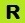

# Format support for Direct3D Feature Level 12.1 hardware

This section specifies the formats ([**DXGI_FORMAT_***](/windows/win32/api/dxgiformat/ne-dxgiformat-dxgi_format) values) that are supported in Direct3D Feature Level 12.1 hardware.

The table summarizes the feature support, using the following key.

| Symbol                            | Description                                                                   |
|-----------------------------------|-------------------------------------------------------------------------------|
| **-**                             | Disallowed or not available.                                                  |
|   | Hardware support is required.                                                 |
|   | Hardware support optional, the format may or may not be hardware accelerated. |
|  | Required if related optional feature is supported.                            |

This topic contains a section per format. A format *target* (the tables contain one row per target) can be a resource type, an HLSL intrinsic function, or a particular functionality that is dependent on a particular format.

To programmatically verify format support in D3D11 and D3D12, refer to [Checking hardware feature support](checking-hardware-feature-support.md).

> [!NOTE] 
> The numbers of the formats are mostly, but not all, in ascending numerical order&mdash;some are out of numerical order, and listed alongside other relevant formats. Note also that *typeless* in a format name can mean *partially* typed, and not strictly typeless (refer to the [Format notes](#format-notes) section at the end of the topic).

## DXGI_FORMAT_UNKNOWNL (0)
| Target | Support |
| - | - |
| Bits Per Element (BPE) | 0 |
| Format Support |  |
| Buffer |  |
| Input Assembler Vertex Buffer | \- |
| Input Assembler Index Buffer | \- |
| Stream Output Buffer | \- |
| Texture1D | \- |
| Texture2D | \- |
| Texture3D | \- |
| TextureCube | \- |
| Shader ld | \- |
| Shader sample (any filter) | \- |
| Shader sample_c (comparison filter) | \- |
| Shader sample (mono 1_bit_filter) | \- |
| Shader gather4 | \- |
| Shader gather4_c | \- |
| Mipmap | \- |
| Mipmap Auto- Generation | \- |
| RenderTarget | \- |
| Blendable RenderTarget | \- |
| Output Merger Logic Op | \- |
| Depth/Stencil Target | \- |
| Raw UAV and SRV | \- |
| Structured UAV and SRV |  |
| Typed UAV | \- |
| UAV Typed Store | \- |
| UAV Typed Load | \- |
| UAV Atomic Add | \- |
| UAV Atomic Bitwise Ops | \- |
| UAV Atomic Cmp&Store/ Cmp&Exch | \- |
| UAV Atomic Exchange | \- |
| UAV Atomic Signed Min/Max | \- |
| UAV Atomic Unsigned Min/Max | \- |
| CPU Lockable |  |
| 4x Multisample RenderTarget | \- |
| 8x Multisample RenderTarget | \- |
| Other Multisample Count RT | \- |
| Multisample Resolve | \- |
| Multisample Load | \- |
| Display Scan-Out | \- |
| Cast Within Bit Layout | \- |
| Video Decoder Support | \- |
| Video Processor Input | \- |
| Video Processor Output | \- |
| Shared Resource | \- |
| BackBuffer Castable Even Fully Typed | \- |
| Tiled Resource |  |

## DXGI_FORMAT_R32G32B32A32_TYPELESSPCS (1)
| Target | Support |
| - | - |
| Bits Per Element (BPE) | 128 |
| Format Support |  |
| Buffer | \- |
| Input Assembler Vertex Buffer | \- |
| Input Assembler Index Buffer | \- |
| Stream Output Buffer | \- |
| Texture1D |  |
| Texture2D |  |
| Texture3D |  |
| TextureCube |  |
| Shader ld | \- |
| Shader sample (any filter) | \- |
| Shader sample_c (comparison filter) | \- |
| Shader sample (mono 1_bit_filter) | \- |
| Shader gather4 | \- |
| Shader gather4_c | \- |
| Mipmap |  |
| Mipmap Auto- Generation | \- |
| RenderTarget | \- |
| Blendable RenderTarget | \- |
| Output Merger Logic Op | \- |
| Depth/Stencil Target | \- |
| Raw UAV and SRV | \- |
| Structured UAV and SRV | \- |
| Typed UAV | \- |
| UAV Typed Store | \- |
| UAV Typed Load | \- |
| UAV Atomic Add | \- |
| UAV Atomic Bitwise Ops | \- |
| UAV Atomic Cmp&Store/ Cmp&Exch | \- |
| UAV Atomic Exchange | \- |
| UAV Atomic Signed Min/Max | \- |
| UAV Atomic Unsigned Min/Max | \- |
| CPU Lockable |  |
| 4x Multisample RenderTarget | \- |
| 8x Multisample RenderTarget | \- |
| Other Multisample Count RT | \- |
| Multisample Resolve | \- |
| Multisample Load | \- |
| Display Scan-Out | \- |
| Cast Within Bit Layout |  |
| Video Decoder Support | \- |
| Video Processor Input | \- |
| Video Processor Output | \- |
| Shared Resource |  |
| BackBuffer Castable Even Fully Typed | \- |
| Tiled Resource |  |

## DXGI_FORMAT_R32G32B32A32_FLOATFCS (2)
| Target | Support |
| - | - |
| Bits Per Element (BPE) | 128 |
| Format Support |  |
| Buffer |  |
| Input Assembler Vertex Buffer |  |
| Input Assembler Index Buffer | \- |
| Stream Output Buffer |  |
| Texture1D |  |
| Texture2D |  |
| Texture3D |  |
| TextureCube |  |
| Shader ld |  |
| Shader sample (any filter) |  |
| Shader sample_c (comparison filter) | \- |
| Shader sample (mono 1_bit_filter) | \- |
| Shader gather4 |  |
| Shader gather4_c | \- |
| Mipmap |  |
| Mipmap Auto- Generation |  |
| RenderTarget |  |
| Blendable RenderTarget |  |
| Output Merger Logic Op | \- |
| Depth/Stencil Target | \- |
| Raw UAV and SRV | \- |
| Structured UAV and SRV | \- |
| Typed UAV |  |
| UAV Typed Store |  |
| UAV Typed Load |  |
| UAV Atomic Add | \- |
| UAV Atomic Bitwise Ops | \- |
| UAV Atomic Cmp&Store/ Cmp&Exch | \- |
| UAV Atomic Exchange | \- |
| UAV Atomic Signed Min/Max | \- |
| UAV Atomic Unsigned Min/Max | \- |
| CPU Lockable |  |
| 4x Multisample RenderTarget |  |
| 8x Multisample RenderTarget |  |
| Other Multisample Count RT |  |
| Multisample Resolve |  |
| Multisample Load |  |
| Display Scan-Out | \- |
| Cast Within Bit Layout |  |
| Video Decoder Support | \- |
| Video Processor Input | \- |
| Video Processor Output | \- |
| Shared Resource |  |
| BackBuffer Castable Even Fully Typed | \- |
| Tiled Resource |  |

## DXGI_FORMAT_R32G32B32A32_UINTFCS (3)
| Target | Support |
| - | - |
| Bits Per Element (BPE) | 128 |
| Format Support |  |
| Buffer |  |
| Input Assembler Vertex Buffer |  |
| Input Assembler Index Buffer | \- |
| Stream Output Buffer |  |
| Texture1D |  |
| Texture2D |  |
| Texture3D |  |
| TextureCube |  |
| Shader ld |  |
| Shader sample (any filter) | \- |
| Shader sample_c (comparison filter) | \- |
| Shader sample (mono 1_bit_filter) | \- |
| Shader gather4 | \- |
| Shader gather4_c | \- |
| Mipmap |  |
| Mipmap Auto- Generation | \- |
| RenderTarget |  |
| Blendable RenderTarget | \- |
| Output Merger Logic Op |  |
| Depth/Stencil Target | \- |
| Raw UAV and SRV | \- |
| Structured UAV and SRV | \- |
| Typed UAV |  |
| UAV Typed Store |  |
| UAV Typed Load |  |
| UAV Atomic Add | \- |
| UAV Atomic Bitwise Ops | \- |
| UAV Atomic Cmp&Store/ Cmp&Exch | \- |
| UAV Atomic Exchange | \- |
| UAV Atomic Signed Min/Max | \- |
| UAV Atomic Unsigned Min/Max | \- |
| CPU Lockable |  |
| 4x Multisample RenderTarget |  |
| 8x Multisample RenderTarget |  |
| Other Multisample Count RT |  |
| Multisample Resolve | \- |
| Multisample Load |  |
| Display Scan-Out | \- |
| Cast Within Bit Layout |  |
| Video Decoder Support | \- |
| Video Processor Input | \- |
| Video Processor Output | \- |
| Shared Resource |  |
| BackBuffer Castable Even Fully Typed | \- |
| Tiled Resource |  |

## DXGI_FORMAT_R32G32B32A32_SINTFCS (4)
| Target | Support |
| - | - |
| Bits Per Element (BPE) | 128 |
| Format Support |  |
| Buffer |  |
| Input Assembler Vertex Buffer |  |
| Input Assembler Index Buffer | \- |
| Stream Output Buffer |  |
| Texture1D |  |
| Texture2D |  |
| Texture3D |  |
| TextureCube |  |
| Shader ld |  |
| Shader sample (any filter) | \- |
| Shader sample_c (comparison filter) | \- |
| Shader sample (mono 1_bit_filter) | \- |
| Shader gather4 | \- |
| Shader gather4_c | \- |
| Mipmap |  |
| Mipmap Auto- Generation | \- |
| RenderTarget |  |
| Blendable RenderTarget | \- |
| Output Merger Logic Op | \- |
| Depth/Stencil Target | \- |
| Raw UAV and SRV | \- |
| Structured UAV and SRV | \- |
| Typed UAV |  |
| UAV Typed Store |  |
| UAV Typed Load |  |
| UAV Atomic Add | \- |
| UAV Atomic Bitwise Ops | \- |
| UAV Atomic Cmp&Store/ Cmp&Exch | \- |
| UAV Atomic Exchange | \- |
| UAV Atomic Signed Min/Max | \- |
| UAV Atomic Unsigned Min/Max | \- |
| CPU Lockable |  |
| 4x Multisample RenderTarget |  |
| 8x Multisample RenderTarget |  |
| Other Multisample Count RT |  |
| Multisample Resolve | \- |
| Multisample Load |  |
| Display Scan-Out | \- |
| Cast Within Bit Layout |  |
| Video Decoder Support | \- |
| Video Processor Input | \- |
| Video Processor Output | \- |
| Shared Resource |  |
| BackBuffer Castable Even Fully Typed | \- |
| Tiled Resource |  |

## DXGI_FORMAT_R32G32B32_TYPELESSPCS (5)
| Target | Support |
| - | - |
| Bits Per Element (BPE) | 96 |
| Format Support |  |
| Buffer | \- |
| Input Assembler Vertex Buffer | \- |
| Input Assembler Index Buffer | \- |
| Stream Output Buffer | \- |
| Texture1D |  |
| Texture2D |  |
| Texture3D |  |
| TextureCube |  |
| Shader ld | \- |
| Shader sample (any filter) | \- |
| Shader sample_c (comparison filter) | \- |
| Shader sample (mono 1_bit_filter) | \- |
| Shader gather4 | \- |
| Shader gather4_c | \- |
| Mipmap |  |
| Mipmap Auto- Generation | \- |
| RenderTarget | \- |
| Blendable RenderTarget | \- |
| Output Merger Logic Op | \- |
| Depth/Stencil Target | \- |
| Raw UAV and SRV | \- |
| Structured UAV and SRV | \- |
| Typed UAV | \- |
| UAV Typed Store | \- |
| UAV Typed Load | \- |
| UAV Atomic Add | \- |
| UAV Atomic Bitwise Ops | \- |
| UAV Atomic Cmp&Store/ Cmp&Exch | \- |
| UAV Atomic Exchange | \- |
| UAV Atomic Signed Min/Max | \- |
| UAV Atomic Unsigned Min/Max | \- |
| CPU Lockable |  |
| 4x Multisample RenderTarget | \- |
| 8x Multisample RenderTarget | \- |
| Other Multisample Count RT | \- |
| Multisample Resolve | \- |
| Multisample Load | \- |
| Display Scan-Out | \- |
| Cast Within Bit Layout |  |
| Video Decoder Support | \- |
| Video Processor Input | \- |
| Video Processor Output | \- |
| Shared Resource | \- |
| BackBuffer Castable Even Fully Typed | \- |
| Tiled Resource | \- |

## DXGI_FORMAT_R32G32B32_FLOATFCS (6)
| Target | Support |
| - | - |
| Bits Per Element (BPE) | 96 |
| Format Support |  |
| Buffer |  |
| Input Assembler Vertex Buffer |  |
| Input Assembler Index Buffer | \- |
| Stream Output Buffer |  |
| Texture1D |  |
| Texture2D |  |
| Texture3D |  |
| TextureCube |  |
| Shader ld |  |
| Shader sample (any filter) |  |
| Shader sample_c (comparison filter) | \- |
| Shader sample (mono 1_bit_filter) | \- |
| Shader gather4 |  |
| Shader gather4_c | \- |
| Mipmap |  |
| Mipmap Auto- Generation |  |
| RenderTarget |  |
| Blendable RenderTarget |  |
| Output Merger Logic Op | \- |
| Depth/Stencil Target | \- |
| Raw UAV and SRV | \- |
| Structured UAV and SRV | \- |
| Typed UAV | \- |
| UAV Typed Store | \- |
| UAV Typed Load | \- |
| UAV Atomic Add | \- |
| UAV Atomic Bitwise Ops | \- |
| UAV Atomic Cmp&Store/ Cmp&Exch | \- |
| UAV Atomic Exchange | \- |
| UAV Atomic Signed Min/Max | \- |
| UAV Atomic Unsigned Min/Max | \- |
| CPU Lockable |  |
| 4x Multisample RenderTarget |  |
| 8x Multisample RenderTarget |  |
| Other Multisample Count RT |  |
| Multisample Resolve |  |
| Multisample Load |  |
| Display Scan-Out | \- |
| Cast Within Bit Layout |  |
| Video Decoder Support | \- |
| Video Processor Input | \- |
| Video Processor Output | \- |
| Shared Resource | \- |
| BackBuffer Castable Even Fully Typed | \- |
| Tiled Resource | \- |

## DXGI_FORMAT_R32G32B32_UINTFCS (7)
| Target | Support |
| - | - |
| Bits Per Element (BPE) | 96 |
| Format Support |  |
| Buffer |  |
| Input Assembler Vertex Buffer |  |
| Input Assembler Index Buffer | \- |
| Stream Output Buffer |  |
| Texture1D |  |
| Texture2D |  |
| Texture3D |  |
| TextureCube |  |
| Shader ld |  |
| Shader sample (any filter) | \- |
| Shader sample_c (comparison filter) | \- |
| Shader sample (mono 1_bit_filter) | \- |
| Shader gather4 | \- |
| Shader gather4_c | \- |
| Mipmap |  |
| Mipmap Auto- Generation | \- |
| RenderTarget |  |
| Blendable RenderTarget | \- |
| Output Merger Logic Op |  |
| Depth/Stencil Target | \- |
| Raw UAV and SRV | \- |
| Structured UAV and SRV | \- |
| Typed UAV | \- |
| UAV Typed Store | \- |
| UAV Typed Load | \- |
| UAV Atomic Add | \- |
| UAV Atomic Bitwise Ops | \- |
| UAV Atomic Cmp&Store/ Cmp&Exch | \- |
| UAV Atomic Exchange | \- |
| UAV Atomic Signed Min/Max | \- |
| UAV Atomic Unsigned Min/Max | \- |
| CPU Lockable |  |
| 4x Multisample RenderTarget |  |
| 8x Multisample RenderTarget |  |
| Other Multisample Count RT |  |
| Multisample Resolve | \- |
| Multisample Load |  |
| Display Scan-Out | \- |
| Cast Within Bit Layout |  |
| Video Decoder Support | \- |
| Video Processor Input | \- |
| Video Processor Output | \- |
| Shared Resource | \- |
| BackBuffer Castable Even Fully Typed | \- |
| Tiled Resource | \- |

## DXGI_FORMAT_R32G32B32_SINTFCS (8)
| Target | Support |
| - | - |
| Bits Per Element (BPE) | 96 |
| Format Support |  |
| Buffer |  |
| Input Assembler Vertex Buffer |  |
| Input Assembler Index Buffer | \- |
| Stream Output Buffer |  |
| Texture1D |  |
| Texture2D |  |
| Texture3D |  |
| TextureCube |  |
| Shader ld |  |
| Shader sample (any filter) | \- |
| Shader sample_c (comparison filter) | \- |
| Shader sample (mono 1_bit_filter) | \- |
| Shader gather4 | \- |
| Shader gather4_c | \- |
| Mipmap |  |
| Mipmap Auto- Generation | \- |
| RenderTarget |  |
| Blendable RenderTarget | \- |
| Output Merger Logic Op | \- |
| Depth/Stencil Target | \- |
| Raw UAV and SRV | \- |
| Structured UAV and SRV | \- |
| Typed UAV | \- |
| UAV Typed Store | \- |
| UAV Typed Load | \- |
| UAV Atomic Add | \- |
| UAV Atomic Bitwise Ops | \- |
| UAV Atomic Cmp&Store/ Cmp&Exch | \- |
| UAV Atomic Exchange | \- |
| UAV Atomic Signed Min/Max | \- |
| UAV Atomic Unsigned Min/Max | \- |
| CPU Lockable |  |
| 4x Multisample RenderTarget |  |
| 8x Multisample RenderTarget |  |
| Other Multisample Count RT |  |
| Multisample Resolve | \- |
| Multisample Load |  |
| Display Scan-Out | \- |
| Cast Within Bit Layout |  |
| Video Decoder Support | \- |
| Video Processor Input | \- |
| Video Processor Output | \- |
| Shared Resource | \- |
| BackBuffer Castable Even Fully Typed | \- |
| Tiled Resource | \- |

## DXGI_FORMAT_R16G16B16A16_TYPELESSPCS (9)
| Target | Support |
| - | - |
| Bits Per Element (BPE) | 64 |
| Format Support |  |
| Buffer | \- |
| Input Assembler Vertex Buffer | \- |
| Input Assembler Index Buffer | \- |
| Stream Output Buffer | \- |
| Texture1D |  |
| Texture2D |  |
| Texture3D |  |
| TextureCube |  |
| Shader ld | \- |
| Shader sample (any filter) | \- |
| Shader sample_c (comparison filter) | \- |
| Shader sample (mono 1_bit_filter) | \- |
| Shader gather4 | \- |
| Shader gather4_c | \- |
| Mipmap |  |
| Mipmap Auto- Generation | \- |
| RenderTarget | \- |
| Blendable RenderTarget | \- |
| Output Merger Logic Op | \- |
| Depth/Stencil Target | \- |
| Raw UAV and SRV | \- |
| Structured UAV and SRV | \- |
| Typed UAV | \- |
| UAV Typed Store | \- |
| UAV Typed Load | \- |
| UAV Atomic Add | \- |
| UAV Atomic Bitwise Ops | \- |
| UAV Atomic Cmp&Store/ Cmp&Exch | \- |
| UAV Atomic Exchange | \- |
| UAV Atomic Signed Min/Max | \- |
| UAV Atomic Unsigned Min/Max | \- |
| CPU Lockable |  |
| 4x Multisample RenderTarget | \- |
| 8x Multisample RenderTarget | \- |
| Other Multisample Count RT | \- |
| Multisample Resolve | \- |
| Multisample Load | \- |
| Display Scan-Out | \- |
| Cast Within Bit Layout |  |
| Video Decoder Support | \- |
| Video Processor Input | \- |
| Video Processor Output | \- |
| Shared Resource |  |
| BackBuffer Castable Even Fully Typed | \- |
| Tiled Resource |  |

## DXGI_FORMAT_R16G16B16A16_FLOATFCS (10)
| Target | Support |
| - | - |
| Bits Per Element (BPE) | 64 |
| Format Support |  |
| Buffer |  |
| Input Assembler Vertex Buffer |  |
| Input Assembler Index Buffer | \- |
| Stream Output Buffer | \- |
| Texture1D |  |
| Texture2D |  |
| Texture3D |  |
| TextureCube |  |
| Shader ld |  |
| Shader sample (any filter) |  |
| Shader sample_c (comparison filter) | \- |
| Shader sample (mono 1_bit_filter) | \- |
| Shader gather4 |  |
| Shader gather4_c | \- |
| Mipmap |  |
| Mipmap Auto- Generation |  |
| RenderTarget |  |
| Blendable RenderTarget |  |
| Output Merger Logic Op | \- |
| Depth/Stencil Target | \- |
| Raw UAV and SRV | \- |
| Structured UAV and SRV | \- |
| Typed UAV |  |
| UAV Typed Store |  |
| UAV Typed Load |  |
| UAV Atomic Add | \- |
| UAV Atomic Bitwise Ops | \- |
| UAV Atomic Cmp&Store/ Cmp&Exch | \- |
| UAV Atomic Exchange | \- |
| UAV Atomic Signed Min/Max | \- |
| UAV Atomic Unsigned Min/Max | \- |
| CPU Lockable |  |
| 4x Multisample RenderTarget |  |
| 8x Multisample RenderTarget |  |
| Other Multisample Count RT |  |
| Multisample Resolve |  |
| Multisample Load |  |
| Display Scan-Out |  |
| Cast Within Bit Layout |  |
| Video Decoder Support | \- |
| Video Processor Input |  |
| Video Processor Output |  |
| Shared Resource |  |
| BackBuffer Castable Even Fully Typed | \- |
| Tiled Resource |  |

## DXGI_FORMAT_R16G16B16A16_UNORMFCS (11)
| Target | Support |
| - | - |
| Bits Per Element (BPE) | 64 |
| Format Support |  |
| Buffer |  |
| Input Assembler Vertex Buffer |  |
| Input Assembler Index Buffer | \- |
| Stream Output Buffer | \- |
| Texture1D |  |
| Texture2D |  |
| Texture3D |  |
| TextureCube |  |
| Shader ld |  |
| Shader sample (any filter) |  |
| Shader sample_c (comparison filter) | \- |
| Shader sample (mono 1_bit_filter) | \- |
| Shader gather4 |  |
| Shader gather4_c | \- |
| Mipmap |  |
| Mipmap Auto- Generation |  |
| RenderTarget |  |
| Blendable RenderTarget |  |
| Output Merger Logic Op | \- |
| Depth/Stencil Target | \- |
| Raw UAV and SRV | \- |
| Structured UAV and SRV | \- |
| Typed UAV |  |
| UAV Typed Store |  |
| UAV Typed Load |  |
| UAV Atomic Add | \- |
| UAV Atomic Bitwise Ops | \- |
| UAV Atomic Cmp&Store/ Cmp&Exch | \- |
| UAV Atomic Exchange | \- |
| UAV Atomic Signed Min/Max | \- |
| UAV Atomic Unsigned Min/Max | \- |
| CPU Lockable |  |
| 4x Multisample RenderTarget |  |
| 8x Multisample RenderTarget |  |
| Other Multisample Count RT |  |
| Multisample Resolve |  |
| Multisample Load |  |
| Display Scan-Out | \- |
| Cast Within Bit Layout |  |
| Video Decoder Support | \- |
| Video Processor Input | \- |
| Video Processor Output | \- |
| Shared Resource |  |
| BackBuffer Castable Even Fully Typed | \- |
| Tiled Resource |  |

## DXGI_FORMAT_R16G16B16A16_UINTFCS (12)
| Target | Support |
| - | - |
| Bits Per Element (BPE) | 64 |
| Format Support |  |
| Buffer |  |
| Input Assembler Vertex Buffer |  |
| Input Assembler Index Buffer | \- |
| Stream Output Buffer | \- |
| Texture1D |  |
| Texture2D |  |
| Texture3D |  |
| TextureCube |  |
| Shader ld |  |
| Shader sample (any filter) | \- |
| Shader sample_c (comparison filter) | \- |
| Shader sample (mono 1_bit_filter) | \- |
| Shader gather4 | \- |
| Shader gather4_c | \- |
| Mipmap |  |
| Mipmap Auto- Generation | \- |
| RenderTarget |  |
| Blendable RenderTarget | \- |
| Output Merger Logic Op |  |
| Depth/Stencil Target | \- |
| Raw UAV and SRV | \- |
| Structured UAV and SRV | \- |
| Typed UAV |  |
| UAV Typed Store |  |
| UAV Typed Load |  |
| UAV Atomic Add | \- |
| UAV Atomic Bitwise Ops | \- |
| UAV Atomic Cmp&Store/ Cmp&Exch | \- |
| UAV Atomic Exchange | \- |
| UAV Atomic Signed Min/Max | \- |
| UAV Atomic Unsigned Min/Max | \- |
| CPU Lockable |  |
| 4x Multisample RenderTarget |  |
| 8x Multisample RenderTarget |  |
| Other Multisample Count RT |  |
| Multisample Resolve | \- |
| Multisample Load |  |
| Display Scan-Out | \- |
| Cast Within Bit Layout |  |
| Video Decoder Support | \- |
| Video Processor Input | \- |
| Video Processor Output | \- |
| Shared Resource |  |
| BackBuffer Castable Even Fully Typed | \- |
| Tiled Resource |  |

## DXGI_FORMAT_R16G16B16A16_SNORMFCS (13)
| Target | Support |
| - | - |
| Bits Per Element (BPE) | 64 |
| Format Support |  |
| Buffer |  |
| Input Assembler Vertex Buffer |  |
| Input Assembler Index Buffer | \- |
| Stream Output Buffer | \- |
| Texture1D |  |
| Texture2D |  |
| Texture3D |  |
| TextureCube |  |
| Shader ld |  |
| Shader sample (any filter) |  |
| Shader sample_c (comparison filter) | \- |
| Shader sample (mono 1_bit_filter) | \- |
| Shader gather4 |  |
| Shader gather4_c | \- |
| Mipmap |  |
| Mipmap Auto- Generation |  |
| RenderTarget |  |
| Blendable RenderTarget |  |
| Output Merger Logic Op | \- |
| Depth/Stencil Target | \- |
| Raw UAV and SRV | \- |
| Structured UAV and SRV | \- |
| Typed UAV |  |
| UAV Typed Store |  |
| UAV Typed Load |  |
| UAV Atomic Add | \- |
| UAV Atomic Bitwise Ops | \- |
| UAV Atomic Cmp&Store/ Cmp&Exch | \- |
| UAV Atomic Exchange | \- |
| UAV Atomic Signed Min/Max | \- |
| UAV Atomic Unsigned Min/Max | \- |
| CPU Lockable |  |
| 4x Multisample RenderTarget |  |
| 8x Multisample RenderTarget |  |
| Other Multisample Count RT |  |
| Multisample Resolve |  |
| Multisample Load |  |
| Display Scan-Out | \- |
| Cast Within Bit Layout |  |
| Video Decoder Support | \- |
| Video Processor Input | \- |
| Video Processor Output | \- |
| Shared Resource |  |
| BackBuffer Castable Even Fully Typed | \- |
| Tiled Resource |  |

## DXGI_FORMAT_R16G16B16A16_SINTFCS (14)
| Target | Support |
| - | - |
| Bits Per Element (BPE) | 64 |
| Format Support |  |
| Buffer |  |
| Input Assembler Vertex Buffer |  |
| Input Assembler Index Buffer | \- |
| Stream Output Buffer | \- |
| Texture1D |  |
| Texture2D |  |
| Texture3D |  |
| TextureCube |  |
| Shader ld |  |
| Shader sample (any filter) | \- |
| Shader sample_c (comparison filter) | \- |
| Shader sample (mono 1_bit_filter) | \- |
| Shader gather4 | \- |
| Shader gather4_c | \- |
| Mipmap |  |
| Mipmap Auto- Generation | \- |
| RenderTarget |  |
| Blendable RenderTarget | \- |
| Output Merger Logic Op | \- |
| Depth/Stencil Target | \- |
| Raw UAV and SRV | \- |
| Structured UAV and SRV | \- |
| Typed UAV |  |
| UAV Typed Store |  |
| UAV Typed Load |  |
| UAV Atomic Add | \- |
| UAV Atomic Bitwise Ops | \- |
| UAV Atomic Cmp&Store/ Cmp&Exch | \- |
| UAV Atomic Exchange | \- |
| UAV Atomic Signed Min/Max | \- |
| UAV Atomic Unsigned Min/Max | \- |
| CPU Lockable |  |
| 4x Multisample RenderTarget |  |
| 8x Multisample RenderTarget |  |
| Other Multisample Count RT |  |
| Multisample Resolve | \- |
| Multisample Load |  |
| Display Scan-Out | \- |
| Cast Within Bit Layout |  |
| Video Decoder Support | \- |
| Video Processor Input | \- |
| Video Processor Output | \- |
| Shared Resource |  |
| BackBuffer Castable Even Fully Typed | \- |
| Tiled Resource |  |

## DXGI_FORMAT_R32G32_TYPELESSPCS (15)
| Target | Support |
| - | - |
| Bits Per Element (BPE) | 64 |
| Format Support |  |
| Buffer | \- |
| Input Assembler Vertex Buffer | \- |
| Input Assembler Index Buffer | \- |
| Stream Output Buffer | \- |
| Texture1D |  |
| Texture2D |  |
| Texture3D |  |
| TextureCube |  |
| Shader ld | \- |
| Shader sample (any filter) | \- |
| Shader sample_c (comparison filter) | \- |
| Shader sample (mono 1_bit_filter) | \- |
| Shader gather4 | \- |
| Shader gather4_c | \- |
| Mipmap |  |
| Mipmap Auto- Generation | \- |
| RenderTarget | \- |
| Blendable RenderTarget | \- |
| Output Merger Logic Op | \- |
| Depth/Stencil Target | \- |
| Raw UAV and SRV | \- |
| Structured UAV and SRV | \- |
| Typed UAV | \- |
| UAV Typed Store | \- |
| UAV Typed Load | \- |
| UAV Atomic Add | \- |
| UAV Atomic Bitwise Ops | \- |
| UAV Atomic Cmp&Store/ Cmp&Exch | \- |
| UAV Atomic Exchange | \- |
| UAV Atomic Signed Min/Max | \- |
| UAV Atomic Unsigned Min/Max | \- |
| CPU Lockable |  |
| 4x Multisample RenderTarget | \- |
| 8x Multisample RenderTarget | \- |
| Other Multisample Count RT | \- |
| Multisample Resolve | \- |
| Multisample Load | \- |
| Display Scan-Out | \- |
| Cast Within Bit Layout |  |
| Video Decoder Support | \- |
| Video Processor Input | \- |
| Video Processor Output | \- |
| Shared Resource | \- |
| BackBuffer Castable Even Fully Typed | \- |
| Tiled Resource |  |

## DXGI_FORMAT_R32G32_FLOATFCS (16)
| Target | Support |
| - | - |
| Bits Per Element (BPE) | 64 |
| Format Support |  |
| Buffer |  |
| Input Assembler Vertex Buffer |  |
| Input Assembler Index Buffer | \- |
| Stream Output Buffer |  |
| Texture1D |  |
| Texture2D |  |
| Texture3D |  |
| TextureCube |  |
| Shader ld |  |
| Shader sample (any filter) |  |
| Shader sample_c (comparison filter) | \- |
| Shader sample (mono 1_bit_filter) | \- |
| Shader gather4 |  |
| Shader gather4_c | \- |
| Mipmap |  |
| Mipmap Auto- Generation |  |
| RenderTarget |  |
| Blendable RenderTarget |  |
| Output Merger Logic Op | \- |
| Depth/Stencil Target | \- |
| Raw UAV and SRV | \- |
| Structured UAV and SRV | \- |
| Typed UAV |  |
| UAV Typed Store |  |
| UAV Typed Load |  |
| UAV Atomic Add | \- |
| UAV Atomic Bitwise Ops | \- |
| UAV Atomic Cmp&Store/ Cmp&Exch | \- |
| UAV Atomic Exchange | \- |
| UAV Atomic Signed Min/Max | \- |
| UAV Atomic Unsigned Min/Max | \- |
| CPU Lockable |  |
| 4x Multisample RenderTarget |  |
| 8x Multisample RenderTarget |  |
| Other Multisample Count RT |  |
| Multisample Resolve |  |
| Multisample Load |  |
| Display Scan-Out | \- |
| Cast Within Bit Layout |  |
| Video Decoder Support | \- |
| Video Processor Input | \- |
| Video Processor Output | \- |
| Shared Resource | \- |
| BackBuffer Castable Even Fully Typed | \- |
| Tiled Resource |  |

## DXGI_FORMAT_R32G32_UINTFCS (17)
| Target | Support |
| - | - |
| Bits Per Element (BPE) | 64 |
| Format Support |  |
| Buffer |  |
| Input Assembler Vertex Buffer |  |
| Input Assembler Index Buffer | \- |
| Stream Output Buffer |  |
| Texture1D |  |
| Texture2D |  |
| Texture3D |  |
| TextureCube |  |
| Shader ld |  |
| Shader sample (any filter) | \- |
| Shader sample_c (comparison filter) | \- |
| Shader sample (mono 1_bit_filter) | \- |
| Shader gather4 | \- |
| Shader gather4_c | \- |
| Mipmap |  |
| Mipmap Auto- Generation | \- |
| RenderTarget |  |
| Blendable RenderTarget | \- |
| Output Merger Logic Op |  |
| Depth/Stencil Target | \- |
| Raw UAV and SRV | \- |
| Structured UAV and SRV | \- |
| Typed UAV |  |
| UAV Typed Store |  |
| UAV Typed Load |  |
| UAV Atomic Add | \- |
| UAV Atomic Bitwise Ops | \- |
| UAV Atomic Cmp&Store/ Cmp&Exch | \- |
| UAV Atomic Exchange | \- |
| UAV Atomic Signed Min/Max | \- |
| UAV Atomic Unsigned Min/Max | \- |
| CPU Lockable |  |
| 4x Multisample RenderTarget |  |
| 8x Multisample RenderTarget |  |
| Other Multisample Count RT |  |
| Multisample Resolve | \- |
| Multisample Load |  |
| Display Scan-Out | \- |
| Cast Within Bit Layout |  |
| Video Decoder Support | \- |
| Video Processor Input | \- |
| Video Processor Output | \- |
| Shared Resource | \- |
| BackBuffer Castable Even Fully Typed | \- |
| Tiled Resource |  |

## DXGI_FORMAT_R32G32_SINTFCS (18)
| Target | Support |
| - | - |
| Bits Per Element (BPE) | 64 |
| Format Support |  |
| Buffer |  |
| Input Assembler Vertex Buffer |  |
| Input Assembler Index Buffer | \- |
| Stream Output Buffer |  |
| Texture1D |  |
| Texture2D |  |
| Texture3D |  |
| TextureCube |  |
| Shader ld |  |
| Shader sample (any filter) | \- |
| Shader sample_c (comparison filter) | \- |
| Shader sample (mono 1_bit_filter) | \- |
| Shader gather4 | \- |
| Shader gather4_c | \- |
| Mipmap |  |
| Mipmap Auto- Generation | \- |
| RenderTarget |  |
| Blendable RenderTarget | \- |
| Output Merger Logic Op | \- |
| Depth/Stencil Target | \- |
| Raw UAV and SRV | \- |
| Structured UAV and SRV | \- |
| Typed UAV |  |
| UAV Typed Store |  |
| UAV Typed Load |  |
| UAV Atomic Add | \- |
| UAV Atomic Bitwise Ops | \- |
| UAV Atomic Cmp&Store/ Cmp&Exch | \- |
| UAV Atomic Exchange | \- |
| UAV Atomic Signed Min/Max | \- |
| UAV Atomic Unsigned Min/Max | \- |
| CPU Lockable |  |
| 4x Multisample RenderTarget |  |
| 8x Multisample RenderTarget |  |
| Other Multisample Count RT |  |
| Multisample Resolve | \- |
| Multisample Load |  |
| Display Scan-Out | \- |
| Cast Within Bit Layout |  |
| Video Decoder Support | \- |
| Video Processor Input | \- |
| Video Processor Output | \- |
| Shared Resource | \- |
| BackBuffer Castable Even Fully Typed | \- |
| Tiled Resource |  |

## DXGI_FORMAT_R32G8X24_TYPELESSV (19)
| Target | Support |
| - | - |
| Bits Per Element (BPE) | 64 |
| Format Support |  |
| Buffer | \- |
| Input Assembler Vertex Buffer | \- |
| Input Assembler Index Buffer | \- |
| Stream Output Buffer | \- |
| Texture1D |  |
| Texture2D |  |
| Texture3D | \- |
| TextureCube |  |
| Shader ld | \- |
| Shader sample (any filter) | \- |
| Shader sample_c (comparison filter) | \- |
| Shader sample (mono 1_bit_filter) | \- |
| Shader gather4 | \- |
| Shader gather4_c | \- |
| Mipmap |  |
| Mipmap Auto- Generation | \- |
| RenderTarget | \- |
| Blendable RenderTarget | \- |
| Output Merger Logic Op | \- |
| Depth/Stencil Target | \- |
| Raw UAV and SRV | \- |
| Structured UAV and SRV | \- |
| Typed UAV | \- |
| UAV Typed Store | \- |
| UAV Typed Load | \- |
| UAV Atomic Add | \- |
| UAV Atomic Bitwise Ops | \- |
| UAV Atomic Cmp&Store/ Cmp&Exch | \- |
| UAV Atomic Exchange | \- |
| UAV Atomic Signed Min/Max | \- |
| UAV Atomic Unsigned Min/Max | \- |
| CPU Lockable |  |
| 4x Multisample RenderTarget | \- |
| 8x Multisample RenderTarget | \- |
| Other Multisample Count RT | \- |
| Multisample Resolve | \- |
| Multisample Load | \- |
| Display Scan-Out | \- |
| Cast Within Bit Layout |  |
| Video Decoder Support | \- |
| Video Processor Input | \- |
| Video Processor Output | \- |
| Shared Resource | \- |
| BackBuffer Castable Even Fully Typed | \- |
| Tiled Resource | \- |

## DXGI_FORMAT_D32_FLOAT_S8X24_UINTV (20)
| Target | Support |
| - | - |
| Bits Per Element (BPE) | 64 |
| Format Support |  |
| Buffer | \- |
| Input Assembler Vertex Buffer | \- |
| Input Assembler Index Buffer | \- |
| Stream Output Buffer | \- |
| Texture1D |  |
| Texture2D |  |
| Texture3D | \- |
| TextureCube |  |
| Shader ld | \- |
| Shader sample (any filter) | \- |
| Shader sample_c (comparison filter) | \- |
| Shader sample (mono 1_bit_filter) | \- |
| Shader gather4 | \- |
| Shader gather4_c | \- |
| Mipmap |  |
| Mipmap Auto- Generation | \- |
| RenderTarget | \- |
| Blendable RenderTarget | \- |
| Output Merger Logic Op | \- |
| Depth/Stencil Target |  |
| Raw UAV and SRV | \- |
| Structured UAV and SRV | \- |
| Typed UAV | \- |
| UAV Typed Store | \- |
| UAV Typed Load | \- |
| UAV Atomic Add | \- |
| UAV Atomic Bitwise Ops | \- |
| UAV Atomic Cmp&Store/ Cmp&Exch | \- |
| UAV Atomic Exchange | \- |
| UAV Atomic Signed Min/Max | \- |
| UAV Atomic Unsigned Min/Max | \- |
| CPU Lockable |  |
| 4x Multisample RenderTarget |  |
| 8x Multisample RenderTarget |  |
| Other Multisample Count RT |  |
| Multisample Resolve | \- |
| Multisample Load | \- |
| Display Scan-Out | \- |
| Cast Within Bit Layout |  |
| Video Decoder Support | \- |
| Video Processor Input | \- |
| Video Processor Output | \- |
| Shared Resource | \- |
| BackBuffer Castable Even Fully Typed | \- |
| Tiled Resource | \- |

## DXGI_FORMAT_R32_FLOAT_X8X24_TYPELESSV (21)
| Target | Support |
| - | - |
| Bits Per Element (BPE) | 64 |
| Format Support |  |
| Buffer | \- |
| Input Assembler Vertex Buffer | \- |
| Input Assembler Index Buffer | \- |
| Stream Output Buffer | \- |
| Texture1D |  |
| Texture2D |  |
| Texture3D | \- |
| TextureCube |  |
| Shader ld |  |
| Shader sample (any filter) |  |
| Shader sample_c (comparison filter) |  |
| Shader sample (mono 1_bit_filter) | \- |
| Shader gather4 |  |
| Shader gather4_c |  |
| Mipmap |  |
| Mipmap Auto- Generation | \- |
| RenderTarget | \- |
| Blendable RenderTarget | \- |
| Output Merger Logic Op | \- |
| Depth/Stencil Target | \- |
| Raw UAV and SRV | \- |
| Structured UAV and SRV | \- |
| Typed UAV | \- |
| UAV Typed Store | \- |
| UAV Typed Load | \- |
| UAV Atomic Add | \- |
| UAV Atomic Bitwise Ops | \- |
| UAV Atomic Cmp&Store/ Cmp&Exch | \- |
| UAV Atomic Exchange | \- |
| UAV Atomic Signed Min/Max | \- |
| UAV Atomic Unsigned Min/Max | \- |
| CPU Lockable |  |
| 4x Multisample RenderTarget | \- |
| 8x Multisample RenderTarget | \- |
| Other Multisample Count RT | \- |
| Multisample Resolve | \- |
| Multisample Load |  |
| Display Scan-Out | \- |
| Cast Within Bit Layout |  |
| Video Decoder Support | \- |
| Video Processor Input | \- |
| Video Processor Output | \- |
| Shared Resource | \- |
| BackBuffer Castable Even Fully Typed | \- |
| Tiled Resource | \- |

## DXGI_FORMAT_X32_TYPELESS_G8X24_UINTV (22)
| Target | Support |
| - | - |
| Bits Per Element (BPE) | 64 |
| Format Support |  |
| Buffer | \- |
| Input Assembler Vertex Buffer | \- |
| Input Assembler Index Buffer | \- |
| Stream Output Buffer | \- |
| Texture1D |  |
| Texture2D |  |
| Texture3D | \- |
| TextureCube |  |
| Shader ld |  |
| Shader sample (any filter) | \- |
| Shader sample_c (comparison filter) | \- |
| Shader sample (mono 1_bit_filter) | \- |
| Shader gather4 | \- |
| Shader gather4_c | \- |
| Mipmap |  |
| Mipmap Auto- Generation | \- |
| RenderTarget | \- |
| Blendable RenderTarget | \- |
| Output Merger Logic Op | \- |
| Depth/Stencil Target | \- |
| Raw UAV and SRV | \- |
| Structured UAV and SRV | \- |
| Typed UAV | \- |
| UAV Typed Store | \- |
| UAV Typed Load | \- |
| UAV Atomic Add | \- |
| UAV Atomic Bitwise Ops | \- |
| UAV Atomic Cmp&Store/ Cmp&Exch | \- |
| UAV Atomic Exchange | \- |
| UAV Atomic Signed Min/Max | \- |
| UAV Atomic Unsigned Min/Max | \- |
| CPU Lockable |  |
| 4x Multisample RenderTarget | \- |
| 8x Multisample RenderTarget | \- |
| Other Multisample Count RT | \- |
| Multisample Resolve | \- |
| Multisample Load |  |
| Display Scan-Out | \- |
| Cast Within Bit Layout |  |
| Video Decoder Support | \- |
| Video Processor Input | \- |
| Video Processor Output | \- |
| Shared Resource | \- |
| BackBuffer Castable Even Fully Typed | \- |
| Tiled Resource | \- |

## DXGI_FORMAT_R10G10B10A2_TYPELESSPCS (23)
| Target | Support |
| - | - |
| Bits Per Element (BPE) | 32 |
| Format Support |  |
| Buffer | \- |
| Input Assembler Vertex Buffer | \- |
| Input Assembler Index Buffer | \- |
| Stream Output Buffer | \- |
| Texture1D |  |
| Texture2D |  |
| Texture3D |  |
| TextureCube |  |
| Shader ld | \- |
| Shader sample (any filter) | \- |
| Shader sample_c (comparison filter) | \- |
| Shader sample (mono 1_bit_filter) | \- |
| Shader gather4 | \- |
| Shader gather4_c | \- |
| Mipmap |  |
| Mipmap Auto- Generation | \- |
| RenderTarget | \- |
| Blendable RenderTarget | \- |
| Output Merger Logic Op | \- |
| Depth/Stencil Target | \- |
| Raw UAV and SRV | \- |
| Structured UAV and SRV | \- |
| Typed UAV | \- |
| UAV Typed Store | \- |
| UAV Typed Load | \- |
| UAV Atomic Add | \- |
| UAV Atomic Bitwise Ops | \- |
| UAV Atomic Cmp&Store/ Cmp&Exch | \- |
| UAV Atomic Exchange | \- |
| UAV Atomic Signed Min/Max | \- |
| UAV Atomic Unsigned Min/Max | \- |
| CPU Lockable |  |
| 4x Multisample RenderTarget | \- |
| 8x Multisample RenderTarget | \- |
| Other Multisample Count RT | \- |
| Multisample Resolve | \- |
| Multisample Load | \- |
| Display Scan-Out | \- |
| Cast Within Bit Layout |  |
| Video Decoder Support | \- |
| Video Processor Input | \- |
| Video Processor Output | \- |
| Shared Resource |  |
| BackBuffer Castable Even Fully Typed | \- |
| Tiled Resource |  |

## DXGI_FORMAT_R10G10B10A2_UNORMFCS (24)
| Target | Support |
| - | - |
| Bits Per Element (BPE) | 32 |
| Format Support |  |
| Buffer |  |
| Input Assembler Vertex Buffer |  |
| Input Assembler Index Buffer | \- |
| Stream Output Buffer | \- |
| Texture1D |  |
| Texture2D |  |
| Texture3D |  |
| TextureCube |  |
| Shader ld |  |
| Shader sample (any filter) |  |
| Shader sample_c (comparison filter) | \- |
| Shader sample (mono 1_bit_filter) | \- |
| Shader gather4 |  |
| Shader gather4_c | \- |
| Mipmap |  |
| Mipmap Auto- Generation |  |
| RenderTarget |  |
| Blendable RenderTarget |  |
| Output Merger Logic Op | \- |
| Depth/Stencil Target | \- |
| Raw UAV and SRV | \- |
| Structured UAV and SRV | \- |
| Typed UAV |  |
| UAV Typed Store |  |
| UAV Typed Load |  |
| UAV Atomic Add | \- |
| UAV Atomic Bitwise Ops | \- |
| UAV Atomic Cmp&Store/ Cmp&Exch | \- |
| UAV Atomic Exchange | \- |
| UAV Atomic Signed Min/Max | \- |
| UAV Atomic Unsigned Min/Max | \- |
| CPU Lockable |  |
| 4x Multisample RenderTarget |  |
| 8x Multisample RenderTarget |  |
| Other Multisample Count RT |  |
| Multisample Resolve |  |
| Multisample Load |  |
| Display Scan-Out |  |
| Cast Within Bit Layout |  |
| Video Decoder Support | \- |
| Video Processor Input |  |
| Video Processor Output |  |
| Shared Resource |  |
| BackBuffer Castable Even Fully Typed |  |
| Tiled Resource |  |

## DXGI_FORMAT_R10G10B10A2_UINTFCS (25)
| Target | Support |
| - | - |
| Bits Per Element (BPE) | 32 |
| Format Support |  |
| Buffer |  |
| Input Assembler Vertex Buffer |  |
| Input Assembler Index Buffer | \- |
| Stream Output Buffer | \- |
| Texture1D |  |
| Texture2D |  |
| Texture3D |  |
| TextureCube |  |
| Shader ld |  |
| Shader sample (any filter) | \- |
| Shader sample_c (comparison filter) | \- |
| Shader sample (mono 1_bit_filter) | \- |
| Shader gather4 | \- |
| Shader gather4_c | \- |
| Mipmap |  |
| Mipmap Auto- Generation | \- |
| RenderTarget |  |
| Blendable RenderTarget | \- |
| Output Merger Logic Op |  |
| Depth/Stencil Target | \- |
| Raw UAV and SRV | \- |
| Structured UAV and SRV | \- |
| Typed UAV |  |
| UAV Typed Store |  |
| UAV Typed Load |  |
| UAV Atomic Add | \- |
| UAV Atomic Bitwise Ops | \- |
| UAV Atomic Cmp&Store/ Cmp&Exch | \- |
| UAV Atomic Exchange | \- |
| UAV Atomic Signed Min/Max | \- |
| UAV Atomic Unsigned Min/Max | \- |
| CPU Lockable |  |
| 4x Multisample RenderTarget |  |
| 8x Multisample RenderTarget |  |
| Other Multisample Count RT |  |
| Multisample Resolve | \- |
| Multisample Load |  |
| Display Scan-Out | \- |
| Cast Within Bit Layout |  |
| Video Decoder Support | \- |
| Video Processor Input | \- |
| Video Processor Output | \- |
| Shared Resource |  |
| BackBuffer Castable Even Fully Typed | \- |
| Tiled Resource |  |

## DXGI_FORMAT_R10G10B10_XR_BIAS_A2_UNORMFCS (89)
| Target | Support |
| - | - |
| Bits Per Element (BPE) | 32 |
| Format Support |  |
| Buffer | \- |
| Input Assembler Vertex Buffer | \- |
| Input Assembler Index Buffer | \- |
| Stream Output Buffer | \- |
| Texture1D | \- |
| Texture2D |  |
| Texture3D | \- |
| TextureCube | \- |
| Shader ld | \- |
| Shader sample (any filter) | \- |
| Shader sample_c (comparison filter) | \- |
| Shader sample (mono 1_bit_filter) | \- |
| Shader gather4 | \- |
| Shader gather4_c | \- |
| Mipmap | \- |
| Mipmap Auto- Generation | \- |
| RenderTarget | \- |
| Blendable RenderTarget | \- |
| Output Merger Logic Op | \- |
| Depth/Stencil Target | \- |
| Raw UAV and SRV | \- |
| Structured UAV and SRV | \- |
| Typed UAV | \- |
| UAV Typed Store | \- |
| UAV Typed Load | \- |
| UAV Atomic Add | \- |
| UAV Atomic Bitwise Ops | \- |
| UAV Atomic Cmp&Store/ Cmp&Exch | \- |
| UAV Atomic Exchange | \- |
| UAV Atomic Signed Min/Max | \- |
| UAV Atomic Unsigned Min/Max | \- |
| CPU Lockable |  |
| 4x Multisample RenderTarget | \- |
| 8x Multisample RenderTarget | \- |
| Other Multisample Count RT | \- |
| Multisample Resolve | \- |
| Multisample Load | \- |
| Display Scan-Out |  |
| Cast Within Bit Layout |  |
| Video Decoder Support | \- |
| Video Processor Input |  |
| Video Processor Output |  |
| Shared Resource |  |
| BackBuffer Castable Even Fully Typed |  |
| Tiled Resource |  |

## DXGI_FORMAT_R11G11B10_FLOATFNS (26)
| Target | Support |
| - | - |
| Bits Per Element (BPE) | 32 |
| Format Support |  |
| Buffer |  |
| Input Assembler Vertex Buffer |  |
| Input Assembler Index Buffer | \- |
| Stream Output Buffer | \- |
| Texture1D |  |
| Texture2D |  |
| Texture3D |  |
| TextureCube |  |
| Shader ld |  |
| Shader sample (any filter) |  |
| Shader sample_c (comparison filter) | \- |
| Shader sample (mono 1_bit_filter) | \- |
| Shader gather4 |  |
| Shader gather4_c | \- |
| Mipmap |  |
| Mipmap Auto- Generation |  |
| RenderTarget |  |
| Blendable RenderTarget |  |
| Output Merger Logic Op | \- |
| Depth/Stencil Target | \- |
| Raw UAV and SRV | \- |
| Structured UAV and SRV | \- |
| Typed UAV |  |
| UAV Typed Store |  |
| UAV Typed Load |  |
| UAV Atomic Add | \- |
| UAV Atomic Bitwise Ops | \- |
| UAV Atomic Cmp&Store/ Cmp&Exch | \- |
| UAV Atomic Exchange | \- |
| UAV Atomic Signed Min/Max | \- |
| UAV Atomic Unsigned Min/Max | \- |
| CPU Lockable |  |
| 4x Multisample RenderTarget |  |
| 8x Multisample RenderTarget |  |
| Other Multisample Count RT |  |
| Multisample Resolve |  |
| Multisample Load |  |
| Display Scan-Out | \- |
| Cast Within Bit Layout | \- |
| Video Decoder Support | \- |
| Video Processor Input | \- |
| Video Processor Output | \- |
| Shared Resource | \- |
| BackBuffer Castable Even Fully Typed | \- |
| Tiled Resource |  |

## DXGI_FORMAT_R8G8B8A8_TYPELESSPCS (27)
| Target | Support |
| - | - |
| Bits Per Element (BPE) | 32 |
| Format Support |  |
| Buffer | \- |
| Input Assembler Vertex Buffer | \- |
| Input Assembler Index Buffer | \- |
| Stream Output Buffer | \- |
| Texture1D |  |
| Texture2D |  |
| Texture3D |  |
| TextureCube |  |
| Shader ld | \- |
| Shader sample (any filter) | \- |
| Shader sample_c (comparison filter) | \- |
| Shader sample (mono 1_bit_filter) | \- |
| Shader gather4 | \- |
| Shader gather4_c | \- |
| Mipmap |  |
| Mipmap Auto- Generation | \- |
| RenderTarget | \- |
| Blendable RenderTarget | \- |
| Output Merger Logic Op | \- |
| Depth/Stencil Target | \- |
| Raw UAV and SRV | \- |
| Structured UAV and SRV | \- |
| Typed UAV | \- |
| UAV Typed Store | \- |
| UAV Typed Load | \- |
| UAV Atomic Add | \- |
| UAV Atomic Bitwise Ops | \- |
| UAV Atomic Cmp&Store/ Cmp&Exch | \- |
| UAV Atomic Exchange | \- |
| UAV Atomic Signed Min/Max | \- |
| UAV Atomic Unsigned Min/Max | \- |
| CPU Lockable |  |
| 4x Multisample RenderTarget | \- |
| 8x Multisample RenderTarget | \- |
| Other Multisample Count RT | \- |
| Multisample Resolve | \- |
| Multisample Load | \- |
| Display Scan-Out | \- |
| Cast Within Bit Layout |  |
| Video Decoder Support | \- |
| Video Processor Input | \- |
| Video Processor Output | \- |
| Shared Resource |  |
| BackBuffer Castable Even Fully Typed | \- |
| Tiled Resource |  |

## DXGI_FORMAT_R8G8B8A8_UNORMFCS (28)
| Target | Support |
| - | - |
| Bits Per Element (BPE) | 32 |
| Format Support |  |
| Buffer |  |
| Input Assembler Vertex Buffer |  |
| Input Assembler Index Buffer | \- |
| Stream Output Buffer | \- |
| Texture1D |  |
| Texture2D |  |
| Texture3D |  |
| TextureCube |  |
| Shader ld |  |
| Shader sample (any filter) |  |
| Shader sample_c (comparison filter) | \- |
| Shader sample (mono 1_bit_filter) | \- |
| Shader gather4 |  |
| Shader gather4_c | \- |
| Mipmap |  |
| Mipmap Auto- Generation |  |
| RenderTarget |  |
| Blendable RenderTarget |  |
| Output Merger Logic Op | \- |
| Depth/Stencil Target | \- |
| Raw UAV and SRV | \- |
| Structured UAV and SRV | \- |
| Typed UAV |  |
| UAV Typed Store |  |
| UAV Typed Load |  |
| UAV Atomic Add | \- |
| UAV Atomic Bitwise Ops | \- |
| UAV Atomic Cmp&Store/ Cmp&Exch | \- |
| UAV Atomic Exchange | \- |
| UAV Atomic Signed Min/Max | \- |
| UAV Atomic Unsigned Min/Max | \- |
| CPU Lockable |  |
| 4x Multisample RenderTarget |  |
| 8x Multisample RenderTarget |  |
| Other Multisample Count RT |  |
| Multisample Resolve |  |
| Multisample Load |  |
| Display Scan-Out |  |
| Cast Within Bit Layout |  |
| Video Decoder Support | \- |
| Video Processor Input |  |
| Video Processor Output |  |
| Shared Resource |  |
| BackBuffer Castable Even Fully Typed |  |
| Tiled Resource |  |

## DXGI_FORMAT_R8G8B8A8_UNORM_SRGBFCS (29)
| Target | Support |
| - | - |
| Bits Per Element (BPE) | 32 |
| Format Support |  |
| Buffer | \- |
| Input Assembler Vertex Buffer | \- |
| Input Assembler Index Buffer | \- |
| Stream Output Buffer | \- |
| Texture1D |  |
| Texture2D |  |
| Texture3D |  |
| TextureCube |  |
| Shader ld |  |
| Shader sample (any filter) |  |
| Shader sample_c (comparison filter) | \- |
| Shader sample (mono 1_bit_filter) | \- |
| Shader gather4 |  |
| Shader gather4_c | \- |
| Mipmap |  |
| Mipmap Auto- Generation |  |
| RenderTarget |  |
| Blendable RenderTarget |  |
| Output Merger Logic Op | \- |
| Depth/Stencil Target | \- |
| Raw UAV and SRV | \- |
| Structured UAV and SRV | \- |
| Typed UAV | \- |
| UAV Typed Store | \- |
| UAV Typed Load | \- |
| UAV Atomic Add | \- |
| UAV Atomic Bitwise Ops | \- |
| UAV Atomic Cmp&Store/ Cmp&Exch | \- |
| UAV Atomic Exchange | \- |
| UAV Atomic Signed Min/Max | \- |
| UAV Atomic Unsigned Min/Max | \- |
| CPU Lockable |  |
| 4x Multisample RenderTarget |  |
| 8x Multisample RenderTarget |  |
| Other Multisample Count RT |  |
| Multisample Resolve |  |
| Multisample Load |  |
| Display Scan-Out |  |
| Cast Within Bit Layout |  |
| Video Decoder Support | \- |
| Video Processor Input |  |
| Video Processor Output |  |
| Shared Resource |  |
| BackBuffer Castable Even Fully Typed |  |
| Tiled Resource |  |

## DXGI_FORMAT_R8G8B8A8_UINTFCS (30)
| Target | Support |
| - | - |
| Bits Per Element (BPE) | 32 |
| Format Support |  |
| Buffer |  |
| Input Assembler Vertex Buffer |  |
| Input Assembler Index Buffer | \- |
| Stream Output Buffer | \- |
| Texture1D |  |
| Texture2D |  |
| Texture3D |  |
| TextureCube |  |
| Shader ld |  |
| Shader sample (any filter) | \- |
| Shader sample_c (comparison filter) | \- |
| Shader sample (mono 1_bit_filter) | \- |
| Shader gather4 | \- |
| Shader gather4_c | \- |
| Mipmap |  |
| Mipmap Auto- Generation | \- |
| RenderTarget |  |
| Blendable RenderTarget | \- |
| Output Merger Logic Op |  |
| Depth/Stencil Target | \- |
| Raw UAV and SRV | \- |
| Structured UAV and SRV | \- |
| Typed UAV |  |
| UAV Typed Store |  |
| UAV Typed Load |  |
| UAV Atomic Add | \- |
| UAV Atomic Bitwise Ops | \- |
| UAV Atomic Cmp&Store/ Cmp&Exch | \- |
| UAV Atomic Exchange | \- |
| UAV Atomic Signed Min/Max | \- |
| UAV Atomic Unsigned Min/Max | \- |
| CPU Lockable |  |
| 4x Multisample RenderTarget |  |
| 8x Multisample RenderTarget |  |
| Other Multisample Count RT |  |
| Multisample Resolve | \- |
| Multisample Load |  |
| Display Scan-Out | \- |
| Cast Within Bit Layout |  |
| Video Decoder Support | \- |
| Video Processor Input | \- |
| Video Processor Output | \- |
| Shared Resource |  |
| BackBuffer Castable Even Fully Typed | \- |
| Tiled Resource |  |

## DXGI_FORMAT_R8G8B8A8_SNORMFCS (31)
| Target | Support |
| - | - |
| Bits Per Element (BPE) | 32 |
| Format Support |  |
| Buffer |  |
| Input Assembler Vertex Buffer |  |
| Input Assembler Index Buffer | \- |
| Stream Output Buffer | \- |
| Texture1D |  |
| Texture2D |  |
| Texture3D |  |
| TextureCube |  |
| Shader ld |  |
| Shader sample (any filter) |  |
| Shader sample_c (comparison filter) | \- |
| Shader sample (mono 1_bit_filter) | \- |
| Shader gather4 |  |
| Shader gather4_c | \- |
| Mipmap |  |
| Mipmap Auto- Generation |  |
| RenderTarget |  |
| Blendable RenderTarget |  |
| Output Merger Logic Op | \- |
| Depth/Stencil Target | \- |
| Raw UAV and SRV | \- |
| Structured UAV and SRV | \- |
| Typed UAV |  |
| UAV Typed Store |  |
| UAV Typed Load |  |
| UAV Atomic Add | \- |
| UAV Atomic Bitwise Ops | \- |
| UAV Atomic Cmp&Store/ Cmp&Exch | \- |
| UAV Atomic Exchange | \- |
| UAV Atomic Signed Min/Max | \- |
| UAV Atomic Unsigned Min/Max | \- |
| CPU Lockable |  |
| 4x Multisample RenderTarget |  |
| 8x Multisample RenderTarget |  |
| Other Multisample Count RT |  |
| Multisample Resolve |  |
| Multisample Load |  |
| Display Scan-Out | \- |
| Cast Within Bit Layout |  |
| Video Decoder Support | \- |
| Video Processor Input | \- |
| Video Processor Output | \- |
| Shared Resource |  |
| BackBuffer Castable Even Fully Typed | \- |
| Tiled Resource |  |

## DXGI_FORMAT_R8G8B8A8_SINTFCS (32)
| Target | Support |
| - | - |
| Bits Per Element (BPE) | 32 |
| Format Support |  |
| Buffer |  |
| Input Assembler Vertex Buffer |  |
| Input Assembler Index Buffer | \- |
| Stream Output Buffer | \- |
| Texture1D |  |
| Texture2D |  |
| Texture3D |  |
| TextureCube |  |
| Shader ld |  |
| Shader sample (any filter) | \- |
| Shader sample_c (comparison filter) | \- |
| Shader sample (mono 1_bit_filter) | \- |
| Shader gather4 | \- |
| Shader gather4_c | \- |
| Mipmap |  |
| Mipmap Auto- Generation | \- |
| RenderTarget |  |
| Blendable RenderTarget | \- |
| Output Merger Logic Op | \- |
| Depth/Stencil Target | \- |
| Raw UAV and SRV | \- |
| Structured UAV and SRV | \- |
| Typed UAV |  |
| UAV Typed Store |  |
| UAV Typed Load |  |
| UAV Atomic Add | \- |
| UAV Atomic Bitwise Ops | \- |
| UAV Atomic Cmp&Store/ Cmp&Exch | \- |
| UAV Atomic Exchange | \- |
| UAV Atomic Signed Min/Max | \- |
| UAV Atomic Unsigned Min/Max | \- |
| CPU Lockable |  |
| 4x Multisample RenderTarget |  |
| 8x Multisample RenderTarget |  |
| Other Multisample Count RT |  |
| Multisample Resolve | \- |
| Multisample Load |  |
| Display Scan-Out | \- |
| Cast Within Bit Layout |  |
| Video Decoder Support | \- |
| Video Processor Input | \- |
| Video Processor Output | \- |
| Shared Resource |  |
| BackBuffer Castable Even Fully Typed | \- |
| Tiled Resource |  |

## DXGI_FORMAT_R16G16_TYPELESSPCS (33)
| Target | Support |
| - | - |
| Bits Per Element (BPE) | 32 |
| Format Support |  |
| Buffer | \- |
| Input Assembler Vertex Buffer | \- |
| Input Assembler Index Buffer | \- |
| Stream Output Buffer | \- |
| Texture1D |  |
| Texture2D |  |
| Texture3D |  |
| TextureCube |  |
| Shader ld | \- |
| Shader sample (any filter) | \- |
| Shader sample_c (comparison filter) | \- |
| Shader sample (mono 1_bit_filter) | \- |
| Shader gather4 | \- |
| Shader gather4_c | \- |
| Mipmap |  |
| Mipmap Auto- Generation | \- |
| RenderTarget | \- |
| Blendable RenderTarget | \- |
| Output Merger Logic Op | \- |
| Depth/Stencil Target | \- |
| Raw UAV and SRV | \- |
| Structured UAV and SRV | \- |
| Typed UAV | \- |
| UAV Typed Store | \- |
| UAV Typed Load | \- |
| UAV Atomic Add | \- |
| UAV Atomic Bitwise Ops | \- |
| UAV Atomic Cmp&Store/ Cmp&Exch | \- |
| UAV Atomic Exchange | \- |
| UAV Atomic Signed Min/Max | \- |
| UAV Atomic Unsigned Min/Max | \- |
| CPU Lockable |  |
| 4x Multisample RenderTarget | \- |
| 8x Multisample RenderTarget | \- |
| Other Multisample Count RT | \- |
| Multisample Resolve | \- |
| Multisample Load | \- |
| Display Scan-Out | \- |
| Cast Within Bit Layout |  |
| Video Decoder Support | \- |
| Video Processor Input | \- |
| Video Processor Output | \- |
| Shared Resource | \- |
| BackBuffer Castable Even Fully Typed | \- |
| Tiled Resource |  |

## DXGI_FORMAT_R16G16_FLOATFCS (34)
| Target | Support |
| - | - |
| Bits Per Element (BPE) | 32 |
| Format Support |  |
| Buffer |  |
| Input Assembler Vertex Buffer |  |
| Input Assembler Index Buffer | \- |
| Stream Output Buffer | \- |
| Texture1D |  |
| Texture2D |  |
| Texture3D |  |
| TextureCube |  |
| Shader ld |  |
| Shader sample (any filter) |  |
| Shader sample_c (comparison filter) | \- |
| Shader sample (mono 1_bit_filter) | \- |
| Shader gather4 |  |
| Shader gather4_c | \- |
| Mipmap |  |
| Mipmap Auto- Generation |  |
| RenderTarget |  |
| Blendable RenderTarget |  |
| Output Merger Logic Op | \- |
| Depth/Stencil Target | \- |
| Raw UAV and SRV | \- |
| Structured UAV and SRV | \- |
| Typed UAV |  |
| UAV Typed Store |  |
| UAV Typed Load |  |
| UAV Atomic Add | \- |
| UAV Atomic Bitwise Ops | \- |
| UAV Atomic Cmp&Store/ Cmp&Exch | \- |
| UAV Atomic Exchange | \- |
| UAV Atomic Signed Min/Max | \- |
| UAV Atomic Unsigned Min/Max | \- |
| CPU Lockable |  |
| 4x Multisample RenderTarget |  |
| 8x Multisample RenderTarget |  |
| Other Multisample Count RT |  |
| Multisample Resolve |  |
| Multisample Load |  |
| Display Scan-Out | \- |
| Cast Within Bit Layout |  |
| Video Decoder Support | \- |
| Video Processor Input | \- |
| Video Processor Output | \- |
| Shared Resource | \- |
| BackBuffer Castable Even Fully Typed | \- |
| Tiled Resource |  |

## DXGI_FORMAT_R16G16_UNORMFCS (35)
| Target | Support |
| - | - |
| Bits Per Element (BPE) | 32 |
| Format Support |  |
| Buffer |  |
| Input Assembler Vertex Buffer |  |
| Input Assembler Index Buffer | \- |
| Stream Output Buffer | \- |
| Texture1D |  |
| Texture2D |  |
| Texture3D |  |
| TextureCube |  |
| Shader ld |  |
| Shader sample (any filter) |  |
| Shader sample_c (comparison filter) | \- |
| Shader sample (mono 1_bit_filter) | \- |
| Shader gather4 |  |
| Shader gather4_c | \- |
| Mipmap |  |
| Mipmap Auto- Generation |  |
| RenderTarget |  |
| Blendable RenderTarget |  |
| Output Merger Logic Op | \- |
| Depth/Stencil Target | \- |
| Raw UAV and SRV | \- |
| Structured UAV and SRV | \- |
| Typed UAV |  |
| UAV Typed Store |  |
| UAV Typed Load |  |
| UAV Atomic Add | \- |
| UAV Atomic Bitwise Ops | \- |
| UAV Atomic Cmp&Store/ Cmp&Exch | \- |
| UAV Atomic Exchange | \- |
| UAV Atomic Signed Min/Max | \- |
| UAV Atomic Unsigned Min/Max | \- |
| CPU Lockable |  |
| 4x Multisample RenderTarget |  |
| 8x Multisample RenderTarget |  |
| Other Multisample Count RT |  |
| Multisample Resolve |  |
| Multisample Load |  |
| Display Scan-Out | \- |
| Cast Within Bit Layout |  |
| Video Decoder Support | \- |
| Video Processor Input | \- |
| Video Processor Output | \- |
| Shared Resource | \- |
| BackBuffer Castable Even Fully Typed | \- |
| Tiled Resource |  |

## DXGI_FORMAT_R16G16_UINTFCS (36)
| Target | Support |
| - | - |
| Bits Per Element (BPE) | 32 |
| Format Support |  |
| Buffer |  |
| Input Assembler Vertex Buffer |  |
| Input Assembler Index Buffer | \- |
| Stream Output Buffer | \- |
| Texture1D |  |
| Texture2D |  |
| Texture3D |  |
| TextureCube |  |
| Shader ld |  |
| Shader sample (any filter) | \- |
| Shader sample_c (comparison filter) | \- |
| Shader sample (mono 1_bit_filter) | \- |
| Shader gather4 | \- |
| Shader gather4_c | \- |
| Mipmap |  |
| Mipmap Auto- Generation | \- |
| RenderTarget |  |
| Blendable RenderTarget | \- |
| Output Merger Logic Op |  |
| Depth/Stencil Target | \- |
| Raw UAV and SRV | \- |
| Structured UAV and SRV | \- |
| Typed UAV |  |
| UAV Typed Store |  |
| UAV Typed Load |  |
| UAV Atomic Add | \- |
| UAV Atomic Bitwise Ops | \- |
| UAV Atomic Cmp&Store/ Cmp&Exch | \- |
| UAV Atomic Exchange | \- |
| UAV Atomic Signed Min/Max | \- |
| UAV Atomic Unsigned Min/Max | \- |
| CPU Lockable |  |
| 4x Multisample RenderTarget |  |
| 8x Multisample RenderTarget |  |
| Other Multisample Count RT |  |
| Multisample Resolve | \- |
| Multisample Load |  |
| Display Scan-Out | \- |
| Cast Within Bit Layout |  |
| Video Decoder Support | \- |
| Video Processor Input | \- |
| Video Processor Output | \- |
| Shared Resource | \- |
| BackBuffer Castable Even Fully Typed | \- |
| Tiled Resource |  |

## DXGI_FORMAT_R16G16_SNORMFCS (37)
| Target | Support |
| - | - |
| Bits Per Element (BPE) | 32 |
| Format Support |  |
| Buffer |  |
| Input Assembler Vertex Buffer |  |
| Input Assembler Index Buffer | \- |
| Stream Output Buffer | \- |
| Texture1D |  |
| Texture2D |  |
| Texture3D |  |
| TextureCube |  |
| Shader ld |  |
| Shader sample (any filter) |  |
| Shader sample_c (comparison filter) | \- |
| Shader sample (mono 1_bit_filter) | \- |
| Shader gather4 |  |
| Shader gather4_c | \- |
| Mipmap |  |
| Mipmap Auto- Generation |  |
| RenderTarget |  |
| Blendable RenderTarget |  |
| Output Merger Logic Op | \- |
| Depth/Stencil Target | \- |
| Raw UAV and SRV | \- |
| Structured UAV and SRV | \- |
| Typed UAV |  |
| UAV Typed Store |  |
| UAV Typed Load |  |
| UAV Atomic Add | \- |
| UAV Atomic Bitwise Ops | \- |
| UAV Atomic Cmp&Store/ Cmp&Exch | \- |
| UAV Atomic Exchange | \- |
| UAV Atomic Signed Min/Max | \- |
| UAV Atomic Unsigned Min/Max | \- |
| CPU Lockable |  |
| 4x Multisample RenderTarget |  |
| 8x Multisample RenderTarget |  |
| Other Multisample Count RT |  |
| Multisample Resolve |  |
| Multisample Load |  |
| Display Scan-Out | \- |
| Cast Within Bit Layout |  |
| Video Decoder Support | \- |
| Video Processor Input | \- |
| Video Processor Output | \- |
| Shared Resource | \- |
| BackBuffer Castable Even Fully Typed | \- |
| Tiled Resource |  |

## DXGI_FORMAT_R16G16_SINTFCS (38)
| Target | Support |
| - | - |
| Bits Per Element (BPE) | 32 |
| Format Support |  |
| Buffer |  |
| Input Assembler Vertex Buffer |  |
| Input Assembler Index Buffer | \- |
| Stream Output Buffer | \- |
| Texture1D |  |
| Texture2D |  |
| Texture3D |  |
| TextureCube |  |
| Shader ld |  |
| Shader sample (any filter) | \- |
| Shader sample_c (comparison filter) | \- |
| Shader sample (mono 1_bit_filter) | \- |
| Shader gather4 | \- |
| Shader gather4_c | \- |
| Mipmap |  |
| Mipmap Auto- Generation | \- |
| RenderTarget |  |
| Blendable RenderTarget | \- |
| Output Merger Logic Op | \- |
| Depth/Stencil Target | \- |
| Raw UAV and SRV | \- |
| Structured UAV and SRV | \- |
| Typed UAV |  |
| UAV Typed Store |  |
| UAV Typed Load |  |
| UAV Atomic Add | \- |
| UAV Atomic Bitwise Ops | \- |
| UAV Atomic Cmp&Store/ Cmp&Exch | \- |
| UAV Atomic Exchange | \- |
| UAV Atomic Signed Min/Max | \- |
| UAV Atomic Unsigned Min/Max | \- |
| CPU Lockable |  |
| 4x Multisample RenderTarget |  |
| 8x Multisample RenderTarget |  |
| Other Multisample Count RT |  |
| Multisample Resolve | \- |
| Multisample Load |  |
| Display Scan-Out | \- |
| Cast Within Bit Layout |  |
| Video Decoder Support | \- |
| Video Processor Input | \- |
| Video Processor Output | \- |
| Shared Resource | \- |
| BackBuffer Castable Even Fully Typed | \- |
| Tiled Resource |  |

## DXGI_FORMAT_R32_TYPELESSPCS (39)
| Target | Support |
| - | - |
| Bits Per Element (BPE) | 32 |
| Format Support |  |
| Buffer | \- |
| Input Assembler Vertex Buffer | \- |
| Input Assembler Index Buffer | \- |
| Stream Output Buffer | \- |
| Texture1D |  |
| Texture2D |  |
| Texture3D |  |
| TextureCube |  |
| Shader ld | \- |
| Shader sample (any filter) | \- |
| Shader sample_c (comparison filter) | \- |
| Shader sample (mono 1_bit_filter) | \- |
| Shader gather4 | \- |
| Shader gather4_c | \- |
| Mipmap |  |
| Mipmap Auto- Generation | \- |
| RenderTarget | \- |
| Blendable RenderTarget | \- |
| Output Merger Logic Op | \- |
| Depth/Stencil Target | \- |
| Raw UAV and SRV |  |
| Structured UAV and SRV | \- |
| Typed UAV | \- |
| UAV Typed Store | \- |
| UAV Typed Load | \- |
| UAV Atomic Add | \- |
| UAV Atomic Bitwise Ops | \- |
| UAV Atomic Cmp&Store/ Cmp&Exch | \- |
| UAV Atomic Exchange | \- |
| UAV Atomic Signed Min/Max | \- |
| UAV Atomic Unsigned Min/Max | \- |
| CPU Lockable |  |
| 4x Multisample RenderTarget | \- |
| 8x Multisample RenderTarget | \- |
| Other Multisample Count RT | \- |
| Multisample Resolve | \- |
| Multisample Load | \- |
| Display Scan-Out | \- |
| Cast Within Bit Layout |  |
| Video Decoder Support | \- |
| Video Processor Input | \- |
| Video Processor Output | \- |
| Shared Resource |  |
| BackBuffer Castable Even Fully Typed | \- |
| Tiled Resource |  |

## DXGI_FORMAT_D32_FLOATFCS (40)
| Target | Support |
| - | - |
| Bits Per Element (BPE) | 32 |
| Format Support |  |
| Buffer | \- |
| Input Assembler Vertex Buffer | \- |
| Input Assembler Index Buffer | \- |
| Stream Output Buffer | \- |
| Texture1D |  |
| Texture2D |  |
| Texture3D | \- |
| TextureCube |  |
| Shader ld | \- |
| Shader sample (any filter) | \- |
| Shader sample_c (comparison filter) | \- |
| Shader sample (mono 1_bit_filter) | \- |
| Shader gather4 | \- |
| Shader gather4_c | \- |
| Mipmap |  |
| Mipmap Auto- Generation | \- |
| RenderTarget | \- |
| Blendable RenderTarget | \- |
| Output Merger Logic Op | \- |
| Depth/Stencil Target |  |
| Raw UAV and SRV | \- |
| Structured UAV and SRV | \- |
| Typed UAV | \- |
| UAV Typed Store | \- |
| UAV Typed Load | \- |
| UAV Atomic Add | \- |
| UAV Atomic Bitwise Ops | \- |
| UAV Atomic Cmp&Store/ Cmp&Exch | \- |
| UAV Atomic Exchange | \- |
| UAV Atomic Signed Min/Max | \- |
| UAV Atomic Unsigned Min/Max | \- |
| CPU Lockable |  |
| 4x Multisample RenderTarget |  |
| 8x Multisample RenderTarget |  |
| Other Multisample Count RT |  |
| Multisample Resolve | \- |
| Multisample Load | \- |
| Display Scan-Out | \- |
| Cast Within Bit Layout |  |
| Video Decoder Support | \- |
| Video Processor Input | \- |
| Video Processor Output | \- |
| Shared Resource |  |
| BackBuffer Castable Even Fully Typed | \- |
| Tiled Resource |  |

## DXGI_FORMAT_R32_FLOATFCS (41)
| Target | Support |
| - | - |
| Bits Per Element (BPE) | 32 |
| Format Support |  |
| Buffer |  |
| Input Assembler Vertex Buffer |  |
| Input Assembler Index Buffer | \- |
| Stream Output Buffer |  |
| Texture1D |  |
| Texture2D |  |
| Texture3D |  |
| TextureCube |  |
| Shader ld |  |
| Shader sample (any filter) |  |
| Shader sample_c (comparison filter) |  |
| Shader sample (mono 1_bit_filter) | \- |
| Shader gather4 |  |
| Shader gather4_c |  |
| Mipmap |  |
| Mipmap Auto- Generation |  |
| RenderTarget |  |
| Blendable RenderTarget |  |
| Output Merger Logic Op | \- |
| Depth/Stencil Target | \- |
| Raw UAV and SRV | \- |
| Structured UAV and SRV | \- |
| Typed UAV |  |
| UAV Typed Store |  |
| UAV Typed Load |  |
| UAV Atomic Add | \- |
| UAV Atomic Bitwise Ops | \- |
| UAV Atomic Cmp&Store/ Cmp&Exch | \- |
| UAV Atomic Exchange |  |
| UAV Atomic Signed Min/Max | \- |
| UAV Atomic Unsigned Min/Max | \- |
| CPU Lockable |  |
| 4x Multisample RenderTarget |  |
| 8x Multisample RenderTarget |  |
| Other Multisample Count RT |  |
| Multisample Resolve |  |
| Multisample Load |  |
| Display Scan-Out | \- |
| Cast Within Bit Layout |  |
| Video Decoder Support | \- |
| Video Processor Input | \- |
| Video Processor Output | \- |
| Shared Resource |  |
| BackBuffer Castable Even Fully Typed | \- |
| Tiled Resource |  |

## DXGI_FORMAT_R32_UINTFCS (42)
| Target | Support |
| - | - |
| Bits Per Element (BPE) | 32 |
| Format Support |  |
| Buffer |  |
| Input Assembler Vertex Buffer |  |
| Input Assembler Index Buffer |  |
| Stream Output Buffer |  |
| Texture1D |  |
| Texture2D |  |
| Texture3D |  |
| TextureCube |  |
| Shader ld |  |
| Shader sample (any filter) | \- |
| Shader sample_c (comparison filter) | \- |
| Shader sample (mono 1_bit_filter) | \- |
| Shader gather4 | \- |
| Shader gather4_c | \- |
| Mipmap |  |
| Mipmap Auto- Generation | \- |
| RenderTarget |  |
| Blendable RenderTarget | \- |
| Output Merger Logic Op |  |
| Depth/Stencil Target | \- |
| Raw UAV and SRV | \- |
| Structured UAV and SRV | \- |
| Typed UAV |  |
| UAV Typed Store |  |
| UAV Typed Load |  |
| UAV Atomic Add |  |
| UAV Atomic Bitwise Ops |  |
| UAV Atomic Cmp&Store/ Cmp&Exch |  |
| UAV Atomic Exchange |  |
| UAV Atomic Signed Min/Max |  |
| UAV Atomic Unsigned Min/Max |  |
| CPU Lockable |  |
| 4x Multisample RenderTarget |  |
| 8x Multisample RenderTarget |  |
| Other Multisample Count RT |  |
| Multisample Resolve | \- |
| Multisample Load |  |
| Display Scan-Out | \- |
| Cast Within Bit Layout |  |
| Video Decoder Support | \- |
| Video Processor Input | \- |
| Video Processor Output | \- |
| Shared Resource |  |
| BackBuffer Castable Even Fully Typed | \- |
| Tiled Resource |  |

## DXGI_FORMAT_R32_SINTFCS (43)
| Target | Support |
| - | - |
| Bits Per Element (BPE) | 32 |
| Format Support |  |
| Buffer |  |
| Input Assembler Vertex Buffer |  |
| Input Assembler Index Buffer | \- |
| Stream Output Buffer |  |
| Texture1D |  |
| Texture2D |  |
| Texture3D |  |
| TextureCube |  |
| Shader ld |  |
| Shader sample (any filter) | \- |
| Shader sample_c (comparison filter) | \- |
| Shader sample (mono 1_bit_filter) | \- |
| Shader gather4 | \- |
| Shader gather4_c | \- |
| Mipmap |  |
| Mipmap Auto- Generation | \- |
| RenderTarget |  |
| Blendable RenderTarget | \- |
| Output Merger Logic Op | \- |
| Depth/Stencil Target | \- |
| Raw UAV and SRV | \- |
| Structured UAV and SRV | \- |
| Typed UAV |  |
| UAV Typed Store |  |
| UAV Typed Load |  |
| UAV Atomic Add |  |
| UAV Atomic Bitwise Ops |  |
| UAV Atomic Cmp&Store/ Cmp&Exch |  |
| UAV Atomic Exchange |  |
| UAV Atomic Signed Min/Max |  |
| UAV Atomic Unsigned Min/Max |  |
| CPU Lockable |  |
| 4x Multisample RenderTarget |  |
| 8x Multisample RenderTarget |  |
| Other Multisample Count RT |  |
| Multisample Resolve | \- |
| Multisample Load |  |
| Display Scan-Out | \- |
| Cast Within Bit Layout |  |
| Video Decoder Support | \- |
| Video Processor Input | \- |
| Video Processor Output | \- |
| Shared Resource |  |
| BackBuffer Castable Even Fully Typed | \- |
| Tiled Resource |  |

## DXGI_FORMAT_R24G8_TYPELESSV (44)
| Target | Support |
| - | - |
| Bits Per Element (BPE) | 32 |
| Format Support |  |
| Buffer | \- |
| Input Assembler Vertex Buffer | \- |
| Input Assembler Index Buffer | \- |
| Stream Output Buffer | \- |
| Texture1D |  |
| Texture2D |  |
| Texture3D | \- |
| TextureCube |  |
| Shader ld | \- |
| Shader sample (any filter) | \- |
| Shader sample_c (comparison filter) | \- |
| Shader sample (mono 1_bit_filter) | \- |
| Shader gather4 | \- |
| Shader gather4_c | \- |
| Mipmap |  |
| Mipmap Auto- Generation | \- |
| RenderTarget | \- |
| Blendable RenderTarget | \- |
| Output Merger Logic Op | \- |
| Depth/Stencil Target | \- |
| Raw UAV and SRV | \- |
| Structured UAV and SRV | \- |
| Typed UAV | \- |
| UAV Typed Store | \- |
| UAV Typed Load | \- |
| UAV Atomic Add | \- |
| UAV Atomic Bitwise Ops | \- |
| UAV Atomic Cmp&Store/ Cmp&Exch | \- |
| UAV Atomic Exchange | \- |
| UAV Atomic Signed Min/Max | \- |
| UAV Atomic Unsigned Min/Max | \- |
| CPU Lockable |  |
| 4x Multisample RenderTarget | \- |
| 8x Multisample RenderTarget | \- |
| Other Multisample Count RT | \- |
| Multisample Resolve | \- |
| Multisample Load | \- |
| Display Scan-Out | \- |
| Cast Within Bit Layout |  |
| Video Decoder Support | \- |
| Video Processor Input | \- |
| Video Processor Output | \- |
| Shared Resource | \- |
| BackBuffer Castable Even Fully Typed | \- |
| Tiled Resource | \- |

## DXGI_FORMAT_D24_UNORM_S8_UINTV (45)
| Target | Support |
| - | - |
| Bits Per Element (BPE) | 32 |
| Format Support |  |
| Buffer | \- |
| Input Assembler Vertex Buffer | \- |
| Input Assembler Index Buffer | \- |
| Stream Output Buffer | \- |
| Texture1D |  |
| Texture2D |  |
| Texture3D | \- |
| TextureCube |  |
| Shader ld | \- |
| Shader sample (any filter) | \- |
| Shader sample_c (comparison filter) | \- |
| Shader sample (mono 1_bit_filter) | \- |
| Shader gather4 | \- |
| Shader gather4_c | \- |
| Mipmap |  |
| Mipmap Auto- Generation | \- |
| RenderTarget | \- |
| Blendable RenderTarget | \- |
| Output Merger Logic Op | \- |
| Depth/Stencil Target |  |
| Raw UAV and SRV | \- |
| Structured UAV and SRV | \- |
| Typed UAV | \- |
| UAV Typed Store | \- |
| UAV Typed Load | \- |
| UAV Atomic Add | \- |
| UAV Atomic Bitwise Ops | \- |
| UAV Atomic Cmp&Store/ Cmp&Exch | \- |
| UAV Atomic Exchange | \- |
| UAV Atomic Signed Min/Max | \- |
| UAV Atomic Unsigned Min/Max | \- |
| CPU Lockable |  |
| 4x Multisample RenderTarget |  |
| 8x Multisample RenderTarget |  |
| Other Multisample Count RT |  |
| Multisample Resolve | \- |
| Multisample Load | \- |
| Display Scan-Out | \- |
| Cast Within Bit Layout |  |
| Video Decoder Support | \- |
| Video Processor Input | \- |
| Video Processor Output | \- |
| Shared Resource | \- |
| BackBuffer Castable Even Fully Typed | \- |
| Tiled Resource | \- |

## DXGI_FORMAT_R24_UNORM_X8_TYPELESSV (46)
| Target | Support |
| - | - |
| Bits Per Element (BPE) | 32 |
| Format Support |  |
| Buffer | \- |
| Input Assembler Vertex Buffer | \- |
| Input Assembler Index Buffer | \- |
| Stream Output Buffer | \- |
| Texture1D |  |
| Texture2D |  |
| Texture3D | \- |
| TextureCube |  |
| Shader ld |  |
| Shader sample (any filter) |  |
| Shader sample_c (comparison filter) |  |
| Shader sample (mono 1_bit_filter) | \- |
| Shader gather4 |  |
| Shader gather4_c |  |
| Mipmap |  |
| Mipmap Auto- Generation | \- |
| RenderTarget | \- |
| Blendable RenderTarget | \- |
| Output Merger Logic Op | \- |
| Depth/Stencil Target | \- |
| Raw UAV and SRV | \- |
| Structured UAV and SRV | \- |
| Typed UAV | \- |
| UAV Typed Store | \- |
| UAV Typed Load | \- |
| UAV Atomic Add | \- |
| UAV Atomic Bitwise Ops | \- |
| UAV Atomic Cmp&Store/ Cmp&Exch | \- |
| UAV Atomic Exchange | \- |
| UAV Atomic Signed Min/Max | \- |
| UAV Atomic Unsigned Min/Max | \- |
| CPU Lockable |  |
| 4x Multisample RenderTarget | \- |
| 8x Multisample RenderTarget | \- |
| Other Multisample Count RT | \- |
| Multisample Resolve | \- |
| Multisample Load |  |
| Display Scan-Out | \- |
| Cast Within Bit Layout |  |
| Video Decoder Support | \- |
| Video Processor Input | \- |
| Video Processor Output | \- |
| Shared Resource | \- |
| BackBuffer Castable Even Fully Typed | \- |
| Tiled Resource | \- |

## DXGI_FORMAT_X24_TYPELESS_G8_UINTV (47)
| Target | Support |
| - | - |
| Bits Per Element (BPE) | 32 |
| Format Support |  |
| Buffer | \- |
| Input Assembler Vertex Buffer | \- |
| Input Assembler Index Buffer | \- |
| Stream Output Buffer | \- |
| Texture1D |  |
| Texture2D |  |
| Texture3D | \- |
| TextureCube |  |
| Shader ld |  |
| Shader sample (any filter) | \- |
| Shader sample_c (comparison filter) | \- |
| Shader sample (mono 1_bit_filter) | \- |
| Shader gather4 | \- |
| Shader gather4_c | \- |
| Mipmap |  |
| Mipmap Auto- Generation | \- |
| RenderTarget | \- |
| Blendable RenderTarget | \- |
| Output Merger Logic Op | \- |
| Depth/Stencil Target | \- |
| Raw UAV and SRV | \- |
| Structured UAV and SRV | \- |
| Typed UAV | \- |
| UAV Typed Store | \- |
| UAV Typed Load | \- |
| UAV Atomic Add | \- |
| UAV Atomic Bitwise Ops | \- |
| UAV Atomic Cmp&Store/ Cmp&Exch | \- |
| UAV Atomic Exchange | \- |
| UAV Atomic Signed Min/Max | \- |
| UAV Atomic Unsigned Min/Max | \- |
| CPU Lockable |  |
| 4x Multisample RenderTarget | \- |
| 8x Multisample RenderTarget | \- |
| Other Multisample Count RT | \- |
| Multisample Resolve | \- |
| Multisample Load |  |
| Display Scan-Out | \- |
| Cast Within Bit Layout |  |
| Video Decoder Support | \- |
| Video Processor Input | \- |
| Video Processor Output | \- |
| Shared Resource | \- |
| BackBuffer Castable Even Fully Typed | \- |
| Tiled Resource | \- |

## DXGI_FORMAT_R8G8_TYPELESSPCS (48)
| Target | Support |
| - | - |
| Bits Per Element (BPE) | 16 |
| Format Support |  |
| Buffer | \- |
| Input Assembler Vertex Buffer | \- |
| Input Assembler Index Buffer | \- |
| Stream Output Buffer | \- |
| Texture1D |  |
| Texture2D |  |
| Texture3D |  |
| TextureCube |  |
| Shader ld | \- |
| Shader sample (any filter) | \- |
| Shader sample_c (comparison filter) | \- |
| Shader sample (mono 1_bit_filter) | \- |
| Shader gather4 | \- |
| Shader gather4_c | \- |
| Mipmap |  |
| Mipmap Auto- Generation | \- |
| RenderTarget | \- |
| Blendable RenderTarget | \- |
| Output Merger Logic Op | \- |
| Depth/Stencil Target | \- |
| Raw UAV and SRV | \- |
| Structured UAV and SRV | \- |
| Typed UAV | \- |
| UAV Typed Store | \- |
| UAV Typed Load | \- |
| UAV Atomic Add | \- |
| UAV Atomic Bitwise Ops | \- |
| UAV Atomic Cmp&Store/ Cmp&Exch | \- |
| UAV Atomic Exchange | \- |
| UAV Atomic Signed Min/Max | \- |
| UAV Atomic Unsigned Min/Max | \- |
| CPU Lockable |  |
| 4x Multisample RenderTarget | \- |
| 8x Multisample RenderTarget | \- |
| Other Multisample Count RT | \- |
| Multisample Resolve | \- |
| Multisample Load | \- |
| Display Scan-Out | \- |
| Cast Within Bit Layout |  |
| Video Decoder Support | \- |
| Video Processor Input | \- |
| Video Processor Output | \- |
| Shared Resource | \- |
| BackBuffer Castable Even Fully Typed | \- |
| Tiled Resource |  |

## DXGI_FORMAT_R8G8_UNORMFCS (49)
| Target | Support |
| - | - |
| Bits Per Element (BPE) | 16 |
| Format Support |  |
| Buffer |  |
| Input Assembler Vertex Buffer |  |
| Input Assembler Index Buffer | \- |
| Stream Output Buffer | \- |
| Texture1D |  |
| Texture2D |  |
| Texture3D |  |
| TextureCube |  |
| Shader ld |  |
| Shader sample (any filter) |  |
| Shader sample_c (comparison filter) | \- |
| Shader sample (mono 1_bit_filter) | \- |
| Shader gather4 |  |
| Shader gather4_c | \- |
| Mipmap |  |
| Mipmap Auto- Generation |  |
| RenderTarget |  |
| Blendable RenderTarget |  |
| Output Merger Logic Op | \- |
| Depth/Stencil Target | \- |
| Raw UAV and SRV | \- |
| Structured UAV and SRV | \- |
| Typed UAV |  |
| UAV Typed Store |  |
| UAV Typed Load |  |
| UAV Atomic Add | \- |
| UAV Atomic Bitwise Ops | \- |
| UAV Atomic Cmp&Store/ Cmp&Exch | \- |
| UAV Atomic Exchange | \- |
| UAV Atomic Signed Min/Max | \- |
| UAV Atomic Unsigned Min/Max | \- |
| CPU Lockable |  |
| 4x Multisample RenderTarget |  |
| 8x Multisample RenderTarget |  |
| Other Multisample Count RT |  |
| Multisample Resolve |  |
| Multisample Load |  |
| Display Scan-Out | \- |
| Cast Within Bit Layout |  |
| Video Decoder Support | \- |
| Video Processor Input | \- |
| Video Processor Output | \- |
| Shared Resource |  |
| BackBuffer Castable Even Fully Typed | \- |
| Tiled Resource |  |

## DXGI_FORMAT_R8G8_UINTFCS (50)
| Target | Support |
| - | - |
| Bits Per Element (BPE) | 16 |
| Format Support |  |
| Buffer |  |
| Input Assembler Vertex Buffer |  |
| Input Assembler Index Buffer | \- |
| Stream Output Buffer | \- |
| Texture1D |  |
| Texture2D |  |
| Texture3D |  |
| TextureCube |  |
| Shader ld |  |
| Shader sample (any filter) | \- |
| Shader sample_c (comparison filter) | \- |
| Shader sample (mono 1_bit_filter) | \- |
| Shader gather4 | \- |
| Shader gather4_c | \- |
| Mipmap |  |
| Mipmap Auto- Generation | \- |
| RenderTarget |  |
| Blendable RenderTarget | \- |
| Output Merger Logic Op |  |
| Depth/Stencil Target | \- |
| Raw UAV and SRV | \- |
| Structured UAV and SRV | \- |
| Typed UAV |  |
| UAV Typed Store |  |
| UAV Typed Load |  |
| UAV Atomic Add | \- |
| UAV Atomic Bitwise Ops | \- |
| UAV Atomic Cmp&Store/ Cmp&Exch | \- |
| UAV Atomic Exchange | \- |
| UAV Atomic Signed Min/Max | \- |
| UAV Atomic Unsigned Min/Max | \- |
| CPU Lockable |  |
| 4x Multisample RenderTarget |  |
| 8x Multisample RenderTarget |  |
| Other Multisample Count RT |  |
| Multisample Resolve | \- |
| Multisample Load |  |
| Display Scan-Out | \- |
| Cast Within Bit Layout |  |
| Video Decoder Support | \- |
| Video Processor Input | \- |
| Video Processor Output | \- |
| Shared Resource | \- |
| BackBuffer Castable Even Fully Typed | \- |
| Tiled Resource |  |

## DXGI_FORMAT_R8G8_SNORMFCS (51)
| Target | Support |
| - | - |
| Bits Per Element (BPE) | 16 |
| Format Support |  |
| Buffer |  |
| Input Assembler Vertex Buffer |  |
| Input Assembler Index Buffer | \- |
| Stream Output Buffer | \- |
| Texture1D |  |
| Texture2D |  |
| Texture3D |  |
| TextureCube |  |
| Shader ld |  |
| Shader sample (any filter) |  |
| Shader sample_c (comparison filter) | \- |
| Shader sample (mono 1_bit_filter) | \- |
| Shader gather4 |  |
| Shader gather4_c | \- |
| Mipmap |  |
| Mipmap Auto- Generation |  |
| RenderTarget |  |
| Blendable RenderTarget |  |
| Output Merger Logic Op | \- |
| Depth/Stencil Target | \- |
| Raw UAV and SRV | \- |
| Structured UAV and SRV | \- |
| Typed UAV |  |
| UAV Typed Store |  |
| UAV Typed Load |  |
| UAV Atomic Add | \- |
| UAV Atomic Bitwise Ops | \- |
| UAV Atomic Cmp&Store/ Cmp&Exch | \- |
| UAV Atomic Exchange | \- |
| UAV Atomic Signed Min/Max | \- |
| UAV Atomic Unsigned Min/Max | \- |
| CPU Lockable |  |
| 4x Multisample RenderTarget |  |
| 8x Multisample RenderTarget |  |
| Other Multisample Count RT |  |
| Multisample Resolve |  |
| Multisample Load |  |
| Display Scan-Out | \- |
| Cast Within Bit Layout |  |
| Video Decoder Support | \- |
| Video Processor Input | \- |
| Video Processor Output | \- |
| Shared Resource | \- |
| BackBuffer Castable Even Fully Typed | \- |
| Tiled Resource |  |

## DXGI_FORMAT_R8G8_SINTFCS (52)
| Target | Support |
| - | - |
| Bits Per Element (BPE) | 16 |
| Format Support |  |
| Buffer |  |
| Input Assembler Vertex Buffer |  |
| Input Assembler Index Buffer | \- |
| Stream Output Buffer | \- |
| Texture1D |  |
| Texture2D |  |
| Texture3D |  |
| TextureCube |  |
| Shader ld |  |
| Shader sample (any filter) | \- |
| Shader sample_c (comparison filter) | \- |
| Shader sample (mono 1_bit_filter) | \- |
| Shader gather4 | \- |
| Shader gather4_c | \- |
| Mipmap |  |
| Mipmap Auto- Generation | \- |
| RenderTarget |  |
| Blendable RenderTarget | \- |
| Output Merger Logic Op | \- |
| Depth/Stencil Target | \- |
| Raw UAV and SRV | \- |
| Structured UAV and SRV | \- |
| Typed UAV |  |
| UAV Typed Store |  |
| UAV Typed Load |  |
| UAV Atomic Add | \- |
| UAV Atomic Bitwise Ops | \- |
| UAV Atomic Cmp&Store/ Cmp&Exch | \- |
| UAV Atomic Exchange | \- |
| UAV Atomic Signed Min/Max | \- |
| UAV Atomic Unsigned Min/Max | \- |
| CPU Lockable |  |
| 4x Multisample RenderTarget |  |
| 8x Multisample RenderTarget |  |
| Other Multisample Count RT |  |
| Multisample Resolve | \- |
| Multisample Load |  |
| Display Scan-Out | \- |
| Cast Within Bit Layout |  |
| Video Decoder Support | \- |
| Video Processor Input | \- |
| Video Processor Output | \- |
| Shared Resource | \- |
| BackBuffer Castable Even Fully Typed | \- |
| Tiled Resource |  |

## DXGI_FORMAT_R16_TYPELESSPCS (53)
| Target | Support |
| - | - |
| Bits Per Element (BPE) | 16 |
| Format Support |  |
| Buffer | \- |
| Input Assembler Vertex Buffer | \- |
| Input Assembler Index Buffer | \- |
| Stream Output Buffer | \- |
| Texture1D |  |
| Texture2D |  |
| Texture3D |  |
| TextureCube |  |
| Shader ld | \- |
| Shader sample (any filter) | \- |
| Shader sample_c (comparison filter) | \- |
| Shader sample (mono 1_bit_filter) | \- |
| Shader gather4 | \- |
| Shader gather4_c | \- |
| Mipmap |  |
| Mipmap Auto- Generation | \- |
| RenderTarget | \- |
| Blendable RenderTarget | \- |
| Output Merger Logic Op | \- |
| Depth/Stencil Target | \- |
| Raw UAV and SRV | \- |
| Structured UAV and SRV | \- |
| Typed UAV | \- |
| UAV Typed Store | \- |
| UAV Typed Load | \- |
| UAV Atomic Add | \- |
| UAV Atomic Bitwise Ops | \- |
| UAV Atomic Cmp&Store/ Cmp&Exch | \- |
| UAV Atomic Exchange | \- |
| UAV Atomic Signed Min/Max | \- |
| UAV Atomic Unsigned Min/Max | \- |
| CPU Lockable |  |
| 4x Multisample RenderTarget | \- |
| 8x Multisample RenderTarget | \- |
| Other Multisample Count RT | \- |
| Multisample Resolve | \- |
| Multisample Load | \- |
| Display Scan-Out | \- |
| Cast Within Bit Layout |  |
| Video Decoder Support | \- |
| Video Processor Input | \- |
| Video Processor Output | \- |
| Shared Resource |  |
| BackBuffer Castable Even Fully Typed | \- |
| Tiled Resource |  |

## DXGI_FORMAT_R16_FLOATFCS (54)
| Target | Support |
| - | - |
| Bits Per Element (BPE) | 16 |
| Format Support |  |
| Buffer |  |
| Input Assembler Vertex Buffer |  |
| Input Assembler Index Buffer | \- |
| Stream Output Buffer | \- |
| Texture1D |  |
| Texture2D |  |
| Texture3D |  |
| TextureCube |  |
| Shader ld |  |
| Shader sample (any filter) |  |
| Shader sample_c (comparison filter) | \- |
| Shader sample (mono 1_bit_filter) | \- |
| Shader gather4 |  |
| Shader gather4_c | \- |
| Mipmap |  |
| Mipmap Auto- Generation |  |
| RenderTarget |  |
| Blendable RenderTarget |  |
| Output Merger Logic Op | \- |
| Depth/Stencil Target | \- |
| Raw UAV and SRV | \- |
| Structured UAV and SRV | \- |
| Typed UAV |  |
| UAV Typed Store |  |
| UAV Typed Load |  |
| UAV Atomic Add | \- |
| UAV Atomic Bitwise Ops | \- |
| UAV Atomic Cmp&Store/ Cmp&Exch | \- |
| UAV Atomic Exchange | \- |
| UAV Atomic Signed Min/Max | \- |
| UAV Atomic Unsigned Min/Max | \- |
| CPU Lockable |  |
| 4x Multisample RenderTarget |  |
| 8x Multisample RenderTarget |  |
| Other Multisample Count RT |  |
| Multisample Resolve |  |
| Multisample Load |  |
| Display Scan-Out | \- |
| Cast Within Bit Layout |  |
| Video Decoder Support | \- |
| Video Processor Input | \- |
| Video Processor Output | \- |
| Shared Resource |  |
| BackBuffer Castable Even Fully Typed | \- |
| Tiled Resource |  |

## DXGI_FORMAT_D16_UNORMFCS (55)
| Target | Support |
| - | - |
| Bits Per Element (BPE) | 16 |
| Format Support |  |
| Buffer | \- |
| Input Assembler Vertex Buffer | \- |
| Input Assembler Index Buffer | \- |
| Stream Output Buffer | \- |
| Texture1D |  |
| Texture2D |  |
| Texture3D | \- |
| TextureCube |  |
| Shader ld | \- |
| Shader sample (any filter) | \- |
| Shader sample_c (comparison filter) | \- |
| Shader sample (mono 1_bit_filter) | \- |
| Shader gather4 | \- |
| Shader gather4_c | \- |
| Mipmap |  |
| Mipmap Auto- Generation | \- |
| RenderTarget | \- |
| Blendable RenderTarget | \- |
| Output Merger Logic Op | \- |
| Depth/Stencil Target |  |
| Raw UAV and SRV | \- |
| Structured UAV and SRV | \- |
| Typed UAV | \- |
| UAV Typed Store | \- |
| UAV Typed Load | \- |
| UAV Atomic Add | \- |
| UAV Atomic Bitwise Ops | \- |
| UAV Atomic Cmp&Store/ Cmp&Exch | \- |
| UAV Atomic Exchange | \- |
| UAV Atomic Signed Min/Max | \- |
| UAV Atomic Unsigned Min/Max | \- |
| CPU Lockable |  |
| 4x Multisample RenderTarget |  |
| 8x Multisample RenderTarget |  |
| Other Multisample Count RT |  |
| Multisample Resolve | \- |
| Multisample Load | \- |
| Display Scan-Out | \- |
| Cast Within Bit Layout |  |
| Video Decoder Support | \- |
| Video Processor Input | \- |
| Video Processor Output | \- |
| Shared Resource |  |
| BackBuffer Castable Even Fully Typed | \- |
| Tiled Resource |  |

## DXGI_FORMAT_R16_UNORMFCS (56)
| Target | Support |
| - | - |
| Bits Per Element (BPE) | 16 |
| Format Support |  |
| Buffer |  |
| Input Assembler Vertex Buffer |  |
| Input Assembler Index Buffer | \- |
| Stream Output Buffer | \- |
| Texture1D |  |
| Texture2D |  |
| Texture3D |  |
| TextureCube |  |
| Shader ld |  |
| Shader sample (any filter) |  |
| Shader sample_c (comparison filter) |  |
| Shader sample (mono 1_bit_filter) | \- |
| Shader gather4 |  |
| Shader gather4_c |  |
| Mipmap |  |
| Mipmap Auto- Generation |  |
| RenderTarget |  |
| Blendable RenderTarget |  |
| Output Merger Logic Op | \- |
| Depth/Stencil Target | \- |
| Raw UAV and SRV | \- |
| Structured UAV and SRV | \- |
| Typed UAV |  |
| UAV Typed Store |  |
| UAV Typed Load |  |
| UAV Atomic Add | \- |
| UAV Atomic Bitwise Ops | \- |
| UAV Atomic Cmp&Store/ Cmp&Exch | \- |
| UAV Atomic Exchange | \- |
| UAV Atomic Signed Min/Max | \- |
| UAV Atomic Unsigned Min/Max | \- |
| CPU Lockable |  |
| 4x Multisample RenderTarget |  |
| 8x Multisample RenderTarget |  |
| Other Multisample Count RT |  |
| Multisample Resolve |  |
| Multisample Load |  |
| Display Scan-Out | \- |
| Cast Within Bit Layout |  |
| Video Decoder Support | \- |
| Video Processor Input | \- |
| Video Processor Output | \- |
| Shared Resource |  |
| BackBuffer Castable Even Fully Typed | \- |
| Tiled Resource |  |

## DXGI_FORMAT_R16_UINTFCS (57)
| Target | Support |
| - | - |
| Bits Per Element (BPE) | 16 |
| Format Support |  |
| Buffer |  |
| Input Assembler Vertex Buffer |  |
| Input Assembler Index Buffer |  |
| Stream Output Buffer | \- |
| Texture1D |  |
| Texture2D |  |
| Texture3D |  |
| TextureCube |  |
| Shader ld |  |
| Shader sample (any filter) | \- |
| Shader sample_c (comparison filter) | \- |
| Shader sample (mono 1_bit_filter) | \- |
| Shader gather4 | \- |
| Shader gather4_c | \- |
| Mipmap |  |
| Mipmap Auto- Generation | \- |
| RenderTarget |  |
| Blendable RenderTarget | \- |
| Output Merger Logic Op |  |
| Depth/Stencil Target | \- |
| Raw UAV and SRV | \- |
| Structured UAV and SRV | \- |
| Typed UAV |  |
| UAV Typed Store |  |
| UAV Typed Load |  |
| UAV Atomic Add | \- |
| UAV Atomic Bitwise Ops | \- |
| UAV Atomic Cmp&Store/ Cmp&Exch | \- |
| UAV Atomic Exchange | \- |
| UAV Atomic Signed Min/Max | \- |
| UAV Atomic Unsigned Min/Max | \- |
| CPU Lockable |  |
| 4x Multisample RenderTarget |  |
| 8x Multisample RenderTarget |  |
| Other Multisample Count RT |  |
| Multisample Resolve | \- |
| Multisample Load |  |
| Display Scan-Out | \- |
| Cast Within Bit Layout |  |
| Video Decoder Support | \- |
| Video Processor Input | \- |
| Video Processor Output | \- |
| Shared Resource |  |
| BackBuffer Castable Even Fully Typed | \- |
| Tiled Resource |  |

## DXGI_FORMAT_R16_SNORMFCS (58)
| Target | Support |
| - | - |
| Bits Per Element (BPE) | 16 |
| Format Support |  |
| Buffer |  |
| Input Assembler Vertex Buffer |  |
| Input Assembler Index Buffer | \- |
| Stream Output Buffer | \- |
| Texture1D |  |
| Texture2D |  |
| Texture3D |  |
| TextureCube |  |
| Shader ld |  |
| Shader sample (any filter) |  |
| Shader sample_c (comparison filter) | \- |
| Shader sample (mono 1_bit_filter) | \- |
| Shader gather4 |  |
| Shader gather4_c | \- |
| Mipmap |  |
| Mipmap Auto- Generation |  |
| RenderTarget |  |
| Blendable RenderTarget |  |
| Output Merger Logic Op | \- |
| Depth/Stencil Target | \- |
| Raw UAV and SRV | \- |
| Structured UAV and SRV | \- |
| Typed UAV |  |
| UAV Typed Store |  |
| UAV Typed Load |  |
| UAV Atomic Add | \- |
| UAV Atomic Bitwise Ops | \- |
| UAV Atomic Cmp&Store/ Cmp&Exch | \- |
| UAV Atomic Exchange | \- |
| UAV Atomic Signed Min/Max | \- |
| UAV Atomic Unsigned Min/Max | \- |
| CPU Lockable |  |
| 4x Multisample RenderTarget |  |
| 8x Multisample RenderTarget |  |
| Other Multisample Count RT |  |
| Multisample Resolve |  |
| Multisample Load |  |
| Display Scan-Out | \- |
| Cast Within Bit Layout |  |
| Video Decoder Support | \- |
| Video Processor Input | \- |
| Video Processor Output | \- |
| Shared Resource |  |
| BackBuffer Castable Even Fully Typed | \- |
| Tiled Resource |  |

## DXGI_FORMAT_R16_SINTFCS (59)
| Target | Support |
| - | - |
| Bits Per Element (BPE) | 16 |
| Format Support |  |
| Buffer |  |
| Input Assembler Vertex Buffer |  |
| Input Assembler Index Buffer | \- |
| Stream Output Buffer | \- |
| Texture1D |  |
| Texture2D |  |
| Texture3D |  |
| TextureCube |  |
| Shader ld |  |
| Shader sample (any filter) | \- |
| Shader sample_c (comparison filter) | \- |
| Shader sample (mono 1_bit_filter) | \- |
| Shader gather4 | \- |
| Shader gather4_c | \- |
| Mipmap |  |
| Mipmap Auto- Generation | \- |
| RenderTarget |  |
| Blendable RenderTarget | \- |
| Output Merger Logic Op | \- |
| Depth/Stencil Target | \- |
| Raw UAV and SRV | \- |
| Structured UAV and SRV | \- |
| Typed UAV |  |
| UAV Typed Store |  |
| UAV Typed Load |  |
| UAV Atomic Add | \- |
| UAV Atomic Bitwise Ops | \- |
| UAV Atomic Cmp&Store/ Cmp&Exch | \- |
| UAV Atomic Exchange | \- |
| UAV Atomic Signed Min/Max | \- |
| UAV Atomic Unsigned Min/Max | \- |
| CPU Lockable |  |
| 4x Multisample RenderTarget |  |
| 8x Multisample RenderTarget |  |
| Other Multisample Count RT |  |
| Multisample Resolve | \- |
| Multisample Load |  |
| Display Scan-Out | \- |
| Cast Within Bit Layout |  |
| Video Decoder Support | \- |
| Video Processor Input | \- |
| Video Processor Output | \- |
| Shared Resource |  |
| BackBuffer Castable Even Fully Typed | \- |
| Tiled Resource |  |

## DXGI_FORMAT_R8_TYPELESSPCS (60)
| Target | Support |
| - | - |
| Bits Per Element (BPE) | 8 |
| Format Support |  |
| Buffer | \- |
| Input Assembler Vertex Buffer | \- |
| Input Assembler Index Buffer | \- |
| Stream Output Buffer | \- |
| Texture1D |  |
| Texture2D |  |
| Texture3D |  |
| TextureCube |  |
| Shader ld | \- |
| Shader sample (any filter) | \- |
| Shader sample_c (comparison filter) | \- |
| Shader sample (mono 1_bit_filter) | \- |
| Shader gather4 | \- |
| Shader gather4_c | \- |
| Mipmap |  |
| Mipmap Auto- Generation | \- |
| RenderTarget | \- |
| Blendable RenderTarget | \- |
| Output Merger Logic Op | \- |
| Depth/Stencil Target | \- |
| Raw UAV and SRV | \- |
| Structured UAV and SRV | \- |
| Typed UAV | \- |
| UAV Typed Store | \- |
| UAV Typed Load | \- |
| UAV Atomic Add | \- |
| UAV Atomic Bitwise Ops | \- |
| UAV Atomic Cmp&Store/ Cmp&Exch | \- |
| UAV Atomic Exchange | \- |
| UAV Atomic Signed Min/Max | \- |
| UAV Atomic Unsigned Min/Max | \- |
| CPU Lockable |  |
| 4x Multisample RenderTarget | \- |
| 8x Multisample RenderTarget | \- |
| Other Multisample Count RT | \- |
| Multisample Resolve | \- |
| Multisample Load | \- |
| Display Scan-Out | \- |
| Cast Within Bit Layout |  |
| Video Decoder Support | \- |
| Video Processor Input | \- |
| Video Processor Output | \- |
| Shared Resource |  |
| BackBuffer Castable Even Fully Typed | \- |
| Tiled Resource |  |

## DXGI_FORMAT_R8_UNORMFCS (61)
| Target | Support |
| - | - |
| Bits Per Element (BPE) | 8 |
| Format Support |  |
| Buffer |  |
| Input Assembler Vertex Buffer |  |
| Input Assembler Index Buffer | \- |
| Stream Output Buffer | \- |
| Texture1D |  |
| Texture2D |  |
| Texture3D |  |
| TextureCube |  |
| Shader ld |  |
| Shader sample (any filter) |  |
| Shader sample_c (comparison filter) | \- |
| Shader sample (mono 1_bit_filter) | \- |
| Shader gather4 |  |
| Shader gather4_c | \- |
| Mipmap |  |
| Mipmap Auto- Generation |  |
| RenderTarget |  |
| Blendable RenderTarget |  |
| Output Merger Logic Op | \- |
| Depth/Stencil Target | \- |
| Raw UAV and SRV | \- |
| Structured UAV and SRV | \- |
| Typed UAV |  |
| UAV Typed Store |  |
| UAV Typed Load |  |
| UAV Atomic Add | \- |
| UAV Atomic Bitwise Ops | \- |
| UAV Atomic Cmp&Store/ Cmp&Exch | \- |
| UAV Atomic Exchange | \- |
| UAV Atomic Signed Min/Max | \- |
| UAV Atomic Unsigned Min/Max | \- |
| CPU Lockable |  |
| 4x Multisample RenderTarget |  |
| 8x Multisample RenderTarget |  |
| Other Multisample Count RT |  |
| Multisample Resolve |  |
| Multisample Load |  |
| Display Scan-Out | \- |
| Cast Within Bit Layout |  |
| Video Decoder Support | \- |
| Video Processor Input | \- |
| Video Processor Output | \- |
| Shared Resource |  |
| BackBuffer Castable Even Fully Typed | \- |
| Tiled Resource |  |

## DXGI_FORMAT_R8_UINTFCS (62)
| Target | Support |
| - | - |
| Bits Per Element (BPE) | 8 |
| Format Support |  |
| Buffer |  |
| Input Assembler Vertex Buffer |  |
| Input Assembler Index Buffer | \- |
| Stream Output Buffer | \- |
| Texture1D |  |
| Texture2D |  |
| Texture3D |  |
| TextureCube |  |
| Shader ld |  |
| Shader sample (any filter) | \- |
| Shader sample_c (comparison filter) | \- |
| Shader sample (mono 1_bit_filter) | \- |
| Shader gather4 | \- |
| Shader gather4_c | \- |
| Mipmap |  |
| Mipmap Auto- Generation | \- |
| RenderTarget |  |
| Blendable RenderTarget | \- |
| Output Merger Logic Op |  |
| Depth/Stencil Target | \- |
| Raw UAV and SRV | \- |
| Structured UAV and SRV | \- |
| Typed UAV |  |
| UAV Typed Store |  |
| UAV Typed Load |  |
| UAV Atomic Add | \- |
| UAV Atomic Bitwise Ops | \- |
| UAV Atomic Cmp&Store/ Cmp&Exch | \- |
| UAV Atomic Exchange | \- |
| UAV Atomic Signed Min/Max | \- |
| UAV Atomic Unsigned Min/Max | \- |
| CPU Lockable |  |
| 4x Multisample RenderTarget |  |
| 8x Multisample RenderTarget |  |
| Other Multisample Count RT |  |
| Multisample Resolve | \- |
| Multisample Load |  |
| Display Scan-Out | \- |
| Cast Within Bit Layout |  |
| Video Decoder Support | \- |
| Video Processor Input | \- |
| Video Processor Output | \- |
| Shared Resource |  |
| BackBuffer Castable Even Fully Typed | \- |
| Tiled Resource |  |

## DXGI_FORMAT_R8_SNORMFCS (63)
| Target | Support |
| - | - |
| Bits Per Element (BPE) | 8 |
| Format Support |  |
| Buffer |  |
| Input Assembler Vertex Buffer |  |
| Input Assembler Index Buffer | \- |
| Stream Output Buffer | \- |
| Texture1D |  |
| Texture2D |  |
| Texture3D |  |
| TextureCube |  |
| Shader ld |  |
| Shader sample (any filter) |  |
| Shader sample_c (comparison filter) | \- |
| Shader sample (mono 1_bit_filter) | \- |
| Shader gather4 |  |
| Shader gather4_c | \- |
| Mipmap |  |
| Mipmap Auto- Generation |  |
| RenderTarget |  |
| Blendable RenderTarget |  |
| Output Merger Logic Op | \- |
| Depth/Stencil Target | \- |
| Raw UAV and SRV | \- |
| Structured UAV and SRV | \- |
| Typed UAV |  |
| UAV Typed Store |  |
| UAV Typed Load |  |
| UAV Atomic Add | \- |
| UAV Atomic Bitwise Ops | \- |
| UAV Atomic Cmp&Store/ Cmp&Exch | \- |
| UAV Atomic Exchange | \- |
| UAV Atomic Signed Min/Max | \- |
| UAV Atomic Unsigned Min/Max | \- |
| CPU Lockable |  |
| 4x Multisample RenderTarget |  |
| 8x Multisample RenderTarget |  |
| Other Multisample Count RT |  |
| Multisample Resolve |  |
| Multisample Load |  |
| Display Scan-Out | \- |
| Cast Within Bit Layout |  |
| Video Decoder Support | \- |
| Video Processor Input | \- |
| Video Processor Output | \- |
| Shared Resource |  |
| BackBuffer Castable Even Fully Typed | \- |
| Tiled Resource |  |

## DXGI_FORMAT_R8_SINTFCS (64)
| Target | Support |
| - | - |
| Bits Per Element (BPE) | 8 |
| Format Support |  |
| Buffer |  |
| Input Assembler Vertex Buffer |  |
| Input Assembler Index Buffer | \- |
| Stream Output Buffer | \- |
| Texture1D |  |
| Texture2D |  |
| Texture3D |  |
| TextureCube |  |
| Shader ld |  |
| Shader sample (any filter) | \- |
| Shader sample_c (comparison filter) | \- |
| Shader sample (mono 1_bit_filter) | \- |
| Shader gather4 | \- |
| Shader gather4_c | \- |
| Mipmap |  |
| Mipmap Auto- Generation | \- |
| RenderTarget |  |
| Blendable RenderTarget | \- |
| Output Merger Logic Op | \- |
| Depth/Stencil Target | \- |
| Raw UAV and SRV | \- |
| Structured UAV and SRV | \- |
| Typed UAV |  |
| UAV Typed Store |  |
| UAV Typed Load |  |
| UAV Atomic Add | \- |
| UAV Atomic Bitwise Ops | \- |
| UAV Atomic Cmp&Store/ Cmp&Exch | \- |
| UAV Atomic Exchange | \- |
| UAV Atomic Signed Min/Max | \- |
| UAV Atomic Unsigned Min/Max | \- |
| CPU Lockable |  |
| 4x Multisample RenderTarget |  |
| 8x Multisample RenderTarget |  |
| Other Multisample Count RT |  |
| Multisample Resolve | \- |
| Multisample Load |  |
| Display Scan-Out | \- |
| Cast Within Bit Layout |  |
| Video Decoder Support | \- |
| Video Processor Input | \- |
| Video Processor Output | \- |
| Shared Resource |  |
| BackBuffer Castable Even Fully Typed | \- |
| Tiled Resource |  |

## DXGI_FORMAT_A8_UNORMFNS (65)
| Target | Support |
| - | - |
| Bits Per Element (BPE) | 8 |
| Format Support |  |
| Buffer | \- |
| Input Assembler Vertex Buffer | \- |
| Input Assembler Index Buffer | \- |
| Stream Output Buffer | \- |
| Texture1D |  |
| Texture2D |  |
| Texture3D |  |
| TextureCube |  |
| Shader ld |  |
| Shader sample (any filter) |  |
| Shader sample_c (comparison filter) | \- |
| Shader sample (mono 1_bit_filter) | \- |
| Shader gather4 |  |
| Shader gather4_c | \- |
| Mipmap |  |
| Mipmap Auto- Generation |  |
| RenderTarget |  |
| Blendable RenderTarget |  |
| Output Merger Logic Op | \- |
| Depth/Stencil Target | \- |
| Raw UAV and SRV | \- |
| Structured UAV and SRV | \- |
| Typed UAV |  |
| UAV Typed Store |  |
| UAV Typed Load |  |
| UAV Atomic Add | \- |
| UAV Atomic Bitwise Ops | \- |
| UAV Atomic Cmp&Store/ Cmp&Exch | \- |
| UAV Atomic Exchange | \- |
| UAV Atomic Signed Min/Max | \- |
| UAV Atomic Unsigned Min/Max | \- |
| CPU Lockable |  |
| 4x Multisample RenderTarget |  |
| 8x Multisample RenderTarget |  |
| Other Multisample Count RT |  |
| Multisample Resolve |  |
| Multisample Load |  |
| Display Scan-Out | \- |
| Cast Within Bit Layout | \- |
| Video Decoder Support | \- |
| Video Processor Input | \- |
| Video Processor Output | \- |
| Shared Resource |  |
| BackBuffer Castable Even Fully Typed | \- |
| Tiled Resource |  |

## DXGI_FORMAT_R9G9B9E5_SHAREDEXPFNC (67)
| Target | Support |
| - | - |
| Bits Per Element (BPE) | 32 |
| Format Support |  |
| Buffer | \- |
| Input Assembler Vertex Buffer | \- |
| Input Assembler Index Buffer | \- |
| Stream Output Buffer | \- |
| Texture1D |  |
| Texture2D |  |
| Texture3D |  |
| TextureCube |  |
| Shader ld |  |
| Shader sample (any filter) |  |
| Shader sample_c (comparison filter) | \- |
| Shader sample (mono 1_bit_filter) | \- |
| Shader gather4 |  |
| Shader gather4_c | \- |
| Mipmap |  |
| Mipmap Auto- Generation | \- |
| RenderTarget | \- |
| Blendable RenderTarget | \- |
| Output Merger Logic Op | \- |
| Depth/Stencil Target | \- |
| Raw UAV and SRV | \- |
| Structured UAV and SRV | \- |
| Typed UAV | \- |
| UAV Typed Store | \- |
| UAV Typed Load | \- |
| UAV Atomic Add | \- |
| UAV Atomic Bitwise Ops | \- |
| UAV Atomic Cmp&Store/ Cmp&Exch | \- |
| UAV Atomic Exchange | \- |
| UAV Atomic Signed Min/Max | \- |
| UAV Atomic Unsigned Min/Max | \- |
| CPU Lockable |  |
| 4x Multisample RenderTarget | \- |
| 8x Multisample RenderTarget | \- |
| Other Multisample Count RT | \- |
| Multisample Resolve | \- |
| Multisample Load | \- |
| Display Scan-Out | \- |
| Cast Within Bit Layout | \- |
| Video Decoder Support | \- |
| Video Processor Input | \- |
| Video Processor Output | \- |
| Shared Resource | \- |
| BackBuffer Castable Even Fully Typed | \- |
| Tiled Resource |  |

## DXGI_FORMAT_R8G8_B8G8_UNORMFNC (68)
| Target | Support |
| - | - |
| Bits Per Element (BPE) | 16 |
| Format Support |  |
| Buffer | \- |
| Input Assembler Vertex Buffer | \- |
| Input Assembler Index Buffer | \- |
| Stream Output Buffer | \- |
| Texture1D |  |
| Texture2D |  |
| Texture3D |  |
| TextureCube |  |
| Shader ld |  |
| Shader sample (any filter) |  |
| Shader sample_c (comparison filter) | \- |
| Shader sample (mono 1_bit_filter) | \- |
| Shader gather4 |  |
| Shader gather4_c | \- |
| Mipmap |  |
| Mipmap Auto- Generation | \- |
| RenderTarget | \- |
| Blendable RenderTarget | \- |
| Output Merger Logic Op | \- |
| Depth/Stencil Target | \- |
| Raw UAV and SRV | \- |
| Structured UAV and SRV | \- |
| Typed UAV | \- |
| UAV Typed Store | \- |
| UAV Typed Load | \- |
| UAV Atomic Add | \- |
| UAV Atomic Bitwise Ops | \- |
| UAV Atomic Cmp&Store/ Cmp&Exch | \- |
| UAV Atomic Exchange | \- |
| UAV Atomic Signed Min/Max | \- |
| UAV Atomic Unsigned Min/Max | \- |
| CPU Lockable |  |
| 4x Multisample RenderTarget | \- |
| 8x Multisample RenderTarget | \- |
| Other Multisample Count RT | \- |
| Multisample Resolve | \- |
| Multisample Load | \- |
| Display Scan-Out | \- |
| Cast Within Bit Layout | \- |
| Video Decoder Support | \- |
| Video Processor Input | \- |
| Video Processor Output | \- |
| Shared Resource | \- |
| BackBuffer Castable Even Fully Typed | \- |
| Tiled Resource | \- |

## DXGI_FORMAT_G8R8_G8B8_UNORMFNC (69)
| Target | Support |
| - | - |
| Bits Per Element (BPE) | 16 |
| Format Support |  |
| Buffer | \- |
| Input Assembler Vertex Buffer | \- |
| Input Assembler Index Buffer | \- |
| Stream Output Buffer | \- |
| Texture1D |  |
| Texture2D |  |
| Texture3D |  |
| TextureCube |  |
| Shader ld |  |
| Shader sample (any filter) |  |
| Shader sample_c (comparison filter) | \- |
| Shader sample (mono 1_bit_filter) | \- |
| Shader gather4 |  |
| Shader gather4_c | \- |
| Mipmap |  |
| Mipmap Auto- Generation | \- |
| RenderTarget | \- |
| Blendable RenderTarget | \- |
| Output Merger Logic Op | \- |
| Depth/Stencil Target | \- |
| Raw UAV and SRV | \- |
| Structured UAV and SRV | \- |
| Typed UAV | \- |
| UAV Typed Store | \- |
| UAV Typed Load | \- |
| UAV Atomic Add | \- |
| UAV Atomic Bitwise Ops | \- |
| UAV Atomic Cmp&Store/ Cmp&Exch | \- |
| UAV Atomic Exchange | \- |
| UAV Atomic Signed Min/Max | \- |
| UAV Atomic Unsigned Min/Max | \- |
| CPU Lockable |  |
| 4x Multisample RenderTarget | \- |
| 8x Multisample RenderTarget | \- |
| Other Multisample Count RT | \- |
| Multisample Resolve | \- |
| Multisample Load | \- |
| Display Scan-Out | \- |
| Cast Within Bit Layout | \- |
| Video Decoder Support | \- |
| Video Processor Input | \- |
| Video Processor Output | \- |
| Shared Resource | \- |
| BackBuffer Castable Even Fully Typed | \- |
| Tiled Resource | \- |

## DXGI_FORMAT_BC1_TYPELESSPCC (70)
| Target | Support |
| - | - |
| Bits Per Element (BPE) | 64 |
| Format Support |  |
| Buffer | \- |
| Input Assembler Vertex Buffer | \- |
| Input Assembler Index Buffer | \- |
| Stream Output Buffer | \- |
| Texture1D | \- |
| Texture2D |  |
| Texture3D |  |
| TextureCube |  |
| Shader ld | \- |
| Shader sample (any filter) | \- |
| Shader sample_c (comparison filter) | \- |
| Shader sample (mono 1_bit_filter) | \- |
| Shader gather4 | \- |
| Shader gather4_c | \- |
| Mipmap |  |
| Mipmap Auto- Generation | \- |
| RenderTarget | \- |
| Blendable RenderTarget | \- |
| Output Merger Logic Op | \- |
| Depth/Stencil Target | \- |
| Raw UAV and SRV | \- |
| Structured UAV and SRV | \- |
| Typed UAV | \- |
| UAV Typed Store | \- |
| UAV Typed Load | \- |
| UAV Atomic Add | \- |
| UAV Atomic Bitwise Ops | \- |
| UAV Atomic Cmp&Store/ Cmp&Exch | \- |
| UAV Atomic Exchange | \- |
| UAV Atomic Signed Min/Max | \- |
| UAV Atomic Unsigned Min/Max | \- |
| CPU Lockable |  |
| 4x Multisample RenderTarget | \- |
| 8x Multisample RenderTarget | \- |
| Other Multisample Count RT | \- |
| Multisample Resolve | \- |
| Multisample Load | \- |
| Display Scan-Out | \- |
| Cast Within Bit Layout |  |
| Video Decoder Support | \- |
| Video Processor Input | \- |
| Video Processor Output | \- |
| Shared Resource |  |
| BackBuffer Castable Even Fully Typed | \- |
| Tiled Resource |  |

## DXGI_FORMAT_BC1_UNORM FCC (71)
| Target | Support |
| - | - |
| Bits Per Element (BPE) | 64 |
| Format Support |  |
| Buffer | \- |
| Input Assembler Vertex Buffer | \- |
| Input Assembler Index Buffer | \- |
| Stream Output Buffer | \- |
| Texture1D | \- |
| Texture2D |  |
| Texture3D |  |
| TextureCube |  |
| Shader ld |  |
| Shader sample (any filter) |  |
| Shader sample_c (comparison filter) | \- |
| Shader sample (mono 1_bit_filter) | \- |
| Shader gather4 |  |
| Shader gather4_c | \- |
| Mipmap |  |
| Mipmap Auto- Generation | \- |
| RenderTarget | \- |
| Blendable RenderTarget | \- |
| Output Merger Logic Op | \- |
| Depth/Stencil Target | \- |
| Raw UAV and SRV | \- |
| Structured UAV and SRV | \- |
| Typed UAV | \- |
| UAV Typed Store | \- |
| UAV Typed Load | \- |
| UAV Atomic Add | \- |
| UAV Atomic Bitwise Ops | \- |
| UAV Atomic Cmp&Store/ Cmp&Exch | \- |
| UAV Atomic Exchange | \- |
| UAV Atomic Signed Min/Max | \- |
| UAV Atomic Unsigned Min/Max | \- |
| CPU Lockable |  |
| 4x Multisample RenderTarget | \- |
| 8x Multisample RenderTarget | \- |
| Other Multisample Count RT | \- |
| Multisample Resolve | \- |
| Multisample Load | \- |
| Display Scan-Out | \- |
| Cast Within Bit Layout |  |
| Video Decoder Support | \- |
| Video Processor Input | \- |
| Video Processor Output | \- |
| Shared Resource |  |
| BackBuffer Castable Even Fully Typed | \- |
| Tiled Resource |  |

## DXGI_FORMAT_BC1_UNORM_SRGB FCC (72)
| Target | Support |
| - | - |
| Bits Per Element (BPE) | 64 |
| Format Support |  |
| Buffer | \- |
| Input Assembler Vertex Buffer | \- |
| Input Assembler Index Buffer | \- |
| Stream Output Buffer | \- |
| Texture1D | \- |
| Texture2D |  |
| Texture3D |  |
| TextureCube |  |
| Shader ld |  |
| Shader sample (any filter) |  |
| Shader sample_c (comparison filter) | \- |
| Shader sample (mono 1_bit_filter) | \- |
| Shader gather4 |  |
| Shader gather4_c | \- |
| Mipmap |  |
| Mipmap Auto- Generation | \- |
| RenderTarget | \- |
| Blendable RenderTarget | \- |
| Output Merger Logic Op | \- |
| Depth/Stencil Target | \- |
| Raw UAV and SRV | \- |
| Structured UAV and SRV | \- |
| Typed UAV | \- |
| UAV Typed Store | \- |
| UAV Typed Load | \- |
| UAV Atomic Add | \- |
| UAV Atomic Bitwise Ops | \- |
| UAV Atomic Cmp&Store/ Cmp&Exch | \- |
| UAV Atomic Exchange | \- |
| UAV Atomic Signed Min/Max | \- |
| UAV Atomic Unsigned Min/Max | \- |
| CPU Lockable |  |
| 4x Multisample RenderTarget | \- |
| 8x Multisample RenderTarget | \- |
| Other Multisample Count RT | \- |
| Multisample Resolve | \- |
| Multisample Load | \- |
| Display Scan-Out | \- |
| Cast Within Bit Layout |  |
| Video Decoder Support | \- |
| Video Processor Input | \- |
| Video Processor Output | \- |
| Shared Resource |  |
| BackBuffer Castable Even Fully Typed | \- |
| Tiled Resource |  |

## DXGI_FORMAT_BC2_TYPELESSPCC (73)
| Target | Support |
| - | - |
| Bits Per Element (BPE) | 128 |
| Format Support |  |
| Buffer | \- |
| Input Assembler Vertex Buffer | \- |
| Input Assembler Index Buffer | \- |
| Stream Output Buffer | \- |
| Texture1D | \- |
| Texture2D |  |
| Texture3D |  |
| TextureCube |  |
| Shader ld | \- |
| Shader sample (any filter) | \- |
| Shader sample_c (comparison filter) | \- |
| Shader sample (mono 1_bit_filter) | \- |
| Shader gather4 | \- |
| Shader gather4_c | \- |
| Mipmap |  |
| Mipmap Auto- Generation | \- |
| RenderTarget | \- |
| Blendable RenderTarget | \- |
| Output Merger Logic Op | \- |
| Depth/Stencil Target | \- |
| Raw UAV and SRV | \- |
| Structured UAV and SRV | \- |
| Typed UAV | \- |
| UAV Typed Store | \- |
| UAV Typed Load | \- |
| UAV Atomic Add | \- |
| UAV Atomic Bitwise Ops | \- |
| UAV Atomic Cmp&Store/ Cmp&Exch | \- |
| UAV Atomic Exchange | \- |
| UAV Atomic Signed Min/Max | \- |
| UAV Atomic Unsigned Min/Max | \- |
| CPU Lockable |  |
| 4x Multisample RenderTarget | \- |
| 8x Multisample RenderTarget | \- |
| Other Multisample Count RT | \- |
| Multisample Resolve | \- |
| Multisample Load | \- |
| Display Scan-Out | \- |
| Cast Within Bit Layout |  |
| Video Decoder Support | \- |
| Video Processor Input | \- |
| Video Processor Output | \- |
| Shared Resource |  |
| BackBuffer Castable Even Fully Typed | \- |
| Tiled Resource |  |

## DXGI_FORMAT_BC2_UNORM FCC (74)
| Target | Support |
| - | - |
| Bits Per Element (BPE) | 128 |
| Format Support |  |
| Buffer | \- |
| Input Assembler Vertex Buffer | \- |
| Input Assembler Index Buffer | \- |
| Stream Output Buffer | \- |
| Texture1D | \- |
| Texture2D |  |
| Texture3D |  |
| TextureCube |  |
| Shader ld |  |
| Shader sample (any filter) |  |
| Shader sample_c (comparison filter) | \- |
| Shader sample (mono 1_bit_filter) | \- |
| Shader gather4 |  |
| Shader gather4_c | \- |
| Mipmap |  |
| Mipmap Auto- Generation | \- |
| RenderTarget | \- |
| Blendable RenderTarget | \- |
| Output Merger Logic Op | \- |
| Depth/Stencil Target | \- |
| Raw UAV and SRV | \- |
| Structured UAV and SRV | \- |
| Typed UAV | \- |
| UAV Typed Store | \- |
| UAV Typed Load | \- |
| UAV Atomic Add | \- |
| UAV Atomic Bitwise Ops | \- |
| UAV Atomic Cmp&Store/ Cmp&Exch | \- |
| UAV Atomic Exchange | \- |
| UAV Atomic Signed Min/Max | \- |
| UAV Atomic Unsigned Min/Max | \- |
| CPU Lockable |  |
| 4x Multisample RenderTarget | \- |
| 8x Multisample RenderTarget | \- |
| Other Multisample Count RT | \- |
| Multisample Resolve | \- |
| Multisample Load | \- |
| Display Scan-Out | \- |
| Cast Within Bit Layout |  |
| Video Decoder Support | \- |
| Video Processor Input | \- |
| Video Processor Output | \- |
| Shared Resource |  |
| BackBuffer Castable Even Fully Typed | \- |
| Tiled Resource |  |

## DXGI_FORMAT_BC2_UNORM_SRGB FCC (75)
| Target | Support |
| - | - |
| Bits Per Element (BPE) | 128 |
| Format Support |  |
| Buffer | \- |
| Input Assembler Vertex Buffer | \- |
| Input Assembler Index Buffer | \- |
| Stream Output Buffer | \- |
| Texture1D | \- |
| Texture2D |  |
| Texture3D |  |
| TextureCube |  |
| Shader ld |  |
| Shader sample (any filter) |  |
| Shader sample_c (comparison filter) | \- |
| Shader sample (mono 1_bit_filter) | \- |
| Shader gather4 |  |
| Shader gather4_c | \- |
| Mipmap |  |
| Mipmap Auto- Generation | \- |
| RenderTarget | \- |
| Blendable RenderTarget | \- |
| Output Merger Logic Op | \- |
| Depth/Stencil Target | \- |
| Raw UAV and SRV | \- |
| Structured UAV and SRV | \- |
| Typed UAV | \- |
| UAV Typed Store | \- |
| UAV Typed Load | \- |
| UAV Atomic Add | \- |
| UAV Atomic Bitwise Ops | \- |
| UAV Atomic Cmp&Store/ Cmp&Exch | \- |
| UAV Atomic Exchange | \- |
| UAV Atomic Signed Min/Max | \- |
| UAV Atomic Unsigned Min/Max | \- |
| CPU Lockable |  |
| 4x Multisample RenderTarget | \- |
| 8x Multisample RenderTarget | \- |
| Other Multisample Count RT | \- |
| Multisample Resolve | \- |
| Multisample Load | \- |
| Display Scan-Out | \- |
| Cast Within Bit Layout |  |
| Video Decoder Support | \- |
| Video Processor Input | \- |
| Video Processor Output | \- |
| Shared Resource |  |
| BackBuffer Castable Even Fully Typed | \- |
| Tiled Resource |  |

## DXGI_FORMAT_BC3_TYPELESSPCC (76)
| Target | Support |
| - | - |
| Bits Per Element (BPE) | 128 |
| Format Support |  |
| Buffer | \- |
| Input Assembler Vertex Buffer | \- |
| Input Assembler Index Buffer | \- |
| Stream Output Buffer | \- |
| Texture1D | \- |
| Texture2D |  |
| Texture3D |  |
| TextureCube |  |
| Shader ld | \- |
| Shader sample (any filter) | \- |
| Shader sample_c (comparison filter) | \- |
| Shader sample (mono 1_bit_filter) | \- |
| Shader gather4 | \- |
| Shader gather4_c | \- |
| Mipmap |  |
| Mipmap Auto- Generation | \- |
| RenderTarget | \- |
| Blendable RenderTarget | \- |
| Output Merger Logic Op | \- |
| Depth/Stencil Target | \- |
| Raw UAV and SRV | \- |
| Structured UAV and SRV | \- |
| Typed UAV | \- |
| UAV Typed Store | \- |
| UAV Typed Load | \- |
| UAV Atomic Add | \- |
| UAV Atomic Bitwise Ops | \- |
| UAV Atomic Cmp&Store/ Cmp&Exch | \- |
| UAV Atomic Exchange | \- |
| UAV Atomic Signed Min/Max | \- |
| UAV Atomic Unsigned Min/Max | \- |
| CPU Lockable |  |
| 4x Multisample RenderTarget | \- |
| 8x Multisample RenderTarget | \- |
| Other Multisample Count RT | \- |
| Multisample Resolve | \- |
| Multisample Load | \- |
| Display Scan-Out | \- |
| Cast Within Bit Layout |  |
| Video Decoder Support | \- |
| Video Processor Input | \- |
| Video Processor Output | \- |
| Shared Resource |  |
| BackBuffer Castable Even Fully Typed | \- |
| Tiled Resource |  |

## DXGI_FORMAT_BC3_UNORM FCC (77)
| Target | Support |
| - | - |
| Bits Per Element (BPE) | 128 |
| Format Support |  |
| Buffer | \- |
| Input Assembler Vertex Buffer | \- |
| Input Assembler Index Buffer | \- |
| Stream Output Buffer | \- |
| Texture1D | \- |
| Texture2D |  |
| Texture3D |  |
| TextureCube |  |
| Shader ld |  |
| Shader sample (any filter) |  |
| Shader sample_c (comparison filter) | \- |
| Shader sample (mono 1_bit_filter) | \- |
| Shader gather4 |  |
| Shader gather4_c | \- |
| Mipmap |  |
| Mipmap Auto- Generation | \- |
| RenderTarget | \- |
| Blendable RenderTarget | \- |
| Output Merger Logic Op | \- |
| Depth/Stencil Target | \- |
| Raw UAV and SRV | \- |
| Structured UAV and SRV | \- |
| Typed UAV | \- |
| UAV Typed Store | \- |
| UAV Typed Load | \- |
| UAV Atomic Add | \- |
| UAV Atomic Bitwise Ops | \- |
| UAV Atomic Cmp&Store/ Cmp&Exch | \- |
| UAV Atomic Exchange | \- |
| UAV Atomic Signed Min/Max | \- |
| UAV Atomic Unsigned Min/Max | \- |
| CPU Lockable |  |
| 4x Multisample RenderTarget | \- |
| 8x Multisample RenderTarget | \- |
| Other Multisample Count RT | \- |
| Multisample Resolve | \- |
| Multisample Load | \- |
| Display Scan-Out | \- |
| Cast Within Bit Layout |  |
| Video Decoder Support | \- |
| Video Processor Input | \- |
| Video Processor Output | \- |
| Shared Resource |  |
| BackBuffer Castable Even Fully Typed | \- |
| Tiled Resource |  |

## DXGI_FORMAT_BC3_UNORM_SRGB FCC (78)
| Target | Support |
| - | - |
| Bits Per Element (BPE) | 128 |
| Format Support |  |
| Buffer | \- |
| Input Assembler Vertex Buffer | \- |
| Input Assembler Index Buffer | \- |
| Stream Output Buffer | \- |
| Texture1D | \- |
| Texture2D |  |
| Texture3D |  |
| TextureCube |  |
| Shader ld |  |
| Shader sample (any filter) |  |
| Shader sample_c (comparison filter) | \- |
| Shader sample (mono 1_bit_filter) | \- |
| Shader gather4 |  |
| Shader gather4_c | \- |
| Mipmap |  |
| Mipmap Auto- Generation | \- |
| RenderTarget | \- |
| Blendable RenderTarget | \- |
| Output Merger Logic Op | \- |
| Depth/Stencil Target | \- |
| Raw UAV and SRV | \- |
| Structured UAV and SRV | \- |
| Typed UAV | \- |
| UAV Typed Store | \- |
| UAV Typed Load | \- |
| UAV Atomic Add | \- |
| UAV Atomic Bitwise Ops | \- |
| UAV Atomic Cmp&Store/ Cmp&Exch | \- |
| UAV Atomic Exchange | \- |
| UAV Atomic Signed Min/Max | \- |
| UAV Atomic Unsigned Min/Max | \- |
| CPU Lockable |  |
| 4x Multisample RenderTarget | \- |
| 8x Multisample RenderTarget | \- |
| Other Multisample Count RT | \- |
| Multisample Resolve | \- |
| Multisample Load | \- |
| Display Scan-Out | \- |
| Cast Within Bit Layout |  |
| Video Decoder Support | \- |
| Video Processor Input | \- |
| Video Processor Output | \- |
| Shared Resource |  |
| BackBuffer Castable Even Fully Typed | \- |
| Tiled Resource |  |

## DXGI_FORMAT_BC4_TYPELESSPCC (79)
| Target | Support |
| - | - |
| Bits Per Element (BPE) | 64 |
| Format Support |  |
| Buffer | \- |
| Input Assembler Vertex Buffer | \- |
| Input Assembler Index Buffer | \- |
| Stream Output Buffer | \- |
| Texture1D | \- |
| Texture2D |  |
| Texture3D |  |
| TextureCube |  |
| Shader ld | \- |
| Shader sample (any filter) | \- |
| Shader sample_c (comparison filter) | \- |
| Shader sample (mono 1_bit_filter) | \- |
| Shader gather4 | \- |
| Shader gather4_c | \- |
| Mipmap |  |
| Mipmap Auto- Generation | \- |
| RenderTarget | \- |
| Blendable RenderTarget | \- |
| Output Merger Logic Op | \- |
| Depth/Stencil Target | \- |
| Raw UAV and SRV | \- |
| Structured UAV and SRV | \- |
| Typed UAV | \- |
| UAV Typed Store | \- |
| UAV Typed Load | \- |
| UAV Atomic Add | \- |
| UAV Atomic Bitwise Ops | \- |
| UAV Atomic Cmp&Store/ Cmp&Exch | \- |
| UAV Atomic Exchange | \- |
| UAV Atomic Signed Min/Max | \- |
| UAV Atomic Unsigned Min/Max | \- |
| CPU Lockable |  |
| 4x Multisample RenderTarget | \- |
| 8x Multisample RenderTarget | \- |
| Other Multisample Count RT | \- |
| Multisample Resolve | \- |
| Multisample Load | \- |
| Display Scan-Out | \- |
| Cast Within Bit Layout |  |
| Video Decoder Support | \- |
| Video Processor Input | \- |
| Video Processor Output | \- |
| Shared Resource | \- |
| BackBuffer Castable Even Fully Typed | \- |
| Tiled Resource |  |

## DXGI_FORMAT_BC4_UNORM FCC (80)
| Target | Support |
| - | - |
| Bits Per Element (BPE) | 64 |
| Format Support |  |
| Buffer | \- |
| Input Assembler Vertex Buffer | \- |
| Input Assembler Index Buffer | \- |
| Stream Output Buffer | \- |
| Texture1D | \- |
| Texture2D |  |
| Texture3D |  |
| TextureCube |  |
| Shader ld |  |
| Shader sample (any filter) |  |
| Shader sample_c (comparison filter) | \- |
| Shader sample (mono 1_bit_filter) | \- |
| Shader gather4 |  |
| Shader gather4_c | \- |
| Mipmap |  |
| Mipmap Auto- Generation | \- |
| RenderTarget | \- |
| Blendable RenderTarget | \- |
| Output Merger Logic Op | \- |
| Depth/Stencil Target | \- |
| Raw UAV and SRV | \- |
| Structured UAV and SRV | \- |
| Typed UAV | \- |
| UAV Typed Store | \- |
| UAV Typed Load | \- |
| UAV Atomic Add | \- |
| UAV Atomic Bitwise Ops | \- |
| UAV Atomic Cmp&Store/ Cmp&Exch | \- |
| UAV Atomic Exchange | \- |
| UAV Atomic Signed Min/Max | \- |
| UAV Atomic Unsigned Min/Max | \- |
| CPU Lockable |  |
| 4x Multisample RenderTarget | \- |
| 8x Multisample RenderTarget | \- |
| Other Multisample Count RT | \- |
| Multisample Resolve | \- |
| Multisample Load | \- |
| Display Scan-Out | \- |
| Cast Within Bit Layout |  |
| Video Decoder Support | \- |
| Video Processor Input | \- |
| Video Processor Output | \- |
| Shared Resource | \- |
| BackBuffer Castable Even Fully Typed | \- |
| Tiled Resource |  |

## DXGI_FORMAT_BC4_SNORM FCC (81)
| Target | Support |
| - | - |
| Bits Per Element (BPE) | 64 |
| Format Support |  |
| Buffer | \- |
| Input Assembler Vertex Buffer | \- |
| Input Assembler Index Buffer | \- |
| Stream Output Buffer | \- |
| Texture1D | \- |
| Texture2D |  |
| Texture3D |  |
| TextureCube |  |
| Shader ld |  |
| Shader sample (any filter) |  |
| Shader sample_c (comparison filter) | \- |
| Shader sample (mono 1_bit_filter) | \- |
| Shader gather4 |  |
| Shader gather4_c | \- |
| Mipmap |  |
| Mipmap Auto- Generation | \- |
| RenderTarget | \- |
| Blendable RenderTarget | \- |
| Output Merger Logic Op | \- |
| Depth/Stencil Target | \- |
| Raw UAV and SRV | \- |
| Structured UAV and SRV | \- |
| Typed UAV | \- |
| UAV Typed Store | \- |
| UAV Typed Load | \- |
| UAV Atomic Add | \- |
| UAV Atomic Bitwise Ops | \- |
| UAV Atomic Cmp&Store/ Cmp&Exch | \- |
| UAV Atomic Exchange | \- |
| UAV Atomic Signed Min/Max | \- |
| UAV Atomic Unsigned Min/Max | \- |
| CPU Lockable |  |
| 4x Multisample RenderTarget | \- |
| 8x Multisample RenderTarget | \- |
| Other Multisample Count RT | \- |
| Multisample Resolve | \- |
| Multisample Load | \- |
| Display Scan-Out | \- |
| Cast Within Bit Layout |  |
| Video Decoder Support | \- |
| Video Processor Input | \- |
| Video Processor Output | \- |
| Shared Resource | \- |
| BackBuffer Castable Even Fully Typed | \- |
| Tiled Resource |  |

## DXGI_FORMAT_BC5_TYPELESSPCC (82)
| Target | Support |
| - | - |
| Bits Per Element (BPE) | 128 |
| Format Support |  |
| Buffer | \- |
| Input Assembler Vertex Buffer | \- |
| Input Assembler Index Buffer | \- |
| Stream Output Buffer | \- |
| Texture1D | \- |
| Texture2D |  |
| Texture3D |  |
| TextureCube |  |
| Shader ld | \- |
| Shader sample (any filter) | \- |
| Shader sample_c (comparison filter) | \- |
| Shader sample (mono 1_bit_filter) | \- |
| Shader gather4 | \- |
| Shader gather4_c | \- |
| Mipmap |  |
| Mipmap Auto- Generation | \- |
| RenderTarget | \- |
| Blendable RenderTarget | \- |
| Output Merger Logic Op | \- |
| Depth/Stencil Target | \- |
| Raw UAV and SRV | \- |
| Structured UAV and SRV | \- |
| Typed UAV | \- |
| UAV Typed Store | \- |
| UAV Typed Load | \- |
| UAV Atomic Add | \- |
| UAV Atomic Bitwise Ops | \- |
| UAV Atomic Cmp&Store/ Cmp&Exch | \- |
| UAV Atomic Exchange | \- |
| UAV Atomic Signed Min/Max | \- |
| UAV Atomic Unsigned Min/Max | \- |
| CPU Lockable |  |
| 4x Multisample RenderTarget | \- |
| 8x Multisample RenderTarget | \- |
| Other Multisample Count RT | \- |
| Multisample Resolve | \- |
| Multisample Load | \- |
| Display Scan-Out | \- |
| Cast Within Bit Layout |  |
| Video Decoder Support | \- |
| Video Processor Input | \- |
| Video Processor Output | \- |
| Shared Resource | \- |
| BackBuffer Castable Even Fully Typed | \- |
| Tiled Resource |  |

## DXGI_FORMAT_BC5_UNORM FCC (83)
| Target | Support |
| - | - |
| Bits Per Element (BPE) | 128 |
| Format Support |  |
| Buffer | \- |
| Input Assembler Vertex Buffer | \- |
| Input Assembler Index Buffer | \- |
| Stream Output Buffer | \- |
| Texture1D | \- |
| Texture2D |  |
| Texture3D |  |
| TextureCube |  |
| Shader ld |  |
| Shader sample (any filter) |  |
| Shader sample_c (comparison filter) | \- |
| Shader sample (mono 1_bit_filter) | \- |
| Shader gather4 |  |
| Shader gather4_c | \- |
| Mipmap |  |
| Mipmap Auto- Generation | \- |
| RenderTarget | \- |
| Blendable RenderTarget | \- |
| Output Merger Logic Op | \- |
| Depth/Stencil Target | \- |
| Raw UAV and SRV | \- |
| Structured UAV and SRV | \- |
| Typed UAV | \- |
| UAV Typed Store | \- |
| UAV Typed Load | \- |
| UAV Atomic Add | \- |
| UAV Atomic Bitwise Ops | \- |
| UAV Atomic Cmp&Store/ Cmp&Exch | \- |
| UAV Atomic Exchange | \- |
| UAV Atomic Signed Min/Max | \- |
| UAV Atomic Unsigned Min/Max | \- |
| CPU Lockable |  |
| 4x Multisample RenderTarget | \- |
| 8x Multisample RenderTarget | \- |
| Other Multisample Count RT | \- |
| Multisample Resolve | \- |
| Multisample Load | \- |
| Display Scan-Out | \- |
| Cast Within Bit Layout |  |
| Video Decoder Support | \- |
| Video Processor Input | \- |
| Video Processor Output | \- |
| Shared Resource | \- |
| BackBuffer Castable Even Fully Typed | \- |
| Tiled Resource |  |

## DXGI_FORMAT_BC5_SNORM FCC (84)
| Target | Support |
| - | - |
| Bits Per Element (BPE) | 128 |
| Format Support |  |
| Buffer | \- |
| Input Assembler Vertex Buffer | \- |
| Input Assembler Index Buffer | \- |
| Stream Output Buffer | \- |
| Texture1D | \- |
| Texture2D |  |
| Texture3D |  |
| TextureCube |  |
| Shader ld |  |
| Shader sample (any filter) |  |
| Shader sample_c (comparison filter) | \- |
| Shader sample (mono 1_bit_filter) | \- |
| Shader gather4 |  |
| Shader gather4_c | \- |
| Mipmap |  |
| Mipmap Auto- Generation | \- |
| RenderTarget | \- |
| Blendable RenderTarget | \- |
| Output Merger Logic Op | \- |
| Depth/Stencil Target | \- |
| Raw UAV and SRV | \- |
| Structured UAV and SRV | \- |
| Typed UAV | \- |
| UAV Typed Store | \- |
| UAV Typed Load | \- |
| UAV Atomic Add | \- |
| UAV Atomic Bitwise Ops | \- |
| UAV Atomic Cmp&Store/ Cmp&Exch | \- |
| UAV Atomic Exchange | \- |
| UAV Atomic Signed Min/Max | \- |
| UAV Atomic Unsigned Min/Max | \- |
| CPU Lockable |  |
| 4x Multisample RenderTarget | \- |
| 8x Multisample RenderTarget | \- |
| Other Multisample Count RT | \- |
| Multisample Resolve | \- |
| Multisample Load | \- |
| Display Scan-Out | \- |
| Cast Within Bit Layout |  |
| Video Decoder Support | \- |
| Video Processor Input | \- |
| Video Processor Output | \- |
| Shared Resource | \- |
| BackBuffer Castable Even Fully Typed | \- |
| Tiled Resource |  |

## DXGI_FORMAT_B5G6R5_UNORMFNS (85)
| Target | Support |
| - | - |
| Bits Per Element (BPE) | 16 |
| Format Support |  |
| Buffer |  |
| Input Assembler Vertex Buffer |  |
| Input Assembler Index Buffer | \- |
| Stream Output Buffer | \- |
| Texture1D |  |
| Texture2D |  |
| Texture3D |  |
| TextureCube |  |
| Shader ld |  |
| Shader sample (any filter) |  |
| Shader sample_c (comparison filter) | \- |
| Shader sample (mono 1_bit_filter) | \- |
| Shader gather4 |  |
| Shader gather4_c | \- |
| Mipmap |  |
| Mipmap Auto- Generation |  |
| RenderTarget |  |
| Blendable RenderTarget |  |
| Output Merger Logic Op | \- |
| Depth/Stencil Target | \- |
| Raw UAV and SRV | \- |
| Structured UAV and SRV | \- |
| Typed UAV |  |
| UAV Typed Store |  |
| UAV Typed Load |  |
| UAV Atomic Add | \- |
| UAV Atomic Bitwise Ops | \- |
| UAV Atomic Cmp&Store/ Cmp&Exch | \- |
| UAV Atomic Exchange | \- |
| UAV Atomic Signed Min/Max | \- |
| UAV Atomic Unsigned Min/Max | \- |
| CPU Lockable |  |
| 4x Multisample RenderTarget |  |
| 8x Multisample RenderTarget |  |
| Other Multisample Count RT |  |
| Multisample Resolve |  |
| Multisample Load |  |
| Display Scan-Out | \- |
| Cast Within Bit Layout | \- |
| Video Decoder Support | \- |
| Video Processor Input | \- |
| Video Processor Output | \- |
| Shared Resource | \- |
| BackBuffer Castable Even Fully Typed | \- |
| Tiled Resource |  |

## DXGI_FORMAT_B5G5R5A1_UNORMFNS (86)
| Target | Support |
| - | - |
| Bits Per Element (BPE) | 16 |
| Format Support |  |
| Buffer |  |
| Input Assembler Vertex Buffer |  |
| Input Assembler Index Buffer | \- |
| Stream Output Buffer | \- |
| Texture1D |  |
| Texture2D |  |
| Texture3D |  |
| TextureCube |  |
| Shader ld |  |
| Shader sample (any filter) |  |
| Shader sample_c (comparison filter) | \- |
| Shader sample (mono 1_bit_filter) | \- |
| Shader gather4 |  |
| Shader gather4_c | \- |
| Mipmap |  |
| Mipmap Auto- Generation |  |
| RenderTarget |  |
| Blendable RenderTarget |  |
| Output Merger Logic Op | \- |
| Depth/Stencil Target | \- |
| Raw UAV and SRV | \- |
| Structured UAV and SRV | \- |
| Typed UAV |  |
| UAV Typed Store |  |
| UAV Typed Load |  |
| UAV Atomic Add | \- |
| UAV Atomic Bitwise Ops | \- |
| UAV Atomic Cmp&Store/ Cmp&Exch | \- |
| UAV Atomic Exchange | \- |
| UAV Atomic Signed Min/Max | \- |
| UAV Atomic Unsigned Min/Max | \- |
| CPU Lockable |  |
| 4x Multisample RenderTarget |  |
| 8x Multisample RenderTarget |  |
| Other Multisample Count RT |  |
| Multisample Resolve |  |
| Multisample Load |  |
| Display Scan-Out | \- |
| Cast Within Bit Layout | \- |
| Video Decoder Support | \- |
| Video Processor Input | \- |
| Video Processor Output | \- |
| Shared Resource | \- |
| BackBuffer Castable Even Fully Typed | \- |
| Tiled Resource |  |

## DXGI_FORMAT_B8G8R8A8_TYPELESSPCS (90)
| Target | Support |
| - | - |
| Bits Per Element (BPE) | 32 |
| Format Support |  |
| Buffer | \- |
| Input Assembler Vertex Buffer | \- |
| Input Assembler Index Buffer | \- |
| Stream Output Buffer | \- |
| Texture1D |  |
| Texture2D |  |
| Texture3D |  |
| TextureCube |  |
| Shader ld | \- |
| Shader sample (any filter) | \- |
| Shader sample_c (comparison filter) | \- |
| Shader sample (mono 1_bit_filter) | \- |
| Shader gather4 | \- |
| Shader gather4_c | \- |
| Mipmap |  |
| Mipmap Auto- Generation | \- |
| RenderTarget | \- |
| Blendable RenderTarget | \- |
| Output Merger Logic Op | \- |
| Depth/Stencil Target | \- |
| Raw UAV and SRV | \- |
| Structured UAV and SRV | \- |
| Typed UAV | \- |
| UAV Typed Store | \- |
| UAV Typed Load | \- |
| UAV Atomic Add | \- |
| UAV Atomic Bitwise Ops | \- |
| UAV Atomic Cmp&Store/ Cmp&Exch | \- |
| UAV Atomic Exchange | \- |
| UAV Atomic Signed Min/Max | \- |
| UAV Atomic Unsigned Min/Max | \- |
| CPU Lockable |  |
| 4x Multisample RenderTarget | \- |
| 8x Multisample RenderTarget | \- |
| Other Multisample Count RT | \- |
| Multisample Resolve | \- |
| Multisample Load | \- |
| Display Scan-Out | \- |
| Cast Within Bit Layout |  |
| Video Decoder Support | \- |
| Video Processor Input | \- |
| Video Processor Output | \- |
| Shared Resource |  |
| BackBuffer Castable Even Fully Typed | \- |
| Tiled Resource |  |

## DXGI_FORMAT_B8G8R8A8_UNORMFCS (87)
| Target | Support |
| - | - |
| Bits Per Element (BPE) | 32 |
| Format Support |  |
| Buffer |  |
| Input Assembler Vertex Buffer |  |
| Input Assembler Index Buffer | \- |
| Stream Output Buffer | \- |
| Texture1D |  |
| Texture2D |  |
| Texture3D |  |
| TextureCube |  |
| Shader ld |  |
| Shader sample (any filter) |  |
| Shader sample_c (comparison filter) | \- |
| Shader sample (mono 1_bit_filter) | \- |
| Shader gather4 |  |
| Shader gather4_c | \- |
| Mipmap |  |
| Mipmap Auto- Generation |  |
| RenderTarget |  |
| Blendable RenderTarget |  |
| Output Merger Logic Op | \- |
| Depth/Stencil Target | \- |
| Raw UAV and SRV | \- |
| Structured UAV and SRV | \- |
| Typed UAV | \- |
| UAV Typed Store | \- |
| UAV Typed Load | \- |
| UAV Atomic Add | \- |
| UAV Atomic Bitwise Ops | \- |
| UAV Atomic Cmp&Store/ Cmp&Exch | \- |
| UAV Atomic Exchange | \- |
| UAV Atomic Signed Min/Max | \- |
| UAV Atomic Unsigned Min/Max | \- |
| CPU Lockable |  |
| 4x Multisample RenderTarget |  |
| 8x Multisample RenderTarget |  |
| Other Multisample Count RT |  |
| Multisample Resolve |  |
| Multisample Load |  |
| Display Scan-Out |  |
| Cast Within Bit Layout |  |
| Video Decoder Support | \- |
| Video Processor Input |  |
| Video Processor Output |  |
| Shared Resource |  |
| BackBuffer Castable Even Fully Typed |  |
| Tiled Resource |  |

## DXGI_FORMAT_B8G8R8A8_UNORM_SRGBFCS (91)
| Target | Support |
| - | - |
| Bits Per Element (BPE) | 32 |
| Format Support |  |
| Buffer | \- |
| Input Assembler Vertex Buffer | \- |
| Input Assembler Index Buffer | \- |
| Stream Output Buffer | \- |
| Texture1D |  |
| Texture2D |  |
| Texture3D |  |
| TextureCube |  |
| Shader ld |  |
| Shader sample (any filter) |  |
| Shader sample_c (comparison filter) | \- |
| Shader sample (mono 1_bit_filter) | \- |
| Shader gather4 |  |
| Shader gather4_c | \- |
| Mipmap |  |
| Mipmap Auto- Generation |  |
| RenderTarget |  |
| Blendable RenderTarget |  |
| Output Merger Logic Op | \- |
| Depth/Stencil Target | \- |
| Raw UAV and SRV | \- |
| Structured UAV and SRV | \- |
| Typed UAV | \- |
| UAV Typed Store | \- |
| UAV Typed Load | \- |
| UAV Atomic Add | \- |
| UAV Atomic Bitwise Ops | \- |
| UAV Atomic Cmp&Store/ Cmp&Exch | \- |
| UAV Atomic Exchange | \- |
| UAV Atomic Signed Min/Max | \- |
| UAV Atomic Unsigned Min/Max | \- |
| CPU Lockable |  |
| 4x Multisample RenderTarget |  |
| 8x Multisample RenderTarget |  |
| Other Multisample Count RT |  |
| Multisample Resolve |  |
| Multisample Load |  |
| Display Scan-Out |  |
| Cast Within Bit Layout |  |
| Video Decoder Support | \- |
| Video Processor Input |  |
| Video Processor Output |  |
| Shared Resource |  |
| BackBuffer Castable Even Fully Typed |  |
| Tiled Resource |  |

## DXGI_FORMAT_B8G8R8X8_TYPELESSPCS (92)
| Target | Support |
| - | - |
| Bits Per Element (BPE) | 32 |
| Format Support |  |
| Buffer | \- |
| Input Assembler Vertex Buffer | \- |
| Input Assembler Index Buffer | \- |
| Stream Output Buffer | \- |
| Texture1D |  |
| Texture2D |  |
| Texture3D |  |
| TextureCube |  |
| Shader ld | \- |
| Shader sample (any filter) | \- |
| Shader sample_c (comparison filter) | \- |
| Shader sample (mono 1_bit_filter) | \- |
| Shader gather4 | \- |
| Shader gather4_c | \- |
| Mipmap |  |
| Mipmap Auto- Generation | \- |
| RenderTarget | \- |
| Blendable RenderTarget | \- |
| Output Merger Logic Op | \- |
| Depth/Stencil Target | \- |
| Raw UAV and SRV | \- |
| Structured UAV and SRV | \- |
| Typed UAV | \- |
| UAV Typed Store | \- |
| UAV Typed Load | \- |
| UAV Atomic Add | \- |
| UAV Atomic Bitwise Ops | \- |
| UAV Atomic Cmp&Store/ Cmp&Exch | \- |
| UAV Atomic Exchange | \- |
| UAV Atomic Signed Min/Max | \- |
| UAV Atomic Unsigned Min/Max | \- |
| CPU Lockable |  |
| 4x Multisample RenderTarget | \- |
| 8x Multisample RenderTarget | \- |
| Other Multisample Count RT | \- |
| Multisample Resolve | \- |
| Multisample Load | \- |
| Display Scan-Out | \- |
| Cast Within Bit Layout |  |
| Video Decoder Support | \- |
| Video Processor Input | \- |
| Video Processor Output | \- |
| Shared Resource |  |
| BackBuffer Castable Even Fully Typed | \- |
| Tiled Resource |  |

## DXGI_FORMAT_B8G8R8X8_UNORMFCS (88)
| Target | Support |
| - | - |
| Bits Per Element (BPE) | 32 |
| Format Support |  |
| Buffer |  |
| Input Assembler Vertex Buffer |  |
| Input Assembler Index Buffer | \- |
| Stream Output Buffer | \- |
| Texture1D |  |
| Texture2D |  |
| Texture3D |  |
| TextureCube |  |
| Shader ld |  |
| Shader sample (any filter) |  |
| Shader sample_c (comparison filter) | \- |
| Shader sample (mono 1_bit_filter) | \- |
| Shader gather4 |  |
| Shader gather4_c | \- |
| Mipmap |  |
| Mipmap Auto- Generation |  |
| RenderTarget |  |
| Blendable RenderTarget |  |
| Output Merger Logic Op | \- |
| Depth/Stencil Target | \- |
| Raw UAV and SRV | \- |
| Structured UAV and SRV | \- |
| Typed UAV | \- |
| UAV Typed Store | \- |
| UAV Typed Load | \- |
| UAV Atomic Add | \- |
| UAV Atomic Bitwise Ops | \- |
| UAV Atomic Cmp&Store/ Cmp&Exch | \- |
| UAV Atomic Exchange | \- |
| UAV Atomic Signed Min/Max | \- |
| UAV Atomic Unsigned Min/Max | \- |
| CPU Lockable |  |
| 4x Multisample RenderTarget |  |
| 8x Multisample RenderTarget |  |
| Other Multisample Count RT |  |
| Multisample Resolve |  |
| Multisample Load |  |
| Display Scan-Out | \- |
| Cast Within Bit Layout |  |
| Video Decoder Support | \- |
| Video Processor Input |  |
| Video Processor Output |  |
| Shared Resource |  |
| BackBuffer Castable Even Fully Typed | \- |
| Tiled Resource |  |

## DXGI_FORMAT_B8G8R8X8_UNORM_SRGBFCS (93)
| Target | Support |
| - | - |
| Bits Per Element (BPE) | 32 |
| Format Support |  |
| Buffer | \- |
| Input Assembler Vertex Buffer | \- |
| Input Assembler Index Buffer | \- |
| Stream Output Buffer | \- |
| Texture1D |  |
| Texture2D |  |
| Texture3D |  |
| TextureCube |  |
| Shader ld |  |
| Shader sample (any filter) |  |
| Shader sample_c (comparison filter) | \- |
| Shader sample (mono 1_bit_filter) | \- |
| Shader gather4 |  |
| Shader gather4_c | \- |
| Mipmap |  |
| Mipmap Auto- Generation |  |
| RenderTarget |  |
| Blendable RenderTarget |  |
| Output Merger Logic Op | \- |
| Depth/Stencil Target | \- |
| Raw UAV and SRV | \- |
| Structured UAV and SRV | \- |
| Typed UAV | \- |
| UAV Typed Store | \- |
| UAV Typed Load | \- |
| UAV Atomic Add | \- |
| UAV Atomic Bitwise Ops | \- |
| UAV Atomic Cmp&Store/ Cmp&Exch | \- |
| UAV Atomic Exchange | \- |
| UAV Atomic Signed Min/Max | \- |
| UAV Atomic Unsigned Min/Max | \- |
| CPU Lockable |  |
| 4x Multisample RenderTarget |  |
| 8x Multisample RenderTarget |  |
| Other Multisample Count RT |  |
| Multisample Resolve |  |
| Multisample Load |  |
| Display Scan-Out | \- |
| Cast Within Bit Layout |  |
| Video Decoder Support | \- |
| Video Processor Input | \- |
| Video Processor Output | \- |
| Shared Resource |  |
| BackBuffer Castable Even Fully Typed | \- |
| Tiled Resource |  |

## DXGI_FORMAT_BC6H_TYPELESSPCC (94)
| Target | Support |
| - | - |
| Bits Per Element (BPE) | 128 |
| Format Support |  |
| Buffer | \- |
| Input Assembler Vertex Buffer | \- |
| Input Assembler Index Buffer | \- |
| Stream Output Buffer | \- |
| Texture1D | \- |
| Texture2D |  |
| Texture3D |  |
| TextureCube |  |
| Shader ld | \- |
| Shader sample (any filter) | \- |
| Shader sample_c (comparison filter) | \- |
| Shader sample (mono 1_bit_filter) | \- |
| Shader gather4 | \- |
| Shader gather4_c | \- |
| Mipmap |  |
| Mipmap Auto- Generation | \- |
| RenderTarget | \- |
| Blendable RenderTarget | \- |
| Output Merger Logic Op | \- |
| Depth/Stencil Target | \- |
| Raw UAV and SRV | \- |
| Structured UAV and SRV | \- |
| Typed UAV | \- |
| UAV Typed Store | \- |
| UAV Typed Load | \- |
| UAV Atomic Add | \- |
| UAV Atomic Bitwise Ops | \- |
| UAV Atomic Cmp&Store/ Cmp&Exch | \- |
| UAV Atomic Exchange | \- |
| UAV Atomic Signed Min/Max | \- |
| UAV Atomic Unsigned Min/Max | \- |
| CPU Lockable |  |
| 4x Multisample RenderTarget | \- |
| 8x Multisample RenderTarget | \- |
| Other Multisample Count RT | \- |
| Multisample Resolve | \- |
| Multisample Load | \- |
| Display Scan-Out | \- |
| Cast Within Bit Layout |  |
| Video Decoder Support | \- |
| Video Processor Input | \- |
| Video Processor Output | \- |
| Shared Resource | \- |
| BackBuffer Castable Even Fully Typed | \- |
| Tiled Resource |  |

## DXGI_FORMAT_BC6H_UF16 FCC (95)
| Target | Support |
| - | - |
| Bits Per Element (BPE) | 128 |
| Format Support |  |
| Buffer | \- |
| Input Assembler Vertex Buffer | \- |
| Input Assembler Index Buffer | \- |
| Stream Output Buffer | \- |
| Texture1D | \- |
| Texture2D |  |
| Texture3D |  |
| TextureCube |  |
| Shader ld |  |
| Shader sample (any filter) |  |
| Shader sample_c (comparison filter) | \- |
| Shader sample (mono 1_bit_filter) | \- |
| Shader gather4 |  |
| Shader gather4_c | \- |
| Mipmap |  |
| Mipmap Auto- Generation | \- |
| RenderTarget | \- |
| Blendable RenderTarget | \- |
| Output Merger Logic Op | \- |
| Depth/Stencil Target | \- |
| Raw UAV and SRV | \- |
| Structured UAV and SRV | \- |
| Typed UAV | \- |
| UAV Typed Store | \- |
| UAV Typed Load | \- |
| UAV Atomic Add | \- |
| UAV Atomic Bitwise Ops | \- |
| UAV Atomic Cmp&Store/ Cmp&Exch | \- |
| UAV Atomic Exchange | \- |
| UAV Atomic Signed Min/Max | \- |
| UAV Atomic Unsigned Min/Max | \- |
| CPU Lockable |  |
| 4x Multisample RenderTarget | \- |
| 8x Multisample RenderTarget | \- |
| Other Multisample Count RT | \- |
| Multisample Resolve | \- |
| Multisample Load | \- |
| Display Scan-Out | \- |
| Cast Within Bit Layout |  |
| Video Decoder Support | \- |
| Video Processor Input | \- |
| Video Processor Output | \- |
| Shared Resource | \- |
| BackBuffer Castable Even Fully Typed | \- |
| Tiled Resource |  |

## DXGI_FORMAT_BC6H_SF16 FCC (96)
| Target | Support |
| - | - |
| Bits Per Element (BPE) | 128 |
| Format Support |  |
| Buffer | \- |
| Input Assembler Vertex Buffer | \- |
| Input Assembler Index Buffer | \- |
| Stream Output Buffer | \- |
| Texture1D | \- |
| Texture2D |  |
| Texture3D |  |
| TextureCube |  |
| Shader ld |  |
| Shader sample (any filter) |  |
| Shader sample_c (comparison filter) | \- |
| Shader sample (mono 1_bit_filter) | \- |
| Shader gather4 |  |
| Shader gather4_c | \- |
| Mipmap |  |
| Mipmap Auto- Generation | \- |
| RenderTarget | \- |
| Blendable RenderTarget | \- |
| Output Merger Logic Op | \- |
| Depth/Stencil Target | \- |
| Raw UAV and SRV | \- |
| Structured UAV and SRV | \- |
| Typed UAV | \- |
| UAV Typed Store | \- |
| UAV Typed Load | \- |
| UAV Atomic Add | \- |
| UAV Atomic Bitwise Ops | \- |
| UAV Atomic Cmp&Store/ Cmp&Exch | \- |
| UAV Atomic Exchange | \- |
| UAV Atomic Signed Min/Max | \- |
| UAV Atomic Unsigned Min/Max | \- |
| CPU Lockable |  |
| 4x Multisample RenderTarget | \- |
| 8x Multisample RenderTarget | \- |
| Other Multisample Count RT | \- |
| Multisample Resolve | \- |
| Multisample Load | \- |
| Display Scan-Out | \- |
| Cast Within Bit Layout |  |
| Video Decoder Support | \- |
| Video Processor Input | \- |
| Video Processor Output | \- |
| Shared Resource | \- |
| BackBuffer Castable Even Fully Typed | \- |
| Tiled Resource |  |

## DXGI_FORMAT_BC7_TYPELESSPCC (97)
| Target | Support |
| - | - |
| Bits Per Element (BPE) | 128 |
| Format Support |  |
| Buffer | \- |
| Input Assembler Vertex Buffer | \- |
| Input Assembler Index Buffer | \- |
| Stream Output Buffer | \- |
| Texture1D | \- |
| Texture2D |  |
| Texture3D |  |
| TextureCube |  |
| Shader ld | \- |
| Shader sample (any filter) | \- |
| Shader sample_c (comparison filter) | \- |
| Shader sample (mono 1_bit_filter) | \- |
| Shader gather4 | \- |
| Shader gather4_c | \- |
| Mipmap |  |
| Mipmap Auto- Generation | \- |
| RenderTarget | \- |
| Blendable RenderTarget | \- |
| Output Merger Logic Op | \- |
| Depth/Stencil Target | \- |
| Raw UAV and SRV | \- |
| Structured UAV and SRV | \- |
| Typed UAV | \- |
| UAV Typed Store | \- |
| UAV Typed Load | \- |
| UAV Atomic Add | \- |
| UAV Atomic Bitwise Ops | \- |
| UAV Atomic Cmp&Store/ Cmp&Exch | \- |
| UAV Atomic Exchange | \- |
| UAV Atomic Signed Min/Max | \- |
| UAV Atomic Unsigned Min/Max | \- |
| CPU Lockable |  |
| 4x Multisample RenderTarget | \- |
| 8x Multisample RenderTarget | \- |
| Other Multisample Count RT | \- |
| Multisample Resolve | \- |
| Multisample Load | \- |
| Display Scan-Out | \- |
| Cast Within Bit Layout |  |
| Video Decoder Support | \- |
| Video Processor Input | \- |
| Video Processor Output | \- |
| Shared Resource | \- |
| BackBuffer Castable Even Fully Typed | \- |
| Tiled Resource |  |

## DXGI_FORMAT_BC7_UNORM FCC (98)
| Target | Support |
| - | - |
| Bits Per Element (BPE) | 128 |
| Format Support |  |
| Buffer | \- |
| Input Assembler Vertex Buffer | \- |
| Input Assembler Index Buffer | \- |
| Stream Output Buffer | \- |
| Texture1D | \- |
| Texture2D |  |
| Texture3D |  |
| TextureCube |  |
| Shader ld |  |
| Shader sample (any filter) |  |
| Shader sample_c (comparison filter) | \- |
| Shader sample (mono 1_bit_filter) | \- |
| Shader gather4 |  |
| Shader gather4_c | \- |
| Mipmap |  |
| Mipmap Auto- Generation | \- |
| RenderTarget | \- |
| Blendable RenderTarget | \- |
| Output Merger Logic Op | \- |
| Depth/Stencil Target | \- |
| Raw UAV and SRV | \- |
| Structured UAV and SRV | \- |
| Typed UAV | \- |
| UAV Typed Store | \- |
| UAV Typed Load | \- |
| UAV Atomic Add | \- |
| UAV Atomic Bitwise Ops | \- |
| UAV Atomic Cmp&Store/ Cmp&Exch | \- |
| UAV Atomic Exchange | \- |
| UAV Atomic Signed Min/Max | \- |
| UAV Atomic Unsigned Min/Max | \- |
| CPU Lockable |  |
| 4x Multisample RenderTarget | \- |
| 8x Multisample RenderTarget | \- |
| Other Multisample Count RT | \- |
| Multisample Resolve | \- |
| Multisample Load | \- |
| Display Scan-Out | \- |
| Cast Within Bit Layout |  |
| Video Decoder Support | \- |
| Video Processor Input | \- |
| Video Processor Output | \- |
| Shared Resource | \- |
| BackBuffer Castable Even Fully Typed | \- |
| Tiled Resource |  |

## DXGI_FORMAT_BC7_UNORM_SRGB FCC (99)
| Target | Support |
| - | - |
| Bits Per Element (BPE) | 128 |
| Format Support |  |
| Buffer | \- |
| Input Assembler Vertex Buffer | \- |
| Input Assembler Index Buffer | \- |
| Stream Output Buffer | \- |
| Texture1D | \- |
| Texture2D |  |
| Texture3D |  |
| TextureCube |  |
| Shader ld |  |
| Shader sample (any filter) |  |
| Shader sample_c (comparison filter) | \- |
| Shader sample (mono 1_bit_filter) | \- |
| Shader gather4 |  |
| Shader gather4_c | \- |
| Mipmap |  |
| Mipmap Auto- Generation | \- |
| RenderTarget | \- |
| Blendable RenderTarget | \- |
| Output Merger Logic Op | \- |
| Depth/Stencil Target | \- |
| Raw UAV and SRV | \- |
| Structured UAV and SRV | \- |
| Typed UAV | \- |
| UAV Typed Store | \- |
| UAV Typed Load | \- |
| UAV Atomic Add | \- |
| UAV Atomic Bitwise Ops | \- |
| UAV Atomic Cmp&Store/ Cmp&Exch | \- |
| UAV Atomic Exchange | \- |
| UAV Atomic Signed Min/Max | \- |
| UAV Atomic Unsigned Min/Max | \- |
| CPU Lockable |  |
| 4x Multisample RenderTarget | \- |
| 8x Multisample RenderTarget | \- |
| Other Multisample Count RT | \- |
| Multisample Resolve | \- |
| Multisample Load | \- |
| Display Scan-Out | \- |
| Cast Within Bit Layout |  |
| Video Decoder Support | \- |
| Video Processor Input | \- |
| Video Processor Output | \- |
| Shared Resource | \- |
| BackBuffer Castable Even Fully Typed | \- |
| Tiled Resource |  |

## DXGI_FORMAT_AYUVV (100)
| Target | Support |
| - | - |
| Bits Per Element (BPE) | 32 |
| Format Support |  |
| Buffer | \- |
| Input Assembler Vertex Buffer | \- |
| Input Assembler Index Buffer | \- |
| Stream Output Buffer | \- |
| Texture1D | \- |
| Texture2D |  |
| Texture3D | \- |
| TextureCube | \- |
| Shader ld |  |
| Shader sample (any filter) |  |
| Shader sample_c (comparison filter) | \- |
| Shader sample (mono 1_bit_filter) | \- |
| Shader gather4 |  |
| Shader gather4_c | \- |
| Mipmap |  |
| Mipmap Auto- Generation |  |
| RenderTarget |  |
| Blendable RenderTarget |  |
| Output Merger Logic Op | \- |
| Depth/Stencil Target | \- |
| Raw UAV and SRV | \- |
| Structured UAV and SRV | \- |
| Typed UAV |  |
| UAV Typed Store |  |
| UAV Typed Load | \- |
| UAV Atomic Add | \- |
| UAV Atomic Bitwise Ops | \- |
| UAV Atomic Cmp&Store/ Cmp&Exch | \- |
| UAV Atomic Exchange | \- |
| UAV Atomic Signed Min/Max | \- |
| UAV Atomic Unsigned Min/Max | \- |
| CPU Lockable |  |
| 4x Multisample RenderTarget | \- |
| 8x Multisample RenderTarget | \- |
| Other Multisample Count RT | \- |
| Multisample Resolve | \- |
| Multisample Load | \- |
| Display Scan-Out | \- |
| Cast Within Bit Layout | \- |
| Video Decoder Support |  |
| Video Processor Input |  |
| Video Processor Output |  |
| Shared Resource |  |
| BackBuffer Castable Even Fully Typed | \- |
| Tiled Resource | \- |

## DXGI_FORMAT_Y410V (101)
| Target | Support |
| - | - |
| Bits Per Element (BPE) | 32 |
| Format Support |  |
| Buffer | \- |
| Input Assembler Vertex Buffer | \- |
| Input Assembler Index Buffer | \- |
| Stream Output Buffer | \- |
| Texture1D | \- |
| Texture2D |  |
| Texture3D | \- |
| TextureCube | \- |
| Shader ld |  |
| Shader sample (any filter) |  |
| Shader sample_c (comparison filter) | \- |
| Shader sample (mono 1_bit_filter) | \- |
| Shader gather4 |  |
| Shader gather4_c | \- |
| Mipmap | \- |
| Mipmap Auto- Generation | \- |
| RenderTarget | \- |
| Blendable RenderTarget | \- |
| Output Merger Logic Op | \- |
| Depth/Stencil Target | \- |
| Raw UAV and SRV | \- |
| Structured UAV and SRV | \- |
| Typed UAV |  |
| UAV Typed Store |  |
| UAV Typed Load | \- |
| UAV Atomic Add | \- |
| UAV Atomic Bitwise Ops | \- |
| UAV Atomic Cmp&Store/ Cmp&Exch | \- |
| UAV Atomic Exchange | \- |
| UAV Atomic Signed Min/Max | \- |
| UAV Atomic Unsigned Min/Max | \- |
| CPU Lockable |  |
| 4x Multisample RenderTarget | \- |
| 8x Multisample RenderTarget | \- |
| Other Multisample Count RT | \- |
| Multisample Resolve | \- |
| Multisample Load | \- |
| Display Scan-Out | \- |
| Cast Within Bit Layout | \- |
| Video Decoder Support |  |
| Video Processor Input |  |
| Video Processor Output |  |
| Shared Resource |  |
| BackBuffer Castable Even Fully Typed | \- |
| Tiled Resource | \- |

## DXGI_FORMAT_Y416V (102)
| Target | Support |
| - | - |
| Bits Per Element (BPE) | 64 |
| Format Support |  |
| Buffer | \- |
| Input Assembler Vertex Buffer | \- |
| Input Assembler Index Buffer | \- |
| Stream Output Buffer | \- |
| Texture1D | \- |
| Texture2D |  |
| Texture3D | \- |
| TextureCube | \- |
| Shader ld |  |
| Shader sample (any filter) |  |
| Shader sample_c (comparison filter) | \- |
| Shader sample (mono 1_bit_filter) | \- |
| Shader gather4 |  |
| Shader gather4_c | \- |
| Mipmap |  |
| Mipmap Auto- Generation | \- |
| RenderTarget | \- |
| Blendable RenderTarget | \- |
| Output Merger Logic Op | \- |
| Depth/Stencil Target | \- |
| Raw UAV and SRV | \- |
| Structured UAV and SRV | \- |
| Typed UAV |  |
| UAV Typed Store |  |
| UAV Typed Load | \- |
| UAV Atomic Add | \- |
| UAV Atomic Bitwise Ops | \- |
| UAV Atomic Cmp&Store/ Cmp&Exch | \- |
| UAV Atomic Exchange | \- |
| UAV Atomic Signed Min/Max | \- |
| UAV Atomic Unsigned Min/Max | \- |
| CPU Lockable |  |
| 4x Multisample RenderTarget | \- |
| 8x Multisample RenderTarget | \- |
| Other Multisample Count RT | \- |
| Multisample Resolve | \- |
| Multisample Load | \- |
| Display Scan-Out | \- |
| Cast Within Bit Layout | \- |
| Video Decoder Support |  |
| Video Processor Input |  |
| Video Processor Output |  |
| Shared Resource |  |
| BackBuffer Castable Even Fully Typed | \- |
| Tiled Resource | \- |

## DXGI_FORMAT_NV12V (103)
| Target | Support |
| - | - |
| Bits Per Element (BPE) | 8 |
| Format Support |  |
| Buffer | \- |
| Input Assembler Vertex Buffer | \- |
| Input Assembler Index Buffer | \- |
| Stream Output Buffer | \- |
| Texture1D | \- |
| Texture2D |  |
| Texture3D | \- |
| TextureCube | \- |
| Shader ld |  |
| Shader sample (any filter) |  |
| Shader sample_c (comparison filter) | \- |
| Shader sample (mono 1_bit_filter) | \- |
| Shader gather4 |  |
| Shader gather4_c | \- |
| Mipmap | \- |
| Mipmap Auto- Generation | \- |
| RenderTarget |  |
| Blendable RenderTarget |  |
| Output Merger Logic Op | \- |
| Depth/Stencil Target | \- |
| Raw UAV and SRV | \- |
| Structured UAV and SRV | \- |
| Typed UAV |  |
| UAV Typed Store |  |
| UAV Typed Load | \- |
| UAV Atomic Add | \- |
| UAV Atomic Bitwise Ops | \- |
| UAV Atomic Cmp&Store/ Cmp&Exch | \- |
| UAV Atomic Exchange | \- |
| UAV Atomic Signed Min/Max | \- |
| UAV Atomic Unsigned Min/Max | \- |
| CPU Lockable |  |
| 4x Multisample RenderTarget | \- |
| 8x Multisample RenderTarget | \- |
| Other Multisample Count RT | \- |
| Multisample Resolve | \- |
| Multisample Load | \- |
| Display Scan-Out | \- |
| Cast Within Bit Layout | \- |
| Video Decoder Support |  |
| Video Processor Input |  |
| Video Processor Output |  |
| Shared Resource |  |
| BackBuffer Castable Even Fully Typed | \- |
| Tiled Resource | \- |

## DXGI_FORMAT_P010V (104)
| Target | Support |
| - | - |
| Bits Per Element (BPE) | 16 |
| Format Support |  |
| Buffer | \- |
| Input Assembler Vertex Buffer | \- |
| Input Assembler Index Buffer | \- |
| Stream Output Buffer | \- |
| Texture1D | \- |
| Texture2D |  |
| Texture3D | \- |
| TextureCube | \- |
| Shader ld |  |
| Shader sample (any filter) |  |
| Shader sample_c (comparison filter) | \- |
| Shader sample (mono 1_bit_filter) | \- |
| Shader gather4 |  |
| Shader gather4_c | \- |
| Mipmap | \- |
| Mipmap Auto- Generation | \- |
| RenderTarget |  |
| Blendable RenderTarget |  |
| Output Merger Logic Op | \- |
| Depth/Stencil Target | \- |
| Raw UAV and SRV | \- |
| Structured UAV and SRV | \- |
| Typed UAV |  |
| UAV Typed Store |  |
| UAV Typed Load | \- |
| UAV Atomic Add | \- |
| UAV Atomic Bitwise Ops | \- |
| UAV Atomic Cmp&Store/ Cmp&Exch | \- |
| UAV Atomic Exchange | \- |
| UAV Atomic Signed Min/Max | \- |
| UAV Atomic Unsigned Min/Max | \- |
| CPU Lockable |  |
| 4x Multisample RenderTarget | \- |
| 8x Multisample RenderTarget | \- |
| Other Multisample Count RT | \- |
| Multisample Resolve | \- |
| Multisample Load | \- |
| Display Scan-Out | \- |
| Cast Within Bit Layout | \- |
| Video Decoder Support |  |
| Video Processor Input |  |
| Video Processor Output |  |
| Shared Resource |  |
| BackBuffer Castable Even Fully Typed | \- |
| Tiled Resource | \- |

## DXGI_FORMAT_P016V (105)
| Target | Support |
| - | - |
| Bits Per Element (BPE) | 16 |
| Format Support |  |
| Buffer | \- |
| Input Assembler Vertex Buffer | \- |
| Input Assembler Index Buffer | \- |
| Stream Output Buffer | \- |
| Texture1D | \- |
| Texture2D |  |
| Texture3D | \- |
| TextureCube | \- |
| Shader ld |  |
| Shader sample (any filter) |  |
| Shader sample_c (comparison filter) | \- |
| Shader sample (mono 1_bit_filter) | \- |
| Shader gather4 |  |
| Shader gather4_c | \- |
| Mipmap | \- |
| Mipmap Auto- Generation | \- |
| RenderTarget |  |
| Blendable RenderTarget |  |
| Output Merger Logic Op | \- |
| Depth/Stencil Target | \- |
| Raw UAV and SRV | \- |
| Structured UAV and SRV | \- |
| Typed UAV |  |
| UAV Typed Store |  |
| UAV Typed Load | \- |
| UAV Atomic Add | \- |
| UAV Atomic Bitwise Ops | \- |
| UAV Atomic Cmp&Store/ Cmp&Exch | \- |
| UAV Atomic Exchange | \- |
| UAV Atomic Signed Min/Max | \- |
| UAV Atomic Unsigned Min/Max | \- |
| CPU Lockable |  |
| 4x Multisample RenderTarget | \- |
| 8x Multisample RenderTarget | \- |
| Other Multisample Count RT | \- |
| Multisample Resolve | \- |
| Multisample Load | \- |
| Display Scan-Out | \- |
| Cast Within Bit Layout | \- |
| Video Decoder Support |  |
| Video Processor Input |  |
| Video Processor Output |  |
| Shared Resource |  |
| BackBuffer Castable Even Fully Typed | \- |
| Tiled Resource | \- |

## DXGI_FORMAT_420_OPAQUEV (106)
| Target | Support |
| - | - |
| Bits Per Element (BPE) | 8 |
| Format Support |  |
| Buffer | \- |
| Input Assembler Vertex Buffer | \- |
| Input Assembler Index Buffer | \- |
| Stream Output Buffer | \- |
| Texture1D | \- |
| Texture2D |  |
| Texture3D | \- |
| TextureCube | \- |
| Shader ld | \- |
| Shader sample (any filter) | \- |
| Shader sample_c (comparison filter) | \- |
| Shader sample (mono 1_bit_filter) | \- |
| Shader gather4 | \- |
| Shader gather4_c | \- |
| Mipmap | \- |
| Mipmap Auto- Generation | \- |
| RenderTarget | \- |
| Blendable RenderTarget | \- |
| Output Merger Logic Op | \- |
| Depth/Stencil Target | \- |
| Raw UAV and SRV | \- |
| Structured UAV and SRV | \- |
| Typed UAV | \- |
| UAV Typed Store | \- |
| UAV Typed Load | \- |
| UAV Atomic Add | \- |
| UAV Atomic Bitwise Ops | \- |
| UAV Atomic Cmp&Store/ Cmp&Exch | \- |
| UAV Atomic Exchange | \- |
| UAV Atomic Signed Min/Max | \- |
| UAV Atomic Unsigned Min/Max | \- |
| CPU Lockable | \- |
| 4x Multisample RenderTarget | \- |
| 8x Multisample RenderTarget | \- |
| Other Multisample Count RT | \- |
| Multisample Resolve | \- |
| Multisample Load | \- |
| Display Scan-Out | \- |
| Cast Within Bit Layout | \- |
| Video Decoder Support |  |
| Video Processor Input |  |
| Video Processor Output |  |
| Shared Resource |  |
| BackBuffer Castable Even Fully Typed | \- |
| Tiled Resource | \- |

## DXGI_FORMAT_YUY2V (107)
| Target | Support |
| - | - |
| Bits Per Element (BPE) | 16 |
| Format Support |  |
| Buffer | \- |
| Input Assembler Vertex Buffer | \- |
| Input Assembler Index Buffer | \- |
| Stream Output Buffer | \- |
| Texture1D | \- |
| Texture2D |  |
| Texture3D | \- |
| TextureCube | \- |
| Shader ld |  |
| Shader sample (any filter) |  |
| Shader sample_c (comparison filter) | \- |
| Shader sample (mono 1_bit_filter) | \- |
| Shader gather4 |  |
| Shader gather4_c | \- |
| Mipmap | \- |
| Mipmap Auto- Generation | \- |
| RenderTarget | \- |
| Blendable RenderTarget | \- |
| Output Merger Logic Op | \- |
| Depth/Stencil Target | \- |
| Raw UAV and SRV | \- |
| Structured UAV and SRV | \- |
| Typed UAV |  |
| UAV Typed Store |  |
| UAV Typed Load | \- |
| UAV Atomic Add | \- |
| UAV Atomic Bitwise Ops | \- |
| UAV Atomic Cmp&Store/ Cmp&Exch | \- |
| UAV Atomic Exchange | \- |
| UAV Atomic Signed Min/Max | \- |
| UAV Atomic Unsigned Min/Max | \- |
| CPU Lockable |  |
| 4x Multisample RenderTarget | \- |
| 8x Multisample RenderTarget | \- |
| Other Multisample Count RT | \- |
| Multisample Resolve | \- |
| Multisample Load | \- |
| Display Scan-Out | \- |
| Cast Within Bit Layout | \- |
| Video Decoder Support |  |
| Video Processor Input |  |
| Video Processor Output |  |
| Shared Resource |  |
| BackBuffer Castable Even Fully Typed | \- |
| Tiled Resource | \- |

## DXGI_FORMAT_Y210V (108)
| Target | Support |
| - | - |
| Bits Per Element (BPE) | 32 |
| Format Support |  |
| Buffer | \- |
| Input Assembler Vertex Buffer | \- |
| Input Assembler Index Buffer | \- |
| Stream Output Buffer | \- |
| Texture1D | \- |
| Texture2D |  |
| Texture3D | \- |
| TextureCube | \- |
| Shader ld |  |
| Shader sample (any filter) |  |
| Shader sample_c (comparison filter) | \- |
| Shader sample (mono 1_bit_filter) | \- |
| Shader gather4 |  |
| Shader gather4_c | \- |
| Mipmap | \- |
| Mipmap Auto- Generation | \- |
| RenderTarget | \- |
| Blendable RenderTarget | \- |
| Output Merger Logic Op | \- |
| Depth/Stencil Target | \- |
| Raw UAV and SRV | \- |
| Structured UAV and SRV | \- |
| Typed UAV |  |
| UAV Typed Store |  |
| UAV Typed Load | \- |
| UAV Atomic Add | \- |
| UAV Atomic Bitwise Ops | \- |
| UAV Atomic Cmp&Store/ Cmp&Exch | \- |
| UAV Atomic Exchange | \- |
| UAV Atomic Signed Min/Max | \- |
| UAV Atomic Unsigned Min/Max | \- |
| CPU Lockable |  |
| 4x Multisample RenderTarget | \- |
| 8x Multisample RenderTarget | \- |
| Other Multisample Count RT | \- |
| Multisample Resolve | \- |
| Multisample Load | \- |
| Display Scan-Out | \- |
| Cast Within Bit Layout | \- |
| Video Decoder Support |  |
| Video Processor Input |  |
| Video Processor Output |  |
| Shared Resource |  |
| BackBuffer Castable Even Fully Typed | \- |
| Tiled Resource | \- |

## DXGI_FORMAT_Y216V (109)
| Target | Support |
| - | - |
| Bits Per Element (BPE) | 32 |
| Format Support |  |
| Buffer | \- |
| Input Assembler Vertex Buffer | \- |
| Input Assembler Index Buffer | \- |
| Stream Output Buffer | \- |
| Texture1D | \- |
| Texture2D |  |
| Texture3D | \- |
| TextureCube | \- |
| Shader ld |  |
| Shader sample (any filter) |  |
| Shader sample_c (comparison filter) | \- |
| Shader sample (mono 1_bit_filter) | \- |
| Shader gather4 |  |
| Shader gather4_c | \- |
| Mipmap | \- |
| Mipmap Auto- Generation | \- |
| RenderTarget | \- |
| Blendable RenderTarget | \- |
| Output Merger Logic Op | \- |
| Depth/Stencil Target | \- |
| Raw UAV and SRV | \- |
| Structured UAV and SRV | \- |
| Typed UAV |  |
| UAV Typed Store |  |
| UAV Typed Load | \- |
| UAV Atomic Add | \- |
| UAV Atomic Bitwise Ops | \- |
| UAV Atomic Cmp&Store/ Cmp&Exch | \- |
| UAV Atomic Exchange | \- |
| UAV Atomic Signed Min/Max | \- |
| UAV Atomic Unsigned Min/Max | \- |
| CPU Lockable |  |
| 4x Multisample RenderTarget | \- |
| 8x Multisample RenderTarget | \- |
| Other Multisample Count RT | \- |
| Multisample Resolve | \- |
| Multisample Load | \- |
| Display Scan-Out | \- |
| Cast Within Bit Layout | \- |
| Video Decoder Support |  |
| Video Processor Input |  |
| Video Processor Output |  |
| Shared Resource |  |
| BackBuffer Castable Even Fully Typed | \- |
| Tiled Resource | \- |

## DXGI_FORMAT_NV11V (110)
| Target | Support |
| - | - |
| Bits Per Element (BPE) | 8 |
| Format Support |  |
| Buffer | \- |
| Input Assembler Vertex Buffer | \- |
| Input Assembler Index Buffer | \- |
| Stream Output Buffer | \- |
| Texture1D | \- |
| Texture2D |  |
| Texture3D | \- |
| TextureCube | \- |
| Shader ld |  |
| Shader sample (any filter) |  |
| Shader sample_c (comparison filter) | \- |
| Shader sample (mono 1_bit_filter) | \- |
| Shader gather4 |  |
| Shader gather4_c | \- |
| Mipmap | \- |
| Mipmap Auto- Generation | \- |
| RenderTarget |  |
| Blendable RenderTarget |  |
| Output Merger Logic Op | \- |
| Depth/Stencil Target | \- |
| Raw UAV and SRV | \- |
| Structured UAV and SRV | \- |
| Typed UAV |  |
| UAV Typed Store |  |
| UAV Typed Load | \- |
| UAV Atomic Add | \- |
| UAV Atomic Bitwise Ops | \- |
| UAV Atomic Cmp&Store/ Cmp&Exch | \- |
| UAV Atomic Exchange | \- |
| UAV Atomic Signed Min/Max | \- |
| UAV Atomic Unsigned Min/Max | \- |
| CPU Lockable |  |
| 4x Multisample RenderTarget | \- |
| 8x Multisample RenderTarget | \- |
| Other Multisample Count RT | \- |
| Multisample Resolve | \- |
| Multisample Load | \- |
| Display Scan-Out | \- |
| Cast Within Bit Layout | \- |
| Video Decoder Support |  |
| Video Processor Input |  |
| Video Processor Output |  |
| Shared Resource |  |
| BackBuffer Castable Even Fully Typed | \- |
| Tiled Resource | \- |

## DXGI_FORMAT_AI44V (111)
| Target | Support |
| - | - |
| Bits Per Element (BPE) | 8 |
| Format Support |  |
| Buffer | \- |
| Input Assembler Vertex Buffer | \- |
| Input Assembler Index Buffer | \- |
| Stream Output Buffer | \- |
| Texture1D | \- |
| Texture2D |  |
| Texture3D | \- |
| TextureCube | \- |
| Shader ld | \- |
| Shader sample (any filter) | \- |
| Shader sample_c (comparison filter) | \- |
| Shader sample (mono 1_bit_filter) | \- |
| Shader gather4 | \- |
| Shader gather4_c | \- |
| Mipmap | \- |
| Mipmap Auto- Generation | \- |
| RenderTarget | \- |
| Blendable RenderTarget | \- |
| Output Merger Logic Op | \- |
| Depth/Stencil Target | \- |
| Raw UAV and SRV | \- |
| Structured UAV and SRV | \- |
| Typed UAV | \- |
| UAV Typed Store | \- |
| UAV Typed Load | \- |
| UAV Atomic Add | \- |
| UAV Atomic Bitwise Ops | \- |
| UAV Atomic Cmp&Store/ Cmp&Exch | \- |
| UAV Atomic Exchange | \- |
| UAV Atomic Signed Min/Max | \- |
| UAV Atomic Unsigned Min/Max | \- |
| CPU Lockable |  |
| 4x Multisample RenderTarget | \- |
| 8x Multisample RenderTarget | \- |
| Other Multisample Count RT | \- |
| Multisample Resolve | \- |
| Multisample Load | \- |
| Display Scan-Out | \- |
| Cast Within Bit Layout | \- |
| Video Decoder Support | \- |
| Video Processor Input |  |
| Video Processor Output | \- |
| Shared Resource | \- |
| BackBuffer Castable Even Fully Typed | \- |
| Tiled Resource | \- |

## DXGI_FORMAT_IA44V (112)
| Target | Support |
| - | - |
| Bits Per Element (BPE) | 8 |
| Format Support |  |
| Buffer | \- |
| Input Assembler Vertex Buffer | \- |
| Input Assembler Index Buffer | \- |
| Stream Output Buffer | \- |
| Texture1D | \- |
| Texture2D |  |
| Texture3D | \- |
| TextureCube | \- |
| Shader ld | \- |
| Shader sample (any filter) | \- |
| Shader sample_c (comparison filter) | \- |
| Shader sample (mono 1_bit_filter) | \- |
| Shader gather4 | \- |
| Shader gather4_c | \- |
| Mipmap | \- |
| Mipmap Auto- Generation | \- |
| RenderTarget | \- |
| Blendable RenderTarget | \- |
| Output Merger Logic Op | \- |
| Depth/Stencil Target | \- |
| Raw UAV and SRV | \- |
| Structured UAV and SRV | \- |
| Typed UAV | \- |
| UAV Typed Store | \- |
| UAV Typed Load | \- |
| UAV Atomic Add | \- |
| UAV Atomic Bitwise Ops | \- |
| UAV Atomic Cmp&Store/ Cmp&Exch | \- |
| UAV Atomic Exchange | \- |
| UAV Atomic Signed Min/Max | \- |
| UAV Atomic Unsigned Min/Max | \- |
| CPU Lockable |  |
| 4x Multisample RenderTarget | \- |
| 8x Multisample RenderTarget | \- |
| Other Multisample Count RT | \- |
| Multisample Resolve | \- |
| Multisample Load | \- |
| Display Scan-Out | \- |
| Cast Within Bit Layout | \- |
| Video Decoder Support | \- |
| Video Processor Input |  |
| Video Processor Output | \- |
| Shared Resource | \- |
| BackBuffer Castable Even Fully Typed | \- |
| Tiled Resource | \- |

## DXGI_FORMAT_P8V (113)
| Target | Support |
| - | - |
| Bits Per Element (BPE) | 8 |
| Format Support |  |
| Buffer | \- |
| Input Assembler Vertex Buffer | \- |
| Input Assembler Index Buffer | \- |
| Stream Output Buffer | \- |
| Texture1D | \- |
| Texture2D |  |
| Texture3D | \- |
| TextureCube | \- |
| Shader ld | \- |
| Shader sample (any filter) | \- |
| Shader sample_c (comparison filter) | \- |
| Shader sample (mono 1_bit_filter) | \- |
| Shader gather4 | \- |
| Shader gather4_c | \- |
| Mipmap | \- |
| Mipmap Auto- Generation | \- |
| RenderTarget | \- |
| Blendable RenderTarget | \- |
| Output Merger Logic Op | \- |
| Depth/Stencil Target | \- |
| Raw UAV and SRV | \- |
| Structured UAV and SRV | \- |
| Typed UAV | \- |
| UAV Typed Store | \- |
| UAV Typed Load | \- |
| UAV Atomic Add | \- |
| UAV Atomic Bitwise Ops | \- |
| UAV Atomic Cmp&Store/ Cmp&Exch | \- |
| UAV Atomic Exchange | \- |
| UAV Atomic Signed Min/Max | \- |
| UAV Atomic Unsigned Min/Max | \- |
| CPU Lockable |  |
| 4x Multisample RenderTarget | \- |
| 8x Multisample RenderTarget | \- |
| Other Multisample Count RT | \- |
| Multisample Resolve | \- |
| Multisample Load | \- |
| Display Scan-Out | \- |
| Cast Within Bit Layout | \- |
| Video Decoder Support | \- |
| Video Processor Input |  |
| Video Processor Output | \- |
| Shared Resource | \- |
| BackBuffer Castable Even Fully Typed | \- |
| Tiled Resource | \- |

## DXGI_FORMAT_A8P8V (114)
| Target | Support |
| - | - |
| Bits Per Element (BPE) | 16 |
| Format Support |  |
| Buffer | \- |
| Input Assembler Vertex Buffer | \- |
| Input Assembler Index Buffer | \- |
| Stream Output Buffer | \- |
| Texture1D | \- |
| Texture2D |  |
| Texture3D | \- |
| TextureCube | \- |
| Shader ld | \- |
| Shader sample (any filter) | \- |
| Shader sample_c (comparison filter) | \- |
| Shader sample (mono 1_bit_filter) | \- |
| Shader gather4 | \- |
| Shader gather4_c | \- |
| Mipmap | \- |
| Mipmap Auto- Generation | \- |
| RenderTarget | \- |
| Blendable RenderTarget | \- |
| Output Merger Logic Op | \- |
| Depth/Stencil Target | \- |
| Raw UAV and SRV | \- |
| Structured UAV and SRV | \- |
| Typed UAV | \- |
| UAV Typed Store | \- |
| UAV Typed Load | \- |
| UAV Atomic Add | \- |
| UAV Atomic Bitwise Ops | \- |
| UAV Atomic Cmp&Store/ Cmp&Exch | \- |
| UAV Atomic Exchange | \- |
| UAV Atomic Signed Min/Max | \- |
| UAV Atomic Unsigned Min/Max | \- |
| CPU Lockable |  |
| 4x Multisample RenderTarget | \- |
| 8x Multisample RenderTarget | \- |
| Other Multisample Count RT | \- |
| Multisample Resolve | \- |
| Multisample Load | \- |
| Display Scan-Out | \- |
| Cast Within Bit Layout | \- |
| Video Decoder Support | \- |
| Video Processor Input |  |
| Video Processor Output | \- |
| Shared Resource | \- |
| BackBuffer Castable Even Fully Typed | \- |
| Tiled Resource | \- |

## Format notes

The purpose of the format can change from one hardware feature level to the next.

<dl> <dt>

L : typeless format
</dt> <dt>

PCS : partially typed, castable and simple layout
</dt> <dt>

 FCS : fully typed, castable and simple layout
</dt> <dt>

FNS : fully typed, non-castable and simple layout
</dt> <dt>

PCC : partially typed, castable and complex layout
</dt> <dt>

 FCC : fully typed, castable and complex layout
</dt> <dt>

FNC : fully typed, non-castable and complex layout
</dt> <dt>

V : video format
</dt> </dl>

## DXGI_FORMAT_Related topics

[D3D12 Hardware Feature Levels](../direct3d12/hardware-feature-levels.md)

[Programming Guide for DXGI](dx-graphics-dxgi-overviews.md)
