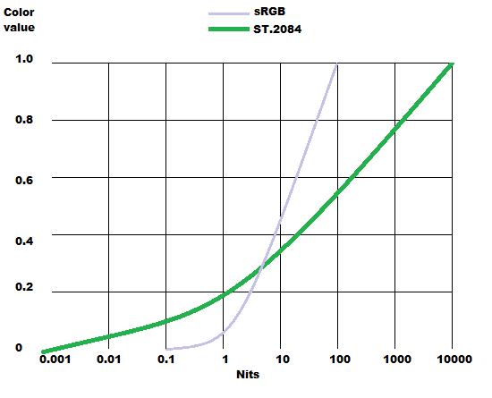
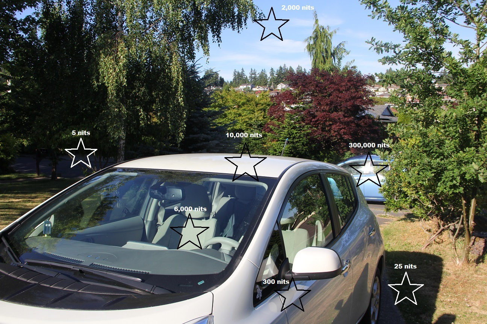
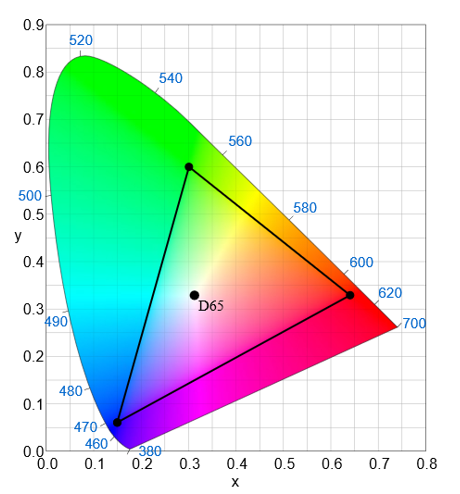
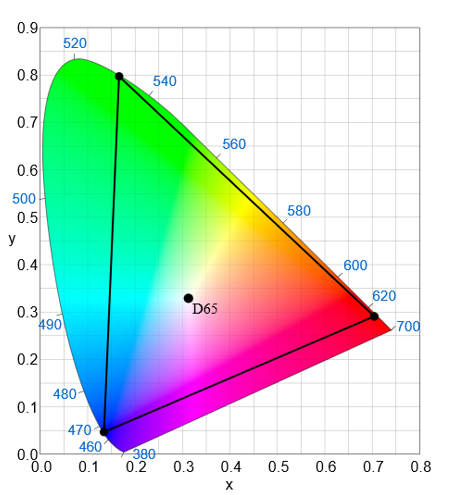

# High Dynamic Range and Wide Color Gamut

High Dynamic Range (HDR) displays a greater difference in light intensity from white to black, and Wide Color Gamut (WCG) provides a greater range of colors.

-   [High Dynamic Range and Wide Color Gamut Overview](#high-dynamic-range-and-wide-color-gamut-overview)
-   [HDR and WCG APIs](#hdr-and-wcg-apis)
-   [Related topics](#related-topics)

## High Dynamic Range and Wide Color Gamut Overview

In DXGI 1.5 there is support for HDR and WCG, both using a minimum of 10 bits (rather than 8 bits) per color. DXGI 1.5 provides support for HDR10, a 10 bit HDR/WCG format.

Current maximum brightness of displays is designed to support diffuse reflected surfaces, with nothing brighter than paper, referred to as "paper white". Paper white defines how bright white should be, for example in a controlled dark environment like a movie theater, 80 nits is typically used, in contrast to a PC monitor which could be 220 nits (one "nit" is short for one candela per square meter, and is a unit of light intensity). This enables a monitor screen to closely resemble what can be printed out. HDR is the display of pixel values above this paper white level so you can more accurately represent things like light sources, reflections of light sources, and similar bright objects, on screen, which is currently simulated by using a tone mapping operator, such as Reinhard.

Because of this additional capability, title content creators can now:

-   Represent more detail in bright and dark areas. The image below compares the color values the standards ST.2084 and sRGB can represent over a range of light intensity, measured in nits. The standard sRGB, in violet, shows that when light intensity reaches less than 0.1 nit or greater than 100 nit, there is no more differentiation in the color value. 

    |                                                                                        |
    |----------------------------------------------------------------------------------------|
    | ST.2084 provides detail in both the 100 to 10000 nit, and the 0.001 to 0.1 nit ranges. |
    |                                                     |

    

     

-   Clearly differentiate diffuse areas from specular highlights, for example metal surfaces now look much more like actual metal.
-   Differentiate specular highlights from light sources of different colors.
-   Differentiate true light sources from reflections.

Typically the areas of high intensity are small peaks, and are dynamic (quickly come and go) so the "average" intensity over a series of frames is usually not significantly different from a Standard Dynamic Range (SDR) frame. Users typically adjust their display to set an average luminance of an SDR frame for optimal eye comfort. If applications have too many high intensity frames, users can get fatigue.

The umbrella term Ultra-High Definition (UHD) for TV displays refers to a combination of HDR (branded as "UHD Premium" on current TVs), WCG, along with a high frame rate and greater pixel resolution. UHD is not synonymous though with 4K displays. Also, technically HDR refers only to the difference between the brightest whites and darkest blacks, though sometimes is used as a generic term to include WCG.

Currently most content is developed assuming paper white to be 80 to 100 "nits". Most current monitors peak at around 250 to 300 nits. This is well short of the sun's direct light on a metallic surface (around 10,000 nits), the sun's reflection on a glass or metallic surface (around 300,000 nits), and tiny compared with the Sun itself, at a blistering 1.6 billion nits.

At the other end of the spectrum, moonlight can be around 1 nit, and starlight down to 0.000001 of a nit.

A move to HDR displays will increase the peak light intensity, typically to around 1000 nits for LCD TV screens, and up to around 800 nits for OLED TV screens.

The relationship between the values stored for red, green and blue, and the actual colors rendered on a display, is determined by a color standard, such as the 8 bit variation of the color standard BT.709 (used on many current TVs, and very similar to the 8 bit sRGB on computer monitors). BT.709 as a standard also supports 10 bit color. The following images shows the increase in color range provided by the color standard BT.2020 (which has 10 and 12 bit variants). Although the most obvious improvement is the range of green values, note also the deeper reds, yellows and purples.

The images themselves are "xy chrominance" diagrams, which map out the "gamut" (range of valid colors) within a colorspace, and ignore the luminance (intensity) values. The overall horseshoe shape consists of all colors that are perceivable by the average human. The curved line that surrounds this shape with the blue numbers is the "spectral locus" (which is a plot of the monochromatic wavelength colors - laser light - going from 700nm to 380nm). The straight line at the bottom from violet to red are "nonpure" colors that can’t be represented with monochromatic light. This outside boundary of the horseshoe represents the purest (most saturated) colors that humans can perceive.

|                       |                        |
|-----------------------|------------------------|
| **BT.709**            | **BT.2020**            |
|  |  |

 

<dl> *BT.709 and BT.2020 images by CIExy1931.svg: Sakurambo derivative work: GrandDrake (CIExy1931.svg) \[CC BY-SA 3.0 (http://creativecommons.org/licenses/by-sa/3.0), CC BY-SA 2.5-2.0-1.0 (http://creativecommons.org/licenses/by-sa/2.5-2.0-1.0) or GFDL (http://www.gnu.org/copyleft/fdl.html)\], via Wikimedia Commons*  
</dl>

D65 is a definition of a "whitepoint". This whitepoint is used in most consumer electronics colorspaces, including sRGB. The triangle you see shows all of the colors that can be represented in a "3 channel additive colorspace" (combinations of R G and B light) such as the output from an LCD display. The xyY colorspace is defined such that you can calculate all of the possible colors that you can obtain via a combination of two lights (for example, a point at pure red and second point at pure green LCD output) by drawing a straight line between these two points.

As displays support greater ranges of color and luminance (e.g. HDR), apps should take advantage of this by increasing bit depth. 10-bit/channel color is an excellent starting point. 16-bit/channel color may work well in some cases. Games that want to use HDR to drive an HDR display (a TV or Monitor) will want to use at least 10bit, but could also consider using 16bit floating point, for the format for the final swap chain.

## HDR and WCG APIs

In order to enable HDR and WCG in your app, refer to the following APIs.

-   [**IDXGISwapChain4::SetHDRMetaData**](/windows/desktop/api/dxgi1_5/nf-dxgi1_5-idxgiswapchain4-sethdrmetadata) : sets High Dynamic Range (HDR) and Wide Color Gamut (WCG) header metadata.
-   [**DXGI\_HDR\_METADATA\_HDR10**](/windows/desktop/api/dxgi1_5/ns-dxgi1_5-dxgi_hdr_metadata_hdr10) : structure containing the metadata settings.
-   [**DXGI\_HDR\_METADATA\_TYPE**](/windows/desktop/api/dxgi1_5/ne-dxgi1_5-dxgi_hdr_metadata_type) : enum identifying the type of header metadata.
-   [**DXGI\_COLOR\_SPACE\_TYPE**](/windows/desktop/api/dxgicommon/ne-dxgicommon-dxgi_color_space_type) : defines the colorspace (sRGB, YCbCr), color range, gamma settings, and other details of the color format.

## Related topics

<dl> <dt>

[DXGI 1.5 Improvements](dxgi-1-5-improvements.md)
</dt> <dt>

[Programming Guide for DXGI](dx-graphics-dxgi-overviews.md)
</dt> </dl>

 

 

