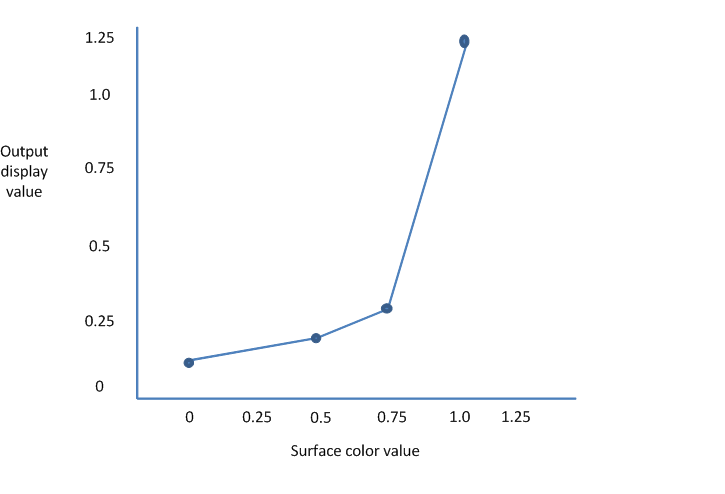

# Using gamma correction

Gamma correction, or gamma for short, is the name of a nonlinear operation that systems use to code and decode pixel values in images.

-   [What is gamma and what is it for?](#what-is-gamma-and-what-is-it-for)
-   [Background of gamma on Windows](#background-of-gamma-on-windows)
-   [Evolution of display hardware](#evolution-of-display-hardware)
-   [Gamma control capabilities in DXGI](#gamma-control-capabilities-in-dxgi)
-   [Setting gamma control with DXGI](#setting-gamma-control-with-dxgi)
-   [Gamma control practicalities](#gamma-control-practicalities)
-   [Related topics](#related-topics)

## What is gamma and what is it for?

At the end of the graphics pipeline, just where the image leaves the computer to make its journey along the monitor cable, there is a small piece of hardware that can transform pixel values on the fly. This hardware typically uses a lookup table to transform the pixels. This hardware uses the red, green and blue values that come from the surface to be displayed to look up gamma-corrected values in the table and then sends the corrected values to the monitor instead of the actual surface values. So, this lookup table is an opportunity to replace any color with any other color. While the table has that level of power, the typical usage is to tweak images subtly to compensate for differences in the monitor’s response. The monitor’s response is the function that relates the numerical value of the red, green and blue components of a pixel with that pixel’s displayed brightness.

That’s what this table was intended for, but game developers found creative uses for it, such as flashing the whole screen red for psychological effect. In modern game apps, as part of the post-processing of each frame, we typically provide other ways to do such things. In fact, we recommend that you leave the gamma table alone because it might be in use to calibrate the monitor’s response, and wholesale changes to the gamma ramp will destroy this careful calibration.

The science of determining gamma correction is complex, and is not presented here, other than to illuminate where the name “gamma” came from. A CRT (that is, an old-fashioned glass) monitor’s response is a complex function, but the physics of these monitors mean that they exhibit a response that can be crudely represented by this power function:

brightness( input ) = inputgamma

The gamma value is typically close to a value of 2.0. LCD monitors and all other newer technologies are specifically engineered to exhibit a similar response so all our software and images don’t have to be recalibrated for those new technologies. The sRGB standard declares that this gamma value is exactly 2.2, and this value has become a widely implemented standard.

The human eye also has a response function which approximately inverts the CRT power function. This means that the perceived brightness of a pixel goes up very roughly linearly with the RGB values in that pixel.

Because a gamma value of 2.2 has become a de-facto standard, we typically don’t need to worry too much about the gamma curve encoded in this table, and can leave it as a linear, one-to-one mapping. Proper color matching does of course require exquisite care with this function, but that discussion is beyond the scope of this topic. Windows includes a tool that lets users calibrate their displays to gamma 2.2, and this tool uses the lookup table hardware to derive a carefully-chosen subtle tweak for their computers. Users can run this tool by searching for "calibrate color". There are also well-defined color profiles for particular monitors that automate this process. The "calibrate color" tool can detect these newer monitors, and inform users that calibration is already in place.

This notion of encoding a power law into color values is useful elsewhere in the graphics pipeline too, especially in textures. For textures, you want more precision on darker colors because of the logarithmic human eye response we just talked about. Careful handling of gamma in this part of the pipeline is important. For more info, see [Converting data for the color space](converting-data-color-space.md).

The remainder of this topic focuses only on gamma correction in this last part of the pipeline, between the frame buffer data and the monitor. If you want to write a calibration wizard or to create special effects in a full-screen app where a post-processing step is not practical, here is the info you need.

## Background of gamma on Windows

Windows computers typically have a gamma table that is a lookup table that takes a triplet of bytes and outputs a triplet of bytes. These triplets are 768 (256 x 3) bytes of RAM. This is fine when your display format contains a triplet of RGB BYTE values but isn't expressive enough to describe the transformations that you might want when the display format has a greater range than \[0,1\], such as floating point values. The APIs in Windows that control gamma have followed an evolution as display formats have become more complex.

The first Windows APIs to offer gamma control are Windows Graphics Device Interface (GDI)’s [**SetDeviceGammaRamp**](/windows/win32/api/wingdi/nf-wingdi-setdevicegammaramp) and [**GetDeviceGammaRamp**](/windows/win32/api/wingdi/nf-wingdi-getdevicegammaramp). These APIs work with three 256-entry arrays of WORDs, with each WORD encoding zero up to one, represented by WORD values 0 and 65535. The extra precision of a WORD typically isn’t available in actual hardware lookup tables, but these APIs were intended to be flexible. These APIs, in contrast to the others described later in this section, allow only a small deviation from an identity function. In fact, any entry in the ramp must be within 32768 of the identity value. This restriction means that no app can turn the display completely black or to some other unreadable color.

The next API is Microsoft Direct3D 9’s [**SetGammaRamp**](/windows/win32/api/d3d9helper/nf-d3d9helper-idirect3ddevice9-setgammaramp), which follows the same pattern and data format as [**SetDeviceGammaRamp**](/windows/win32/api/wingdi/nf-wingdi-setdevicegammaramp). The default value of the Direct3D 9 gamma ramp is not particularly useful; it is a ramp of WORDs initialized to 0-255, not 0-65535, even though the API is defined in terms of 0-65535.

The latest API is [**IDXGIOutput::SetGammaControl**](/windows/desktop/api/DXGI/nf-dxgi-idxgioutput-setgammacontrol). This API has a more flexible scheme to express gamma control, as befits DXGI’s increased set of display formats, including ten integer bits-per-channel, 16-bit float formats and the XR\_BIAS extended range format.

All of these APIs operate on the same hardware, and change the same values. The Direct3D 9 and DXGI APIs are “write only”. You can't read the value of the hardware, modify it, and then set it. You can only set the ramp. Furthermore, you can only set gamma when the app is full screen. This restriction is another way to guarantee that the desktop is always readable. That is, the app can disturb its own display, but Windows will restore the previous gamma ramp when the app loses full screen (for example, via alt-tab or ctrl-alt-del).

## Evolution of display hardware

Some newer monitors can display a wide range of intensities. But, when the display format can represent only values between zero and one, the display must map zero to its darkest value and one to its brightest value. This brightest value might be far too bright for comfortable viewing of Web pages with black text on a white background but is wonderful for over-bright special effects, such as viewing sunlight glittering off of a lake or lightning forking the sky. So, we need a way to express these wider ranges. DXGI 1.1 and later contains display format values that let 1.0 represent a comfortable white value and reserves wider display format values for over-bright special effects. DXGI 1.1 supports two display formats that can express these wider values: DXGI\_FORMAT\_R10G10B10\_XR\_BIAS\_A2\_UNORM and 16-bit floating point. For a full discussion of these formats, see [Details of the Extended Format](/windows-hardware/drivers/display/details-of-the-extended-format). Next, we look at why DXGI’s [**IDXGIOutput::SetGammaControl**](/windows/desktop/api/DXGI/nf-dxgi-idxgioutput-setgammacontrol) gamma API needs pixel values greater than 1.0.

## Gamma control capabilities in DXGI

DXGI lets the display driver express its gamma controls as a step-wise linear function. This step-wise linear function is defined by the control points of this function, the range of values the function can convert to, and an additional optional scale-and-offset operation that can be applied after conversion. An app can call the [**IDXGIOutput::GetGammaControlCapabilities**](/windows/desktop/api/DXGI/nf-dxgi-idxgioutput-getgammacontrolcapabilities) method to retrieve all of these control capabilities in the [**DXGI\_GAMMA\_CONTROL\_CAPABILITIES**](/previous-versions/windows/desktop/legacy/bb173062(v=vs.85)) structure.

This graph shows a linear function with just four control points.

DXGI defines control points by their location along the surface color axis. In the preceding graph, the locations of the control points are 0, 0.5, 0.75 and 1.0. These control points indicate that the hardware can convert values in the range 0 through 1.0. DXGI lists these control points in the **ControlPointPositions** array member of [**DXGI\_GAMMA\_CONTROL\_CAPABILITIES**](/previous-versions/windows/desktop/legacy/bb173062(v=vs.85)) and always declares them in increasing order. DXGI fills only the first elements of the **ControlPointPositions** array and indicates the number of elements with the **NumGammaControlPoints** member of **DXGI\_GAMMA\_CONTROL\_CAPABILITIES**. If **NumGammaControlPoints** is less than 1025, DXGI leaves the rest of the **ControlPointPositions** elements undefined.

The hardware represented by this graph can convert values to a range of 0 through 1.25. So, DXGI sets the **MinConvertedValue** and **MaxConvertedValue** members to 0.0f and 1.25f respectively.

DXGI sets the **ScaleAndOffsetSupported** member of [**DXGI\_GAMMA\_CONTROL\_CAPABILITIES**](/previous-versions/windows/desktop/legacy/bb173062(v=vs.85)) to indicate whether the hardware supports the scale-and-offset capability. If hardware supports scale-and-offset, it keeps a simple one-to-one lookup table but then adjusts the output of the table to stretch the output to a range greater than \[0,1\]. The hardware first scales the values that come out of the lookup table and then offsets them.

> [!Note]  
> Different monitors connected to the same computer might have different gamma control capabilities. Moreover, the gamma control capabilities can in fact change depending on the display mode of the output. Consequently, we recommend that you always call [**IDXGIOutput::GetGammaControlCapabilities**](/windows/desktop/api/DXGI/nf-dxgi-idxgioutput-getgammacontrolcapabilities) to query gamma control capabilities after your app enters full-screen mode.

 

You can use these gamma control capability values to derive control values that you can then set by using the [**IDXGIOutput::SetGammaControl**](/windows/desktop/api/DXGI/nf-dxgi-idxgioutput-setgammacontrol) API.

## Setting gamma control with DXGI

To set gamma controls, you pass a pointer to a [**DXGI\_GAMMA\_CONTROL**](/previous-versions/windows/desktop/legacy/bb173061(v=vs.85)) structure when you call the [**IDXGIOutput::SetGammaControl**](/windows/desktop/api/DXGI/nf-dxgi-idxgioutput-setgammacontrol) API.

You set the **Scale** and **Offset** members of [**DXGI\_GAMMA\_CONTROL**](/previous-versions/windows/desktop/legacy/bb173061(v=vs.85)) to specify the scale and offset values that you want the hardware to apply to the values that you get from the lookup table. You can safely set **Scale** to 1 and **Offset** to zero (that is, a scale by one has no effect and an offset of zero has no effect) if you don't want to use the scale-and-offset capability or if the hardware doesn't have that capability.

You set the **GammaCurve** array member of [**DXGI\_GAMMA\_CONTROL**](/previous-versions/windows/desktop/legacy/bb173061(v=vs.85)) to a list of [**DXGI\_RGB**](/previous-versions/windows/desktop/legacy/bb173071(v=vs.85)) structures for the points on the gamma curve. Each **DXGI\_RGB** element specifies the float values that represent the red, green, and blue components for that point. The gamma curve doesn't use alpha values. You use the number that you obtained from **NumGammaControlPoints** of [**DXGI\_GAMMA\_CONTROL\_CAPABILITIES**](/previous-versions/windows/desktop/legacy/bb173062(v=vs.85)) to fill that number of elements in the **GammaCurve** array. Each element that you place in the **GammaCurve** array is the height for each control point.

Notice in the preceding graph that you now have control over the vertical placement of each control point, and you have separate control for red, green and blue. For example, you can set all of the green and blue values to zero and set the red values to an ascending staircase from zero to one. In this scenario, the displayed image shows only its red parts, with the blue and green appearing as black. You can also set a descending staircase for all colors, which results in an inverted display. Any value you place in the **GammaCurve** array must be inclusively within the values you obtained from the **MinConvertedValue** and **MaxConvertedValue** members of [**DXGI\_GAMMA\_CONTROL\_CAPABILITIES**](/previous-versions/windows/desktop/legacy/bb173062(v=vs.85)).

## Gamma control practicalities

DXGI’s gamma controls apply only as long as the app is full screen. Windows restores the previous state of the display when the app exits or returns to windowed mode. But Windows doesn’t restore your app’s gamma state if the app re-enters full-screen mode. Your app must explicitly restore its gamma state when it re-enters full-screen mode.

Not all adapters support gamma control. If an adapter doesn't support gamma control, it ignores calls to set a gamma ramp.

Apps that run under remote desktop can't control gamma at all.

The mouse cursor, if it is implemented in hardware (as most are), typically doesn't respond to the gamma setting.

## Related topics

<dl> <dt>

[Programming Guide for DXGI](dx-graphics-dxgi-overviews.md)
</dt> </dl>

 

 
