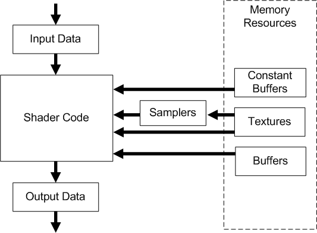

# Common-Shader Core

In Shader Model 4, all shader stages implement the same base functionality using a common-shader core. In addition, each of the three shader stages (vertex, geometry, and pixel) offer functionality unique to each stage, such as the ability to generate new primitives from the geometry shader stage or to discard a specific pixel in the pixel shader stage. The following diagram shows how data flows through a shader stage, and the relationship of the common-shader core with shader memory resources.

-   **Input Data**: A vertex shader receives its inputs from the input assembler stage; geometry and pixel shaders receive their inputs from the previous shader stage. Additional inputs include [system-value semantics](dx-graphics-hlsl-semantics.md), which are consumable by the first unit in the pipeline to which they are applicable.
-   **Output Data**: Shaders generate output results to be passed onto the subsequent stage in the pipeline. For a geometry shader, the amount of data output from a single invocation can vary. Some outputs are interpreted by the common-shader core (such as vertex position and render-target-array index), others are designed to be interpreted by an application.
-   **Shader Code**: Shaders can read from memory, perform vector floating point and integer arithmetic operations, or flow control operations. There is no limit to the number of statements that can be implemented in a shader.
-   **Samplers**: Samplers define how to sample and filter textures. As many as 16 samplers can be bound to a shader simultaneously.
-   **Textures**: Textures can be filtered using samplers or read on a per-texel basis directly with the [load](dx-graphics-hlsl-to-load.md) intrinsic function.
-   **Buffers**: Buffers are never filtered, but can be read from memory on a per-element basis directly with the [load](dx-graphics-hlsl-to-load.md) intrinsic function. As many as 128 texture and buffer resources (combined) can be bound to a shader simultaneously.
-   **Constant Buffers**: Constant buffers are optimized for shader constant-variables. As many as 16 constant buffers can be bound to a shader stage simultaneously. They are designed for more frequent update from the CPU; therefore, they have additional size, layout, and access restrictions.

Differences between Direct3D 9 and Direct3D 10:

- In Direct3D 9, each shader unit had a single, small constant register file to store all constant shader variables. Accommodating all shaders with this limited constant space required frequent recycling of constants by the CPU.
- In Direct3D 10, constants are stored in immutable buffers in memory and are managed like any other resource. There is no limit to the number of constant buffers an application can create. By organizing constants into buffers by frequency of update and usage, the amount of bandwidth required to update constants to accommodate all shaders can be significantly reduced.

 

## Integer and Bitwise Support

The common shader core provides a full set of IEEE-compliant 32-bit integer and bitwise operations. These operations enable a new class of algorithms in graphics hardware examples include compression and packing techniques, FFTs, and bitfield program-flow control.

The **int** and **uint** data types in Direct3D 10 HLSL map to 32-bit integers in hardware.

|                                                                                                                                                                                                                                                                                                                                                                                                                                                                                                              |
|--------------------------------------------------------------------------------------------------------------------------------------------------------------------------------------------------------------------------------------------------------------------------------------------------------------------------------------------------------------------------------------------------------------------------------------------------------------------------------------------------------------|
| Differences between Direct3D 9 and Direct3D 10:  In Direct3D 9 stream inputs marked as integer in HLSL were interpreted as floating-point. In Direct3D 10, stream inputs marked as integer are interpreted as a 32- bit integer.  In addition, boolean values are now all bits set or all bits unset. Data converted to **bool** will be interpreted as true if the value is not equal to 0.0f (both positive and negative zero are allowed to be false) and false otherwise.  |

 

## Bitwise operators

The common shader core supports the following bitwise operators:

| Operator  | Function          |
|-----------|-------------------|
| ~         | Logical Not       |
| <<  | Left Shift        |
| >>  | Right Shift       |
| &         | Logical And       |
| \|        | Logical Or        |
| ^         | Logical Xor       |
| <<= | Left shift Equal  |
| >>= | Right Shift Equal |
| &=        | And Equal         |
| \|=       | Or Equal          |
| ^=        | Xor Equal         |

 

Bitwise operators are defined to operate only on **int** and **uint** data types. Attempting to use bitwise operators on **float** or **struct** data types will result in an error. Bitwise operators follow the same precedence as C with regard to other operators.

## Binary Casts

Casting between an integer and a floating-point type will convert the numeric value following C truncation rules. Casting a value from a **float**, to an **int**, and back to a **float** is a lossy conversion dependent on the precision of the target data type. Here are some of the conversion functions: [**asfloat (DirectX HLSL)**](dx-graphics-hlsl-asfloat.md), [**asint (DirectX HLSL)**](dx-graphics-hlsl-asint.md), [**asuint (DirectX HLSL)**](dx-graphics-hlsl-asuint.md).

Binary casts can also be performed using HLSL intrinsic functions. These cause the compiler to reinterpret the bit representation of a number into the target data type.

## Related topics

<dl> <dt>

[Shader Model 4](dx-graphics-hlsl-sm4.md)
</dt> </dl>

 

 

