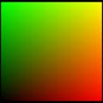

# texcoord - ps

Interprets texture coordinate data (UVW1) as color data (RGBA).

## Syntax


| texcoord dst |
|--------------|


 

where

-   dst is the destination register.

## Remarks


| Pixel shader versions | 1\_1 | 1\_2 | 1\_3 | 1\_4 | 2\_0 | 2\_x | 2\_sw | 3\_0 | 3\_sw |
|-----------------------|------|------|------|------|------|------|-------|------|-------|
| texcoord              | x    | x    | x    |      |      |      |       |      |       |


 

This instruction interprets the texture coordinate set (UVW1) corresponding to the destination register number as color data (RGBA). If the texture coordinate set contains fewer than three components, the missing components are set to 0. The fourth component is always set to 1. All values are clamped between 0 and 1.

The advantage of texcoord is that it provides a way to pass vertex data interpolated at high precision directly into the pixel shader. However, when the data is written into the destination register, some precision will be lost, depending on the number of bits used by the hardware for registers.

No texture is sampled by this instruction. Only texture coordinates set on this texture stage are relevant.

Any texture data (such as position, normal, and light source direction) can be mapped by a vertex shader into a texture coordinate. This is done by associating a texture with a texture register using [**SetTexture**](/windows/desktop/direct3d9/id3dxbaseeffect--settexture) and by specifying how the texture sampling is done using [**SetTextureStageState**](/windows/desktop/api/d3d9helper/nf-d3d9helper-idirect3ddevice9-settexturestagestate). If the fixed function pipeline is used, be sure to supply the TSS\_TEXCOORDINDEX flag.

This instruction is used as follows:


```
texcoord tn
```


An [Texture Coordinate Register](dx9-graphics-reference-asm-ps-registers-texture-coordinate.md) (tn) contains four color values (RGBA). The data can also be thought of as vector data (xyzw). texcoord will retrieve three of these values (xyz) from texture coordinate set x, and the fourth component (w) is set to 1. The texture address is copied from the texture coordinate set n. The result is clamped between 0 and 1.

This example is for illustration only. The C code accompanying the shader has not been optimized for performance.

Here is an example shader using texcoord.


```
ps_1_1        ; version instruction
texcoord t0   ; declare t0 hold texture coordinates, 
              ; which represent rgba values in this example
mov r0, t0    ; move the color in t0 to output register r0
```


The rendered output from the pixel shader is shown in the following illustration. The (u,v,w,1) coordinate values map to the (rgb) channels. The alpha channel is set to 1. At the corners of the illustration, coordinate (0,0,0,1) is interpreted as black; (1,0,0,1) is red; (0,1,0,1) is green; and (1,1,0,1) contains green and red, producing yellow.



Additional code is required to use this shader and an example scenario is shown below.


```
// This code creates the shader from a file. The contents of  
// the shader file can also be supplied as a text string.
LPD3DXBUFFER        pCode;

// Assemble the vertex shader from the file
D3DXAssembleShaderFromFile(strPShaderPath, 0, NULL, &pCode, NULL);
m_pd3dDevice->CreatePixelShader((DWORD*)pCode->GetBufferPointer(),
                   &m_hPixelShader);
pCode->Release();

// This code defines the object vertex data
struct CUSTOMVERTEX
{
    FLOAT x, y, z;
    FLOAT tu1, tv1;
};

#define D3DFVF_CUSTOMVERTEX (D3DFVF_XYZ|D3DFVF_TEX1|TEXCOORD2(0))

static CUSTOMVERTEX g_Vertices[]=
{
    //  x      y     z     u1    v1   
    { -1.0f, -1.0f, 0.0f, 0.0f, 0.0f, },
    { +1.0f, -1.0f, 0.0f, 1.0f, 0.0f, },
    { +1.0f, +1.0f, 0.0f, 1.0f, 1.0f, },
    { -1.0f, +1.0f, 0.0f, 0.0f, 1.0f, },
};
```


## Related topics

<dl> <dt>

[Pixel Shader Instructions](dx9-graphics-reference-asm-ps-instructions.md)
</dt> </dl>

 

 