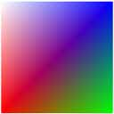
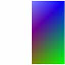

# texkill - ps

Cancels rendering of the current pixel if any of the first three components (UVW) of the texture coordinates is less than zero.

## Syntax


| texkill dst |
|-------------|


 

where

-   dst is a destination register

## Remarks


| Pixel shader versions | 1\_1 | 1\_2 | 1\_3 | 1\_4 | 2\_0 | 2\_x | 2\_sw | 3\_0 | 3\_sw |
|-----------------------|------|------|------|------|------|------|-------|------|-------|
| texkill               | x    | x    | x    | x    | x    | x    | x     | x    | x     |


 

This instruction corresponds to the HLSL's [**clip**](dx-graphics-hlsl-clip.md) function.

texkill does not sample any texture. It operates on the first three components of the texture coordinates given by the destination register number. For ps\_1\_4, texkill operates on the data in the first three components of the destination register.

You can use this instruction to implement arbitrary clip planes in the rasterizer.

When using vertex shaders, the application is responsible for applying the perspective transform. This can cause problems for the arbitrary clipping planes because if it contains anisomorphic scale factors, the clip planes need to be transformed as well. Therefore, it is best to provide an unprojected vertex position to use in the arbitrary clipper, which is the texture coordinate set identified by the texkill operator.

This instruction is used as follows:

<dl> texkill tn  
// The pixel masking is accomplished as follows:  
if ( the x,y,z components of TextureCoordinates(stage n)<sub>UVWQ</sub>< 0 )  
cancel pixel render  
</dl>

For pixel shader 1\_1, 1\_2, and 1\_3, texkill operates on the texture coordinate set given by the destination register number. In version 1\_4, however, texkill operates on the data contained in the [Texture Coordinate Register](dx9-graphics-reference-asm-ps-registers-texture-coordinate.md) (tn) or in the temporary register (rn) that has been specified as the destination.

When multisampling is enabled, any antialiasing effect achieved on polygon edges due to multisampling will not be achieved along any edge that has been generated by texkill. The pixel shader runs once per pixel.

This example is for illustration only.

This example masks out pixels that have negative texture coordinates. The pixel colors are interpolated from vertex colors provided in the vertex data.


```
ps_1_1       // Version instruction
texkill t0   // Mask out pixel using texture coordinates from stage 0
mov r0, v0   // Move the diffuse color in v0 to r0

// The rendered output from the pixel shader is shown below
```


The texture coordinates range from -0.5 to 0.5 in u, and 0.0 to 1.0 in v. This instruction causes the negative u values to get masked out. The first illustration below shows the vertex color applied to the quad without the texkill instruction applied. The second illustration below shows the result of the texkill instruction. The pixel colors from the texture coordinates below 0 (where x goes from -0.5 to 0.0) are masked out. The background color (white) is used where the pixel color is masked.



The texture coordinate data is declared in the vertex data declaration in this example.


```
   
struct CUSTOMVERTEX
{
    FLOAT x, y, z;
    DWORD color;
    FLOAT tu1, tv1;
};

#define D3DFVF_CUSTOMVERTEX (D3DFVF_XYZ|D3DFVF_DIFFUSE|D3DFVF_TEX1|D3DTEXCOORD2(0))

static CUSTOMVERTEX g_Vertices[]=
{
    //  x      y     z    color         u1,    v1  
    { -1.0f, -1.0f, 0.0f, 0xffff0000, -0.5f,  1.0f, },
    {  1.0f, -1.0f, 0.0f, 0xff00ff00,  0.5f,  1.0f, },
    {  1.0f,  1.0f, 0.0f, 0xff0000ff,  0.5f,  0.0f, },
    { -1.0f,  1.0f, 0.0f, 0xffffffff, -0.5f,  0.0f, },

};
```


## Related topics

<dl> <dt>

[Pixel Shader Instructions](dx9-graphics-reference-asm-ps-instructions.md)
</dt> </dl>

 

 


